# concernedItems 跨设备同步闭环计划

## 现状结论（基于代码与历史）

- 当前 `followConfig.relatedMessages` 仍是本地 `chrome.storage.local` 运行态数据（`updateRelatedMessages` 直接写本地）。
- 当前有“远端存储关联消息内容”，但不是可直接驱动 UI 的命中同步：`storeRelatedMessage()` 仅把消息通过 `MemoryServiceClient.ingest` 写入 `messages_raw.metadata_json`。
- 目前没有按 `followItemId` 拉取命中记录并回填本地 `relatedMessages` 的 API/流程，所以 **A 设备无法直接看到 B 设备命中的 follow-up 结果**。
- 历史上（`bdd8db7`）曾写入 Chroma 集合 `${username}-followed_thread_messages`；迁移到 memory-service（`8b2cc01`）后改为 ingest，但缺少“命中回传查询层”。

## 目标场景

- A 设备配置关注规则。
- B 设备跑消息分析并命中关注后续。
- A 设备在 `glip` 消息列表和 `memory-exploring` 中看到命中结果。

## 方案决策（已确认）

- 配置同步：`concernedItems` 快照同步（本地优先 + 异步同步）。
- 命中同步：采用“命中事件回传”而非直接全量同步 `relatedMessages` 数组。

## 本次补充结论（关于“是否需要本地缓存”）

- **需要保留本地缓存**，且建议继续以 `chrome.storage.local.concernedItems` 作为扩展运行态唯一共享数据源。
- 这里的“本地缓存”不是额外再做一层复杂缓存；现有 `chrome.storage.local` 本身就应承担这个角色，不建议改成“只从接口拉取后放在某个内存变量里”。
- 原因不是单纯性能，而是运行模型：
  - `message_analysis` 每次执行都会重新读取本地 `concernedItems`，并没有常驻内存副本；只要后台先把远端快照同步到本地，下一次分析天然就会吃到最新值。
  - `glip` 装饰层、`FollowThreadHandler`、`agentWorkflow.concernedItemMatcher`、`topic-modal`、`memory-exploring`/`FollowThreads` 等多个上下文都直接读 `chrome.storage.local`，如果改成“只存在某个变量里”，这些路径都拿不到统一状态。
  - Manifest V3 的 background service worker 会休眠重启，纯内存变量不可靠，不能作为跨上下文、跨唤醒周期的配置源。
  - `chrome.storage.onChanged` 已经被 `glip` 页面用于热更新视觉标识，本地缓存天然提供“写回即广播”的能力。
- 因此更合适的模型是：**远端是跨设备同步源，本地是运行态缓存/展示源**；分析链路和 UI 继续读本地，不在每条消息分析时直接请求接口。

## 本次补充结论（关于“是否会每次分析消息都拉接口”）

- 如果按本计划落地为“远端同步到本地，再由分析逻辑读本地”，则**不会**在每条消息分析时都请求接口。
- 现有 `analyzeMessagesInBackground()` 在一次分析任务开始时只读取一次本地 `concernedItems`；之后本轮任务都使用这个快照。
- 如果改成“在分析器里直接拉接口”，则至少会变成“每次分析任务拉一次远端”，而不是“每条消息拉一次”；但由于还有其它代码路径也会读取 `concernedItems`，最终很容易演化成多个上下文各自打接口，不适合作为主方案。
- 因此不建议把接口请求塞进消息逐条分析路径，建议把远端访问收敛到 `ConcernedItemsSyncService`。

## 本次补充结论（关于“A 改、B 不重启是否自动生效”）

- **当前代码做不到**。现在没有 concernedItems 的跨设备配置拉取流程，B 设备只能用自己的本地 `chrome.storage.local`。
- **按本 plan 调整后可以做到“无需重启定时静默分析，自动最终一致生效”**，但前提是：
  - 静默分析启动时先拉一次远端快照；
  - 后台有周期 pull；
- 这样 B 设备不需要重启 alarm/task scheduler；因为调度器本身不缓存 `concernedItems`，它每次执行分析时都会重新读本地。
- 边界说明：如果 A 在 B 完成启动拉取之后、下一次周期同步之前修改规则，那么 B 会继续使用旧本地快照，直到下一个同步周期把新配置写回本地后才会在后续分析中生效。这是可接受的最终一致性边界。

## 本次补充结论（关于“配置冲突如何决策”）

- 配置同步继续保持“整份快照覆盖”模型，不做 item 级 merge。
- 但冲突判定不再采用“谁先同步成功谁赢”，而改为 **最后编辑者赢（Last Edit Wins）**。
- 这里比较的必须是“配置内容最后一次被用户修改的时间”，而不是“这次同步请求抵达服务端的时间”。
- 原因是设备可能离线或延迟同步；如果比较的是服务端入库时间，会把“晚同步但其实更早编辑”的旧内容错误地判成更新版本。
- 因此需要为配置快照单独维护一个逻辑时间字段，例如 `content_updated_at`：
  - 本地每次用户修改 `concernedItems` 时更新该时间；
  - push 时把该时间一并上传；
  - 服务端以 `incoming.content_updated_at` 和 `current.content_updated_at` 比较，新者覆盖旧者。
- 如果两个快照时间完全相同，需要一个固定 tie-breaker，建议“相同时间时保留服务端当前版本”或“按 deviceId 做稳定排序”，避免非确定性结果。

## 后端改造（memory-service）

- 新增迁移 `[/Users/Esone/git/personal-ai/memory-service/src/storage/migrations/006_concerned_items.sql](/Users/Esone/git/personal-ai/memory-service/src/storage/migrations/006_concerned_items.sql)`
  - `concerned_items_state`：每用户单行配置快照（`items_json`, `version`, `updated_at`, `updated_by_device`）。
  - `follow_thread_hits`：命中事件表（`id`, `follow_item_id`, `post_id`, `sender`, `datetime`, `relation_type`, `summary`, `team_id`, `created_at`, `source_device`）。
  - 唯一约束：`UNIQUE(follow_item_id, post_id)`，用于跨设备去重。
- 新增路由 `[/Users/Esone/git/personal-ai/memory-service/src/routes/concernedItems.ts](/Users/Esone/git/personal-ai/memory-service/src/routes/concernedItems.ts)`
  - `GET /api/v1/concerned-items` -> `{ items, version, updatedAt }`
  - `PUT /api/v1/concerned-items` -> 基于 `baseVersion` 乐观并发，冲突 `409` 返回服务端当前快照
- 新增路由 `[/Users/Esone/git/personal-ai/memory-service/src/routes/followThreadHits.ts](/Users/Esone/git/personal-ai/memory-service/src/routes/followThreadHits.ts)`
  - `POST /api/v1/follow-thread-hits`：写入命中事件（幂等，重复命中不重复插入）
  - `GET /api/v1/follow-thread-hits?since=&followItemIds=`：按增量时间与关注项拉取
- 在 `[/Users/Esone/git/personal-ai/memory-service/src/server.ts](/Users/Esone/git/personal-ai/memory-service/src/server.ts)` 注册以上路由。
- 新增测试 `[/Users/Esone/git/personal-ai/memory-service/src/__tests__/api-concerned-items.test.ts](/Users/Esone/git/personal-ai/memory-service/src/__tests__/api-concerned-items.test.ts)`、`[/Users/Esone/git/personal-ai/memory-service/src/__tests__/api-follow-thread-hits.test.ts](/Users/Esone/git/personal-ai/memory-service/src/__tests__/api-follow-thread-hits.test.ts)`。

## 扩展端改造（src）

- 在 `[/Users/Esone/git/personal-ai/src/services/MemoryServiceClient.ts](/Users/Esone/git/personal-ai/src/services/MemoryServiceClient.ts)` 新增客户端方法：
  - `getConcernedItemsSnapshot()` / `putConcernedItemsSnapshot()`
  - `postFollowThreadHit()` / `getFollowThreadHits()`
- 新增同步服务 `[/Users/Esone/git/personal-ai/src/services/ConcernedItemsSyncService.ts](/Users/Esone/git/personal-ai/src/services/ConcernedItemsSyncService.ts)`
  - 配置快照同步（字段白名单：含 `followConfig`，不含运行态 `relatedMessages/lastCheckedAt/lastNotifiedAt`）
  - 命中事件增量拉取（按 `lastHitSyncAt`）并合并入本地 `concernedItems.followConfig.relatedMessages`
  - 对外提供启动拉取与周期同步能力；内部做节流，避免短时间重复拉取
- 在 `[/Users/Esone/git/personal-ai/src/background.ts](/Users/Esone/git/personal-ai/src/background.ts)`
  - 监听 `chrome.storage.onChanged` 对 `concernedItems` 去抖 push
  - 周期 alarm：pull 配置快照 + pull 命中事件
  - 启动静默分析时执行一次初始化拉取
- 在 `[/Users/Esone/git/personal-ai/src/message-reaction/FollowThreadHandler.ts](/Users/Esone/git/personal-ai/src/message-reaction/FollowThreadHandler.ts)`
  - 现有 `updateRelatedMessages` 本地写保留（保证即时展示）
  - 新增命中事件上报调用（不阻塞主流程，失败重试/忽略）

## 展示层兼容

- `glip` 装饰与 `memory-exploring` 页面继续读取本地 `concernedItems`，无需改成远端直读。
- 通过后台“命中事件回填本地”让 A 设备获得 B 设备命中结果。
- `glip` 已有 `chrome.storage.onChanged` 监听，本地写回后可自动重绘。
- `memory-exploring` 首页统计与 `FollowThreads` 当前是“mounted 时读取一次”，若希望页面已经打开时也自动看到同步结果，需要补 `storage.onChanged` 监听或在页面重新可见时刷新。

## 冲突与一致性策略

- 配置：整份快照覆盖 + 最后编辑者赢（基于 `content_updated_at` 的 LWW）；不做 item 级 merge。
- 命中：事件幂等（`follow_item_id + post_id` 唯一），天然可重放。
- 本地合并：按 `postId` 去重，不覆盖已有更完整摘要字段。

## 验证清单

- A 创建/编辑关注规则，B 在 1 个同步周期内拿到并参与匹配。
- B 不重启定时静默分析，仍可在下一个同步周期后自动拿到最新 concernedItems。
- B 命中关注后续后，A 在同步周期内可在 `glip` 和 `FollowThreads` 看到新增关联。
- 断网后本地命中不丢；恢复网络后事件补传成功。

```mermaid
flowchart LR
AConfig[ADeviceSetConcernedItems] --> ALocal[ALocalStorage]
ALocal --> SyncCfg[ConcernedItemsSyncService]
SyncCfg --> CfgAPI[MemoryServiceConcernedItemsAPI]
CfgAPI --> BSync[BDevicePullConfig]
BSync --> BLocal[BLocalStorage]
BLocal --> BAnalyze[BMessageAnalyze]
BAnalyze --> HitPost[POSTFollowThreadHit]
HitPost --> HitStore[FollowThreadHitsTable]
HitStore --> HitPull[ADevicePullHits]
HitPull --> ALocalMerge[MergeToALocalRelatedMessages]
ALocalMerge --> AGlip[A sees hits in Glip and MemoryUI]
```

