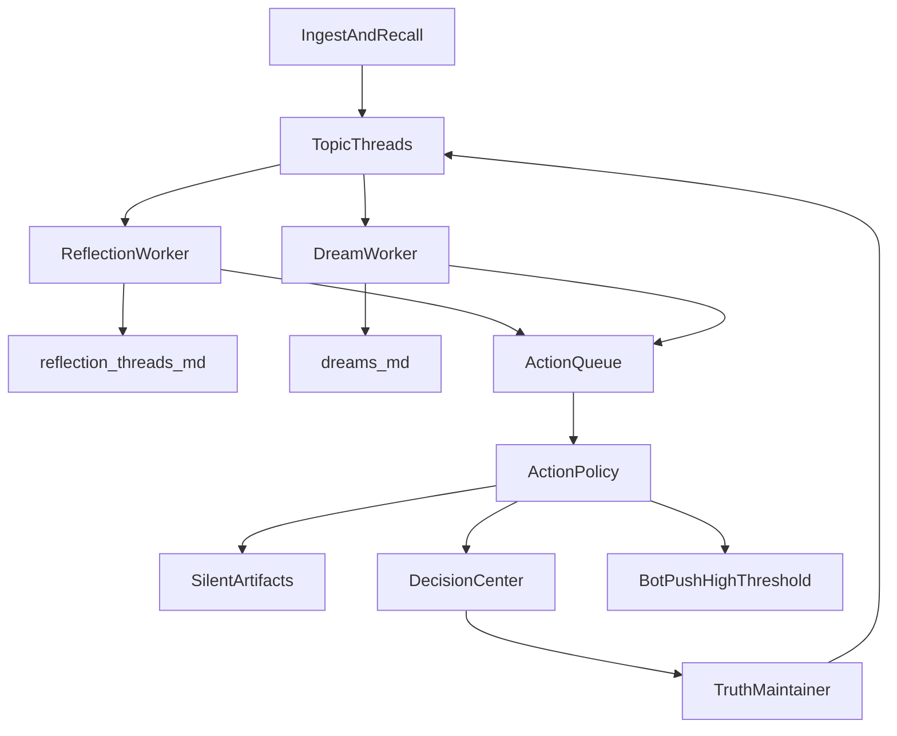

# 持续反思与梦境系统改造计划

## 目标

把当前以 `dreams/*.md` 和 `reflections/*.md` 为主的一次性产物，升级为“围绕主题持续迭代”的长期思考系统：

- 默认低打扰，把思考结果沉淀到特定目录的 Markdown
- 只在高紧急/高置信 action 时主动 Bot 打扰用户
- 下一轮思考显式继承上一轮结果，而不是每次从零开始

## 架构结论

采用“分层共享”而不是完全分开或完全共用：

- 共享底层：记忆库、`TruthMaintainer`、主题证据检索、通知策略、决策中心
- 分开上层：
  - `Reflection Worker`：分钟级/事件触发，持续推进同一主题
  - `Dream Worker`：日/周级，做跨主题重放、关联发现、低置信推演
- 分开产物：
  - `reflection-threads/`：长期线程式反思文档
  - `dreams/`：离线梦境/重放产物，默认不直接作为真值依据
  - `actions/` 或 action 队列表：给程序/用户的动作闭环

### 两套上层系统的职责划分

- `思考反思`：分钟级或事件驱动，围绕单一主题持续推进，显式继承上一轮思考结果，负责把主题逐步想清楚并产出 action / open questions / hypothesis。
- `梦境重放`：日级或周级离线任务，从高显著主题或线程池中做跨主题重放、联想和模式发现，负责提供新的视角、潜在关系、风险和待验证假设。
- 两者不是完全独立系统，而是共享同一套底层：记忆库、真值层、决策中心、通知策略、ActionExecutor。
- 梦境重放的产出可以反向喂给思考反思，作为“新主题候选”或“已有主题的新证据/新假设来源”。

### 梦境重放在引入反思系统后的定位

- 梦境重放保留原本的核心职责，即对高显著主题做离线重放和关联发现；这部分是现有 `[memory-service/src/core/GenerativeReplay.ts](memory-service/src/core/GenerativeReplay.ts)` 的自然演进。
- 在有了主题线程式反思后，梦境重放不再承担“长期推进某个主题直到收敛”的职责，而是承担：
  - 给反思线程提供新的关联线索
  - 发现跨主题模式
  - 提供低置信度候选关系与潜在风险
  - 作为未来 recall / context-match / ask 的辅助上下文来源
- 梦境产物应继续带 `dream / inferred / low-confidence` 标记，允许影响未来查询召回，但不应与已确认事实同权。

## 设计重点

### 1. 主题线程替代一次性反思

新增主题线程状态层，而不是只写按日期/按主题+日期的单次文档。
核心建议新增：

- `reflection_threads`：主题主表
- `reflection_runs`：每次思考的迭代记录
- `topic_memory_links`：把 message/chunk/entity/property/dream/action 统一挂到同一主题

建议 `reflection_threads` 至少包含：

- `id`, `topic_key`, `title`, `status(active|paused|closed|dropped)`
- `priority`, `salience`, `reflection_count`
- `current_hypothesis`, `open_questions_json`
- `next_reflection_at`, `last_reflected_at`
- `continue_reason`, `closure_reason`

### 1.1 思考反思如何产生新主题

建议新主题来源至少分为 5 类，而不是只来自消息：

- `new_evidence`：新消息、反思、实体变化、项目更新触发新的主题候选
- `dream_callback`：梦境重放提出了新的关系、风险、模式，创建新主题或唤醒旧主题
- `conflict_callback`：`TruthMaintainer` 发现事实冲突，自动生成“待确认主题”或挂靠到已有主题
- `user_triggered`：用户手动标记“值得继续想”的内容
- `scheduler_revisit`：已有主题到了 `next_reflection_at`，即使没有新消息也继续推进

建议新增 `ReflectionPlanner` 统一做主题归并与去重：

- 如果新证据命中已有主题，则追加为该主题的新一轮输入
- 如果只是相关但不完全重合，则创建子主题或 sibling topic
- 如果是显著且独立的新问题，则创建新的 `reflection_thread`
- 如果超出 active topic 上限，则低优先级主题不进入 active，而是 `paused` 或直接丢弃

### 1.2 思考反思的上下文配比

建议不要让每轮反思从零开始，也不要让上一轮内容无限压倒新证据，而是做分层上下文：

- `上一轮线程摘要`：最高优先级，作为本轮 continuity backbone
- `最近几轮关键 run 摘要`：补充演化轨迹
- `本轮新增证据`：决定为什么现在要继续想
- `主题级长期证据`：包括历史 message / reflection / dream / property / relationship
- `全局背景/用户画像/项目上下文`：只在相关时加入

建议的初始权重策略：

- 40%：上一轮线程摘要 + 当前 hypothesis + open questions
- 30%：本轮新增证据
- 20%：主题历史高价值证据（最近几轮 + 关键转折）
- 10%：全局背景（用户画像、项目约束、长期规则）

具体实现不必做成固定数值权重，而是做成 prompt budget 配额：

- 必带：上一轮摘要、当前状态、未解决问题
- 强优先：本轮新增证据
- 选择性：梦境回调、长期背景、较旧 run

关键原则：

- 上一轮内容要足够重，保证“延续性”
- 新证据也必须有足够占比，避免一直原地复读
- 梦境产物默认是辅助上下文，不直接压过真实证据和已确认真值

### 2. Markdown 产物改成“持续更新的主题文档”

你提出的方向是对的，建议每个主题有一个长期 Markdown 主文档，而不是每轮都只新建独立文件。
建议目录：

- `[memory-service/data/users/<user>/reflection-threads/](memory-service/data/users/default/)` 下按 `topic-slug.md`

每个主题文档建议结构：

- Topic 概览
- 当前假设
- 已确认结论
- 未解决问题
- 最新证据
- 历次思考记录（追加）
- 下一轮要继续思考什么
- 当前状态：`continue / waiting / closed / dropped`
- 产出的 action：`for_system / for_user / for_later`

同时保留 `reflection_runs` 做结构化 run 记录，Markdown 只作为人可读视图。

### 3. 限制同时反思话题数

需要有“工作记忆容量”概念，避免无限并发主题。
建议：

- `active topics` 设上限，例如 5-10 个
- 按 `priority + salience + recency + unresolvedness` 排序
- 低优先级主题进入 `paused`
- 长时间无新证据且无 action 的主题进入 `dropped` 或 `archived`

这部分可复用：

- `[memory-service/src/core/HeartbeatLoop.ts](memory-service/src/core/HeartbeatLoop.ts)` 作为分钟级调度入口
- `[memory-service/src/core/ProactivityPolicy.ts](memory-service/src/core/ProactivityPolicy.ts)` 的评分思路扩展成 topic 排队策略

### 4. 定义“思考结束”条件

建议不是单一条件，而是满足任一闭环：

- 核心问题已被验证/证伪
- 连续 N 轮没有新增证据/新假设
- 没有 action、且 utility 低于阈值
- 依赖外部信息，转成 `waiting`
- 被更高优先级主题挤出，转成 `paused` 或 `dropped`

`closed` 主题仍可被新证据重新打开。

### 5. Action 分流成三层

把“思考产出”与“是否打扰用户”分开。
建议统一 action 模型：

- `record_only`：仅沉淀到 md，不打扰
- `system_action`：程序自己执行
- `user_action`：需要用户处理
- `user_urgent_action`：高阈值立即 Bot 推送

判断流程：

- 低风险高置信：进入程序自动执行队列
- 中风险或事实冲突：进 `Decision Center`
- 高紧急高置信高收益：直接 Bot 推送
- 其他全部静默落盘

### 5.1 反思产出的 action 如何影响项目真值

对于“修改某个项目的真值属性”这类 action，不建议直接让反思 worker 改库，而应走统一的真值执行路径：

- `Reflection Worker` / `Dream Worker` 只产出结构化 action 提案，例如：
  - `update_truth_property`
  - `create_confirm_request`
  - `query_external_tool`
  - `notify_user`
- `ActionExecutor` 负责真正执行 action
- 涉及事实真值变更时，一律通过 `[memory-service/src/core/TruthMaintainer.ts](memory-service/src/core/TruthMaintainer.ts)` 落地，而不是直接写表

建议真值类 action 的执行策略：

- `high confidence + low risk`：
  - 进入 `ActionExecutor`
  - 调用 `TruthMaintainer.processPropertyChange()` 或同层封装接口
  - 自动写入审计轨迹、事实版本、来源与置信度
- `medium confidence` 或影响较大的事实：
  - 不直接改真值
  - 自动创建 `confirm_requests`
  - 由 `Decision Center` 人审后再经 `TruthMaintainer` 落地
- `low confidence / dream-derived`：
  - 默认不改真值
  - 仅沉淀为 hypothesis、open question，或降级成待确认项

也就是说：反思系统可以“提出改真值的 action”，但真正让项目真值变化的执行器必须是 `TruthMaintainer` 这条统一链路。

### 6. 给程序自己的 action 要独立执行层

不要放在反思 worker 里直接做完，建议新增独立执行层：

- `ActionExecutor` 负责拉取 `action_queue`
- `Reflection Worker` 只负责“提出 action”
- `ActionExecutor` 负责“执行、重试、记录结果、失败回流”

第一阶段只支持安全动作：

- 触发下一轮反思
- 生成/刷新主题文档
- 创建 `confirm_requests`
- 发送 Bot
- 生成 report/dream
- 标记 watched project / reminder

后续再考虑接更广泛外部 API。

### 6.1 外部工具执行：引入 OpenClaw 作为工具运行时

该方案可行，且和现有文档里“Memory Service 做长期记忆中台，OpenClaw 做 agent runtime / 工具调用层”的方向一致。

但建议明确边界：

- `Memory Service`：仍然是记忆、真值、主题线程、通知策略的主系统
- `OpenClaw`：作为外部工具执行器 / agent runtime，负责：
  - 查询 Jira / 外部系统
  - 运行复杂工具链
  - 产出结果再回写给 Memory Service

关键原则：

- OpenClaw 不应成为真值源
- OpenClaw 的查询结果、分析结果、action 执行结果，都应回写到 Memory Service，再由真值层决定是否更新事实

### 6.2 OpenClaw 配置入口

你提的“在 `[src/options.tsx](src/options.tsx)` 里新增 OpenClaw base url 和 key”是可行的，但前提是后端 action 执行层也能拿到这份配置。

建议配置项：

- `OPENCLAW_BASE_URL`
- `OPENCLAW_API_KEY`
- `OPENCLAW_ENABLED`
- 可选：`OPENCLAW_TIMEOUT`

建议配置流：

- 在 `[src/options.tsx](src/options.tsx)` 增加输入项，供用户在扩展端填写
- 与 Dream Digest / Weekly Report 配置类似，同步到 `memory-service` 的运行时配置接口
- `memory-service` 持久化到 per-user `config.json`
- `ActionExecutor` / `OpenClawClient` 从后端配置读取，不依赖扩展在线

不建议只把配置保存在扩展侧，因为：

- 未来的 `ActionExecutor` 更适合跑在后端
- 后端定时反思、梦境重放、action 重试都不应依赖浏览器页面是否打开

### 6.3 OpenClaw 在系统中的角色

建议新增一个轻量的 `OpenClawClient` / `ToolRuntimeClient` 抽象层，统一封装：

- Jira 查询
- 外部信息补充
- 复杂 agent 调用
- 执行结果回写

建议动作链路：

- 反思线程产出 `query_external_tool` action
- `ActionExecutor` 判断该 action 是否允许自动执行
- 调用 `OpenClawClient`
- 把结果回写成：
  - 新 evidence
  - 新 reflection run 输入
  - 必要时新的 `confirm_request`
  - 必要时 `TruthMaintainer` 的 property change

这样 OpenClaw 是“外脑工具手”，不是“事实最终裁决者”。

### 6.4 ActionExecutor 与 OpenClaw 的关系

- 对于“后台反思 / 定时反思 / 梦境回调”产生的外部工具调用，建议统一通过 `ActionExecutor` 发起。
- 也就是说，`OpenClaw` 不是被 `Reflection Worker` 直接调用，而是作为 `ActionExecutor` 可用的一种外部执行器。
- 推荐调用链：
  - `Reflection Worker` 产出 `query_external_tool` action
  - `ActionExecutor` 取出 action 并检查风险、频率、依赖、幂等键
  - `ActionExecutor` 调用 `OpenClawClient`
  - `OpenClawClient` 返回结构化结果
  - `ActionExecutor` 再决定：
    - 写入新 evidence
    - 触发下一轮 reflection run
    - 创建 confirm request
    - 或通过 `TruthMaintainer` 更新真值
- 对于未来可能存在的“用户手动点按钮立刻调用 OpenClaw”场景，可允许同步直调 `OpenClawClient`；但后台系统默认仍建议走 `ActionExecutor`，保持审计、重试、限流和安全策略一致。

### 6.5 ActionExecutor 是否是新增模块

是的。当前代码里没有通用的 `ActionExecutor`，也没有 `action_queue` / `OpenClawClient` / `ToolRuntimeClient`。

当前最接近它的只有：

- `[memory-service/src/core/ProactiveScheduler.ts](memory-service/src/core/ProactiveScheduler.ts)`：负责定时调度 heartbeat / daily / weekly / report
- `[memory-service/src/core/TruthMaintainer.ts](memory-service/src/core/TruthMaintainer.ts)`：负责事实冲突处理和真值落地
- 若干“各自直接执行”的点状逻辑，例如 dream digest / weekly report / bot push

所以 `ActionExecutor` 不是对现有模块改名，而是这次架构改造中新增的“统一动作执行层”。

## 工程化细化

### 7. 模块拆分

建议新增或改造的核心模块：

- `ReflectionPlanner`
  - 输入：新证据、主题状态、dream callback、冲突事件
  - 输出：创建主题 / 挂靠主题 / 唤醒主题 / 放弃主题
- `ReflectionWorker`
  - 输入：某个 `reflection_thread`
  - 输出：新的 `reflection_run`、更新主题状态、产出 action 提案
- `DreamWorker`
  - 输入：高显著主题池 + 可选线程池
  - 输出：dream run、dream artifact、dream callback
- `ActionExecutor`
  - 输入：`action_queue`
  - 输出：执行结果、重试、回写、失败记录
- `OpenClawClient`
  - 输入：标准化工具调用请求
  - 输出：标准化外部结果
- `ThreadRepository` / `ActionRepository`
  - 统一数据库读写，避免 worker 直接散写 SQL

### 8. 线程状态机

建议 `reflection_threads.status` 状态机：

- `active`
  - 正在持续思考
- `waiting`
  - 当前缺外部信息或等待 action 结果
- `paused`
  - 因容量/优先级暂时挂起
- `closed`
  - 已达成结论或无需继续
- `dropped`
  - 价值过低被放弃
- `archived`
  - 仅保留历史，不再进入调度

状态流转建议：

- `active -> waiting`：需要外部查询、用户确认或异步 action 结果
- `active -> closed`：问题收敛或明确结束
- `active -> paused`：被更高优先级主题挤出
- `paused -> active`：有新证据或被重新唤醒
- `closed -> active`：出现强新证据时重开
- `dropped/closed -> archived`：长期冷却后归档

### 9. action_queue 状态机

建议 `action_queue.status`：

- `queued`
- `running`
- `waiting_dependency`
- `waiting_confirmation`
- `succeeded`
- `failed`
- `cancelled`
- `dead_letter`

建议字段：

- `id`
- `thread_id`
- `run_id`
- `action_type`
- `execution_mode(auto|manual|assisted)`
- `priority`
- `risk_level`
- `confidence`
- `payload_json`
- `idempotency_key`
- `depends_on_json`
- `scheduled_at`
- `started_at`
- `finished_at`
- `retry_count`
- `last_error`
- `result_json`
- `created_at`

如需更细审计，可加 `action_attempts` 子表记录每次执行。

### 10. 数据表建议

建议最小新增表：

#### `reflection_threads`

- `id`
- `topic_key`
- `title`
- `status`
- `priority`
- `salience`
- `source_type`
- `source_ref_id`
- `current_hypothesis`
- `open_questions_json`
- `latest_summary`
- `latest_markdown_path`
- `next_reflection_at`
- `last_reflected_at`
- `reflection_count`
- `continue_reason`
- `closure_reason`
- `created_at`
- `updated_at`

#### `reflection_runs`

- `id`
- `thread_id`
- `run_type(reflection|dream_callback|manual_revisit|scheduler_revisit)`
- `trigger_type`
- `input_refs_json`
- `previous_run_id`
- `summary`
- `hypothesis_before`
- `hypothesis_after`
- `discoveries_json`
- `open_questions_json`
- `actions_json`
- `markdown_snapshot_path`
- `created_at`

#### `topic_memory_links`

- `id`
- `thread_id`
- `source_kind(message|chunk|entity|property|dream|reflection|report|action)`
- `source_id`
- `weight`
- `role(evidence|context|hypothesis|outcome)`
- `created_at`

#### `action_queue`

- 见上文状态机字段

### 11. Prompt / 上下文装配策略

建议 `ReflectionWorker` 的 prompt 组装顺序：

1. 线程头信息
  - title / status / objective / current hypothesis
2. 上一轮 run 摘要
3. 未解决问题
4. 本轮新增证据
5. 历史关键证据（压缩后）
6. 可选 dream callback
7. 可选全局用户/项目背景

建议输出 JSON 结构：

- `summary`
- `updatedHypothesis`
- `confidenceDelta`
- `newEvidenceNeeds`
- `openQuestions`
- `proposedActions`
- `statusSuggestion(continue|waiting|closed|paused)`
- `continueReason`

### 12. ActionExecutor 的执行器注册表

建议做成可扩展 dispatcher，而不是一个大 if-else：

- `update_truth_property` -> `TruthActionHandler`
- `create_confirm_request` -> `DecisionActionHandler`
- `query_external_tool` -> `ExternalToolActionHandler`
- `notify_user` -> `NotifyActionHandler`
- `schedule_revisit` -> `SchedulerActionHandler`

其中 `ExternalToolActionHandler` 内部再按 provider 分发：

- `openclaw`
- 未来可扩展 `jira-direct`、`mcp-tool`、`internal-http`

### 13. OpenClawClient 接口建议

建议请求模型：

- `toolName`
- `intent`
- `input`
- `context`
- `timeoutMs`
- `idempotencyKey`

建议返回模型：

- `status`
- `provider`
- `rawOutput`
- `structuredOutput`
- `evidenceRefs`
- `suggestedPropertyChanges`
- `suggestedActions`
- `costInfo`
- `startedAt`
- `finishedAt`

关键要求：

- 必须支持结构化输出，避免反思线程解析自由文本
- 必须带原始输出，方便审计
- 必须能把 Jira 查询结果转成 evidence，而不是直接改真值

### 14. API 设计建议

建议新增后端 API：

- `GET /reflection-threads`
  - 支持 `status`, `limit`, `offset`
- `GET /reflection-threads/:id`
  - 返回 thread 详情 + 最近 runs + actions
- `GET /reflection-threads/:id/runs`
- `POST /reflection-threads/:id/revisit`
  - 手动触发继续思考
- `POST /reflection-threads/:id/close`
- `POST /reflection-threads/:id/pause`
- `GET /actions`
  - 支持 `status`, `threadId`, `executionMode`
- `POST /actions/:id/retry`
- `POST /actions/:id/cancel`

建议扩展现有配置 API：

- `GET /config`
- `PUT /config`

新增配置字段：

- `openClawEnabled`
- `openClawBaseUrl`
- `openClawApiKey`
- `openClawTimeoutMs`
- `reflectionActiveTopicLimit`
- `reflectionHeartbeatMinutes`
- `reflectionUrgentNotifyThreshold`
- `reflectionAutoExecuteThreshold`

### 15. 前端信息架构建议

在 `[src/modals/memory-exploring.vue](src/modals/memory-exploring.vue)` 中建议增加：

- `梦境反思`
  - `进行中`
  - `等待中`
  - `已归档`
- `梦境重放`
- `决策中心`
- `动作队列`

推荐路由：

- `/reflection-threads`
- `/reflection-threads/:id`
- `/dream-replays`
- `/actions`

单主题详情页建议区块：

- 当前摘要
- 当前 hypothesis
- open questions
- 本轮/历史 run timeline
- 证据列表
- action 列表
- 状态流转记录

### 16. 实施顺序再细化

#### P0：基础设施

- 新增数据表
- 新增配置项
- 新增 `ReflectionPlanner` 最小实现

#### P1：主题线程可运行

- `ReflectionWorker`
- `reflection-threads` Markdown 产物
- 基本前端浏览页

#### P2：动作闭环

- `action_queue`
- `ActionExecutor`
- 真值 action 统一接 `TruthMaintainer`
- `Decision Center` 联动

#### P3：OpenClaw 工具接入

- `OpenClawClient`
- 配置链路
- `query_external_tool` action handler
- 回写 evidence / new actions / confirm requests

#### P4：梦境重放回流

- `DreamWorker` 接线程池
- dream callback -> reflection thread
- dream 结果参与 recall / ask / context-match

## 推荐实施顺序

### 阶段 1：建立主题线程层

新增后端数据结构和最小 worker，不改现有 dream/report 主链路：

- 新增 `reflection_threads` / `reflection_runs` / `action_queue`
- 新增 `ReflectionPlanner` 决定下一轮想什么
- 让新一轮思考显式读取上一轮 run 结果
- 输出到新的主题 Markdown 文档

重点文件：

- `[memory-service/src/core/HeartbeatLoop.ts](memory-service/src/core/HeartbeatLoop.ts)`
- `[memory-service/src/core/OnlineReflection.ts](memory-service/src/core/OnlineReflection.ts)`
- `[memory-service/src/core/GenerativeReplay.ts](memory-service/src/core/GenerativeReplay.ts)`
- `[memory-service/src/core/TruthMaintainer.ts](memory-service/src/core/TruthMaintainer.ts)`
- `[memory-service/src/storage/migrations/001_initial.sql](memory-service/src/storage/migrations/001_initial.sql)`

### 阶段 2：把现有反思接入线程化

把现有一次性反思产物接入新线程：

- `OnlineReflection` 真正接到 `/ask` 后链路中
- daily reflection 产物关联到主题线程
- dream 的输入增加“上一轮反思/线程状态”作为额外上下文

关键点：梦境下一轮应读取上一轮 dream/reflection run，而不只是原始消息。

### 阶段 3：动作与打扰分流

建立统一策略层：

- 静默沉淀：写入 Markdown + reindex
- 待确认：进入 `Decision Center`
- 自动执行：进入 `ActionExecutor`
- 高阈值紧急：Bot 推送

关键文件：

- `[memory-service/src/core/ProactivityPolicy.ts](memory-service/src/core/ProactivityPolicy.ts)`
- `[memory-service/src/core/HeartbeatLoop.ts](memory-service/src/core/HeartbeatLoop.ts)`
- `[memory-service/src/routes/confirmRequests.ts](memory-service/src/routes/confirmRequests.ts)`
- `[src/modals/components/DecisionCenter.vue](src/modals/components/DecisionCenter.vue)`

### 阶段 3.1：接入真值执行与 OpenClaw 工具运行时

- 为 `action_queue` 增加 action type 约定，至少包含：
  - `update_truth_property`
  - `query_external_tool`
  - `create_confirm_request`
  - `notify_user`
- 新增 `ActionExecutor`，把事实变更统一路由到 `TruthMaintainer`
- 新增 `OpenClawClient`，让外部 Jira / agent 工具查询走 OpenClaw
- 执行结果必须回写 Memory Service，成为后续反思/梦境的输入
- 对 dream-derived action 增加更严格阈值，默认不可直接改真值

### 阶段 3.2：补充 OpenClaw 配置链路

- 扩展端 `[src/options.tsx](src/options.tsx)` 新增 OpenClaw Base URL / API Key / Enabled 配置
- 后端 `[memory-service/src/routes/config.ts](memory-service/src/routes/config.ts)` 扩展运行时配置读写
- 后端 `[memory-service/src/config.ts](memory-service/src/config.ts)` 与 per-user `config.json` 增加 OpenClaw 配置项
- `ActionExecutor` / `OpenClawClient` 统一从后端配置读取
- 如需更安全，可进一步把 API key 只保存在后端环境或受保护配置中，扩展端仅传引用/用户态配置

### 阶段 4：前端展示改名与信息分区

把“梦境洞察”逐步演进成两块：

- `梦境反思`：长期主题线程，低打扰、可追踪延续性
- `梦境重放` 或保留 `dreams`：离线跨主题联想结果

并在界面上明确区分：

- 静默整理结果
- 待用户处理 action
- 紧急已推送 action

前端重点文件：

- `[src/modals/memory-exploring-entry.ts](src/modals/memory-exploring-entry.ts)`
- `[src/modals/memory-exploring.vue](src/modals/memory-exploring.vue)`
- `[src/modals/components/DreamInsights.vue](src/modals/components/DreamInsights.vue)`

### 阶段 4.1：在 `memory-exploring.vue` 中同时展示 active / archive 主题

当前 `[src/modals/memory-exploring.vue](src/modals/memory-exploring.vue)` 和 `[src/modals/memory-exploring-entry.ts](src/modals/memory-exploring-entry.ts)` 已有 `/dreams`、`/decisions` 等导航，因此建议新增：

- `/reflection-threads`：主题反思总览页
- `/reflection-thread/:id`：单主题详情页
- 可选 `/dream-replays`：若要与“梦境反思”视觉上彻底区分

建议在总览页同时展示：

- `进行中话题 (active)`：主题名、当前状态、最近一次思考时间、当前 hypothesis、未解决问题数、是否有 action、下一次计划思考时间
- `等待中话题 (waiting/paused)`：等待原因、依赖外部信息、预计回看时间
- `归档话题 (closed/archived/dropped)`：最终结论、关闭原因、最终 action 结果

建议单主题详情页展示：

- 主题主文档
- 每一步思考 run timeline
- 每步输入证据
- 每步输出摘要 / hypothesis 变化
- action 列表（for_system / for_user / urgent）
- 当前状态与“是否继续思考”的判定依据

## 关键取舍建议

- 梦境系统和反思系统：不要合并成单一 worker，建议“分层共享、上层分工”
- 思考反思的新主题来源：不只来自消息，也应接受 dream callback / conflict callback / revisit callback
- 主题文档：建议“每主题一个长期 md + 每轮一个结构化 run”
- 上下文策略：建议以上一轮线程摘要为 backbone，新证据为主增量，梦境作为辅助上下文
- 真值修改：建议由反思产出 action 提案，统一通过 `ActionExecutor -> TruthMaintainer` 落地
- 外部工具：建议 OpenClaw 作为工具运行时，而不是事实真源
- OpenClaw 配置：可在 `options.tsx` 提供填写入口，但必须同步到后端配置供定时任务与 ActionExecutor 使用
- 继续思考标记：建议线程状态机，而不是只靠文档尾部一句话
- 最大同时反思话题：建议必须有，上限是稳定性的关键
- 思考结束：建议显式 `closed/paused/dropped/waiting`
- 程序 action：建议独立 `ActionExecutor`，不要混进反思生成逻辑
- 紧急 Bot：阈值要显著高于普通整理和待确认

## 风险与注意点

- 现有 `WeeklyReporter` 和 `Dream Digest` 对时间窗口的读取还比较粗，需要后续一起校正，避免线程化后输入范围继续失真。
- 现有通知链路里 `notification_records` 与旧 `notifications` 读写不完全一致，后续若要强化即时打扰，需要统一。
- `dream` 产物应持续保留 `low-confidence / inferred / dream` 来源标识，避免梦境推演污染真值层。

