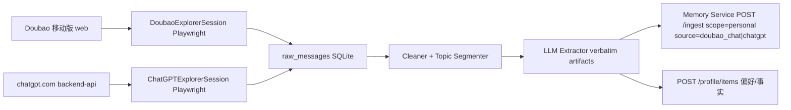

## 1. 重命名与去 doubao 化

目录 / 包 / 产品名同步改：

- 目录 `app/` → `desktop-app/`（git mv 保留历史）
- [app/package.json](app/package.json) `name: doubao-bridge` → `personal-ai-desktop`，`productName` 保持 `Personal AI`
- Electron bundle id `com.personalai.doubao-bridge` → `com.personalai.desktop`
- Release 工件名 `Doubao-Bridge-x.y.z-Installer.pkg` → `Personal-AI-Desktop-x.y.z-Installer.pkg`，release tag 前缀 `desktop-v`
- Chrome extension 侧批量改名：
  - [src/services/DoubaoBridgeClient.ts](src/services/DoubaoBridgeClient.ts) → `DesktopAppClient.ts`（导出别名 `DoubaoBridgeClient` 临时保留 1 版本以免炸引用）
  - [src/modals/doubao-bridge.tsx](src/modals/doubao-bridge.tsx) / [src/modals/doubao-bridge-entry.tsx](src/modals/doubao-bridge-entry.tsx) → `desktop-app.tsx` / `desktop-app-entry.tsx`
  - [static/doubao-bridge.html](static/doubao-bridge.html) → `static/desktop-app.html`，[src/manifest.json](src/manifest.json) 同步
- 文档：[app/README.md](app/README.md) / [docs/features/doubao_bridge_integration.md](docs/features/doubao_bridge_integration.md) / [app/docs/features/doubao_bridge.md](app/docs/features/doubao_bridge.md) 全文改写，Doubao 仅作为"输出渠道之一 + 输入源之一"出现
- 环境变量保持别名，新名优先：`DESKTOP_APP_PORT` 等；老的 `DOUBAO_BRIDGE_*` 在 [app/src/config.ts](app/src/config.ts) `loadConfig()` 里 fallback 读取，给一个 deprecation warning

UI 文案 hero 改 "让记忆双向流动：观察 ChatGPT/Doubao，沉淀到 Memory Service；再把上下文推回豆包"。

## 2. 记忆空间模型（两档硬隔离 + source 子标签 + ask 可选 both）

Memory Service 端引入 `scope` 字段，初版固定两档：`work` / `personal`。

- **存储**：在 ingest 表与 retrieval index 增加 `scope text not null default 'personal'` + `source text`。检索默认只在指定 scope 查；显式传 `scope: 'both'` 才会跨档合并。
- **路由改造**：
  - [memory-service/src/routes/ingest.ts](memory-service/src/routes/ingest.ts) L13–L31 schema 新增 `scope` (`work` | `personal`)、`source` (`ringcentral` | `meeting` | `doubao_chat` | `chatgpt` | `manual` | …)；保留旧 `sourceType` 做"系统通道"语义不变（用于触发不同 extractor）
  - [memory-service/src/routes/recall.ts](memory-service/src/routes/recall.ts) / [memory-service/src/routes/ask.ts](memory-service/src/routes/ask.ts) 增 `scope` 参数；缺省取 `personal`（更安全），桌面端 ask 弹 scope 切换器：`personal | work | both`
- **写入默认**：现有 RingCentral / meeting 链路统一标 `scope=work, source=ringcentral|meeting`；新加的 Doubao chat / ChatGPT 链路标 `scope=personal, source=doubao_chat|chatgpt`
- **跨域常识**：刻意不实现 `shared:bio` 第三档，避免过度设计；如确有"姓名/城市"这种全局事实，由用户在 profile/items 里手填，那张表本身全局可读，不参与 scope 隔离

## 3. 新增"记忆探索 (Memory Exploration)"能力

### 3.1 整体数据流



### 3.2 新模块布局（在 `desktop-app/src/explorer/` 下新建）

- `explorer/index.ts`：调度器，按每个 source 的间隔 tick
- `explorer/sources/DoubaoChatSource.ts`：复用现有 [app/src/browserSession.ts](app/src/browserSession.ts) 的 Playwright context（同 profile），新增"读会话"能力——访问 `https://www.doubao.com/chat/`，DOM 枚举侧边栏会话列表，逐个打开提取消息节点（不发送、只读）
- `explorer/sources/ChatGPTSource.ts`：在同一 Playwright 进程里新建独立 storageState 上下文（与豆包隔离），先 `openLogin('https://chatgpt.com')`，鉴权后调 `GET /backend-api/conversations?offset=0&limit=100` 列表 + `GET /backend-api/conversation/:id` 单会话；按 `current_node` 走 mapping 树，跳过被弃用分支
- `explorer/cache/RawMessageStore.ts`：local SQLite（better-sqlite3 已在依赖），表 `raw_messages(source, conversation_id, message_id, ts, role, content_hash, content, extracted_at)`；以 `(source, conversation_id, message_id)` 唯一键去重；`extracted_at` 为空表示尚未抽取
- `explorer/cleaner.ts`：去掉系统提示语、emoji-only 行、广告卡片；按 embedding 距离阈值切 topic segment
- `explorer/extractor.ts`：调 Memory Service 上**新增**的 `POST /api/v1/extractor/from-chat`（见 §4），输入 `{source, scope, segments[]}`，输出 `{artifacts[]}`；artifact 必须带 `source_quote`（CogCanvas 思路，便于审计）
- `explorer/types.ts`：`SourceId`、`ExplorationCursor`、`Artifact`

### 3.3 增量游标策略

| Source | 主键稳定性 | Cursor 字段 |
|---|---|---|
| Doubao mobile | DOM 顺序不稳定 | `(conversation_id, message_index, content_hash)` 三元组判重 |
| ChatGPT | 官方 message UUID 稳定 | 存 `last_processed_update_time` per-conversation + 已处理 `message_id` 集合 |

会话被跳过的判定：`new_message_count >= 1 AND last_message_age >= 10 min`（避免抓到一半的对话）。

### 3.4 配置（持久化在 [app/src/settings.ts](app/src/settings.ts)）

`BridgeUserSettings` 扩展：

```ts
explorer: {
  doubao: { enabled: false; lookbackDays: 7; intervalMinutes: 60 };
  chatgpt: { enabled: false; maxConversations: 0 /* 0=all */; lookbackDays: 0; intervalMinutes: 60 };
  defaultScope: 'personal';
}
```

`PUT /settings` 自然透传；`/settings/test-memory-service` 不变。

### 3.5 桥接 HTTP API 增加（[app/src/server.ts](app/src/server.ts)）

- `GET /explorer/status` → 各 source 的登录态、最后一次 run、缓存条数、待抽取条数
- `POST /explorer/auth/open-login` body `{ source: 'doubao'|'chatgpt' }` → 唤起对应 Playwright 上下文登录
- `POST /explorer/run-now` body `{ source }` → 立即跑一次
- `POST /explorer/reset-cache` body `{ source, conversationId? }` → 清掉游标重抓
- `GET /explorer/preview` body `{ source, conversationId, limit }` → 调试看清洗结果

## 4. Memory Service 端改动

- [memory-service/src/routes/ingest.ts](memory-service/src/routes/ingest.ts)：schema 加 `scope` 与 `source`，DB 迁移加列；新增枚举 `source: 'doubao_chat' | 'chatgpt' | 'ringcentral' | 'meeting' | …`
- 新增 `memory-service/src/routes/extractor.ts`：`POST /api/v1/extractor/from-chat` 内部串 Cleaner → LLM 抽取 → 冲突检测（Mnemos 风格 `supersede_by` 链）→ 写 ingest；返回 artifacts。把 LLM 抽取放在 service 端而不是桌面端，理由：
  - 集中管理 prompt（[src/prompts/](src/prompts/) 风格但归 service）
  - 复用现有 LLM 配置 / 配额
  - 桌面端只负责"采集 + 缓存"，崩了不丢信号
- 抽取 prompt 强约束：每条 artifact 必须含 `{ kind: 'fact'|'preference'|'event'|'plan', text, source_quote, conversation_ref }`
- 在 `recall` / `ask` 入口处把 `scope` 写进 SQL where；`scope='both'` 才不过滤

## 5. UI 重构（[app/app/index.html](app/app/index.html) + renderer.js）

把当前 6 步线性向导改成 **两栏 + 共享前置**：

```
[ Hero ]
[ 步骤 1：连接 Memory Service ]   <- 共享前置

[ 输出：把记忆推到外部聊天 ]      [ 输入：从外部聊天观察记忆 ]
  ├ 登录豆包                         ├ 豆包移动版
  ├ 绑定长期记忆线程                 │   ├ 登录态（复用左侧）
  ├ 绑定手机版对话                   │   ├ enable toggle
  └ 后台自动同步                     │   ├ 回看天数 / 间隔
                                     │   ├ scope 选择（默认 personal）
                                     │   └ 现在跑一次 / 查看缓存
                                     └ ChatGPT
                                         ├ 登录 ChatGPT
                                         ├ enable toggle
                                         ├ 最近 N 个会话 / 间隔
                                         ├ scope 选择（默认 personal）
                                         └ 现在跑一次 / 查看缓存

[ Quick Ask 区域 ]
  scope 切换器：personal | work | both（默认 personal）
```

- 每个 source 一张 `wizard-card`，结构和现有卡一致（沿用 `step-status` 徽标），改名为 `source-card`
- "查看缓存"打开新页面 `desktop-app/app/explorer.html`：会话列表 + 已抽取 artifact 表 + "重抓"按钮；对应 `/explorer/preview`
- Quick Ask 顶部新增 scope dropdown，preload 暴露 `quickAsk.setScope()`，调 `POST /assistant/ask` 时透传

## 6. 防误用与隐私保险

- 默认所有 explorer source `enabled=false`，需用户显式开
- 每张 source-card 顶部固定一行红色提示："你授权 Personal AI 读取你在该平台的全部对话历史；可随时停用并清空缓存"
- 提供 explorer.html 上的"清空 source 缓存 + 撤回已写入记忆"按钮（后者调 Memory Service 新增 `DELETE /api/v1/memories?source=doubao_chat&scope=personal`）
- ChatGPT request 加节流 1 req/s；Doubao DOM 抓取每 10 个会话 sleep 5s

## 7. 落地顺序

按可独立验证的小步走：

1. **重命名 PR**：仅文件移动 + 旧别名兼容；不引入新功能
2. **scope 字段 PR**：[memory-service/src/routes/ingest.ts](memory-service/src/routes/ingest.ts) / `recall.ts` / `ask.ts` + DB migration；老数据 backfill `scope='work'`（保守把现有 RC 数据归为工作）
3. **ChatGPTSource MVP**：只跑一次手动 `POST /explorer/run-now { source: 'chatgpt' }`，不开自动；验证 mapping 树解析与 ingest
4. **DoubaoChatSource MVP**：复用现有 Playwright profile；DOM 抓取 + 清洗
5. **UI 重构**：左右两栏 + scope 切换器
6. **自动调度**：`BridgeSyncManager` 接入 Explorer ticker