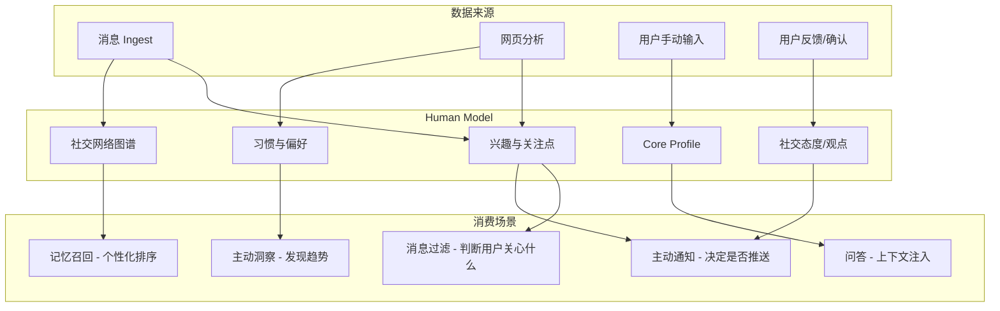
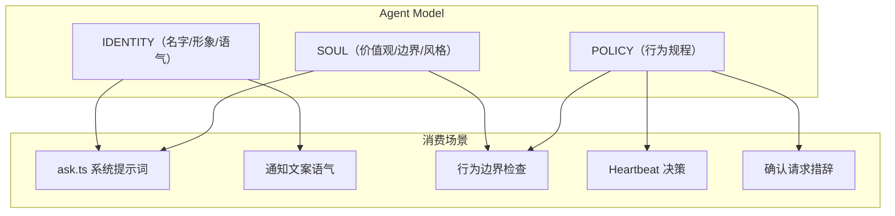
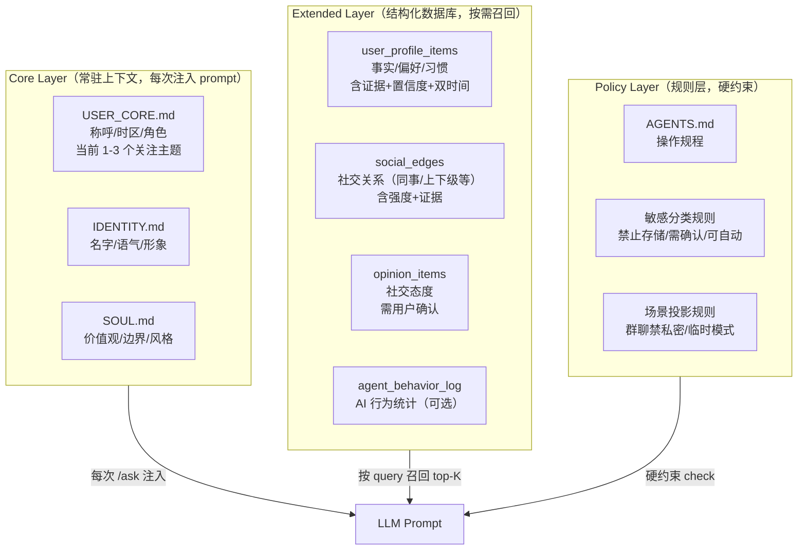
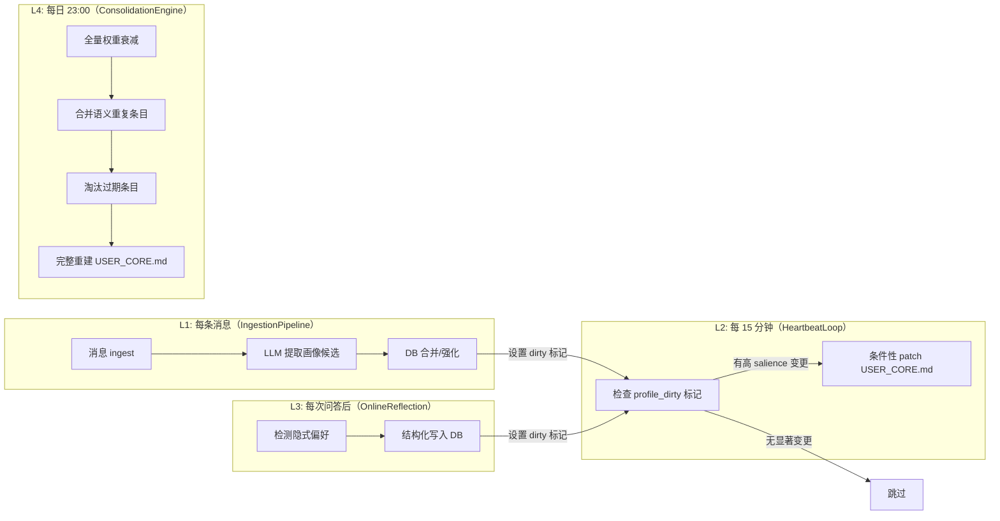

# 双画像系统（Human Model + Agent Model）设计方案

## 一、现状分析

### memory-service 已有的画像基础


| 组件                  | 现状                                                            | 差距                                    |
| ------------------- | ------------------------------------------------------------- | ------------------------------------- |
| `CORE_MEMORY.md`    | 模板已存在，含 Identity/Preferences/Key Projects/Important People 区块 | 内容全空，无自动填充逻辑（ConsolidationEngine 未调用） |
| `OnlineReflection`  | 每次 `/ask` 后检测 `userPreferences` 并追加到 `CORE_MEMORY.md`         | 仅追加字符串，无结构化、无去重、无置信度                  |
| `ProactivityPolicy` | 有 `userPrefCost` 参数位（默认 0）                                    | 未接入实际用户偏好数据                           |
| `ask.ts`            | SYSTEM_PROMPT = "You are a personal AI assistant..."          | 无 AI 人设/性格/行为边界                       |
| 数据库                 | 无 `user_profile` 或 `agent_profile` 表                          | 需要新建迁移                                |
| `entities` 表        | 有 `Person` 类型，可存人物实体                                          | 无社交关系语义（仅有 `co_occurs` 关系）            |


### 旧系统 UserProfile 的核心能力（将被废弃）

旧 `UserProfileManager` 存储在 ChromaDB `userprofiles` 集合中，包含：

- 兴趣项（projects/people/topics/technologies）含权重和衰变
- 行为模式（活跃时段、沟通风格、工具使用）
- 社交关系（`SocialRelationshipRecord`）
- 显式配置（用户手动输入的个人信息、工作上下文）
- 权重自适应（cold_start -> learning -> mature）

这些在消息分析（`agentThinking`）、网页分析（`WebIntelligenceAnalyzer`）、主动通知（`TaskProcessors`）中被使用。

---

## 二、是否需要这两个画像？

### Human Model（用户画像）：需要，P1 优先级

**使用场景分析：**




**具体使用场景：**

1. **消息过滤与评分**（IngestionPipeline / SalienceScorer）
  - 知道用户关注哪些项目/人物，可动态调整 salience 权重
  - `SalienceScorer` 的 `importance` 参数可结合用户兴趣权重
  - 当前 `ProactivityPolicy.userPrefCost` 已预留接口但未接入
2. **主动通知决策**（HeartbeatLoop / ProactivityPolicy）
  - 知道用户的工作时间/勿扰窗口 -> quiet hours 个性化
  - 知道对某人的社交态度 -> 调整通知优先级
  - 知道当前关注主题 -> 主动推送相关更新
3. **记忆召回排序**（RecallEngine）
  - 用户兴趣权重作为 reranking 因子
  - 社交网络中的关键人物相关记忆优先
4. **问答上下文**（ask.ts）
  - 将 CORE_MEMORY 注入 system prompt
  - 让回答考虑用户身份、角色、关注点
5. **整合与反思**（ConsolidationEngine / GenerativeReplay）
  - 日整合时自动更新 CORE_MEMORY
  - 周做梦时围绕用户关注主题发散

### Agent Model（AI 自画像）：需要，P2 优先级

**使用场景分析：**




**具体使用场景：**

1. **问答个性化**（ask.ts）
  - 当前 SYSTEM_PROMPT 过于通用（"You are a personal AI assistant"）
  - 注入 IDENTITY + SOUL 后可实现一致的语气、风格、自我叙事
2. **通知措辞**（HeartbeatLoop / notification 生成）
  - AI 的语气风格影响通知文本的生成
3. **行为边界**（ProactivityPolicy）
  - "外部动作需确认" 等硬约束
  - "群聊场景不注入私密记忆" 等安全规则
4. **主动性控制**（HeartbeatLoop）
  - "何时主动联系用户、何时保持沉默" 的规则
  - 避免过度打扰（OpenClaw 的 HEARTBEAT_OK 抑制机制）
5. **自我演化可追溯**
  - SOUL 的变更必须通知用户（OpenClaw 设计原则）
  - 版本化存储，支持回滚

---

## 三、设计方案

### 3.1 存储架构（三层模型，对齐调研报告 Section 3）




### 3.2 数据库设计（新增迁移 002_profiles.sql）

在 [memory-service/src/storage/migrations/](memory-service/src/storage/migrations/) 新增：

```sql
-- Human Model: 用户画像条目
CREATE TABLE user_profile_items (
  id TEXT PRIMARY KEY,
  item_type TEXT NOT NULL,        -- fact / preference / habit / interest / constraint
  item_key TEXT NOT NULL,         -- e.g. "timezone", "writing_style", "focus_project"
  item_value TEXT NOT NULL,       -- JSON string
  evidence_refs TEXT,             -- JSON array of {message_id, snippet, url, ts}
  source_kind TEXT NOT NULL DEFAULT 'inferred',  -- explicit / inferred / system
  confidence REAL NOT NULL DEFAULT 0.6,
  user_confirmed INTEGER NOT NULL DEFAULT 0,
  status TEXT NOT NULL DEFAULT 'active',   -- active / superseded / retracted
  salience_score REAL NOT NULL DEFAULT 0.0,
  mention_count INTEGER NOT NULL DEFAULT 1,  -- 被强化次数
  last_seen INTEGER NOT NULL,                -- 最近一次被强化的时间
  valid_from INTEGER,
  valid_to INTEGER,
  created_at INTEGER NOT NULL,
  updated_at INTEGER NOT NULL,
  fingerprint TEXT NOT NULL,      -- hash(item_key + canonical(item_value))
  UNIQUE(fingerprint, created_at)
);

-- 画像快照脏标记（Heartbeat 用于判断是否需要 patch Markdown）
CREATE TABLE profile_sync_state (
  id TEXT PRIMARY KEY DEFAULT 'singleton',
  profile_dirty INTEGER NOT NULL DEFAULT 0,
  last_snapshot_at INTEGER NOT NULL DEFAULT 0,
  last_full_rebuild_at INTEGER NOT NULL DEFAULT 0
);

-- Human Model: 社交关系边
CREATE TABLE social_edges (
  id TEXT PRIMARY KEY,
  from_entity_id TEXT NOT NULL,   -- 通常是 user 自身的 entity
  to_entity_id TEXT NOT NULL,     -- Person entity
  relation_type TEXT NOT NULL,    -- colleague / manager / friend / client
  strength REAL NOT NULL DEFAULT 0.5,
  evidence_refs TEXT,
  confidence REAL NOT NULL DEFAULT 0.6,
  user_confirmed INTEGER NOT NULL DEFAULT 0,
  valid_from INTEGER,
  valid_to INTEGER,
  created_at INTEGER NOT NULL,
  updated_at INTEGER NOT NULL,
  FOREIGN KEY (to_entity_id) REFERENCES entities(id)
);

-- Human Model: 社交态度（需用户确认）
CREATE TABLE opinion_items (
  id TEXT PRIMARY KEY,
  target_entity_id TEXT NOT NULL,  -- 评价对象 Person entity
  dimension TEXT NOT NULL,         -- trust / like / collaboration / risk
  valence REAL NOT NULL,           -- -1 to +1
  intensity REAL NOT NULL DEFAULT 0.5,  -- 0 to 1
  rationale TEXT,
  evidence_refs TEXT,
  confidence REAL NOT NULL DEFAULT 0.5,
  user_confirmed INTEGER NOT NULL DEFAULT 0,
  status TEXT NOT NULL DEFAULT 'pending_confirm',  -- 默认需确认
  valid_from INTEGER,
  valid_to INTEGER,
  created_at INTEGER NOT NULL,
  updated_at INTEGER NOT NULL,
  FOREIGN KEY (target_entity_id) REFERENCES entities(id)
);

-- Agent Model: AI 自画像版本（IDENTITY / SOUL / POLICY）
CREATE TABLE agent_profile_versions (
  id TEXT PRIMARY KEY,
  kind TEXT NOT NULL,              -- identity / soul / policy
  content_md TEXT NOT NULL,        -- Markdown 内容
  author TEXT NOT NULL DEFAULT 'system',  -- user / agent / system
  rationale TEXT,                  -- 变更原因
  is_active INTEGER NOT NULL DEFAULT 0,
  created_at INTEGER NOT NULL
);

CREATE UNIQUE INDEX idx_agent_profile_active
  ON agent_profile_versions(kind) WHERE is_active = 1;
```

### 3.3 Markdown 文件设计

在 [memory-service/data/](memory-service/data/) 目录下，除已有的 `CORE_MEMORY.md` 外：

- `IDENTITY.md` -- AI 名字、形象、语气（面向用户体验）
- `SOUL.md` -- AI 价值观、行为边界（面向安全与信任）
- `AGENTS.md` -- AI 操作规程（heartbeat 行为、确认规则等）
- `USER_CORE.md` -- 从 `user_profile_items` 中 salience top-K 自动生成

这些文件在 DB 中有 `agent_profile_versions` 做版本化备份，文件本身作为运行时快照。

### 3.4 API 设计

在 [memory-service/src/routes/](memory-service/src/routes/) 新增：

**Human Model API:**

- `GET /api/v1/profile/items` -- 列出用户画像条目（支持 type/status 过滤）
- `POST /api/v1/profile/items` -- 添加画像条目（支持 explicit/inferred 标记）
- `PUT /api/v1/profile/items/:id` -- 更新画像条目
- `DELETE /api/v1/profile/items/:id` -- 删除/撤回画像条目
- `POST /api/v1/profile/items/:id/confirm` -- 用户确认推断条目
- `GET /api/v1/profile/core` -- 获取 USER_CORE.md 内容（常驻上下文）
- `GET /api/v1/profile/social` -- 获取社交图谱
- `POST /api/v1/profile/social` -- 添加社交关系
- `GET /api/v1/profile/opinions` -- 获取社交态度列表
- `POST /api/v1/profile/opinions/:id/confirm` -- 确认/拒绝社交态度

**Agent Model API:**

- `GET /api/v1/agent/identity` -- 获取当前 IDENTITY
- `GET /api/v1/agent/soul` -- 获取当前 SOUL
- `PUT /api/v1/agent/:kind` -- 更新 AI 自画像（kind = identity/soul/policy）
- `GET /api/v1/agent/:kind/history` -- 获取版本历史

### 3.5 画像更新生命周期（核心机制）

画像系统由两层构成：**DB（管理层）** 持续更新，**Markdown（投影层）** 定期从 DB 渲染。

DB 解决的问题：去重合并、权重衰减、证据追溯、确认流程。
Markdown 解决的问题：直接注入 prompt，人可读，LLM 可读。
USER_CORE.md 不是直接写入的，而是从 DB 中 salience top-K 定期"渲染"出来的快照。

#### 3.5.1 四级更新触发机制




**L1: 每条消息 — IngestionPipeline（只写 DB，不碰 Markdown）**

在现有 `IngestionPipeline.ingest()` 的 LLM extraction 步骤后增加画像提取：

```
消息 ingest → LLM 提取 entities + properties（已有）
                └→ 同时提取 profile_candidates（新增）
                    例如: {key: "focus_project", value: "Recording", source: "mentioned 3 times"}

对每个 candidate:
  1. 计算 fingerprint = hash(item_key + canonical(value))
  2. 查找 DB 中已有的同 fingerprint 条目
     ├── 找到 → 强化:
     │     mention_count++
     │     last_seen = now
     │     salience_score = recalc(mention_count, recency, importance)
     │     追加 evidence_ref（本条消息 ID）
     │     设置 profile_dirty = true
     └── 没找到 → 新建:
           INSERT user_profile_items(...)
           salience_score = initial_calc(importance)
           设置 profile_dirty = true
```

DB 表新增字段 `mention_count INTEGER DEFAULT 1` 和 `last_seen INTEGER` 用于强化计算。
全局状态表或内存变量维护 `profile_dirty` 标记（指示 Markdown 需要刷新）。

**L2: 每 15 分钟 — HeartbeatLoop（条件性 patch Markdown）**

在现有 HeartbeatLoop.run() 的步骤 1（micro-consolidation）后新增一步：

```
检查 profile_dirty 标记
  ├── dirty = false → 跳过
  └── dirty = true → 
        查询 DB 中 salience 变化最大的条目
        ├── 有新的 top-K 条目不在当前 USER_CORE.md 中
        │     → 追加到 USER_CORE.md 对应分区
        │     → 清除 dirty 标记
        └── 排名未变 → 只清除 dirty 标记（等待日整合全量重建）
```

这确保重要的新发现（如用户突然大量提及一个新项目）能在 15 分钟内进入上下文，
而不用等到 23:00 的日整合。

**L3: 每次问答后 — OnlineReflection（结构化写 DB）**

改造现有 OnlineReflection（当前是直接追加字符串到 CORE_MEMORY.md）：

```
现有逻辑:
  LLM 返回 userPreferences: ["喜欢简洁回答"]
  → 直接追加到 CORE_MEMORY.md（纯文本，无去重）

改造后:
  LLM 返回 userPreferences: ["喜欢简洁回答"]
  → 转为结构化: {item_type: "preference", key: "response_style", value: "concise"}
  → 走 L1 同样的 fingerprint 合并逻辑写入 DB
  → 设置 profile_dirty = true
  → 不再直接写 CORE_MEMORY.md（由 L2/L4 负责渲染）
```

**L4: 每日 23:00 — ConsolidationEngine（完整重建）**

在现有 6-phase consolidation 中新增 Phase 3.5（在 Structure 和 Clean 之间）：

```
Phase 3.5: Profile Consolidation
  1. 衰减: 所有 active 条目的 salience_score *= decay_factor
     （30 天未被强化的条目 salience 下降显著）
  2. 合并: 语义相似的条目合并为一条
     例如 "喜欢简洁回答" + "偏好简短回复" → 保留 mention_count 更高的
     被合并的标记 status=superseded
  3. 淘汰: salience < 0.1 的条目 → status=archived
  4. 重建 USER_CORE.md:
     SELECT * FROM user_profile_items 
     WHERE status='active' 
     ORDER BY salience_score DESC 
     LIMIT 20
     → 渲染为 Markdown（分区 + 元信息）
  5. 清除 profile_dirty 标记
```

#### 3.5.2 Markdown 快照格式（USER_CORE.md）

```markdown
# User Core

## Current Focus _(最近 7 天高活跃)_
- Recording 项目 BE 依赖完成情况 _(提及 23 次, 最近: 今天)_
- Q1 OKR 进展 _(提及 8 次, 最近: 昨天)_

## Ongoing Interests
- 团队协作效率 _(提及 12 次, 最近: 3 天前)_
- AI 工具链建设 _(提及 6 次, 最近: 5 天前)_

## Key People
- Sophia Lin: 密切协作者 _(互动 45 次, 最近: 今天)_
- Colin Liu: 团队 Lead _(互动 18 次, 最近: 2 天前)_

## Preferences
- 偏好简洁回复，信息密度高 _(确认)_
- 工作时间 09:00-18:00 GMT+8 _(用户设置)_

## Identity
- Name: Esone
- Role: Frontend Developer
- Organization: RingCentral
```

分区规则：

- "Current Focus": salience top-5 且 last_seen 在 7 天内
- "Ongoing Interests": salience 6-15 或 last_seen 超过 7 天但仍 active
- "Key People": 从 social_edges 表按 strength 排序 top-10
- "Preferences": item_type='preference' 且 user_confirmed=1 的条目
- "Identity": item_type='fact' 且 key in ('name','role','organization','timezone')

上下文控制：整个 USER_CORE.md 控制在 ~500 tokens 以内（约 15-20 条），
通过 top-K 机制天然限制大小，不会无限膨胀。

#### 3.5.3 Salience 计算公式

```
salience = 0.4 * importance_norm    // LLM 判断的重要性 (0-1)
         + 0.3 * frequency_norm     // min(mention_count / 10, 1.0)
         + 0.2 * recency            // exp(-0.05 * days_since_last_seen)
         + 0.1 * confirmation_bonus // user_confirmed ? 0.3 : 0
```

每日衰减: `salience *= 0.98`（半衰期约 34 天）
每次强化: 重新计算 frequency_norm 和 recency，salience 自然回升

#### 3.5.4 合并/强化的具体策略


| 场景         | 判断方式                          | 操作                                           |
| ---------- | ----------------------------- | -------------------------------------------- |
| 完全相同       | fingerprint 一致                | mention_count++, last_seen 更新, 追加 evidence   |
| 语义相似       | 同 item_key 且 LLM 判断等价         | 保留 salience 更高的, 合并 evidence, 另一条 superseded |
| 同 key 但值变了 | 同 item_key 但 value 不同         | 旧条目 valid_to=now, 新条目 valid_from=now（双时间追踪）  |
| 矛盾         | 同 key 且值冲突（如"喜欢详细" vs "喜欢简洁"） | 保留更新的, 置信度低于阈值时生成 confirm_request 请用户裁决      |


### 3.6 与现有引擎的集成点


| 引擎                      | 集成方式                                                     | 改动文件                                                                                             |
| ----------------------- | -------------------------------------------------------- | ------------------------------------------------------------------------------------------------ |
| **IngestionPipeline**   | L1: ingest 时 LLM 提取 profile 候选 → DB 合并/强化，设 dirty 标记     | [memory-service/src/core/IngestionPipeline.ts](memory-service/src/core/IngestionPipeline.ts)     |
| **HeartbeatLoop**       | L2: 检查 dirty 标记 → 条件性 patch USER_CORE.md                 | [memory-service/src/core/HeartbeatLoop.ts](memory-service/src/core/HeartbeatLoop.ts)             |
| **OnlineReflection**    | L3: 检测隐式偏好 → 结构化写入 DB（替代现有的直接追加文本）                       | [memory-service/src/core/OnlineReflection.ts](memory-service/src/core/OnlineReflection.ts)       |
| **ConsolidationEngine** | L4: 全量衰减 + 合并重复 + 淘汰过期 + 完整重建 USER_CORE.md               | [memory-service/src/core/ConsolidationEngine.ts](memory-service/src/core/ConsolidationEngine.ts) |
| **SalienceScorer**      | 消息 salience 计算时参考用户兴趣权重（查 DB active 条目）                  | [memory-service/src/core/SalienceScorer.ts](memory-service/src/core/SalienceScorer.ts)           |
| **ProactivityPolicy**   | `userPrefCost` 接入真实偏好数据（从 DB 读勿扰时段等）                     | [memory-service/src/core/ProactivityPolicy.ts](memory-service/src/core/ProactivityPolicy.ts)     |
| **ask.ts**              | 读取 USER_CORE.md + IDENTITY.md + SOUL.md 注入 system prompt | [memory-service/src/routes/ask.ts](memory-service/src/routes/ask.ts)                             |
| **TruthMaintainer**     | 画像条目矛盾时生成 confirm_request                                | [memory-service/src/core/TruthMaintainer.ts](memory-service/src/core/TruthMaintainer.ts)         |


### 3.7 写入策略（安全分级）

对齐调研报告 Section 4.2.2：

- **explicit（用户明确表达）**：直接写入，`user_confirmed=1`
- **inferred（系统推断，低风险）**：自动写入，`user_confirmed=0`，如"喜欢简洁回答"
- **inferred（系统推断，中风险）**：进入 `confirm_requests`，如"经常关注 X 项目"
- **opinion_about_person（社交态度）**：默认 `status='pending_confirm'`，必须用户确认
- **sensitive（健康/政治等）**：默认不写入，除非用户明确要求

### 3.7 MemoryServiceClient 扩展

在 [src/services/MemoryServiceClient.ts](src/services/MemoryServiceClient.ts) 中需新增对应的 client 方法：

```typescript
// Human Model
async getProfileItems(type?: string): Promise<ProfileItem[]>
async addProfileItem(item: ProfileItemPayload): Promise<ProfileItem>
async confirmProfileItem(id: string): Promise<void>
async deleteProfileItem(id: string): Promise<void>
async getProfileCore(): Promise<string>  // USER_CORE.md 内容
async getSocialGraph(): Promise<SocialEdge[]>

// Agent Model
async getAgentProfile(kind: 'identity' | 'soul' | 'policy'): Promise<string>
async updateAgentProfile(kind: string, content: string): Promise<void>
```

---

## 四、实施优先级

### P1: Human Model 基础（与 Phase 1 消息流迁移同步）

1. 新增 `002_profiles.sql` 迁移
2. 新增 `routes/profile.ts`（画像 CRUD API）
3. 修改 `IngestionPipeline` -- ingest 时提取 profile 候选
4. 修改 `ConsolidationEngine` -- 日整合时生成 USER_CORE.md
5. 修改 `OnlineReflection` -- 结构化写入 `user_profile_items`（替代纯文本追加）
6. 修改 `ask.ts` -- 注入 USER_CORE 到 system prompt

### P2: Agent Model + 社交图谱

1. 创建 `IDENTITY.md`、`SOUL.md`、`AGENTS.md` 种子文件
2. 新增 `routes/agent.ts`（AI 自画像 API）
3. 修改 `ask.ts` -- 注入 IDENTITY + SOUL
4. 新增社交图谱 API
5. 接入 `ProactivityPolicy.userPrefCost`
6. `SalienceScorer` 接入用户兴趣权重

### P3: 社交态度 + 高级功能

1. 新增 opinion_items API + confirm 流程
2. TruthMaintainer 集成（态度冲突检测）
3. HeartbeatLoop 读取 AGENTS.md 规则
4. Chrome Extension 前端 "我记住了什么" 面板

---

## 五、与调研报告的对齐


| 调研报告建议                                           | 本方案对应                                       |
| ------------------------------------------------ | ------------------------------------------- |
| "keep a small core always in context" (OpenClaw) | USER_CORE.md + IDENTITY.md + SOUL.md 常驻注入   |
| "everything else retrieved via tools"            | Extended Layer 通过 recall API 按需召回           |
| "observed vs believed vs summarized"             | `source_kind` 字段区分 explicit/inferred/system |
| "置信度 + 证据指针"                                     | `confidence` + `evidence_refs` 字段           |
| "opinions 带证据、可撤销"                               | `opinion_items` 表，默认 `pending_confirm`      |
| "用户画像 != AI自画像，强拆分"                              | 独立表 + 独立 API + 独立 Markdown 文件               |
| "外部动作需确认"                                        | SOUL.md 硬编码 + ProactivityPolicy 检查          |
| "MEMORY.md 只在主会话加载"                              | 场景投影规则（Policy Layer）控制                      |
| 版本化与可回滚                                          | `agent_profile_versions` 表                  |


