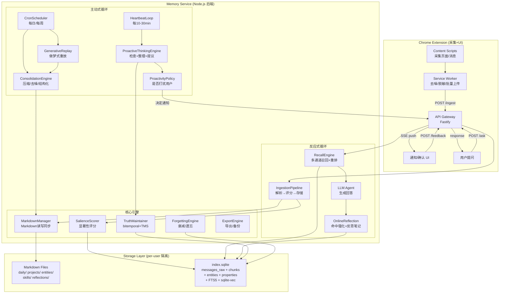

# Personal AI 记忆系统全面改造方案（完整技术规格）

---

## 一、总体架构：双循环系统

系统由两个循环驱动：

- **反应式循环 (Reactive)**：用户问 → 检索 → 回答/行动 → 在线反思
- **主动式循环 (Proactive)**：定时/事件触发 → 自我思考 → 整理记忆 → 提议行动/询问 → 通知用户




---

## 二、数据目录结构（per-user 隔离）

```
data/{userId}/
├── daily/                           # 每日记忆日志 (Canonical Source)
│   ├── 2026-02-10.md               # 当天重要记忆的整理摘要
│   └── 2026-02-11.md
├── projects/                        # 关注项目知识空间
│   └── {project-slug}/
│       ├── SUMMARY.md              # 当前属性快照 + 项目概览
│       ├── timeline.md             # 属性变更历史时间线
│       └── notes.md                # AI整理的笔记/发现
├── entities/                        # 实体知识文件
│   ├── people/{slug}.md            # 人物档案
│   └── topics/{slug}.md            # 主题知识
├── skills/                          # 沉淀的规则/模式
│   └── {rule-slug}.md              # if-then 规则或操作模板
├── reflections/                     # 反思记录
│   └── {date}.md                   # 每日反思产物
├── dreams/                          # 做梦式重放输出
│   └── {date}-{topic}.md
├── CORE_MEMORY.md                   # 核心长期记忆（用户偏好/身份/重要决策）
├── WATCHED_PROJECTS.md              # 关注项目列表（用户可手动编辑）
└── index.sqlite                     # 派生索引数据库（可从Markdown重建）
```

**备份/导出**：整个 `data/{userId}/` 目录打成 zip 即为完整备份。Markdown 文件可直接给其他 AI 系统当上下文。

---

## 三、SQLite Schema 完整设计（index.sqlite）

### 3.1 原始消息表 messages_raw

存储所有采集的原始消息/网页内容，是记忆的"感知输入层"。

```sql
CREATE TABLE messages_raw (
  id TEXT PRIMARY KEY,
  content TEXT NOT NULL,
  summary TEXT,                    -- LLM生成的摘要
  source_type TEXT NOT NULL,       -- 'chat' | 'webpage' | 'jira' | 'email' | 'manual' | 'slide'
  source_url TEXT,
  source_title TEXT,
  sender TEXT,
  group_id TEXT,
  group_name TEXT,
  timestamp INTEGER NOT NULL,      -- 消息原始时间 Unix ms
  entities_json TEXT,              -- 提取的实体 JSON: {people:[], projects:[], topics:[], ...}
  matched_projects_json TEXT,      -- 匹配到的关注项目 slug 列表
  importance REAL DEFAULT 0.5,     -- 0-1 由 LLM 判断
  sentiment TEXT DEFAULT 'neutral',-- positive | negative | neutral
  metadata_json TEXT,              -- 扩展元数据
  created_at INTEGER NOT NULL,
  updated_at INTEGER
);
CREATE INDEX idx_msg_timestamp ON messages_raw(timestamp);
CREATE INDEX idx_msg_source ON messages_raw(source_type);
CREATE INDEX idx_msg_group ON messages_raw(group_id);
```

### 3.2 Markdown 分块索引 chunks

将所有 Markdown 文件切分为约 400 token 的块，建立向量和全文索引。

```sql
CREATE TABLE chunks (
  chunk_id INTEGER PRIMARY KEY AUTOINCREMENT,
  file_path TEXT NOT NULL,          -- 相对于 data/{userId}/ 的路径
  line_start INTEGER NOT NULL,
  line_end INTEGER NOT NULL,
  content TEXT NOT NULL,
  content_hash TEXT NOT NULL,       -- SHA256 用于去重和变更检测
  source_type TEXT,                 -- 'daily' | 'project' | 'entity' | 'skill' | 'core' | 'reflection' | 'dream'
  related_project TEXT,             -- 关联的项目 slug (可选)
  related_entity_id TEXT,           -- 关联的实体 ID (可选)
  token_count INTEGER,
  created_at INTEGER NOT NULL,
  updated_at INTEGER
);
CREATE INDEX idx_chunk_file ON chunks(file_path);
CREATE INDEX idx_chunk_project ON chunks(related_project);

-- FTS5 全文检索（BM25）
CREATE VIRTUAL TABLE chunks_fts USING fts5(
  content,
  content='chunks',
  content_rowid='chunk_id',
  tokenize='porter unicode61'
);

-- 向量索引 (sqlite-vec, 维度取决于 embedding 模型)
-- 使用 all-MiniLM-L6-v2 时维度为 384
-- 使用 text-embedding-3-small 时维度为 1536
CREATE VIRTUAL TABLE chunks_vec USING vec0(
  chunk_id INTEGER PRIMARY KEY,
  embedding float[384]
);
```

### 3.3 原始消息向量索引

单独为原始消息建立向量索引，用于语义检索未整理的原始内容。

```sql
CREATE VIRTUAL TABLE messages_vec USING vec0(
  message_id TEXT PRIMARY KEY,
  embedding float[384]
);
```

### 3.4 实体表 entities

```sql
CREATE TABLE entities (
  id TEXT PRIMARY KEY,              -- 格式: {type}_{slug}, 如 'person_alice', 'project_apollo'
  type TEXT NOT NULL,               -- 'Person' | 'Project' | 'Organization' | 'Topic' | 'Technology' | 'Document'
  name TEXT NOT NULL,
  aliases_json TEXT,                -- 别名列表 ["Alice Wang", "Alice W."]
  description TEXT,
  importance REAL DEFAULT 0.5,
  access_count INTEGER DEFAULT 0,
  last_accessed INTEGER,
  first_seen INTEGER,               -- 首次出现时间
  last_seen INTEGER,                -- 最近出现时间
  mention_count INTEGER DEFAULT 0,  -- 被提及总次数
  tags_json TEXT,                   -- 标签列表
  markdown_path TEXT,               -- 对应的 Markdown 文件路径
  status TEXT DEFAULT 'active',     -- 'active' | 'archived' | 'merged'
  merged_into TEXT,                 -- 合并到哪个实体
  created_at INTEGER NOT NULL,
  updated_at INTEGER
);
CREATE INDEX idx_entity_type ON entities(type);
CREATE INDEX idx_entity_name ON entities(name);
```

### 3.5 实体属性表 entity_properties（bitemporal + event sourcing）

这是真值维护的核心表。每次属性变更都追加新行，不修改旧行。

```sql
CREATE TABLE entity_properties (
  id INTEGER PRIMARY KEY AUTOINCREMENT,
  entity_id TEXT NOT NULL,
  property_key TEXT NOT NULL,        -- 如 'alpha_be_rollout_date', 'status', 'owner'
  property_value TEXT NOT NULL,
  value_type TEXT DEFAULT 'string',  -- 'string' | 'date' | 'number' | 'boolean' | 'json'

  -- 来源溯源
  source_message_id TEXT,            -- 原始消息 ID
  source_author TEXT,                -- 发言人
  source_authority TEXT,             -- 权威度: 'official' | 'team_lead' | 'pm' | 'stakeholder' | 'developer' | 'hearsay'
  source_context TEXT,               -- LLM生成的上下文摘要

  -- Bitemporal 双时间轴
  valid_from INTEGER,                -- 现实生效时间
  valid_to INTEGER,                  -- 现实失效时间 (NULL=当前有效)
  tx_start INTEGER NOT NULL,         -- 系统记录时间
  tx_end INTEGER,                    -- 系统标记过期时间 (NULL=当前)

  -- TMS 真值维护
  confidence REAL DEFAULT 0.8,
  superseded_by INTEGER,
  supersede_reason TEXT,
  is_final BOOLEAN DEFAULT 0,
  status TEXT DEFAULT 'active',      -- 'active' | 'superseded' | 'rejected' | 'disputed' | 'pending_confirm'

  -- LLM 分析的语义动作类型
  action_type TEXT,                  -- 'set' | 'update' | 'reject' | 'confirm' | 'propose' | 'revert'

  -- 依赖链
  depends_on_json TEXT,              -- 依赖的其他属性记录 ID 列表
  related_property_ids_json TEXT,    -- 关联的同 key 其他记录 ID

  FOREIGN KEY (entity_id) REFERENCES entities(id)
);
CREATE INDEX idx_ep_entity_key ON entity_properties(entity_id, property_key);
CREATE INDEX idx_ep_active ON entity_properties(entity_id, property_key, status)
  WHERE status = 'active' AND tx_end IS NULL;
CREATE INDEX idx_ep_source_msg ON entity_properties(source_message_id);
```

### 3.6 关系表 relationships

```sql
CREATE TABLE relationships (
  id INTEGER PRIMARY KEY AUTOINCREMENT,
  from_entity_id TEXT NOT NULL,
  to_entity_id TEXT NOT NULL,
  relation_type TEXT NOT NULL,       -- 'worksWith' | 'owns' | 'participatesIn' | 'mentions' | 'reports_to' | 'blocks' | 'depends_on' | 'supersedes'
  strength REAL DEFAULT 0.5,         -- 0-1 关系强度
  co_occurrence_count INTEGER DEFAULT 1,  -- 共现次数
  evidence_message_ids_json TEXT,    -- 证据消息ID列表
  context TEXT,                      -- 关系描述
  valid_from INTEGER,
  valid_to INTEGER,
  created_at INTEGER NOT NULL,
  updated_at INTEGER,
  FOREIGN KEY (from_entity_id) REFERENCES entities(id),
  FOREIGN KEY (to_entity_id) REFERENCES entities(id)
);
CREATE INDEX idx_rel_from ON relationships(from_entity_id);
CREATE INDEX idx_rel_to ON relationships(to_entity_id);
CREATE INDEX idx_rel_type ON relationships(relation_type);
```

### 3.7 显著性与衰减元数据 memory_metadata

```sql
CREATE TABLE memory_metadata (
  id INTEGER PRIMARY KEY AUTOINCREMENT,
  target_type TEXT NOT NULL,         -- 'message' | 'chunk' | 'entity'
  target_id TEXT NOT NULL,

  -- 显著性评分分项
  salience_score REAL DEFAULT 0,     -- 综合显著性 S
  importance REAL DEFAULT 0.5,       -- 重要性 0-1
  frequency INTEGER DEFAULT 1,      -- 短期重复次数
  recency_boost REAL DEFAULT 1.0,    -- 新近性加权
  surprise_score REAL DEFAULT 0,     -- 意外性 0-1
  redundancy REAL DEFAULT 0,         -- 冗余度 0-1

  -- 衰减与强化
  access_count INTEGER DEFAULT 0,    -- 被检索命中次数
  last_accessed INTEGER,
  decay_rate REAL DEFAULT 1.0,       -- 衰减速率，越小衰减越慢
  half_life_days REAL DEFAULT 30,    -- 半衰期（天）
  consolidation_level TEXT DEFAULT 'temporary',
    -- 'temporary' (< 1天) | 'short_term' (1-7天) | 'long_term' (> 7天) | 'permanent' (用户标记)
  next_review_at INTEGER,            -- 下次巩固检查时间

  created_at INTEGER NOT NULL,
  updated_at INTEGER,
  UNIQUE(target_type, target_id)
);
```

### 3.8 关注项目表 watched_projects

```sql
CREATE TABLE watched_projects (
  id TEXT PRIMARY KEY,               -- project slug
  entity_id TEXT,                    -- 对应的 entities 表 ID
  name TEXT NOT NULL,
  description TEXT,
  aliases_json TEXT,                 -- ["Project Apollo", "Apollo", "阿波罗"]
  auto_capture_rules_json TEXT,      -- 自动捕获规则 (见下方说明)
  tracked_properties_json TEXT,      -- 需要跟踪真值的属性 key 列表
  is_active BOOLEAN DEFAULT 1,
  priority INTEGER DEFAULT 5,        -- 1-10 项目优先级
  created_at INTEGER NOT NULL,
  updated_at INTEGER
);
```

`auto_capture_rules_json` 示例:

```json
{
  "match_group_ids": ["group_apollo_dev", "group_apollo_general"],
  "match_senders": ["alice@company.com"],
  "match_keywords": ["Apollo", "apollo rollout"],
  "match_jira_projects": ["APOLLO"]
}
```

### 3.9 主动思考产物表（4 类结构化产物）

#### 反思产物 reflection_artifacts

```sql
CREATE TABLE reflection_artifacts (
  id TEXT PRIMARY KEY,
  scope TEXT NOT NULL,               -- 'session' | 'daily' | 'weekly' | 'topic' | 'project'
  scope_ref TEXT,                    -- 关联的 topic/project ID
  summary TEXT NOT NULL,             -- 反思摘要
  lessons_json TEXT,                 -- 经验教训列表 ["不要...", "应该..."]
  open_questions_json TEXT,          -- 待解决问题列表
  discoveries_json TEXT,             -- 新发现列表
  suggested_action_ids_json TEXT,    -- 关联的 ProposedAction ID 列表
  source_message_ids_json TEXT,      -- 基于哪些消息产生的反思
  markdown_path TEXT,                -- 写入的 Markdown 文件路径
  created_at INTEGER NOT NULL
);
```

#### 建议行动 proposed_actions

```sql
CREATE TABLE proposed_actions (
  id TEXT PRIMARY KEY,
  type TEXT NOT NULL,                -- 'notify_user' | 'update_memory' | 'create_reminder' | 'ask_confirmation' | 'merge_entities' | 'archive_memory' | 'update_project_summary'
  title TEXT NOT NULL,
  description TEXT,
  params_json TEXT,                  -- 行动参数
  risk_level TEXT DEFAULT 'low',     -- 'low' | 'medium' | 'high'
  confidence REAL DEFAULT 0.5,
  evidence_refs_json TEXT,           -- 证据引用
  requires_approval BOOLEAN DEFAULT 0,
  state TEXT DEFAULT 'pending',      -- 'pending' | 'approved' | 'rejected' | 'executed' | 'expired'
  approved_at INTEGER,
  executed_at INTEGER,
  source TEXT,                       -- 'heartbeat' | 'consolidation' | 'truth_conflict' | 'online_reflection'
  expires_at INTEGER,                -- 过期时间
  created_at INTEGER NOT NULL
);
```

#### 待确认请求 confirm_requests

```sql
CREATE TABLE confirm_requests (
  id TEXT PRIMARY KEY,
  question TEXT NOT NULL,            -- 向用户展示的问题
  context TEXT,                      -- 上下文说明
  options_json TEXT,                 -- 选项列表 [{"id":"accept","label":"接受"},{"id":"reject","label":"拒绝"}]
  evidence_refs_json TEXT,           -- 证据引用（消息ID/chunk path）
  category TEXT,                     -- 'truth_conflict' | 'entity_merge' | 'memory_cleanup' | 'project_suggest' | 'action_approval'
  related_entity_id TEXT,
  related_property_id INTEGER,
  priority TEXT DEFAULT 'normal',    -- 'urgent' | 'normal' | 'low'
  state TEXT DEFAULT 'pending',      -- 'pending' | 'answered' | 'expired' | 'snoozed'
  user_answer TEXT,                  -- 用户的回答
  answered_at INTEGER,
  snooze_until INTEGER,
  snooze_count INTEGER DEFAULT 0,
  expires_at INTEGER,
  created_at INTEGER NOT NULL
);
CREATE INDEX idx_cr_state ON confirm_requests(state) WHERE state = 'pending';
```

#### 通知记录 notification_records

```sql
CREATE TABLE notification_records (
  id TEXT PRIMARY KEY,
  channel TEXT DEFAULT 'chrome_notification',  -- 'chrome_notification' | 'sidepanel' | 'badge'
  type TEXT,                         -- 'truth_change' | 'project_update' | 'reminder' | 'suggestion' | 'confirm'
  title TEXT NOT NULL,
  body TEXT,
  payload_json TEXT,                 -- 通知数据
  topic_id TEXT,                     -- 关联主题（用于节流）
  related_entity_id TEXT,
  utility_score REAL,                -- 效用分（决策时计算）
  sent_at INTEGER,
  clicked_at INTEGER,
  dismissed_at INTEGER,
  action_taken TEXT,                 -- 用户的操作
  created_at INTEGER NOT NULL
);
CREATE INDEX idx_notif_topic_time ON notification_records(topic_id, sent_at);
```

---

## 四、核心引擎详细设计

### 4.1 IngestionPipeline（采集管线）

**文件**: `src/core/IngestionPipeline.ts`

**输入**: 来自 Chrome Extension 的原始消息/网页数据

**处理流程**:

```
接收数据 → 去重检查(content_hash) → LLM实体提取 → 匹配关注项目
→ 显著性评分 → 写入 messages_raw → 生成 embedding → 写入 messages_vec
→ 触发 TruthMaintainer 检查属性变更
→ 若匹配关注项目 → 同步到项目 Markdown
→ 写入 daily/{date}.md 追加条目
```

**实体提取 Prompt 模板** (由 LLM 执行):

```
给定以下消息内容和上下文，提取结构化信息。

消息: "{content}"
发送者: {sender}
群组: {group_name}
时间: {timestamp}

请返回JSON:
{
  "entities": {
    "people": ["人名1", "人名2"],
    "projects": ["项目名"],
    "topics": ["话题"],
    "technologies": ["技术名词"],
    "dates": [{"description": "描述", "date": "YYYY-MM-DD"}]
  },
  "properties": [
    {
      "entity_name": "项目名",
      "entity_type": "Project",
      "key": "属性名",
      "value": "属性值",
      "action_type": "set|update|reject|confirm|propose",
      "confidence": 0.8,
      "context": "为什么提取这个属性"
    }
  ],
  "importance": 0.7,
  "sentiment": "neutral",
  "summary": "一句话摘要",
  "is_decision": false,
  "is_action_item": false
}
```

### 4.2 SalienceScorer（显著性评分器）

**文件**: `src/core/SalienceScorer.ts`

**公式**:

```
S = α * importance + β * frequency + γ * recency + η * surprise - δ * redundancy
```

**默认参数**:

- α = 0.35 (重要性)
- β = 0.15 (频度)
- γ = 0.25 (新近性)
- η = 0.15 (意外性)
- δ = 0.40 (冗余度扣分)

**存储阈值**: S >= 0.3 才写入长期存储，否则仅写入 messages_raw 但不索引

```typescript
interface SalienceInput {
  importance: number;       // LLM判断 0-1
  frequency: number;        // 近7天同主题出现次数, capped at 5, then /5
  recency: number;          // exp(-λ * Δt_hours), λ=0.01
  surprise: number;         // |sentiment| * 0.5 + novelty * 0.5
  redundancy: number;       // 与已有最相似记忆的cosine similarity, >0.95视为重复
}

function computeSalience(input: SalienceInput): number {
  const freq_norm = Math.min(input.frequency, 5) / 5;
  return 0.35 * input.importance
       + 0.15 * freq_norm
       + 0.25 * input.recency
       + 0.15 * input.surprise
       - 0.40 * Math.max(0, input.redundancy - 0.7);  // 只有冗余度>0.7才扣分
}
```

### 4.3 RecallEngine（多通道召回引擎）

**文件**: `src/core/RecallEngine.ts`

**四路并行召回**:

```typescript
async function multiChannelRecall(query: string, options: RecallOptions): Promise<RecallResult[]> {
  const queryEmbedding = await embed(query);
  const queryEntities = await extractQueryEntities(query);
  const timeRange = parseTimeRange(query);

  // 四路并行
  const [vecResults, ftsResults, kgResults, timeResults] = await Promise.all([
    // 1. 向量语义检索 (chunks_vec + messages_vec)
    vectorSearch(queryEmbedding, options.topK * 2),

    // 2. BM25 全文检索 (chunks_fts)
    fullTextSearch(query, options.topK),

    // 3. 知识图谱关联检索 (entities + relationships, 1-2跳)
    knowledgeGraphSearch(queryEntities, { depth: 2, limit: options.topK }),

    // 4. 时间窗口检索 (messages_raw WHERE timestamp IN range)
    timeRange ? timeWindowSearch(timeRange, options.topK) : Promise.resolve([])
  ]);

  // 合并去重
  const candidates = mergeAndDeduplicate(vecResults, ftsResults, kgResults, timeResults);

  // 重排 (MMR 算法)
  const reranked = maximalMarginalRelevance(candidates, queryEmbedding, {
    lambda: 0.7,           // 相关性 vs 多样性权衡
    maxResults: options.topK || 10,
    recencyWeight: 0.15,   // 新近性加权
    salienceWeight: 0.10   // 显著性加权
  });

  // 回忆即强化：命中的记忆提升显著性
  await reinforceAccessedMemories(reranked.map(r => r.id));

  return reranked;
}
```

**MMR 重排伪码**:

```typescript
function maximalMarginalRelevance(candidates, queryVec, opts) {
  const selected = [];
  while (selected.length < opts.maxResults && candidates.length > 0) {
    let bestScore = -Infinity, bestIdx = -1;
    for (let i = 0; i < candidates.length; i++) {
      const relevance = cosineSim(queryVec, candidates[i].embedding)
                      + opts.recencyWeight * candidates[i].recencyScore
                      + opts.salienceWeight * candidates[i].salienceScore;
      const maxSimToSelected = Math.max(0, ...selected.map(s =>
        cosineSim(candidates[i].embedding, s.embedding)
      ));
      const score = opts.lambda * relevance - (1 - opts.lambda) * maxSimToSelected;
      if (score > bestScore) { bestScore = score; bestIdx = i; }
    }
    selected.push(candidates.splice(bestIdx, 1)[0]);
  }
  return selected;
}
```

### 4.4 ForgettingEngine（遗忘衰减引擎）

**文件**: `src/core/ForgettingEngine.ts`

**衰减公式**:

```
S(t) = S₀ × e^(-t / (T × decay_rate))

其中:
- S₀ = 初始显著性
- t = 距上次访问的时间（小时）
- T = 基础半衰期（默认720小时 = 30天）
- decay_rate = 个体衰减因子（每次命中 ×0.9 降低衰减速度）
```

**回忆即强化**:

```typescript
async function reinforceMemory(memoryId: string): Promise<void> {
  const meta = await getMemoryMetadata(memoryId);
  const increment = 5 * (1 / (1 + meta.access_count));  // 首次+5, 递减
  meta.salience_score += increment;
  meta.access_count += 1;
  meta.last_accessed = Date.now();
  meta.decay_rate *= 0.9;  // 衰减变慢
  meta.half_life_days = Math.min(meta.half_life_days * 1.1, 365);  // 半衰期延长, 上限365天
  await updateMemoryMetadata(meta);
}
```

**定期遗忘任务** (由 CronScheduler 每日触发):

```typescript
async function runForgettingCycle(): Promise<ForgettingResult> {
  const candidates = await db.all(`
    SELECT mm.*, CASE
      WHEN mm.consolidation_level = 'permanent' THEN 999999
      ELSE mm.salience_score * EXP(
        -(CAST(? AS REAL) - mm.last_accessed) / (mm.half_life_days * 24 * 3600000)
      )
    END as current_salience
    FROM memory_metadata mm
    WHERE mm.consolidation_level != 'permanent'
    ORDER BY current_salience ASC
  `, [Date.now()]);

  let forgotten = 0, archived = 0, downgraded = 0;
  for (const mem of candidates) {
    if (mem.current_salience < 0.05) {
      // 极低显著性 → 遗忘(软删除)
      await markAsForgotten(mem.target_type, mem.target_id);
      forgotten++;
    } else if (mem.current_salience < 0.15) {
      // 低显著性 → 归档(移出主索引)
      await archiveMemory(mem.target_type, mem.target_id);
      archived++;
    } else if (mem.current_salience < mem.salience_score * 0.5) {
      // 显著下降 → 降级
      await downgradeConsolidation(mem);
      downgraded++;
    }
  }
  return { forgotten, archived, downgraded, totalProcessed: candidates.length };
}
```

### 4.5 TruthMaintainer（真值维护器）

**文件**: `src/core/TruthMaintainer.ts`

**权威度层级** (可在 config 中配置):

```typescript
const AUTHORITY_WEIGHTS: Record<string, number> = {
  'official': 1.0,
  'team_lead': 0.9,
  'pm': 0.85,
  'stakeholder': 0.80,
  'developer': 0.75,
  'hearsay': 0.5,
  'inferred': 0.4,   // 系统推断
  'dream': 0.2,      // 做梦重放推测
};
```

**属性变更处理流程**:

```typescript
async function processPropertyChange(change: PropertyChange): Promise<void> {
  const existing = await getCurrentActiveProperty(change.entityId, change.key);

  if (!existing) {
    // 首次设置，直接写入
    await insertProperty({ ...change, status: 'active' });
    return;
  }

  // 判断语义动作
  switch (change.actionType) {
    case 'reject':
      // 拒绝某个提议 → 找到被拒绝的记录标记 rejected，恢复之前的 active
      await rejectProperty(existing, change);
      break;

    case 'confirm':
      // 确认某个值 → 标记 is_final
      await confirmProperty(existing, change);
      break;

    case 'update':
    case 'set':
      // 新值 → 检查冲突
      if (existing.property_value === change.value) {
        // 相同值，仅增强置信度
        await boostConfidence(existing, change);
      } else {
        // 不同值 → 冲突处理
        await handleConflict(existing, change);
      }
      break;

    case 'propose':
      // 仅提议，不立即生效 → 状态为 pending_confirm
      await insertProperty({ ...change, status: 'pending_confirm' });
      await createConfirmRequest(change);
      break;
  }
}

async function handleConflict(existing: EntityProperty, incoming: PropertyChange): Promise<void> {
  const existingWeight = AUTHORITY_WEIGHTS[existing.source_authority] * existing.confidence;
  const incomingWeight = AUTHORITY_WEIGHTS[incoming.sourceAuthority] * incoming.confidence;

  if (incomingWeight > existingWeight || incoming.actionType === 'update') {
    // 新值权威度更高 → 取代旧值
    await supersede(existing.id, incoming);
    // 检查依赖链：有没有其他属性依赖旧值
    await propagateDependencyInvalidation(existing);
    // 触发通知
    await createPropertyChangeNotification(existing, incoming);
  } else {
    // 新值权威度不够 → 放入待确认
    await insertProperty({ ...incoming, status: 'disputed' });
    await createConfirmRequest({
      question: `${incoming.entityName} 的 ${incoming.key} 存在争议: 当前值 "${existing.property_value}" (来自${existing.source_author}), 新值 "${incoming.value}" (来自${incoming.sourceAuthor}). 哪个正确?`,
      category: 'truth_conflict',
      relatedEntityId: incoming.entityId,
      relatedPropertyId: existing.id,
    });
  }
}
```

---

## 五、主动思考引擎（核心新增）

### 5.1 双循环调度器

**文件**: `src/core/ProactiveScheduler.ts`

```typescript
class ProactiveScheduler {
  private heartbeatIntervalMs = 15 * 60 * 1000;  // 15分钟
  private dailyCron = '0 23 * * *';               // 每日 23:00
  private weeklyCron = '0 3 * * 0';               // 每周日 03:00

  async start(): Promise<void> {
    // Heartbeat Loop
    setInterval(() => this.runHeartbeat(), this.heartbeatIntervalMs);

    // Daily Cron (用 node-cron)
    cron.schedule(this.dailyCron, () => this.runDailyConsolidation());

    // Weekly Cron
    cron.schedule(this.weeklyCron, () => this.runWeeklyDreaming());
  }
}
```

### 5.2 HeartbeatLoop（心跳循环，每 10-30 分钟）

**文件**: `src/core/HeartbeatLoop.ts`

**每次心跳执行的检查清单**:

```typescript
async function runHeartbeat(): Promise<HeartbeatResult> {
  const result: HeartbeatResult = { actions: [], notifications: [], updated: 0 };

  // 1. 检查新入库的消息 → 微型整理
  const recentMessages = await getUnprocessedMessages(since: lastHeartbeat);
  if (recentMessages.length > 0) {
    const microConsolidation = await microConsolidate(recentMessages);
    result.updated += microConsolidation.updated;
  }

  // 2. 检查真值冲突队列
  const pendingConflicts = await getPendingTruthConflicts();
  for (const conflict of pendingConflicts) {
    if (conflict.age > 24 * 3600 * 1000) {  // 超过24小时未解决
      result.notifications.push(createReminderNotification(conflict));
    }
  }

  // 3. 检查关注项目是否有新进展
  const projectUpdates = await checkWatchedProjectUpdates(since: lastHeartbeat);
  for (const update of projectUpdates) {
    if (update.significance > 0.6) {
      result.notifications.push(createProjectUpdateNotification(update));
    }
  }

  // 4. 检查即将到期的事项（如 deadline）
  const upcomingDeadlines = await checkUpcomingDeadlines(within: 48 * 3600 * 1000);
  for (const dl of upcomingDeadlines) {
    result.notifications.push(createDeadlineNotification(dl));
  }

  // 5. 用 ProactivityPolicy 过滤通知
  result.notifications = await applyProactivityPolicy(result.notifications);

  // 6. 发送通过审核的通知
  for (const notif of result.notifications) {
    await sendNotification(notif);
  }

  return result;
}
```

**微型整理 (microConsolidate)**:

```typescript
async function microConsolidate(messages: Message[]): Promise<{ updated: number }> {
  let updated = 0;

  // 按关注项目分组
  const byProject = groupByMatchedProjects(messages);
  for (const [projectSlug, msgs] of byProject) {
    // 更新项目 SUMMARY.md 中的"最近动态"部分
    await appendToProjectNotes(projectSlug, msgs);
    updated++;
  }

  // 检查是否有重复/近似消息需要合并
  for (const msg of messages) {
    const similar = await findSimilarExisting(msg, threshold: 0.92);
    if (similar) {
      await mergeMessages(msg, similar);  // 保留更完整的，增加频度
      updated++;
    }
  }

  // 更新实体的 mention_count 和 last_seen
  const allEntities = messages.flatMap(m => m.entities);
  for (const entity of deduplicate(allEntities)) {
    await incrementEntityMentionCount(entity);
    updated++;
  }

  return { updated };
}
```

### 5.3 ProactivityPolicy（主动性策略：是否打扰用户）

**文件**: `src/core/ProactivityPolicy.ts`

基于效用模型决定是否发送通知：

```typescript
interface ProactivityConfig {
  weights: {
    importance: number;     // w_imp = 0.35
    urgency: number;        // w_urg = 0.25
    confidence: number;     // w_conf = 0.20
    actionability: number;  // w_act = 0.20
  };
  costs: {
    busy: number;           // c_busy = 0.3
    quietHours: number;     // c_night = 0.5
    spamPenalty: number;    // c_spam = 0.2 per notification in last 24h on same topic
    userPrefCost: number;   // c_pref = 0 (用户偏好调整)
  };
  thresholds: {
    notify: number;         // TH_NOTIFY = 0.4  直接推送
    confirm: number;        // TH_CONFIRM = 0.25  询问确认
    silent: number;         // 低于此值完全静默
  };
  throttle: {
    sameTopicMinIntervalMs: number;  // 同主题最小间隔 = 24h
    maxDailyNotifications: number;   // 每日最大通知数 = 10
  };
}

async function shouldNotify(event: NotificationCandidate, userId: string): Promise<NotifyDecision> {
  const userState = await getUserState(userId);  // busy_score, is_quiet_hours
  const topicState = await getTopicNotificationHistory(event.topicId, userId, last24h);

  const benefit =
    config.weights.importance * event.importance +
    config.weights.urgency * event.urgency +
    config.weights.confidence * event.confidence +
    config.weights.actionability * event.actionability;

  const cost =
    config.costs.busy * userState.busyScore +
    config.costs.quietHours * (userState.isQuietHours ? 1 : 0) +
    config.costs.spamPenalty * topicState.notificationsLast24h +
    config.costs.userPrefCost * userState.preferenceInterruptCost;

  const utility = benefit - cost;

  // 节流检查
  if (topicState.lastNotifiedAt &&
      Date.now() - topicState.lastNotifiedAt < config.throttle.sameTopicMinIntervalMs) {
    return { action: 'throttled', utility, reason: 'Same topic too recent' };
  }
  const dailyCount = await getDailyNotificationCount(userId);
  if (dailyCount >= config.throttle.maxDailyNotifications) {
    return { action: 'throttled', utility, reason: 'Daily limit reached' };
  }

  // 决策
  if (utility >= config.thresholds.notify) {
    return { action: 'notify', utility };
  } else if (utility >= config.thresholds.confirm) {
    return { action: 'confirm_only', utility };  // 只放入待确认队列，不推送
  } else {
    return { action: 'silent', utility };  // 静默记录
  }
}
```

**用户状态推断**:

- `busyScore`: 通过 Chrome Extension 报告（最近5分钟有无活跃标签切换/打字）
- `isQuietHours`: 配置的免打扰时段（默认 22:00-08:00）
- `preferenceInterruptCost`: 从用户历史反馈学习（接受率高则降低 cost）

### 5.4 ConsolidationEngine（离线巩固引擎）

**文件**: `src/core/ConsolidationEngine.ts`

**每日巩固任务** (CronScheduler 23:00 触发):

```typescript
async function runDailyConsolidation(userId: string): Promise<ConsolidationResult> {
  const today = new Date();
  const result = { summarized: 0, merged: 0, structured: 0, cleaned: 0 };

  // === Phase 1: 压缩 — 生成每日摘要 ===
  const todayMessages = await getMessagesByDateRange(userId, startOfDay, endOfDay);
  if (todayMessages.length > 0) {
    const dailySummary = await generateDailySummary(todayMessages);
    // 写入 daily/{date}.md
    await markdownManager.writeDailyLog(userId, today, dailySummary);
    result.summarized++;
  }

  // === Phase 2: 去噪 — 合并重复、降权噪声 ===
  const duplicateClusters = await findDuplicateClusters(userId, threshold: 0.90);
  for (const cluster of duplicateClusters) {
    await mergeCluster(cluster);  // 保留最完整的，标记其余为 archived
    result.merged++;
  }

  // === Phase 3: 结构化 — 更新项目 SUMMARY.md ===
  const watchedProjects = await getActiveWatchedProjects(userId);
  for (const project of watchedProjects) {
    const recentUpdates = await getRecentProjectMessages(project.id, last24h);
    if (recentUpdates.length > 0) {
      // 用 LLM 生成结构化项目摘要
      const summary = await generateProjectSummary(project, recentUpdates);
      await markdownManager.updateProjectSummary(userId, project.id, summary);

      // 更新 timeline.md
      const propertyChanges = await getRecentPropertyChanges(project.entity_id, last24h);
      if (propertyChanges.length > 0) {
        await markdownManager.appendToTimeline(userId, project.id, propertyChanges);
      }
      result.structured++;
    }
  }

  // === Phase 4: 清理 — 遗忘衰减 ===
  const forgettingResult = await forgettingEngine.runForgettingCycle(userId);
  result.cleaned = forgettingResult.forgotten + forgettingResult.archived;

  // === Phase 5: 重建索引 ===
  await rebuildChunkIndex(userId);  // 重新切分变更过的 Markdown 文件

  // === Phase 6: 每日反思 ===
  const reflection = await generateDailyReflection(userId, todayMessages, dailySummary);
  await markdownManager.writeReflection(userId, today, reflection);
  await storeReflectionArtifact(userId, reflection);

  return result;
}
```

**每日摘要 LLM Prompt**:

```
你是一个记忆整理助手。请将以下今日消息整理成一份简洁的每日记忆日志。

要求:
1. 按主题/项目分组整理
2. 突出重要决策、变更、行动项
3. 标注涉及的关键人物
4. 用 Markdown 格式，每个主题一个 ## 标题
5. 如有日期/时间相关信息，特别标注
6. 总字数控制在 500 字以内

今日消息 ({count}条):
{messages}
```

### 5.5 GenerativeReplay（做梦式重放）

**文件**: `src/core/GenerativeReplay.ts`

**每周执行** (CronScheduler 周日 03:00 触发):

```typescript
async function runWeeklyDreaming(userId: string): Promise<DreamResult> {
  // 1. 选择高显著性主题
  const topTopics = await getTopSalientTopics(userId, { limit: 5, timeWindow: '30d' });
  const dreams: DreamOutput[] = [];

  for (const topic of topTopics) {
    // 2. 获取相关记忆
    const relatedMemories = await recall(topic.name, { topK: 8, userId });
    const entityInfo = await getRelatedEntities(topic.entityId);

    // 3. 构造梦境 Prompt
    const dreamPrompt = buildDreamPrompt(topic, relatedMemories, entityInfo);

    // 4. LLM 生成梦境
    const dreamContent = await llm.generate(dreamPrompt, { maxTokens: 800 });

    // 5. 从梦境中提取发现
    const discoveries = await extractDreamDiscoveries(dreamContent, relatedMemories);

    // 6. 写入 dreams/ 目录
    await markdownManager.writeDream(userId, topic.name, dreamContent);

    // 7. 低置信度入库发现的新关系
    for (const discovery of discoveries.newRelationships) {
      await insertRelationship({
        ...discovery,
        confidence: 0.3,  // 梦境推测，低置信
        evidence: 'generative_replay'
      });
    }

    // 8. 强化被选中的记忆（重放 = 复习）
    for (const mem of relatedMemories) {
      await reinforceMemory(mem.id);
    }

    dreams.push({ topic: topic.name, discoveries, memoriesReinforced: relatedMemories.length });
  }

  return { dreams, totalTopics: topTopics.length };
}
```

**梦境 Prompt**:

```
你是一个记忆回顾助手。请围绕主题 "{topic}" 将以下记忆片段编织成一个连贯的回顾叙述。

要求:
1. 自然地串联所有记忆点
2. 如果发现记忆之间有潜在的因果关系或矛盾，请明确指出
3. 推测可能被遗漏的信息或即将发生的事
4. 最后列出"发现"：新关系、潜在风险、待确认的假设

相关记忆:
{memories}

相关人物/实体:
{entities}
```

### 5.6 OnlineReflection（在线反思）

**文件**: `src/core/OnlineReflection.ts`

每次用户问答后触发（异步，不阻塞响应）:

```typescript
async function reflectOnInteraction(
  query: string,
  recalledMemories: RecallResult[],
  llmResponse: string,
  userId: string
): Promise<void> {
  // 1. 命中的记忆 → 强化
  for (const mem of recalledMemories) {
    if (mem.usedInResponse) {
      await reinforceMemory(mem.id);
    }
  }

  // 2. LLM 快速反思
  const reflectionPrompt = `
    用户问了: "${query}"
    系统召回了 ${recalledMemories.length} 条记忆，使用了其中 ${recalledMemories.filter(m => m.usedInResponse).length} 条。
    系统回答: "${llmResponse.substring(0, 200)}..."

    请快速反思:
    1. 回答是否准确、完整？有没有遗漏重要信息？
    2. 有没有新的事实需要记录？
    3. 用户是否隐含了某个偏好或关注点？
    4. 返回JSON: { "newFacts": [], "userPreferences": [], "improvements": [], "shouldStore": boolean }
  `;

  const reflection = await llm.generateJSON(reflectionPrompt);

  // 3. 存储新发现的事实
  if (reflection.newFacts?.length > 0) {
    for (const fact of reflection.newFacts) {
      await ingestPipeline.processExtractedFact(fact, userId);
    }
  }

  // 4. 更新用户偏好
  if (reflection.userPreferences?.length > 0) {
    await updateCoreMemory(userId, reflection.userPreferences);
  }
}
```

---

## 六、MarkdownManager（Markdown 同步管理器）

**文件**: `src/core/MarkdownManager.ts`

负责 Markdown 文件的读写、分块、索引同步。

### 6.1 写入操作

```typescript
class MarkdownManager {
  // 追加每日日志
  async writeDailyLog(userId: string, date: Date, content: string): Promise<void> {
    const filePath = `daily/${formatDate(date)}.md`;
    const fullPath = this.getUserFilePath(userId, filePath);
    const header = `# ${formatDate(date)} 记忆日志\n\n`;
    await fs.appendFile(fullPath, existsSync(fullPath) ? `\n${content}` : header + content);
    await this.reindexFile(userId, filePath);  // 更新 chunks 索引
  }

  // 更新项目摘要
  async updateProjectSummary(userId: string, projectSlug: string, summary: ProjectSummary): Promise<void> {
    const filePath = `projects/${projectSlug}/SUMMARY.md`;
    const content = this.renderProjectSummaryMarkdown(summary);
    await this.writeFile(userId, filePath, content);
    await this.reindexFile(userId, filePath);
  }

  // 追加时间线条目
  async appendToTimeline(userId: string, projectSlug: string, changes: PropertyChange[]): Promise<void> {
    const filePath = `projects/${projectSlug}/timeline.md`;
    const entries = changes.map(c =>
      `- **${formatDateTime(c.timestamp)}**: ${c.key} 从 "${c.oldValue}" 变更为 "${c.newValue}" (来源: ${c.sourceAuthor}, ${c.actionType})`
    ).join('\n');
    await fs.appendFile(this.getUserFilePath(userId, filePath), `\n${entries}\n`);
    await this.reindexFile(userId, filePath);
  }
}
```

### 6.2 分块索引

```typescript
async reindexFile(userId: string, filePath: string): Promise<void> {
  const fullPath = this.getUserFilePath(userId, filePath);
  const content = await fs.readFile(fullPath, 'utf-8');
  const lines = content.split('\n');

  // 删除旧 chunks
  await db.run('DELETE FROM chunks WHERE file_path = ?', filePath);

  // 切分为 ~400 token 的块，80 token 重叠
  const chunks = splitIntoChunks(lines, { maxTokens: 400, overlap: 80 });

  for (const chunk of chunks) {
    const hash = sha256(chunk.content);
    const chunkId = await db.run(
      'INSERT INTO chunks (file_path, line_start, line_end, content, content_hash, source_type, related_project, token_count, created_at, updated_at) VALUES (?,?,?,?,?,?,?,?,?,?)',
      [filePath, chunk.lineStart, chunk.lineEnd, chunk.content, hash,
       inferSourceType(filePath), inferProject(filePath), chunk.tokenCount,
       Date.now(), Date.now()]
    );

    // 更新 FTS5
    await db.run('INSERT INTO chunks_fts(rowid, content) VALUES (?, ?)', [chunkId, chunk.content]);

    // 生成 embedding 并插入向量索引
    const embedding = await embed(chunk.content);
    await db.run('INSERT INTO chunks_vec(chunk_id, embedding) VALUES (?, ?)', [chunkId, embedding]);
  }
}
```

---

## 七、Memory Service 完整 API 端点

### 7.1 技术栈

- **Runtime**: Node.js 20+ (LTS)
- **Framework**: Fastify 5.x (内置 JSON Schema 验证)
- **SQLite**: better-sqlite3 (同步高性能)
- **向量**: sqlite-vec (通过 better-sqlite3 加载扩展)
- **Embedding**: @xenova/transformers (本地 ONNX, all-MiniLM-L6-v2) 或 OpenAI API
- **LLM**: 可配置 (OpenAI / Groq / Dify / Ollama)
- **调度**: node-cron
- **API文档**: @fastify/swagger + @fastify/swagger-ui (自动生成 OpenAPI 3.0)
- **SSE**: @fastify/sse (服务端事件推送)

### 7.2 完整 API 列表


| Method | Path                                  | 描述        | 请求体/参数                                                                                  |
| ------ | ------------------------------------- | --------- | --------------------------------------------------------------------------------------- |
| POST   | `/api/v1/ingest`                      | 写入新记忆     | `{content, source_type, source_url, sender, group_id, group_name, timestamp, metadata}` |
| POST   | `/api/v1/ingest/batch`                | 批量写入      | `{items: IngestItem[]}`                                                                 |
| POST   | `/api/v1/recall`                      | 多通道记忆检索   | `{query, topK?, mode?, timeRange?, projectFilter?}`                                     |
| POST   | `/api/v1/ask`                         | 自然语言问答    | `{query, context?, includeEvidence?}`                                                   |
| GET    | `/api/v1/entities`                    | 实体列表      | `?type=&search=&limit=&offset=`                                                         |
| GET    | `/api/v1/entities/:id`                | 实体详情+当前属性 |                                                                                         |
| GET    | `/api/v1/entities/:id/properties`     | 实体属性历史    | `?key=&includeSuperseded=`                                                              |
| GET    | `/api/v1/entities/:id/timeline`       | 属性变更时间线   |                                                                                         |
| GET    | `/api/v1/entities/:id/relationships`  | 实体关系图     | `?depth=1`                                                                              |
| POST   | `/api/v1/feedback`                    | 用户反馈      | `{type, targetId, action, detail}`                                                      |
| GET    | `/api/v1/projects/watched`            | 关注项目列表    |                                                                                         |
| POST   | `/api/v1/projects/watched`            | 添加关注项目    | `{name, aliases, autoRules}`                                                            |
| PUT    | `/api/v1/projects/watched/:id`        | 更新关注项目    |                                                                                         |
| DELETE | `/api/v1/projects/watched/:id`        | 移除关注项目    |                                                                                         |
| GET    | `/api/v1/notifications`               | 待处理通知     | `?state=pending&limit=`                                                                 |
| POST   | `/api/v1/notifications/:id/action`    | 处理通知      | `{action: 'acknowledge'                                                                 |
| GET    | `/api/v1/confirm-requests`            | 待确认请求     | `?state=pending`                                                                        |
| POST   | `/api/v1/confirm-requests/:id/answer` | 回答确认      | `{answer, detail}`                                                                      |
| POST   | `/api/v1/export`                      | 导出记忆      | `{format: 'markdown_zip'                                                                |
| POST   | `/api/v1/consolidate`                 | 手动触发巩固    | `{scope: 'daily'                                                                        |
| GET    | `/api/v1/stats`                       | 记忆统计      |                                                                                         |
| GET    | `/api/v1/health`                      | 健康检查      |                                                                                         |
| GET    | `/api/v1/events`                      | SSE 事件流   | Server-Sent Events                                                                      |
| PUT    | `/api/v1/config`                      | 更新用户配置    | `{heartbeatInterval, quietHours, ...}`                                                  |


### 7.3 项目目录结构

```
memory-service/
├── src/
│   ├── server.ts                    # Fastify 入口 + 插件注册
│   ├── config.ts                    # 配置管理（环境变量 + 默认值）
│   ├── routes/                      # API 路由层
│   │   ├── ingest.ts               #   POST /ingest, /ingest/batch
│   │   ├── recall.ts               #   POST /recall
│   │   ├── ask.ts                  #   POST /ask
│   │   ├── entities.ts             #   GET /entities, /entities/:id, ...
│   │   ├── projects.ts             #   关注项目 CRUD
│   │   ├── notifications.ts        #   通知 + 确认请求
│   │   ├── export.ts               #   POST /export
│   │   ├── config.ts               #   PUT /config
│   │   └── health.ts               #   GET /health, /stats
│   ├── core/                        # 核心引擎
│   │   ├── IngestionPipeline.ts    #   采集管线
│   │   ├── RecallEngine.ts         #   多通道召回 + MMR 重排
│   │   ├── SalienceScorer.ts       #   显著性评分
│   │   ├── TruthMaintainer.ts      #   真值维护 (bitemporal + TMS)
│   │   ├── ForgettingEngine.ts     #   遗忘衰减
│   │   ├── ProactiveScheduler.ts   #   双循环调度器 (Heartbeat + Cron)
│   │   ├── HeartbeatLoop.ts        #   心跳循环逻辑
│   │   ├── ProactivityPolicy.ts    #   主动性策略（效用模型）
│   │   ├── ConsolidationEngine.ts  #   离线巩固
│   │   ├── GenerativeReplay.ts     #   做梦式重放
│   │   ├── OnlineReflection.ts     #   在线反思
│   │   ├── MarkdownManager.ts      #   Markdown 读写 + 分块索引
│   │   └── ExportEngine.ts         #   导出/备份
│   ├── storage/
│   │   ├── Database.ts             #   better-sqlite3 封装 + 连接管理
│   │   ├── VectorIndex.ts          #   sqlite-vec 操作封装
│   │   ├── FullTextIndex.ts        #   FTS5 操作封装
│   │   ├── migrations/
│   │   │   ├── 001_initial.sql     #   初始 schema
│   │   │   └── ...
│   │   └── UserDataManager.ts      #   per-user 数据目录管理
│   ├── llm/
│   │   ├── LLMClient.ts            #   统一 LLM 接口 (OpenAI/Groq/Dify/Ollama)
│   │   ├── EmbeddingClient.ts      #   Embedding 生成 (本地 ONNX 或 API)
│   │   ├── prompts/
│   │   │   ├── entityExtraction.ts #   实体提取 prompt
│   │   │   ├── summarization.ts    #   摘要生成 prompt
│   │   │   ├── reflection.ts       #   反思 prompt
│   │   │   ├── dreaming.ts         #   梦境生成 prompt
│   │   │   └── propertyAnalysis.ts #   属性变更分析 prompt
│   │   └── EntityExtractor.ts      #   实体提取逻辑
│   ├── types/
│   │   ├── index.ts                #   所有类型定义
│   │   ├── api.ts                  #   API 请求/响应类型
│   │   └── schemas.ts              #   JSON Schema (Fastify 验证用)
│   └── utils/
│       ├── chunking.ts             #   Markdown 分块算法
│       ├── hashing.ts              #   内容哈希
│       ├── slug.ts                 #   名称 slug 化
│       └── time.ts                 #   时间工具
├── spec/
│   └── openapi.yaml                # OpenAPI 3.0 Spec (自动生成 + 手动补充)
├── data/                            # 用户数据根目录
│   └── {userId}/                   #   每用户隔离
├── package.json
├── tsconfig.json
├── .env.example                     # 环境变量模板
├── Dockerfile
├── docker-compose.yml               # memory-service + (可选) 旧 chroma 兼容
└── README.md                        # 部署指南
```

---

## 八、Chrome Extension 改造清单

### 8.1 原则：Extension 变薄，Service 变厚


| 模块                                 | 改造前                        | 改造后                            |
| ---------------------------------- | -------------------------- | ------------------------------ |
| `src/memory.ts` (MemorySystem)     | 直连 ChromaDB + LocalStorage | 变为 Memory Service HTTP 客户端     |
| `src/storage/CloudStorage.ts`      | ChromaDB 直连                | 删除，由 MemoryServiceClient 替代    |
| `src/storage/LocalStorage.ts`      | 持久化存储                      | 保留为纯热缓存（entity/通知缓存）           |
| `src/services/entityExtraction.ts` | 前端调 LLM 提取                 | 删除，由后端 IngestionPipeline 负责    |
| `src/memory-management/`           | 前端遗忘管理                     | 删除，由后端 ForgettingEngine 负责     |
| `src/messageDealing.ts`            | 前端分析+存储                    | 简化为：收集消息 → POST /ingest → 显示结果 |
| `src/background.ts`                | 复杂消息路由                     | 简化：采集→上传 + 接收SSE→显示通知          |


### 8.2 新增文件

```typescript
// src/services/MemoryServiceClient.ts — 后端 API 客户端
class MemoryServiceClient {
  private baseUrl: string;  // 从 config 读取
  private userId: string;

  async ingest(data: IngestPayload): Promise<IngestResult> { ... }
  async recall(query: string, options?: RecallOptions): Promise<RecallResult[]> { ... }
  async ask(query: string): Promise<AskResponse> { ... }
  async getEntities(type?: string): Promise<Entity[]> { ... }
  async getEntityDetail(id: string): Promise<EntityDetail> { ... }
  async getWatchedProjects(): Promise<WatchedProject[]> { ... }
  async addWatchedProject(project: NewWatchedProject): Promise<void> { ... }
  async getNotifications(): Promise<Notification[]> { ... }
  async answerConfirmRequest(id: string, answer: string): Promise<void> { ... }
  async exportMemory(format: string): Promise<Blob> { ... }
  async subscribeEvents(): EventSource { ... }  // SSE
}
```

### 8.3 UI 新增页面

1. **关注项目管理页** (memory-exploring.vue 新增 tab)
  - 显示当前关注项目列表
  - 添加/编辑/删除关注项目
  - 配置别名和自动捕获规则
  - 显示推荐关注的项目
2. **通知中心** (memory-exploring.vue 新增 tab)
  - 待确认请求列表（真值冲突、行动审批等）
  - 通知历史
  - 一键操作（确认/拒绝/稍后提醒）
3. **属性时间线视图** (entity detail 增强)
  - 某实体某属性的变更历史时间线
  - 显示每次变更的来源、权威度、证据
4. **导出页** (settings 或 memory-exploring 新增)
  - 选择导出范围（全部/按项目/按时间）
  - 下载 Markdown zip

---

## 九、分阶段实施路线（7 个 Phase）

### Phase 1: Memory Service 基础骨架 (~2周)

- 初始化 Fastify 项目 + TypeScript 配置
- 实现 SQLite 连接管理 + 完整 schema migration
- 实现 `/ingest` (基础写入 messages_raw + embedding)
- 实现 `/recall` (单路向量检索先跑通)
- 实现 `/health`
- Markdown 目录初始化 + 基础 daily log 写入
- docker-compose.yml (memory-service 单容器)
- 环境变量配置 (.env.example)

### Phase 2: 多通道召回 + 显著性 + 遗忘 (~2周)

- SalienceScorer 完整实现
- RecallEngine 四路并行 (vec + FTS5 + entity关系 + 时间窗)
- MMR 重排算法
- ForgettingEngine + 衰减公式
- 回忆即强化 (reinforceMemory)
- `/recall` 支持完整 options
- `/ask` (recall + LLM 生成)

### Phase 3: 真值维护 + 关注项目 (~2周)

- TruthMaintainer 完整实现 (event sourcing + bitemporal)
- entity_properties 冲突处理流程
- LLM 属性变更分析 (action_type 识别)
- watched_projects CRUD API
- 项目匹配逻辑 (别名 + 自动捕获规则)
- confirm_requests 创建和处理
- `/entities/:id/timeline` API

### Phase 4: 主动思考引擎 (~2周)

- ProactiveScheduler (Heartbeat + Cron)
- HeartbeatLoop 完整检查清单
- ProactivityPolicy 效用模型
- microConsolidate 实时微型整理
- 4 类结构化产物表 + CRUD
- SSE 事件推送通道
- notification_records 节流逻辑

### Phase 5: 离线巩固 + 做梦 + 导出 (~2周)

- ConsolidationEngine 每日巩固任务
- GenerativeReplay 每周做梦
- OnlineReflection 在线反思
- MarkdownManager 完整实现 (writeDailyLog, updateProjectSummary, appendToTimeline, reindexFile)
- ExportEngine (Markdown zip 打包)
- skills/ 规则沉淀逻辑
- 完整 chunk 分块 + 索引重建

### Phase 6: Chrome Extension 迁移 + UI (~2周)

- MemoryServiceClient 实现
- 替换 CloudStorage → MemoryServiceClient
- 简化 messageDealing.ts
- 关注项目管理 UI
- 通知中心 UI
- 属性时间线视图
- 导出页 UI
- SSE 接收 + chrome.notifications 集成

### Phase 7: 评测 + 调优 + Spec 生成 (~1周)

- 检索@5 命中率测试
- 真值正确率验证 (属性变更场景)
- 通知效用模型参数调优
- 显著性权重 A/B 测试
- 性能优化 (embedding 缓存, 查询优化)
- OpenAPI 3.0 Spec 最终生成 + README 完善
- docker-compose 生产配置

