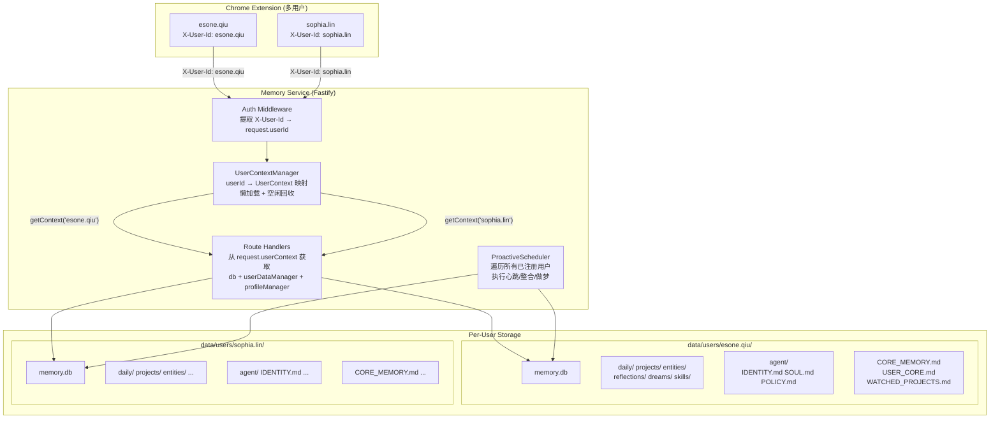

# Memory Service 多用户架构重构方案

## 一、当前问题总结

当前 memory-service 是**纯单用户设计**，具体问题：

- `server.ts` 中 `buildApp()` 创建单一全局 `Database` 实例 + 单一 `UserDataManager`
- `const routeOpts = { db: rawDb }` -- 所有路由共享同一个 db
- `ProactiveScheduler` 接受单一 db，只为一个用户执行心跳/整合
- `ProfileManager` 接受单一 db，只管理一份 Agent Persona
- 所有 16 个 route handler 通过 `opts.db` 获取数据库，无 userId 概念
- `UserDataManager` 是单例模式，只管理一个 `data/` 目录
- 数据库 schema 无 `user_id` 列（**这点不需要改**，通过文件级隔离）

## 二、目标架构




## 三、Per-User 目录结构

```
data/
├── users/
│   ├── esone.qiu/                    ← 用户 A 的独立空间
│   │   ├── memory.db                  ← 独立 SQLite（全部表数据）
│   │   ├── CORE_MEMORY.md             ← 核心长期记忆
│   │   ├── USER_CORE.md               ← 画像渲染快照
│   │   ├── WATCHED_PROJECTS.md        ← 关注项目
│   │   ├── daily/                     ← 每日日志
│   │   ├── projects/                  ← 项目摘要
│   │   ├── entities/                  ← 实体档案
│   │   │   ├── people/
│   │   │   ├── topics/
│   │   │   ├── organizations/
│   │   │   └── technologies/
│   │   ├── reflections/               ← 反思记录
│   │   ├── dreams/                    ← 做梦输出
│   │   ├── skills/                    ← 规则沉淀
│   │   └── agent/                     ← AI 对该用户的自画像
│   │       ├── IDENTITY.md
│   │       ├── SOUL.md
│   │       └── POLICY.md
│   │
│   └── sophia.lin/                    ← 用户 B（同上结构）
│       ├── memory.db
│       └── ...
│
└── shared/                            ← 共享资源（可选）
    └── models/                        ← 嵌入模型缓存（多用户共用）
```

**备份/导出**：打包 `data/users/esone.qiu/` 即为该用户的完整记忆备份。

## 四、核心新增组件

### 4.1 UserContextManager（核心枢纽）

**新增文件**: [memory-service/src/core/UserContextManager.ts](memory-service/src/core/UserContextManager.ts)

```typescript
interface UserContext {
  userId: string;
  db: BetterSqlite3.Database;           // 该用户独立的 SQLite 连接
  database: Database;                    // Database wrapper（含 migration）
  userDataManager: UserDataManager;      // 该用户的 Markdown 目录管理
  profileManager: ProfileManager;        // 该用户的画像管理
  lastAccessedAt: number;
  createdAt: number;
}

class UserContextManager {
  private contexts = new Map<string, UserContext>();
  private baseDataDir: string;           // 'data/users'
  private maxIdleMs = 30 * 60 * 1000;    // 30分钟空闲回收
  private evictTimer: NodeJS.Timeout;

  constructor(baseDataDir: string) {
    this.baseDataDir = path.join(baseDataDir, 'users');
    // 定时清理空闲连接
    this.evictTimer = setInterval(() => this.evictIdle(), 5 * 60 * 1000);
  }

  // 获取或创建用户上下文（懒加载）
  async getContext(userId: string): Promise<UserContext> {
    let ctx = this.contexts.get(userId);
    if (ctx) {
      ctx.lastAccessedAt = Date.now();
      return ctx;
    }
    // 创建用户独立空间
    const userDir = path.join(this.baseDataDir, userId);
    const database = new Database({ dataDir: userDir });
    database.migrate();
    const udm = new UserDataManager();
    udm.initialize(userDir);
    const pm = new ProfileManager(database.raw);
    pm.ensureSeedProfiles();
    ctx = {
      userId,
      db: database.raw,
      database,
      userDataManager: udm,
      profileManager: pm,
      lastAccessedAt: Date.now(),
      createdAt: Date.now(),
    };
    this.contexts.set(userId, ctx);
    return ctx;
  }

  // 获取所有已注册用户ID（扫描 data/users/ 下的目录名）
  getRegisteredUserIds(): string[] {
    if (!fs.existsSync(this.baseDataDir)) return [];
    return fs.readdirSync(this.baseDataDir).filter(name => {
      const stat = fs.statSync(path.join(this.baseDataDir, name));
      return stat.isDirectory() && !name.startsWith('.');
    });
  }

  // 获取所有活跃上下文（内存中已加载的）
  getActiveContexts(): UserContext[] {
    return Array.from(this.contexts.values());
  }

  // 关闭指定用户连接
  closeContext(userId: string): void {
    const ctx = this.contexts.get(userId);
    if (ctx) {
      ctx.database.close();
      this.contexts.delete(userId);
    }
  }

  // 关闭所有连接
  closeAll(): void {
    for (const ctx of this.contexts.values()) {
      ctx.database.close();
    }
    this.contexts.clear();
    clearInterval(this.evictTimer);
  }

  // 清理空闲连接
  private evictIdle(): void {
    const now = Date.now();
    for (const [userId, ctx] of this.contexts.entries()) {
      if (now - ctx.lastAccessedAt > this.maxIdleMs) {
        console.log(`[UserContextManager] Evicting idle user: ${userId}`);
        ctx.database.close();
        this.contexts.delete(userId);
      }
    }
  }
}
```

**关键设计决策**：

- **懒加载**：首次请求某用户时才创建 DB + 目录
- **自动创建**：如果用户目录不存在，`getContext()` 自动创建（首次 ingest 时触发）
- **空闲回收**：30 分钟无访问的用户上下文关闭 SQLite 连接释放内存
- **用户注册**：以 `data/users/` 下的目录名作为用户列表，无需额外注册 API

### 4.2 Auth Middleware（认证中间件）

**新增文件**: [memory-service/src/middleware/auth.ts](memory-service/src/middleware/auth.ts)

```typescript
import type { FastifyRequest, FastifyReply } from 'fastify';
import type { UserContextManager } from '../core/UserContextManager.js';

const VALID_USER_ID = /^[a-z0-9._-]+$/i;

// 不需要用户上下文的路径白名单
const SKIP_PATHS = ['/health', '/docs', '/docs/'];

export function createAuthMiddleware(ucm: UserContextManager) {
  return async function authMiddleware(
    request: FastifyRequest,
    reply: FastifyReply
  ): Promise<void> {
    // 跳过健康检查和文档路径
    if (SKIP_PATHS.some(p => request.url.startsWith(p))) {
      return;
    }

    // 1. 从 header 提取 userId
    const userId = request.headers['x-user-id'] as string | undefined;

    if (!userId) {
      // 单用户兼容模式：使用默认用户
      request.userId = 'default';
    } else {
      // 验证 userId 格式
      if (!VALID_USER_ID.test(userId)) {
        return reply.code(400).send({
          error: 'Invalid X-User-Id format. Use only a-z, 0-9, dot, hyphen, underscore.'
        });
      }
      request.userId = userId;
    }

    // 2. 获取该用户的上下文
    try {
      request.userContext = await ucm.getContext(request.userId);
    } catch (err) {
      request.log.error(err, `Failed to get context for user: ${request.userId}`);
      return reply.code(500).send({ error: 'Failed to initialize user context' });
    }
  };
}
```

**用户标识方式**：使用 `X-User-Id` header（与旧 ChromaDB 的 `${username}-messages` collection 命名约定一致）。

### 4.3 Fastify 类型扩展

**修改文件**: [memory-service/src/types/index.ts](memory-service/src/types/index.ts)

在现有类型文件中添加：

```typescript
import type { UserContext } from '../core/UserContextManager.js';

declare module 'fastify' {
  interface FastifyRequest {
    userId: string;
    userContext: UserContext;
  }
}
```

## 五、需要改造的现有文件清单

### 5.1 server.ts — 主入口

**改造文件**: [memory-service/src/server.ts](memory-service/src/server.ts)


| 改造点                 | 旧代码                                                    | 新代码                                          |
| ------------------- | ------------------------------------------------------ | -------------------------------------------- |
| 全局 db 创建            | `database = new Database({ dataDir: config.dataDir })` | 移除，改由 `UserContextManager` 按需创建              |
| UserDataManager 初始化 | `userDataManager.initialize(config.dataDir)`           | 移除全局初始化，UserContextManager 中按用户初始化           |
| ProfileManager seed | `new ProfileManager(rawDb).ensureSeedProfiles()`       | 移到 UserContextManager.getContext() 中         |
| routeOpts           | `{ db: rawDb }`                                        | `{ userContextManager }`                     |
| ProactiveScheduler  | `new ProactiveScheduler(db)`                           | `new ProactiveScheduler(userContextManager)` |
| 注册 auth hook        | 无                                                      | `app.addHook('onRequest', authMiddleware)`   |


改造后的 `buildApp()` 核心结构：

```typescript
export async function buildApp(options = {}) {
  const config = getConfig();

  // 创建 UserContextManager（不再创建全局 db）
  const userContextManager = new UserContextManager(config.dataDir);

  const app = Fastify({ logger: { level: config.logLevel } });

  // 注册 auth 中间件
  const authMiddleware = createAuthMiddleware(userContextManager);
  app.addHook('onRequest', authMiddleware);

  // 路由传入 userContextManager 而不是 db
  const routeOpts = { userContextManager };
  await app.register(async (instance) => {
    await instance.register(ingestRoutes, routeOpts);
    await instance.register(recallRoutes, routeOpts);
    // ... 所有路由
  }, { prefix: '/api/v1' });

  // health 路由不需要用户上下文
  await app.register(healthRoutes);

  return { app, userContextManager };
}

async function main() {
  const { app, userContextManager } = await buildApp();

  // ProactiveScheduler 接受 UserContextManager
  const scheduler = new ProactiveScheduler(userContextManager);
  scheduler.start();

  const shutdown = async (signal: string) => {
    scheduler.stop();
    await app.close();
    userContextManager.closeAll();  // 关闭所有用户 db 连接
    process.exit(0);
  };
  // ...
}
```

### 5.2 所有 Route Handlers（16 个文件）

**统一改造模式**：

```typescript
// === 旧代码（所有 route 文件中） ===
export async function ingestRoutes(
  instance: FastifyInstance,
  opts: { db: BetterSqlite3.Database }
) {
  instance.post('/ingest', async (request, reply) => {
    const pipeline = new IngestionPipeline(opts.db, ...);
    // ...
  });
}

// === 新代码 ===
import type { UserContextManager } from '../core/UserContextManager.js';

export async function ingestRoutes(
  instance: FastifyInstance,
  opts: { userContextManager: UserContextManager }
) {
  instance.post('/ingest', async (request, reply) => {
    const { db } = request.userContext;  // 从用户上下文获取
    const pipeline = new IngestionPipeline(db, ...);
    // ...
  });
}
```

**需要改造的 16 个文件**（全在 [memory-service/src/routes/](memory-service/src/routes/)）：


| #   | 文件                   | 改造要点                                                      |
| --- | -------------------- | --------------------------------------------------------- |
| 1   | `ingest.ts`          | `opts.db` → `request.userContext.db`                      |
| 2   | `ingestBatch.ts`     | 同上                                                        |
| 3   | `recall.ts`          | 同上                                                        |
| 4   | `ask.ts`             | 同上 + `userDataManager` 也从 userContext 获取（读 CORE_MEMORY 等） |
| 5   | `entities.ts`        | `opts.db` → `request.userContext.db`                      |
| 6   | `projects.ts`        | 同上                                                        |
| 7   | `notifications.ts`   | 同上                                                        |
| 8   | `confirmRequests.ts` | 同上                                                        |
| 9   | `consolidate.ts`     | 同上 + `userDataManager` 从 userContext                      |
| 10  | `export.ts`          | 同上 + `userDataManager` 从 userContext                      |
| 11  | `stats.ts`           | 同上                                                        |
| 12  | `config.ts`          | 同上                                                        |
| 13  | `feedback.ts`        | 同上                                                        |
| 14  | `events.ts`          | 同上                                                        |
| 15  | `profile.ts`         | 同上 + `profileManager` 从 userContext                       |
| 16  | `agent.ts`           | 同上 + `profileManager` 从 userContext                       |
| --  | `health.ts`          | **不变**（不需要用户上下文，独立注册）                                     |


### 5.3 ProactiveScheduler — 多用户调度

**改造文件**: [memory-service/src/core/ProactiveScheduler.ts](memory-service/src/core/ProactiveScheduler.ts)

**旧设计**：接受单一 `db`，内部直接创建 `HeartbeatLoop(db)` / `ConsolidationEngine(db)` / `GenerativeReplay(db)`。

**新设计**：接受 `UserContextManager`，心跳时遍历所有已注册用户。

```typescript
class ProactiveScheduler {
  private ucm: UserContextManager;

  constructor(ucm: UserContextManager) {
    this.ucm = ucm;
  }

  start(): void {
    const config = getConfig();

    // Heartbeat: 每 N 分钟遍历所有活跃用户
    this.heartbeatIntervalId = setInterval(
      () => this.runHeartbeatForAllUsers(),
      config.heartbeatIntervalMs
    );

    // Daily cron: 遍历所有已注册用户
    this.dailyTask = cron.schedule(config.dailyCron,
      () => this.runDailyForAllUsers()
    );

    // Weekly cron
    this.weeklyTask = cron.schedule(config.weeklyCron,
      () => this.runWeeklyForAllUsers()
    );
  }

  private async runHeartbeatForAllUsers(): Promise<void> {
    const userIds = this.ucm.getRegisteredUserIds();
    for (const userId of userIds) {
      try {
        const ctx = await this.ucm.getContext(userId);
        const heartbeat = new HeartbeatLoop(ctx.db);
        await heartbeat.run();
      } catch (err) {
        console.error(`[Heartbeat] Error for user ${userId}:`, err);
      }
    }
  }

  private async runDailyForAllUsers(): Promise<void> {
    const userIds = this.ucm.getRegisteredUserIds();
    for (const userId of userIds) {
      try {
        const ctx = await this.ucm.getContext(userId);
        const engine = new ConsolidationEngine(ctx.db);
        await engine.runDaily();
      } catch (err) {
        console.error(`[DailyConsolidation] Error for user ${userId}:`, err);
      }
    }
  }

  private async runWeeklyForAllUsers(): Promise<void> {
    const userIds = this.ucm.getRegisteredUserIds();
    for (const userId of userIds) {
      try {
        const ctx = await this.ucm.getContext(userId);
        const replay = new GenerativeReplay(ctx.db);
        await replay.run();
      } catch (err) {
        console.error(`[WeeklyDreaming] Error for user ${userId}:`, err);
      }
    }
  }
}
```

### 5.4 UserDataManager — 去掉单例模式

**改造文件**: [memory-service/src/storage/UserDataManager.ts](memory-service/src/storage/UserDataManager.ts)

改造内容：

- 移除底部的单例代码（`_instance` 变量和 `getUserDataManager()` 函数）
- `DIRECTORY_TREE` 新增 `'agent'` 子目录
- `initialize()` 中新增 `agent/IDENTITY.md`、`agent/SOUL.md`、`agent/POLICY.md` 的 seed 文件

```typescript
// 在 DIRECTORY_TREE 中新增
const DIRECTORY_TREE = [
  'daily',
  'projects',
  'entities/people',
  'entities/topics',
  'entities/organizations',
  'entities/technologies',
  'skills',
  'reflections',
  'dreams',
  'agent',              // 新增：AI 对该用户的自画像
] as const;

// 移除底部的这段代码：
// let _instance: UserDataManager | null = null;
// export function getUserDataManager(): UserDataManager { ... }
```

全局搜索 `getUserDataManager()` 的调用点，替换为从 `UserContext` 获取：


| 调用位置                          | 旧代码                    | 新代码                                   |
| ----------------------------- | ---------------------- | ------------------------------------- |
| `server.ts`                   | `getUserDataManager()` | 移除，由 UserContextManager 创建            |
| `routes/export.ts`            | `getUserDataManager()` | `request.userContext.userDataManager` |
| `routes/consolidate.ts`       | `getUserDataManager()` | `request.userContext.userDataManager` |
| `core/MarkdownManager.ts`     | `getUserDataManager()` | 构造函数接受 `userDataManager` 参数           |
| `core/ConsolidationEngine.ts` | `getUserDataManager()` | 构造函数接受 `userDataManager` 参数           |
| `core/ExportEngine.ts`        | `getUserDataManager()` | 构造函数接受 `userDataManager` 参数           |
| 其他 core/ 文件                   | 需要逐个检查                 | 从参数传入                                 |


### 5.5 核心引擎 — 构造函数签名统一

所有 `src/core/` 引擎类的构造函数统一改为接受 `UserContext` 或 `(db, userDataManager)` 二元组：

```typescript
// 旧代码
class ConsolidationEngine {
  constructor(db: Database) { ... }
}

// 新代码（方案A：传入完整 UserContext）
class ConsolidationEngine {
  constructor(ctx: UserContext) {
    this.db = ctx.db;
    this.userDataManager = ctx.userDataManager;
    this.profileManager = ctx.profileManager;
  }
}

// 新代码（方案B：传入分离参数，更灵活）
class ConsolidationEngine {
  constructor(db: Database, userDataManager: UserDataManager) { ... }
}
```

**推荐方案 A**（传入 `UserContext`），因为多数引擎都需要 db + userDataManager + profileManager 三者。

涉及的文件：

- [memory-service/src/core/IngestionPipeline.ts](memory-service/src/core/IngestionPipeline.ts)
- [memory-service/src/core/RecallEngine.ts](memory-service/src/core/RecallEngine.ts)
- [memory-service/src/core/MarkdownManager.ts](memory-service/src/core/MarkdownManager.ts)
- [memory-service/src/core/ConsolidationEngine.ts](memory-service/src/core/ConsolidationEngine.ts)
- [memory-service/src/core/HeartbeatLoop.ts](memory-service/src/core/HeartbeatLoop.ts)
- [memory-service/src/core/OnlineReflection.ts](memory-service/src/core/OnlineReflection.ts)
- [memory-service/src/core/ExportEngine.ts](memory-service/src/core/ExportEngine.ts)
- [memory-service/src/core/GenerativeReplay.ts](memory-service/src/core/GenerativeReplay.ts)
- [memory-service/src/core/ForgettingEngine.ts](memory-service/src/core/ForgettingEngine.ts)
- [memory-service/src/core/SalienceScorer.ts](memory-service/src/core/SalienceScorer.ts)
- [memory-service/src/core/TruthMaintainer.ts](memory-service/src/core/TruthMaintainer.ts)
- [memory-service/src/core/ProactivityPolicy.ts](memory-service/src/core/ProactivityPolicy.ts)
- [memory-service/src/core/ProfileManager.ts](memory-service/src/core/ProfileManager.ts)

### 5.6 Database 类 — 无需大改

**文件**: [memory-service/src/storage/Database.ts](memory-service/src/storage/Database.ts)

当前 `Database` 已支持通过构造函数传入 `dataDir`：

```typescript
constructor(config?: DatabaseConfig) {
  const dataDir = config?.dataDir ?? appConfig.dataDir;
  this.dbPath = config?.dbPath ?? path.join(dataDir, 'memory.db');
}
```

UserContextManager 中这样调用即可：

```typescript
const database = new Database({ dataDir: 'data/users/esone.qiu' });
// → db 文件在 data/users/esone.qiu/memory.db
```

无需修改 Database 类本身。

## 六、Chrome Extension 端改造

**改造文件**: `src/services/MemoryServiceClient.ts`（Chrome Extension 中）

```typescript
class MemoryServiceClient {
  private baseUrl: string;
  private userId: string;       // 新增

  constructor(baseUrl: string, userId: string) {
    this.baseUrl = baseUrl;
    this.userId = userId;
  }

  private async fetch(path: string, options: RequestInit = {}): Promise<Response> {
    return fetch(`${this.baseUrl}${path}`, {
      ...options,
      headers: {
        'Content-Type': 'application/json',
        'X-User-Id': this.userId,    // 每个请求带上用户标识
        ...options.headers,
      },
    });
  }
}
```

**userId 来源**：

- 首选：Chrome Extension 的 `chrome.identity.getProfileUserInfo()` 获取当前 Chrome profile 的 email
- 备选：在 options page 中手动配置用户名
- 格式：与旧 ChromaDB collection 命名一致，如 `esone.qiu`

## 七、数据迁移（现有数据 → 多用户结构）

现有 `data/` 目录下已有数据需要迁移到 `data/users/default/`：

```bash
# 迁移脚本逻辑
mkdir -p data/users/default
mv data/memory.db data/users/default/memory.db
mv data/daily data/users/default/daily
mv data/projects data/users/default/projects
mv data/entities data/users/default/entities
mv data/reflections data/users/default/reflections
mv data/dreams data/users/default/dreams
mv data/skills data/users/default/skills
mv data/CORE_MEMORY.md data/users/default/CORE_MEMORY.md
mv data/USER_CORE.md data/users/default/USER_CORE.md
mv data/WATCHED_PROJECTS.md data/users/default/WATCHED_PROJECTS.md
mv data/config.json data/users/default/config.json
# agent persona 文件（如果存在）
mkdir -p data/users/default/agent
# IDENTITY.md / SOUL.md / POLICY.md 由 ProfileManager seed 自动创建
```

可以在 UserContextManager 中加一个自动迁移检测：如果 `data/memory.db` 存在但 `data/users/` 不存在，自动执行迁移。

## 八、关键设计决策总结


| 决策点          | 选择                                     | 理由                          |
| ------------ | -------------------------------------- | --------------------------- |
| 用户标识格式       | `X-User-Id: esone.qiu`                 | 与旧 ChromaDB collection 命名一致 |
| 用户创建方式       | 首次 `getContext(userId)` 时自动创建          | 无需额外注册 API，最简单              |
| 隔离方式         | Per-user SQLite + Per-user Markdown 目录 | 表 schema 零修改，天然完全隔离         |
| 连接池策略        | 无上限，30 分钟空闲回收                          | Personal AI 用户数有限           |
| Scheduler 策略 | 单 scheduler 遍历所有用户                     | 避免 per-user 定时器爆炸           |
| 向后兼容         | 无 header 时用 `'default'` 用户             | 不破坏现有单用户使用                  |
| 画像存储         | 每用户独立：DB 表 + agent/ 目录                 | AI persona 可针对不同用户演化        |


## 九、实施步骤（8 步）

### Step 1: 基础设施（UserContextManager + Auth + 类型）

1. 创建 `src/core/UserContextManager.ts` — 完整实现上述代码
2. 创建 `src/middleware/auth.ts` — 认证中间件
3. 修改 `src/types/index.ts` — 添加 Fastify request 类型扩展
4. 修改 `src/storage/UserDataManager.ts` — 去掉单例 + 新增 agent/ 目录

### Step 2: server.ts 重构

1. 移除全局 db / userDataManager / profileManager 初始化
2. 创建 UserContextManager 实例
3. 注册 auth hook（排除 /health 和 /docs）
4. 修改 routeOpts 为 `{ userContextManager }`
5. ProactiveScheduler 接受 userContextManager
6. graceful shutdown 中调用 `userContextManager.closeAll()`

### Step 3: Route Handlers 批量改造（16 个文件）

统一将 `opts.db` 替换为 `request.userContext.db`。对需要 userDataManager 或 profileManager 的路由，也从 `request.userContext` 获取。

### Step 4: 核心引擎改造

1. 全局搜索 `getUserDataManager()` 调用，替换为参数传入
2. 统一引擎构造函数签名为接受 `UserContext` 或 `(db, udm)` 参数
3. 确保无任何引擎直接使用全局单例

### Step 5: ProactiveScheduler 多用户改造

1. 构造函数 `db` → `UserContextManager`
2. 心跳/日整合/周做梦改为遍历所有已注册用户
3. 每个用户的任务用 try-catch 隔离，一个用户失败不影响其他用户

### Step 6: 数据迁移

1. 创建迁移脚本/函数，将 `data/` 内容移到 `data/users/default/`
2. 在 UserContextManager 构造函数中添加自动迁移检测

### Step 7: Chrome Extension 端适配

1. `MemoryServiceClient` 构造函数增加 `userId` 参数
2. 所有 HTTP 请求添加 `X-User-Id` header
3. userId 从 `chrome.identity.getProfileUserInfo()` 或 options page 获取

### Step 8: 验证 + 清理

1. 测试多用户隔离：两个不同 userId 的请求数据不互相干扰
2. 测试单用户兼容：无 header 时使用 default 用户，行为与改造前一致
3. 测试空闲回收：30 分钟后 SQLite 连接被释放
4. 更新 README + .env.example
5. 更新 OpenAPI spec（新增 X-User-Id header 定义）
6. 更新 docker-compose.yml 数据卷映射

