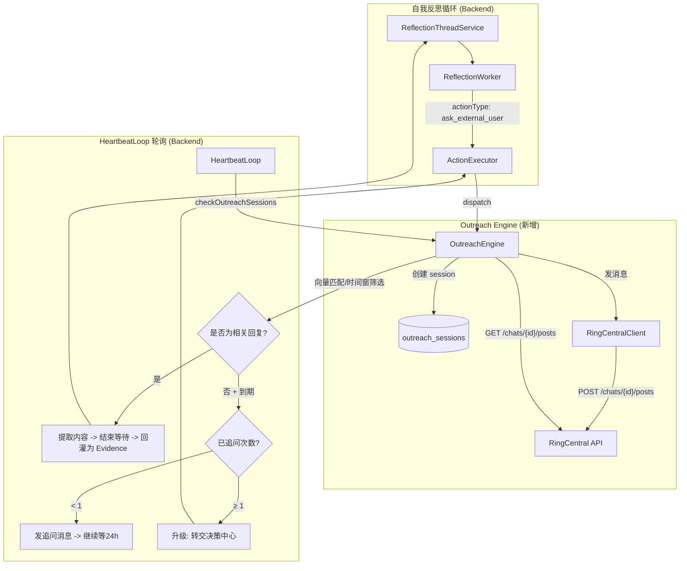

# 自我反思 → RingCentral 主动提问 + 等待回复 功能方案

## 背景

当 Memory Service 的自我反思系统（ReflectionWorker / ReflectionPlanner）思考到**需要向某个用户确认或获取信息**时，希望能：

1. **通过 RingCentral (Glip) 向特定用户或群组发消息提问**
2. **等待并监控对方的回复**
3. **如果超时未获得相关回复 → 自动追问 1 次**
4. **如果追问后仍无答复 → 升级给决策中心**

---

## 核心设计决策 (基于您的确认)

### 1. 消息通道选择
- 我们将在 Memory Service 后端直接使用 **RingCentral REST API (JWT 鉴权)** 进行发送和读取消息。
- **配置方式：** 在 Chrome 插件的设置页面（[src/options.tsx](file:///Users/Esone/git/personal-ai/src/options.tsx)）增加配置项（"开启主动询问"开关，JWT Token, Client ID, Client Secret 等）。这些配置将同步给后端的 RuntimeConfig。这样您就可以在界面上随时开启和提供鉴权参数，并附带 [RingCentral Developer Portal](https://developer.ringcentral.com/) 的链接。

### 2. 前端能力的独立性
- 完全同意：保留现有的 FollowThread 和 AutoReply（它们继续承担原有的前端职责），不会将它们强行迁移到后端的这一套流程中。后端的 OutreachEngine 只负责"反思系统的主动发问 → 监控回复"。

### 3. 追问策略参数
- 您觉得默认策略太频繁。我们将设置更加平缓的默认值：**提问后等待 24 小时（1天），追问 1 次后再等 24 小时。** 这些参数会在发送 action 时指定，如果您想要在 UI 上进行配置也可以。

---

## 常见疑问解答：触发场景与 UI 需求

**1. 询问会在什么场景下触发？有触发逻辑么？**

这是在后端的 [ReflectionWorker](file:///Users/Esone/git/personal-ai/memory-service/src/core/ReflectionWorker.ts#64-290) (也就是定期的大模型自我反思环节) 中触发的。
- **触发逻辑：** 后端在整合近期记忆（比如您看了几篇文章，或者记录了几个待办）时，大模型会分析这些信息是否存在"认知缺失"或"需要跟外部团队确认的假设"。
- **示例场景：**
  - **信息不全：** 比如大模型看到聊天记录里提到 "Alice 说新项目有个 deadline"，但没说具体日期。反思大模型在尝试完善实体信息时，发现缺失关键项，就会生成 `ask_external_user` 动作，去私聊 Alice 询问："Hi Alice，请问新项目的 deadline 确定了吗？"。
  - **假设验证：** 您在笔记里写 "可能下周需要部署"，系统在重放/整理时想要确认，如果你标注了相关干系人是 Bob，它可能会私聊 Bob："Hi Bob，请问下周确定要部署吗？"

**2. 这个需要 UI 界面么？**

- **配置 UI：** 需要。在 Chrome Extension 的 options 页面增加 JWT 授权和主动询问的开关。
- **流程 UI（主要逻辑在后端，无需复杂的独立 UI）：** 提问是后端自发执行的（静默的），只要它收集到答复，就会自动送回反思线程作为新的 Evidence。
- **需要 UI 的只有 "升级"：** 如果追问 1 次后对方仍不理睬，后端会生成一个 `create_confirm_request`。这时候它会出现在您现有的 **"决策中心 (Decision Center)"** 中（就是您目前的 Chrome UI），提示："Alice 两天都没回，是否需要继续跟进本话题？" 让您通过按钮决策。

不需要额外做一套专门用于发请求的界面。

---

## 架构方案



---

## 数据模型

### 新增表：`outreach_sessions`

```sql
CREATE TABLE IF NOT EXISTS outreach_sessions (
  id TEXT PRIMARY KEY,
  thread_id TEXT,                           -- 关联的 reflection thread
  run_id TEXT,                              -- 关联的 reflection run
  action_id TEXT,                           -- 触发此 session 的 action id
  
  -- 目标
  target_type TEXT NOT NULL,                -- 'user' | 'group'
  target_id TEXT NOT NULL,                  -- RingCentral chat ID / user email
  target_display_name TEXT,                 -- 显示名（用于日志）
  
  -- 消息
  question TEXT NOT NULL,                   -- 提问内容
  context TEXT,                             -- 提问背景（供追问时参考）
  sent_post_id TEXT,                        -- 发送的第一条消息 ID
  sent_chat_id TEXT,                        -- 发送到的会话 ID
  
  -- 追问控制
  followup_count INTEGER DEFAULT 0,         -- 已追问次数
  max_followup INTEGER DEFAULT 1,           -- 默认最大追问 1 次
  followup_interval_seconds INTEGER DEFAULT 86400, -- 默认追问间隔 1 天
  last_followup_at INTEGER,                 -- 上次活动时间
  
  -- 状态与结果
  wait_until INTEGER,                       -- 下次检查/超时的时刻点
  status TEXT DEFAULT 'pending',            -- pending | waiting_reply | followup_sent | resolved | escalated | cancelled
  reply_post_id TEXT,                       -- 若匹配成功，保留对方回复 ID
  reply_content TEXT,                       -- 若匹配成功，记录回复内容
  reply_sender TEXT,                        -- 回复者标识
  resolved_at INTEGER,                      -- 完结时间
  
  -- 其他
  priority INTEGER DEFAULT 5,
  created_at INTEGER NOT NULL,
  updated_at INTEGER NOT NULL
);

CREATE INDEX IF NOT EXISTS idx_outreach_status ON outreach_sessions(status, wait_until);
CREATE INDEX IF NOT EXISTS idx_outreach_thread ON outreach_sessions(thread_id);
```

---

## 实施步骤 (Proposed Changes)

### 1. 前端 UI (Chrome Extension) 与配置同步

#### [MODIFY] [options.tsx](file:///Users/Esone/git/personal-ai/src/options.tsx)
- 新增一处配置区域 **"主动询问 (Self-Reflection Outreach)"**。
- 提供 `OUTREACH_ENABLED` 开关。
- **[NEW] 审核开关**：`OUTREACH_REQUIRE_APPROVAL` (主动对外咨询需要用户审核)，默认开启。开启时，主动生成的 outreach 动作需要用户在页面上点击确认后才发送。
- 输入框: `JWT Token`, `Client ID`, `Client Secret`, `Server URL` (Sandbox/Prod)。
- 附带链接提示前往 `developer.ringcentral.com` 申请具有 `Team Messaging` 权限的 REST API App。

#### [MODIFY] [MemoryServiceClient.ts / config.ts](file:///Users/Esone/git/personal-ai/memory-service/src)
- 在 `UpdateRuntimeConfigPayload` 中支持接收这些 RC 配置和审核开关，并持久化在后端的 runtime config。

### 2. 定时消息管理 (Scheduled Messages UI) 支持手动发问

#### [MODIFY] [ScheduledMessagesManager.tsx](file:///Users/Esone/git/personal-ai/src/scheduled-messages/ScheduledMessagesManager.tsx)
- **前端页面集成**：在 AddMessageDialog 中新增 "主动询问 (Outreach)" 模板。
- **数据双写机制（类似 Jira Rule）**：
  - **保存与编辑**：前端执行新增或编辑时，依然首选将记录**保存更新到 Google Sheet** 中。同时，由于它是 `Outreach` 特殊类型，会额外发送 API 请求给 Memory Service (`POST / PUT /outreach-sessions`) 将配置同步到后端的引擎数据库。
  - **列表展示**：每次打开管理页查询列表时，主数据流仍然只获取一次 Sheet 的所有记录，这样保证了列表统一且完整。
  - **状态同步**：和现在的 jiraAutomation 类似，初始化列表数据后，再针对这个特殊的 `Outreach` 类型请求一次后端 API，去拿回它真实的引擎内部执行状态（例如是 pending 等待触发、waiting_reply 等待客户回复或是 resolved 已经答复）展示在界面上。
  - **删除**：从 Sheet 删除该条记录时，同步向后端发起 `POST /outreach-sessions/:id/cancel` 取消底层的监控引擎流转。

### 3. 未配置 Token 时的静默兜底与推广
- **Token 缺失兜底**：如果在新建（或后端自动发起）Outreach 时，用户没有配置 RingCentral Token，**前端不再生硬阻拦**，后端也照常生成此动作。
- **强制转入人工审核**：该 Outreach 动作会强行进入 `pending_approval` 状态并推送到“决策中心”。
- **附带跳转引导**：在决策中心的卡片上，会显示一个明显的警告："⚠️ 该询问需要发送 RingCentral 消息，但您尚未配置 Token。请前往 [Options 设置页面] 配置以启用此组件。" 借此推广该功能。

---

### 4. 后端 RingCentral 客户端

#### [NEW] [RingCentralClient.ts](file:///Users/Esone/git/personal-ai/memory-service/src/integrations/RingCentralClient.ts)
- 从 Runtime Config 取出 JWT 和 Client 参数。
- 实现 `authenticate()` 交换 Access Token（带自动刷新）。
- 实现向单聊/群聊发送文本 (`POST /team-messaging/v1/chats/{chatId}/posts`)。
- 实现拉取聊天记录 (`GET /team-messaging/v1/chats/{chatId}/posts`)。

### 4. Outreach Engine 引擎

#### [NEW] [OutreachEngine.ts](file:///Users/Esone/git/personal-ai/memory-service/src/core/OutreachEngine.ts)
- 提供 `createSession` 将提问存入数据库，调用 `RingCentralClient` 发送第一条消息。
- **[NEW] 审核机制**：如果 `OUTREACH_REQUIRE_APPROVAL` 为 true，在 `createSession` 时将初始状态设为 `pending_approval`（阻塞等待用户在前端审批）。
- 提供 `checkPendingSessions` 被 Heartbeat 每隔 15 分钟触发一次，读取消息、匹配回复或更新超时。
- **[NEW] 动态追问解析**：在 `matchReply` 判断回复时，除了验证相似度，结合大模型调用进行语义判断。如果对方回复类似 "X天后再看" 或 "下周五给"，提取出具体的 ETA 覆盖 `wait_until`。

#### [NEW] [OutreachRepository.ts](file:///Users/Esone/git/personal-ai/memory-service/src/repositories/OutreachRepository.ts)
- 对 `outreach_sessions` 的封装和 CRUD 操作。

### 5. 连接到现有系统

#### [MODIFY] [ActionExecutor.ts](file:///Users/Esone/git/personal-ai/memory-service/src/core/actions/ActionExecutor.ts)
- 新增 `"ask_external_user"` 动作类型的 dispatch 分支，调用 `OutreachEngine.createSession()`。
- 如果是等待审核状态，产生相应的提醒推给用户。

#### [MODIFY] [ReflectionWorker.ts](file:///Users/Esone/git/personal-ai/memory-service/src/core/ReflectionWorker.ts)
- 补充系统 Prompt 的 `actionProposals` 定义，新增类型描述让大模型知晓：`"ask_external_user": 如果确少关键信息且能从特定用户处获知，则向该用户提问 (目标邮箱或ChatId)`。

#### [MODIFY] [HeartbeatLoop.ts](file:///Users/Esone/git/personal-ai/memory-service/src/core/HeartbeatLoop.ts)
- 在每 15 分钟的循环中增加一步：调用 `outreachEngine.checkPendingSessions()` 去检查有没有需要拉取回复或触发超时的项目。

---

## 验证计划

1. **配置验证（前端 -> 后端）：** 在 Options 里填入 JWT 信息和审核开关，确认能够顺利保存并在后端识别。
2. **定时消息手动提问**：从 Scheduled Messages 新增一条 Outreach 消息，确认它正确触发了后端的提问流程。
3. **逻辑测试：**
   - 包含普通流程的单元测试。
   - **审核测试**：开启审核开关后，主动发问停留在 pending_approval 且页面出现提醒，审核后下发。
   - **动态延期测试**：模拟对方回复 "三天后给你"，观察引擎是否成功捕获并延后了 `wait_until`。
4. **真实联调：**
   - 跑起后端，在数据库塞一条 `ask_external_user` 假动作，查看是否发送到目标邮箱，去 RingCentral 手工回复，看其在下一轮 Heartbeat 中是否被提取。
