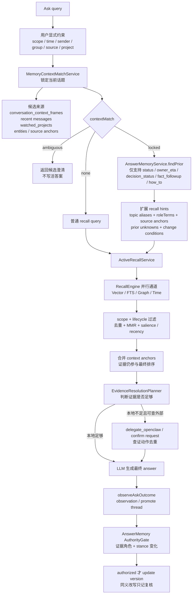
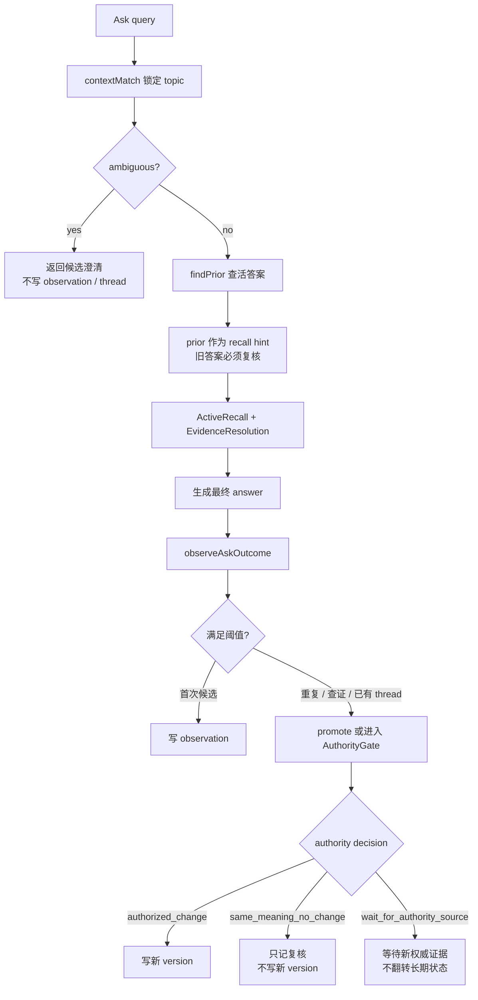

# Ask

_最后更新: 2026-07-09_

Ask 是用户主动向 Personal AI 提问时的记忆问答入口。它的目标不是简单搜索关键词，而是先判断用户到底在问哪个话题，再从消息、网页、会议、外部 AI 对话、实体图谱、时间线和外部查证动作里组织证据，最后给出带来源感的答案。

## 大白话运行逻辑

用户问 Ask 时，系统会按这个顺序工作：

1. 先尊重用户明确给出的范围，例如工作/个人/全部、时间、发送人、群组、source type、project。
2. 如果问题很短，比如“那个 BE ready 了吗”，先锁定它最可能指向的近期话题，而不是直接搜“BE ready”。
3. 如果这个话题以前形成过“活答案”，把上次答案、证据缺口和可能变化条件拿出来作为提示，但不能把旧答案当事实。
4. 再跑正式召回：vector、FTS、graph、time 四通道一起找证据。
5. 把当前场景 anchor、高频互动记忆、旧证据 refs 和普通召回结果一起去重、排序、降权或前置。
6. 如果本地证据不足，判断是否需要外部查证、confirm request，或者明确保持 unknown；如果缺口是未来可能变化的事实，会进入 [Evidence Watch Contracts](./evidence_watch_contracts.md)，Ask response 返回 `evidenceWatch` 收据，用来说明复核状态、来源阻塞和重复动作合并边界。Search Result 的 Ask 答案区会先展示 `Ask 本轮状态`，再展示自动话题锁定、候选承接、证据守望或查证缺口回执，并在答案前显示当前返回 evidence 的来源/通道摘要，最后才展示答案正文，避免把“已锁定话题 / 已建立守望 / 看到某个来源”误读成“事实已确认或全库已覆盖”。
7. 生成答案后，异步观察这次 Ask 是否值得写入 observation、promote 成活答案 thread，或经过权威证据门控后更新活答案 version。

这意味着 Ask 的回答仍然由“本次证据”支撑；活答案 prior 只是帮助系统少走弯路。

## 与其他召回能力的边界

| 能力 | 触发方式 | 主要目标 |
| ---- | -------- | -------- |
| Ask | 用户主动提问 | 给出一个可回答、可追查证据、可复核状态变化的答案 |
| Recall 搜索 | 用户主动搜索 | 返回匹配记忆列表和命中原因 |
| Context Recall | 当前网页、会议、聊天等场景触发 | 在用户正在做事时提示可能相关的记忆线索 |

Ask 与 Context Recall 共用 `MemoryContextMatchService` 做短问句话题锁定，但 Ask 会继续进入答案生成、证据缺口判断和活答案沉淀；Context Recall 更偏向“不打断地提示线索”。

Quick Ask 当前 RingCentral chat context 只是可选 hint；真实使用中用户可能只发送一句“BE 现在怎么样了？”，因此 memory service 必须能依赖近期高频、强互动、强锚点记忆先锁定话题。Ask 会从自然语言 context 里识别 `Current chat title:`、`Current page title:`、`Current conversation:`、`Group name:`、`Thread:` 等常见标签，把会话标题、页面标题和 issue key 作为当前场景锚点。客户端即使把 `Current URL:`、`Selected text:`、`Visible page text:` 放在同一行，服务端也会先切出真正的 title，避免把 URL 或选中文本拼进 topic label。锁定后的 topic frame 只负责补齐检索意图，最终事实仍必须来自 `messages_raw` / chunks / episodes 等原始证据。

如果 `contextMatch` 返回 `ambiguous`，Ask 不会继续生成一个貌似确定的答案，也不会写活答案 observation/thread。返回文案会列出候选话题，并提示用户可以直接回复候选序号，或补上项目、群组、issue key；确认后才继续查证状态和证据。Quick Ask 和 Memory Exploring 的 Search Result Ask 答案区都会把这些候选渲染成按钮；Search Result 会在按钮前展示 `候选选择回执`，说明选择候选只会把短问句绑定到对应话题后继续 Ask，不会确认事实、写活答案或创建外部查证动作。界面和后续对话上下文会回显“选择话题：xxx”，避免用户回看时只看到裸数字。服务端也会读取上一轮 Ask context 里的候选列表和原始问题，把 `2` / `选 2` / `第二个` / `candidate 2` / `second one` 这类回复恢复成“原问题 + 已选话题”再召回；候选列表标题可以是中文 `候选话题：`，也可以是英文 `Candidate topics:` / `Topic candidates:`。如果调用方没有带上一轮 context，则仍需要用户补上项目、群组或 issue key。流式 Ask 也走同一边界：`/ask/stream` 会先发“需要先确认你指的是哪个话题...”状态，然后直接返回候选澄清，不再发“正在生成回答...”或 answer delta。

候选确认后的下一轮 Search Result 会在答案正文前显示 `承接候选回执`：它列出原始短问句、用户选择的候选序号/话题、是否带上上一轮候选上下文，并再次说明这只是补检索锚点，不确认事实、不写活答案、不创建外部查证动作。这样用户连续追问时能看懂“这轮答案继承了什么”，而不是只看到一个裸数字或被拼接过的查询词。

候选澄清只用于真正缺锚点的短指代/短状态问题。完整主题问句如果已经明确写出 subject，例如“Cursor 的成本/性价比结论是什么？这个结论大概是什么时候得出的？”，其中的“这个结论”只指代同一句里的 Cursor 结论，不应触发多话题候选澄清；Ask 会继续进入普通召回或 topic lock，并用返回 evidence 回答。

## 短问句与记忆话题锁定

`/ask` 在正式召回前会先运行 `MemoryContextMatchService`，用于处理用户没有贴完整上下文的短问句。例如用户只问“那个 BE ready 了吗”“那个新 design 定了吗”或“最近那个 MR 合了吗”，系统不能只按字面搜索短词，而要先判断它最可能指向最近哪个项目、thread、ticket 或话题。

`MemoryContextMatchService` 的候选来自：

- `conversation_context_frames`
- 当前页面、聊天、会议等 context
- 最近消息聚合
- `watched_projects`
- `entities`
- source anchors

评分使用通用特征：query/alias/角色词/状态意图兼容度、近期高频和跨来源显著性、用户发送/回复/被 mention 等互动信号、时间衰减，以及 Google Docs UI shell、日历/participant list、无项目锚点的泛 role/team 内容等低信号惩罚。

输出会随 Ask response 或 debug 透出为 `contextMatch`：

| 状态 | Ask 行为 |
| ---- | -------- |
| `locked` | 候选足够强且 top-second gap 足够大。后续召回会用 selected topic 的 aliases、source anchors、role terms 和 source ids 作为 boost/filter；Search Result 会在答案正文前显示 `Ask 话题锁定回执`，说明锁定 topic、依据和“只补检索锚点，不确认事实、不写活答案、不创建外部查证动作”的边界。 |
| `ambiguous` | 前几名候选接近。Ask 应先列出候选让用户确认；不写活答案 observation/thread。 |
| `none` | 没有足够兼容候选，走普通 recall，并避免把低信号网页快照或 UI 文本当作事实上下文。 |

## 查询记忆库的方式和优先级

Ask 不是直接把用户原句丢给向量库。真实链路会先判断“用户到底在问哪个话题”，再决定哪些记忆源应该优先进入召回。



实际读取或匹配的记忆内容可以分成几层：

| 层级 | 读取内容 | 作用 |
| ---- | -------- | ---- |
| 显式约束层 | `scope`、时间、发送人、群组、source type、project、调用方 filters | 用户明确限定的条件优先，后续猜测不能覆盖 |
| 场景话题层 | `conversation_context_frames`、当前页面/会话 context、近期 `messages_raw` 聚合、`watched_projects`、`entities`、source anchors | 解决“那个 / 这个 / BE / new design”到底指哪个近期话题 |
| 活答案层 | `answer_memory_observations`、`answer_memory_threads`、`answer_memory_versions` | 判断这个问题是否是持续信息需求，并把上次答案状态变成召回提示 |
| 原始证据层 | `messages_raw`、`chunks`、`chunks_fts`、`messages_vec`、`chunks_vec` | 真正支撑回答的消息、会议、网页、Jira、AI 对话等原始证据 |
| 图谱语义层 | `entities`、`relationships`、`entity_properties` | 通过人、项目、任务、组织、技术、topic 等实体补充相关线索 |
| 排序治理层 | `memory_metadata`、显著性、访问强化、反馈、lifecycle 状态 | 决定哪些候选更靠前，旧记忆是否降权或归档 |
| 外部查证层 | `proposed_actions`、OpenClaw action result、confirm requests | 本地证据不足时补查外部系统或保留待确认缺口 |

## 活答案记忆

活答案记忆是 Ask 的底层准确度增强，不是新的 Ask UI。它解决的是用户反复问同一类持续状态问题时，系统不要每次都从零开始，也不要把旧答案当事实复述。

当前 P0 行为：

- Ask 前半段先跑 `contextMatch`。只有 `contextMatch.state = locked`，且意图属于 `status`、`owner_eta`、`decision_status`、`fact_followup`、`how_to` 时，才会查活答案 prior。
- prior 只作为“上次当前答案 + 已知缺口 + 改变条件 + 旧证据 refs”进入 prompt 和 recall hints。最终回答仍必须由本次召回或外部查证证据支撑。
- ambiguous、没有 locked topic、没有证据、闲聊、profile broad query、一次性历史查询，都不会创建活答案 thread。
- 首次符合条件的 Ask 只写轻量 `answer_memory_observations`，用于判断是否常问；不会立刻创建完整 thread。
- 90 天内同一 canonical key 第二次出现、已有 thread、本次产生/复用外部查证 action，或未来用户显式反馈继续查证时，才会 promote 成 `answer_memory_threads`。
- 写 `answer_memory_versions` 前先跑 AnswerMemory AuthorityGate。它会把证据分成 `authority`、`supporting`、`derived`、`query`、`prior`：只有本轮召回到的原始消息、chunk、文档、日历等当前 `authority` 证据能驱动长期答案变化；旧 prior、用户问题、LLM 摘要和派生记忆只能辅助召回或解释。
- 同一组 authority evidence 下，如果新答案只是同一 stance 的同义改写，返回 `priorHit` 并记录本轮复核，不写新 version。这样避免“答案 hash 变了就更新”的写放大。
- 同一组 authority evidence 下，如果新答案把状态从 pending 翻成 ready，先返回 `wait_for_authority_source`，不让一次生成结果污染长期答案；必须出现新的 authority evidence 后才允许 `updated`。
- Ask response 的 `answerMemory.receipt` 和 `answerMemory.authority` 会给 UI/排障一个紧凑回执：这轮是 observation、promoted、priorHit、updated 还是 skipped，本轮用了多少当前证据、旧证据只作为多少条 prior 线索、更新是被授权、被同义抑制，还是在等待新的权威来源。Search Result 的 Ask 答案区会把 AuthorityGate 结论先合并进答案前的 `Ask 本轮状态`，再在答案下方保留详细 receipt；用户不用滚动就能看出“同证据同义复核”“等待新的权威证据”“未写新版本”“已写新版本”等边界，避免把旧活答案误看成当前事实。

canonical key 不是原始短问句，而是：

```text
selectedTopic.id/label + intent + roleTerms + source anchors
```

因此“那个 BE ready 了吗？”和“AI VBG 的 BE 部分完成情况如何？”只要被锁定到同一个 topic、intent 和 role/source anchors，就会落到同一条活答案 thread。

存储时机也不是“匹配结束后马上存答案”。正确顺序是：



## API 与诊断字段

`/ask` 保持现有 UI 行为，不新增页面、不弹卡、不改变用户看到的 Ask 展示。底层增强主要通过召回提示、证据锚定和异步活答案观察生效。

Search Result 的 Ask 答案区会把 `resolutionState`、`answerMemory.receipt`、`answerMemory.authority`、`followUpActions`、`externalEvidence` 和 `missingInfo` 合并成第一行 `Ask 本轮状态`。这行在答案正文之前出现，用来先说明本轮是完整、部分、证据不足还是已转待查，当前证据和旧 prior 各有多少，以及这次展示不会自动确认结论、代表用户发消息、执行外部写入，或把缺口写成长期事实。如果 `contextMatch.state = locked`，答案前还会显示 `Ask 话题锁定回执`，让用户先看到短问句被锁到哪个 topic、依据是什么，以及该锁定只是检索锚点补全。如果命中过往活答案但本轮没有当前证据，状态栏会先显示旧答案未复核，明确旧 prior 只作召回提示，不确认当前事实、不写新版本，也不代表用户执行外部动作。如果 AuthorityGate 返回同证据同义、仅辅助证据、等待新权威证据、已建立 thread 或已写新版本，状态栏会直接说明“未写新版本 / 不能改写长期答案 / 等待权威证据 / 已写新版本”等门控结果；下面的活答案、范围、查证/缺口回执仍保留，用于看更细的证据门控和后续动作状态。

当 Ask response 带有 `evidence` 时，Search Result 会在答案正文前显示 `Ask 证据来源回执`。它只汇总当前 response 返回的可见 evidence：证据数量、类型、Top 来源/标题和召回通道；它不是全库覆盖证明，不会重新读取连接器、确认事实、写活答案、创建外部查证动作或代表用户发送消息。这个回执的目的类似企业搜索产品里的 answer citations：先让用户知道“这轮答案基于哪些可见证据切片”，再读正文和下面的详细证据列表。

Ask response 会带可选诊断字段 `answerMemory`，用于 eval 和排障：

```ts
answerMemory?: {
  state: 'priorHit' | 'observed' | 'promoted' | 'updated' | 'skipped';
  threadId?: string;
  canonicalKey?: string;
  skipReason?: string;
  receipt?: {
    label: string;
    detail: string;
    tone: 'info' | 'success' | 'warning' | 'muted';
    currentEvidenceCount?: number;
    priorEvidenceCount?: number;
    followUpActionCount?: number;
    missingInfoCount?: number;
    stale?: boolean;
  };
  authority?: {
    decision:
      | 'authorized_change'
      | 'same_meaning_no_change'
      | 'supporting_only'
      | 'wait_for_authority_source';
    summary: string;
    evidenceRoles: Array<{
      role: 'authority' | 'supporting' | 'derived' | 'query' | 'prior';
      count: number;
      reason: string;
    }>;
    currentStance?: string;
    priorStance?: string;
    sameEvidence?: boolean;
    suppressedUpdate?: boolean;
  };
}
```

当本轮问题属于“事实可能变化 / 需要未来复核 / 来源暂不可读”时，Ask response 还会带可选 `evidenceWatch`：

```ts
evidenceWatch?: {
  contractId: string;
  state: 'active' | 'quiet_no_change' | 'due' | 'authority_changed' | 'source_blocked' | 'paused' | 'archived';
  label: string;
  detail: string;
  subjectKey: string;
  lastCheckedAt?: number;
  nextCheckAt?: number;
  confirmRequestId?: string;
  duplicateSuppressedCount: number;
  runId?: string;
  lastRunState?: 'created' | 'checked_no_change' | 'checked_changed' | 'blocked' | 'skipped_budget' | 'skipped_duplicate' | 'needs_user_decision';
  lastRunSummary?: string;
  created?: boolean;
}
```

这个字段只表示 Personal AI 已建立或命中证据守望契约，并记录本轮是否复用/抑制了重复查证动作；它不会自动确认事实、代表用户发消息、执行外部写入，或把旧答案当成当前事实。Search Result 的 Ask 答案区会把它渲染成 `Ask 证据守望回执`，在答案正文前展示守望状态、对象、是否本轮新建、确认项、重复查证抑制、上次/下次检查时间，并把守望状态合并进 `Ask 本轮状态` 指标。如果 `lastRunState = skipped_duplicate`，回执会明确显示“本轮未复核来源 / run 复用队列”，说明这次只是复用已有队列动作，不代表权威来源刚被重新触达或 `lastCheckedAt` 已更新。详细 contract / run receipt 见 [Evidence Watch Contracts](./evidence_watch_contracts.md)。

客户端可以忽略这个字段。`contextMatch.ambiguous` 时会返回 `answerMemory.state = 'skipped'`、`skipReason = 'context_ambiguous'` 和“等待话题确认”回执，用于说明这轮 Ask 是刻意等待澄清，不是召回失败，也不会写活答案。`/ask/stream` 在真正生成 `answer_done` 后同样异步 observe；如果先进入澄清状态，则不会触发 observe。

当 `/ask` 返回 `followUpActions`、`externalEvidence`、`missingInfo` 或 `resolutionState = partial / insufficient / deferred` 时，Search Result 的 Ask 答案区会显示 `Ask 查证回执` 或 `Ask 缺口回执`。这个回执只解释本轮是否留下查证动作、队列状态、外部证据数和缺口数；不会把队列中动作说成已经确认，也不会暗示 Personal AI 已代表用户发消息、执行外部写入、确认结论或把缺口写成长期事实。

如果 LLM 生成超时，`/ask` 会退回确定性证据摘要，但只允许与问题关键锚点有最低交集的 evidence 进入摘要和 response.evidence。像“巴黎航班几点起飞/登机口”这类库中无事实的问题，即使宽召回找到了“我下午会议有点多”这样的时间闲聊，也会返回 `resolutionState = insufficient`、`evidence = []` 和“本地记忆没有检索到足够证据”，不会把无关候选包装成证据。

## 业内参考与产品取舍

- [ChatGPT Memory FAQ](https://help.openai.com/en/articles/8590148-memory-faq) 和 [OpenAI memory controls](https://openai.com/index/memory-and-new-controls-for-chatgpt/) 强调个人上下文要可控、可删除、可关闭，且 Memory Sources 会解释哪些记忆影响了回答；Ask 因此只把活答案 prior 当召回提示，并用 receipt 说明旧答案不是当前事实。
- [OpenAI Dreaming memory update](https://openai.com/index/chatgpt-memory-dreaming/) 和 [Claude Memory](https://support.claude.com/en/articles/11817273-use-claude-s-chat-search-and-memory-to-build-on-previous-context) 都把“可见 summary / sources / project boundaries / past chat citations”作为长期记忆的产品边界；Ask 的选择是只在回答旁展示活答案回执，不新增管理页面。
- [Raycast Quick AI / AI Chat](https://manual.raycast.com/ai/chat) 把 one-off quick ask、follow-up 和完整 chat handoff 分开；Ask 也保留轻量入口，不在歧义时弹出新管理面板，而是让用户用最短回复补锚点。
- 2026-06-26 检查补充：Claude chat search 会把过去聊天检索表现为 tool call，OpenAI Memory Sources 让用户看到影响个性化回答的来源，Raycast Quick AI 则把短问、follow-up 和转入完整 chat 做清楚分层。Personal AI 的 Ask 不需要新增会话管理页，但在候选确认后必须显示本轮承接了哪个上一轮短问句和候选锚点。
- Microsoft 的 [Few-Shot Generative Conversational Query Rewriting](https://www.microsoft.com/en-us/research/publication/few-shot-generative-conversational-query-rewriting/) 和 Apple 的 [Question Rewriting](https://machinelearning.apple.com/research/question-rewriting) 都指出短问句需要先转成上下文完整的检索 query。Personal AI 的实现选择不是直接让 LLM 改写，而是先用 `MemoryContextMatchService` 锁 topic，再把 aliases、role terms、source anchors 注入召回。
- [CONQRR](https://arxiv.org/abs/2112.08558) 把 conversational question 改写成 standalone query 来适配现有检索器；Ask 的数字澄清承接也是同一思路：不要让 `2` 进入检索，而是先恢复成带 topic 的可检索问题。
- [QReCC](https://arxiv.org/abs/2010.04898) 这类 conversational QA 数据集提醒：上下文补全能提升检索，但错误补全会把答案带偏。因此 Ask 对强锚点、低信号网页壳、角色词和歧义候选都要显式打分；不够确定时返回澄清，而不是猜。
- [STALE](https://arxiv.org/abs/2605.06527) 指出 agent 记忆常见失败是检索到了新证据却仍接受旧状态假设；Ask 因此在 `priorHit` / `updated` 回执里明确区分旧证据和本轮证据，并在证据变化时写新版本。
- [RCEM](https://arxiv.org/abs/2606.01697) 这类较新的 conversational dense retrieval 研究把 query rewriting 能力蒸馏进 embedding，目标是在分布漂移下保持召回鲁棒性；Ask 后续可以把 topic lock / alias / role terms / source anchors 的改写效果纳入 eval，而不是只看最终答案文案。
- 2026-07-05 检查补充：Slack AI answers 和 Notion Enterprise Search 都把答案来源/citations 放在搜索答案旁边，RAG trust/transparency 研究也强调 source transparency、user control 和澄清问题。Personal AI 的 Ask 因此继续保留轻量问答入口，但把 `evidenceWatch` 这类“后续复核契约”在答案前显式展示，避免用户把复核计划、重复查证抑制或 confirm request 状态看成事实已经更新。
- 2026-07-07 检查补充：Slack AI 会展示自然语言搜索自动过滤和答案来源；Notion Enterprise Search 强调从用户选择的来源给出带 citation 的可信答案；CONQRR / Apple Question Rewriting 都说明短问句需要先补上下文再检索。Personal AI 的取舍是保留自动 topic lock，但在 Search Result 答案前加 `Ask 话题锁定回执`，把“锁定的是检索锚点，不是事实确认”明确出来。
- 2026-07-09 检查补充：Slack AI search answers 和 Notion Enterprise Search 都把 citations/source trace 放在答案附近；IBM CHI 2025 RAG trust/transparency 研究也提示，单独的 confidence 指标不足以建立信任，source transparency 与 user control 更关键。Personal AI 的 Ask 因此在答案前增加 `Ask 证据来源回执`，优先暴露当前 evidence 切片的来源/通道，同时明确它不是全库覆盖或事实确认。
- 2026-07-12 检查补充：活答案命中或复核时，Search Result 的 `Ask 本轮状态` 和活答案回执会显示上次复核与下次复核/已到期时间基准。旧 prior 仍只作召回提示；时间基准只说明长期答案何时验证过、何时该再复核，不会自动确认事实、写新版本或执行外部动作。2026-07-14 补充：活答案详细回执卡本身也通过 hover / 读屏说明本轮证据、旧 prior、复核时间和 AuthorityGate 结果，并明确查看卡片不会重新确认事实、再次写版本、创建查证动作或外部写入。
- 2026-07-14 检查补充：OpenAI Memory Sources、Slack AI answers 和 Notion Enterprise Search 都把“哪些来源影响了回答”放在答案附近，Claude chat search 会把历史聊天检索显式成 tool call；STALE 论文也说明长期记忆的关键风险不是检索不到旧信息，而是检索到新证据后仍接受旧状态。Personal AI 的 Ask 因此继续把旧活答案当作召回提示，同时把当前证据、旧 prior、复核时间和写入门控压到答案旁边的可见/可读回执里。

## 验证重点

Ask 相关改动应优先覆盖这些场景：

- 第一次问“那个 BE ready 了吗？”：正常返回证据，写 observation，不改变 UI。
- 第二次同 topic 问“AI VBG 的 BE 部分完成情况如何？”：promote thread，返回 `answerMemory.promoted`。
- 第三次再问：prior 命中；如果只是同一组当前证据下的同义改写，应返回 `answerMemory.priorHit` + `authority.decision = same_meaning_no_change`，不新增 version。无论是 `priorHit` 还是 `updated`，recall 仍执行，答案必须包含最新 evidence，不只复述旧答案。
- 如果同一组当前证据下答案 stance 翻转，例如从“还没有 ready”变成“已经 ready”，应返回 `authority.decision = wait_for_authority_source`，旧长期答案保持不变；只有出现新的 authority evidence 才返回 `updated` 并刷新 version。
- 活答案 prior / promote / update 回执应携带 `lastVerifiedAt` 和 `staleAfter`；Search Result 首屏应把它们显示成上次复核与下次复核/复核已到期指标，活答案详细回执卡也应通过 hover / 读屏重复这些时间基准和无副作用边界，方便判断旧答案时效。
- Search Result Ask 答案区应展示 `answerMemory.receipt` 和 `answerMemory.authority`，能看出本轮当前证据数、旧证据数、查证动作数、权威证据门控和是否未写新版本；没有当前证据时应在第一行状态栏和活答案回执里说明“旧答案未复核 / 活答案未复核”，同证据同义复核时也应在答案前状态栏说明“未写新版本”。
- Search Result Ask 答案区应先展示 `Ask 本轮状态`，再展示答案正文；当状态是 partial / insufficient / deferred、存在查证动作、缺口或仅辅助证据时，第一行必须说明回答只按本轮证据和查证状态展示，不会自动确认结论、代表用户发消息、执行外部写入或把缺口写成长期事实。
- Search Result Ask 答案区有返回 evidence 时，应在答案正文前展示 `Ask 证据来源回执`，列出当前返回证据数、来源/标题、类型和召回通道，并说明它只是当前 response 的可见证据切片，不代表全库覆盖、不确认事实、不触发写入或外部动作。
- `contextMatch.locked`：Search Result Ask 答案区应在答案正文前展示 `Ask 话题锁定回执`，列出锁定 topic、主要原因、锚点/角色词/来源数，并说明这只是补检索锚点，不确认事实、不写活答案、不创建外部查证动作。
- Search Result Ask 答案区应展示 `Ask 查证回执` / `Ask 缺口回执`，能看出本轮是否创建/执行查证动作、是否仍有缺口、外部证据数量，以及这些状态不会自动确认结论或代表用户发消息。
- Search Result Ask 答案区收到 `evidenceWatch` 时应在答案正文前展示 `Ask 证据守望回执`，并在 `Ask 本轮状态` 指标里显示守望状态和确认项；回执必须说明守望只表示后续复核/去重状态，不会自动确认事实、代表用户发消息、执行外部写入或把旧答案写成当前事实。
- `contextMatch.ambiguous`：返回候选澄清，不写 observation/thread；Search Result Ask 答案区要在候选按钮前显示 `候选选择回执`，点击后发起带上轮 `User:` / `Assistant:` 候选列表 context 的第二次 Ask；`/ask/stream` 不能先显示“正在生成回答”或发 answer delta。
- 明确主题问句不应被 `contextMatch.ambiguous` 截断：`Cursor 的成本/性价比结论是什么？这个结论大概是什么时候得出的？` 应直接召回 Cursor 成本 evidence，而不是要求用户在 AI Tools / AI Tooling SWAT / Cursor 之间再选一次。
- 候选澄清承接：上一轮 context 只要保留中文或英文候选列表，用户回复 `2`、`candidate 2` 或 `second one` 都应恢复成“原问题 + 已选话题”，而不是把裸数字当新问题。
- LLM 超时 fallback 不得展示无关证据：不存在的巴黎航班 case 应返回 evidence 空列表和证据不足，而不是引用“下午会议”这类只命中弱中文 bigram 的噪声。
- 同一活答案 thread 的外部查证和 confirm request 应该去重，避免重复任务。

当前实现落点：

- AuthorityGate 已落在 `AnswerMemoryService.updateExistingThread`，先比较本轮 stance、旧 version stance、evidence hash 和 evidence role，再决定是否写新 `answer_memory_versions`。
- `answerMemoryService.test.ts` 覆盖了同证据同义改写不写新 version、同证据状态翻转等待新权威证据、新权威证据出现后允许 updated 三条底层路径。
- `answer-memory-tracker` eval 已能收集 `answerMemory.authority.decision`；当 case 配置 authority 期望时会纳入评分，未配置时只记录字段，不改变历史体验分。

建议验证命令：

```bash
npm --prefix memory-service test -- --run src/__tests__/answerMemoryService.test.ts src/__tests__/api-ask.test.ts
node tools/verify-ask-clarification-e2e.mjs
npm run eval:run -- --suite ask-context-gap --no-repair
npm run eval:run -- --suite answer-memory-tracker --no-repair
```
