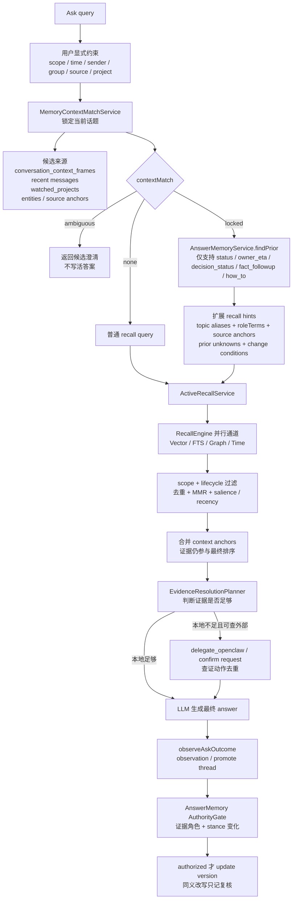
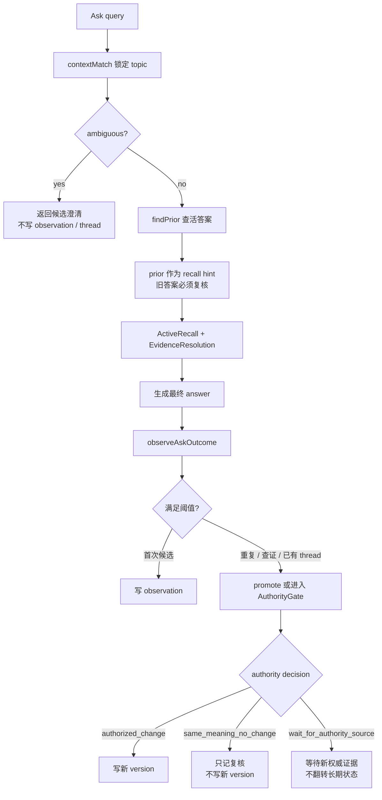

# Ask

_最后更新: 2026-06-17_

Ask 是用户主动向 Personal AI 提问时的记忆问答入口。它的目标不是简单搜索关键词，而是先判断用户到底在问哪个话题，再从消息、网页、会议、外部 AI 对话、实体图谱、时间线和外部查证动作里组织证据，最后给出带来源感的答案。

## 大白话运行逻辑

用户问 Ask 时，系统会按这个顺序工作：

1. 先尊重用户明确给出的范围，例如工作/个人/全部、时间、发送人、群组、source type、project。
2. 如果问题很短，比如“那个 BE ready 了吗”，先锁定它最可能指向的近期话题，而不是直接搜“BE ready”。
3. 如果这个话题以前形成过“活答案”，把上次答案、证据缺口和可能变化条件拿出来作为提示，但不能把旧答案当事实。
4. 再跑正式召回：vector、FTS、graph、time 四通道一起找证据。
5. 把当前场景 anchor、高频互动记忆、旧证据 refs 和普通召回结果一起去重、排序、降权或前置。
6. 如果本地证据不足，判断是否需要外部查证、confirm request，或者明确保持 unknown；Search Result 的 Ask 答案区会展示查证/缺口回执，说明动作队列、外部证据和未确认边界。
7. 生成答案后，异步观察这次 Ask 是否值得写入 observation、promote 成活答案 thread，或经过权威证据门控后更新活答案 version。

这意味着 Ask 的回答仍然由“本次证据”支撑；活答案 prior 只是帮助系统少走弯路。

## 与其他召回能力的边界

| 能力 | 触发方式 | 主要目标 |
| ---- | -------- | -------- |
| Ask | 用户主动提问 | 给出一个可回答、可追查证据、可复核状态变化的答案 |
| Recall 搜索 | 用户主动搜索 | 返回匹配记忆列表和命中原因 |
| Context Recall | 当前网页、会议、聊天等场景触发 | 在用户正在做事时提示可能相关的记忆线索 |

Ask 与 Context Recall 共用 `MemoryContextMatchService` 做短问句话题锁定，但 Ask 会继续进入答案生成、证据缺口判断和活答案沉淀；Context Recall 更偏向“不打断地提示线索”。

Quick Ask 当前 RingCentral chat context 只是可选 hint；真实使用中用户可能只发送一句“BE 现在怎么样了？”，因此 memory service 必须能依赖近期高频、强互动、强锚点记忆先锁定话题。Ask 会从自然语言 context 里识别 `Current chat title:`、`Current page title:`、`Current conversation:`、`Group name:`、`Thread:` 等常见标签，把会话标题、页面标题和 issue key 作为当前场景锚点。客户端即使把 `Current URL:`、`Selected text:`、`Visible page text:` 放在同一行，服务端也会先切出真正的 title，避免把 URL 或选中文本拼进 topic label。锁定后的 topic frame 只负责补齐检索意图，最终事实仍必须来自 `messages_raw` / chunks / episodes 等原始证据。

如果 `contextMatch` 返回 `ambiguous`，Ask 不会继续生成一个貌似确定的答案，也不会写活答案 observation/thread。返回文案会列出候选话题，并提示用户可以直接回复候选序号，或补上项目、群组、issue key；确认后才继续查证状态和证据。Quick Ask 会把这些候选渲染成按钮，点击候选等价于回复对应序号；界面和后续对话上下文会回显“选择话题：xxx”，避免用户回看时只看到裸数字。服务端也会读取上一轮 Ask context 里的候选列表和原始问题，把 `2` / `选 2` / `第二个` / `candidate 2` / `second one` 这类回复恢复成“原问题 + 已选话题”再召回；候选列表标题可以是中文 `候选话题：`，也可以是英文 `Candidate topics:` / `Topic candidates:`。如果调用方没有带上一轮 context，则仍需要用户补上项目、群组或 issue key。流式 Ask 也走同一边界：`/ask/stream` 会先发“需要先确认你指的是哪个话题...”状态，然后直接返回候选澄清，不再发“正在生成回答...”或 answer delta。

## 短问句与记忆话题锁定

`/ask` 在正式召回前会先运行 `MemoryContextMatchService`，用于处理用户没有贴完整上下文的短问句。例如用户只问“那个 BE ready 了吗”“那个新 design 定了吗”或“最近那个 MR 合了吗”，系统不能只按字面搜索短词，而要先判断它最可能指向最近哪个项目、thread、ticket 或话题。

`MemoryContextMatchService` 的候选来自：

- `conversation_context_frames`
- 当前页面、聊天、会议等 context
- 最近消息聚合
- `watched_projects`
- `entities`
- source anchors

评分使用通用特征：query/alias/角色词/状态意图兼容度、近期高频和跨来源显著性、用户发送/回复/被 mention 等互动信号、时间衰减，以及 Google Docs UI shell、日历/participant list、无项目锚点的泛 role/team 内容等低信号惩罚。

输出会随 Ask response 或 debug 透出为 `contextMatch`：

| 状态 | Ask 行为 |
| ---- | -------- |
| `locked` | 候选足够强且 top-second gap 足够大。后续召回会用 selected topic 的 aliases、source anchors、role terms 和 source ids 作为 boost/filter，Ask 回答可说明“Memory service 先把这个问题锁定到：xxx”。 |
| `ambiguous` | 前几名候选接近。Ask 应先列出候选让用户确认；不写活答案 observation/thread。 |
| `none` | 没有足够兼容候选，走普通 recall，并避免把低信号网页快照或 UI 文本当作事实上下文。 |

## 查询记忆库的方式和优先级

Ask 不是直接把用户原句丢给向量库。真实链路会先判断“用户到底在问哪个话题”，再决定哪些记忆源应该优先进入召回。



实际读取或匹配的记忆内容可以分成几层：

| 层级 | 读取内容 | 作用 |
| ---- | -------- | ---- |
| 显式约束层 | `scope`、时间、发送人、群组、source type、project、调用方 filters | 用户明确限定的条件优先，后续猜测不能覆盖 |
| 场景话题层 | `conversation_context_frames`、当前页面/会话 context、近期 `messages_raw` 聚合、`watched_projects`、`entities`、source anchors | 解决“那个 / 这个 / BE / new design”到底指哪个近期话题 |
| 活答案层 | `answer_memory_observations`、`answer_memory_threads`、`answer_memory_versions` | 判断这个问题是否是持续信息需求，并把上次答案状态变成召回提示 |
| 原始证据层 | `messages_raw`、`chunks`、`chunks_fts`、`messages_vec`、`chunks_vec` | 真正支撑回答的消息、会议、网页、Jira、AI 对话等原始证据 |
| 图谱语义层 | `entities`、`relationships`、`entity_properties` | 通过人、项目、任务、组织、技术、topic 等实体补充相关线索 |
| 排序治理层 | `memory_metadata`、显著性、访问强化、反馈、lifecycle 状态 | 决定哪些候选更靠前，旧记忆是否降权或归档 |
| 外部查证层 | `proposed_actions`、OpenClaw action result、confirm requests | 本地证据不足时补查外部系统或保留待确认缺口 |

## 活答案记忆

活答案记忆是 Ask 的底层准确度增强，不是新的 Ask UI。它解决的是用户反复问同一类持续状态问题时，系统不要每次都从零开始，也不要把旧答案当事实复述。

当前 P0 行为：

- Ask 前半段先跑 `contextMatch`。只有 `contextMatch.state = locked`，且意图属于 `status`、`owner_eta`、`decision_status`、`fact_followup`、`how_to` 时，才会查活答案 prior。
- prior 只作为“上次当前答案 + 已知缺口 + 改变条件 + 旧证据 refs”进入 prompt 和 recall hints。最终回答仍必须由本次召回或外部查证证据支撑。
- ambiguous、没有 locked topic、没有证据、闲聊、profile broad query、一次性历史查询，都不会创建活答案 thread。
- 首次符合条件的 Ask 只写轻量 `answer_memory_observations`，用于判断是否常问；不会立刻创建完整 thread。
- 90 天内同一 canonical key 第二次出现、已有 thread、本次产生/复用外部查证 action，或未来用户显式反馈继续查证时，才会 promote 成 `answer_memory_threads`。
- 写 `answer_memory_versions` 前先跑 AnswerMemory AuthorityGate。它会把证据分成 `authority`、`supporting`、`derived`、`query`、`prior`：只有本轮召回到的原始消息、chunk、文档、日历等当前 `authority` 证据能驱动长期答案变化；旧 prior、用户问题、LLM 摘要和派生记忆只能辅助召回或解释。
- 同一组 authority evidence 下，如果新答案只是同一 stance 的同义改写，返回 `priorHit` 并记录本轮复核，不写新 version。这样避免“答案 hash 变了就更新”的写放大。
- 同一组 authority evidence 下，如果新答案把状态从 pending 翻成 ready，先返回 `wait_for_authority_source`，不让一次生成结果污染长期答案；必须出现新的 authority evidence 后才允许 `updated`。
- Ask response 的 `answerMemory.receipt` 和 `answerMemory.authority` 会给 UI/排障一个紧凑回执：这轮是 observation、promoted、priorHit、updated 还是 skipped，本轮用了多少当前证据、旧证据只作为多少条 prior 线索、更新是被授权、被同义抑制，还是在等待新的权威来源。Search Result 的 Ask 答案区会展示 receipt 和 AuthorityGate 结论，能直接看出“同证据同义复核”“等待新的权威证据”“未写新版本”等边界，避免用户把旧活答案误看成当前事实。

canonical key 不是原始短问句，而是：

```text
selectedTopic.id/label + intent + roleTerms + source anchors
```

因此“那个 BE ready 了吗？”和“AI VBG 的 BE 部分完成情况如何？”只要被锁定到同一个 topic、intent 和 role/source anchors，就会落到同一条活答案 thread。

存储时机也不是“匹配结束后马上存答案”。正确顺序是：



## API 与诊断字段

`/ask` 保持现有 UI 行为，不新增页面、不弹卡、不改变用户看到的 Ask 展示。底层增强主要通过召回提示、证据锚定和异步活答案观察生效。

Ask response 会带可选诊断字段 `answerMemory`，用于 eval 和排障：

```ts
answerMemory?: {
  state: 'priorHit' | 'observed' | 'promoted' | 'updated' | 'skipped';
  threadId?: string;
  canonicalKey?: string;
  skipReason?: string;
  receipt?: {
    label: string;
    detail: string;
    tone: 'info' | 'success' | 'warning' | 'muted';
    currentEvidenceCount?: number;
    priorEvidenceCount?: number;
    followUpActionCount?: number;
    missingInfoCount?: number;
    stale?: boolean;
  };
  authority?: {
    decision:
      | 'authorized_change'
      | 'same_meaning_no_change'
      | 'supporting_only'
      | 'wait_for_authority_source';
    summary: string;
    evidenceRoles: Array<{
      role: 'authority' | 'supporting' | 'derived' | 'query' | 'prior';
      count: number;
      reason: string;
    }>;
    currentStance?: string;
    priorStance?: string;
    sameEvidence?: boolean;
    suppressedUpdate?: boolean;
  };
}
```

客户端可以忽略这个字段。`contextMatch.ambiguous` 时会返回 `answerMemory.state = 'skipped'`、`skipReason = 'context_ambiguous'` 和“等待话题确认”回执，用于说明这轮 Ask 是刻意等待澄清，不是召回失败，也不会写活答案。`/ask/stream` 在真正生成 `answer_done` 后同样异步 observe；如果先进入澄清状态，则不会触发 observe。

当 `/ask` 返回 `followUpActions`、`externalEvidence`、`missingInfo` 或 `resolutionState = partial / insufficient / deferred` 时，Search Result 的 Ask 答案区会显示 `Ask 查证回执` 或 `Ask 缺口回执`。这个回执只解释本轮是否留下查证动作、队列状态、外部证据数和缺口数；不会把队列中动作说成已经确认，也不会暗示 Personal AI 已代表用户发消息、执行外部写入、确认结论或把缺口写成长期事实。

## 业内参考与产品取舍

- [ChatGPT Memory FAQ](https://help.openai.com/en/articles/8590148-memory-faq) 和 [OpenAI memory controls](https://openai.com/index/memory-and-new-controls-for-chatgpt/) 强调个人上下文要可控、可删除、可关闭，且 Memory Sources 会解释哪些记忆影响了回答；Ask 因此只把活答案 prior 当召回提示，并用 receipt 说明旧答案不是当前事实。
- [OpenAI Dreaming memory update](https://openai.com/index/chatgpt-memory-dreaming/) 和 [Claude Memory](https://support.claude.com/en/articles/11817273-use-claude-s-chat-search-and-memory-to-build-on-previous-context) 都把“可见 summary / sources / project boundaries / past chat citations”作为长期记忆的产品边界；Ask 的选择是只在回答旁展示活答案回执，不新增管理页面。
- [Raycast Quick AI / AI Chat](https://manual.raycast.com/ai/chat) 把 one-off quick ask、follow-up 和完整 chat handoff 分开；Ask 也保留轻量入口，不在歧义时弹出新管理面板，而是让用户用最短回复补锚点。
- Microsoft 的 [Few-Shot Generative Conversational Query Rewriting](https://www.microsoft.com/en-us/research/publication/few-shot-generative-conversational-query-rewriting/) 和 Apple 的 [Question Rewriting](https://machinelearning.apple.com/research/question-rewriting) 都指出短问句需要先转成上下文完整的检索 query。Personal AI 的实现选择不是直接让 LLM 改写，而是先用 `MemoryContextMatchService` 锁 topic，再把 aliases、role terms、source anchors 注入召回。
- [CONQRR](https://arxiv.org/abs/2112.08558) 把 conversational question 改写成 standalone query 来适配现有检索器；Ask 的数字澄清承接也是同一思路：不要让 `2` 进入检索，而是先恢复成带 topic 的可检索问题。
- [QReCC](https://arxiv.org/abs/2010.04898) 这类 conversational QA 数据集提醒：上下文补全能提升检索，但错误补全会把答案带偏。因此 Ask 对强锚点、低信号网页壳、角色词和歧义候选都要显式打分；不够确定时返回澄清，而不是猜。
- [STALE](https://arxiv.org/abs/2605.06527) 指出 agent 记忆常见失败是检索到了新证据却仍接受旧状态假设；Ask 因此在 `priorHit` / `updated` 回执里明确区分旧证据和本轮证据，并在证据变化时写新版本。
- [RCEM](https://arxiv.org/abs/2606.01697) 这类较新的 conversational dense retrieval 研究把 query rewriting 能力蒸馏进 embedding，目标是在分布漂移下保持召回鲁棒性；Ask 后续可以把 topic lock / alias / role terms / source anchors 的改写效果纳入 eval，而不是只看最终答案文案。

## 验证重点

Ask 相关改动应优先覆盖这些场景：

- 第一次问“那个 BE ready 了吗？”：正常返回证据，写 observation，不改变 UI。
- 第二次同 topic 问“AI VBG 的 BE 部分完成情况如何？”：promote thread，返回 `answerMemory.promoted`。
- 第三次再问：prior 命中；如果只是同一组当前证据下的同义改写，应返回 `answerMemory.priorHit` + `authority.decision = same_meaning_no_change`，不新增 version。无论是 `priorHit` 还是 `updated`，recall 仍执行，答案必须包含最新 evidence，不只复述旧答案。
- 如果同一组当前证据下答案 stance 翻转，例如从“还没有 ready”变成“已经 ready”，应返回 `authority.decision = wait_for_authority_source`，旧长期答案保持不变；只有出现新的 authority evidence 才返回 `updated` 并刷新 version。
- Search Result Ask 答案区应展示 `answerMemory.receipt` 和 `answerMemory.authority`，能看出本轮当前证据数、旧证据数、查证动作数、权威证据门控和是否未写新版本；没有当前证据时应说明“活答案未复核”。
- Search Result Ask 答案区应展示 `Ask 查证回执` / `Ask 缺口回执`，能看出本轮是否创建/执行查证动作、是否仍有缺口、外部证据数量，以及这些状态不会自动确认结论或代表用户发消息。
- `contextMatch.ambiguous`：返回候选澄清，不写 observation/thread；`/ask/stream` 不能先显示“正在生成回答”或发 answer delta。
- 候选澄清承接：上一轮 context 只要保留中文或英文候选列表，用户回复 `2`、`candidate 2` 或 `second one` 都应恢复成“原问题 + 已选话题”，而不是把裸数字当新问题。
- 同一活答案 thread 的外部查证和 confirm request 应该去重，避免重复任务。

当前实现落点：

- AuthorityGate 已落在 `AnswerMemoryService.updateExistingThread`，先比较本轮 stance、旧 version stance、evidence hash 和 evidence role，再决定是否写新 `answer_memory_versions`。
- `answerMemoryService.test.ts` 覆盖了同证据同义改写不写新 version、同证据状态翻转等待新权威证据、新权威证据出现后允许 updated 三条底层路径。
- `answer-memory-tracker` eval 已能收集 `answerMemory.authority.decision`；当 case 配置 authority 期望时会纳入评分，未配置时只记录字段，不改变历史体验分。

建议验证命令：

```bash
npm --prefix memory-service test -- --run src/__tests__/answerMemoryService.test.ts src/__tests__/api-ask.test.ts
npm run eval:run -- --suite ask-context-gap --no-repair
npm run eval:run -- --suite answer-memory-tracker --no-repair
```
