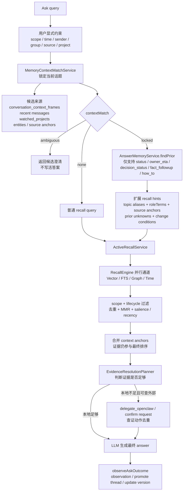
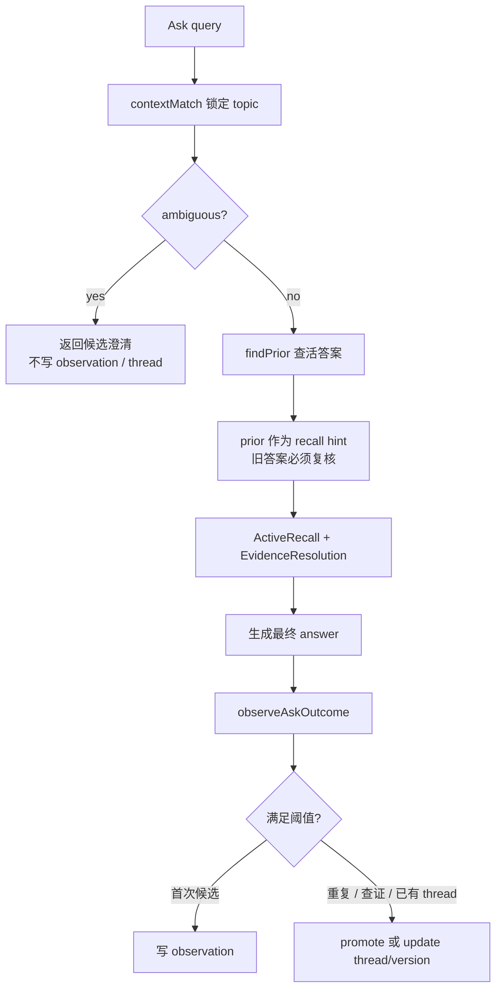

# Ask

_最后更新: 2026-06-03_

Ask 是用户主动向 Personal AI 提问时的记忆问答入口。它的目标不是简单搜索关键词，而是先判断用户到底在问哪个话题，再从消息、网页、会议、外部 AI 对话、实体图谱、时间线和外部查证动作里组织证据，最后给出带来源感的答案。

## 大白话运行逻辑

用户问 Ask 时，系统会按这个顺序工作：

1. 先尊重用户明确给出的范围，例如工作/个人/全部、时间、发送人、群组、source type、project。
2. 如果问题很短，比如“那个 BE ready 了吗”，先锁定它最可能指向的近期话题，而不是直接搜“BE ready”。
3. 如果这个话题以前形成过“活答案”，把上次答案、证据缺口和可能变化条件拿出来作为提示，但不能把旧答案当事实。
4. 再跑正式召回：vector、FTS、graph、time 四通道一起找证据。
5. 把当前场景 anchor、高频互动记忆、旧证据 refs 和普通召回结果一起去重、排序、降权或前置。
6. 如果本地证据不足，判断是否需要外部查证、confirm request，或者明确保持 unknown。
7. 生成答案后，异步观察这次 Ask 是否值得写入 observation、promote 成活答案 thread，或更新活答案 version。

这意味着 Ask 的回答仍然由“本次证据”支撑；活答案 prior 只是帮助系统少走弯路。

## 与其他召回能力的边界

| 能力 | 触发方式 | 主要目标 |
| ---- | -------- | -------- |
| Ask | 用户主动提问 | 给出一个可回答、可追查证据、可复核状态变化的答案 |
| Recall 搜索 | 用户主动搜索 | 返回匹配记忆列表和命中原因 |
| Context Recall | 当前网页、会议、聊天等场景触发 | 在用户正在做事时提示可能相关的记忆线索 |

Ask 与 Context Recall 共用 `MemoryContextMatchService` 做短问句话题锁定，但 Ask 会继续进入答案生成、证据缺口判断和活答案沉淀；Context Recall 更偏向“不打断地提示线索”。

Quick Ask 当前 RingCentral chat context 只是可选 hint；真实使用中用户可能只发送一句“BE 现在怎么样了？”，因此 memory service 必须能依赖近期高频、强互动、强锚点记忆先锁定话题。锁定后的 topic frame 只负责补齐检索意图，最终事实仍必须来自 `messages_raw` / chunks / episodes 等原始证据。

## 短问句与记忆话题锁定

`/ask` 在正式召回前会先运行 `MemoryContextMatchService`，用于处理用户没有贴完整上下文的短问句。例如用户只问“那个 BE ready 了吗”“那个新 design 定了吗”或“最近那个 MR 合了吗”，系统不能只按字面搜索短词，而要先判断它最可能指向最近哪个项目、thread、ticket 或话题。

`MemoryContextMatchService` 的候选来自：

- `conversation_context_frames`
- 当前页面、聊天、会议等 context
- 最近消息聚合
- `watched_projects`
- `entities`
- source anchors

评分使用通用特征：query/alias/角色词/状态意图兼容度、近期高频和跨来源显著性、用户发送/回复/被 mention 等互动信号、时间衰减，以及 Google Docs UI shell、日历/participant list、无项目锚点的泛 role/team 内容等低信号惩罚。

输出会随 Ask response 或 debug 透出为 `contextMatch`：

| 状态 | Ask 行为 |
| ---- | -------- |
| `locked` | 候选足够强且 top-second gap 足够大。后续召回会用 selected topic 的 aliases、source anchors、role terms 和 source ids 作为 boost/filter，Ask 回答可说明“Memory service 先把这个问题锁定到：xxx”。 |
| `ambiguous` | 前几名候选接近。Ask 应先列出候选让用户确认；不写活答案 observation/thread。 |
| `none` | 没有足够兼容候选，走普通 recall，并避免把低信号网页快照或 UI 文本当作事实上下文。 |

## 查询记忆库的方式和优先级

Ask 不是直接把用户原句丢给向量库。真实链路会先判断“用户到底在问哪个话题”，再决定哪些记忆源应该优先进入召回。



实际读取或匹配的记忆内容可以分成几层：

| 层级 | 读取内容 | 作用 |
| ---- | -------- | ---- |
| 显式约束层 | `scope`、时间、发送人、群组、source type、project、调用方 filters | 用户明确限定的条件优先，后续猜测不能覆盖 |
| 场景话题层 | `conversation_context_frames`、当前页面/会话 context、近期 `messages_raw` 聚合、`watched_projects`、`entities`、source anchors | 解决“那个 / 这个 / BE / new design”到底指哪个近期话题 |
| 活答案层 | `answer_memory_observations`、`answer_memory_threads`、`answer_memory_versions` | 判断这个问题是否是持续信息需求，并把上次答案状态变成召回提示 |
| 原始证据层 | `messages_raw`、`chunks`、`chunks_fts`、`messages_vec`、`chunks_vec` | 真正支撑回答的消息、会议、网页、Jira、AI 对话等原始证据 |
| 图谱语义层 | `entities`、`relationships`、`entity_properties` | 通过人、项目、任务、组织、技术、topic 等实体补充相关线索 |
| 排序治理层 | `memory_metadata`、显著性、访问强化、反馈、lifecycle 状态 | 决定哪些候选更靠前，旧记忆是否降权或归档 |
| 外部查证层 | `proposed_actions`、OpenClaw action result、confirm requests | 本地证据不足时补查外部系统或保留待确认缺口 |

## 活答案记忆

活答案记忆是 Ask 的底层准确度增强，不是新的 Ask UI。它解决的是用户反复问同一类持续状态问题时，系统不要每次都从零开始，也不要把旧答案当事实复述。

当前 P0 行为：

- Ask 前半段先跑 `contextMatch`。只有 `contextMatch.state = locked`，且意图属于 `status`、`owner_eta`、`decision_status`、`fact_followup`、`how_to` 时，才会查活答案 prior。
- prior 只作为“上次当前答案 + 已知缺口 + 改变条件 + 旧证据 refs”进入 prompt 和 recall hints。最终回答仍必须由本次召回或外部查证证据支撑。
- ambiguous、没有 locked topic、没有证据、闲聊、profile broad query、一次性历史查询，都不会创建活答案 thread。
- 首次符合条件的 Ask 只写轻量 `answer_memory_observations`，用于判断是否常问；不会立刻创建完整 thread。
- 90 天内同一 canonical key 第二次出现、已有 thread、本次产生/复用外部查证 action，或未来用户显式反馈继续查证时，才会 promote 成 `answer_memory_threads`。
- 当 evidence hash 改变、answer stance 改变、thread stale，或出现比 `lastVerifiedAt` 更新的关键证据时，写入新的 `answer_memory_versions`。

canonical key 不是原始短问句，而是：

```text
selectedTopic.id/label + intent + roleTerms + source anchors
```

因此“那个 BE ready 了吗？”和“AI VBG 的 BE 部分完成情况如何？”只要被锁定到同一个 topic、intent 和 role/source anchors，就会落到同一条活答案 thread。

存储时机也不是“匹配结束后马上存答案”。正确顺序是：



## API 与诊断字段

`/ask` 保持现有 UI 行为，不新增页面、不弹卡、不改变用户看到的 Ask 展示。底层增强主要通过召回提示、证据锚定和异步活答案观察生效。

Ask response 会带可选诊断字段 `answerMemory`，用于 eval 和排障：

```ts
answerMemory?: {
  state: 'priorHit' | 'observed' | 'promoted' | 'updated' | 'skipped';
  threadId?: string;
  canonicalKey?: string;
  skipReason?: string;
}
```

客户端可以忽略这个字段。`/ask/stream` 在 `answer_done` 后同样异步 observe，不新增可见 SSE 事件。

## 验证重点

Ask 相关改动应优先覆盖这些场景：

- 第一次问“那个 BE ready 了吗？”：正常返回证据，写 observation，不改变 UI。
- 第二次同 topic 问“AI VBG 的 BE 部分完成情况如何？”：promote thread，返回 `answerMemory.promoted`。
- 第三次再问：prior 命中，但 recall 仍执行，答案包含最新 evidence，不只复述旧答案。
- `contextMatch.ambiguous`：返回候选澄清，不写 observation/thread。
- 同一活答案 thread 的外部查证和 confirm request 应该去重，避免重复任务。

建议验证命令：

```bash
npm --prefix memory-service test -- --run src/__tests__/answerMemoryService.test.ts src/__tests__/api-ask.test.ts
npm run eval:run -- --suite ask-context-gap --no-repair
npm run eval:run -- --suite answer-memory-tracker --no-repair
```
