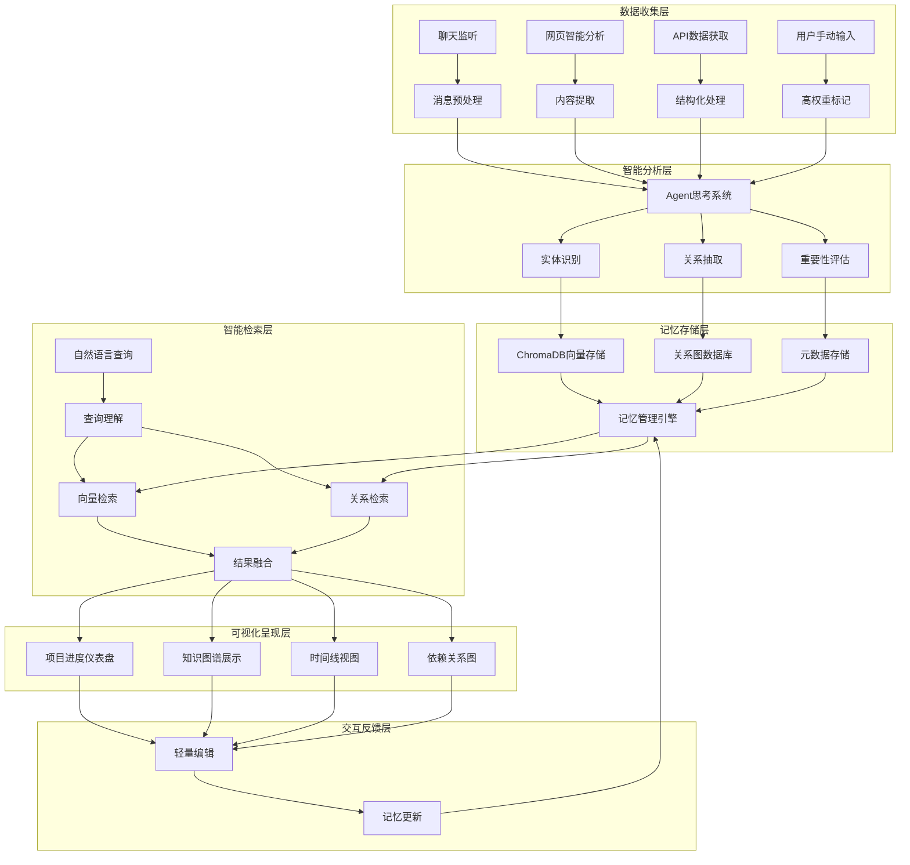
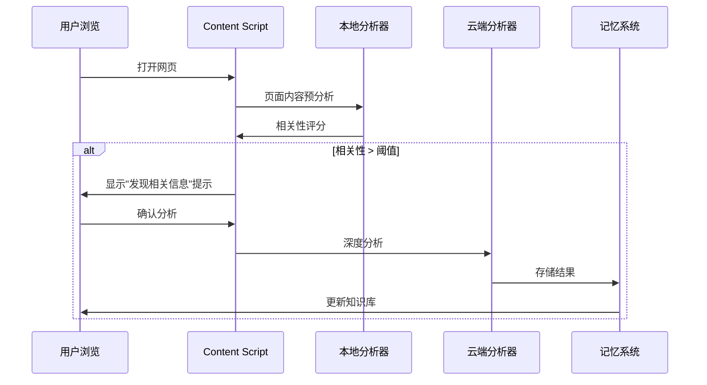
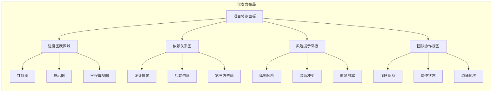
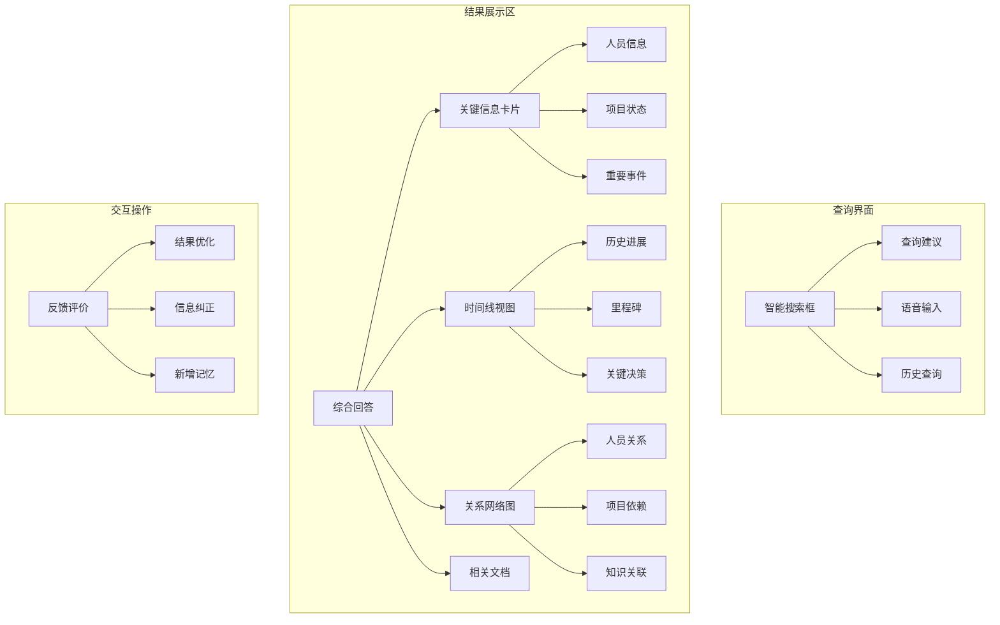
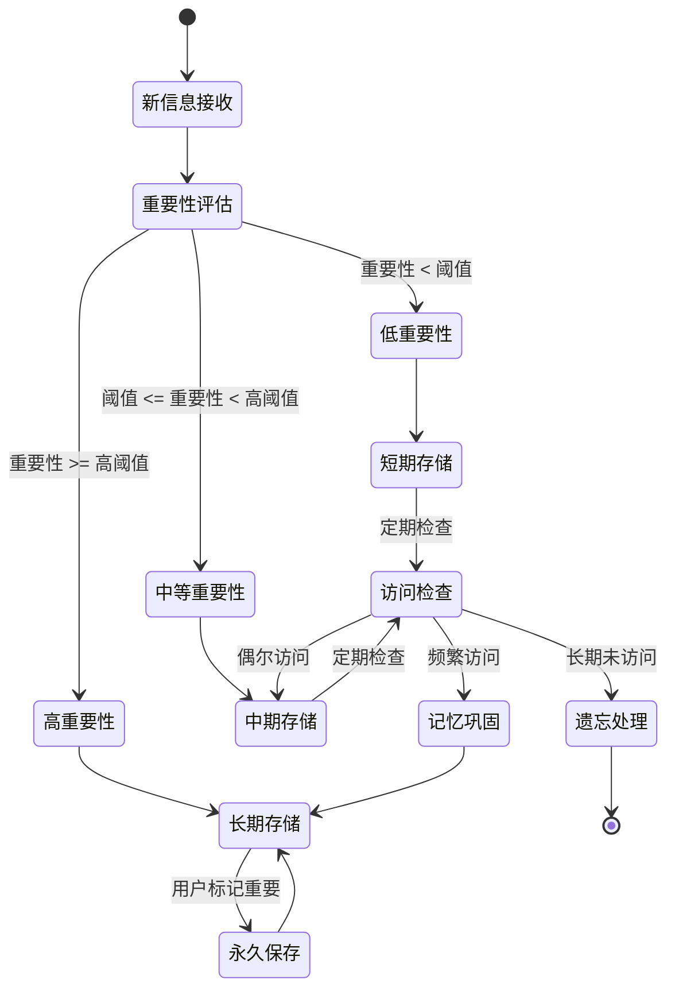

# 类人脑信息处理与项目进展分析系统 - 完整设计文档

*最后更新: 2024-12-20*

## 系统概述

本系统是一个基于Chrome扩展的智能项目管理和信息处理平台，模拟人脑的信息处理机制，实现信息的智能收集、分析、存储、检索和可视化展示。系统结合了现有的消息分析功能，新增了项目进度可视化、知识图谱展示、智能网页分析等核心功能。

## 核心设计理念

### 1. 类人脑记忆机制
- **短期记忆**：实时处理的消息和临时分析结果
- **长期记忆**：向量数据库中的持久化信息
- **工作记忆**：当前正在处理的项目上下文
- **记忆巩固**：重要信息从短期转入长期记忆
- **遗忘机制**：基于使用频率和重要性的智能遗忘

### 2. 多模态信息处理
- **被动收集**：静默监听聊天、网页浏览等
- **主动获取**：API调用Jira、Google Docs等
- **用户输入**：手动纠正和补充信息
- **智能分析**：AI驱动的内容理解和关联

## 系统架构设计



## 核心功能模块

### 1. 智能网页分析系统 (WebIntelligenceAnalyzer)

#### 功能描述
在用户浏览任何网页时，自动分析页面内容，识别与用户关注项目相关的信息。

#### 技术实现
```typescript
interface WebAnalysisResult {
  isRelevant: boolean;
  confidence: number;
  extractedInfo: {
    projects?: string[];
    people?: string[];
    deadlines?: Date[];
    actionItems?: string[];
  };
  suggestedStorage: boolean;
  relevantContext: string;
}

class WebIntelligenceAnalyzer {
  // 本地LLM快速预分析
  async quickAnalyze(pageContent: string): Promise<WebAnalysisResult>
  
  // 详细分析（调用云端LLM）
  async deepAnalyze(relevantContent: string): Promise<AnalysisResult>
}
```

#### 工作流程


### 2. 项目进度可视化仪表盘 (ProjectProgressDashboard)

#### 功能特性
- **多维度进度展示**：甘特图、燃尽图、进度条等
- **依赖关系可视化**：设计依赖、后端依赖、团队依赖
- **实时状态更新**：集成Jira、聊天记录等数据源
- **交互式编辑**：点击修改状态、添加备注、调整时间线

#### 界面设计


#### 核心组件
```typescript
interface ProjectDashboardData {
  projectId: string;
  projectName: string;
  overallProgress: number;
  milestones: Milestone[];
  dependencies: Dependency[];
  risks: Risk[];
  teamMetrics: TeamMetric[];
  lastUpdated: Date;
}

interface Milestone {
  id: string;
  name: string;
  progress: number;
  plannedDate: Date;
  actualDate?: Date;
  status: 'on-track' | 'at-risk' | 'delayed' | 'completed';
  dependencies: string[];
  assignees: Person[];
}

interface Dependency {
  id: string;
  type: 'design' | 'backend' | 'external';
  source: string;
  target: string;
  status: 'pending' | 'in-progress' | 'completed' | 'blocked';
  criticality: 'high' | 'medium' | 'low';
  estimatedCompletion: Date;
}
```

### 3. 增强知识查询系统 (EnhancedKnowledgeQuery)

#### 改进方向
基于现有的`knowledge-query.tsx`，增加以下功能：

1. **多维度结果展示**
   - 时间线视图：按时间顺序展示相关信息
   - 关系网络图：展示实体间的关联关系
   - 主题聚类：将相关内容按主题分组
   - 重要性排序：根据用户关注度和信息重要性排序

2. **智能问答增强**
   - 上下文对话：支持多轮对话，保持上下文
   - 澄清问题：当查询模糊时主动询问澄清
   - 相关建议：基于查询历史推荐相关问题

#### 新界面布局


### 4. 记忆管理与更新系统 (MemoryManagementSystem)

#### 记忆生命周期管理


#### 智能记忆更新机制
```typescript
interface MemoryUpdateRequest {
  memoryId: string;
  updateType: 'correction' | 'enhancement' | 'status_change' | 'new_relation';
  newData: any;
  userConfidence: number;
  timestamp: Date;
}

class MemoryManager {
  // 更新记忆并重新生成向量
  async updateMemory(request: MemoryUpdateRequest): Promise<void>
  
  // 智能遗忘：基于访问频率、时间衰减、用户标记
  async forgetObsoleteMemories(): Promise<void>
  
  // 记忆巩固：将重要的短期记忆转为长期记忆
  async consolidateMemories(): Promise<void>
  
  // 关联学习：发现记忆间的新关系
  async discoverRelations(): Promise<void>
}
```

### 5. 多源数据集成系统 (MultiSourceDataIntegrator)

#### 数据源管理
```typescript
interface DataSource {
  id: string;
  type: 'jira' | 'google_docs' | 'chat' | 'webpage' | 'manual';
  config: any;
  enabled: boolean;
  lastSync: Date;
  syncFrequency: number; // 分钟
}

class DataSourceManager {
  // 统一的数据获取接口
  async fetchData(sourceId: string): Promise<RawData[]>
  
  // 数据标准化处理
  async normalizeData(rawData: RawData[], sourceType: string): Promise<ProcessedData[]>
  
  // 增量同步
  async incrementalSync(sourceId: string): Promise<void>
  
  // 数据质量评估
  async assessDataQuality(data: ProcessedData[]): Promise<QualityMetrics>
}
```

## 技术实现方案

### 1. Chrome扩展架构升级

#### Manifest V3 配置增强
```json
{
  "manifest_version": 3,
  "name": "Brain-like Project Analysis System",
  "permissions": [
    "tabs", "storage", "activeTab", "alarms", "background",
    "unlimitedStorage", "offscreen", "scripting", "identity",
    "clipboardWrite", "contextMenus", "notifications"
  ],
  "content_scripts": [
    {
      "matches": ["<all_urls>"],
      "js": ["universalContentScript.js"],
      "run_at": "document_idle"
    }
  ],
  "web_accessible_resources": [
    {
      "resources": [
        "dashboard.html", "knowledge-graph.html", 
        "project-timeline.html", "memory-manager.html"
      ],
      "matches": ["<all_urls>"]
    }
  ]
}
```

#### 新增内容脚本功能
```typescript
// universalContentScript.ts - 通用网页分析
class UniversalContentScript {
  private analyzer: WebIntelligenceAnalyzer;
  private observer: MutationObserver;
  
  async initialize() {
    // 页面加载完成后进行初始分析
    await this.performInitialAnalysis();
    
    // 监听页面动态变化
    this.setupMutationObserver();
    
    // 添加右键菜单功能
    this.setupContextMenu();
  }
  
  private async performInitialAnalysis() {
    const pageContent = this.extractPageContent();
    const analysisResult = await this.analyzer.quickAnalyze(pageContent);
    
    if (analysisResult.isRelevant) {
      this.showRelevanceIndicator(analysisResult.confidence);
    }
  }
}
```

### 2. 前端界面重构

#### 主界面布局重设计
```typescript
// MainInterface.tsx
const MainInterface: React.FC = () => {
  const [activeView, setActiveView] = useState<'dashboard' | 'knowledge' | 'memory'>('dashboard');
  
  return (
    <div className="brain-system-container">
      <NavigationBar activeView={activeView} onViewChange={setActiveView} />
      
      <div className="main-content">
        {activeView === 'dashboard' && <ProjectProgressDashboard />}
        {activeView === 'knowledge' && <EnhancedKnowledgeQuery />}
        {activeView === 'memory' && <MemoryManagerInterface />}
      </div>
      
      <FloatingAssistant />
    </div>
  );
};
```

#### 项目进度仪表盘组件
```typescript
// ProjectProgressDashboard.tsx
const ProjectProgressDashboard: React.FC = () => {
  const [projects, setProjects] = useState<ProjectData[]>([]);
  const [selectedProject, setSelectedProject] = useState<string | null>(null);
  const [viewType, setViewType] = useState<'gantt' | 'burndown' | 'dependency'>('gantt');
  
  return (
    <div className="dashboard-container">
      <DashboardHeader 
        projects={projects}
        selectedProject={selectedProject}
        onProjectSelect={setSelectedProject}
      />
      
      <div className="dashboard-main">
        <div className="chart-area">
          {viewType === 'gantt' && <GanttChart projectId={selectedProject} />}
          {viewType === 'burndown' && <BurndownChart projectId={selectedProject} />}
          {viewType === 'dependency' && <DependencyGraph projectId={selectedProject} />}
        </div>
        
        <div className="info-panels">
          <RiskPanel projectId={selectedProject} />
          <TeamMetricsPanel projectId={selectedProject} />
          <RecentUpdatesPanel projectId={selectedProject} />
        </div>
      </div>
      
      <EditableOverlay 
        onEdit={(item) => handleQuickEdit(item)}
        onSave={(changes) => handleSaveChanges(changes)}
      />
    </div>
  );
};
```

### 3. 数据存储架构优化

#### 混合存储方案
```typescript
// 存储层架构
interface StorageArchitecture {
  // Chrome本地存储 - 配置和临时数据
  localCache: ChromeStorage;
  
  // ChromaDB - 向量化内容存储
  vectorStore: ChromaDBClient;
  
  // 图数据库 - 关系存储 (可选：Neo4j或本地图存储)
  graphStore: GraphDatabase;
  
  // 时序数据 - 项目进度历史
  timeSeriesStore: TimeSeriesDB;
}

class HybridStorageManager {
  async storeProcessedData(data: ProcessedData): Promise<void> {
    // 根据数据类型选择合适的存储方式
    if (data.type === 'content') {
      await this.vectorStore.store(data);
    } else if (data.type === 'relation') {
      await this.graphStore.store(data);
    } else if (data.type === 'progress') {
      await this.timeSeriesStore.store(data);
    }
  }
  
  async smartQuery(query: SmartQuery): Promise<QueryResult> {
    // 智能查询路由
    const vectorResults = await this.vectorStore.query(query.semanticPart);
    const graphResults = await this.graphStore.query(query.relationPart);
    const timeResults = await this.timeSeriesStore.query(query.temporalPart);
    
    return this.fusionEngine.merge(vectorResults, graphResults, timeResults);
  }
}
```

### 4. AI能力增强

#### 本地+云端混合AI架构
```typescript
// AI服务架构
interface AIServiceArchitecture {
  localModel: {
    type: 'chrome-built-in' | 'wasm-model';
    capabilities: ['quick-analysis', 'relevance-scoring', 'entity-extraction'];
    latency: 'low';
    accuracy: 'medium';
  };
  
  cloudModel: {
    type: 'openai' | 'anthropic' | 'custom';
    capabilities: ['deep-analysis', 'complex-reasoning', 'multi-document-synthesis'];
    latency: 'medium';
    accuracy: 'high';
  };
}

class HybridAIService {
  async analyzeContent(content: string, urgency: 'low' | 'medium' | 'high'): Promise<AnalysisResult> {
    // 根据紧急程度和复杂度选择AI服务
    if (urgency === 'high' || content.length < 1000) {
      return await this.localModel.analyze(content);
    } else {
      const quickResult = await this.localModel.quickAnalyze(content);
      if (quickResult.confidence > 0.8) {
        return quickResult;
      } else {
        return await this.cloudModel.deepAnalyze(content);
      }
    }
  }
}
```

## 实施计划

### 阶段一：核心功能增强 (2-3周)
1. **网页智能分析系统**
   - 实现通用内容脚本
   - 集成本地快速分析能力
   - 添加用户交互提示

2. **知识查询界面重构**
   - 重新设计查询结果展示
   - 添加多维度视图切换
   - 实现知识图谱可视化

### 阶段二：项目进度可视化 (3-4周)
1. **进度仪表盘开发**
   - 实现甘特图组件
   - 开发依赖关系图
   - 添加实时数据同步

2. **交互编辑功能**
   - 实现点击编辑功能
   - 开发数据更新机制
   - 添加变更历史追踪

### 阶段三：记忆系统优化 (2-3周)
1. **智能记忆管理**
   - 实现遗忘机制
   - 开发记忆巩固算法
   - 添加用户反馈循环

2. **多源数据集成**
   - 完善API数据获取
   - 实现增量同步
   - 添加数据质量控制

### 阶段四：性能优化与完善 (2周)
1. **性能优化**
   - 优化向量检索性能
   - 实现数据预加载
   - 添加缓存机制

2. **用户体验完善**
   - 优化界面响应性
   - 完善错误处理
   - 添加用户指导

## 技术选型建议

### 前端技术栈
- **UI框架**：React 18 + TypeScript
- **状态管理**：Zustand (轻量级，适合扩展)
- **UI组件库**：Ant Design + 自定义组件
- **图表库**：D3.js + Recharts
- **图形渲染**：Canvas/SVG (用于复杂可视化)

### 数据处理技术
- **向量数据库**：ChromaDB (云端部署)
- **图计算**：本地图算法库或轻量级图数据库
- **时序数据**：本地IndexedDB + 时序算法
- **数据同步**：WebRTC DataChannel (实时同步)

### AI服务技术
- **本地AI**：Chrome Built-in AI API (如果可用)
- **云端AI**：OpenAI GPT-4 + 自定义微调模型
- **向量化**：OpenAI Embeddings / Sentence-Transformers
- **OCR服务**：Google Vision API / Tesseract.js

## 预期效果

### 用户体验提升
1. **智能化程度**：从被动查询到主动发现
2. **可视化效果**：从文本列表到图形化展示
3. **操作便捷性**：从复杂配置到智能推荐
4. **信息准确性**：从静态数据到实时更新

### 功能价值体现
1. **项目管理**：实时掌握项目进展和风险
2. **知识管理**：构建个人知识图谱
3. **决策支持**：基于历史数据的智能建议
4. **协作效率**：团队信息透明化和同步

---

*本设计文档整合了现有功能优势，针对用户需求进行了系统性的功能增强和架构优化，旨在打造一个真正智能化的项目管理和知识处理系统。*