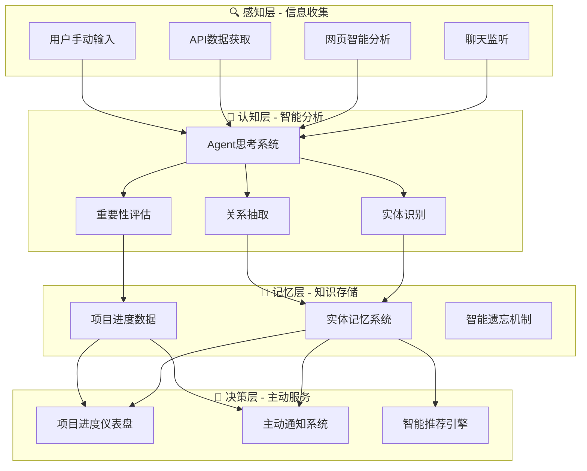

# 类人脑项目分析系统 - 总体架构概览

*最后更新: 2024-12-20*

## 🎯 系统愿景

构建一个模拟人脑信息处理机制的智能项目管理助手，通过Chrome扩展平台，实现信息的自动收集、智能分析、长期记忆存储和主动洞察推送，帮助用户更好地管理项目进展和知识资产。

## 🧠 核心设计理念

### 类人脑信息处理模式
- **感知层**：多渠道信息收集（聊天、网页、文档、API）
- **认知层**：智能分析和理解（实体识别、关系抽取、重要性评估）
- **记忆层**：分层存储和管理（短期记忆、长期记忆、工作记忆）
- **决策层**：主动洞察和推荐（风险预警、进度提醒、知识发现）

### 智能化能力目标
- **主动感知**：自动发现和识别重要信息
- **智能记忆**：类人脑的记忆巩固和遗忘机制
- **预测能力**：基于历史数据预测风险和趋势
- **个性化**：适应用户习惯和偏好的智能助手

## 🏗️ 系统总体架构

## 🎯 核心功能模块

### 1. 智能网页分析系统
**目标**：自动识别网页中与用户项目相关的信息
- 在用户浏览任何网页时，智能分析页面内容
- 识别项目相关的人员、任务、截止日期等关键信息
- 提供非侵入式的信息保存建议
- 支持本地快速分析和云端深度分析
- *详细设计参见：[Web Intelligence Usage Guide](web_intelligence_usage_guide.md)*

### 2. 项目进度可视化仪表盘
**目标**：提供直观的项目进展可视化和交互式管理
- 多维度进度展示：甘特图、燃尽图、里程碑视图
- 依赖关系可视化：设计依赖、后端依赖、团队依赖
- 实时状态更新：集成Jira、聊天记录等多数据源
- 交互式编辑：支持点击修改、状态更新、时间线调整
- *详细设计参见：[Project Dashboard Usage Guide](project_dashboard_usage_guide.md)*

### 3. 实体记忆系统
**目标**：构建智能化的知识存储和查询体验
- 多维度实体展示：人员、项目、任务、组织、文档等
- 智能关系网络：自动发现和可视化实体间关系
- 时间轴视图：按时间维度展示所有活动和变更
- 智能遗忘机制：类人脑的记忆巩固和淘汰策略
- *详细设计参见：[实体记忆系统综合设计](memory_system_comprehensive.md)*

### 4. 主动通知系统
**目标**：智能识别关键事件并主动通知用户
- 项目风险预警：依赖项逾期、进度延迟等风险识别
- 智能通知策略：多渠道通知和用户行为学习
- 场景化提醒：基于工作状态和时间的智能提醒
- 个性化推荐：基于历史数据的智能内容推荐
- *详细设计参见：[主动通知系统](proactive_notification_system.md)*

## 🔧 技术架构概览

### 1. Chrome扩展平台
**核心能力**：基于Manifest V3的现代化扩展架构
- 通用内容脚本：支持全网页智能分析
- 背景服务：定时任务和主动通知管理
- 多界面支持：popup、侧边栏、独立页面
- 跨域权限：安全访问各类API和数据源

### 2. 混合存储架构
**设计原则**：分层存储，按需访问
- **本地缓存**：Chrome Storage API，快速访问的配置和临时数据
- **向量数据库**：ChromaDB，语义搜索和内容检索
- **关系存储**：HybridGraphStore，实体关系和知识图谱
- **时序数据**：localStorage + IndexedDB，项目进度历史
- *详细架构参见：[存储架构设计](memory_system_comprehensive.md#存储架构设计)*

### 3. 混合AI服务
**策略**：本地快速分析 + 云端深度理解
- **本地AI**：Chrome Built-in AI / WebAssembly模型，快速预分析
- **云端AI**：OpenAI / Anthropic API，深度分析和推理
- **智能路由**：根据内容复杂度和紧急程度选择合适的AI服务
- **性能优化**：缓存机制和批处理策略

### 4. 前端技术栈
**现代化组件**：React + TypeScript + 可视化库
- **UI框架**：React 18 + Ant Design + 自定义组件
- **状态管理**：Zustand，轻量级状态管理
- **图表库**：D3.js + Recharts，灵活的可视化能力
- **网络图**：Cytoscape.js / Sigma.js，复杂关系网络展示

## 🚀 实施路线图

### 阶段一：基础能力建设 (已完成)
**目标**：建立核心的记忆和分析能力
- ✅ 实体记忆查询界面 (memory.tsx)
- ✅ 混合图存储系统 (HybridGraphStore.ts)
- ✅ 智能代理思考系统 (agentThinking.ts)
- ✅ 向量数据库集成 (ChromaDB)

### 阶段二：智能感知增强 (进行中)
**目标**：提升系统的主动感知和分析能力
- ✅ **用户画像系统** - 完成个性化智能分析基础
  - 多维度用户兴趣建模
  - 智能权重衰变算法
  - 与Web Intelligence深度集成
- 🔄 网页智能分析系统部署
- 🔄 主动通知系统实现
- 🔄 记忆遗忘机制优化
- 🔄 项目进度仪表盘原型

### 阶段三：可视化提升 (4-6周)
**目标**：打造直观的可视化和交互体验
- ⏳ 3D知识图谱可视化
- ⏳ 高级查询和筛选功能
- ⏳ 交互式项目管理界面
- ⏳ 时空记忆地图

### 阶段四：智能化深化 (6-8周)
**目标**：实现真正的智能助手能力
- ⏳ 预测性分析和推荐
- ⏳ 协作记忆功能
- ⏳ 高级AI模型集成
- ⏳ 企业级部署支持

## 📚 相关文档

### 核心模块详细设计
- **[实体记忆系统综合设计](memory_system_comprehensive.md)** - 记忆存储、遗忘机制、可视化界面的完整设计
- **[主动通知系统](proactive_notification_system.md)** - 智能场景识别和多渠道通知策略
- **[项目仪表盘使用指南](project_dashboard_usage_guide.md)** - 进度可视化和交互式管理功能
- **[网页智能分析指南](web_intelligence_usage_guide.md)** - 自动化信息收集和分析能力

### 技术实现文档
- **[系统集成总结](system_integration_summary.md)** - 整体架构和集成策略
- **[存储架构推荐](storage_architecture_recommendations.md)** - 数据存储和检索优化
- **[实现完成总结](implementation_completion_summary.md)** - 当前实现状态和下一步计划

## 🎯 系统价值

**智能化程度**：从被动工具到主动助手
- 自动发现和分析相关信息
- 智能预测项目风险和趋势  
- 个性化的知识推荐和提醒

**用户体验**：从复杂操作到简单交互
- 直观的可视化展示界面
- 智能的查询和筛选功能
- 无缝的多平台数据集成

**知识管理**：从信息孤岛到知识网络
- 构建个人和团队知识图谱
- 发现隐藏的信息关联
- 实现真正的知识资产管理

---

*本文档提供了类人脑项目分析系统的总体架构概览，详细的技术设计和实现细节请参考相关的专项文档。*