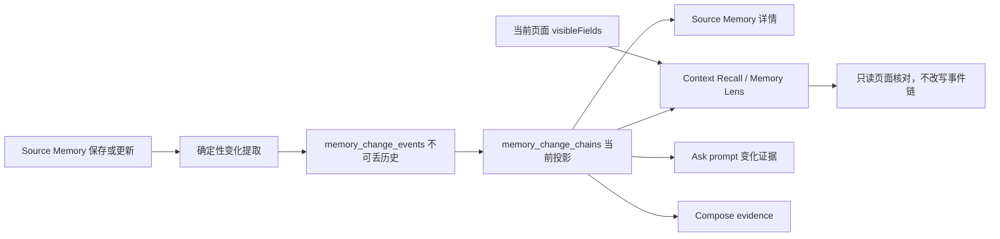

# Change Memory Ledger / 变化脉络

_最后更新: 2026-07-31_

## 状态与定位

P0 已实现。内部能力名是 **Change Memory Ledger**，用户界面统一显示 **变化脉络**。

它把同一稳定对象的状态变化保存为带时间、前后值、来源和权威边界的事件链，解决普通相似度召回容易把历史值、当前值、回退和冲突混在一起的问题。它不是 Jira Estimate 专用能力，首版可处理：

- 发布时间、发布日期、截止时间。
- Goal 目标、范围、成功标准。
- Jira DEV / QA Estimate、Story Points。
- 状态、负责人、优先级。
- Connector 通过 `metadata.changeEvents` 提供的其他明确字段。

首版数据入口是 Source Memory；存储和投影契约使用通用 `sourceRef`，后续消息、会议、Jira connector 或其他 AI 对话可复用同一事件层。

## 用户场景

### 场景一：发布时间后来又调整

1. 用户保存过一条资料：`发布时间从 2026-07-18 调整为 2026-07-25`。
2. 之后打开发布页面，页面当前字段已经显示 `2026-07-30`。
3. Memory Lens 不把保存资料里的 `2026-07-25` 冒充当前值，而是显示：
   - 历史链：`2026-07-18 -> 2026-07-25`。
   - 当前页面：`2026-07-30`。
   - 状态：`页面已有新值`。
   - 边界：本次以页面可见值为准，历史链没有被改写。

用户既能看到现在页面上的值，也不会失去“之前改过什么”的记忆。

### 场景二：Goal 范围变化且来源冲突

1. 用户本人把 `Personal AI Q3` 的范围从 `Jira` 扩展到 `Jira、Meetings`，同时把成功标准从 `3 useful recalls/week` 改为 `5 accepted recalls/week`。
2. 两个同等权威来源又在同一时间窗给出不同发布日期。
3. Source Memory 详情把 Goal 的两个字段拆成两条独立链；Ask 可使用 owner-authored 的 Goal 当前值。
4. 对冲突发布日期，系统只显示两个历史候选，`currentValue` 为空，Ask 明确输出 `当前投影=未知（候选冲突）`，不会按写入顺序选择一个日期。

## 产品边界

记录一条变化必须同时满足：

1. 有稳定对象，例如 `jira:NOVA-101`、`goal:personal-ai-q3`、`release:desktop-8.2`、`project:nova` 或显式 `subjectKey`。
2. 有可识别字段和新值；有旧值时保留前后关系。
3. 有来源引用和观测时间。
4. 是状态变化，而不是 `Collapse comment`、`Press Enter` 等 UI 壳文本或同值更新。

P0 明确不做：

- 不把所有文本修改做成全局 activity log。
- 不用 LLM 猜测模糊叙述里的变化。
- 不把低权威来源自动升级成当前事实。
- 不删除原始 message、chunk 或 source-memory capsule。
- 不自动发送、提交 Jira、更新 Goal、创建任务或写回外部系统。
- 不新增独立维护队列；只在当前页面、资料详情、Ask 和 Compose 场景中展示。

## 数据流



## 存储契约

迁移：`memory-service/src/storage/migrations/054_change_memory_ledger.sql`。

| 表 | 责任 |
|---|---|
| `memory_change_extractions` | 每个 source 的提取回执、input hash、状态、提取数、排除噪音数和 active 状态。 |
| `memory_change_events` | 带类型值、前后值、来源、权威、时间、原因和 reversal 标记的事件。 |
| `memory_change_chains` | 按 `subjectKey + propertyKey` 聚合的当前证据投影、事件/回退/冲突计数和时间范围。 |

`MemoryChangeValue` 支持 `text`、`number`、`date`、`boolean`、`status`、`entity_ref`、`set`。Goal scope 等集合值排序后保存，日期统一到可识别的 `YYYY-MM-DD`，数值保留显示文本和标准化值。

Source Memory 重存或补备注时，服务按 source reference 重算该 source 的事件并重建受影响链，避免同一资料重复追加事件。Input hash 和 event fingerprint 用于审计与幂等边界。

## 提取契约

优先级从高到低：

1. Connector 或调用方提供 `metadata.changeEvents` / `changeEvent`。每个事件可带字段、旧值、新值、value kind、authority、actor、reason、evidence quote 和 observed time。
2. 对明确文本逐行解析：
   - `Original: ... New: ...`
   - `changed/updated from ... to ...`
   - `从 ... 改为/调整为/延期到 ...`
   - `旧值 -> 新值`
3. 缺稳定对象、字段不可识别、新旧值相同或只有 UI 噪音时不形成事件，并返回 `blocked` 或 `no_change` 回执。

内置字段别名覆盖 Estimate、Story Points、release date、Goal target/scope/success metric、deadline、status、owner 和 priority；其他明确字段会规范成 `field.<key>`，仍保持对象隔离。

## 投影与权威边界

| 状态 | 含义 | UI / Ask 行为 |
|---|---|---|
| `confirmed_current` | 本次读取中当前页面有明确字段，或支持实时读取的来源成功返回同一字段的当前值。 | 可作为本次上下文当前值，仍显示核对来源与时间。 |
| `last_observed` | 账本最后一条事件，无论当时来自用户本人、权威来源、团队消息或资料快照。 | 显示“最后观测”，不得写成权威系统已确认当前。 |
| `conflicted` | 一小时内相邻事件来自同等级权威但值不同。 | 不暴露任一候选为 `currentValue`；摘要和 Ask 显示当前未知，历史列出候选。 |
| `superseded_on_page` | 当前页面值与变化链最后观测不同。 | UI 显示页面当前值；保存链保留为历史，不被页面读取改写。 |
| `superseded_at_source` | 实时来源读取到的当前值（包括明确空值）与变化链最后观测不同。 | UI 显示来源当前值，并明确最后观测仅保留为历史。 |
| `historical_only` | 来源已撤销或只用于审计。 | Source Memory 详情可见，不进入主动 Context Recall 当前投影。 |

`A -> B -> A` 会标记最后事件为 `revert` 并累计 reversal count。冲突候选按显示值排序，避免同时间事件的数据库顺序造成 UI 或 eval 抖动。

冲突链如果在当前页面读到可识别字段，可在该次 Context Recall 中返回 `confirmed_current` 和页面值；`conflictCount` 与历史事件仍保留，数据库链不被改写。离开页面后，Ask 仍看到 unresolved conflict。

页面没有渲染某字段不是“字段为空”，也不是“账本最后值仍然有效”。Jira Lens 对 `DEV Estimate`、`QA Estimate` 和 `Story Points` 在稳定页面上使用一次带 60 秒短缓存的只读 Jira REST 读取；只有成功响应才会作为实时来源核对。REST 显式返回 `null` 时显示“Jira 当前为空”，不会沿用历史值。读取失败、页面编辑中或没有适配器的来源一律保留 `last_observed`。

其他网页、聊天、会议或外部 AI 记忆的 freshness 采用同一原则：只有对应 connector 能在同一稳定对象和同一属性上重新读取并返回时间/版本/内容指纹时，才可提升为当前；没有可读适配器时保留最后观测、来源和观测时间。不得以“来源权威”或“页面未显示”替代一次当前核对。

## UI 契约

### Memory Lens

- `/context-recall` 顶层可返回 `changeProjections`，与普通 `matches` 分离，不污染普通召回数量和分页。
- Jira 页面将实时读取结果以 `currentContext.verifiedSourceFields` 传给服务；该对象只包含字段、读取时间和 `jira_rest` 来源，不写回 Jira，也不改写账本事件。
- 没有可展示关键简报时，普通记忆和变化链同时存在会让 `变化脉络` 占首个候选槽位，普通记忆继续分页。
- 同轮存在 `ready` / `partial` 关键简报时，遵循 [Memory Lens 展示仲裁](./memory_lens.md#展示地图与首屏仲裁)：**简报 > 变化脉络**。变化链保留在证据/原始记忆下钻，不与简报并列占首屏。
- 只有变化链时，前端创建只读 presentation match，使 Lens 入口仍可展示；footer 显示 `链级只读`，不显示普通记忆 thumb up/down。
- 首屏只显示字段、前值、当前/页面值、状态和边界；`details` 展开后才显示事件时间、来源、authority、reason 和回退标记。
- 卡片始终声明：只读变化证据，不确认当前值、不写入、不插入、不发送。

### Source Memory 详情

- 资料蒸馏回执之后、备注编辑之前显示 `变化脉络`。
- 即使没有形成事件，也显示 `未发现变化`、`缺少稳定对象` 或 `尚未检查`，避免把空结果误解成能力未运行。
- 每条投影显示事件数、回退数、最后来源、最后观测时间和可展开历史。
- Capsule dismissed 后使用历史态视觉和 `historical_only` 边界；不会继续参与当前状态判断。

### Ask

- `recallForAsk()` 在普通记忆 context 后附加独立 `【变化脉络】` block。
- Prompt 必须区分 confirmed current、last observed、conflict、history 和页面新值。
- 只有事件明确带 `reason` 时才解释原因；用户前提与链冲突时引用时间和来源指出冲突。
- 未解决冲突固定写成 `当前投影=未知（候选冲突）`。

### Compose Assist

- `ContextAssistService` 把投影转成既有 `source_memory` evidence，并在 metadata 标记 `changeLedger` 和 `currentStateBoundary`。
- Snippet 包含摘要、边界和最近三条变化；冲突摘要不能偏向某个候选。
- 只丰富生成上下文，不新增自动插入、发送或外部写回能力；最终仍经过 Compose 的 evidence cohesion、risk、preview 和 draft-version 门禁。

## API 契约

P0 不新增独立 Ledger 路由：

- Source Memory create/get/update/note/dismiss 响应的 `capsule.changeLedger` 返回提取回执、事件和投影。
- `POST /api/v1/context-recall` 响应可选返回 `changeProjections`。
- Ask 和 Compose 在服务内部消费同一投影，不要求前端发第二次请求。

Backend、extension client、desktop client 和 content-script 的 optional contracts 必须同步维护；旧客户端忽略新字段仍可工作。

## 代码入口

- 核心事件、提取、链重建、投影：`memory-service/src/core/MemoryChangeLedgerService.ts`
- Source Memory 生命周期：`memory-service/src/core/SourceMemoryCaptureService.ts`
- Context Recall：`memory-service/src/core/ContextRecallService.ts`
- Ask prompt：`memory-service/src/routes/ask.ts`
- Compose evidence：`memory-service/src/core/ContextAssistService.ts`
- Backend 类型：`memory-service/src/types/index.ts`
- Extension client：`src/services/MemoryServiceClient.ts`
- Desktop client：`desktop-app/src/memoryServiceClient.ts`
- Memory Lens：`src/contentScriptWebIntelligence.ts`
- Source Memory UI：`src/modals/components/SourceMemoryDetailPage.vue`
- Demo：[`../demo/change-memory-ledger.html`](../demo/change-memory-ledger.html)

## 验证与维护

最低回归集：

```bash
npm --prefix memory-service run build
npm --prefix memory-service test -- --run src/__tests__/memoryChangeLedgerService.test.ts
npm --prefix memory-service test -- --run src/__tests__/api-change-memory-ledger.test.ts
npm run eval:validate
npm run eval:run -- --suite change-memory-ledger --no-repair
node tools/verify-change-memory-ledger-e2e.mjs
npm run eval:memory-abilities -- --endpoint <current-branch-ask-endpoint>
```

`change-memory-ledger` 是确定性 heuristic suite，不调用 judge LLM。当前 8 个 case 覆盖：页面新值、Goal 多字段、Jira 回退、同权威冲突、UI 噪音/同值、相邻对象隔离、Compose 最后观测边界和缺稳定对象阻断。

后续修改以下任一逻辑时，必须增加 case 后再改实现：

- 新 subject 或 property alias。
- 冲突时间窗、authority rank 或 current projection 规则。
- 页面字段 reconciliation。
- 实时来源读取、字段映射或 explicit-empty 语义。
- Ask / Compose 边界文案。
- Source dismissal / resave 语义。
- Lens 链级只读与普通记忆混合展示。

生产限制：P0 只处理显式、可审计变化。需要从模糊会议叙述、长对话或图片中推断变化时，应新增独立 extractor、schema 证据锚点和真实场景 eval，不能直接放宽当前确定性规则。
