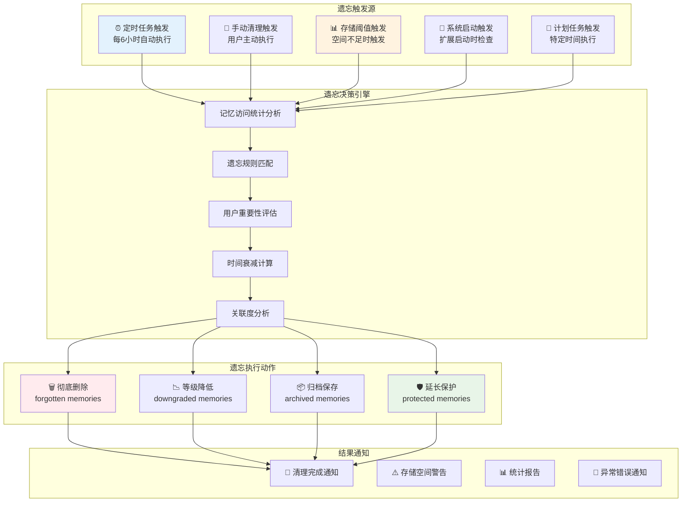

# 记忆遗忘机制详细设计

*最后更新: 2024-12-20*

## 🧠 记忆遗忘的触发方式

记忆遗忘机制是类人脑项目分析系统的核心特性，通过多种触发方式实现智能的记忆管理。我们设计了**5种主要触发方式**来确保记忆系统的健康运行。

## 📋 完整触发机制概览



## 🕒 第一种：定时任务触发（主要方式）

### 触发机制
```typescript
// 在ProactiveNotificationService中配置
{
  id: 'memory-lifecycle',
  name: '记忆生命周期管理',
  frequency: 360, // 每6小时执行一次
  priority: 'medium',
  enabled: true,
  processor: 'memory-lifecycle'
}
```

### 执行时间表
| 时间 | 执行内容 | 预期效果 |
|------|----------|----------|
| **每6小时** | 全面记忆分析 | 清理过期、无用记忆 |
| **每天凌晨2点** | 深度整理 | 记忆巩固和归档 |
| **每周日凌晨** | 重度清理 | 大规模遗忘和优化 |
| **每月1号** | 全面重构 | 记忆结构优化 |

### 智能调频机制
```typescript
class AdaptiveMemoryScheduler {
  calculateOptimalFrequency(memoryStats: MemoryStats): number {
    const {
      totalMemories,
      memoryGrowthRate,
      accessPatterns,
      storageUsage
    } = memoryStats;
    
    // 基础频率：6小时
    let frequency = 6 * 60; // 分钟
    
    // 根据记忆增长率调整
    if (memoryGrowthRate > 100) { // 每小时新增超过100条
      frequency = Math.max(120, frequency * 0.5); // 最短2小时
    } else if (memoryGrowthRate < 10) {
      frequency = Math.min(1440, frequency * 2); // 最长24小时
    }
    
    // 根据存储使用率调整
    if (storageUsage > 0.8) { // 使用率超过80%
      frequency = Math.max(60, frequency * 0.3); // 加速清理
    }
    
    return frequency;
  }
}
```

## 🔧 第二种：手动清理触发

### 用户界面触发点
```typescript
// 1. 项目仪表盘中的记忆管理区域
const DashboardMemorySection = () => (
  <div className="memory-management">
    <h3>记忆管理</h3>
    <div className="memory-stats">
      <span>总记忆数: {totalMemories}</span>
      <span>存储使用: {storageUsage}</span>
    </div>
    <button onClick={triggerManualCleanup}>
      🧹 立即清理记忆
    </button>
    <button onClick={openMemorySettings}>
      ⚙️ 遗忘规则设置
    </button>
  </div>
);

// 2. 右键菜单快速操作
chrome.contextMenus.create({
  id: "manual-memory-cleanup",
  title: "🧠 清理记忆系统",
  contexts: ["action"]
});

// 3. 快捷键触发
chrome.commands.onCommand.addListener((command) => {
  if (command === "manual-memory-cleanup") {
    triggerMemoryCleanup();
  }
});
```

### 手动触发的优势
- ✅ **即时响应**：用户感觉存储空间不足时立即清理
- ✅ **控制权**：用户可以在重要操作前主动整理
- ✅ **可预测性**：清理时机完全由用户决定

## 📊 第三种：存储阈值触发

### 智能存储监控
```typescript
class StorageThresholdMonitor {
  private thresholds = {
    warning: 0.7,   // 70%使用率发出警告
    urgent: 0.85,   // 85%使用率强制清理
    critical: 0.95  // 95%使用率紧急清理
  };

  async checkStorageUsage(): Promise<void> {
    const usage = await this.calculateStorageUsage();
    
    if (usage.percentage > this.thresholds.critical) {
      // 紧急清理：立即删除最不重要的50%记忆
      await this.emergencyCleanup(0.5);
      
    } else if (usage.percentage > this.thresholds.urgent) {
      // 强制清理：删除过期和低价值记忆
      await this.forceCleanup();
      
    } else if (usage.percentage > this.thresholds.warning) {
      // 预警通知：建议用户清理
      await this.sendStorageWarning(usage);
    }
  }

  private async emergencyCleanup(cleanupRatio: number): Promise<void> {
    const memories = await this.getAllMemories();
    
    // 按重要性排序，删除最不重要的记忆
    const sortedByImportance = memories.sort((a, b) => 
      a.importance - b.importance
    );
    
    const toDelete = sortedByImportance.slice(0, 
      Math.floor(memories.length * cleanupRatio)
    );
    
    for (const memory of toDelete) {
      await this.forgetMemory(memory.id);
    }
    
    // 发送紧急清理通知
    await this.sendEmergencyCleanupNotification(toDelete.length);
  }
}
```

### 存储使用率计算
```typescript
interface StorageUsage {
  totalMemories: number;
  totalSize: number; // bytes
  percentage: number; // 0-1
  breakdown: {
    vectors: number;
    metadata: number;
    content: number;
    indices: number;
  };
}

async function calculateStorageUsage(): Promise<StorageUsage> {
  const vectorStoreSize = await getVectorStoreSize();
  const metadataSize = await getMetadataSize();
  const contentSize = await getContentSize();
  const indicesSize = await getIndicesSize();
  
  const totalSize = vectorStoreSize + metadataSize + contentSize + indicesSize;
  const maxStorage = await chrome.storage.local.getBytesInUse();
  
  return {
    totalMemories: await getTotalMemoryCount(),
    totalSize,
    percentage: totalSize / (100 * 1024 * 1024), // 假设100MB上限
    breakdown: {
      vectors: vectorStoreSize,
      metadata: metadataSize,
      content: contentSize,
      indices: indicesSize
    }
  };
}
```

## 🚀 第四种：系统启动触发

### 启动时记忆检查
```typescript
// 在ProactiveNotificationService.initialize()中
async initialize(): Promise<void> {
  // ... 其他初始化代码 ...
  
  // 启动时执行记忆健康检查
  await this.performStartupMemoryCheck();
}

private async performStartupMemoryCheck(): Promise<void> {
  try {
    const lastCleanup = await this.getLastMemoryCleanupTime();
    const hoursSinceLastCleanup = (Date.now() - lastCleanup) / (1000 * 60 * 60);
    
    // 如果超过24小时未清理，执行启动清理
    if (hoursSinceLastCleanup > 24) {
      console.log('🔄 执行启动时记忆清理...');
      
      const memoryManager = new MemoryLifecycleManager();
      const result = await memoryManager.executeMemoryLifecycle();
      
      // 发送启动清理通知
      if (result.forgotten > 0) {
        await this.notificationManager.sendNotification({
          id: `startup-cleanup-${Date.now()}`,
          type: 'startup_cleanup',
          priority: 'info',
          title: '🚀 启动时记忆整理',
          message: `系统启动时清理了${result.forgotten}条过期记忆`,
          data: { result },
          createdAt: Date.now()
        });
      }
    }
  } catch (error) {
    console.error('启动时记忆检查失败:', error);
  }
}
```

## 📅 第五种：计划任务触发

### 特定时间节点的清理
```typescript
class ScheduledMemoryTasks {
  private specialSchedules = [
    {
      name: '深度周清理',
      cron: '0 2 * * 0', // 每周日凌晨2点
      action: 'deep_cleanup',
      description: '执行深度记忆清理和优化'
    },
    {
      name: '月度重构',
      cron: '0 1 1 * *', // 每月1号凌晨1点
      action: 'monthly_restructure',
      description: '记忆结构优化和索引重建'
    },
    {
      name: '项目结束清理',
      cron: '0 3 * * 1', // 每周一凌晨3点
      action: 'project_cleanup',
      description: '清理已完成项目的相关记忆'
    }
  ];

  async setupSpecialSchedules(): Promise<void> {
    for (const schedule of this.specialSchedules) {
      await chrome.alarms.create(`special-${schedule.name}`, {
        when: this.calculateNextCronTime(schedule.cron),
        periodInMinutes: this.calculateCronInterval(schedule.cron)
      });
    }
  }

  async executeSpecialTask(taskName: string): Promise<void> {
    const schedule = this.specialSchedules.find(s => s.name === taskName);
    if (!schedule) return;

    switch (schedule.action) {
      case 'deep_cleanup':
        await this.performDeepCleanup();
        break;
      case 'monthly_restructure':
        await this.performMonthlyRestructure();
        break;
      case 'project_cleanup':
        await this.performProjectCleanup();
        break;
    }
  }

  private async performDeepCleanup(): Promise<void> {
    // 深度清理：更严格的遗忘规则
    const memoryManager = new MemoryLifecycleManager();
    
    // 临时降低保护阈值
    const originalRules = memoryManager.getForgettingRules();
    const strictRules = this.createStrictForgettingRules();
    
    memoryManager.setForgettingRules(strictRules);
    const result = await memoryManager.executeMemoryLifecycle();
    memoryManager.setForgettingRules(originalRules);
    
    console.log(`🧹 深度清理完成: 清理${result.forgotten}条记忆`);
  }
}
```

## 🎯 遗忘规则系统

### 内置遗忘规则
```typescript
const DEFAULT_FORGETTING_RULES = [
  {
    id: 'expired-tasks',
    name: '已过期任务清理',
    priority: 9,
    condition: (memory) => {
      const isTask = memory.metadata.type === 'task';
      const isExpired = memory.metadata.expiryDate && 
                       Date.now() > memory.metadata.expiryDate;
      const expiredDays = isExpired ? 
        (Date.now() - memory.metadata.expiryDate) / (1000*60*60*24) : 0;
      
      return isTask && expiredDays > 30; // 过期30天的任务
    },
    action: 'forget'
  },
  
  {
    id: 'unused-low-importance',
    name: '长期未使用低重要性记忆',
    priority: 8,
    condition: (memory) => {
      const daysSinceAccess = (Date.now() - memory.lastAccessed) / (1000*60*60*24);
      const isLowImportance = memory.importance < 0.3;
      const isRarelyAccessed = memory.accessCount < 3;
      
      return daysSinceAccess > 90 && isLowImportance && isRarelyAccessed;
    },
    action: 'forget'
  },
  
  {
    id: 'temporary-aging',
    name: '临时记忆老化',
    priority: 7,
    condition: (memory) => {
      const ageInDays = (Date.now() - memory.created) / (1000*60*60*24);
      const isTemporary = memory.metadata.consolidationLevel === 'temporary';
      const notRecentlyAccessed = (Date.now() - memory.lastAccessed) > 7*24*60*60*1000;
      
      return ageInDays > 30 && isTemporary && notRecentlyAccessed;
    },
    action: 'forget'
  }
];
```

### 自定义遗忘规则
```typescript
// 用户可以添加自定义规则
interface CustomForgettingRule {
  name: string;
  description: string;
  conditions: {
    memoryType?: string[];
    ageInDays?: { min?: number; max?: number; };
    accessCount?: { min?: number; max?: number; };
    importance?: { min?: number; max?: number; };
    tags?: { include?: string[]; exclude?: string[]; };
  };
  action: 'forget' | 'downgrade' | 'archive';
}

// 示例：用户定义的项目清理规则
const projectCleanupRule: CustomForgettingRule = {
  name: '已完成项目清理',
  description: '清理完成6个月以上的项目相关记忆',
  conditions: {
    memoryType: ['project', 'task'],
    tags: { include: ['completed'] },
    ageInDays: { min: 180 } // 6个月
  },
  action: 'archive'
};
```

## 📊 遗忘统计和监控

### 实时统计信息
```typescript
interface MemoryForgettingStats {
  // 基础统计
  totalRuns: number;
  totalForgotten: number;
  totalSpaceSaved: number; // bytes
  averageProcessingTime: number; // ms
  
  // 分类统计
  forgottenByType: Record<string, number>;
  forgottenByRule: Record<string, number>;
  
  // 时间统计
  lastRun: number;
  nextScheduledRun: number;
  
  // 健康指标
  memoryEfficiency: number; // 0-1，记忆利用率
  forgettingAccuracy: number; // 0-1，遗忘准确率
  
  // 规则统计
  activeRules: number;
  ruleSuccessRate: Record<string, number>;
}
```

### 遗忘效果监控
```typescript
class ForgettingEffectivenessMonitor {
  async analyzeEffectiveness(): Promise<EffectivenessReport> {
    const last30Days = await this.getForgettingHistory(30);
    
    return {
      // 遗忘准确性：用户是否需要恢复被遗忘的记忆
      accuracy: this.calculateAccuracy(last30Days),
      
      // 存储优化效果：节省的空间占比
      storageOptimization: this.calculateStorageOptimization(last30Days),
      
      // 性能影响：遗忘对系统性能的影响
      performanceImpact: this.calculatePerformanceImpact(last30Days),
      
      // 用户满意度：基于用户反馈
      userSatisfaction: this.calculateUserSatisfaction(last30Days)
    };
  }
  
  private calculateAccuracy(history: ForgettingEvent[]): number {
    const totalForgotten = history.reduce((sum, event) => sum + event.itemCount, 0);
    const userRestored = history.reduce((sum, event) => sum + event.restoredCount, 0);
    
    return totalForgotten > 0 ? (totalForgotten - userRestored) / totalForgotten : 1;
  }
}
```

## 🔔 遗忘通知系统

### 通知类型和时机
```typescript
enum ForgettingNotificationType {
  CLEANUP_COMPLETED = 'cleanup_completed',
  STORAGE_WARNING = 'storage_warning',
  EMERGENCY_CLEANUP = 'emergency_cleanup',
  RULE_TRIGGERED = 'rule_triggered',
  SYSTEM_ERROR = 'system_error'
}

interface ForgettingNotification {
  type: ForgettingNotificationType;
  priority: 'info' | 'important' | 'urgent';
  message: string;
  details: {
    forgottenCount?: number;
    spaceSaved?: number;
    affectedTypes?: string[];
    ruleName?: string;
    recommendations?: string[];
  };
}
```

### 智能通知策略
```typescript
class ForgettingNotificationStrategy {
  shouldNotify(result: ForgettingResult): boolean {
    // 只在显著清理时通知
    if (result.forgotten > 10) return true;
    if (result.spaceSaved > 1024 * 1024) return true; // 超过1MB
    
    // 异常情况总是通知
    if (result.totalProcessed > 10000) return true;
    
    return false;
  }
  
  selectNotificationChannels(result: ForgettingResult): string[] {
    if (result.forgotten > 100) {
      return ['bot', 'chrome', 'badge']; // 大量清理用多渠道
    } else if (result.forgotten > 10) {
      return ['badge', 'web_overlay']; // 中等清理用轻量通知
    }
    
    return ['badge']; // 少量清理只更新徽章
  }
}
```

## 🎯 实际使用场景

### 场景1：日常自动维护
```
触发：每6小时的定时任务
执行：清理3天未访问的临时记忆、过期任务记忆
结果：清理15条记忆，节省2.3MB空间
通知：Badge数字更新，无打扰通知
```

### 场景2：存储空间紧张
```
触发：存储使用率达到85%
执行：紧急清理低重要性记忆、归档长期未用记忆
结果：清理156条记忆，节省18.7MB空间
通知：Chrome通知 + Bot推送，告知清理结果
```

### 场景3：项目结束清理
```
触发：用户手动标记项目完成
执行：将项目相关记忆归档，清理临时工作记忆
结果：归档234条记忆，清理45条临时记忆
通知：项目仪表盘更新，显示清理摘要
```

### 场景4：系统异常恢复
```
触发：系统检测到记忆数据损坏
执行：验证记忆完整性，清理损坏记忆，重建索引
结果：清理12条损坏记忆，修复索引
通知：重要通知，建议用户检查关键记忆
```

## 🛡️ 安全保护机制

### 防误删保护
```typescript
class MemorySafetyProtection {
  private protectedCategories = [
    'user_important',     // 用户标记重要
    'recent_active',      // 最近频繁访问
    'high_relation',      // 高关联度记忆
    'permanent_marked'    // 永久标记
  ];

  async validateForgetting(memory: MemoryItem): Promise<boolean> {
    // 1. 检查用户保护标记
    if (memory.userMarked || memory.metadata.userImportance > 0.8) {
      return false;
    }
    
    // 2. 检查保护期限
    if (memory.metadata.protectedUntil && Date.now() < memory.metadata.protectedUntil) {
      return false;
    }
    
    // 3. 检查关联度
    if (memory.metadata.relatedMemories.length > 5) {
      return false; // 高关联度记忆需要谨慎处理
    }
    
    // 4. 检查最近访问
    const daysSinceAccess = (Date.now() - memory.lastAccessed) / (1000*60*60*24);
    if (daysSinceAccess < 1) {
      return false; // 最近访问的不删除
    }
    
    return true;
  }
}
```

### 恢复机制
```typescript
class MemoryRecoverySystem {
  private deletionBackup: Map<string, MemoryItem> = new Map();
  private backupRetentionDays = 30;

  async backupBeforeDeletion(memory: MemoryItem): Promise<void> {
    // 删除前备份到临时存储
    this.deletionBackup.set(memory.id, {
      ...memory,
      deletedAt: Date.now()
    });
    
    // 清理过期备份
    await this.cleanupExpiredBackups();
  }

  async restoreMemory(memoryId: string): Promise<boolean> {
    const backup = this.deletionBackup.get(memoryId);
    if (!backup) return false;
    
    // 恢复到向量数据库
    await this.restoreToVectorStore(backup);
    this.deletionBackup.delete(memoryId);
    
    return true;
  }
}
```

记忆遗忘机制通过这5种触发方式，确保了智能、高效、安全的记忆管理，真正实现了"类人脑"的信息处理能力！🧠✨