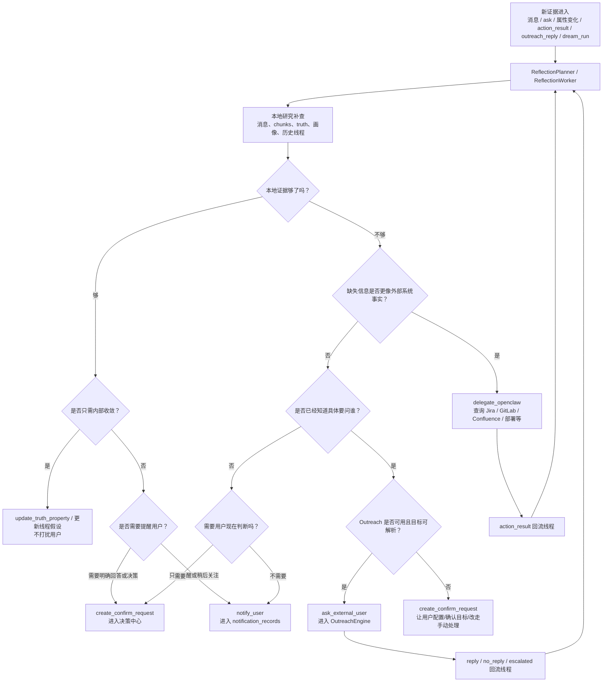

# Memory Service — 类人记忆系统架构

_最后更新: 2026-05-26 (补充无感记忆校准层与 Memory Lens / Capture / Compose Assist 边界)_

## 系统概述

Memory Service 是一套独立部署的**类人记忆后端服务**，取代了原有的 Chrome Extension 内嵌记忆系统（memory.ts + ChromaDB + Chrome Storage）。它模拟人脑的记忆机制 —— 自动摄入、显著性评估、多通道召回、遗忘衰减、离线巩固、自我反思、未来场景预演（Rehearsal）与生成式重放（梦境重放），并提供双人格模型（用户画像 + AI 自我认知）。

## 大白话运行逻辑

Memory Service 是 Personal AI 的记忆后端：外部消息、网页、会议、Jira、手动记录先被摄入成可检索的片段和实体；之后不同功能按场景去召回、提问、生成提醒或沉淀画像。

结果主要受这些因素影响：

1. 摄入质量：原始内容、来源、时间、scope、实体和 metadata 越完整，后续召回越可靠。
2. 召回通道：vector 负责语义相似，FTS 负责关键词，graph 负责实体关系，time 负责时间窗口；不同入口会选择不同通道组合。
3. 显著性和反馈：salience、access_count、用户正负反馈会影响排序和后续强化。
4. 用户边界：`X-User-Id`、scope、已确认画像和权限边界决定哪些记忆能被读取或注入。
5. 离线巩固：自我反思和梦境重放会把分散片段整理成更稳定的主题、行动项或洞察，但不应替代原始证据。
6. 未来场景预演：Rehearsal 保存“未来遇到某场景该想起/说/做什么”，通过 `/context-recall` 在 Compose Assist、Today Pilot、Meeting Pilot、Memory Lens 等现场触发；它不是事实层。

## 记忆功能地图

Memory Service 是底层记忆后端；用户真正感知到的是一组围绕“入库、整理、召回、提示、生成、复盘”的功能。详细交互规则仍以各功能文档为准，本节只做总览导航。

| 功能 | 角色 | 一句话说明 |
| ---- | ---- | ---------- |
| Memory Ingestion | 入库基础层 | 消息、会议、Jira、AI 对话、手动记录等进入 `messages_raw`、`chunks`、实体和关系；显著性决定是否索引。 |
| [Memory Capture](./memory_capture.md) / 记忆捕捉 | 资料入库层 | 写入新资料，决定“这段 / 这页 / 这次用户对外输入要不要记住”，并保存 source capsule、证据锚点和未来触发线索。 |
| [Memory Lens](./memory_lens.md) | 场景提示层 | 读已有记忆，提示“当前页面、消息、Jira、会议或划词内容和你以前什么相关”，不写入、不生成回复。 |
| [Compose Assist](./compose_assist.md) | 输入框生成层 | 用记忆生成可插入内容，帮助用户判断“我现在怎么回复 / 怎么问 AI”，只插入草稿，不自动发送。 |
| `/recall` / `/ask` | 主动查询层 | 用户主动搜索或提问时，走 vector、FTS、graph、time 多通道召回，并带回证据和来源。 |
| Memory Exploring | 记忆浏览层 | 展示搜索结果、时间轴、反思线程、决策中心、Rehearsal、动作队列等用户可检查的记忆视图。 |
| [Memory Coverage Map](./memory_coverage_map.md) | 覆盖与导入层 | 告诉用户哪些来源已经接入、哪些记忆覆盖不足，并承接外部 AI 历史、备份 zip 等导入入口。 |
| [User Profile](./user_profile_system.md) | 稳定画像层 | 保存已确认的用户事实、偏好、约束和写作风格；未经确认的资料或阅读行为不能直接变成画像事实。 |
| [Rehearsal](./rehearsal.md) | 未来场景预演层 | 保存“未来遇到某人/项目/会议/issue 时该想起什么”，通过 `/context-recall` 被 Lens、Compose Assist、Today Pilot 等消费。 |
| Reflection / Dream Replay | 离线整理层 | 把分散记忆复盘成主题、开放问题、动作和梦境重放洞察；整理结果必须保留原始证据链。 |
| Confirm Requests / Notifications / Outreach | 主动推进层 | 当记忆系统缺用户判断、需要提醒或需要问外部人时，分别进入决策中心、通知链路或主动询问。 |
| [Relationship Radar](./relationship_radar.md) | 人物关系层 | 从记忆中整理人物、关系、会议上下文和助手草稿证据，供会议、回复和人脉判断使用。 |
| [Today Pilot](./today_pilot.md) | 今日场景层 | 把今天的会议、任务、Rehearsal、项目风险和记忆线索组织成可行动的 mission。 |
| Meeting Pilot | 会议记忆层 | 捕捉和整理会议现场、转写、摘要、行动项，并把相关历史记忆和 Rehearsal 带入会议场景。 |
| [Project Dashboard](./project_dashboard_usage_guide.md) | 项目记忆层 | 把项目相关记忆、Jira、会议、风险和里程碑组织成项目视图，便于复盘和跟进。 |
| Ambient Calibration / 无感记忆校准层 | 横切反馈层 | 不做独立校准平台；从用户真实动作中记录 redacted trace，用于后续调权、诊断和学习。 |

### 三个现场能力的边界

这三个能力都使用当前页面或输入框上下文，但职责不同，不能合并成一个产品动作：

| 能力 | 大白话 | 读/写方向 | 典型场景 | 不负责 |
| ---- | ------ | --------- | -------- | ------ |
| [Memory Lens](./memory_lens.md) | 读已有记忆，提示“这和你以前什么相关”。 | 读记忆 | 浏览网页、Jira、消息会话、会议上下文，或划词查旧记忆。 | 不写入网页，不生成回复，不插入输入框。 |
| [Memory Capture](./memory_capture.md) | 写入新资料，决定“这段 / 这页 / 这次输入要不要记住”。 | 写记忆 | 选中文本点右侧半露出 `+ 入库`、复制/深读网页点页面 `+ 入库` 或高置信自动入库、Jira owner comment 自动捕捉。 | 不展示旧记忆，不把普通浏览史全量保存，不直接写 confirmed profile。 |
| [Compose Assist](./compose_assist.md) | 用记忆生成可插入内容，帮助“我现在怎么回复 / 怎么问 AI”。 | 读记忆后生成草稿 | RingCentral 回复、Jira comment、ChatGPT/豆包/Claude/Gemini 输入框。 | 不自动发送，不做后台入库判断，不展开 Memory Lens 式来源卡片。 |

推荐文档结构是：`memory_system.md` 做总览，Lens / Capture / Compose Assist 保持独立子文档。原因是它们共享上下文和召回基础设施，但用户心智分别是“提示旧记忆 / 捕捉新资料 / 生成可插入内容”，权限边界和失败模式也不同。

### 无感记忆校准层

记忆校准不是一个让用户逐条核对的独立产品入口。用户没有时间维护“待校准列表”，因此 Personal AI 的默认策略是：在用户完成真实任务的一刻，把自然行为转成校准 trace。

第一版落地在 Compose Assist：

- 用户点击 icon 插入建议，先记录原有的 `accepted` 阈值反馈；撤销窗口结束后，再写入 `action=inserted` 的中等强度正向 trace。
- 用户插入建议后，在发送前改写措辞，点击原网页 Send / Submit / Reply 时，前端只生成 redacted diff summary，写入 `edited_before_send`、`sent_after_insert` 或 `deleted_before_send`。
- 用户 hover 过建议但没有插入，随后自己发送回复，写入 `sent_without_insert`，用来区分“记忆匹配大致对但措辞不合适”和“这条记忆不该出现”。
- 用户点 thumb-down，写入 `wrong`，用于明确降低相似场景下的召回权重。

后端入口：

```http
POST /api/v1/ambient-calibration/traces
```

表结构：

- `ambient_calibration_traces`: 保存 surface、scene key、行为类型、强度、正负/修正极性、证据 id、redacted diff、隐私等级和创建时间。

隐私默认值：

- 不保存完整发送文本、完整建议文本或完整输入框内容。
- Compose Assist 只上传 hash、长度、相似度、编辑距离分段、语义关系和 evidence id。
- trace 默认 `privacyClass='sensitive_redacted'`；如果未来某 surface 只能本地学习，可用 `local_only`。

其他 surface 的校准入口应复用同一张 trace 表，而不是新增校准平台：

| Surface | 用户自然动作 | 校准含义 |
| ------- | ------------ | -------- |
| Memory Lens | hover、展开、打开来源、mute、wrong | 召回是否一眼相关、来源是否值得信任、站点/主题是否要降噪 |
| Today Pilot | done、later、mute、wrong、copy context pack | 今日 mission 排序、任务粒度、提醒时机是否正确 |
| Meeting Pilot | 确认、编辑、忽略、人工新增行动项 | 会议抽取、owner / deadline 解析、历史记忆提示是否准确 |
| Memory Capture | save、ignore、open source、reference later | 哪类资料值得入库、source capsule 的触发线索是否稳定 |
| Ask / Search | 打开结果、复制、继续追问、改写 query | 召回排序、拒答边界和 query expansion 是否需要修正 |

这层机制不会直接把 trace 变成 confirmed profile，也不会覆盖原始记忆。它先作为排序、诊断和候选学习信号；只有经过明确确认或稳定证据支持的内容，才会进入画像、关系或长期事实层。

```
┌─────────────────────────────────────────────────────────────┐
│  Chrome Extension / 其他客户端                                │
│  ┌──────────┐  ┌──────────┐  ┌──────────┐  ┌────────────┐  │
│  │ 消息处理  │  │ Agent流   │  │ Web分析   │  │ 用户画像    │  │
│  └────┬─────┘  └────┬─────┘  └────┬─────┘  └──────┬─────┘  │
│       └──────────────┴─────────────┴───────────────┘        │
│                          │ HTTP + X-User-Id                  │
└──────────────────────────┼──────────────────────────────────┘
                           ▼
┌──────────────────────────────────────────────────────────────┐
│  Memory Service  (Fastify · port 3210)                       │
│                                                              │
│  ┌─────────┐ ┌───────────┐ ┌──────────┐ ┌───────────────┐  │
│  │ Ingest  │ │  Recall   │ │   Ask    │ │   Profile     │  │
│  │ Pipeline│ │  Engine   │ │  (RAG)   │ │   Manager     │  │
│  └────┬────┘ └─────┬─────┘ └────┬─────┘ └───────┬───────┘  │
│       │             │            │                │          │
│  ┌────┴─────────────┴────────────┴────────────────┴──────┐  │
│  │              Core Engines                              │  │
│  │  Salience · Forgetting · Truth · Consolidation         │  │
│  │  Self-Reflection · Rehearsal · Dream Replay            │  │
│  └────────────────────────┬──────────────────────────────┘  │
│                           │                                  │
│  ┌────────────────────────┴──────────────────────────────┐  │
│  │  SQLite (WAL) + sqlite-vec (384d) + FTS5             │  │
│  │  Per-user DB: data/users/{userId}/memory.db           │  │
│  └───────────────────────────────────────────────────────┘  │
└──────────────────────────────────────────────────────────────┘
```

---

## 技术选型

| 层        | 方案                           | 说明                                                       |
| --------- | ------------------------------ | ---------------------------------------------------------- |
| 运行时    | Node.js 20 + Fastify 5         | 高性能异步 HTTP                                            |
| 数据库    | SQLite (better-sqlite3, WAL)   | 单文件、零运维、per-user 隔离                              |
| 向量检索  | sqlite-vec (384 维)            | 与 DB 同进程，无外部依赖                                   |
| 全文检索  | FTS5 (BM25)                    | SQLite 原生                                                |
| Embedding | Xenova/all-MiniLM-L6-v2 (本地) | 无需外部 API                                               |
| LLM       | OpenAI / Groq / Ollama / Dify  | 可插拔                                                     |
| 调度      | node-cron + heartbeat loop     | 巩固 / 自我反思 / Rehearsal aging / 梦境重放 / 周报 / 通知 |

---

## 核心引擎一览

```
  消息进入
     │
     ▼
┌──────────────────┐     ┌──────────────────┐
│ IngestionPipeline│────▶│  SalienceScorer  │
│ 去重·LLM抽取·    │     │ 重要性+频率+新近  │
│ 实体·关系·嵌入   │     │ +意外性−冗余度    │
└──────────────────┘     └──────────────────┘
         │                        │
         ▼                        ▼
┌──────────────────┐     ┌──────────────────┐
│ TruthMaintainer  │     │ ForgettingEngine │
│ 双时态属性管理    │     │ 指数衰减·可配置   │
│ 冲突→确认队列    │     │ 半衰期           │
└──────────────────┘     └──────────────────┘

         ┌─── 定时循环 ───┐
         ▼                ▼
┌──────────────────┐  ┌──────────────────┐  ┌──────────────────┐
│ Consolidation    │  │ Reflection       │  │ GenerativeReplay │
│ 每晚 23:00       │  │ Heartbeat + /ask │  │ 每周日 03:00      │
│ 6阶段巩固压缩    │  │ 自我反思/动作产出 │  │ 梦境重放发现隐含  │
│                  │  │                  │  │ 关联              │
└──────────────────┘  └──────────────────┘  └──────────────────┘
```

| 引擎                                                               | 职责                                                                |
| ------------------------------------------------------------------ | ------------------------------------------------------------------- |
| **IngestionPipeline**                                              | 去重 → LLM 抽取实体/摘要 → 显著性 → 嵌入 → 写入                     |
| **RecallEngine**                                                   | 4 通道并行召回 + MMR 重排序                                         |
| **SalienceScorer**                                                 | S = importance + frequency + recency + surprise − redundancy        |
| **ForgettingEngine**                                               | 指数衰减，可配半衰期                                                |
| **TruthMaintainer**                                                | 双时态属性 (valid_from/to + tx_start/end)，冲突确认队列             |
| **ConsolidationEngine**                                            | 每晚 6 阶段：压缩 → 去噪 → 结构化 → 清理 → 重索引 → 反思            |
| **OnlineReflection**                                               | `/ask` 返回后异步运行，补充事实/偏好/改进建议，并可生成自我反思线索 |
| **ReflectionPlanner / ReflectionThreadService / ReflectionWorker** | 管理自我反思线程、按心跳推进、生成反思 run、产出动作                |
| **RehearsalService / RehearsalActivationService**                  | 保存未来场景预演记忆，按人物/项目/群组/会议/issue/URL 等硬线索触发  |
| **GenerativeReplay**                                               | 每周执行梦境重放，写入 `dreams/*.md`、发现隐含关系并回灌到反思线程  |
| **HeartbeatLoop**                                                  | 微巩固、通知检查、梦境报表检查、自我反思 planner、动作执行          |
| **ProfileManager**                                                 | 双人格：用户画像 + AI 自我认知 (Identity/Soul/Policy)               |

摄入接口会返回轻量 `decision`，说明本次内容是进入结构化索引、仅保存为原始消息、还是被判定为重复；其中包含 duplicate 原因、显著性分数、是否达到索引阈值和未索引原因。这样客户端日志和运维排查可以直接解释“为什么记住了但搜不到”或“为什么跳过重复”，不需要临时查 SQLite。

---

## 4 通道召回 (RecallEngine)

```
         Query
           │
     ┌─────┼─────────┬────────────┐
     ▼     ▼         ▼            ▼
  Vector   FTS     Graph        Time
  余弦相似  BM25   实体名+      时间表达式
  messages  chunks  1-2跳关系    解析
  +chunks   _fts   遍历
     │     │         │            │
     └─────┴─────────┴────────────┘
                  │
                  ▼
           Merge + Dedup
                  │
                  ▼
          MMR Reranking (λ=0.7)
          + 新近度/显著性加权
                  │
                  ▼
            Top-K Results
```

### 范围语义

召回请求默认只检索 `work` 范围，避免在工作场景里意外混入个人记忆。

- `scope=work`：只检索工作记忆，也是 `/recall` 与 `/ask` 的默认值
- `scope=personal`：只检索个人记忆
- `scope=both`：同时检索工作与个人记忆
- `scope=all`：面向客户端和被动上下文召回的“全部”语义，服务端等价为 `both`

被动上下文召回（例如网页、会议或 popup 的“你之前见过这个”提示）默认使用 `all`，因为它的目标是发现关联线索，而不是替用户做工作/个人范围判断。主动研究型召回仍默认 `work`，需要用户或调用方显式切到 `personal` / `both` / `all`。

记忆查询 UI 已提供“工作 / 个人 / 全部”范围选择，并在搜索结果里显示当前检索范围、命中结果范围标签、范围分布、来源、时间和命中通道。搜索结果页切换范围会立即重新执行当前搜索并同步 URL，避免按钮状态和实际结果范围脱节；在 `全部` 范围下，结果汇总会直接显示工作/个人命中数量，让用户先看见本次证据是否跨越生活域，再决定是否继续打开来源或引用结果。召回结果会保留标题、摘要、来源、时间、原始来源链接和 `exploreLink`，卡片点击优先跳到记忆定位页，避免把 message/chunk 误当实体详情打开。搜索结果标题和摘要会安全高亮当前查询词，帮助用户快速判断命中原因；高亮只渲染转义后的文本，不信任记忆内容里的原始 HTML。`/recall`、`/ask` 和来源记忆清理接口都接受 `scope=all`，避免客户端使用统一范围语义时被后端拒绝；旧链接里的 `scope=both` 会在客户端规范化为“全部”，保持按钮状态、请求参数和文案一致。默认范围搜不到结果时，搜索页会提供“搜索全部记忆”的直接入口，减少用户被默认工作范围卡住的情况。

搜索结果卡片提供与时间轴一致的轻量反馈入口。用户可以把某条证据标记为“有用”或“不相关”，也可以撤销反馈；已有反馈会在搜索结果重新打开时恢复高亮。反馈提交时会携带 `message` / `chunk` / `entity` 目标类型，避免同 ID 的不同记忆类型串项。

召回结果现在会返回 `channelDiagnostics`，稳定列出本次请求中 `vector` / `fts` / `graph` / `time` 各通道的命中、空结果、跳过或失败状态。搜索结果页会在摘要里展示这些通道状态和命中数；如果本地语义 embedding 不可用，用户会直接看到“语义未运行”，而不是把关键词、图谱或时间通道的结果误解为完整四通道结果。

搜索结果页会在新搜索后自动清理已经不可用的类型筛选，避免旧筛选把新结果全部隐藏。直接打开 `#/search?q=...&scope=...` 时，页面会同步范围并补跑一次智能搜索。结果跳转只接受当前记忆浏览器支持的内部路由（如 timeline / topic / person / project / entity），来源链接只允许 `http/https` 且会去掉 URL 里的用户名/密码；可打开的来源按钮会标明目标 host，异常内部路由或非 http(s) 来源会在卡片上显示“已隐藏”的原因，避免静默消失或把异常 URL 变成可点击入口。

`memory-exploring` 的记忆时间轴不再展示硬编码示例，而是通过 `GET_RECENT_TIMELINE` 调用 `/recall` 的 `time` 通道，并显式传入时间窗口、`scope`、来源元数据和安全跳转链接。时间轴默认显示今天的全部范围，也可切到近 7 天、近 30 天，以及工作或个人范围；顶部会明确展示当前范围、时间窗口和命中通道，避免全局范围按钮与实际请求范围脱节；列表按日期分组，组头展示当天记忆数量和主要来源，卡片同时显示相对时间与当天具体时刻，减少长列表里只看“几天前”时的时间语境丢失。空态会按当前时间范围说明暂无可展示记忆，并提供扩大到近 7 天或全部范围的入口，而不是示例数据或静态占位。搜索结果、Relationship Radar 或被动提示里的 `#/timeline?type=...&focus=...` 链接会通过只读精确记忆接口补取目标 message/chunk；前端也兼容旧的 `focus=message:<id>` / `focus=chunk:<id>` 链接，避免历史证据链跳转后找不到目标。如果目标不在当前时间范围内，时间轴会把它置顶并高亮，避免“跳到时间轴但找不到目标”的阻塞。时间轴与搜索结果共用同一套跳转安全呈现：合法来源显示目标 host，非法来源或不支持的内部 route 会显示隐藏原因，便于用户判断是没有来源还是被安全策略拦截。

召回排序继续使用 MMR，但不再用 query embedding 当候选向量占位。没有候选 embedding 时，会用候选文本相似度作为多样性惩罚，避免时间窗口或图谱召回被近重复内容挤占；候选去重、排序和搜索结果卡片都使用 `type:id` 作为稳定身份，避免 `message`、`chunk`、`entity` 碰巧同 ID 时被误合并或前端复用错卡片；召回后的访问强化也按真实结果类型写入 `message` / `chunk` / `entity` 元数据。

图谱召回也遵守同一套范围边界。`graph` 通道返回实体或关系实体前，会先检查该实体是否有通过当前 `scope`、时间、来源、发送人、群组和项目过滤的消息证据；只有个人证据支撑的实体不会在默认 `work` 检索中出现。没有历史消息证据的老实体按兼容策略视为工作侧实体，但不会在显式 `personal` 检索中返回。

时间轴卡片提供轻量反馈入口：用户可以把某条召回结果标记为“有用”或“不相关”，也可以在点错后改判或撤销反馈。扩展会通过 `SUBMIT_MEMORY_FEEDBACK` 转发到 memory-service `/feedback`，并在请求里携带 `targetType`，因此 message/chunk/entity 即使 ID 相同也不会调错显著性记录。服务端会记录每个目标的最新召回反馈，同一动作重复提交不会反复放大显著性；改判或撤销时只应用净变化，并拒绝不存在的反馈目标，避免产生幽灵显著性数据。`/recall` 和精确记忆定位接口会在 metadata 中带回已有反馈状态，时间轴刷新或从搜索结果定位回来时会恢复按钮高亮与状态文案，避免用户误以为反馈丢失。

---

## 数据模型

### 核心表

| 表                                     | 用途                                                                            |
| -------------------------------------- | ------------------------------------------------------------------------------- |
| `messages_raw`                         | 原始消息 (content, summary, source, sender, entities_json)                      |
| `chunks` / `chunks_fts` / `chunks_vec` | 文本分块 + FTS5 + 384 维向量                                                    |
| `messages_vec`                         | 消息级 384 维向量                                                               |
| `entities`                             | 知识图谱节点 (Person, Project, Task, Organization, Document, Technology, Topic) |
| `entity_properties`                    | 双时态属性 (valid_from/to, tx_start/end, confidence, superseded_by)             |
| `relationships`                        | 图谱边 (relation_type, strength, co_occurrence_count)                           |
| `memory_metadata`                      | 显著性 & 衰减 & 巩固等级                                                        |
| `reflection_threads`                   | 自我反思主题线程                                                                |
| `reflection_runs`                      | 每次自我反思运行记录                                                            |
| `rehearsals`                           | 未来场景预演记忆，保存触发线索、建议内容、状态、置信度和生命周期统计            |
| `rehearsal_activations`                | 每次 Rehearsal 命中、展示、忽略、使用或反馈的审计记录                           |
| `proposed_actions`                     | 自我反思 / 梦境重放产出的动作队列                                               |
| `action_results`                       | 外部委派或其他动作的结构化结果，供后续反思继续引用                              |
| `dream_runs`                           | 梦境重放运行记录                                                                |

### 人格表

| 表                       | 用途                                   |
| ------------------------ | -------------------------------------- |
| `user_profile_items`     | 用户事实/偏好/习惯/兴趣                |
| `social_edges`           | 社交关系 (colleague, manager, friend…) |
| `opinion_items`          | 对人/事的态度 (valence, intensity)     |
| `agent_profile_versions` | AI 人格版本 (identity, soul, policy)   |

---

## 主动循环

| 循环      | 频率           | 动作                                                           |
| --------- | -------------- | -------------------------------------------------------------- |
| Heartbeat | 默认每 15 分钟 | 微巩固、通知检查、关注项目更新、自我反思 planner、自动动作执行 |
| Daily     | 每晚 23:00     | 6 阶段巩固（压缩/去噪/结构化/清理/重索引/反思）                |
| Weekly    | 周日 03:00     | 梦境重放（发现隐含关联并生成 `dreams/*.md`）                   |

---

## 自我反思

自我反思是 Memory Service 的**连续主题复盘机制**。它不是每天生成一篇固定总结，而是围绕一个长期话题维护 thread，在新证据出现时继续思考，并在必要时产出动作。

### 触发来源

- `/ask` 完成后，`OnlineReflection` 会异步分析本次问答是否沉淀出新事实、偏好或后续改进点
- Heartbeat 会扫描新消息、高重要度消息、待确认冲突、实体属性变化、用户画像变化
- 用户也可以手动触发某个 thread 的 `revisit`

### 运行形态

- 线程表：`reflection_threads`
- 运行记录：`reflection_runs`
- 关联梦境：`dream_runs`
- 动作运行时：`proposed_actions` / action runtime
- 动作结果回流：`action_results`
- Markdown 输出：`reflection-threads/*.md`

### 内部工作流

```
新消息 / /ask / 属性变化 / action_result / dream_run
                    │
                    ▼
           ReflectionPlanner
                    │
                    ▼
        ReflectionThreadService.runReflection
                    │
         ┌──────────┴──────────┐
         ▼                     ▼
ReflectionResearcher      ReflectionWorker
本地研究补查               生成总结 / 假设 / 动作
         │                     │
         └──────────┬──────────┘
                    ▼
            reflection_runs + markdown
                    │
                    ▼
             proposed_actions 入队
```

### 本地研究查询

自我反思在真正生成结论前，会先经过一个**本地研究步骤**。其目的不是再开一个异步 action，而是在**同一轮反思 run 内**主动补查本地记忆、聊天历史和已有线索。

- 组件：`ReflectionResearcher`
- 查询对象：`messages_raw`、`chunks`、已有 thread evidence、画像与真值上下文
- 典型场景：
  - “最近有人提过这个项目的 BE 进展吗？”
  - “过去 7 天里这个 ticket 有没有被多次提到？”
  - “我对这个人/项目是否已经有稳定偏好或已知事实？”

这一步的特点是：

- **同步执行**：和本轮自我反思是一个事务性思考过程，不需要等待队列
- **低副作用**：只是查询本地记忆，不会触发外部写操作
- **结果直接并入当前证据**：研究命中的消息、记忆片段和实体线索会作为补充 evidence 进入同一轮 `ReflectionWorker`；线程详情页会保留这些研究证据，实体线索会展示实体名、类型和少量 active 真值属性，方便刷新后复核“本地已经查到了什么”
- **过程可复核**：每条本地研究查询会记录目的、查询范围、状态、命中数、证据 refs 和错误摘要。单条查询失败不会中断整轮反思；用户在线程详情页能区分“没有计划查询”“查了但没命中”和“某条查询失败”。

因此，当前系统没有把“查本地消息”实现成 `query_memory action`。  
这样做的好处是链路更短，模型可以在同一轮里“想到要查 -> 查到 -> 继续想”，不会把大量纯读查询挤进动作队列。

业内产品上，[Slack AI search](https://slack.com/intl/en-us/help/articles/31739993134867-Search-with-Slack-AI) 和 [Notion Enterprise Search](https://www.notion.com/help/enterprise-search) 都强调按用户可访问数据检索，并把来源带回给用户复核；这里的本地研究补查也遵循同一方向，只查 Personal AI 本地可见记忆，并展示查询过程与命中证据。研究上，[Generative Agents](https://arxiv.org/abs/2304.03442) 的 observation / planning / reflection 架构和 [Reflexion](https://arxiv.org/abs/2303.11366) 的 verbal reflection loop 都支持“先把经验和证据整理进可复用记忆，再让下一轮推理读取”的设计，但实际产品需要额外暴露失败和空结果，否则用户只看到结论，无法判断反思是否真的查过本地证据。

### 典型产出

- 更新线程假设与开放问题
- 生成给用户的动作，例如通知、确认请求、决策提醒
- 生成给系统自己的动作，例如真值修正、外部工具查询

### 动作系统

当前自我反思常见动作包括：

- `notify_user`
- `create_confirm_request`
- `update_truth_property`
- `delegate_openclaw`
- `ask_external_user`

它们的职责分别是：

- `notify_user`：给用户推送结论、风险或提醒
- `create_confirm_request`：把需要用户判断的问题放进决策中心
- `update_truth_property`：修改本地真值/画像
- `delegate_openclaw`：把外部系统查询或操作委派给 OpenClaw
- `ask_external_user`：当系统已经知道要找哪个外部人/群组时，发起主动询问并等待回复

动作会进入 `proposed_actions` 队列，有独立状态机：

- `queued`
- `running`
- `succeeded`
- `failed`
- `dead_letter`

`memory-exploring` 的动作队列页会把当前筛选结果汇总成健康摘要：当前命中数量、需要处理的失败/到期/待审批/高风险动作、执行中动作、失败或 dead letter 数量。筛选为空时会说明是队列真正为空还是来源/状态/模式筛选没有命中；运行超过 30 分钟的动作会保留 running 状态并提示用户先检查服务日志、关联线程或外部系统，避免误以为页面刷新就是执行完成。

### 用户侧三条主要呈现链路

反思线程、真值维护和其他后台引擎在需要“继续推进”时，面向用户大致会分成三条链路：

- **主动询问（Outreach）**
- **决策中心（Confirm Requests）**
- **通知提醒（Notifications / 免打扰路径）**

这三条链路不是一回事。区分标准不是“有没有提醒到用户”，而是“系统下一步缺的到底是什么”。

需要特别说明的是：

- 这三条是**用户最直接感知到的主要呈现链路**
- 但系统内部真正的决策链路不止三条
- 在进入这三条用户侧链路之前，系统还会先经过：
  - 本地研究补查
  - OpenClaw 外部系统查询/执行
  - 本地真值更新 / 无需打扰用户的内部收敛

#### 1. 主动询问（Outreach）

适用场景：

- 缺失信息确实来自外部人或群组
- 系统已经知道具体应该问谁
- 用户允许使用主动询问引擎，并且 RingCentral 已正确配置

典型例子：

- “Release 版本号还没同步到本地，需要问 AI Service 群确认”
- “这个需求是谁最终拍板的，需要问 PM”

当前实现特征：

- 运行时引擎：`OutreachEngine`
- 数据表：`outreach_templates` / `outreach_sessions` / `outreach_events`
- 入口来源：
  - 自我反思动作 `ask_external_user`
  - 定时消息里的“帮询问”模板
- 发送前必须做**目标解析**
  - 如果能解析到唯一 RingCentral 用户/群组，才允许审批或发送
  - 如果目标未解析或有多个候选，会停在 `pending_approval`
  - UI 里需要先确认目标，不能直接批准
- 会话详情页支持发送前编辑目标/问题/时间、审批、取消和重试；重试会写入独立 `retried` 审计事件，时间线直接显示从哪个终态重置到下一轮处理状态，避免把重试误看成新建会话。

#### 2. 决策中心（Confirm Requests）

适用场景：

- 缺的是**用户判断**
- 目标不明确，系统还不知道该问谁
- 目标实际上是用户自己，不应该走对外询问
- 功能未配置，例如 OpenClaw / Outreach 能力缺失，需要用户决定是否配置或改走手动处理

典型例子：

- “这条主动询问其实目标是你自己，是否改为手动处理？”
- “Outreach 引擎没开，是否去 Options 配置？”
- “两个候选目标都可能对，应该问谁？”

当前实现特征：

- 数据表：`confirm_requests`
- UI：`memory-exploring` 的“决策中心”
- 主队列只展示 `routing=decision` 且 `state=pending` 的确认项；`routing=watch` 的观察项独立折叠展示，不计入主标题数字
- 决策卡会展示优先级、原因、来源、上下文、可选项和 `evidenceRefs` 摘要，并提供“复制审核包”用于把问题、上下文、可选项和原始证据引用带到外部复核
- 当前决策项的主要动作仍是**回答**；观察项支持“立即查证 / 继续观察 / 结束追踪”，但决策项本身还没有 snooze 入口

#### 3. 通知提醒（Notifications / 免打扰路径）

适用场景：

- 系统只是想提醒你有一件事值得关注
- 不一定需要你立刻给出明确判断
- 更偏“稍后看”“稍后处理”“先提醒到你”

典型例子：

- 发现一个新的待决策项，但优先级没高到必须立刻打断你
- 老的待决策项已经挂了一天，需要提醒你回来处理
- 关注项目出现更新、临近 deadline、周报或梦境摘要可查看

当前实现特征：

- 数据表：`notification_records`
- 能力：`acknowledge` / `dismiss` / `snooze`
- `snooze` 默认顺延 24 小时，也接受调用方提供 5 分钟到 7 天的延迟；已处理或已 snooze 的原通知不会再次复制，避免重复提醒
- `snooze` 生成的未来通知会保留原 payload，并写入 `payload.snooze`（来源通知、root 通知、延后时间、到点时间和第几次稍后）；Chrome 通知到点弹回时会在上下文里显示“稍后提醒 / 第 N 次稍后提醒”，避免用户误以为是全新的系统打扰
- `GET /notifications?state=scheduled` 可以查看尚未到点的稍后提醒，`/notifications/stats` 会返回 `scheduled` 数量
- 当前没有独立“通知中心”页面，主要呈现方式是：
  - Chrome Extension 通知
  - Bot 推送
  - 点击通知后跳到 `memory-exploring` 对应页面，例如 `/decisions` 或 `/dreams`

产品参考上，[Slack 的 DND / notification schedule](https://slack.com/help/articles/214908388-pause-notifications-with-do-not-disturb) 和 [Teams 的 Activity feed / notification settings](https://support.microsoft.com/en-US/teams/notifications-settings/manage-notifications-in-microsoft-teams) 都把“暂停打扰”和“稍后仍可回看”分开处理；[通知 snooze](https://weberdo.com/publications/2018-Snooze-Investigating-the-User-Defined-Deferral-of-Mobile-Notifications.pdf) 与 [notification deferral](https://www.microsoft.com/en-us/research/publication/balancing-awareness-interruption-investigation-notification-deferral-policies/) 研究也强调，延后提醒要让用户知道这是自己延后的事项，而不是一条没有来历的新通知。因此本功能优先保留延后来源、处理状态和再次提醒语义，不做静默吞掉。

### 触发逻辑与优先级

当前系统推荐的执行逻辑如下：

1. **先判断是否能通过外部工具补齐信息**

- 如果缺失信息更像是 Jira / GitLab / Confluence / 部署系统这类外部系统里已有的事实，优先走 `delegate_openclaw`
- 这一步属于“先查工具”，不是先打扰人

2. **如果无法靠工具拿到，且已知具体外部对象，再走主动询问**

- 只有当系统已经知道“要问哪个人 / 哪个群组”，才应该产出 `ask_external_user`
- `ask_external_user` 不是“有人应该知道”，而是“明确知道该找谁”
- 如果目标解析失败或目标不唯一，会进入待审批并要求用户确认目标

3. **如果目标不明确、能力没配置或需要用户判断，进入决策中心**

- 决策中心承接的是“需要你做决定”的事情
- 它不是提醒方式，而是一类待回答的问题

4. **如果只是提醒你稍后关注，进入通知链路**

- 通知链路承接的是“值得提醒”，不一定是“必须现在决策”
- 它更接近免打扰/稍后处理，而不是审批工作队列

### 系统级完整决策链路

如果从“反思线程收到新证据”开始看，系统完整链路实际上更接近下面这张图，而不只是三个用户侧页面：



这张图对应的关键原则是：

1. **先查本地，再查工具，再问人**

- Memory Service 会先用本地研究补查现有消息、真值、画像和线程证据
- 如果缺失信息本质上是 Jira / GitLab / Confluence / 部署系统里的事实，优先走 OpenClaw
- 只有当系统已经知道“该问谁”，且这更像聊天可回答的信息，才走 Outreach

2. **问人之前，必须先确认目标**

- “有人应该知道”还不够
- 必须已经定位到具体人或群组，或者至少能在审批时从候选里明确选出目标
- 如果目标不明确、目标其实是你自己、或能力没配置，就不应该直接发主动询问

3. **决策中心和通知链路不是互斥的**

- `create_confirm_request` 解决的是“需要你回答什么问题”
- `notify_user` / `notification_records` 解决的是“要不要现在提醒你”
- 所以一个高优先级决策中心项，可能会同时伴随一次立即提醒

4. **Outreach 和 OpenClaw 的结果都会回流线程**

- OpenClaw 产出 `action_result`
- Outreach 产出 `reply / no_reply / escalated`
- 两者都不是终点，而是下一轮反思的输入

### 这几条链路分别回答什么问题

为了避免混淆，可以把它们理解成不同问题类型：

| 链路         | 它回答的问题                          |
| ------------ | ------------------------------------- |
| 本地研究补查 | “我本地是不是已经知道答案了？”        |
| OpenClaw     | “外部系统里是不是已经有答案了？”      |
| Outreach     | “外部某个人/群组能不能回答这个问题？” |
| 决策中心     | “现在是不是必须由用户来判断？”        |
| 通知链路     | “这件事要不要现在提醒用户？”          |

### 立即打扰 vs 免打扰提醒

“立即打扰”不是一条单独的数据链路，而是一种**投递强度**。

- `create_confirm_request` 是“内容类型”：它表示有一个需要你回答的问题
- `notify_user` / `notification_records` 是“提醒投递”：它表示系统是否现在把这件事推到你面前

因此：

- **立即打扰 ≠ 决策中心**
- 一个高优先级的决策中心项，通常会伴随一次立即提醒
- 但“立即提醒”本身也可以只是一个通知，不一定带决策题

当前具体行为：

- 高优先级 `confirm_request` 在创建时，会立即派生一个 `notify_user` 动作，尝试立刻 Bot 推送
- 其他待决策项则会在 Heartbeat 中被扫描成通知候选，再经过 `ProactivityPolicy` 决定是否真的发出提醒
- 所以，**决策中心项不一定一定推送；高优先级时会立即推送，普通优先级可能只是安静地留在决策中心，或稍后再提醒**

### 外部查询与执行操作

当自我反思判断“当前证据不足，必须访问外部系统”时，会产出 `delegate_openclaw` action，而不是直接在 Memory Service 内部执行。

典型场景：

- 查询 Jira / GitLab / Confluence / 部署系统状态
- 请求外部工具补充信息
- 在外部系统执行真实写操作

当前接入方式是：

- 目标接口：OpenClaw 的 `/v1/responses`
- 运行模式：**黑盒单轮委派**
- 会话键：以 thread 为粒度生成稳定 `sessionKey`
- 返回值：要求 OpenClaw 最终返回结构化 JSON；若只返回文本，系统会用纯文本 fallback 包装

当前版本**不会**把 OpenClaw 的过程消息、delta、工具中间步骤写回自我反思证据链。  
系统只消费**最终结果**，原因是：

- 避免把 thread 污染成大量中间推理
- 让 evidence 更聚焦于“拿到了什么外部事实”而不是“中间聊了什么”
- 当前版本也还没有启用完整的 multi-turn Responses tool loop

动作队列会直接展示 OpenClaw 最终返回的审计摘要：状态、artifact 数量、来源系统、对象 key、验证方式、观察/变更字段、结构化 payload，以及可展开的 delegation transcript。这样用户不需要先跳到反思线程，也能在失败重试或确认前判断“外部到底查到了什么”。

### 外部委派的安全边界

- 外部**只读**查询可以自动执行，也可以由反思线程产出为手动动作
- 外部**写操作**默认必须人工审批后以 `manual` 方式执行
- 若 OpenClaw 返回缺少能力、鉴权失败或需要人工判断，系统会派生通知或确认请求，而不是静默吞掉

### 结果回流

外部动作成功后，结果不会只停留在 action 卡片里，而是会继续写回记忆系统：

- 结果写入 `action_results`
- 在线程上增加 `source_kind='action_result'` 的 evidence link
- `ReflectionThreadService` 读取新的 action result 后，会再跑一轮 follow-up reflection
- 动作队列卡片同步展示最终 artifact 和 transcript，作为用户手动排障、重试和审批前的审计入口

这就形成了一个闭环：

```
自我反思 → 产出外部动作 → OpenClaw 查询/执行
        → action_result 回流 → 下一轮自我反思继续判断
```

这也是当前系统能够“先想到问题，再去查证，再继续想”的关键。

### 超时与失败语义

OpenClaw 委派不是无限等待。每个用户都可以配置：

- `openClawEnabled`
- `openClawBaseUrl`
- `openClawTimeoutMs`

当前行为是：

- 单次委派超过 `openClawTimeoutMs` 会被本地 `AbortController` 中断
- 结果标记为 `timeout`
- action 队列状态进入 `failed`
- 重试次数继续累计，超过阈值后进入 `dead_letter`

这意味着如果外部系统很慢，系统不会卡死，但也可能出现“外部真实还没跑完，本地先超时”的情况。  
对于耗时较长的外部系统，应当按用户或环境把 `openClawTimeoutMs` 调大。

### 用户级配置

- `reflectionEnabled`
- `reflectionHeartbeatMinutes`
- `reflectionActiveTopicLimit`
- 若干动作阈值，如 `reflectionUrgentNotifyThreshold`

默认策略：

- 新用户如果还没有自己的 `config.json`，自我反思默认是关闭的
- 用户需要在 options 页显式开启，并保存后，后端才会对该用户开始运行自我反思

这些配置都保存在**当前用户自己的** `data/users/{userId}/config.json` 中，通过 `X-User-Id` 隔离。  
也就是说：

- 用户 A 关闭自我反思，只会停止 A 自己的 `/ask` 在线反思和 heartbeat 反思推进
- 用户 B 仍然会按自己的配置继续运行自我反思
- 不存在某个用户关闭后影响其他用户反思能力的情况

---

## Rehearsal / 未来场景预演

Rehearsal 是 Memory Service 的**未来场景预演记忆层**。它保存的不是“已经发生了什么事实”，而是“如果未来遇到某个场景，我应该想起、说或做什么”。

详细功能文档见 [`rehearsal.md`](./rehearsal.md)。

### 运行形态

- 核心服务：`RehearsalService`
- 场景匹配：`RehearsalActivationService`
- 数据表：`rehearsals` / `rehearsal_activations`
- Markdown 输出：`rehearsals/{id}.md`
- 统一召回入口：`POST /context-recall`
- 管理入口：`memory-exploring.html#/rehearsals`

### 与自我反思和梦境重放的关系

三者不能合并成一个系统，因为它们处理的信息置信度和现场消费方式不同：

| 系统       | 输入                         | 输出                                            | 是否直接进现场提示                                |
| ---------- | ---------------------------- | ----------------------------------------------- | ------------------------------------------------- |
| Reflection | 真实证据、开放问题、动作结果 | 反思结论、动作、确认请求、`rehearsal_candidate` | 部分结果可进 Today Pilot，但通常需要动作/通知包装 |
| Dream      | 长期记忆的低置信联想         | dream run、弱关系、风险线索                     | 否，只能作为 Reflection 弱线索                    |
| Rehearsal  | 未来场景脚本和稳定触发线索   | active/candidate/stale 预演提示                 | 是，通过 `/context-recall` 场景触发               |

Reflection 可以生成 `rehearsal_candidate`。当前接入点在 `ReflectionThreadService.runReflection()`：`ReflectionWorker` 从真实证据、开放问题和本地研究结果里识别“未来遇到某场景应该想起/说/做什么”，输出 `rehearsalCandidates`，再由 `RehearsalService` 写入 `rehearsals`。如果候选置信度高、触发线索稳定，例如明确人物、群组、会议或 issue，系统可以自动转为 `active`；否则留在候选，由用户或后续证据修正。同一反思线程下触发线索相同的候选会更新已有 Rehearsal，避免重复创建。

Dream 不能直接生成 active Rehearsal。它只能提供低置信线索，再交给 Reflection 或 Rehearsal 相关流程验证，避免把生成式联想当成未来现场提醒。

### 召回语义

Rehearsal 不只依赖向量召回。`RehearsalActivationService` 会结合：

- 人物、项目、群组、会话、会议、日历事件、issue、URL 等硬线索
- 当前 surface 类型，例如 composer、meeting prep、memory lens、today pilot
- 主题、关键词和意图
- 有效期、原始置信度、陈旧度、负反馈

`/context-recall` 只有在调用方 `sourceTypes` 包含 `rehearsal` 时才返回 Rehearsal match。返回结果使用统一 `ContextRecallMatch`，但类型和解释字段会标明：

- `type='rehearsal'`
- `sourceType='rehearsal'`
- `evidenceRole='rehearsal_cue'`
- `reasonType='prospective_cue'`

这样 Compose Assist、Meeting Pilot、Today Pilot、Memory Lens 可以共用召回层，同时仍各自保留展示文案、风险门控和自动化边界。

### 开关关系

Rehearsal 没有独立的“系统启用”开关。它的产生和消费分别控制：

- `SELF_REFLECTION_ENABLED` 关闭时，Reflection 心跳不再自动产出新的 `rehearsal_candidate`；手动创建和已存在 Rehearsal 不受影响。
- `CONTEXT_ASSIST_ENABLED`、`COMPOSE_ASSIST_ENABLED`、`MEETING_PREP_ENABLED`、`MEETING_PILOT_ENABLED` 等关闭对应 surface 后，对应前端不会请求或展示 Rehearsal。
- `SCENE_REHEARSAL_DISPLAY_ENABLED` 是 Options 里 Context Assist 区域的展示总闸。关闭后，扩展会在现场消费入口过滤 `rehearsal` source，但不会删除已有 Rehearsal，也不会关闭 Reflection 的候选生成能力。
- 即使 surface 开启，调用 `/context-recall` 时 `sourceTypes` 也必须包含 `rehearsal`，否则 `RehearsalActivationService` 会直接跳过。

### 生命周期

Rehearsal 默认不物理删除：

- 高置信 candidate 且有稳定触发线索：可自动 `active`
- 过期或 30 天未触发：aging 降权
- 90 天未触发且无强硬线索：进入 `stale`
- stale 默认不自动弹出，但精确人物/会议/issue 命中仍可弱提示
- 用户主动归档进入 `archived`
- 用户标记不相关进入 `dismissed`

这种策略和 Reflection / Dream 的边界一致：旧内容先降权、关闭或只保留审计，只有用户手动删除或未来隐私清理策略才物理删除。

---

## 梦境重放

梦境重放是每周一次的**生成式长期记忆回放**。系统会从近一段时间内显著性高的实体主题出发，召回相关记忆，生成一段叙事式回放，并尝试发现潜在关系、风险与值得继续观察的线索。

### 运行形态

- 核心引擎：`GenerativeReplay`
- Markdown 输出：`dreams/{topic}-{date}.md`
- 数据表：`dream_runs`
- 同时会把 dream run 关联回对应的反思线程，便于后续继续复盘

### 典型产出

- 一段梦境重放叙事
- `insights`
- `risks`
- 低置信度的新关系（来源标记为 dream / generative replay）

前端的“梦境重放”页会把最近的 `dreams/*.md` 汇总成可扫读卡片，优先展示洞察数、待复核风险数和新关系数。单个梦境文件读取失败时，页面会保留可用结果并显示部分失败提示，避免把服务或文件错误误报成“暂无内容”。展开梦境时会提示这是生成式低置信度联想，用户应先进入自我反思或原始记忆复核，再把关系、风险或行动项当作确定事实使用；从梦境卡片进入复核时会带上当前主题并在反思线程页自动筛选，避免用户跳过去后丢失要核对的线索。

梦境报表只汇总当前 digest 周期内生成的 dream 文件。周一报表会覆盖上一周的梦境重放结果；旧文件和无法解析生成日期的历史文件仍可在梦境页查看，但不会被反复当成本周期内容推送。

### 与自我反思的关系

梦境重放不是独立悬空的文档生成器，而是会把结果继续喂回自我反思系统：

- `dream_runs` 会关联到对应的 thread
- 梦境输出会写成 `dreams/*.md`
- 其中的重要线索、隐含关联和风险，可以成为下一轮自我反思的输入 evidence

因此两者的关系是：

- **自我反思**：围绕一个明确主题持续复盘、产出动作
- **梦境重放**：更偏长期、联想式、探索式回放，用来发现 thread 尚未显式提出的关系或风险

### 配置语义

梦境重放和“梦境报表推送”是两个不同层次：

- **梦境重放本身**：所有用户都会持续运行，用于内部长期记忆联想与知识发现
- **梦境报表推送**：用户可以单独控制是否收到 digest / Bot 推送

因此当前支持的用户级配置是：

- `dreamDigestScheduleType`
- `dreamDigestIntervalDays`
- `dreamDigestPushTarget`
- `dreamDigestPushGroupId`

如果用户把梦境报表设为“不推送”，系统仍然会继续生成 `dreams/*.md` 和 `dream_runs`，只是不会再自动投递梦境报表通知。

---

## 多用户隔离

```
data/
└── users/
    ├── alice/
    │   ├── memory.db          ← 独立 SQLite
    │   └── daily/2026-02-26.md
    ├── bob/
    │   ├── memory.db
    │   └── daily/...
    └── default/
        └── ...
```

- 认证：`X-User-Id` 请求头
- UserContextManager 按需加载、30 分钟空闲回收
- 每个用户都有独立的 `config.json`，包括自我反思频率、是否启用自我反思、梦境报表推送策略等运行时配置
- 自我反思是**按用户开关**的；梦境重放是**全用户持续运行**的，只有报表推送是按用户控制的
- 实时事件流 `/events` 兼容浏览器 `EventSource`：客户端会在本地配置和 `userinfo.username` 解析完成后再用 `?userId=` 建立连接，服务端优先校验这个 query userId 并按用户过滤事件；非法 userId 会直接拒绝，避免事件流误连到 `default` 用户。
- `/stats` 会返回当前请求的 `user` 隔离摘要，包括 `id`、`storageKey`、是否因为缺少 `X-User-Id` 回退到 `default`。Memory Exploring 侧栏会直接展示当前记忆用户；如果正在使用 `default` 空间，会显示轻量警示，避免用户误把 fallback 数据当成自己的账号数据。

---

## 本轮产品观察

业内产品和论文对长期记忆系统的共同要求是：用户可控、按需取回、来源可追溯，并且要避免把全部历史无差别塞进上下文。

- ChatGPT Memory 与 Claude Memory 都把“用户能查看、关闭、删除或控制记忆”作为核心产品语义
- Notion Enterprise Search 这类跨应用搜索把查询时权限检查、用户映射和工作区隔离作为核心约束；这说明长期记忆不只要分库，还要保证实时事件、召回和导出等所有读路径都带着同一份用户身份。
- OpenAI Agents SDK / LangGraph 的 human-in-the-loop 都强调暂停、持久化、恢复和逐项审批；Zapier Agents 的 activity 页面强调按运行状态、使用的 app、时间和详细步骤审计。动作队列 UI 因此应把“等待什么、是否能恢复、失败原因在哪里”放在列表入口，而不只展示 raw status。
- MemGPT 的分层记忆思路说明长期记忆需要明确的热/冷层和取回策略，不能只靠更大的上下文窗口
- Generative Agents 的观察、反思、计划闭环与当前自我反思线程方向一致，但前端必须把证据、来源和下一步动作讲清楚
- GraphRAG 的实践强调实体/关系图和证据溯源；当前系统已有图谱与 evidence block，应继续避免无来源的“泛化结论”
- Mem0 等记忆层产品也强调按 conversation / session / user 等层级取用，避免把短期工作状态或配置项过度提取成长期记忆
- MemX 这类 local-first 记忆系统强调可解释检索、混合召回和低置信拒答；本系统的范围过滤、命中通道展示和反馈闭环应继续向“少而准”的召回体验收敛

因此，记忆检索的用户体验应优先保证：

- 范围选择不会让用户误以为“全部”代表空结果
- 结果卡片能展示命中通道、来源、时间和跳转入口
- 被动提示只展示少量高信号线索，主动研究场景再展开 evidence list / timeline / media blocks
- 近重复命中需要被压低，让用户先看到不同来源或不同事实角度的证据

---

## 外部入口同步边界

Memory Service 可以给豆包等外部入口渲染不同类型的 context package，但每个 package 的语义必须分开：

| 同步包                            | 用途                     | 数据来源                                     |
| --------------------------------- | ------------------------ | -------------------------------------------- |
| `persona_core` / `voice_mode`     | 长期稳定画像和回复偏好   | `user_profile_items` 与 AI persona           |
| `active_focus_digest`             | 手机对话里的近期记忆重点 | 近期高显著性消息、近期画像信号、自我反思产物 |
| `todo_digest` / `reminder_digest` | 待处理事项               | 待决策项、待执行动作                         |
| `notice_digest`                   | 非待办通知               | 通知中心                                     |

`concerned_items_state` 是“关注规则 / 后续跟进配置”，不是用户真实记忆重点。它不再进入 `active_focus_digest`，避免豆包同步时把“我关注什么规则”误保存成“近期发生了什么重点”。

当近期窗口里没有真实记忆高信号时，桌面桥接器会把本次 `mobile_briefing` 标记为 `skipped`，不会把空状态、占位文案或关注规则推送到豆包。

---

## API 概览

| 操作      | 端点                                   | 说明                                                                                                |
| --------- | -------------------------------------- | --------------------------------------------------------------------------------------------------- |
| 摄入      | `POST /ingest`                         | 单条消息存储，返回 `decision` 解释重复/索引/仅保存原因                                              |
| 批量摄入  | `POST /ingest/batch`                   | 批量写入，单条结果与 `/ingest` 保持一致                                                             |
| 召回      | `POST /recall`                         | 多通道记忆检索                                                                                      |
| 反馈      | `POST /feedback`                       | 记录召回质量、通知或实体修正反馈                                                                    |
| 问答      | `POST /ask`                            | RAG 风格自然语言问答                                                                                |
| 配置      | `GET /config` / `PUT /config`          | 按用户读取/写入运行时配置                                                                           |
| 实体      | `GET /entities`                        | 知识图谱查询                                                                                        |
| 用户画像  | `GET /profile/core`                    | 核心画像                                                                                            |
| 通知      | `GET /notifications`                   | 主动通知列表，支持 `pending` / `scheduled` / `clicked` / `dismissed` 状态                           |
| 自我反思  | `GET /reflection-threads`              | 查看自我反思线程列表                                                                                |
| 自我反思  | `GET /reflection-threads/:id`          | 查看单个线程详情、runs、actions、action results                                                     |
| 自我反思  | `POST /reflection-threads/:id/revisit` | 手动触发某个线程重新反思                                                                            |
| Rehearsal | `GET /rehearsals`                      | 查看未来场景预演记忆，支持状态和关键词过滤                                                          |
| Rehearsal | `POST /rehearsals`                     | 创建 candidate 或 active 预演记忆                                                                   |
| Rehearsal | `GET /rehearsals/:id`                  | 查看预演详情和 activation history                                                                   |
| Rehearsal | `PATCH /rehearsals/:id`                | 更新状态、内容、触发线索、有效期等                                                                  |
| Rehearsal | `POST /rehearsals/:id/feedback`        | 记录 used、dismissed、irrelevant 等反馈                                                             |
| 动作      | `GET /actions`                         | 查看动作队列                                                                                        |
| 动作      | `POST /actions/:id/execute`            | 手动执行某个动作                                                                                    |
| 动作      | `POST /actions/:id/retry`              | 重试失败动作                                                                                        |
| 决策中心  | `GET /confirm-requests`                | 查看待确认项，支持 `queue=decision/watch/all` 与 `state` 过滤                                       |
| 决策中心  | `POST /confirm-requests/:id/answer`    | 回答待确认项                                                                                        |
| 决策中心  | `POST /confirm-requests/:id/state`     | 观察项在 `pending` / `snoozed` / `expired` 之间流转                                                 |
| 主动询问  | `GET /outreach/sessions`               | 查看主动询问会话                                                                                    |
| 主动询问  | `GET /outreach/sessions/:id`           | 查看单个主动询问详情                                                                                |
| 主动询问  | `POST /outreach/sessions/:id/approve`  | 批准待发送询问                                                                                      |
| 主动询问  | `POST /outreach/sessions/:id/update-draft` | 发送前调整目标、问题、信息目标和计划时间                                                            |
| 主动询问  | `POST /outreach/sessions/:id/cancel`   | 取消主动询问会话                                                                                    |
| 主动询问  | `POST /outreach/sessions/:id/retry`    | 将终态会话重置为待审批或已排程，并写入 `retried` 审计事件                                           |
| 主动询问  | `GET /outreach/summary`                | 查看待发送、等待回复、待审批和升级数量                                                              |
| 主动询问  | `GET /outreach/directory/status` / `POST /outreach/directory/sync` | 查看或刷新 RingCentral 目标目录缓存                                              |
| 主动询问  | `GET /outreach/targets/search`         | 检索 RingCentral 用户/群组候选                                                                      |
| 梦境报表  | `POST /dream-digest/push-now`          | 手动立即推送一次梦境报表                                                                            |
| 巩固      | `POST /consolidate`                    | 手动触发巩固                                                                                        |
| 导出      | `POST /export`                         | 生成可恢复的 backup ZIP，包含 `manifest.json`、用户 SQLite/config/Markdown 与只读 derived snapshots |
| 导入      | `POST /import`                         | Multipart 上传 backup ZIP；支持 `mode=merge/replace` 与 `dryRun=true` 预检                          |
| 健康      | `GET /health`                          | 服务状态                                                                                            |

### 记忆导入 / 导出 / 备份

- `/export` 默认返回 `backup_zip`，manifest 会列出 A 层 SQLite/config、B 层用户 Markdown 文件、C 层 derived 快照，并记录 size / sha256 用于导入校验。
- `/import` 的默认模式是 `merge`，会合并数据库行并覆盖备份内同名文件，保留备份外的本地文件；`mode=replace` 会用备份目录替换当前用户目录。
- 导入前可以先用同一个 multipart 请求加 `dryRun=true`，服务只校验 ZIP、manifest 和数据库可读性，并返回将写入、覆盖、保留、删除的路径及数据库表行数预览，不会修改当前用户数据。
- manifest 是导入的完整可信清单：ZIP 里除 `manifest.json` 外的每个文件都必须列在 manifest 中并通过 size/sha256 校验；额外夹带的未声明文件会在 dry-run 和正式导入前被拒绝。
- 导入结果和 dry-run 都会返回 warnings；例如备份来源用户与当前 `X-User-Id` 不一致时会显式提示，避免把迁移场景误当成同账号恢复。

完整 API 文档：`http://localhost:3210/docs` (Swagger UI)

---

## 部署

```yaml
# docker-compose.yml
services:
  memory-service:
    build: ./memory-service
    ports: ['3210:3210']
    volumes: ['./memory-service/data:/app/data']
    env_file: ['./memory-service/.env']
    restart: unless-stopped
```

---

## 与业界记忆系统对比

| 能力维度      | 本系统 (Memory Service)                        | OpenClaw (mem0/memory-core)           | MemGPT / Letta                   | Mem0 (SaaS)              |
| ------------- | ---------------------------------------------- | ------------------------------------- | -------------------------------- | ------------------------ |
| **存储**      | SQLite + sqlite-vec + FTS5，单文件零运维       | Markdown 文件 + SQLite                | 分层 archival/recall/core        | 托管向量数据库           |
| **检索**      | 4 通道并行 (Vector + FTS + Graph + Time) + MMR | 向量 + BM25 混合                      | 向量 + 分页                      | 向量检索                 |
| **知识图谱**  | 内建实体/关系/双时态属性                       | ✗ 无                                  | ✗ 无                             | 有限图谱                 |
| **真值维护**  | 双时态 + 冲突确认队列                          | ✗ 覆盖写入                            | ✗ 仅追加                         | ✗ 无                     |
| **遗忘机制**  | 指数衰减 + 显著性 + 巩固等级                   | ✗ 手动删除                            | 手动 archival                    | ✗ 无                     |
| **离线巩固**  | 每晚 6 阶段 + 每周做梦                         | ✗ 无                                  | ✗ 无                             | ✗ 无                     |
| **主动通知**  | Heartbeat 循环 + 关注项目 + 安静时段           | ✗ 无                                  | ✗ 无                             | ✗ 无                     |
| **用户画像**  | 双人格（用户 + AI）+ 社交图 + 态度             | USER.md + SOUL.md                     | 核心记忆摘要                     | 用户标签                 |
| **自我反思**  | 连续 thread + 动作队列 + 结果回流              | 有外部 agent 记忆但无本地 thread 编排 | 有对话记忆，但非长期 thread 复盘 | 偏记忆提取，不偏持续复盘 |
| **梦境重放**  | 周期性生成式回放 + 回流 thread                 | 部分系统可手工做总结                  | ✗ 无原生梦境回放                 | ✗ 无                     |
| **外部委派**  | OpenClaw `/v1/responses` + action_result 回流  | 原生偏 agent/gateway                  | 需额外接工具                     | 需额外接工具             |
| **多用户**    | Per-user DB 隔离 + 空闲回收                    | 单用户                                | 单用户                           | 多租户                   |
| **部署**      | Docker 自托管 / 无外部依赖                     | 进程内                                | Docker                           | SaaS                     |
| **隐私**      | 数据完全本地，不出用户设备/服务器              | 本地                                  | 本地                             | 云端                     |
| **Embedding** | 本地模型 (MiniLM)，不依赖外部 API              | 依赖 API                              | 依赖 API                         | 依赖 API                 |

### 核心差异化

1. **"活的"记忆** — 不是被动存取，而是有显著性评估、自动衰减和定期巩固的生命周期
2. **真值维护** — 双时态属性让事实可追溯，冲突自动检测并请求用户确认
3. **自我反思机制** — 不是“问完就结束”，而是可以围绕长期主题持续复盘，先做本地研究补查，再把结论转成动作
4. **梦境重放机制** — 周期性生成式重放，发现用户未显式表达的关联，并把线索继续回流到 thread
5. **4 通道召回** — 向量、全文、图谱、时间四路并行，比单纯向量检索更全面
6. **内外部协同** — 本地记忆内部查询负责补查聊天历史，OpenClaw 外部委派负责查 Jira / GitLab / 外部系统并把结果回流
7. **完全自主可控** — 本地 Embedding + 本地 SQLite，无需任何云服务依赖；外部能力按用户配置启用
