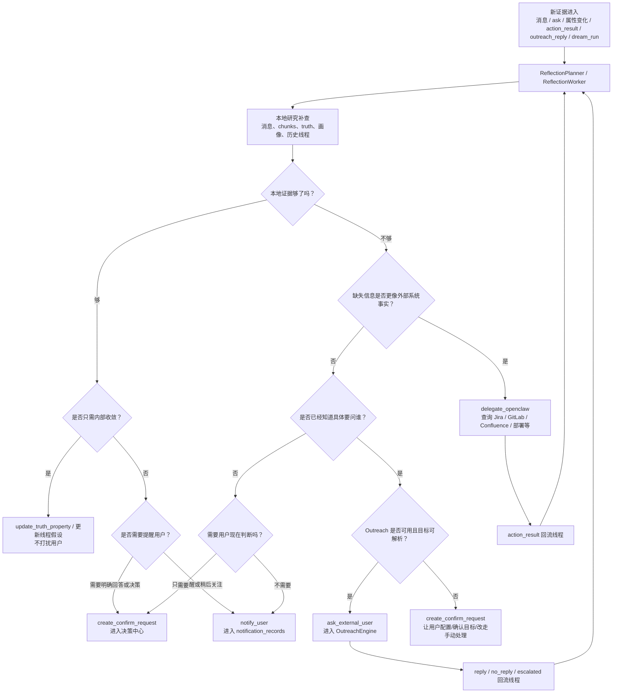

# Memory Service — 类人记忆系统架构

*最后更新: 2026-05-08 (补充召回多样性强化与空结果范围扩展路径)*

## 系统概述

Memory Service 是一套独立部署的**类人记忆后端服务**，取代了原有的 Chrome Extension 内嵌记忆系统（memory.ts + ChromaDB + Chrome Storage）。它模拟人脑的记忆机制 —— 自动摄入、显著性评估、多通道召回、遗忘衰减、离线巩固、自我反思与生成式重放（梦境重放），并提供双人格模型（用户画像 + AI 自我认知）。

```
┌─────────────────────────────────────────────────────────────┐
│  Chrome Extension / 其他客户端                                │
│  ┌──────────┐  ┌──────────┐  ┌──────────┐  ┌────────────┐  │
│  │ 消息处理  │  │ Agent流   │  │ Web分析   │  │ 用户画像    │  │
│  └────┬─────┘  └────┬─────┘  └────┬─────┘  └──────┬─────┘  │
│       └──────────────┴─────────────┴───────────────┘        │
│                          │ HTTP + X-User-Id                  │
└──────────────────────────┼──────────────────────────────────┘
                           ▼
┌──────────────────────────────────────────────────────────────┐
│  Memory Service  (Fastify · port 3210)                       │
│                                                              │
│  ┌─────────┐ ┌───────────┐ ┌──────────┐ ┌───────────────┐  │
│  │ Ingest  │ │  Recall   │ │   Ask    │ │   Profile     │  │
│  │ Pipeline│ │  Engine   │ │  (RAG)   │ │   Manager     │  │
│  └────┬────┘ └─────┬─────┘ └────┬─────┘ └───────┬───────┘  │
│       │             │            │                │          │
│  ┌────┴─────────────┴────────────┴────────────────┴──────┐  │
│  │              Core Engines                              │  │
│  │  Salience · Forgetting · Truth · Consolidation         │  │
│  │  Self-Reflection · Dream Replay                        │  │
│  └────────────────────────┬──────────────────────────────┘  │
│                           │                                  │
│  ┌────────────────────────┴──────────────────────────────┐  │
│  │  SQLite (WAL) + sqlite-vec (384d) + FTS5             │  │
│  │  Per-user DB: data/users/{userId}/memory.db           │  │
│  └───────────────────────────────────────────────────────┘  │
└──────────────────────────────────────────────────────────────┘
```

---

## 技术选型

| 层 | 方案 | 说明 |
|---|---|---|
| 运行时 | Node.js 20 + Fastify 5 | 高性能异步 HTTP |
| 数据库 | SQLite (better-sqlite3, WAL) | 单文件、零运维、per-user 隔离 |
| 向量检索 | sqlite-vec (384 维) | 与 DB 同进程，无外部依赖 |
| 全文检索 | FTS5 (BM25) | SQLite 原生 |
| Embedding | Xenova/all-MiniLM-L6-v2 (本地) | 无需外部 API |
| LLM | OpenAI / Groq / Ollama / Dify | 可插拔 |
| 调度 | node-cron + heartbeat loop | 巩固 / 自我反思 / 梦境重放 / 周报 / 通知 |

---

## 核心引擎一览

```
  消息进入
     │
     ▼
┌──────────────────┐     ┌──────────────────┐
│ IngestionPipeline│────▶│  SalienceScorer  │
│ 去重·LLM抽取·    │     │ 重要性+频率+新近  │
│ 实体·关系·嵌入   │     │ +意外性−冗余度    │
└──────────────────┘     └──────────────────┘
         │                        │
         ▼                        ▼
┌──────────────────┐     ┌──────────────────┐
│ TruthMaintainer  │     │ ForgettingEngine │
│ 双时态属性管理    │     │ 指数衰减·可配置   │
│ 冲突→确认队列    │     │ 半衰期           │
└──────────────────┘     └──────────────────┘

         ┌─── 定时循环 ───┐
         ▼                ▼
┌──────────────────┐  ┌──────────────────┐  ┌──────────────────┐
│ Consolidation    │  │ Reflection       │  │ GenerativeReplay │
│ 每晚 23:00       │  │ Heartbeat + /ask │  │ 每周日 03:00      │
│ 6阶段巩固压缩    │  │ 自我反思/动作产出 │  │ 梦境重放发现隐含  │
│                  │  │                  │  │ 关联              │
└──────────────────┘  └──────────────────┘  └──────────────────┘
```

| 引擎 | 职责 |
|---|---|
| **IngestionPipeline** | 去重 → LLM 抽取实体/摘要 → 显著性 → 嵌入 → 写入 |
| **RecallEngine** | 4 通道并行召回 + MMR 重排序 |
| **SalienceScorer** | S = importance + frequency + recency + surprise − redundancy |
| **ForgettingEngine** | 指数衰减，可配半衰期 |
| **TruthMaintainer** | 双时态属性 (valid_from/to + tx_start/end)，冲突确认队列 |
| **ConsolidationEngine** | 每晚 6 阶段：压缩→去噪→结构化→清理→重索引→反思 |
| **OnlineReflection** | `/ask` 返回后异步运行，补充事实/偏好/改进建议，并可生成自我反思线索 |
| **ReflectionPlanner / ReflectionThreadService / ReflectionWorker** | 管理自我反思线程、按心跳推进、生成反思 run、产出动作 |
| **GenerativeReplay** | 每周执行梦境重放，写入 `dreams/*.md`、发现隐含关系并回灌到反思线程 |
| **HeartbeatLoop** | 微巩固、通知检查、梦境报表检查、自我反思 planner、动作执行 |
| **ProfileManager** | 双人格：用户画像 + AI 自我认知 (Identity/Soul/Policy) |

---

## 4 通道召回 (RecallEngine)

```
         Query
           │
     ┌─────┼─────────┬────────────┐
     ▼     ▼         ▼            ▼
  Vector   FTS     Graph        Time
  余弦相似  BM25   实体名+      时间表达式
  messages  chunks  1-2跳关系    解析
  +chunks   _fts   遍历
     │     │         │            │
     └─────┴─────────┴────────────┘
                  │
                  ▼
           Merge + Dedup
                  │
                  ▼
          MMR Reranking (λ=0.7)
          + 新近度/显著性加权
                  │
                  ▼
            Top-K Results
```

### 范围语义

召回请求默认只检索 `work` 范围，避免在工作场景里意外混入个人记忆。

- `scope=work`：只检索工作记忆，也是 `/recall` 与 `/ask` 的默认值
- `scope=personal`：只检索个人记忆
- `scope=both`：同时检索工作与个人记忆
- `scope=all`：面向客户端和被动上下文召回的“全部”语义，服务端等价为 `both`

被动上下文召回（例如网页、会议或 popup 的“你之前见过这个”提示）默认使用 `all`，因为它的目标是发现关联线索，而不是替用户做工作/个人范围判断。主动研究型召回仍默认 `work`，需要用户或调用方显式切到 `personal` / `both` / `all`。

记忆查询 UI 已提供“工作 / 个人 / 全部”范围选择，并在搜索结果里显示当前检索范围、命中结果范围标签、来源、时间和命中通道。召回结果会保留标题、摘要、来源、时间、原始来源链接和 `exploreLink`，卡片点击优先跳到记忆定位页，避免把 message/chunk 误当实体详情打开。`/recall`、`/ask` 和来源记忆清理接口都接受 `scope=all`，避免客户端使用统一范围语义时被后端拒绝。默认范围搜不到结果时，搜索页会提供“搜索全部记忆”的直接入口，减少用户被默认工作范围卡住的情况。

搜索结果页会在新搜索后自动清理已经不可用的类型筛选，避免旧筛选把新结果全部隐藏。直接打开 `#/search?q=...&scope=...` 时，页面会同步范围并补跑一次智能搜索。结果跳转只接受服务端生成的 `#/...` 内部路由，来源链接只允许 `http/https`，避免记忆内容里的异常 URL 变成可点击入口。

召回排序继续使用 MMR，但不再用 query embedding 当候选向量占位。没有候选 embedding 时，会用候选文本相似度作为多样性惩罚，避免时间窗口或图谱召回被近重复内容挤占；召回后的访问强化也按真实结果类型写入 `message` / `chunk` / `entity` 元数据。

---

## 数据模型

### 核心表

| 表 | 用途 |
|---|---|
| `messages_raw` | 原始消息 (content, summary, source, sender, entities_json) |
| `chunks` / `chunks_fts` / `chunks_vec` | 文本分块 + FTS5 + 384 维向量 |
| `messages_vec` | 消息级 384 维向量 |
| `entities` | 知识图谱节点 (Person, Project, Task, Organization, Document, Technology, Topic) |
| `entity_properties` | 双时态属性 (valid_from/to, tx_start/end, confidence, superseded_by) |
| `relationships` | 图谱边 (relation_type, strength, co_occurrence_count) |
| `memory_metadata` | 显著性 & 衰减 & 巩固等级 |
| `reflection_threads` | 自我反思主题线程 |
| `reflection_runs` | 每次自我反思运行记录 |
| `proposed_actions` | 自我反思 / 梦境重放产出的动作队列 |
| `action_results` | 外部委派或其他动作的结构化结果，供后续反思继续引用 |
| `dream_runs` | 梦境重放运行记录 |

### 人格表

| 表 | 用途 |
|---|---|
| `user_profile_items` | 用户事实/偏好/习惯/兴趣 |
| `social_edges` | 社交关系 (colleague, manager, friend…) |
| `opinion_items` | 对人/事的态度 (valence, intensity) |
| `agent_profile_versions` | AI 人格版本 (identity, soul, policy) |

---

## 主动循环

| 循环 | 频率 | 动作 |
|---|---|---|
| Heartbeat | 默认每 15 分钟 | 微巩固、通知检查、关注项目更新、自我反思 planner、自动动作执行 |
| Daily | 每晚 23:00 | 6 阶段巩固（压缩/去噪/结构化/清理/重索引/反思） |
| Weekly | 周日 03:00 | 梦境重放（发现隐含关联并生成 `dreams/*.md`） |

---

## 自我反思

自我反思是 Memory Service 的**连续主题复盘机制**。它不是每天生成一篇固定总结，而是围绕一个长期话题维护 thread，在新证据出现时继续思考，并在必要时产出动作。

### 触发来源

- `/ask` 完成后，`OnlineReflection` 会异步分析本次问答是否沉淀出新事实、偏好或后续改进点
- Heartbeat 会扫描新消息、高重要度消息、待确认冲突、实体属性变化、用户画像变化
- 用户也可以手动触发某个 thread 的 `revisit`

### 运行形态

- 线程表：`reflection_threads`
- 运行记录：`reflection_runs`
- 关联梦境：`dream_runs`
- 动作运行时：`proposed_actions` / action runtime
- 动作结果回流：`action_results`
- Markdown 输出：`reflection-threads/*.md`

### 内部工作流

```
新消息 / /ask / 属性变化 / action_result / dream_run
                    │
                    ▼
           ReflectionPlanner
                    │
                    ▼
        ReflectionThreadService.runReflection
                    │
         ┌──────────┴──────────┐
         ▼                     ▼
ReflectionResearcher      ReflectionWorker
本地研究补查               生成总结 / 假设 / 动作
         │                     │
         └──────────┬──────────┘
                    ▼
            reflection_runs + markdown
                    │
                    ▼
             proposed_actions 入队
```

### 本地研究查询

自我反思在真正生成结论前，会先经过一个**本地研究步骤**。其目的不是再开一个异步 action，而是在**同一轮反思 run 内**主动补查本地记忆、聊天历史和已有线索。

- 组件：`ReflectionResearcher`
- 查询对象：`messages_raw`、`chunks`、已有 thread evidence、画像与真值上下文
- 典型场景：
  - “最近有人提过这个项目的 BE 进展吗？”
  - “过去 7 天里这个 ticket 有没有被多次提到？”
  - “我对这个人/项目是否已经有稳定偏好或已知事实？”

这一步的特点是：

- **同步执行**：和本轮自我反思是一个事务性思考过程，不需要等待队列
- **低副作用**：只是查询本地记忆，不会触发外部写操作
- **结果直接并入当前证据**：研究命中的消息和记忆片段会作为补充 evidence 进入同一轮 `ReflectionWorker`

因此，当前系统没有把“查本地消息”实现成 `query_memory action`。  
这样做的好处是链路更短，模型可以在同一轮里“想到要查 -> 查到 -> 继续想”，不会把大量纯读查询挤进动作队列。

### 典型产出

- 更新线程假设与开放问题
- 生成给用户的动作，例如通知、确认请求、决策提醒
- 生成给系统自己的动作，例如真值修正、外部工具查询

### 动作系统

当前自我反思常见动作包括：

- `notify_user`
- `create_confirm_request`
- `update_truth_property`
- `delegate_openclaw`
- `ask_external_user`

它们的职责分别是：

- `notify_user`：给用户推送结论、风险或提醒
- `create_confirm_request`：把需要用户判断的问题放进决策中心
- `update_truth_property`：修改本地真值/画像
- `delegate_openclaw`：把外部系统查询或操作委派给 OpenClaw
- `ask_external_user`：当系统已经知道要找哪个外部人/群组时，发起主动询问并等待回复

动作会进入 `proposed_actions` 队列，有独立状态机：

- `queued`
- `running`
- `succeeded`
- `failed`
- `dead_letter`

### 用户侧三条主要呈现链路

反思线程、真值维护和其他后台引擎在需要“继续推进”时，面向用户大致会分成三条链路：

- **主动询问（Outreach）**
- **决策中心（Confirm Requests）**
- **通知提醒（Notifications / 免打扰路径）**

这三条链路不是一回事。区分标准不是“有没有提醒到用户”，而是“系统下一步缺的到底是什么”。

需要特别说明的是：

- 这三条是**用户最直接感知到的主要呈现链路**
- 但系统内部真正的决策链路不止三条
- 在进入这三条用户侧链路之前，系统还会先经过：
  - 本地研究补查
  - OpenClaw 外部系统查询/执行
  - 本地真值更新 / 无需打扰用户的内部收敛

#### 1. 主动询问（Outreach）

适用场景：

- 缺失信息确实来自外部人或群组
- 系统已经知道具体应该问谁
- 用户允许使用主动询问引擎，并且 RingCentral 已正确配置

典型例子：

- “Release 版本号还没同步到本地，需要问 AI Service 群确认”
- “这个需求是谁最终拍板的，需要问 PM”

当前实现特征：

- 运行时引擎：`OutreachEngine`
- 数据表：`outreach_templates` / `outreach_sessions` / `outreach_events`
- 入口来源：
  - 自我反思动作 `ask_external_user`
  - 定时消息里的“帮询问”模板
- 发送前必须做**目标解析**
  - 如果能解析到唯一 RingCentral 用户/群组，才允许审批或发送
  - 如果目标未解析或有多个候选，会停在 `pending_approval`
  - UI 里需要先确认目标，不能直接批准

#### 2. 决策中心（Confirm Requests）

适用场景：

- 缺的是**用户判断**
- 目标不明确，系统还不知道该问谁
- 目标实际上是用户自己，不应该走对外询问
- 功能未配置，例如 OpenClaw / Outreach 能力缺失，需要用户决定是否配置或改走手动处理

典型例子：

- “这条主动询问其实目标是你自己，是否改为手动处理？”
- “Outreach 引擎没开，是否去 Options 配置？”
- “两个候选目标都可能对，应该问谁？”

当前实现特征：

- 数据表：`confirm_requests`
- UI：`memory-exploring` 的“决策中心”
- 当前 UI 行为只有**回答**，没有 snooze 入口

#### 3. 通知提醒（Notifications / 免打扰路径）

适用场景：

- 系统只是想提醒你有一件事值得关注
- 不一定需要你立刻给出明确判断
- 更偏“稍后看”“稍后处理”“先提醒到你”

典型例子：

- 发现一个新的待决策项，但优先级没高到必须立刻打断你
- 老的待决策项已经挂了一天，需要提醒你回来处理
- 关注项目出现更新、临近 deadline、周报或梦境摘要可查看

当前实现特征：

- 数据表：`notification_records`
- 能力：`acknowledge` / `dismiss` / `snooze`
- `snooze` 当前默认是顺延 24 小时
- 当前没有独立“通知中心”页面，主要呈现方式是：
  - Chrome Extension 通知
  - Bot 推送
  - 点击通知后跳到 `memory-exploring` 对应页面，例如 `/decisions` 或 `/dreams`

### 触发逻辑与优先级

当前系统推荐的执行逻辑如下：

1. **先判断是否能通过外部工具补齐信息**

- 如果缺失信息更像是 Jira / GitLab / Confluence / 部署系统这类外部系统里已有的事实，优先走 `delegate_openclaw`
- 这一步属于“先查工具”，不是先打扰人

2. **如果无法靠工具拿到，且已知具体外部对象，再走主动询问**

- 只有当系统已经知道“要问哪个人 / 哪个群组”，才应该产出 `ask_external_user`
- `ask_external_user` 不是“有人应该知道”，而是“明确知道该找谁”
- 如果目标解析失败或目标不唯一，会进入待审批并要求用户确认目标

3. **如果目标不明确、能力没配置或需要用户判断，进入决策中心**

- 决策中心承接的是“需要你做决定”的事情
- 它不是提醒方式，而是一类待回答的问题

4. **如果只是提醒你稍后关注，进入通知链路**

- 通知链路承接的是“值得提醒”，不一定是“必须现在决策”
- 它更接近免打扰/稍后处理，而不是审批工作队列

### 系统级完整决策链路

如果从“反思线程收到新证据”开始看，系统完整链路实际上更接近下面这张图，而不只是三个用户侧页面：



这张图对应的关键原则是：

1. **先查本地，再查工具，再问人**

- Memory Service 会先用本地研究补查现有消息、真值、画像和线程证据
- 如果缺失信息本质上是 Jira / GitLab / Confluence / 部署系统里的事实，优先走 OpenClaw
- 只有当系统已经知道“该问谁”，且这更像聊天可回答的信息，才走 Outreach

2. **问人之前，必须先确认目标**

- “有人应该知道”还不够
- 必须已经定位到具体人或群组，或者至少能在审批时从候选里明确选出目标
- 如果目标不明确、目标其实是你自己、或能力没配置，就不应该直接发主动询问

3. **决策中心和通知链路不是互斥的**

- `create_confirm_request` 解决的是“需要你回答什么问题”
- `notify_user` / `notification_records` 解决的是“要不要现在提醒你”
- 所以一个高优先级决策中心项，可能会同时伴随一次立即提醒

4. **Outreach 和 OpenClaw 的结果都会回流线程**

- OpenClaw 产出 `action_result`
- Outreach 产出 `reply / no_reply / escalated`
- 两者都不是终点，而是下一轮反思的输入

### 这几条链路分别回答什么问题

为了避免混淆，可以把它们理解成不同问题类型：

| 链路 | 它回答的问题 |
|---|---|
| 本地研究补查 | “我本地是不是已经知道答案了？” |
| OpenClaw | “外部系统里是不是已经有答案了？” |
| Outreach | “外部某个人/群组能不能回答这个问题？” |
| 决策中心 | “现在是不是必须由用户来判断？” |
| 通知链路 | “这件事要不要现在提醒用户？” |

### 立即打扰 vs 免打扰提醒

“立即打扰”不是一条单独的数据链路，而是一种**投递强度**。

- `create_confirm_request` 是“内容类型”：它表示有一个需要你回答的问题
- `notify_user` / `notification_records` 是“提醒投递”：它表示系统是否现在把这件事推到你面前

因此：

- **立即打扰 ≠ 决策中心**
- 一个高优先级的决策中心项，通常会伴随一次立即提醒
- 但“立即提醒”本身也可以只是一个通知，不一定带决策题

当前具体行为：

- 高优先级 `confirm_request` 在创建时，会立即派生一个 `notify_user` 动作，尝试立刻 Bot 推送
- 其他待决策项则会在 Heartbeat 中被扫描成通知候选，再经过 `ProactivityPolicy` 决定是否真的发出提醒
- 所以，**决策中心项不一定一定推送；高优先级时会立即推送，普通优先级可能只是安静地留在决策中心，或稍后再提醒**

### 外部查询与执行操作

当自我反思判断“当前证据不足，必须访问外部系统”时，会产出 `delegate_openclaw` action，而不是直接在 Memory Service 内部执行。

典型场景：

- 查询 Jira / GitLab / Confluence / 部署系统状态
- 请求外部工具补充信息
- 在外部系统执行真实写操作

当前接入方式是：

- 目标接口：OpenClaw 的 `/v1/responses`
- 运行模式：**黑盒单轮委派**
- 会话键：以 thread 为粒度生成稳定 `sessionKey`
- 返回值：要求 OpenClaw 最终返回结构化 JSON；若只返回文本，系统会用纯文本 fallback 包装

当前版本**不会**把 OpenClaw 的过程消息、delta、工具中间步骤写回自我反思证据链。  
系统只消费**最终结果**，原因是：

- 避免把 thread 污染成大量中间推理
- 让 evidence 更聚焦于“拿到了什么外部事实”而不是“中间聊了什么”
- 当前版本也还没有启用完整的 multi-turn Responses tool loop

### 外部委派的安全边界

- 外部**只读**查询可以自动执行，也可以由反思线程产出为手动动作
- 外部**写操作**默认必须人工审批后以 `manual` 方式执行
- 若 OpenClaw 返回缺少能力、鉴权失败或需要人工判断，系统会派生通知或确认请求，而不是静默吞掉

### 结果回流

外部动作成功后，结果不会只停留在 action 卡片里，而是会继续写回记忆系统：

- 结果写入 `action_results`
- 在线程上增加 `source_kind='action_result'` 的 evidence link
- `ReflectionThreadService` 读取新的 action result 后，会再跑一轮 follow-up reflection

这就形成了一个闭环：

```
自我反思 → 产出外部动作 → OpenClaw 查询/执行
        → action_result 回流 → 下一轮自我反思继续判断
```

这也是当前系统能够“先想到问题，再去查证，再继续想”的关键。

### 超时与失败语义

OpenClaw 委派不是无限等待。每个用户都可以配置：

- `openClawEnabled`
- `openClawBaseUrl`
- `openClawTimeoutMs`

当前行为是：

- 单次委派超过 `openClawTimeoutMs` 会被本地 `AbortController` 中断
- 结果标记为 `timeout`
- action 队列状态进入 `failed`
- 重试次数继续累计，超过阈值后进入 `dead_letter`

这意味着如果外部系统很慢，系统不会卡死，但也可能出现“外部真实还没跑完，本地先超时”的情况。  
对于耗时较长的外部系统，应当按用户或环境把 `openClawTimeoutMs` 调大。

### 用户级配置

- `reflectionEnabled`
- `reflectionHeartbeatMinutes`
- `reflectionActiveTopicLimit`
- 若干动作阈值，如 `reflectionUrgentNotifyThreshold`

默认策略：

- 新用户如果还没有自己的 `config.json`，自我反思默认是关闭的
- 用户需要在 options 页显式开启，并保存后，后端才会对该用户开始运行自我反思

这些配置都保存在**当前用户自己的** `data/users/{userId}/config.json` 中，通过 `X-User-Id` 隔离。  
也就是说：

- 用户 A 关闭自我反思，只会停止 A 自己的 `/ask` 在线反思和 heartbeat 反思推进
- 用户 B 仍然会按自己的配置继续运行自我反思
- 不存在某个用户关闭后影响其他用户反思能力的情况

---

## 梦境重放

梦境重放是每周一次的**生成式长期记忆回放**。系统会从近一段时间内显著性高的实体主题出发，召回相关记忆，生成一段叙事式回放，并尝试发现潜在关系、风险与值得继续观察的线索。

### 运行形态

- 核心引擎：`GenerativeReplay`
- Markdown 输出：`dreams/{topic}-{date}.md`
- 数据表：`dream_runs`
- 同时会把 dream run 关联回对应的反思线程，便于后续继续复盘

### 典型产出

- 一段梦境重放叙事
- `insights`
- `risks`
- 低置信度的新关系（来源标记为 dream / generative replay）

### 与自我反思的关系

梦境重放不是独立悬空的文档生成器，而是会把结果继续喂回自我反思系统：

- `dream_runs` 会关联到对应的 thread
- 梦境输出会写成 `dreams/*.md`
- 其中的重要线索、隐含关联和风险，可以成为下一轮自我反思的输入 evidence

因此两者的关系是：

- **自我反思**：围绕一个明确主题持续复盘、产出动作
- **梦境重放**：更偏长期、联想式、探索式回放，用来发现 thread 尚未显式提出的关系或风险

### 配置语义

梦境重放和“梦境报表推送”是两个不同层次：

- **梦境重放本身**：所有用户都会持续运行，用于内部长期记忆联想与知识发现
- **梦境报表推送**：用户可以单独控制是否收到 digest / Bot 推送

因此当前支持的用户级配置是：

- `dreamDigestScheduleType`
- `dreamDigestIntervalDays`
- `dreamDigestPushTarget`
- `dreamDigestPushGroupId`

如果用户把梦境报表设为“不推送”，系统仍然会继续生成 `dreams/*.md` 和 `dream_runs`，只是不会再自动投递梦境报表通知。

---

## 多用户隔离

```
data/
└── users/
    ├── alice/
    │   ├── memory.db          ← 独立 SQLite
    │   └── daily/2026-02-26.md
    ├── bob/
    │   ├── memory.db
    │   └── daily/...
    └── default/
        └── ...
```

- 认证：`X-User-Id` 请求头
- UserContextManager 按需加载、30 分钟空闲回收
- 每个用户都有独立的 `config.json`，包括自我反思频率、是否启用自我反思、梦境报表推送策略等运行时配置
- 自我反思是**按用户开关**的；梦境重放是**全用户持续运行**的，只有报表推送是按用户控制的

---

## 本轮产品观察

业内产品和论文对长期记忆系统的共同要求是：用户可控、按需取回、来源可追溯，并且要避免把全部历史无差别塞进上下文。

- ChatGPT Memory 与 Claude Memory 都把“用户能查看、关闭、删除或控制记忆”作为核心产品语义
- MemGPT 的分层记忆思路说明长期记忆需要明确的热/冷层和取回策略，不能只靠更大的上下文窗口
- Generative Agents 的观察、反思、计划闭环与当前自我反思线程方向一致，但前端必须把证据、来源和下一步动作讲清楚
- GraphRAG 的实践强调实体/关系图和证据溯源；当前系统已有图谱与 evidence block，应继续避免无来源的“泛化结论”
- Mem0 等记忆层产品也强调按 conversation / session / user 等层级取用，避免把短期工作状态或配置项过度提取成长期记忆

因此，记忆检索的用户体验应优先保证：

- 范围选择不会让用户误以为“全部”代表空结果
- 结果卡片能展示命中通道、来源、时间和跳转入口
- 被动提示只展示少量高信号线索，主动研究场景再展开 evidence list / timeline / media blocks
- 近重复命中需要被压低，让用户先看到不同来源或不同事实角度的证据

---

## 外部入口同步边界

Memory Service 可以给豆包等外部入口渲染不同类型的 context package，但每个 package 的语义必须分开：

| 同步包 | 用途 | 数据来源 |
|---|---|---|
| `persona_core` / `voice_mode` | 长期稳定画像和回复偏好 | `user_profile_items` 与 AI persona |
| `active_focus_digest` | 手机对话里的近期记忆重点 | 近期高显著性消息、近期画像信号、自我反思产物 |
| `todo_digest` / `reminder_digest` | 待处理事项 | 待决策项、待执行动作 |
| `notice_digest` | 非待办通知 | 通知中心 |

`concerned_items_state` 是“关注规则 / 后续跟进配置”，不是用户真实记忆重点。它不再进入 `active_focus_digest`，避免豆包同步时把“我关注什么规则”误保存成“近期发生了什么重点”。

当近期窗口里没有真实记忆高信号时，桌面桥接器会把本次 `mobile_briefing` 标记为 `skipped`，不会把空状态、占位文案或关注规则推送到豆包。

---

## API 概览

| 操作 | 端点 | 说明 |
|---|---|---|
| 摄入 | `POST /ingest` | 单条消息存储 |
| 批量摄入 | `POST /ingest/batch` | 批量写入 |
| 召回 | `POST /recall` | 多通道记忆检索 |
| 问答 | `POST /ask` | RAG 风格自然语言问答 |
| 配置 | `GET /config` / `PUT /config` | 按用户读取/写入运行时配置 |
| 实体 | `GET /entities` | 知识图谱查询 |
| 用户画像 | `GET /profile/core` | 核心画像 |
| 通知 | `GET /notifications` | 主动通知列表 |
| 自我反思 | `GET /reflection-threads` | 查看自我反思线程列表 |
| 自我反思 | `GET /reflection-threads/:id` | 查看单个线程详情、runs、actions、action results |
| 自我反思 | `POST /reflection-threads/:id/revisit` | 手动触发某个线程重新反思 |
| 动作 | `GET /actions` | 查看动作队列 |
| 动作 | `POST /actions/:id/execute` | 手动执行某个动作 |
| 动作 | `POST /actions/:id/retry` | 重试失败动作 |
| 决策中心 | `GET /confirm-requests` | 查看待确认项 |
| 决策中心 | `POST /confirm-requests/:id/answer` | 回答待确认项 |
| 主动询问 | `GET /outreach/sessions` | 查看主动询问会话 |
| 主动询问 | `GET /outreach/sessions/:id` | 查看单个主动询问详情 |
| 主动询问 | `POST /outreach/sessions/:id/approve` | 批准待发送询问 |
| 主动询问 | `GET /outreach/targets/search` | 检索 RingCentral 用户/群组候选 |
| 梦境报表 | `POST /dream-digest/push-now` | 手动立即推送一次梦境报表 |
| 巩固 | `POST /consolidate` | 手动触发巩固 |
| 导出 | `POST /export` | Markdown 格式导出 |
| 健康 | `GET /health` | 服务状态 |

完整 API 文档：`http://localhost:3210/docs` (Swagger UI)

---

## 部署

```yaml
# docker-compose.yml
services:
  memory-service:
    build: ./memory-service
    ports: ["3210:3210"]
    volumes: ["./memory-service/data:/app/data"]
    env_file: ["./memory-service/.env"]
    restart: unless-stopped
```

---

## 与业界记忆系统对比

| 能力维度 | 本系统 (Memory Service) | OpenClaw (mem0/memory-core) | MemGPT / Letta | Mem0 (SaaS) |
|---|---|---|---|---|
| **存储** | SQLite + sqlite-vec + FTS5，单文件零运维 | Markdown 文件 + SQLite | 分层 archival/recall/core | 托管向量数据库 |
| **检索** | 4 通道并行 (Vector + FTS + Graph + Time) + MMR | 向量 + BM25 混合 | 向量 + 分页 | 向量检索 |
| **知识图谱** | 内建实体/关系/双时态属性 | ✗ 无 | ✗ 无 | 有限图谱 |
| **真值维护** | 双时态 + 冲突确认队列 | ✗ 覆盖写入 | ✗ 仅追加 | ✗ 无 |
| **遗忘机制** | 指数衰减 + 显著性 + 巩固等级 | ✗ 手动删除 | 手动 archival | ✗ 无 |
| **离线巩固** | 每晚 6 阶段 + 每周做梦 | ✗ 无 | ✗ 无 | ✗ 无 |
| **主动通知** | Heartbeat 循环 + 关注项目 + 安静时段 | ✗ 无 | ✗ 无 | ✗ 无 |
| **用户画像** | 双人格（用户 + AI）+ 社交图 + 态度 | USER.md + SOUL.md | 核心记忆摘要 | 用户标签 |
| **自我反思** | 连续 thread + 动作队列 + 结果回流 | 有外部 agent 记忆但无本地 thread 编排 | 有对话记忆，但非长期 thread 复盘 | 偏记忆提取，不偏持续复盘 |
| **梦境重放** | 周期性生成式回放 + 回流 thread | 部分系统可手工做总结 | ✗ 无原生梦境回放 | ✗ 无 |
| **外部委派** | OpenClaw `/v1/responses` + action_result 回流 | 原生偏 agent/gateway | 需额外接工具 | 需额外接工具 |
| **多用户** | Per-user DB 隔离 + 空闲回收 | 单用户 | 单用户 | 多租户 |
| **部署** | Docker 自托管 / 无外部依赖 | 进程内 | Docker | SaaS |
| **隐私** | 数据完全本地，不出用户设备/服务器 | 本地 | 本地 | 云端 |
| **Embedding** | 本地模型 (MiniLM)，不依赖外部 API | 依赖 API | 依赖 API | 依赖 API |

### 核心差异化

1. **"活的"记忆** — 不是被动存取，而是有显著性评估、自动衰减和定期巩固的生命周期
2. **真值维护** — 双时态属性让事实可追溯，冲突自动检测并请求用户确认
3. **自我反思机制** — 不是“问完就结束”，而是可以围绕长期主题持续复盘，先做本地研究补查，再把结论转成动作
4. **梦境重放机制** — 周期性生成式重放，发现用户未显式表达的关联，并把线索继续回流到 thread
5. **4 通道召回** — 向量、全文、图谱、时间四路并行，比单纯向量检索更全面
6. **内外部协同** — 本地记忆内部查询负责补查聊天历史，OpenClaw 外部委派负责查 Jira / GitLab / 外部系统并把结果回流
7. **完全自主可控** — 本地 Embedding + 本地 SQLite，无需任何云服务依赖；外部能力按用户配置启用
