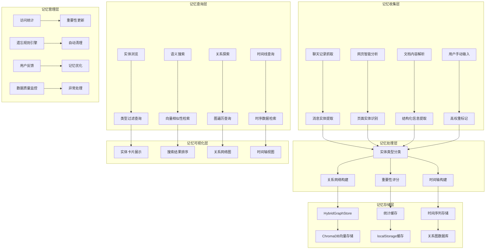
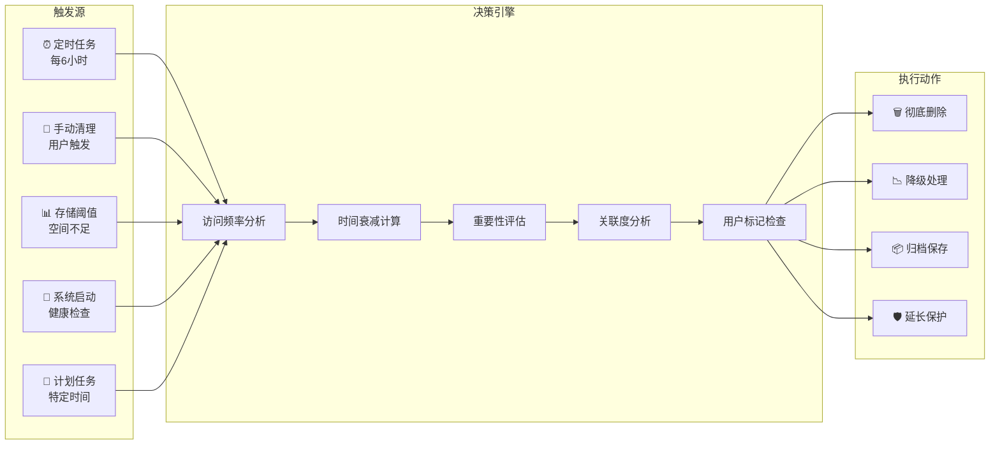

# 实体记忆系统 - 综合设计文档

*最后更新: 2024-12-20*

## 🧠 系统概述

实体记忆系统是类人脑项目分析系统的核心组件，负责智能收集、存储、管理和展示所有实体信息。该系统通过多维度的可视化界面，为用户提供直观的记忆查询和管理体验。

## 🎯 核心功能架构



## 📱 实体记忆查询界面设计

### 界面布局架构

基于已实现的`memory.tsx`和参考的HTML demo设计，界面包含以下主要区域：

```typescript
interface MemoryInterfaceLayout {
  sidebar: {
    logo: string;
    entityTypes: EntityTypeNav[];
    statistics: GlobalStats;
  };
  mainContent: {
    searchHeader: SearchControls;
    contentArea: DynamicView;
    actionButtons: QuickActions[];
  };
  overlays: {
    entityDetail: EntityDetailModal;
    editForm: QuickEditForm;
    notifications: NotificationToast[];
  };
}
```

### 实体类型导航

```typescript
interface EntityType {
  id: string;
  name: string;
  icon: string;
  count: number;
  color: string;
  description: string;
}

const ENTITY_TYPES: EntityType[] = [
  { id: 'overview', name: '首页概览', icon: '🏠', count: 0, color: '#60a5fa' },
  { id: 'timeline', name: '时间轴', icon: '⏰', count: 0, color: '#8b5cf6' },
  { id: 'Person', name: '人物', icon: '👥', count: 0, color: '#06b6d4' },
  { id: 'Project', name: '项目', icon: '🚀', count: 0, color: '#10b981' },
  { id: 'Task', name: '任务', icon: '📋', count: 0, color: '#f59e0b' },
  { id: 'Organization', name: '组织', icon: '🏢', count: 0, color: '#8b5cf6' },
  { id: 'Document', name: '文档', icon: '📄', count: 0, color: '#6366f1' },
  { id: 'Technology', name: '技术', icon: '🔧', count: 0, color: '#ec4899' },
  { id: 'Topic', name: '主题', icon: '💡', count: 0, color: '#14b8a6' }
];
```

### 核心视图类型

#### 1. 概览视图 (Overview)
- **功能**: 显示今日重点信息和AI推荐内容
- **组件**: 
  - 问候卡片：时间感知的个性化问候
  - 重点项目卡片：活跃项目快速预览
  - 热门主题讨论：高频讨论话题
  - 重要联系人动态：关键人员最新活动
  - AI推荐内容：智能推荐系统
  - 今日提醒事项：待办和日程
  - 最近浏览记录：网页浏览历史

#### 2. 时间轴视图 (Timeline)
- **功能**: 按时间顺序展示所有活动
- **数据源**: 消息、网页访问、文档更新、任务变更
- **交互**: 点击时间节点查看详情、按日期筛选

#### 3. 实体详情视图 (Entity Detail)
- **功能**: 显示特定类型的所有实体
- **布局**: 网格卡片布局，支持搜索和排序
- **操作**: 点击卡片查看详情、快速编辑、标记重要性

#### 4. 实体深度视图 (Entity Deep View)
- **功能**: 单个实体的完整信息展示
- **标签页**: 
  - 概览：基础信息和统计数据
  - 相关项目：关联的项目列表
  - 相关资源：文档、链接等资源
  - 相关任务：关联的Jira任务
  - 聊天记录：相关的聊天消息
  - 网页记录：相关的网页访问记录

## 🗄️ 存储架构设计

### 混合存储方案

```typescript
interface HybridStorageArchitecture {
  // 主要实体存储
  hybridGraphStore: {
    entities: GraphEntity[];
    relationships: EntityRelationship[];
    storage: 'local' | 'chroma';
    capabilities: ['CRUD', 'search', 'statistics'];
  };
  
  // 向量化内容存储
  chromaDB: {
    collections: ['messages', 'webpages', 'projects', 'documents'];
    embedding: 'openai' | 'sentence-transformers';
    indexing: 'HNSW' | 'IVF';
  };
  
  // 快速缓存
  localStorage: {
    entityStatistics: CachedStats;
    recentQueries: SearchHistory[];
    userPreferences: UserConfig;
    temporaryData: TempData[];
  };
  
  // 关系图存储
  relationshipStore: {
    nodes: EntityNode[];
    edges: EntityEdge[];
    algorithms: ['shortest_path', 'centrality', 'clustering'];
  };
}
```

### 数据模型定义

```typescript
interface GraphEntity {
  // 基础标识
  id: string;
  type: 'Person' | 'Project' | 'Task' | 'Organization' | 'Document' | 'Technology' | 'Topic';
  name: string;
  description?: string;
  
  // 时间信息
  created: number;
  updated: number;
  lastAccessed?: number;
  
  // 统计信息
  accessCount?: number;
  importance?: number; // 0-1评分
  
  // 元数据
  properties: Record<string, any>;
  tags?: string[];
  status?: string;
  avatarUrl?: string;
  
  // 动态关联统计（运行时计算）
  relatedMessagesCount?: number;
  relatedWebpagesCount?: number;
  relationshipsCount?: number;
}

interface EntityRelationship {
  id: string;
  sourceId: string;
  targetId: string;
  type: 'collaboration' | 'dependency' | 'mentions' | 'related_to';
  strength: number; // 0-1关系强度
  created: number;
  lastConfirmed: number;
  metadata: Record<string, any>;
}
```

### 统计缓存系统

```typescript
interface EntityStatisticsCache {
  // 全局统计
  globalStats: {
    entityCounts: Record<string, number>;
    totalEntities: number;
    totalRelationships: number;
    lastUpdated: number;
  };
  
  // 分类统计
  typeStats: Record<string, {
    count: number;
    topEntities: GraphEntity[];
    recentActivity: ActivityEvent[];
  }>;
  
  // 时间统计
  timeStats: {
    entitiesCreatedToday: number;
    entitiesCreatedThisWeek: number;
    entitiesCreatedThisMonth: number;
    accessPatternsDaily: Record<string, number>;
  };
  
  // 缓存管理
  cacheMetadata: {
    version: string;
    expirationTime: number;
    compressionLevel: number;
  };
}
```

## 🧹 记忆遗忘机制

### 遗忘触发方式



### 遗忘规则系统

```typescript
interface ForgettingRule {
  id: string;
  name: string;
  priority: number; // 1-10优先级
  condition: (memory: MemoryItem) => boolean;
  action: 'forget' | 'downgrade' | 'archive' | 'protect';
  description: string;
}

const DEFAULT_FORGETTING_RULES: ForgettingRule[] = [
  {
    id: 'expired-tasks',
    name: '已过期任务清理',
    priority: 9,
    condition: (memory) => {
      const isTask = memory.metadata.type === 'task';
      const isExpired = memory.metadata.expiryDate && 
                       Date.now() > memory.metadata.expiryDate;
      const expiredDays = isExpired ? 
        (Date.now() - memory.metadata.expiryDate) / (1000*60*60*24) : 0;
      return isTask && expiredDays > 30;
    },
    action: 'forget',
    description: '清理过期30天以上的任务记忆'
  },
  
  {
    id: 'low-importance-unused',
    name: '低重要性长期未用记忆',
    priority: 8,
    condition: (memory) => {
      const daysSinceAccess = (Date.now() - memory.lastAccessed) / (1000*60*60*24);
      const isLowImportance = memory.importance < 0.3;
      const isRarelyAccessed = memory.accessCount < 3;
      return daysSinceAccess > 90 && isLowImportance && isRarelyAccessed;
    },
    action: 'forget',
    description: '清理90天未访问的低重要性记忆'
  }
];
```

### 智能遗忘算法

```typescript
class IntelligentForgettingEngine {
  calculateForgettingScore(memory: MemoryItem): number {
    // 时间衰减因子
    const ageInDays = (Date.now() - memory.created) / (1000 * 60 * 60 * 24);
    const timeDecay = Math.exp(-ageInDays / 30); // 30天衰减常数
    
    // 访问频率因子
    const accessFrequency = memory.accessCount / Math.max(ageInDays, 1);
    const accessFactor = Math.min(accessFrequency * 10, 1);
    
    // 用户重要性因子
    const userImportance = memory.userImportance || 0;
    
    // 关联度因子
    const relationshipCount = memory.relationships?.length || 0;
    const relationshipFactor = Math.min(relationshipCount / 10, 1);
    
    // 综合评分 (越低越容易被遗忘)
    return (timeDecay * 0.3 + accessFactor * 0.3 + userImportance * 0.2 + relationshipFactor * 0.2);
  }
  
  async executeMemoryLifecycle(): Promise<LifecycleResult> {
    const memories = await this.getAllMemories();
    const results = {
      processed: 0,
      forgotten: 0,
      downgraded: 0,
      archived: 0,
      protected: 0
    };
    
    for (const memory of memories) {
      results.processed++;
      
      // 检查保护条件
      if (await this.isProtected(memory)) {
        results.protected++;
        continue;
      }
      
      // 应用遗忘规则
      const applicableRules = this.findApplicableRules(memory);
      if (applicableRules.length > 0) {
        const action = applicableRules[0].action; // 使用最高优先级规则
        
        switch (action) {
          case 'forget':
            await this.forgetMemory(memory);
            results.forgotten++;
            break;
          case 'downgrade':
            await this.downgradeMemory(memory);
            results.downgraded++;
            break;
          case 'archive':
            await this.archiveMemory(memory);
            results.archived++;
            break;
        }
      }
    }
    
    return results;
  }
}
```

## 🎨 记忆可视化展示

### 界面组件设计

#### 1. 实体卡片组件

```typescript
interface EntityCard {
  // 基础信息
  header: {
    avatar: string | ReactNode;
    title: string;
    subtitle: string;
    badges: Badge[];
  };
  
  // 内容区域
  content: {
    description: string;
    metadata: KeyValuePair[];
    statistics: StatisticItem[];
  };
  
  // 操作区域
  actions: {
    primary: Action[];
    secondary: Action[];
    contextMenu: MenuAction[];
  };
  
  // 状态信息
  state: {
    isHighlighted: boolean;
    isSelected: boolean;
    lastActivity: Date;
    importance: number;
  };
}
```

#### 2. 关系网络图

```typescript
interface RelationshipGraphConfig {
  layout: 'force' | 'circular' | 'hierarchical';
  nodeSize: 'uniform' | 'importance' | 'connections';
  edgeStyle: 'straight' | 'curved' | 'orthogonal';
  clustering: boolean;
  filters: {
    nodeTypes: string[];
    relationshipTypes: string[];
    minImportance: number;
  };
}

class RelationshipVisualizer {
  renderGraph(entities: GraphEntity[], relationships: EntityRelationship[]): ReactNode {
    return (
      <NetworkGraph
        nodes={entities.map(e => ({
          id: e.id,
          label: e.name,
          size: this.calculateNodeSize(e),
          color: this.getTypeColor(e.type),
          importance: e.importance
        }))}
        edges={relationships.map(r => ({
          source: r.sourceId,
          target: r.targetId,
          strength: r.strength,
          type: r.type
        }))}
        config={this.graphConfig}
        onNodeClick={this.handleNodeClick}
        onEdgeClick={this.handleEdgeClick}
      />
    );
  }
}
```

#### 3. 时间轴组件

```typescript
interface TimelineEvent {
  id: string;
  timestamp: number;
  type: 'entity_created' | 'entity_updated' | 'relationship_formed' | 'user_interaction';
  entityId: string;
  title: string;
  description: string;
  icon: string;
  metadata: Record<string, any>;
}

const TimelineVisualization: React.FC<{
  events: TimelineEvent[];
  groupBy: 'day' | 'week' | 'month';
  filter: TimelineFilter;
}> = ({ events, groupBy, filter }) => {
  const groupedEvents = useMemo(() => 
    groupEventsByTime(events, groupBy), [events, groupBy]
  );
  
  return (
    <div className="timeline-container">
      {groupedEvents.map(group => (
        <TimelineGroup
          key={group.period}
          period={group.period}
          events={group.events}
          onEventClick={handleEventClick}
        />
      ))}
    </div>
  );
};
```

### 数据可视化组件

#### 1. 统计仪表盘

```typescript
interface StatisticsDashboard {
  entityCounts: {
    chart: 'donut' | 'bar' | 'treemap';
    data: { type: string; count: number; percentage: number; }[];
  };
  
  activityTrends: {
    chart: 'line' | 'area';
    timeRange: 'week' | 'month' | 'quarter';
    data: { date: string; entities: number; relationships: number; }[];
  };
  
  importanceDistribution: {
    chart: 'histogram' | 'scatter';
    data: { entity: string; importance: number; accessCount: number; }[];
  };
  
  relationshipNetwork: {
    chart: 'network' | 'chord';
    data: { source: string; target: string; strength: number; }[];
  };
}
```

#### 2. 搜索结果展示

```typescript
interface SearchResultVisualization {
  // 结果排序方式
  sortBy: 'relevance' | 'importance' | 'recency' | 'type';
  
  // 展示格式
  displayFormat: 'cards' | 'list' | 'graph' | 'timeline';
  
  // 分组方式
  groupBy: 'type' | 'importance' | 'date' | 'project' | 'none';
  
  // 高亮配置
  highlighting: {
    searchTerms: boolean;
    relatedEntities: boolean;
    importance: boolean;
  };
}
```

## 🔧 未来功能规划

### 阶段1：高级查询功能 (Priority: High)

#### 1. 自然语言查询增强
```typescript
interface AdvancedQueryCapabilities {
  // 复杂查询语法
  complexQueries: {
    booleanOperators: ['AND', 'OR', 'NOT'];
    fieldSpecific: ['name:', 'type:', 'created:', 'tag:'];
    rangeQueries: ['created:2024-01-01..2024-12-31', 'importance:0.8..1.0'];
    fuzzySearch: ['name~"project"', 'description~"AI"'];
  };
  
  // 查询建议系统
  querySuggestions: {
    autoComplete: boolean;
    relatedQueries: string[];
    popularQueries: string[];
    queryHistory: string[];
  };
  
  // 高级筛选器
  advancedFilters: {
    timeRangeFilters: DateRangeFilter[];
    importanceRangeFilter: NumberRangeFilter;
    entityTypeMultiSelect: string[];
    tagBasedFiltering: TagFilter[];
    relationshipFiltering: RelationshipFilter[];
  };
}
```

#### 2. 智能查询扩展
- **查询意图理解**: 自动识别用户查询意图并提供相关建议
- **上下文感知搜索**: 基于当前浏览内容提供相关查询建议
- **多模态查询**: 支持图像、语音输入查询
- **查询历史智能**: 学习用户查询模式，提供个性化建议

### 阶段2：高级可视化功能 (Priority: High)

#### 1. 知识图谱3D可视化
```typescript
interface Knowledge3DGraph {
  // 3D渲染引擎
  renderer: 'threejs' | 'webgl' | 'css3d';
  
  // 节点布局算法
  layoutAlgorithms: [
    'force3d',        // 3D力导向布局
    'sphere',         // 球面布局
    'hierarchy3d',    // 3D层次布局
    'cluster3d'       // 3D聚类布局
  ];
  
  // 交互功能
  interactions: {
    nodeNavigation: boolean;
    pathHighlighting: boolean;
    clusterZoom: boolean;
    vrSupport: boolean;
  };
  
  // 视觉效果
  visualEffects: {
    particleSystem: boolean;
    animatedEdges: boolean;
    glowEffects: boolean;
    physicsSimulation: boolean;
  };
}
```

#### 2. 时空记忆地图
- **时间维度可视化**: 将记忆按时间轴和空间位置展示
- **记忆强度热力图**: 显示不同区域的记忆密度和重要性
- **记忆流动动画**: 展示记忆之间的关联和信息流动
- **虚拟现实记忆宫殿**: VR环境中的空间化记忆导航

### 阶段3：智能记忆管理 (Priority: Medium)

#### 1. 主动记忆整理
```typescript
interface ProactiveMemoryOrganization {
  // 自动分类系统
  autoClassification: {
    machineLearningModel: 'transformer' | 'cnn' | 'hybrid';
    confidenceThreshold: number;
    humanVerification: boolean;
    batchProcessing: boolean;
  };
  
  // 智能标签生成
  autoTagging: {
    extractionMethods: ['keyword', 'entity', 'topic', 'sentiment'];
    tagHierarchy: boolean;
    dynamicTags: boolean;
    userFeedbackLoop: boolean;
  };
  
  // 记忆去重
  duplicateDetection: {
    similarityThreshold: number;
    mergingSuggestions: boolean;
    conflictResolution: 'manual' | 'auto' | 'hybrid';
  };
}
```

#### 2. 预测性记忆推荐
- **遗忘风险预警**: 预测即将被遗忘的重要记忆
- **记忆关联发现**: 自动发现潜在的记忆关联
- **学习路径建议**: 基于记忆图谱推荐学习路径
- **知识缺口识别**: 发现知识结构中的空白区域

### 阶段4：协作记忆功能 (Priority: Medium)

#### 1. 团队记忆共享
```typescript
interface CollaborativeMemory {
  // 权限管理
  accessControl: {
    roleBasedAccess: Role[];
    entityLevelPermissions: Permission[];
    sharingMechanisms: ['direct', 'group', 'public'];
  };
  
  // 同步机制
  synchronization: {
    realTimeSync: boolean;
    conflictResolution: ConflictResolution;
    versionControl: boolean;
    mergeStrategies: MergeStrategy[];
  };
  
  // 协作特性
  collaboration: {
    commentSystem: boolean;
    annotationTools: boolean;
    collaborativeEditing: boolean;
    discussionThreads: boolean;
  };
}
```

#### 2. 集体智慧增强
- **众包标注**: 允许团队成员协作完善记忆信息
- **知识众筹**: 团队成员共同贡献领域知识
- **专家验证**: 领域专家验证记忆的准确性
- **群体智能决策**: 利用集体智慧优化记忆管理策略

### 阶段5：高级AI集成 (Priority: Low)

#### 1. 大语言模型深度集成
```typescript
interface AdvancedAIIntegration {
  // 多模型支持
  llmModels: {
    textAnalysis: 'gpt-4' | 'claude' | 'llama';
    codeAnalysis: 'codex' | 'codebert' | 'custom';
    multimodal: 'gpt-4v' | 'flamingo' | 'blip';
  };
  
  // 高级推理
  reasoningCapabilities: {
    causalReasoning: boolean;
    analogicalReasoning: boolean;
    temporalReasoning: boolean;
    spatialReasoning: boolean;
  };
  
  // 自动化任务
  automatedTasks: {
    memoryConsolidation: boolean;
    relationshipInference: boolean;
    importanceScoring: boolean;
    contentGeneration: boolean;
  };
}
```

#### 2. 记忆增强AI助手
- **智能对话系统**: 基于记忆内容的高质量对话AI
- **自动摘要生成**: 智能生成记忆内容摘要
- **个性化推荐**: 基于记忆模式的个性化内容推荐
- **创意启发引擎**: 利用记忆关联激发创意思维

## 📊 性能优化与监控

### 性能指标体系

```typescript
interface MemorySystemMetrics {
  // 查询性能
  queryPerformance: {
    averageResponseTime: number; // ms
    p95ResponseTime: number;
    queryThroughput: number; // queries/second
    cacheHitRate: number; // 0-1
  };
  
  // 存储效率
  storageEfficiency: {
    compressionRatio: number;
    indexSize: number; // bytes
    dataFreshness: number; // hours
    redundancyRate: number; // 0-1
  };
  
  // 用户体验
  userExperience: {
    interfaceResponseTime: number; // ms
    searchAccuracy: number; // 0-1
    userSatisfactionScore: number; // 1-5
    errorRate: number; // 0-1
  };
  
  // 系统健康
  systemHealth: {
    memoryUsage: number; // MB
    cpuUtilization: number; // 0-1
    diskIOPS: number;
    networkLatency: number; // ms
  };
}
```

### 自动化监控系统

```typescript
class MemorySystemMonitor {
  private metrics: MemorySystemMetrics;
  private alertThresholds: AlertThreshold[];
  
  async collectMetrics(): Promise<void> {
    // 收集各项性能指标
    this.metrics = {
      queryPerformance: await this.measureQueryPerformance(),
      storageEfficiency: await this.assessStorageEfficiency(),
      userExperience: await this.evaluateUserExperience(),
      systemHealth: await this.checkSystemHealth()
    };
  }
  
  async analyzePerformance(): Promise<PerformanceReport> {
    const issues = this.identifyPerformanceIssues();
    const recommendations = this.generateOptimizationRecommendations(issues);
    
    return {
      summary: this.generateSummary(),
      issues,
      recommendations,
      trend: this.analyzeTrend(),
      nextReviewDate: Date.now() + 24 * 60 * 60 * 1000 // 24小时后
    };
  }
}
```

## 🚀 技术实现路线图

### 第一阶段：基础功能完善 (已完成)
- ✅ 实体记忆查询界面基础版本 (`memory.tsx`)
- ✅ 混合图存储系统 (`HybridGraphStore.ts`)
- ✅ 实体统计缓存 (`EntityStatisticsCache.ts`)
- ✅ 基础记忆遗忘机制

### 第二阶段：高级查询与可视化 (2-4周)
- 🔄 自然语言查询增强
- 🔄 3D知识图谱可视化
- 🔄 高级筛选和搜索功能
- 🔄 时空记忆地图

### 第三阶段：智能记忆管理 (4-6周)
- ⏳ 主动记忆整理系统
- ⏳ 预测性记忆推荐
- ⏳ 高级AI模型集成
- ⏳ 性能监控和优化

### 第四阶段：协作功能 (6-8周)
- ⏳ 团队记忆共享
- ⏳ 集体智慧增强
- ⏳ 多用户协作编辑
- ⏳ 企业级权限管理

## 🎯 成功指标

### 技术指标
- **查询响应时间**: < 200ms (P95)
- **存储压缩率**: > 70%
- **缓存命中率**: > 85%
- **系统可用性**: > 99.9%

### 用户体验指标
- **搜索准确率**: > 90%
- **用户满意度**: > 4.5/5
- **日活跃查询**: > 50次/用户
- **功能采用率**: > 80%

### 业务指标
- **记忆利用率**: > 75%
- **知识发现率**: > 30%/月
- **协作效率提升**: > 40%
- **决策支持价值**: > 60%改进率

---

*本文档整合了实体记忆系统的完整设计，包括已实现功能、存储架构、遗忘机制、可视化设计和未来功能规划，为系统的持续发展提供了清晰的技术路线。*
