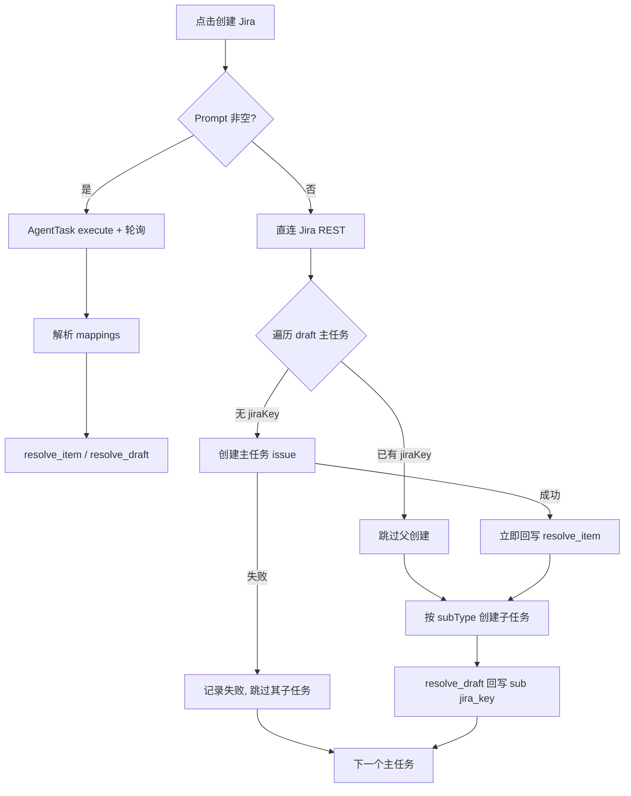

# Personal Roadmap 与重点项目记忆联动

静态交互原型（纯前端、无真实 Jira / 扩展）：[`docs/demo/roadmap-demo.html`](../demo/roadmap-demo.html)。Options → 功能 Demo →「项目 Roadmap（静态 Demo）」会打开打包进扩展的同款页面。

## 产品边界

Roadmap 是团队共享的意图声明（排期 / Epic / 草稿任务）。记忆系统是个人私有的现实观察。用户把 Epic 拖进 Gantt = 声明「这是我的重点项目」；记忆系统据此做消息打标、反思与 dreaming，并在 Roadmap 页用个人图层角标报告意图与现实的偏差。系统**绝不自动改团队 bar**。

## 大白话运行逻辑

1. 用户在 Roadmap 站点维护团队排期（Jira 导入进 Backlog，拖进 Gantt 才算重点）。
2. 装了 Personal AI 扩展、且在该团队有过写操作的用户，扩展会把 **当前 Gantt 上的主任务** 同步到记忆服务（按团队覆盖，不是追加）。
3. 消息分析把这些重点项目当成系统观察规则：命中只入库，**不发 Glip/Chrome 通知**。
4. 高影响事件（日期变动等）抽成时间线，写双时态属性，并在 Roadmap bar 上出个人层角标；用户可「按此更新」或「忽略」，也可因 bar 收敛到建议日期而自动消除。
5. 自我反思 / dreaming / 召回以 focus project 为锚点，但有多团队预算公平与 alias 短名压缩，避免 prompt 过载。

## 数据分层

| 层 | 存放 | 可见性 |
|---|---|---|
| 团队层 | roadmap-service（SQLite）Team/Item/Sub/排期/alias/draft/activity_log | 分享链接协作者 |
| 个人层 | memory-service watched_projects + drift receipts；扩展 storage | 仅本人；content script 注入 |

## 手动 Backlog 条目与 draft 生命周期

不是所有要排期的事都已经在 Jira 里。Backlog 顶部的「+ 新建条目」可以直接建一条**手动条目**（title / 类型 / quarter / 预估周数，预估可留空显示 `—`），拖进 Gantt 就以 draft 状态参与排期，不需要先去 Jira 开单。

### 判据只有一条：`jiraKey === null`

**`source` 不是 draft 判据**。导入进来的行 `source='jira'`，手动建的行 `source='manual'` 且永远不变——包括它的 Jira issue 已经建好之后。所有端一律看 `jiraKey`：

| 端 | 表达式 |
|---|---|
| roadmap-service | `listFocusItems()` 的 `isDraft: !jiraKey` |
| web（Backlog / Gantt / 创建弹窗） | `isDraftItem(item)` = `!item.jiraKey` |
| 扩展 | 页面送来 `jiraKey` 就看它；旧版页面包完全不带该字段时退回「key 以 `LOCAL-` 开头」 |
| memory-service | `isDraft && !jiraKey` |

四种状态对齐结果：导入的 Jira 条目 = 非 draft；新建手动条目 = draft；手动条目回填真实 key 后 = 非 draft；旧页面包（不送 `jiraKey`）= 除 `LOCAL-` 外都不是 draft。

### 合成 key 永不变更

手动条目拿到一个永久的 `LOCAL-<nanoid8>` 作为 `items.key`，真实 key 只写进 `jira_key`，界面上显示 `jira_key || key`。这条是硬约束：`items.key` 被 `subs.item_key`、URL 的 `expand=` 和 memory 侧 id `roadmap-{teamId}-{slug(key)}` 依赖，改名会让 memory 新建一个项目并 archive 掉旧的，丢掉全部连续性。

### 三个新 intent

| op | 语义 | OCC |
|---|---|---|
| `add_item` | 新建手动 backlog 条目，类型 / project 默认取 JQL 识别结果 | 无（新建无冲突） |
| `delete_item` | 只允许删 `source='manual'` 且 `jira_key IS NULL` 的条目，否则报 `item_has_jira` | 无 |
| `resolve_item` | 回填 `jira_key`（顺带校正 type / projectKey） | **刻意不做版本校验** |

`resolve_item` 不校验版本，是因为发它的时候 Jira issue 已经真的建出来了：用户在创建期间拖一下 bar 就让回填失败的话，key 会永久丢失。`resolve_item` 与 `resolve_draft` 都是幂等的——重复写同一个 mapping 不会二次 bump version，也不会写第二条 activity（创建弹窗与扩展会各写一次子任务 mapping）。

### 边界

- **删除保护**：`jira_key` 已回填的条目不能从 Roadmap 删，只能 unschedule 退回 Backlog（Jira 上有真 issue 了）。
- **覆盖导入不碰手动项**：覆盖删除限定 `source='jira'`，孤儿 subs 清理同理。
- **导入按 `jira_key` 去重**：手动条目建成 `NOVA-123` 后下次 JQL 会命中它，import 先按 `jira_key` 找到原行就地更新（顺便把 `source` 升级为 `jira`），不会多插一行。
- **cleanup 语义**：过期 draft 主任务和普通 Epic 一样退回 Backlog；退回后它会从 memory focus 里被 archive，这是预期行为。
- **无扩展也能用**：新建条目、拖拽只需要 edit token；只有「创建 Jira」依赖扩展。

### draft 的 memory-only 边界

draft 同步进 memory 时 `externalRef.jiraKey` 写 `null`、`isDraft: true`。合成 key **不进 aliases**——`LOCAL-xxx` 永远不可能出现在聊天消息里，只会污染匹配和规则文本，draft 用 title / alias / displayName 匹配。`buildFocusProjectWatchRules` 对 draft 去掉 `[key]` 前缀和「exact Jira key first」指令，改为纯 alias/keyword 匹配。回填真实 key 后下次 sync 会把它加进 aliases，而 id 因 `key` 不变保持稳定。draft 和普通 focus project 一样是**只入库不通知**。

## 从 JQL 识别层级

`roadmap-service/src/core/JqlIntrospect.ts` 在服务端解析团队 JQL，结果随 snapshot 的 `team.jqlHints` 下发，前端与扩展共用一套：

- 先剥掉单引号包裹的子串——真实 JQL 会把整条子查询嵌在 `portfolioChildrenOf('project = INIT AND …')` 里，内层的 `project` / `issuetype` 描述的是父层，不是要导入的行
- 再匹配外层 `issuetype = / in (...)` 与 `project = ...`
- 兜底顺序：JQL 解析 → 已导入 items 的 `type` 众数 → `Epic` 且 `confident: false`

`confident: false` 或 `projectKey` 为空时，创建弹窗显示「未能从 JQL 识别…请手动填写」，字段可编辑，不静默猜。

## 创建 Jira（直连 API / Agent 执行器双路径）

Gantt 上的 draft 主任务和 draft 子任务，点「创建 Jira」打开同一弹窗。模式由 **Prompt 是否为空** 决定（无独立开关）：

| Prompt | 路径 | 行为 |
|---|---|---|
| 留空 | 直连 API | 扩展用 Options `JIRA_API_TOKEN` 调 Jira REST；字段必填（Project / 类型） |
| 非空 | Agent 执行器 | 扩展组装任务文本 → memory-service `POST /agent-tasks/execute`（异步接单）→ 轮询 `runtime-status` → 解析 artifact `mappings` 后 `resolve_item` / `resolve_draft` |

交互对齐 `docs/demo/roadmap-demo.html`：

- 标题旁徽标实时切换：`直连 API` ↔ `AGENT 执行器`
- Agent 模式显示执行器 chip（当前 fallback：`openClawEnabled` 时出现 OpenClaw）；无配置时引导打开插件 Options
- 字段两模式共享；Agent 模式下空字段 placeholder 为「自动 · 由 Agent 决定」，已填值作为硬约束下发
- Prompt 草稿按团队写入本机 `localStorage`（`personalroadmap.aiPrompt:<teamId>`）；关闭弹窗再打开会恢复
- 用户**执行创建**且 Prompt 非空时，写入团队配置 `team.createJiraPrompt`，其他协作者打开弹窗（本机无草稿时）也能看到
- 执行器选择写入 `localStorage`（`personalroadmap.aiExecutor`）

### fixVersion 自动填

团队配置了发布时间表后，按各行 **Target End**（或 `start + days - 1`）经 `catchRelease` 匹配最近 Pro release：

- 全部落同一 release → 字段直接填入
- 跨 release → 字段留空 + 列表逐行绿色 chip；用户输入固定值覆盖全部
- 插件侧 `buildJiraCreateFields` 写 `fixVersions`：exact → **唯一后缀匹配**（解决表里 `26.3.220` vs Jira `Nova 26.3.220`）；歧义/无匹配则丢字段并带回 warning，不阻断创建

Sprint：直连 v1 不写（需 Agile API）；Agent 模式未填时由执行器查当前 sprint。

### Assignee 映射（系统名 → Jira 实名）

创建弹窗有 **Assignee** 汇总条与「配置映射…」。映射按团队存 `teams.assignee_map_json`（协作方共享）：

- 人员全集 = 当前用户 ∪ 团队成员 ∪ 子任务 Owner ∪ 草稿 `createdBy`
- Owner 优先；无 Owner 回落创建人；本地自建未记名再回落当前用户
- **直连 API**：实名转 `firstname.lastname` 写入 `fields.assignee.name`；未映射则留空，不阻塞创建
- **Agent 模式**：前端组装完整 Prompt（用户 Prompt + 字段约束 + 映射表 + 任务清单），扩展只追加结果契约
- 全站展示名走 `dispName()`（选人浮层、人员视图、创建者灰字、协作 ticker）；存储仍用系统名

### 甘特体验（与 demo 对齐）

- 草稿创建者：条上仅 `DRAFT`；协作方创建的子任务 hover 时左侧浮现灰色 `xxx created`
- 新建子任务默认今天起 14 天（贴齐时间轴末端）
- 选人浮层：搜索置顶、打开即聚焦、列表限高滚动、键盘导航、视口不够时向上翻转
- 导入 Task：`importedTaskSpan` 兜底（双端齐全按 Target；都缺则同主任务；只一端则两周并钳制进主任务范围）
- 打开 Jira：hover 左上 ↗，或 ⌘/Ctrl+单击；base URL 来自服务端 `JIRA_BASE_URL`
- 子任务（含已导入）可单独 × 从 Roadmap 移除，需要时可再导入

### 两阶段回写（直连路径）

弹窗按主/子任务分组展示，逐行回显状态。

主任务成功后**立刻**单独发 `resolve_item`，不等子任务：否则子任务失败后重试会重复建父 issue。一行失败不会中断整批，每行各自回显 key 或错误。Agent 路径按 parent 组一个 task，idempotencyKey = `roadmap_create:{teamId}:{sorted draftIds}`，重复点击复用同一 run。

### 类型与链接字段映射

| 主任务类型 | 子任务类型 | 链接字段 |
|---|---|---|
| `Initiative` / `INIT` | `Epic` | `customfield_15751`（Parent Link） |
| `Epic` | `Task` | `customfield_11450`（Epic Link） |
| `Task` / `Story` / `User Story` / `Bug` / 其他 | 该 project 下 `subtask: true` 的真实类型 | `parent: { key }` |

最后一行的子任务类型名各 Jira 实例不同（`Sub-task` / `Subtask` / `子任务`），所以**不硬编码**：后端对这一档直接下发 `subType: null`，弹窗的子任务类型允许留空并提示「留空时扩展会用该项目实际的子任务类型」，由扩展查 `/rest/api/2/issue/createmeta?projectKeys=X&expand=projects.issuetypes.fields` 解析。createmeta 拿不到时报明确错误，让用户手填，而不是拿空类型名去撞 Jira 的 400。

### 写入字段（直连）

- 通用：`summary`、`issuetype`、`project`
- `customfield_18350` / `customfield_18351` ← Target start / end
- `customfield_21998` ← `item.quarter`（仅当该 project 的 createmeta 里存在此字段，且值能匹配上 allowedValues）
- `fixVersions` ← 弹窗建议/覆盖的 release name（createmeta 门控 + 后缀匹配）
- `assignee` ← 子任务 Owner（经团队映射表）转成的 `firstname.lastname`；未映射则不发
- **创建 Epic 必须带 `customfield_11451`（Epic Name）**，否则 Jira Server 直接 400
- 子任务：按上表填 `linkField` 或 `parent`

createmeta 不可用时只发 Epic Name（Jira 强制要求的那个），其余可选字段一律不发——一个该 project 不支持的字段 id 会让 Jira 拒掉整次创建。

创建编排在扩展 / memory-service；Assignee 映射与 Prompt 组装在 roadmap-service 页面与团队配置中完成。

## 数据库迁移

`items` 表加了 `source` / `jira_key` / `project_key` 三列。远端已有真实数据，所以走幂等 `ALTER TABLE`（按 `PRAGMA table_info(items)` 判断）并记进 `_migrations`，不重建库。

**顺序约束**：`Database.ts` 是先 `db.exec(schema.sql)` 再跑迁移。所以 `schema.sql` 里**不能**出现引用新列的索引——已有部署还没 ALTER 过，启动时就会崩。`idx_items_jira_key` 因此由迁移 `003` 创建而不是写在 `schema.sql` 里。`schema.sql` 只负责让全新库一次到位，迁移负责把老库补齐。

## 关键 API

### roadmap-service `:3220`

- `GET/POST /api/v1/teams`
- `GET /api/v1/teams/:id`
- `GET /api/v1/teams/:id/focus-items`
- `POST /api/v1/teams/:id/intents`（需 share token）
- `POST /api/v1/teams/:id/share`
- `GET /api/v1/teams/:id/activity`
- `GET /api/v1/teams/:id/events`（SSE）

### memory-service

- `POST /api/v1/projects/watched/sync` — 按 `teamId` 权威快照覆盖（由 **扩展 background** 代发，content script 不再直连 memory-service，避免宿主页 CORS）
- `POST /api/v1/projects/watched/archive-team`
- `GET /api/v1/projects/focus` — 含 row/paragraph/seed 三种上下文

## 分享两档

- 地址栏复制：只读（encode team/q/view/expand）；`expand` 是**本机视图状态**，展开/收起会 `replaceState` 更新地址栏，刷新可还原
- 右上角分享：带 token 的可编辑链接（分享前同步当前 `expand`/q/view）；匿名 name 可冒充，审计记 client_id
- **展开状态不同步多人**：SSE 快照不覆盖本机 expand；服务端 `expand`/`collapse` intent 为 no-op（兼容旧客户端）
- 顶栏 SyncTicker 只展示其他人的最新 activity；点击打开活动日志
- 可编辑只看本机是否有该团队 edit token（与是否安装扩展无关）
- 分享复制：优先 `navigator.clipboard`；在 `http://IP:端口` 等非安全上下文走 `textarea` + `execCommand('copy')`；仍失败则 toast + `prompt` 展示完整链接，不再与「无编辑权限」混报

## 扩展桥

`contentScriptRoadmap` 按 Options `ROADMAP_BASE_URL`（及内置 roadmap 域名）注入：身份、focus sync、JQL 导入 / 创建 Jira（直连 + Agent）/ AI 缩写代理。Token 不出个人域。Focus sync / memory candidates / drift / agent runtime 一律经 `ROADMAP_MEMORY_REQUEST` 由 background 调 memory-service；与 Target 回写（同源 `sync-target`）是两条独立链路。

默认站点 `http://roadmap.xmnup.com`（`.env` / `ROADMAP_BASE_URL`）。**Options 里改地址只改 Popup 打开的入口**；身份自动注入依赖 content script 是否匹配当前 origin。静态匹配含 `roadmap.xmnup.com` 与本地/旧 IP；自定义域名在保存 Options 后由 background 动态 `registerContentScripts`。改域名后需**重新加载扩展并刷新 Roadmap 页**，否则仍会弹出「输入名字」。

页面与扩展之间用 `window.postMessage` 通信：

- `pai-roadmap-import-jql` / `-ack` / `-result`
- `pai-roadmap-create-jira` / `-ack` / `-result`（直连）
- `pai-roadmap-agent-create` / `-ack` / `-result`（Agent；超时约 11 分钟）
- `pai-roadmap-agent-executors` / `-ack` / `-result`
- `pai-roadmap-open-options` / `-ack` / `-result`

内容脚本收到请求会**先回一条 ack**，页面 4 秒内收不到 ack 就直接报「扩展未接收请求，请重新加载扩展后刷新本页」。

**Jira REST 一律由 service worker 代发**：MV3 下内容脚本的 fetch 仍受宿主页面的 CORS 约束，roadmap 页面（`localhost:3220` 等）直连 `jira.ringcentral.com` 会在请求发出前被拦掉，表现为「有 loading、没有网络请求」。所以内容脚本走 `jiraFetchViaBackground()` → `PERSONAL_AI_JIRA_PROXY_FETCH` → background `handleJiraProxyFetch()`，代理只允许打到当前配置的 Jira origin，Token 只在扩展上下文里解析。排查时看扩展 service worker 的 Network/Console，而不是页面的 Network 面板。

Agent 路径走 memory-service（内容脚本已有的 `MemoryServiceClient`）：`executeAgentTask` + `getAgentTaskRuntimeStatus`；Jira token **不**交给 Agent。

## 导入 Quarters

- JQL **含** `"Target Delivery Quarter" in (...)` 时显示 quarters 勾选；导入按钮文案固定为「导入 Backlog」
- JQL **不含**该字段时不显示 quarters 勾选，只显示「导入 Backlog」；实际执行原 JQL，不再自动附加 quarter 子句
- 「覆盖已有数据」只在导入栏勾一次；预览弹窗直接按这个开关渲染要导入的 quarters 与实际 JQL，不再要求二次勾选
- 未勾选＝增量模式，只导入 `checkedQuarters` 里还没导过的 quarter（无 quarter 字段时按整份 JQL 增量去重）
- 勾选＝覆盖模式：有 quarter 时按 `checkedQuarters` 全量重拉并 `DELETE` 对应 quarter 的 jira items；无 quarter 字段时清除该团队全部 `source='jira'` 行（手动条目保留）

## Owner、人员视图与清理记忆

- 新增子任务默认 **14 天**，Owner 可选：标题 `@` 建议、左侧头像点选、手输新名（自动进成员表）。Enter 不设 Owner 也可创建。
- 双击子任务条可改备注名，并点头像更换/移除 Owner；`update_sub` 保留 draft / Jira key 身份（拖拽不再 delete+add）。
- 人员视图：近 2 周 / 全部、并行车道堆叠、窗口外「更早/更晚」角标；双击成员名 `update_member`（级联改所有 sub.owner）。
- 清理过期：Epic 回退 Backlog；未过期 Epic 下的过期子任务 `cleared=1`（Gantt/人员视图隐藏，Backlog 仍计「↺ n 个子任务记录」）。Epic 再次拖入 Gantt（`schedule`）时清空 `cleared` 还原。

## 阶段节点与外部依赖（Markers）

主任务统一用 **Marker** 体系：`phase`（Design/Stage/Production/自定义，必有日期）与 `dep`（外部依赖，ETA 可空）。有日期的落在 bar 下方标记轨；缺 ETA 的 dep 在 bar 右上角红色脉动 `🔗N` 角标提醒。右侧 ◆＋ 添加入口。ETA 可通过扩展 `pai-roadmap-fetch-issue-dates` 从 Jira Target End 读取。Epic 退回 Backlog 时 markers 保留。拖动 marker 可改日期（`update_marker`）。

## Expand 是本机视图状态

展开/收起**不同步多人**（否则会打断他人正在加子任务）：

- 前端本地 `expandedKeys` + URL `expand=`（`history.replaceState`）；刷新按地址栏还原
- SSE 快照到达时用本机 expand 覆盖展示，忽略服务端 `items.expanded`
- 服务端 `expand` / `collapse` intent 为 no-op（兼容旧客户端，不 bump version、不广播）
- 右上角分享可编辑链接前会 `syncUrl()`，带上当前 expand/q/view

## 协作 Presence 与同步 Ticker

- 顶栏头像逐个 `data-tip` 显示用户名（自己加「（你）」）；LIVE pill 保留整体说明
- `SyncTicker`：头像左侧展示**其他成员**最新一条 activity（过滤自己 + `lock/unlock/expand/collapse`），新日志滚入动画；点击打开 ActivityDrawer
- 取数纯函数：`pickTickerEntry` / `tickerLabel`（`useRoadmapContract.ts`）

## 导入 Task 与拖动回写 Target（扩展优先）

| 能力 | 凭据优先级 | 展示 / 行为 |
|---|---|---|
| **导入 Task** | **仅**扩展 Options `JIRA_API_TOKEN`（`authMode: token-only`） | 任务视图 + **已安装扩展** + 甘特上有 Jira Epic 才显示；无扩展隐藏。扩展搜 Task → `POST /import-tasks` 带 `tasks[]` 落库去重 |
| **拖动回写 Target** | ① 扩展 Options token → ② 服务端 `JIRA_PAT` → ③ 皆无则**静默** | 排期/拖动/伸缩成功后前端 1.5s 防抖：先 `pai-roadmap-update-target-dates`，成功则 `POST /sync-target` `mode=confirm`；无 token/无扩展/失败则 `mode=queue` 走服务端；服务端未配置也不 toast |

注意：Jira 侧修改人是 Options token 属主或服务端 PAT 属主；activity 里的 actor 仍是触发拖动的用户。不回写子任务日期；不做 Jira→Roadmap 反向日期合并。`team.jiraEnabled` 只表示 PAT fallback 是否可用，**不再**控制「导入 Task」按钮。

## 发布时间表标尺（Release Train Ruler）

团队可在「编辑团队 JQL」弹窗配置 Google Sheet 发布时间表（三列 `Release / Phase / Date`）。保存后甘特主标尺从「月份 + 周刻度」换成**发布 Sprint 双轴**：Sprint 段为主轴，月份降为细行副轴。

### 配置与存储

| 字段 | 存哪 | 说明 |
|---|---|---|
| `url` / `spreadsheetId` / `sheetName` / `range` | `teams.release_sheet_json`（团队共享） | 与 JQL 一样走 intent 落库 |
| `splitPhase` / `showPhases` | 同上 | ⚑ 分割节点 + 勾选展示阶段 |
| `releaseFilter` `{ mode, pattern }` | 同上 | `all` / `major`（尾号 0）/ `custom`（通配符或 `/正则/`） |
| `rows` / `fetchedAt` | 同上（缓存） | 保存时写入；TTL≈6h 后有编辑权客户端静默刷新 |
| Apps Script `token` | **前端写死** | 与 RPA sheet reader 同源 Web App，不入库 |

Intent：`update_jql` 可顺带带 `releaseSheet`；独立 `update_release_sheet` 用于清除 / 静默刷新。

### 前端行为要点

- 地址/表名/范围变化后 600ms 防抖自动读取；未加载就保存会兜底拉取，默认 FF 分界 + 全阶段展示
- 阶段 chips：点主体切换展示，点 ⚑ 设分割节点；分割节点勾选锁定
- Release 过滤：全部 / 仅大版本 / 自定义通配符；实时预览保留与划线过滤名单；非法正则或滤空则兜底不过滤
- 过滤作用于分段、刻度、竖线与「可赶 Sprint」；阶段 chips / 数据预览仍看全量表
- 工具栏 `Sprint | 月份` 开关仅会话级（`rulerMode`），不改团队配置、刷新恢复 Sprint
- 「可赶 Sprint」提示（bar tooltip / 拖拽浮签）走**过滤后**数据口径，临时切月份仍保留
- 人员视图不显示标尺开关与阶段图例

静态交互参考：[`docs/demo/roadmap-demo.html`](../demo/roadmap-demo.html)。

## 决策逻辑优先级（注入）

1. 只取 `tier=focus`（在 Gantt 上的主任务）
2. 多团队预算：每团队保底 1–2 槽，剩余按 priority
3. priority 信号：alias > 子任务活动 > 近 7 天编辑 > 当月交集
4. 消息分析用行视图；反思用段视图；dreaming/召回用种子

## 源码入口

- `roadmap-service/`（`src/core/JqlIntrospect.ts`、`JiraClient.ts`、`TargetSync.ts`、`src/storage/Database.ts` 的迁移表）
- `roadmap-service/web/src/composables/useRoadmapContract.ts`（draft 判据、state 消息、创建 payload、ticker）
- `roadmap-service/web/src/composables/useExtensionBridge.ts`（直连 / Agent create bridge）
- `roadmap-service/web/src/components/modals/AiCreateModal.vue`（双路径创建弹窗）
- `roadmap-service/web/src/composables/useReleaseRuler.ts`（发布时间表解析 / 分段 / 拉取 / catchRelease）
- `roadmap-service/web/src/components/SyncTicker.vue`
- `src/contentScriptRoadmap.ts`、`src/roadmapFocusContract.ts`、`src/jiraCreateMeta.ts`
- `src/watchRules.ts`（`source: 'project'`）
- `memory-service/src/core/FocusProjectSyncService.ts`
- `memory-service/src/core/FocusProjectContextBuilder.ts`
- `memory-service/src/core/ProjectTimelineExtractor.ts`
- `src/modals/components/MemoryEntryRulesPage.vue`
- Popup「项目 Roadmap」→ `ROADMAP_BASE_URL`

## 验证

- 扩展入口：`npm start` + Playwright / 手动打开 popup
- roadmap-service：`cd roadmap-service && npx vitest run`（含 JiraClient mock、Target 防抖回写、import-tasks 去重、ticker 过滤、markers、expand no-op）
- 页面↔扩展↔memory 接缝：`npm run verify:roadmap-focus-contract`（页面构造的 state 消息必须能被扩展读到；`team`/`teamId` 那次改名就是在这里漏掉的）
- Jira 创建 payload：`npm run verify:roadmap-jira-create-fields`（三档层级的 issuetype / 链接字段 / Epic Name / fixVersions 后缀匹配 / createmeta 不支持的字段必须缺席——生产 Jira 上没法试错）
- Roadmap 契约：`roadmap-service/web` 下 `npm test -- roadmapContract`（含 fixVersion 透传）
- 线上 draft → memory：`npm run verify:roadmap-draft-focus:e2e`（打真实服务，只读 roadmap、按团队覆盖写 memory）
- 部署后：导入 Task / 创建 Jira 依赖扩展 Options `JIRA_API_TOKEN`；拖动回写在无扩展或未填 Options token 时可 fallback 到服务器 `roadmap-service/.env` 的 `JIRA_PAT`（见 `.env.example`）
- memory-service：`npm --prefix memory-service run build` + `npx vitest run src/__tests__/focusProjectSyncService.test.ts src/__tests__/api-projects.test.ts`
- 部署：`npm run deploy:roadmap`（仅 roadmap-service；本地 build 后 rsync + 远端 docker compose，默认 `10.32.56.212:3220`）。若同时改 memory，用 `npm run deploy:memory`（两者一起发）
- focus sync / 抽取：`evals/cases/roadmap-focus-projects/`
