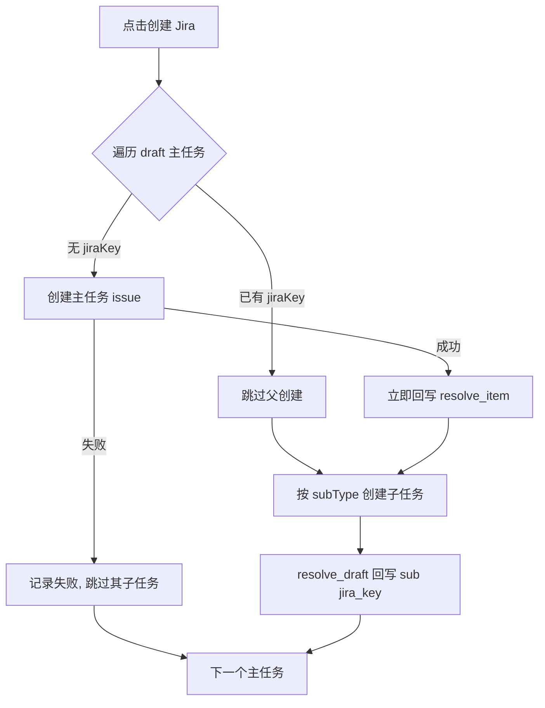

# Personal Roadmap 与重点项目记忆联动

## 产品边界

Roadmap 是团队共享的意图声明（排期 / Epic / 草稿任务）。记忆系统是个人私有的现实观察。用户把 Epic 拖进 Gantt = 声明「这是我的重点项目」；记忆系统据此做消息打标、反思与 dreaming，并在 Roadmap 页用个人图层角标报告意图与现实的偏差。系统**绝不自动改团队 bar**。

## 大白话运行逻辑

1. 用户在 Roadmap 站点维护团队排期（Jira 导入进 Backlog，拖进 Gantt 才算重点）。
2. 装了 Personal AI 扩展、且在该团队有过写操作的用户，扩展会把 **当前 Gantt 上的主任务** 同步到记忆服务（按团队覆盖，不是追加）。
3. 消息分析把这些重点项目当成系统观察规则：命中只入库，**不发 Glip/Chrome 通知**。
4. 高影响事件（日期变动等）抽成时间线，写双时态属性，并在 Roadmap bar 上出个人层角标；用户可「按此更新」或「忽略」，也可因 bar 收敛到建议日期而自动消除。
5. 自我反思 / dreaming / 召回以 focus project 为锚点，但有多团队预算公平与 alias 短名压缩，避免 prompt 过载。

## 数据分层

| 层 | 存放 | 可见性 |
|---|---|---|
| 团队层 | roadmap-service（SQLite）Team/Item/Sub/排期/alias/draft/activity_log | 分享链接协作者 |
| 个人层 | memory-service watched_projects + drift receipts；扩展 storage | 仅本人；content script 注入 |

## 手动 Backlog 条目与 draft 生命周期

不是所有要排期的事都已经在 Jira 里。Backlog 顶部的「+ 新建条目」可以直接建一条**手动条目**（title / 类型 / quarter / 预估周数，预估可留空显示 `—`），拖进 Gantt 就以 draft 状态参与排期，不需要先去 Jira 开单。

### 判据只有一条：`jiraKey === null`

**`source` 不是 draft 判据**。导入进来的行 `source='jira'`，手动建的行 `source='manual'` 且永远不变——包括它的 Jira issue 已经建好之后。所有端一律看 `jiraKey`：

| 端 | 表达式 |
|---|---|
| roadmap-service | `listFocusItems()` 的 `isDraft: !jiraKey` |
| web（Backlog / Gantt / 创建弹窗） | `isDraftItem(item)` = `!item.jiraKey` |
| 扩展 | 页面送来 `jiraKey` 就看它；旧版页面包完全不带该字段时退回「key 以 `LOCAL-` 开头」 |
| memory-service | `isDraft && !jiraKey` |

四种状态对齐结果：导入的 Jira 条目 = 非 draft；新建手动条目 = draft；手动条目回填真实 key 后 = 非 draft；旧页面包（不送 `jiraKey`）= 除 `LOCAL-` 外都不是 draft。

### 合成 key 永不变更

手动条目拿到一个永久的 `LOCAL-<nanoid8>` 作为 `items.key`，真实 key 只写进 `jira_key`，界面上显示 `jira_key || key`。这条是硬约束：`items.key` 被 `subs.item_key`、URL 的 `expand=` 和 memory 侧 id `roadmap-{teamId}-{slug(key)}` 依赖，改名会让 memory 新建一个项目并 archive 掉旧的，丢掉全部连续性。

### 三个新 intent

| op | 语义 | OCC |
|---|---|---|
| `add_item` | 新建手动 backlog 条目，类型 / project 默认取 JQL 识别结果 | 无（新建无冲突） |
| `delete_item` | 只允许删 `source='manual'` 且 `jira_key IS NULL` 的条目，否则报 `item_has_jira` | 无 |
| `resolve_item` | 回填 `jira_key`（顺带校正 type / projectKey） | **刻意不做版本校验** |

`resolve_item` 不校验版本，是因为发它的时候 Jira issue 已经真的建出来了：用户在创建期间拖一下 bar 就让回填失败的话，key 会永久丢失。`resolve_item` 与 `resolve_draft` 都是幂等的——重复写同一个 mapping 不会二次 bump version，也不会写第二条 activity（创建弹窗与扩展会各写一次子任务 mapping）。

### 边界

- **删除保护**：`jira_key` 已回填的条目不能从 Roadmap 删，只能 unschedule 退回 Backlog（Jira 上有真 issue 了）。
- **覆盖导入不碰手动项**：覆盖删除限定 `source='jira'`，孤儿 subs 清理同理。
- **导入按 `jira_key` 去重**：手动条目建成 `NOVA-123` 后下次 JQL 会命中它，import 先按 `jira_key` 找到原行就地更新（顺便把 `source` 升级为 `jira`），不会多插一行。
- **cleanup 语义**：过期 draft 主任务和普通 Epic 一样退回 Backlog；退回后它会从 memory focus 里被 archive，这是预期行为。
- **无扩展也能用**：新建条目、拖拽只需要 edit token；只有「创建 Jira」依赖扩展。

### draft 的 memory-only 边界

draft 同步进 memory 时 `externalRef.jiraKey` 写 `null`、`isDraft: true`。合成 key **不进 aliases**——`LOCAL-xxx` 永远不可能出现在聊天消息里，只会污染匹配和规则文本，draft 用 title / alias / displayName 匹配。`buildFocusProjectWatchRules` 对 draft 去掉 `[key]` 前缀和「exact Jira key first」指令，改为纯 alias/keyword 匹配。回填真实 key 后下次 sync 会把它加进 aliases，而 id 因 `key` 不变保持稳定。draft 和普通 focus project 一样是**只入库不通知**。

## 从 JQL 识别层级

`roadmap-service/src/core/JqlIntrospect.ts` 在服务端解析团队 JQL，结果随 snapshot 的 `team.jqlHints` 下发，前端与扩展共用一套：

- 先剥掉单引号包裹的子串——真实 JQL 会把整条子查询嵌在 `portfolioChildrenOf('project = INIT AND …')` 里，内层的 `project` / `issuetype` 描述的是父层，不是要导入的行
- 再匹配外层 `issuetype = / in (...)` 与 `project = ...`
- 兜底顺序：JQL 解析 → 已导入 items 的 `type` 众数 → `Epic` 且 `confident: false`

`confident: false` 或 `projectKey` 为空时，创建弹窗显示「未能从 JQL 识别…请手动填写」，字段可编辑，不静默猜。

## 两阶段创建 Jira

Gantt 上的 draft 主任务和 draft 子任务，点「创建 Jira」由扩展代发（Token 不出个人域）。弹窗按主/子任务分组展示，顶部三个可编辑字段 projectKey / 主任务类型 / 子任务类型预填 `jqlHints`，逐行回显状态。

主任务成功后**立刻**单独发 `resolve_item`，不等子任务：否则子任务失败后重试会重复建父 issue。一行失败不会中断整批，每行各自回显 key 或错误。

### 类型与链接字段映射

| 主任务类型 | 子任务类型 | 链接字段 |
|---|---|---|
| `Initiative` / `INIT` | `Epic` | `customfield_15751`（Parent Link） |
| `Epic` | `Task` | `customfield_11450`（Epic Link） |
| `Task` / `Story` / `User Story` / `Bug` / 其他 | 该 project 下 `subtask: true` 的真实类型 | `parent: { key }` |

最后一行的子任务类型名各 Jira 实例不同（`Sub-task` / `Subtask` / `子任务`），所以**不硬编码**：后端对这一档直接下发 `subType: null`，弹窗的子任务类型允许留空并提示「留空时扩展会用该项目实际的子任务类型」，由扩展查 `/rest/api/2/issue/createmeta?projectKeys=X&expand=projects.issuetypes.fields` 解析。createmeta 拿不到时报明确错误，让用户手填，而不是拿空类型名去撞 Jira 的 400。

### 写入字段

- 通用：`summary`、`issuetype`、`project`
- `customfield_18350` / `customfield_18351` ← Target start / end
- `customfield_21998` ← `item.quarter`（仅当该 project 的 createmeta 里存在此字段，且值能匹配上 allowedValues）
- **创建 Epic 必须带 `customfield_11451`（Epic Name）**，否则 Jira Server 直接 400
- 子任务：按上表填 `linkField` 或 `parent`

createmeta 不可用时只发 Epic Name（Jira 强制要求的那个），其余可选字段一律不发——一个该 project 不支持的字段 id 会让 Jira 拒掉整次创建。

## 数据库迁移

`items` 表加了 `source` / `jira_key` / `project_key` 三列。远端已有真实数据，所以走幂等 `ALTER TABLE`（按 `PRAGMA table_info(items)` 判断）并记进 `_migrations`，不重建库。

**顺序约束**：`Database.ts` 是先 `db.exec(schema.sql)` 再跑迁移。所以 `schema.sql` 里**不能**出现引用新列的索引——已有部署还没 ALTER 过，启动时就会崩。`idx_items_jira_key` 因此由迁移 `003` 创建而不是写在 `schema.sql` 里。`schema.sql` 只负责让全新库一次到位，迁移负责把老库补齐。

## 关键 API

### roadmap-service `:3220`

- `GET/POST /api/v1/teams`
- `GET /api/v1/teams/:id`
- `GET /api/v1/teams/:id/focus-items`
- `POST /api/v1/teams/:id/intents`（需 share token）
- `POST /api/v1/teams/:id/share`
- `GET /api/v1/teams/:id/activity`
- `GET /api/v1/teams/:id/events`（SSE）

### memory-service

- `POST /api/v1/projects/watched/sync` — 按 `teamId` 权威快照覆盖
- `POST /api/v1/projects/watched/archive-team`
- `GET /api/v1/projects/focus` — 含 row/paragraph/seed 三种上下文

## 分享两档

- 地址栏复制：只读（encode team/q/view/expand）
- 右上角分享：带 token 的可编辑链接；匿名 name 可冒充，审计记 client_id
- 可编辑只看本机是否有该团队 edit token（与是否安装扩展无关）
- 分享复制：优先 `navigator.clipboard`；在 `http://IP:端口` 等非安全上下文走 `textarea` + `execCommand('copy')`；仍失败则 toast + `prompt` 展示完整链接，不再与「无编辑权限」混报

## 扩展桥

`contentScriptRoadmap` 匹配 roadmap 域名：身份注入、focus sync、JQL 导入 / 创建 Jira / AI 缩写代理。Token 不出个人域。

默认站点 `http://roadmap.xmnup.com`（`.env` / `ROADMAP_BASE_URL`）。**Options 里改地址只改 Popup 打开的入口**；身份自动注入依赖 content script 是否匹配当前 origin。静态匹配含 `roadmap.xmnup.com` 与本地/旧 IP；自定义域名在保存 Options 后由 background 动态 `registerContentScripts`。改域名后需**重新加载扩展并刷新 Roadmap 页**，否则仍会弹出「输入名字」。

页面与扩展之间用 `window.postMessage` 通信（`pai-roadmap-import-jql` / `-ack` / `-result`）。内容脚本收到导入请求会**先回一条 ack**，页面 4 秒内收不到 ack 就直接报「扩展未接收请求，请重新加载扩展后刷新本页」，而不是一直停在「正在执行 JQL 查询 Jira…」。

**Jira REST 一律由 service worker 代发**：MV3 下内容脚本的 fetch 仍受宿主页面的 CORS 约束，roadmap 页面（`localhost:3220` 等）直连 `jira.ringcentral.com` 会在请求发出前被拦掉，表现为「有 loading、没有网络请求」。所以内容脚本走 `jiraFetchViaBackground()` → `PERSONAL_AI_JIRA_PROXY_FETCH` → background `handleJiraProxyFetch()`，代理只允许打到当前配置的 Jira origin，Token 只在扩展上下文里解析。排查时看扩展 service worker 的 Network/Console，而不是页面的 Network 面板。

## 导入 Quarters

- 「覆盖已有数据」只在导入栏勾一次；预览弹窗直接按这个开关渲染要导入的 quarters 与实际 JQL，不再要求二次勾选
- 未勾选＝增量模式，只导入 `checkedQuarters` 里还没导过的 quarter
- 勾选＝覆盖模式，按 `checkedQuarters` 全量重拉，后端先 `DELETE` 这些 quarter 的 items（含已排期位置）

## 决策逻辑优先级（注入）

1. 只取 `tier=focus`（在 Gantt 上的主任务）
2. 多团队预算：每团队保底 1–2 槽，剩余按 priority
3. priority 信号：alias > 子任务活动 > 近 7 天编辑 > 当月交集
4. 消息分析用行视图；反思用段视图；dreaming/召回用种子

## 源码入口

- `roadmap-service/`（`src/core/JqlIntrospect.ts`、`src/storage/Database.ts` 的迁移表）
- `roadmap-service/web/src/composables/useRoadmapContract.ts`（draft 判据、state 消息、创建 payload）
- `src/contentScriptRoadmap.ts`、`src/roadmapFocusContract.ts`、`src/jiraCreateMeta.ts`
- `src/watchRules.ts`（`source: 'project'`）
- `memory-service/src/core/FocusProjectSyncService.ts`
- `memory-service/src/core/FocusProjectContextBuilder.ts`
- `memory-service/src/core/ProjectTimelineExtractor.ts`
- `src/modals/components/MemoryEntryRulesPage.vue`
- Popup「项目 Roadmap」→ `ROADMAP_BASE_URL`

## 验证

- 扩展入口：`npm start` + Playwright / 手动打开 popup
- roadmap-service：`cd roadmap-service && npx vitest run`（JQL 解析含嵌套引号、迁移的新库/老库两条路径、覆盖导入不删手动项、`resolve_item` / `resolve_draft` 幂等、web 契约）
- 页面↔扩展↔memory 接缝：`npm run verify:roadmap-focus-contract`（页面构造的 state 消息必须能被扩展读到；`team`/`teamId` 那次改名就是在这里漏掉的）
- Jira 创建 payload：`npm run verify:roadmap-jira-create-fields`（三档层级的 issuetype / 链接字段 / Epic Name / createmeta 不支持的字段必须缺席——生产 Jira 上没法试错）
- 线上 draft → memory：`npm run verify:roadmap-draft-focus:e2e`（打真实服务，只读 roadmap、按团队覆盖写 memory）
- memory-service：`npm --prefix memory-service run build` + `npx vitest run src/__tests__/focusProjectSyncService.test.ts src/__tests__/api-projects.test.ts`
- 部署：`npm run deploy:memory`（本地 tsc + vite 产出 `dist/`、`web/dist/` 后 rsync，Docker 里不再编译）
- focus sync / 抽取：`evals/cases/roadmap-focus-projects/`
