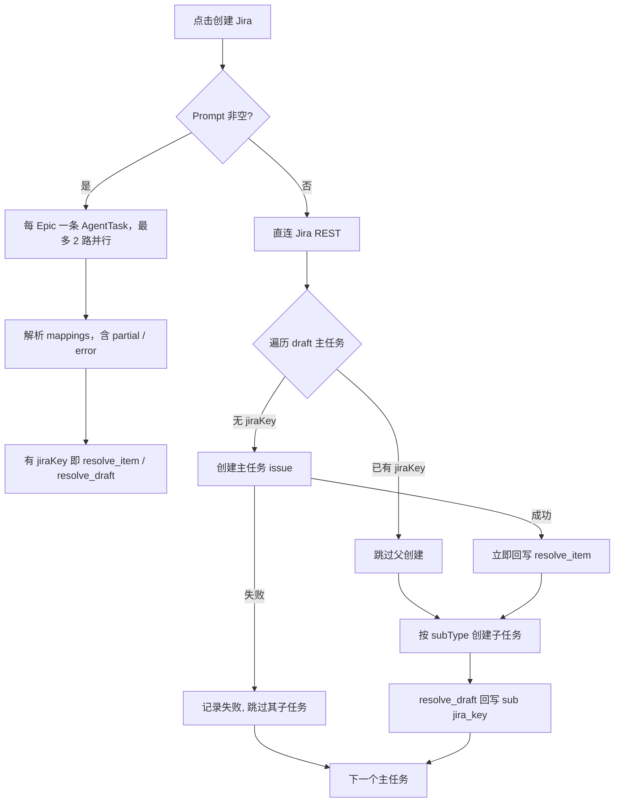

# Personal Roadmap 与重点项目记忆联动

静态交互原型（纯前端、无真实 Jira / 扩展）：[`docs/demo/roadmap-demo.html`](../demo/roadmap-demo.html)。Options → 功能 Demo →「项目 Roadmap（静态 Demo）」会打开打包进扩展的同款页面。

## 产品边界

Roadmap 是团队共享的意图声明（排期 / Epic / 草稿任务）。记忆系统是个人私有的现实观察。用户把 Epic 拖进 Gantt = 声明「这是我的重点项目」；记忆系统据此做消息打标、反思与 dreaming，并在 Roadmap 页用个人图层角标报告意图与现实的偏差。系统**绝不自动改团队 bar**。

## 大白话运行逻辑

1. 用户在 Roadmap 站点维护团队排期（Jira 导入进 Backlog，拖进 Gantt 才算重点）。
2. 装了 Personal AI 扩展、且在该团队有过写操作的用户，扩展会把 **当前 Gantt 上的主任务** 同步到记忆服务（按团队覆盖，不是追加）。
3. 消息分析把这些重点项目当成系统观察规则：命中只入库，**不发 Glip/Chrome 通知**。
4. 高影响事件（日期变动等）抽成时间线，写双时态属性，并在 Roadmap bar 上出个人层角标；用户可「按此更新」或「忽略」，也可因 bar 收敛到建议日期而自动消除。
5. 自我反思 / dreaming / 召回以 focus project 为锚点，但有多团队预算公平与 alias 短名压缩，避免 prompt 过载。
6. 「创建 Jira」填了 Prompt 时，按 Epic 最多 2 路交给 Agent；某一组只成功一部分也会把已有 Jira key 写回 Roadmap，失败的行单独标错。

## 数据分层

| 层 | 存放 | 可见性 |
|---|---|---|
| 团队层 | roadmap-service（SQLite）Team/Item/Sub/排期/alias/draft/activity_log | 分享链接协作者 |
| 个人层 | memory-service watched_projects + drift receipts；扩展 storage | 仅本人；content script 注入 |

## 手动 Backlog 条目与 draft 生命周期

不是所有要排期的事都已经在 Jira 里。Backlog 顶部的「+ 新建条目」可以直接建一条**手动条目**（title / 类型 / quarter / 预估周数，预估可留空显示 `—`），拖进 Gantt 就以 draft 状态参与排期，不需要先去 Jira 开单。

### 判据只有一条：`jiraKey === null`

**`source` 不是 draft 判据**。导入进来的行 `source='jira'`，手动建的行 `source='manual'` 且永远不变——包括它的 Jira issue 已经建好之后。所有端一律看 `jiraKey`：

| 端 | 表达式 |
|---|---|
| roadmap-service | `listFocusItems()` 的 `isDraft: !jiraKey` |
| web（Backlog / Gantt / 创建弹窗） | `isDraftItem(item)` = `!item.jiraKey` |
| 扩展 | 页面送来 `jiraKey` 就看它；旧版页面包完全不带该字段时退回「key 以 `LOCAL-` 开头」 |
| memory-service | `isDraft && !jiraKey` |

四种状态对齐结果：导入的 Jira 条目 = 非 draft；新建手动条目 = draft；手动条目回填真实 key 后 = 非 draft；旧页面包（不送 `jiraKey`）= 除 `LOCAL-` 外都不是 draft。

### 合成 key 永不变更

手动条目拿到一个永久的 `LOCAL-<nanoid8>` 作为 `items.key`，真实 key 只写进 `jira_key`，界面上显示 `jira_key || key`。这条是硬约束：`items.key` 被 `subs.item_key`、URL 的 `expand=` 和 memory 侧 id `roadmap-{teamId}-{slug(key)}` 依赖，改名会让 memory 新建一个项目并 archive 掉旧的，丢掉全部连续性。

### 三个新 intent

| op | 语义 | OCC |
|---|---|---|
| `add_item` | 新建手动 backlog 条目，类型 / project 默认取 JQL 识别结果 | 无（新建无冲突） |
| `delete_item` | 只允许删 `source='manual'` 且 `jira_key IS NULL` 的条目，否则报 `item_has_jira` | 无 |
| `resolve_item` | 回填 `jira_key`（顺带校正 type / projectKey） | **刻意不做版本校验** |

`resolve_item` 不校验版本，是因为发它的时候 Jira issue 已经真的建出来了：用户在创建期间拖一下 bar 就让回填失败的话，key 会永久丢失。`resolve_item` 与 `resolve_draft` 都是幂等的——重复写同一个 mapping 不会二次 bump version，也不会写第二条 activity（创建弹窗与扩展会各写一次子任务 mapping）。

**回填顺带把草稿名固化成备注名**：两者都会 `alias = COALESCE(alias, title)`——只在 `alias` 还没被用户手动设过时才写。原因是 `refresh_from_jira` 只覆盖 `title`（镶入真实 Jira summary），从不动 `alias`；Agent 模式创建时系统 Prompt 明确允许改写 summary（见下），若不固化，用户手打的草稿名会在创建后第一次静默刷新时被换成 Agent 生成的措辞。固化后甘特上展示的名字（`alias || title`）在创建、Agent 改写、后续刷新之间保持不变，hover 才看到正式 summary。备注名换行渲染（`GanttRow.vue` 的 `wrapMode`/`free-h`）只对 ≤40 字符的 alias 生效（`shouldWrapAlias`，`useRoadmapContract.ts`）——固化进来的英文草稿名通常很长，走单行省略而不是把 bar 撑高。双击已创建条进入备注名编辑时，hint 写「清空回车＝恢复原 ticket 名」；清空后回车会 toast「备注名已清除，恢复展示原 ticket 名」。

### Backlog 排序：新建的排最前面

服务端仍按 `ORDER BY quarter, key` 下发 items（没有 `sort_order` 字段），排序规则集中在前端 `buildBacklogGroups()`（`web/src/composables/useRoadmapContract.ts`），依赖 snapshot 新增的 `item.createdAt`（epoch ms，来自 `items.created_at`）：

- **组内**：`source='manual'` 的条目按创建时间倒序置顶，Jira 导入条目保持服务端 key 序排在其后
- **组间**：含「最新手动条目」的那个 quarter 整组提到最前，其余 quarter 仍按季度先后；没填 quarter 的 `—` 组排在所有季度之后
- 只提升一个分组，所以刚新建的条目必然是列表第一张卡片，其他季度的相对顺序不变
- 新建成功后清空搜索框并把 Backlog 滚回顶部，避免新卡片被过滤或被滚动位置藏住
- `createdAt` 缺失（老服务端）时按 0 处理：手动条目仍置顶，只是彼此之间退回 key 序

### 边界

- **删除保护**：`jira_key` 已回填的条目不能从 Roadmap 删，只能 unschedule 退回 Backlog（Jira 上有真 issue 了）。
- **覆盖导入不碰手动项**：覆盖删除限定 `source='jira'`，孤儿 subs 清理同理。
- **导入按 `jira_key` 去重**：手动条目建成 `NOVA-123` 后下次 JQL 会命中它，import 先按 `jira_key` 找到原行就地更新（顺便把 `source` 升级为 `jira`），不会多插一行。
- **cleanup 语义**：过期 draft 主任务和普通 Epic 一样退回 Backlog；退回后它会从 memory focus 里被 archive，这是预期行为。
- **无扩展也能用**：新建条目、拖拽只需要 edit token；只有「创建 Jira」依赖扩展。缺扩展时的引导见下节。

### draft 的 memory-only 边界

draft 同步进 memory 时 `externalRef.jiraKey` 写 `null`、`isDraft: true`。合成 key **不进 aliases**——`LOCAL-xxx` 永远不可能出现在聊天消息里，只会污染匹配和规则文本，draft 用 title / alias / displayName 匹配。`buildFocusProjectWatchRules` 对 draft 去掉 `[key]` 前缀和「exact Jira key first」指令，改为纯 alias/keyword 匹配。回填真实 key 后下次 sync 会把它加进 aliases，而 id 因 `key` 不变保持稳定。draft 和普通 focus project 一样是**只入库不通知**。

## 从 JQL 识别层级

`roadmap-service/src/core/JqlIntrospect.ts` 在服务端解析团队 JQL，结果随 snapshot 的 `team.jqlHints` 下发，前端与扩展共用一套：

- 先剥掉单引号包裹的子串——真实 JQL 会把整条子查询嵌在 `portfolioChildrenOf('project = INIT AND …')` 里，内层的 `project` / `issuetype` 描述的是父层，不是要导入的行
- 再匹配外层 `issuetype = / in (...)` 与 `project = ...`
- 兜底顺序：JQL 解析 → 已导入 items 的 `type` 众数 → `Epic` 且 `confident: false`

`confident: false` 或 `projectKey` 为空时，创建弹窗显示「未能从 JQL 识别…请手动填写」，字段可编辑，不静默猜。

## 创建 Jira（直连 API / Agent 执行器双路径）

Gantt 上的 draft 主任务和 draft 子任务，点「创建 Jira」打开同一弹窗。模式由 **Prompt 是否为空** 决定（无独立开关）：

| Prompt | 路径 | 行为 |
|---|---|---|
| 留空 | 直连 API | 扩展用 Options `JIRA_API_TOKEN` 调 Jira REST；字段必填（Project / 类型） |
| 非空 | Agent 执行器 | 扩展组装任务文本 → memory-service `POST /agent-tasks/execute`（异步接单）→ 轮询 `runtime-status` → 解析 artifact `mappings` 后 `resolve_item` / `resolve_draft` |

交互对齐 `docs/demo/roadmap-demo.html`：

- 标题旁徽标实时切换：`直连 API` ↔ `AGENT 执行器`
- Agent 模式显示执行器 chip（当前 fallback：`openClawEnabled` 时出现 OpenClaw）；无配置时引导打开插件 Options
- 字段两模式共享；Agent 模式下空字段 placeholder 为「自动 · 由 Agent 决定」，已填值作为硬约束下发
- Prompt 草稿按团队写入本机 `localStorage`（`personalroadmap.aiPrompt:<teamId>`）；关闭弹窗再打开会恢复
- 用户**执行创建**且 Prompt 非空时，写入团队配置 `team.createJiraPrompt`，其他协作者打开弹窗（本机无草稿时）也能看到
- 执行器选择写入 `localStorage`（`personalroadmap.aiExecutor`）
- Agent 模式逐行成功时显示紫色 chip「草稿名已存为备注」（hover 说明甘特展示名不变）；完成 toast 追加「草稿名已保留为备注名」

### fixVersion 自动填

团队配置了发布时间表后，按各行 **Target End**（或 `start + days - 1`）经 `catchRelease` 匹配最近 Pro release：

- 全部落同一 release → 字段直接填入
- 跨 release → 字段留空 + 列表逐行绿色 chip；用户输入固定值覆盖全部
- 插件侧 `buildJiraCreateFields` 写 `fixVersions`：exact → **唯一后缀匹配**（解决表里 `26.3.220` vs Jira `Nova 26.3.220`）；歧义/无匹配则丢字段并带回 warning，不阻断创建

Sprint：直连 v1 不写（需 Agile API）；Agent 模式未填时由执行器查当前 sprint。

### Assignee 映射（系统名 → Jira 实名）

创建弹窗有 **Assignee** 汇总条与「配置映射…」。映射按团队存 `teams.assignee_map_json`（协作方共享）：

- 人员全集 = 当前用户 ∪ 团队成员 ∪ 子任务 Owner ∪ 草稿 `createdBy`
- Owner 优先；无 Owner 回落创建人；本地自建未记名再回落当前用户
- **直连 API**：实名转 `firstname.lastname` 写入 `fields.assignee.name`；未映射则留空，不阻塞创建
- **Agent 模式**：前端组装完整 Prompt（**System Prompt** + 用户 Prompt + 字段约束 + 映射表 + 任务清单）；扩展提交前按父 `jiraKey` 拉取 Epic `description` 写入请求，再追加结果契约
- 全站展示名走 `dispName()`（选人浮层、人员视图、创建者灰字、协作 ticker）；存储仍用系统名

#### 实名 Suggest 与人员合并

映射弹窗输入 `Firstname Lastname` 时，下拉建议来自人员全集中**系统名已是两词及以上**的条目（`looksFullName`），可键盘上下选择 / Enter，或鼠标点选。

- **仅手打实名并「保存映射」**：只写 `assignee_map_json`，不改写成员 / Owner / 创建者
- **从建议列表选中**：确认后立刻发 `merge_people`（`fromName` = 当前行系统名，`toName` = 选中实名），把两人收成同一身份

`merge_people` 行为：

| 改写项 | 行为 |
|---|---|
| `subs.owner` / `subs.created_by` | `fromName` → `toName` |
| `members` | 双方都有成员行则删短名行、保留实名行；仅短名有成员则改名为实名；都没有则 `ensureMember(toName)` |
| `assignee_map_json` | 实名 key 与短名 key **都**指向同一 `Firstname Lastname`（短名保留为别名，避免本机 `actorName` 仍是短名时再次分裂） |
| 本机登录名 | 若当前 `actorName` 等于 `fromName`，前端同步改成 `toName` |

**有意不改写**：历史 `activity_log`、团队 `created_by`、其他浏览器未刷新前的 presence 名。活动流仍可能显示旧短名；刷新后人员视图 / 选人列表以合并后身份为准。

**副作用注意**：

1. 合并会改历史子任务上的 Owner / 创建者展示与资源视图归集，确认框会提示
2. `update_member` 遇重名仍返回 `member_name_taken`；合并路径专门处理双成员冲突，不要用改名代替合并
3. 其他协作者本机 `actorName` 若仍是短名，靠映射别名继续解析到同一 Jira 实名；他们不会自动改本地登录名
4. 手填与建议目标同字但不点选 → 不会合并；避免误伤

权威实现：`mergeAssigneeMapIdentities`（`roadmap-service/src/core/assigneeMap.ts`）、`merge_people`（`TeamService`）、弹窗 `AssigneeMapModal.vue` + `suggestFullNamePeople`。

### Agent System Prompt 与子任务 Description

权威文案：`roadmap-service/web/src/composables/useCreateJiraAgentPrompt.ts`（`ROADMAP_CREATE_JIRA_SYSTEM_PROMPT` + `buildAgentCreatePrompt`）。扩展 `contentScriptRoadmap.ts` 保留同文案兜底，并在 `executeAgentTask` 前调用 `enrichAgentPromptWithEpicDescriptions`。

提交给 Agent 的 `task` 文本结构：

1. **【System Prompt】** — 固定指令（角色、禁止索要 token、**子任务必须写 description**）
2. **【用户 Prompt】** — 弹窗输入
3. **【字段约束】 / 【Assignee 规则】 / 【任务清单】** — 硬约束与逐行 draft
4. **【父 Epic 描述（已从 Jira 拉取）】** — 扩展用 Options token 读父 issue `description`（ADF/wiki 转纯文本，约 1200 字上限）
5. **结果契约** — `mappings` JSON，允许 `partial` 与 `error` 行；明确子任务 `description=required`；每路只创建该组 draftId

**Description 生成规则（Agent 必须遵守）**：

| 条件 | 行为 |
|---|---|
| 父 Epic 已有 Jira key，且请求中带了描述摘录 | 用摘录 + 子任务标题 + **该子任务用户描述（如有）** 生成 description |
| 父有 key 但摘录为空 | Agent 自行再读父 issue description 后生成 |
| 父也是本批新建的 draft | 用父标题 + **父条目用户描述（如有）** + 子标题生成简短 description |
| 主任务（Epic） | 用户未要求时可省略；**带用户描述的 draft 主任务以用户描述为基础润色**；**子任务不可省略** |

生成要求：综合三类输入（父 Epic description、子标题、用户描述）；约束/范围/事实必须保留，允许改写措辞——**最终 summary/description 不必与用户输入逐字一致**。勿整段复制任何一段输入；勿编造事实。直连 API 路径不走 Agent Prompt，**有内容则原文透传 `fields.description`**。

### 甘特体验（与 demo 对齐）

- 草稿创建者：条上用虚线样式标识草稿（无 DRAFT 角标）；协作方创建的子任务 hover 时左侧浮现灰色 `xxx created`
- 新建子任务默认今天起 14 天（贴齐时间轴末端）
- 草稿可折叠填 **description**（甘特快速添加 / 双击草稿条 / Backlog 新建）：标题 + Enter 仍秒建；`≡ 描述` 或 Shift+Enter 展开；已有描述时双击默认展开。非 draft 不可改 description（由打开刷新从 Jira 镜像）
- 描述框样式与 demo 一致：快速添加的描述框固定 404px、与标题框左对齐（`.te-desc`）；双击编辑器内的描述框撑满面板（`.alias-editor` 用 `align-items:stretch`，收缩到 textarea 默认宽即为回归）；Backlog 新建弹窗的描述用正文字体（`.f-input.f-desc`，非 JQL 的等宽 96px 高）。展开即聚焦描述框、收起回到标题输入框且不丢内容
- Hover 灰色小字：有 description 时展示描述（单行约 150 字）；无则保留操作提示。「可赶 Sprint」在标题行
- 选人浮层：搜索置顶、打开即聚焦、列表限高滚动、键盘导航、视口不够时向上翻转
- 导入 Task：`importedTaskSpan` 兜底（双端齐全按 Target；都缺则同主任务；只一端则两周并钳制进主任务范围）
- 打开 Jira：hover 左上 ↗，或 ⌘/Ctrl+单击；base URL 来自服务端 `JIRA_BASE_URL`
- 子任务（含已导入）可单独 × 从 Roadmap 移除，需要时可再导入

### 时间轴缩放

甘特的天宽 `DAY_W`（`useGeometry.ts`）是响应式 `ref`（默认 7px/天，范围 `[2.2, 24]`），不是常量；缩放不用按钮，走手势：

| 手势 | 触发条件 | 行为 |
|---|---|---|
| 触控板双指捏合 / ⌘+滚轮 | `ctrlKey \|\| metaKey` 的 wheel 事件，甘特任意位置 | 以光标所在日期为锚点缩放（缩放前后该日期钉在同一屏幕像素） |
| 双指上下滑动 | wheel 落在 `.g-header` / `.g-relruler`（时间标尺）上，且 `|deltaY| > |deltaX|` | 同样触发缩放；标尺没有纵向内容，纵向滑动无歧义。横向滑动仍是平移，不拦截 |
| 双击标尺 | — | 非 100% → 复位默认；已是 100% → 缩到刚好容纳整条时间轴（`clientWidth / tl.days`） |

连续 wheel 事件按 16ms 合帧成一次缩放，避免每帧都重算几何。缩放级别按 `roadmap.zoom.<teamId>` 存 `localStorage`，只影响本人视图、下次打开恢复；右上角浮出「缩放 **143%** · 视野约 3.1 个月」提示（百分比用橙色强调），900ms 后淡出。人员视图是百分比布局，不受 `DAY_W` 影响。缩放监听挂在滚动容器上且 `passive: false`，才能拦住触控板捏合的默认页面缩放。

### 两阶段回写（直连路径）

弹窗按主/子任务分组展示，逐行回显状态。



主任务成功后**立刻**单独发 `resolve_item`，不等子任务：否则子任务失败后重试会重复建父 issue。一行失败不会中断整批，每行各自回显 key 或错误。

**Agent 调度（按 Epic，不合并成一条大请求）**：

| 规则 | 行为 |
|---|---|
| 分组 | 与直连相同：`buildDraftGroups` 每个主任务一组 |
| 并行 | 最多 **2** 路同时 `execute`（`AGENT_CREATE_CONCURRENCY`）。其余组保持「待创建」，轮到才转圈。直连 API 仍串行 |
| Prompt 切片 | 每路只含该组 draft。预览弹窗仍展示全部草稿总览 |
| 幂等 | `idempotencyKey = roadmap_create:{teamId}:{sorted draftIds}`，按组计算。已回写的行不再是 draft，重试只会带剩余组 |
| 为何不合并 | 单请求崩溃且无 artifact 时，重试可能把已建票再创建一遍。Epic 隔离把爆炸半径限制在一组 |

**结果契约（允许部分成功）**：

```json
{"partial":true,"mappings":[
  {"draftId":"AE42…","jiraKey":"MILO-101"},
  {"draftId":"BBx…","error":"assignee 找不到"}
]}
```

- 兼容旧格式（只有 `jiraKey`、无 `partial`）
- **即使 AgentTask 为 `failed` / `dead_letter` / 轮询超时，只要 artifact 里有 `jiraKey` 就回写**，缺 mapping 的行才标错
- 契约要求 Agent：后面某行失败也必须输出已成功的 key，禁止整单失败就省略成功行

**Agent 排队 / loading**：`execute` 返回 `queueStatus: queued` 后扩展每 5s 轮询 `runtime-status`，直到 `succeeded` / `failed` / `dead_letter` / `input_required`，或就绪检查拦截（`readinessBlocked`）、排队超过约 90s。这三种「失败」不再直接 throw 整组：先解析 mappings，有 key 就回写。

**超时预算（三处必须对齐，均为 30 分钟）**：批量创建十几条 ticket 的 Agent run 常远超 10 分钟，所以：

| 位置 | 值 | 说明 |
|---|---|---|
| 扩展轮询 `waitForAgentTaskTerminal` | `AGENT_CREATE_TIMEOUT_MS = 30min` | 超时用最后一次 poll 的 artifact 尝试回写；没有 mappings 才把该组标失败 |
| `executeAgentTask` 请求体 `timeoutMs` | `30min` | 经 `normalizeAgentTaskTimeoutMs`（下限 10min）传到 OpenClaw 网关执行器的等待时长 |
| 心跳 stale-running 回收 | 无 `remoteRunId`：`max(openClawTimeoutMs+60s, 本 action 的 timeoutMs+120s)`；有 `remoteRunId`：先 30/60/120s 确认最多 3 次，对不上才 `dead_letter` | Gateway 超时后保持 running 并对账，避免把仍在跑的长任务判成失败 |

只改前端轮询是不够的：网关等待与心跳回收若仍按 10 分钟，run 会先被判超时/回收。若长期卡在 `queued`，多为 OpenClaw 就绪检查未通过（Options → Agent 执行器 / 网关未配好）；修复后重新点击创建（同 idempotency 会重试 failed/queued）。

**关闭弹窗 / 关闭网页**：

| 场景 | 行为 |
|---|---|
| 创建中关闭弹窗 | 允许。工具栏「创建 Jira」保持 busy；可再点开查看行状态。完成后 **toast**（弹窗已关时 toast 更久） |
| 关闭 Roadmap 标签页 / 整页刷新 | 见下表 |

| 路径 | 关页后创建还会继续吗？ | ticket 会回写 Roadmap 吗？ | 用户如何知道成功？ |
|---|---|---|---|
| **直连 API** | Jira REST 若已发出，background 可能仍完成创建；但回写 intent 在 content script，**关页后通常不会回写** | 多数情况下 **不会**（Jira 里可能已有 issue，Roadmap draft 仍虚线） | 本页 toast / 弹窗行状态；关页后无通知。重开后可对照 Jira 或重新创建（注意勿重复建） |
| **Prompt / Agent** | memory-service 已 `accepted` 的任务会在服务端 / OpenClaw **继续跑完** | **关页当时不会回写**（`runtime-status` 轮询在 content script，background service worker **不会**接着轮询，这是 by design） | 本页打开时 toast。关页后无系统通知 |

**下次打开 Roadmap 才会补回写（已实现）**：`execute` 被 accepted 后立刻把 `{taskId, teamId, token, parent, childDraftIds}` 写入扩展 `chrome.storage.local`（`roadmapPendingAgentCreates`）。content script 在页面握手后再扫这笔账本，继续 `runtime-status` 轮询并 `resolve_*`。工具栏会短暂回到「创建中」，成功则 toast「已补回写 N 个 Jira issue」。超过 24h 仍会做一次状态探查再丢弃。`resolve_*` 幂等，与仍开着的原页轮询重复执行也安全。

关页期间 **没有** `chrome.alarms` / background 续跑，所以 DevTools 里看不到 background 继续打 `runtime-status`。Agent 本身在 memory-service 跑，只是扩展不再问进度，直到下次打开这个浏览器里的 Roadmap 页。

两个 service 之间仍然没有直接通信；`resolve_*` 只能由持有团队写 token 的扩展发出。换设备 / 换浏览器不会带上 `chrome.storage` 账本。若需要关页也通知，再叠加 background `chrome.alarms`（未做）。

### 类型与链接字段映射

| 主任务类型 | 子任务类型 | 链接字段 |
|---|---|---|
| `Initiative` / `INIT` | `Epic` | `customfield_15751`（Parent Link） |
| `Epic` | `Task` | `customfield_11450`（Epic Link） |
| `Task` / `Story` / `User Story` / `Bug` / 其他 | 该 project 下 `subtask: true` 的真实类型 | `parent: { key }` |

最后一行的子任务类型名各 Jira 实例不同（`Sub-task` / `Subtask` / `子任务`），所以**不硬编码**：后端对这一档直接下发 `subType: null`，弹窗的子任务类型允许留空并提示「留空时扩展会用该项目实际的子任务类型」，由扩展查 `/rest/api/2/issue/createmeta?projectKeys=X&expand=projects.issuetypes.fields` 解析。createmeta 拿不到时报明确错误，让用户手填，而不是拿空类型名去撞 Jira 的 400。

### 写入字段（直连）

- 通用：`summary`、`issuetype`、`project`
- `customfield_18350` / `customfield_18351` ← Target start / end
- `customfield_21998` ← `item.quarter`（仅当该 project 的 createmeta 里存在此字段，且值能匹配上 allowedValues）
- `fixVersions` ← 弹窗建议/覆盖的 release name（createmeta 门控 + 后缀匹配）
- `assignee` ← 子任务 Owner（经团队映射表）转成的 `firstname.lastname`；未映射则不发
- `description` ← 用户在草稿上填的原文；空则不发（系统字段，无 createmeta 时也可写）
- **创建 Epic 必须带 `customfield_11451`（Epic Name）**，否则 Jira Server 直接 400
- 子任务：按上表填 `linkField` 或 `parent`

createmeta 不可用时只发 Epic Name（Jira 强制要求的那个）以及有内容的 `description`；其余可选字段一律不发——一个该 project 不支持的字段 id 会让 Jira 拒掉整次创建。

创建编排在扩展 / memory-service；Assignee 映射与 Prompt 组装在 roadmap-service 页面与团队配置中完成。

## 数据库迁移

`items` 表加了 `source` / `jira_key` / `project_key` 三列。远端已有真实数据，所以走幂等 `ALTER TABLE`（按 `PRAGMA table_info(items)` 判断）并记进 `_migrations`，不重建库。后续 `010_item_sub_description` 给 `items`/`subs` 加 `description`；`011_teams_jira_refreshed_at` 给 `teams` 加刷新时间戳；`013_subs_status` 给 `subs` 加 `status`——镜像的 Jira 工作流状态（`Closed`/`Resolved`/…），由 `applyRefreshFromJira` 的 sub 分支写入，人员视图/甘特图用它给已完成任务单独配色并从顺延候选里剔除。扩展侧早就在批量刷新时请求 `status` 字段（依赖 ticket 一直在用），这次只是把它也落到 `subs` 表并下发给前端，不需要改扩展。

**顺序约束**：`Database.ts` 是先 `db.exec(schema.sql)` 再跑迁移。所以 `schema.sql` 里**不能**出现引用新列的索引——已有部署还没 ALTER 过，启动时就会崩。`idx_items_jira_key` 因此由迁移 `003` 创建而不是写在 `schema.sql` 里。`schema.sql` 只负责让全新库一次到位，迁移负责把老库补齐。description 列写在 `schema.sql` 里但不建索引。

## 关键 API

### roadmap-service `:3220`

- `GET /api/v1/teams?ids=` — 只返回请求的团队；不带 `ids` 返回空列表（不再下发全站目录）
- `POST /api/v1/teams`
- `GET /api/v1/teams/:id`
- `GET /api/v1/teams/:id/focus-items`
- `POST /api/v1/teams/:id/intents`（需 share token）
- `POST /api/v1/teams/:id/share`
- `GET /api/v1/teams/:id/activity`
- `GET /api/v1/teams/:id/events`（SSE）

### memory-service

- `POST /api/v1/projects/watched/sync` — 按 `teamId` 权威快照覆盖（由 **扩展 background** 代发，content script 不再直连 memory-service，避免宿主页 CORS）
- `POST /api/v1/projects/watched/archive-team`
- `GET /api/v1/projects/focus` — 含 row/paragraph/seed 三种上下文

## 分享两档

- 地址栏复制：只读（encode team/q/view/expand）；`expand` 是**本机视图状态**，展开/收起会 `replaceState` 更新地址栏，刷新可还原
- 右上角分享：带 token 的可编辑链接（分享前同步当前 `expand`/q/view）；匿名 name 可冒充，审计记 client_id
- **展开状态不同步多人**：SSE 快照不覆盖本机 expand；服务端 `expand`/`collapse` intent 为 no-op（兼容旧客户端）
- 顶栏团队列表只展示**本机已知团队**（创建过、打开过 `?team=` / 分享链接、或已有 edit token）。`GET /api/v1/teams` 必须带 `ids=`，不再返回全站目录。只读团队（本机无 edit token）在下拉里带眼睛图标
- 顶栏 SyncTicker / 活动日志都只展示**当前选中团队**的 activity；ticker 再过滤掉自己的操作、Jira 静默刷新，以及发布时间表静默刷表（含历史「更新了发布时间表标尺」与新的「系统静默更新」）
- 可编辑只看本机是否有该团队 edit token（与是否安装扩展无关）。edit token 与已知团队列表都存在页面 `localStorage`，**不随扩展同步、不跨设备**
- 分享复制：优先 `navigator.clipboard`；在 `http://IP:端口` 等非安全上下文走 `textarea` + `execCommand('copy')`；仍失败则 toast + `prompt` 展示完整链接，不再与「无编辑权限」混报

## 扩展桥

`contentScriptRoadmap` 按 Options `ROADMAP_BASE_URL`（及内置 roadmap 域名）注入：身份、focus sync、JQL 导入 / 创建 Jira（直连 + Agent）/ AI 缩写代理。Token 不出个人域。Focus sync / drift / agent runtime 一律经 `ROADMAP_MEMORY_REQUEST` 由 background 调 memory-service；与 Target 回写（同源 `sync-target`）是两条独立链路。

Backlog 底部曾有一个「记忆里在谈但不在 JQL 里」的候选区（扩展注入 `#pai-memory-candidates`），**已移除**。它的候选来源 `GET /projects/memory-candidates` 只是把 `entities` 里 Project/Topic 按 `mention_count` 取前几名再去掉已关注项，与当前团队和 JQL 毫无关联，结果是「RingCentral / IT support / login issues」这类全局高频泛化词；注入的 `.pai-mem-cand-*` 样式在页面侧也从未实现，拖拽 `application/pai-memory-candidate` 更没有接收端。memory-service 端点与 background 桥仍保留，重做这个入口时需要先解决相关性与去泛化，再补页面样式。

默认站点 `http://roadmap.xmnup.com`（`.env` / `ROADMAP_BASE_URL`）。**Options 里改地址只改 Popup 打开的入口**；身份自动注入依赖 content script 是否匹配当前 origin。静态匹配含 `roadmap.xmnup.com` 与本地/旧 IP；自定义域名在保存 Options 后由 background 动态 `registerContentScripts`。改域名后需**重新加载扩展并刷新 Roadmap 页**，否则仍会弹出「输入名字」。

页面与扩展之间用 `window.postMessage` 通信：

- `pai-roadmap-import-jql` / `-ack` / `-result`
- `pai-roadmap-create-jira` / `-ack` / `-result`（直连）
- `pai-roadmap-agent-create` / `-ack` / `-result`（Agent；超时约 11 分钟）
- `pai-roadmap-agent-executors` / `-ack` / `-result`
- `pai-roadmap-open-options` / `-ack` / `-result`

内容脚本收到请求会**先回一条 ack**，页面 4 秒内收不到 ack 就直接报「扩展未接收请求，请重新加载扩展后刷新本页」。

**Jira REST 一律由 service worker 代发**：MV3 下内容脚本的 fetch 仍受宿主页面的 CORS 约束，roadmap 页面（`localhost:3220` 等）直连 `jira.ringcentral.com` 会在请求发出前被拦掉，表现为「有 loading、没有网络请求」。所以内容脚本走 `jiraFetchViaBackground()` → `PERSONAL_AI_JIRA_PROXY_FETCH` → background `handleJiraProxyFetch()`，代理只允许打到当前配置的 Jira origin，Token 只在扩展上下文里解析。排查时看扩展 service worker 的 Network/Console，而不是页面的 Network 面板。

Agent 路径走 memory-service（内容脚本已有的 `MemoryServiceClient`）：`executeAgentTask` + `getAgentTaskRuntimeStatus`；Jira token **不**交给 Agent。

## 导入 Quarters

- JQL **含** `"Target Delivery Quarter" in (...)` 时显示 quarters 勾选；导入按钮文案固定为「导入 Backlog」
- JQL **不含**该字段时不显示 quarters 勾选，只显示「导入 Backlog」；实际执行原 JQL，不再自动附加 quarter 子句
- 「覆盖已有数据」只在导入栏勾一次；预览弹窗直接按这个开关渲染要导入的 quarters 与实际 JQL，不再要求二次勾选
- 未勾选＝增量模式，只导入 `checkedQuarters` 里还没导过的 quarter（无 quarter 字段时按整份 JQL 增量去重）
- 勾选＝覆盖模式：有 quarter 时按 `checkedQuarters` 全量重拉并 `DELETE` 对应 quarter 的 jira items；无 quarter 字段时清除该团队全部 `source='jira'` 行（手动条目保留）

### 季度来自父 Initiative，不从 Target 日期猜

RC 的 JQL 把季度条件写在**父层**子查询里（`portfolioChildrenOf('… "Target Delivery Quarter" in (2026-Q3, 2026-Q4)')`），导入的却是子层 Epic，而 Epic 自己的 `Target Delivery Quarter`（`customfield_21998`）通常是空的——季度挂在父 Initiative 上，靠 Parent Link（`customfield_15751`）关联。不处理的话每一行都落进 Backlog 的 `—` 组。

- 导入时对**仍缺季度**的行收集父 key，去重后按 50 个一批发 `key in (...)` 查父层季度回填（`src/roadmapImportQuarter.ts` 是纯逻辑，content script 只负责取数）
- Epic 自己填了季度就以它为准，父层不覆盖；父层也没季度时保持为空
- 父层查询失败只记 warning，不让导入失败——最坏结果只是分组回到 `—`
- **不从 Target 日期推算季度**：真实数据里 NOVA-13139 的 Target 是 2026-07-01 → 09-30（看着像 Q3），父 INIT-30074 实际是 **2026-Q4**，按日期猜会算错

### 覆盖导入怎么处理没有季度的行

`quarter IS NULL` 的行是历史遗留（回填上线前导入的全都是），按 quarter 过滤的 `DELETE` 永远匹配不到它们，会变成任何覆盖导入都清不掉的幽灵行。但也不能一律删：被删的行会以 `scheduled=0` 重新插入，subs 与 markers 也已连带删除，等于把仍然有效的行的排期清空。所以规则分两种：

| 行的状态 | 覆盖导入的处理 |
|---|---|
| `quarter` 命中本次勾选的季度 | 原语义不变：删除后由本次 payload 重建（排期/subs/markers 归零） |
| `quarter IS NULL` 且本次 JQL 仍返回它 | 保留，走 UPDATE；季度被回填值补上，排期与 subs 不受影响 |
| `quarter IS NULL` 且本次 JQL 不再返回它 | 判定为幽灵行，清除 |
| `source='manual'` | 任何情况都不动 |

## Owner、人员视图与清理记忆

- 新增子任务默认 **14 天**，Owner 可选：标题 `@` 建议、左侧头像点选、手输新名（自动进成员表）。Enter 不设 Owner 也可创建。
- 双击子任务条：草稿改任务名（创建 Jira 用 `title`），已创建的改备注名，并点头像更换/移除 Owner；`update_sub` 保留 draft / Jira key 身份（拖拽不再 delete+add）。
- 双击草稿主任务条：`update_item` 改标题；已创建主任务仍 `set_alias` 改备注名。
- 人员视图：近 2 周 / 全部、并行车道堆叠、窗口外「更早/更晚」角标；双击成员名 `update_member`（级联改所有 sub.owner）。窗口重叠用毫秒时间戳比较（ISO 字符串不能和 `Date` 直接 `<=`，否则窗口内 bar 全部不渲染）。
- 清理过期：Epic 回退 Backlog；未过期 Epic 下的过期子任务 `cleared=1`（Gantt/人员视图隐藏，Backlog 仍计「↺ n 个子任务记录」）。Epic 再次拖入 Gantt（`schedule`）时清空 `cleared` 还原。

### 车道装箱必须先按开始日排序

人员视图把一个人名下的子任务贪心装进车道（`placeLanes`，`ResourceView.vue`）：遍历时找一条「结束日早于本任务开始日」的车道复用，找不到才新开一条。这个贪心算法**要求输入按开始日升序**，否则会在本可以横向接排的任务之间无谓多开车道——`tasksOf()` 收集完任务后必须先 `sort`（同日开始的长任务排前面，短任务更容易接进其他车道尾部），不能直接把 Epic 遍历顺序喂给 `placeLanes`。

### 主任务归属可视化

人员视图只显示子任务，看不出这条属于哪个 Epic。三层递进呈现（`ResourceView.vue` + `useRoadmapContract.ts` 的 `epicColor`/`epicShort`）：

- **左侧色条**（恒在）：每个 Epic 按它在甘特行序（`state.scheduledItems`）里的位置从一个 8 色色板取一个稳定颜色，与任务条本身的过去/当前/未来配色分层
- **前缀 chip**（条足够宽才出现，实际像素宽 > 110px）：备注名优先，超 14 字截断
- 工具栏「主任务」图例是纯静态色板对照，**不**联动高亮——早期版本 hover 任务条/图例会把同 Epic 的条一起点亮、其余压暗，实测这个联动经常和下面「聚焦」的选中态互相抢视觉焦点，已去掉

高亮/压暗**只由选中驱动**，不由 hover 驱动，且只影响当前正在操作的这个人：进入「聚焦」（见下）时，当前人员**只有选中的任务**用 `.sel` 高亮（橙色描边 + ✓），**其余全部**（含会被顺延移动的候选、顶到 Epic 结束日的 stuck、下面说的已完成 done）统一压暗（`.res-row.focusing .res-bar:not(.sel):not(.ghost){opacity:.55}`）——早期版本让「会被移动的候选」也跟着高亮，实测容易和「已经在做」混在一起分不清，顺延预告改成只靠 `rb-shift` 角标（→下周一 / →钳制日期 / ✕）单独传达；其他人员的任务条不受任何影响，正常显示。

### 已完成任务的配色

子任务镜像的 Jira **状态**（`subs.status`，由 `refresh_from_jira` 写入，见「数据库迁移」）为 `Closed`/`Resolved`/`Done`（`isDoneStatus()`，`useRoadmapContract.ts`）时，人员视图和甘特图都用独立的浅绿配色（`.res-bar.done` / `.sbar.done`）+ 标题前缀 `✓ ` 展示，不与过去/当前/未来的时间配色混淆——镜像状态可能滞后于本地排期日期，一条日期上看是「未来」的任务也可能其实已经关闭。已完成任务：

- **不计入**「待延至下周」的候选统计（`isDeferCandidate()` 排除），也不能被标记「正在做」（`onBarClick` 直接 return）——已经完成的任务不需要顺延，也不需要标进度
- 只读展示，用户不能在页面上手动设置/清除 `status`，完全由 Jira 刷新单向镜像（`applyRefreshFromJira` 的 sub 分支）

### 时间窗平移

「近 2 周」窗口默认从今天起算，看不到前后。可以整窗平移，窗口长度不变：

- **触控板双指左右滑动**：`wheel` 的 `|deltaX| > |deltaY|` 时触发。渲染时按 **3 倍窗宽**出内容（可视窗两侧各预渲染一个窗口宽的缓冲），滑动期间只对缓冲层写 `transform`（不重建 DOM），继承触控板原生惯性；手势停 140ms 后落格：偏移量按天取整、重渲染重居中，亚天残差用 0.18s 过渡弹性归零
- **点两端「◂ 更早 / 更晚 ▸」角标**：动画平移 14 天
- 平移后表头出现「回到今天」按钮；切「近 2 周 / 全部」或切团队都会回到今天
- 表头与任务条必须用同一套坐标换算（都是 `position:absolute;inset:0` + 百分比，而不是「表头 3 倍宽 + 负 margin，任务条 0–100% 窗口」两套体系混用）——否则两者会有几像素到几十像素的静默错位

### 聚焦「正在做」+ 一键顺延到下周

人员视图**单击**一个子任务条把它标成「正在做」（可继续单击多选）；点到**另一个成员**的任务，会对那个人重新开始多选；**已完成**（见上）的任务不参与选中。选中后该成员名下出现操作面板：

- 「其余延至下周 →」：把**该成员未选中、开始日在下周一之前、尚未结束、未完成**的任务（已开始未做完的算，已结束的历史记录不算，下周及以后的远任务不算，已完成的不算）统一延到下周一开始，**长度不变**
- hover 该按钮会在每条待顺延任务的落点位置画虚线「影子」预览，钳制到 Epic 结束日的会标注「未到下周一（Epic 限制）」
- 执行后任务条以 0.35s 滑到新 left（`.res-bar.slide`，与 demo 相同曲线）；toast 汇总移动/受限/顶死的数量；再点一次是幂等的（已经落在下周一的不会继续被推）
- Esc、点击空白处、切团队或切「近 2 周 / 全部」都会退出聚焦

**按钮三态**（`goState()`，`ResourceView.vue`）：`ready`（有可移动的候选，正常橙色，可点）/ `stuck`（有候选但全部顶到所属 Epic 结束日，没有可后移的空间——按钮变灰但**不用** `disabled`，因为 `pointer-events:none` 会连 hover 提示一起吞掉，用户无法知道为什么点不动；改用 `.soft` 类保持可点/可 hover，hover 提示与点击 toast 都明确给出原因）/ `none`（没有候选：其余任务都已完成或都不在可顺延范围内）。

后端新 intent **`{ op: 'defer_subs', subIds: string[], targetStart: 'YYYY-MM-DD' }`**（`TeamService.ts` `applyIntent` 分支）：`targetStart` 由前端算好下周一显式传入，避免服务端时区歧义；服务端逐条按 `shift = min(diffDays(sub.start, targetStart), diffDays(subEnd, epicEnd))` 移动 `start_date`（`days` 不变），`shift > 0` 才算移动，一条聚合 activity；返回 `{ moved, capped, stuck }`（**subId 数组**，供前端精确定位需要回写 Jira Target 的那几条，而不只是计数）。服务端只按 Epic 跨度钳制，**不**检查「是否已过期」——那是纯前端的 `isDeferCandidate` 概念，调用方要自己先过滤掉不该顺延的任务再拼 `subIds`。为避免批量竞态与 N 条 activity/SSE 噪音，这里刻意不复用逐条 `update_sub`，也没有做乐观并发的 `baseVersions` 参数（这是低风险的批量整理操作，真发生并发冲突时下一次刷新自然纠正）。执行成功后 `ResourceView.vue` 把移动的 subId 上抛给 `GanttPanel.vue`，复用已有的 `scheduleTargetDateSync` 防抖队列回写 Jira Target Start/End。

## 阶段节点与外部依赖（Markers）

主任务统一用 **Marker** 体系：`phase`（Design/Stage/Production/自定义，必有日期）与 `dep`（外部依赖，ETA 可空）。有日期的落在 bar 下方标记轨；缺 ETA 的 dep 在 bar 右上角红色脉动 `🔗N` 角标提醒。ETA 与镜像的 Jira Target End 不一致时角标改琥珀色（不脉动）。右侧 ◆＋ 添加入口。Epic 退回 Backlog 时 markers 保留。拖动 marker 可改日期（`update_marker`）。

### 依赖 ticket 的 Jira 镜像（只读缓存）

绑定了 `jiraKey` 的外部依赖，**不**把 Jira Target End 自动写成 Roadmap ETA。打开页静默刷新会把 `status` 与 Target End 写入 marker 缓存（`jira_status` / `jira_target_end` / `jira_fetched_at`），团队共享，无扩展的协作者也能看到上次刷新结果。

| 层 | 行为 |
|---|---|
| **打开页批拉** | 与甘特主/子任务同一趟 `refresh_from_jira`：主任务+子任务最多 50 key，再附加最多 25 个尚未包含的 dep key。拉 `status` + Target End。**永不改** `marker.date`，也不 bump marker version（避免和用户确认 ETA 抢 OCC） |
| **Hover** | 只读。有 key 时展示 status；无 ETA 但 Jira 有 Target End →「单击可同步」；ETA ≠ Target End →「不一致 · 单击可同步」。`data-tip` 不能点按钮 |
| **单击 popover** | 列出该任务全部外部依赖。Jira key 本身是链接（新标签打开 ticket）。status 在 key 右侧：有则显示状态名，没有则「未刷新」，刷新是贴在芯片旁的 ↻，不再单独放一颗「刷新 Jira」文字按钮。无 ETA + 有 Target End →「采用 8/18 为 ETA」；不一致 →「改用 Jira 8/18」。刷新只更新缓存（需扩展），不覆盖 ETA |
| **添加时「读取 ETA」** | 仍是用户主动填入表单，保存才落 ETA |

手动填写的依赖（无 `jiraKey`）不参与镜像。

## Expand 是本机视图状态

展开/收起**不同步多人**（否则会打断他人正在加子任务）：

- 前端本地 `expandedKeys` + URL `expand=`（`history.replaceState`）；刷新按地址栏还原
- SSE 快照到达时用本机 expand 覆盖展示，忽略服务端 `items.expanded`
- 服务端 `expand` / `collapse` intent 为 no-op（兼容旧客户端，不 bump version、不广播）
- 右上角分享可编辑链接前会 `syncUrl()`，带上当前 expand/q/view

## 协作 Presence 与同步 Ticker

- 顶栏头像逐个 `data-tip` 显示用户名（自己加「（你）」）；LIVE pill 保留整体说明
- `SyncTicker`：头像左侧展示**当前团队其他成员**最新一条 activity（过滤自己、`lock/unlock/expand/collapse/refresh_from_jira`、以及打开页面触发的发布时间表刷表），新日志滚入动画；点击打开当前团队的 ActivityDrawer
- 取数纯函数：`pickTickerEntry` / `tickerLabel`（`useRoadmapContract.ts`）

## 导入 Task 与拖动回写 Target（扩展优先）

| 能力 | 凭据优先级 | 展示 / 行为 |
|---|---|---|
| **导入 Task** | **仅**扩展 Options `JIRA_API_TOKEN`（`authMode: token-only`） | 任务视图 + 甘特上有 Jira Epic 才显示；无扩展时显示为**锁定态**（见下节），不再隐藏。扩展搜 Task → `POST /import-tasks` 带 `tasks[]` 落库去重 |
| **拖动回写 Target** | ① 扩展 Options token → ② 服务端 `JIRA_PAT` → ③ 皆无则**静默** | 主任务与**子任务**排期/拖动/伸缩成功后前端 1.5s 防抖：先 `pai-roadmap-update-target-dates`，成功则 `POST /sync-target` `mode=confirm`（`itemKey` 或 `subId`）；confirm 会把 `target_*` **以及**甘特 `start_date`/`days` 对齐到刚写进 Jira 的日期（避免打开页静默刷新用旧 Target 把 bar 盖回去）；无 token/无扩展/失败则 `mode=queue` 走服务端；服务端未配置也不 toast。成功后轻 toast |
| **子任务 Owner → assignee** | **仅**扩展 Options token | 非 draft 改 Owner：有映射则 `pai-roadmap-update-assignee`；无扩展/未映射 toast「未回写 assignee」；置空先 confirm |
| **打开静默刷新 Jira** | **仅**扩展 Options token | 握手成功 + snapshot 后约 2s；甘特非 draft 主任务 + 有 key 的子任务最多 50 key，再附加最多 25 个依赖 ticket；JQL `key in (...)` 每批 ≤25。结果走 `refresh_from_jira`（团队级 `jira_refreshed_at` 10 分钟 TTL，不进 ticker）。主/子任务按 Target 可能挪 bar；**依赖只写 status / Target End 缓存，不改 ETA**。跳过正在拖拽/编辑、以及 Target 回写防抖+HTTP 全程 in-flight 的 key。只读链接不刷新 |

注意：Jira 侧修改人是 Options token 属主或服务端 PAT 属主；activity 里的 actor 仍是触发拖动的用户。`team.jiraEnabled` 只表示 PAT fallback 是否可用，**不再**控制「导入 Task」按钮。description ≠ alias：alias 永不回写 Jira。读方向（Jira→owner）未映射用实名入成员表；写方向（owner→Jira）必须有映射。空 assignee 刷新不清空 Roadmap Owner。

## 未安装扩展时的引导（锁定态）

需要扩展的操作以前用 `disabled` 灰掉，按钮**没有任何办法解释自己为什么点不动**。现在统一走「锁定态 + 可点击」，**只在用户主动点这个操作时**才弹出安装引导，页面上没有常驻提示条：

| 层 | 位置 | 行为 |
|---|---|---|
| 按钮 | `.btn.locked`（`tokens.css`） | 不再 `disabled`，改成灰底 + 锁图标，hover 出 `data-tip`「需要 Personal AI 扩展 / 点击查看安装指引」 |
| 弹窗 | `ExtensionGateModal.vue` | 说明**当前这个操作**为什么需要扩展 → 安装后解锁的 5 项能力（当前操作高亮）→ 三步安装 → 「前往 Chrome 应用商店」/「已安装好了 · 刷新页面」 |

单一事实来源是 `roadmap-service/web/src/composables/useExtensionGate.ts`：商店地址 `EXTENSION_STORE_URL`、功能文案 `EXTENSION_FEATURES`、解锁清单 `EXTENSION_PERKS`、tooltip 拼装 `extensionLockTip()`，以及模块级单例状态 `useExtensionGate()`。

调用方把「无扩展就 return / toast」换成 `gate.openGate(feature)`：`ImportBar`（导入 Backlog）、`ImportModal`（确认导入）、`GanttPanel`（导入 Task / 创建 Jira）、`AiCreateModal`（开始创建）、`useMarkerFloats`（读取 ETA / 刷新 ETA）。

只读链接（无 edit token）仍然保持 `disabled` —— 装扩展也解不开，引导反而是误导。

content script 只在页面加载时注入，所以引导里的第三步是**刷新页面**；弹窗同时 watch `hasExtension`，一旦握手成功就显示绿色成功条并自动关闭。

## 发布时间表标尺（Release Train Ruler）

团队可在「编辑团队 JQL」弹窗配置 Google Sheet 发布时间表（三列 `Release / Phase / Date`）。保存后甘特主标尺从「月份 + 周刻度」换成**发布 Sprint 双轴**：Sprint 段为主轴，月份降为细行副轴。

### 配置与存储

| 字段 | 存哪 | 说明 |
|---|---|---|
| `url` / `spreadsheetId` / `sheetName` / `range` | `teams.release_sheet_json`（团队共享） | 与 JQL 一样走 intent 落库 |
| `splitPhase` / `showPhases` | 同上 | 🏁 结束分割节点 + 勾选展示阶段 |
| `releaseFilter` `{ mode, pattern }` | 同上 | `all` / `major`（尾号 0）/ `custom`（通配符或 `/正则/`） |
| `rows` / `fetchedAt` | 同上（缓存） | 保存时写入；TTL≈6h 后有编辑权客户端静默刷新。**表内容变了**才记活动日志，且记为 **系统静默更新**（`actor=系统`，`summary.silent`），不记成打开页面的人；只刷新 `fetchedAt` 的空转不写 log。历史「某人更新了发布时间表标尺」不改写 |
| Apps Script `token` | **前端写死** | 与 RPA sheet reader 同源 Web App，不入库 |

Intent：`update_jql` 可顺带带 `releaseSheet`；独立 `update_release_sheet` 用于清除 / 静默刷新（`silent: true`）。

### 前端行为要点

- 地址/表名/范围变化后 600ms 防抖自动读取；未加载就保存会兜底拉取，默认 FF 结束分界 + 全阶段展示
- 阶段 chips：点主体切换展示，点 🏁 设结束分割节点；结束节点勾选锁定
- **结束点语义（关键）**：`splitPhase` 标记的是「本 release 列的右边界 / 切到下一 release 的切换日」，不是本列起点。`relSegments` 对每个有该阶段的 release 取半开区间 `[上一班同阶段, 本班同阶段)`；首列无上一班时，若本班还有更早阶段则用最早阶段，否则向前垫 4 天。没有该阶段的 release（如仅有 Pro 的 RIO 热修）不单独成列，刻度叠在所在 Sprint 内
- Release 过滤：全部 / 仅大版本 / 自定义通配符；实时预览保留与划线过滤名单；非法正则或滤空则兜底不过滤
- 过滤作用于分段、刻度、竖线与「可赶 Sprint」；阶段 chips / 数据预览仍看全量表
- 工具栏 `Sprint | 月份` 开关仅会话级（`rulerMode`），不改团队配置、刷新恢复 Sprint
- 「可赶 Sprint」提示（bar tooltip / 拖拽浮签）走**过滤后**数据口径，临时切月份仍保留
- 人员视图不显示标尺开关与阶段图例

静态交互参考：[`docs/demo/roadmap-demo.html`](../demo/roadmap-demo.html)。

## 决策逻辑优先级（注入）

1. 只取 `tier=focus`（在 Gantt 上的主任务）
2. 多团队预算：每团队保底 1–2 槽，剩余按 priority
3. priority 信号：alias > 子任务活动 > 近 7 天编辑 > 当月交集
4. 消息分析用行视图；反思用段视图（可带 description notes）；dreaming/召回用种子。description 进 paragraph，**不进** watch-rule keywords / aliases

## 源码入口

- `roadmap-service/`（`src/core/JqlIntrospect.ts`、`JiraClient.ts`、`TargetSync.ts`、`src/storage/Database.ts` 的迁移表）
- `roadmap-service/web/src/composables/useRoadmapContract.ts`（draft 判据、state 消息、创建 payload、ticker、`epicColor`/`epicShort`/`shouldWrapAlias`）
- `roadmap-service/web/src/composables/useExtensionBridge.ts`（直连 / Agent create bridge）
- `roadmap-service/web/src/components/modals/AiCreateModal.vue`（双路径创建弹窗）
- `roadmap-service/web/src/composables/useMarkerFloats.ts`（阶段节点 / 外部依赖浮层；依赖 Jira 缓存确认写 ETA）
- `roadmap-service/web/src/composables/useRoadmapApi.ts`（known-teams / edit token localStorage、`deferSubs`）
- `roadmap-service/web/src/composables/useGeometry.ts`（`DAY_W` 响应式天宽、时间轴几何换算）
- `roadmap-service/web/src/components/ResourceView.vue`（人员视图：车道装箱、Epic 归属可视化、时间窗平移、聚焦顺延）
- `roadmap-service/web/src/components/GanttPanel.vue`（缩放手势、工具栏图例、Jira Target 回写队列）
- `roadmap-service/web/src/components/TopBar.vue`
- `src/contentScriptRoadmap.ts`、`src/roadmapFocusContract.ts`、`src/jiraCreateMeta.ts`
- `src/watchRules.ts`（`source: 'project'`）
- `memory-service/src/core/FocusProjectSyncService.ts`
- `memory-service/src/core/FocusProjectContextBuilder.ts`
- `memory-service/src/core/ProjectTimelineExtractor.ts`
- `src/modals/components/MemoryEntryRulesPage.vue`
- Popup「项目 Roadmap」→ `ROADMAP_BASE_URL`

## 验证

- 扩展入口：`npm start` + Playwright / 手动打开 popup
- roadmap-service：`cd roadmap-service && npx vitest run`（含 JiraClient mock、Target 防抖回写、import-tasks 去重、ticker 过滤、markers、expand no-op、`defer_subs` 的整体移动/Epic 端钳制/幂等/跳过无效 id、`resolve_item`/`resolve_draft` 的 alias 固化、`refresh_from_jira` 对 sub `status` 的镜像与幂等）
- 页面↔扩展↔memory 接缝：`npm run verify:roadmap-focus-contract`（页面构造的 state 消息必须能被扩展读到；`team`/`teamId` 那次改名就是在这里漏掉的）
- Jira 创建 payload：`npm run verify:roadmap-jira-create-fields`（三档层级的 issuetype / 链接字段 / Epic Name / fixVersions 后缀匹配 / createmeta 不支持的字段必须缺席——生产 Jira 上没法试错）
- Roadmap 契约：`roadmap-service/web` 下 `npm test -- roadmapContract`（含 fixVersion 透传）
- 线上 draft → memory：`npm run verify:roadmap-draft-focus:e2e`（打真实服务，只读 roadmap、按团队覆盖写 memory）
- 部署后：导入 Task / 创建 Jira 依赖扩展 Options `JIRA_API_TOKEN`；拖动回写在无扩展或未填 Options token 时可 fallback 到服务器 `roadmap-service/.env` 的 `JIRA_PAT`（见 `.env.example`）
- memory-service：`npm --prefix memory-service run build` + `npx vitest run src/__tests__/focusProjectSyncService.test.ts src/__tests__/api-projects.test.ts`
- 部署：`npm run deploy:roadmap`（仅 roadmap-service；本地 build 后 rsync + 远端 docker compose，默认 `10.32.56.212:3220`）。若同时改 memory，用 `npm run deploy:memory`（两者一起发）
- 部署后探活：`npm run verify:roadmap-service`（`:3220` 与 `http://roadmap.xmnup.com` 的 `/health`，并检查线上 JS 仍含依赖浮层「改用 Jira / 采用 … 为 ETA」文案，避免混合依赖再次打出空白浮窗）
- focus sync / 抽取：`evals/cases/roadmap-focus-projects/`
