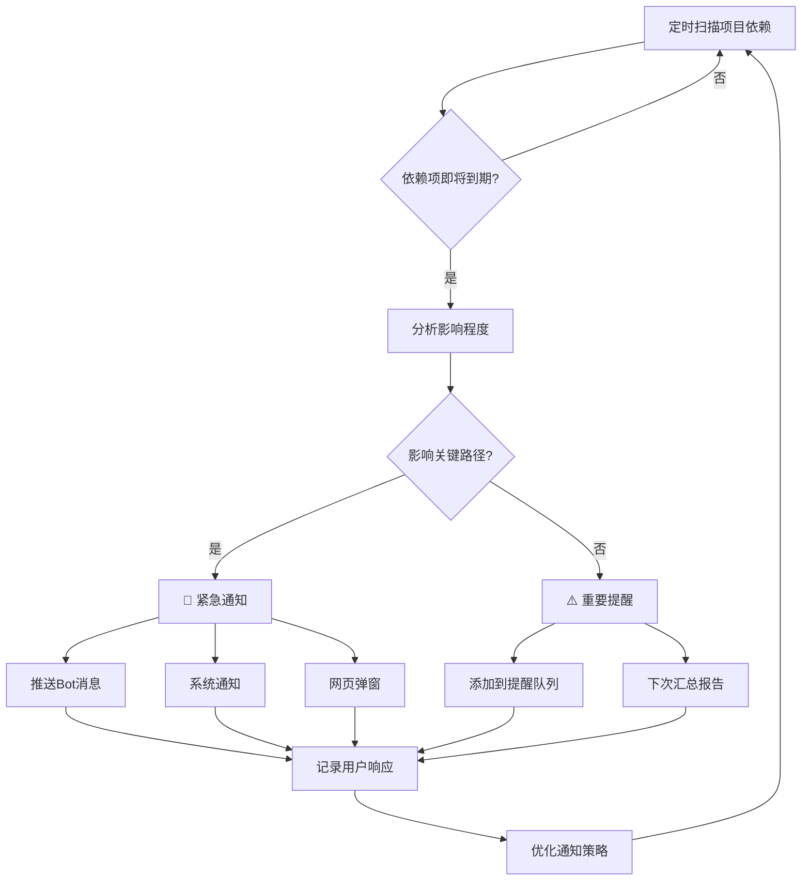
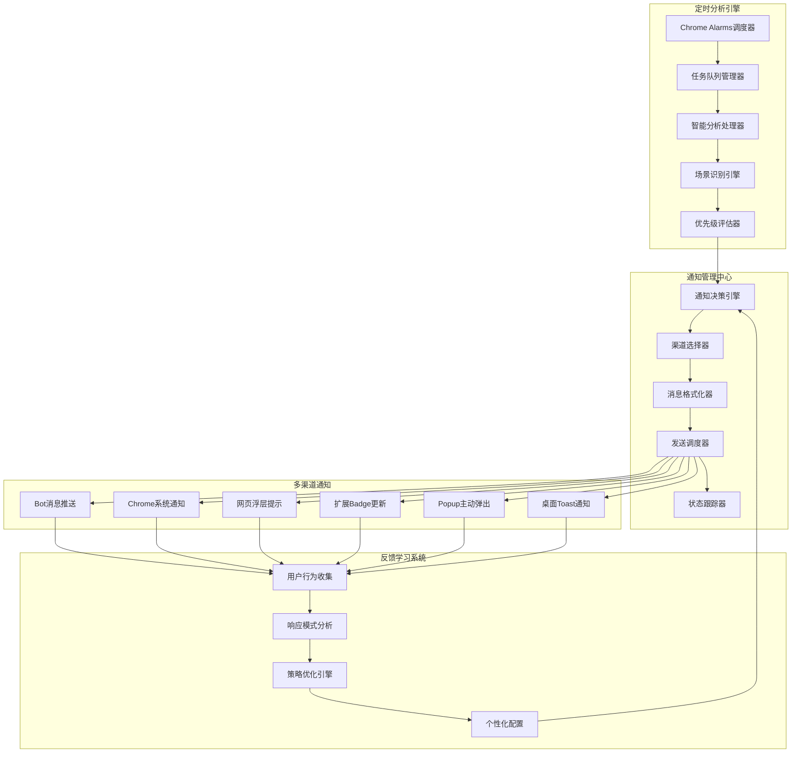

# 主动通知系统 - 智能项目预警与提醒

*最后更新: 2024-12-20*

## 系统概述

主动通知系统是类人脑项目分析系统的关键组件，负责智能监控项目状态、识别需要关注的场景，并通过多种渠道主动通知用户。系统基于Chrome扩展的定时器机制，无需后端服务支持。

## 核心设计理念

### 1. 智能预警机制
- **前瞻性分析**：不只是报告当前状态，而是预测潜在问题
- **上下文感知**：结合项目历史、团队状态、依赖关系综合判断
- **学习优化**：根据用户反馈不断优化通知的准确性和时机

### 2. 多层次通知策略
- **紧急通知**：影响项目关键路径的问题立即通知
- **重要提醒**：需要关注但不紧急的事项定期汇总
- **智能摘要**：项目整体状态的周期性报告

### 3. 用户体验优先
- **非打扰原则**：智能判断用户当前状态，选择合适的通知方式
- **可配置性**：用户可以自定义通知类型、频率和渠道
- **操作便捷**：提供快速响应和处理选项

## 通知触发场景设计

### 1. 依赖项监控场景


### 2. 智能场景识别

#### 高优先级场景（立即通知）
1. **关键依赖即将逾期**
   - 依赖项距离截止日期 < 3天
   - 且该依赖在项目关键路径上
   - 近期无进展更新

2. **团队协作阻塞**
   - 任务等待其他团队输入 > 5天
   - 多次提及但无明确回复
   - 影响里程碑进度

3. **风险升级**
   - 新识别的高风险项
   - 现有风险状态恶化
   - 多个风险同时出现

4. **关键人员状态变化**
   - 项目关键人员长时间无响应
   - 关键人员工作负载过高
   - 技能关键路径上的人员瓶颈

#### 中优先级场景（汇总提醒）
1. **进度偏差**
   - 里程碑进度落后10%以上
   - 任务完成率低于预期
   - 工作量估算偏差较大

2. **沟通异常**
   - 关键讨论缺少参与
   - 决策等待确认时间过长
   - 信息同步不及时

3. **资源优化机会**
   - 团队负载不均衡
   - 技能匹配优化建议
   - 工具效率提升机会

## 多渠道通知架构

### 通知渠道能力分析

| 通知方式 | 即时性 | 用户注意力 | 适用场景 | 技术实现 |
|---------|--------|-----------|----------|----------|
| Bot推送 | ⭐⭐⭐ | ⭐⭐⭐⭐⭐ | 紧急重要事项 | ✅ 已实现 |
| Chrome通知 | ⭐⭐⭐⭐ | ⭐⭐⭐ | 中等重要提醒 | 🆕 新增 |
| 网页浮层 | ⭐⭐ | ⭐⭐⭐⭐ | 浏览时展示 | 🆕 新增 |
| Badge数字 | ⭐ | ⭐⭐ | 待处理事项计数 | 🆕 新增 |
| Popup主动弹出 | ⭐⭐⭐ | ⭐⭐⭐⭐⭐ | 极紧急事项 | 🆕 新增 |
| 桌面Toast | ⭐⭐⭐⭐ | ⭐⭐ | 快速提醒 | 🆕 新增 |

### 智能渠道选择策略

```typescript
interface NotificationStrategy {
  // 根据紧急程度、用户状态、时间等因素选择最佳通知方式
  selectChannels(notification: NotificationItem, userContext: UserContext): NotificationChannel[];
}

interface UserContext {
  isActive: boolean;           // 用户是否活跃
  currentActivity: string;     // 当前活动（浏览、工作等）
  timeOfDay: 'work' | 'break' | 'off';
  notificationHistory: RecentNotification[];
  preferences: UserPreferences;
}

// 智能选择示例
const strategyRules = {
  urgent: {
    work_hours: ['bot', 'chrome_notification', 'popup'],
    break_time: ['bot', 'badge'],
    off_hours: ['bot']
  },
  important: {
    work_hours: ['chrome_notification', 'web_overlay'],
    break_time: ['badge'],
    off_hours: ['badge']
  },
  info: {
    work_hours: ['web_overlay', 'badge'],
    break_time: ['badge'],
    off_hours: []
  }
};
```

## 系统架构设计

### 核心组件架构



### 定时任务调度设计

```typescript
interface ScheduledTask {
  id: string;
  name: string;
  frequency: number;        // 执行间隔（分钟）
  priority: 'high' | 'medium' | 'low';
  lastRun: number;
  nextRun: number;
  enabled: boolean;
  processor: TaskProcessor;
}

// 预定义的定时任务
const scheduledTasks: ScheduledTask[] = [
  {
    id: 'dependency-monitor',
    name: '依赖项监控',
    frequency: 30,          // 每30分钟检查一次
    priority: 'high',
    processor: 'DependencyMonitor'
  },
  {
    id: 'project-health-check',
    name: '项目健康检查',
    frequency: 120,         // 每2小时检查一次
    priority: 'medium',
    processor: 'ProjectHealthChecker'
  },
  {
    id: 'team-collaboration-analysis',
    name: '团队协作分析',
    frequency: 240,         // 每4小时分析一次
    priority: 'low',
    processor: 'CollaborationAnalyzer'
  },
  {
    id: 'daily-summary',
    name: '每日摘要生成',
    frequency: 1440,        // 每24小时生成一次
    priority: 'medium',
    processor: 'DailySummaryGenerator'
  }
];
```

## 具体实现方案

### 1. 依赖项监控处理器

```typescript
class DependencyMonitor {
  async analyze(): Promise<NotificationItem[]> {
    const notifications: NotificationItem[] = [];
    
    // 1. 获取所有项目的依赖项
    const projects = await this.getActiveProjects();
    
    for (const project of projects) {
      const dependencies = await this.getProjectDependencies(project.id);
      
      // 2. 分析每个依赖项的状态
      for (const dependency of dependencies) {
        const analysis = await this.analyzeDependency(dependency);
        
        if (analysis.requiresNotification) {
          notifications.push({
            id: `dep-${dependency.id}-${Date.now()}`,
            type: 'dependency_alert',
            priority: analysis.priority,
            title: this.generateTitle(dependency, analysis),
            message: this.generateMessage(dependency, analysis),
            data: {
              dependency,
              analysis,
              project,
              suggestedActions: analysis.suggestedActions
            },
            createdAt: Date.now()
          });
        }
      }
    }
    
    return notifications;
  }
  
  private async analyzeDependency(dependency: Dependency): Promise<DependencyAnalysis> {
    const now = Date.now();
    const timeToDeadline = dependency.estimatedCompletion.getTime() - now;
    const daysToDadline = timeToDeadline / (1000 * 60 * 60 * 24);
    
    // 分析逻辑
    const analysis: DependencyAnalysis = {
      requiresNotification: false,
      priority: 'low',
      riskLevel: 'low',
      suggestedActions: []
    };
    
    // 时间紧迫性分析
    if (daysToDadline <= 1 && dependency.status !== 'completed') {
      analysis.requiresNotification = true;
      analysis.priority = 'urgent';
      analysis.riskLevel = 'high';
      analysis.suggestedActions.push({
        type: 'immediate_contact',
        description: '立即联系依赖团队确认状态',
        contactPerson: dependency.contactPerson
      });
    } else if (daysToDadline <= 3 && dependency.status === 'pending') {
      analysis.requiresNotification = true;
      analysis.priority = 'important';
      analysis.riskLevel = 'medium';
      analysis.suggestedActions.push({
        type: 'status_inquiry',
        description: '询问依赖项当前进展',
        contactPerson: dependency.contactPerson
      });
    }
    
    // 长期无更新分析
    const lastUpdateDays = (now - dependency.lastUpdate) / (1000 * 60 * 60 * 24);
    if (lastUpdateDays > 7 && dependency.status === 'in-progress') {
      analysis.requiresNotification = true;
      analysis.priority = 'important';
      analysis.suggestedActions.push({
        type: 'progress_check',
        description: '检查进展并更新状态',
        reason: '超过一周无状态更新'
      });
    }
    
    // 关键路径影响分析
    if (dependency.criticality === 'high' && analysis.requiresNotification) {
      analysis.priority = analysis.priority === 'important' ? 'urgent' : analysis.priority;
    }
    
    return analysis;
  }
}
```

### 2. 多渠道通知管理器

```typescript
class NotificationManager {
  private channels: Map<string, NotificationChannel> = new Map();
  private strategy: NotificationStrategy;
  private userPreferences: UserPreferences;
  
  constructor() {
    this.initializeChannels();
    this.strategy = new SmartNotificationStrategy();
    this.loadUserPreferences();
  }
  
  async sendNotification(notification: NotificationItem): Promise<void> {
    // 1. 获取用户当前上下文
    const userContext = await this.getUserContext();
    
    // 2. 选择最佳通知渠道
    const selectedChannels = this.strategy.selectChannels(notification, userContext);
    
    // 3. 格式化消息
    const formattedMessages = await this.formatForChannels(notification, selectedChannels);
    
    // 4. 发送通知
    const results = await Promise.allSettled(
      selectedChannels.map(async (channelName, index) => {
        const channel = this.channels.get(channelName);
        if (channel) {
          return await channel.send(formattedMessages[index]);
        }
      })
    );
    
    // 5. 记录发送结果
    await this.recordNotificationResult(notification, selectedChannels, results);
    
    // 6. 更新用户学习数据
    await this.updateLearningData(notification, userContext, selectedChannels);
  }
  
  private initializeChannels(): void {
    this.channels.set('bot', new BotNotificationChannel());
    this.channels.set('chrome', new ChromeNotificationChannel());
    this.channels.set('web_overlay', new WebOverlayChannel());
    this.channels.set('badge', new BadgeNotificationChannel());
    this.channels.set('popup', new PopupNotificationChannel());
    this.channels.set('toast', new ToastNotificationChannel());
  }
}

// 具体通知渠道实现
class ChromeNotificationChannel implements NotificationChannel {
  async send(message: FormattedMessage): Promise<NotificationResult> {
    try {
      const notificationId = await chrome.notifications.create({
        type: 'basic',
        iconUrl: 'icons/icon48.png',
        title: message.title,
        message: message.body,
        priority: this.mapPriority(message.priority),
        buttons: message.actions?.map(action => ({
          title: action.label
        })),
        requireInteraction: message.priority === 'urgent'
      });
      
      // 监听用户交互
      chrome.notifications.onClicked.addListener((clickedId) => {
        if (clickedId === notificationId) {
          this.handleNotificationClick(message);
        }
      });
      
      chrome.notifications.onButtonClicked.addListener((clickedId, buttonIndex) => {
        if (clickedId === notificationId && message.actions) {
          this.handleActionClick(message.actions[buttonIndex]);
        }
      });
      
      return { success: true, notificationId };
      
    } catch (error) {
      console.error('Chrome notification failed:', error);
      return { success: false, error: error.message };
    }
  }
  
  private mapPriority(priority: string): number {
    const priorityMap = {
      'urgent': 2,
      'important': 1,
      'info': 0
    };
    return priorityMap[priority] || 0;
  }
  
  private handleNotificationClick(message: FormattedMessage): void {
    // 打开相关页面或执行默认操作
    if (message.defaultAction) {
      this.executeAction(message.defaultAction);
    }
    
    // 记录用户交互
    this.recordUserInteraction('click', message);
  }
  
  private handleActionClick(action: NotificationAction): void {
    this.executeAction(action);
    this.recordUserInteraction('action', action);
  }
}

class WebOverlayChannel implements NotificationChannel {
  async send(message: FormattedMessage): Promise<NotificationResult> {
    try {
      // 向所有活跃的标签页发送显示浮层的消息
      const tabs = await chrome.tabs.query({ active: true });
      
      for (const tab of tabs) {
        if (tab.id) {
          chrome.tabs.sendMessage(tab.id, {
            type: 'SHOW_WEB_OVERLAY',
            data: {
              title: message.title,
              body: message.body,
              priority: message.priority,
              actions: message.actions,
              autoHide: message.priority !== 'urgent',
              hideDelay: this.getHideDelay(message.priority)
            }
          });
        }
      }
      
      return { success: true };
      
    } catch (error) {
      console.error('Web overlay notification failed:', error);
      return { success: false, error: error.message };
    }
  }
  
  private getHideDelay(priority: string): number {
    const delayMap = {
      'urgent': 0,      // 不自动隐藏
      'important': 15000, // 15秒
      'info': 8000      // 8秒
    };
    return delayMap[priority] || 8000;
  }
}

class BadgeNotificationChannel implements NotificationChannel {
  async send(message: FormattedMessage): Promise<NotificationResult> {
    try {
      // 获取当前badge数字
      const currentBadge = await chrome.action.getBadgeText({});
      const currentCount = parseInt(currentBadge) || 0;
      
      // 更新badge数字
      await chrome.action.setBadgeText({
        text: (currentCount + 1).toString()
      });
      
      // 设置badge颜色
      const badgeColor = this.getBadgeColor(message.priority);
      await chrome.action.setBadgeBackgroundColor({ color: badgeColor });
      
      // 更新tooltip
      await chrome.action.setTitle({
        title: `Personal AI - ${currentCount + 1} 条待处理通知`
      });
      
      return { success: true };
      
    } catch (error) {
      console.error('Badge notification failed:', error);
      return { success: false, error: error.message };
    }
  }
  
  private getBadgeColor(priority: string): string {
    const colorMap = {
      'urgent': '#FF4444',    // 红色
      'important': '#FF8800', // 橙色
      'info': '#4488FF'      // 蓝色
    };
    return colorMap[priority] || '#4488FF';
  }
}
```

### 3. 智能通知策略

```typescript
class SmartNotificationStrategy implements NotificationStrategy {
  selectChannels(notification: NotificationItem, userContext: UserContext): NotificationChannel[] {
    const channels: NotificationChannel[] = [];
    
    // 基于优先级的基础策略
    const baseChannels = this.getBaseChannelsByPriority(notification.priority);
    
    // 基于用户状态的调整
    const adjustedChannels = this.adjustForUserContext(baseChannels, userContext);
    
    // 基于用户偏好的过滤
    const filteredChannels = this.filterByUserPreferences(adjustedChannels, userContext.preferences);
    
    // 基于通知历史的去重和延迟
    const finalChannels = this.applyHistoryRules(filteredChannels, userContext.notificationHistory);
    
    return finalChannels;
  }
  
  private getBaseChannelsByPriority(priority: string): string[] {
    const channelMap = {
      'urgent': ['bot', 'chrome', 'popup'],
      'important': ['chrome', 'web_overlay', 'badge'],
      'info': ['web_overlay', 'badge']
    };
    return channelMap[priority] || ['badge'];
  }
  
  private adjustForUserContext(channels: string[], userContext: UserContext): string[] {
    const adjusted = [...channels];
    
    // 如果用户不活跃，移除即时通知渠道
    if (!userContext.isActive) {
      const immediateChannels = ['popup', 'web_overlay'];
      return adjusted.filter(ch => !immediateChannels.includes(ch));
    }
    
    // 如果在非工作时间，减少打扰
    if (userContext.timeOfDay === 'off') {
      return adjusted.filter(ch => ['bot', 'badge'].includes(ch));
    }
    
    // 如果用户正在专注工作，避免弹窗
    if (userContext.currentActivity === 'focused_work') {
      return adjusted.filter(ch => ch !== 'popup');
    }
    
    return adjusted;
  }
  
  private filterByUserPreferences(channels: string[], preferences: UserPreferences): string[] {
    return channels.filter(channel => {
      return preferences.enabledChannels.includes(channel) &&
             !preferences.disabledChannels.includes(channel);
    });
  }
  
  private applyHistoryRules(channels: string[], history: RecentNotification[]): string[] {
    // 检查最近是否有相同类型的通知
    const recentSimilar = history.find(n => 
      Date.now() - n.timestamp < 30 * 60 * 1000 && // 30分钟内
      n.type === 'same_type'
    );
    
    if (recentSimilar) {
      // 如果最近有相同通知，只保留最不打扰的渠道
      return channels.filter(ch => ['badge', 'web_overlay'].includes(ch));
    }
    
    return channels;
  }
}
```

## Chrome扩展定时器实现

### Enhanced Background Service

```typescript
// 增强的background.ts片段
class ProactiveNotificationService {
  private taskScheduler: TaskScheduler;
  private notificationManager: NotificationManager;
  private analysisEngine: AnalysisEngine;
  
  async initialize(): Promise<void> {
    this.taskScheduler = new TaskScheduler();
    this.notificationManager = new NotificationManager();
    this.analysisEngine = new AnalysisEngine();
    
    // 设置定时任务
    await this.setupScheduledTasks();
    
    // 监听定时器事件
    chrome.alarms.onAlarm.addListener(this.handleAlarm.bind(this));
    
    // 监听用户交互
    this.setupInteractionListeners();
    
    console.log('🔔 Proactive Notification Service initialized');
  }
  
  private async setupScheduledTasks(): Promise<void> {
    const tasks = [
      { name: 'dependency-monitor', frequency: 30 },
      { name: 'project-health-check', frequency: 120 },
      { name: 'team-collaboration-analysis', frequency: 240 },
      { name: 'daily-summary', frequency: 1440 }
    ];
    
    for (const task of tasks) {
      await chrome.alarms.create(task.name, {
        delayInMinutes: task.frequency,
        periodInMinutes: task.frequency
      });
    }
  }
  
  private async handleAlarm(alarm: chrome.alarms.Alarm): Promise<void> {
    console.log(`⏰ Handling scheduled task: ${alarm.name}`);
    
    try {
      const notifications = await this.runAnalysisTask(alarm.name);
      
      for (const notification of notifications) {
        await this.notificationManager.sendNotification(notification);
      }
      
      // 记录任务执行结果
      await this.recordTaskExecution(alarm.name, notifications.length);
      
    } catch (error) {
      console.error(`❌ Task execution failed for ${alarm.name}:`, error);
      await this.handleTaskError(alarm.name, error);
    }
  }
  
  private async runAnalysisTask(taskName: string): Promise<NotificationItem[]> {
    switch (taskName) {
      case 'dependency-monitor':
        return await this.analysisEngine.analyzeDependencies();
        
      case 'project-health-check':
        return await this.analysisEngine.analyzeProjectHealth();
        
      case 'team-collaboration-analysis':
        return await this.analysisEngine.analyzeTeamCollaboration();
        
      case 'daily-summary':
        return await this.analysisEngine.generateDailySummary();
        
      default:
        console.warn(`Unknown task: ${taskName}`);
        return [];
    }
  }
  
  private setupInteractionListeners(): void {
    // 监听通知点击
    chrome.notifications.onClicked.addListener(async (notificationId) => {
      await this.handleNotificationInteraction(notificationId, 'click');
    });
    
    // 监听通知按钮点击
    chrome.notifications.onButtonClicked.addListener(async (notificationId, buttonIndex) => {
      await this.handleNotificationInteraction(notificationId, 'button', buttonIndex);
    });
    
    // 监听扩展图标点击
    chrome.action.onClicked.addListener(async (tab) => {
      await this.handleExtensionIconClick(tab);
    });
  }
  
  private async handleNotificationInteraction(
    notificationId: string, 
    action: string, 
    buttonIndex?: number
  ): Promise<void> {
    // 记录用户交互行为
    await this.recordUserInteraction({
      notificationId,
      action,
      buttonIndex,
      timestamp: Date.now()
    });
    
    // 执行相应的响应操作
    await this.executeNotificationResponse(notificationId, action, buttonIndex);
    
    // 更新学习算法
    await this.updateLearningModel(notificationId, action);
  }
}

// 任务调度器
class TaskScheduler {
  private tasks: Map<string, ScheduledTask> = new Map();
  private runningTasks: Set<string> = new Set();
  
  async scheduleTask(task: ScheduledTask): Promise<void> {
    this.tasks.set(task.id, task);
    
    await chrome.alarms.create(task.id, {
      delayInMinutes: task.frequency,
      periodInMinutes: task.frequency
    });
    
    console.log(`📅 Scheduled task: ${task.name} (every ${task.frequency} minutes)`);
  }
  
  async executeTask(taskId: string): Promise<void> {
    if (this.runningTasks.has(taskId)) {
      console.warn(`⚠️ Task ${taskId} is already running, skipping...`);
      return;
    }
    
    const task = this.tasks.get(taskId);
    if (!task || !task.enabled) {
      return;
    }
    
    this.runningTasks.add(taskId);
    
    try {
      console.log(`🚀 Executing task: ${task.name}`);
      const startTime = Date.now();
      
      const result = await task.processor.execute();
      
      const duration = Date.now() - startTime;
      console.log(`✅ Task completed: ${task.name} (${duration}ms)`);
      
      // 更新任务统计
      await this.updateTaskStats(taskId, duration, result);
      
    } catch (error) {
      console.error(`❌ Task failed: ${task.name}`, error);
      await this.handleTaskFailure(taskId, error);
      
    } finally {
      this.runningTasks.delete(taskId);
    }
  }
  
  async pauseTask(taskId: string): Promise<void> {
    const task = this.tasks.get(taskId);
    if (task) {
      task.enabled = false;
      await chrome.alarms.clear(taskId);
      console.log(`⏸️ Paused task: ${task.name}`);
    }
  }
  
  async resumeTask(taskId: string): Promise<void> {
    const task = this.tasks.get(taskId);
    if (task) {
      task.enabled = true;
      await this.scheduleTask(task);
      console.log(`▶️ Resumed task: ${task.name}`);
    }
  }
}
```

## 用户配置界面

### 通知偏好设置

```typescript
interface NotificationPreferences {
  // 渠道偏好
  channels: {
    bot: {
      enabled: boolean;
      urgentOnly: boolean;
      quietHours: { start: string; end: string; };
    };
    chrome: {
      enabled: boolean;
      priority: 'all' | 'important' | 'urgent';
      sound: boolean;
    };
    webOverlay: {
      enabled: boolean;
      position: 'top-right' | 'top-left' | 'bottom-right' | 'bottom-left';
      autoHide: boolean;
    };
    badge: {
      enabled: boolean;
      showCount: boolean;
    };
  };
  
  // 场景偏好
  scenarios: {
    dependencies: {
      enabled: boolean;
      urgentThresholdDays: number;
      importantThresholdDays: number;
    };
    projectHealth: {
      enabled: boolean;
      checkFrequency: number;
    };
    teamCollaboration: {
      enabled: boolean;
      silentPeriodHours: number;
    };
  };
  
  // 时间偏好
  schedule: {
    workHours: { start: string; end: string; };
    timezone: string;
    weekends: boolean;
  };
  
  // 学习偏好
  learning: {
    adaptToUserBehavior: boolean;
    personalizedTiming: boolean;
    contextAwareness: boolean;
  };
}

// 设置界面组件
const NotificationSettingsPanel: React.FC = () => {
  const [preferences, setPreferences] = useState<NotificationPreferences>();
  const [testMode, setTestMode] = useState(false);
  
  const handleTestNotification = async (channel: string, priority: string) => {
    await chrome.runtime.sendMessage({
      type: 'TEST_NOTIFICATION',
      channel,
      priority,
      message: {
        title: '测试通知',
        body: `这是一个${priority}优先级的${channel}渠道测试通知`,
        actions: [
          { label: '已读', action: 'mark_read' },
          { label: '稍后提醒', action: 'snooze' }
        ]
      }
    });
  };
  
  return (
    <div className="notification-settings">
      <h2>主动通知设置</h2>
      
      {/* 通知渠道设置 */}
      <Section title="通知渠道">
        <ChannelSettings 
          preferences={preferences?.channels}
          onChange={(channels) => updatePreferences({ channels })}
          onTest={handleTestNotification}
        />
      </Section>
      
      {/* 场景设置 */}
      <Section title="监控场景">
        <ScenarioSettings
          preferences={preferences?.scenarios}
          onChange={(scenarios) => updatePreferences({ scenarios })}
        />
      </Section>
      
      {/* 时间设置 */}
      <Section title="时间安排">
        <ScheduleSettings
          preferences={preferences?.schedule}
          onChange={(schedule) => updatePreferences({ schedule })}
        />
      </Section>
      
      {/* 测试区域 */}
      <Section title="测试通知">
        <TestNotificationPanel onTest={handleTestNotification} />
      </Section>
    </div>
  );
};
```

## 性能优化策略

### 1. 智能频率调整
```typescript
class AdaptiveScheduler {
  // 根据项目活跃度动态调整检查频率
  async adjustTaskFrequency(taskId: string): Promise<void> {
    const task = this.tasks.get(taskId);
    const projectActivity = await this.analyzeProjectActivity();
    
    if (projectActivity.level === 'high') {
      // 高活跃度项目：增加检查频率
      task.frequency = Math.max(task.baseFrequency * 0.5, 15);
    } else if (projectActivity.level === 'low') {
      // 低活跃度项目：降低检查频率
      task.frequency = Math.min(task.baseFrequency * 2, 480);
    }
    
    await this.rescheduleTask(task);
  }
}
```

### 2. 缓存和去重
```typescript
class NotificationDeduplicator {
  private recentNotifications: Map<string, number> = new Map();
  private DUPLICATE_THRESHOLD = 30 * 60 * 1000; // 30分钟
  
  isDuplicate(notification: NotificationItem): boolean {
    const key = this.generateNotificationKey(notification);
    const lastSent = this.recentNotifications.get(key);
    
    if (lastSent && Date.now() - lastSent < this.DUPLICATE_THRESHOLD) {
      return true;
    }
    
    this.recentNotifications.set(key, Date.now());
    return false;
  }
  
  private generateNotificationKey(notification: NotificationItem): string {
    return `${notification.type}-${notification.data.dependency?.id || notification.data.project?.id}`;
  }
}
```

## 预期效果和使用场景

### 典型使用场景示例

#### 场景1：依赖项即将逾期
1. **触发条件**：设计团队的UI稿依赖项还有2天到期，但状态仍是"进行中"
2. **系统分析**：检测到关键路径依赖即将逾期
3. **通知策略**：
   - Bot推送：立即发送详细信息和建议行动
   - Chrome通知：显示快速概览和操作按钮
   - Badge更新：显示紧急事项计数
4. **用户操作**：点击"联系设计团队"按钮，系统自动打开聊天界面

#### 场景2：项目风险升级
1. **触发条件**：检测到多个团队成员工作负载过高，且关键任务进度落后
2. **系统分析**：识别为资源冲突风险升级
3. **通知策略**：
   - 工作时间：Chrome通知 + 网页浮层
   - 休息时间：仅Badge更新，避免打扰
4. **建议行动**：提供资源重新分配建议和风险缓解方案

#### 场景3：每日项目摘要
1. **触发时间**：每天工作结束前1小时
2. **内容生成**：
   - 今日完成的关键任务
   - 明日需要关注的重点
   - 潜在风险和建议
3. **通知方式**：Bot推送综合报告，Badge显示待处理事项数量

### 系统学习能力展示

**第一周**：用户经常忽略下午的Chrome通知
**系统学习**：下午时段降低Chrome通知使用，增加网页浮层比重

**第二周**：用户总是立即处理依赖项相关的通知  
**系统学习**：提高依赖项通知的优先级，使用更显著的通知方式

**第三周**：用户设置了专注工作时段（9-11 AM）
**系统学习**：在专注时段避免弹窗，改用Badge和延迟推送

---

通过这个主动通知系统，您的项目管理将从"被动查询"进化为"主动预警"，真正实现智能化的项目风险管控和团队协作优化。系统会像一个贴心的项目助理，在合适的时间、用合适的方式提醒您关注重要事项。