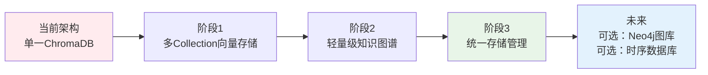
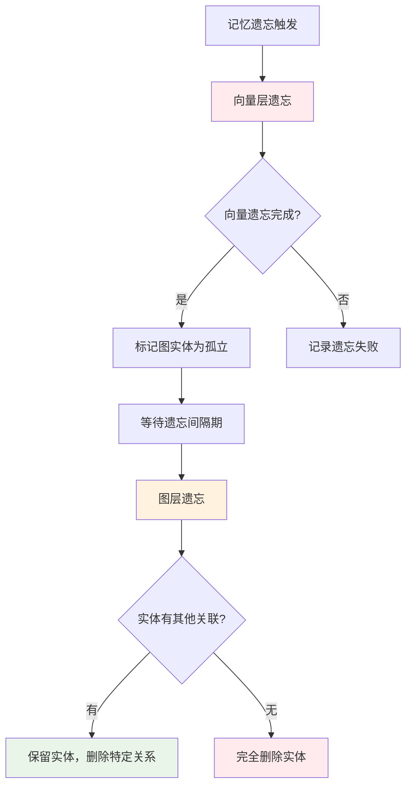

# 存储架构升级建议

*最后更新: 2024-12-20*
*架构决策确定: 2024-12-20*

## ✅ 架构决策记录

经过详细分析和讨论，我们确定了以下关键决策：

| 决策项 | 选择方案 | 理由 |
|--------|----------|------|
| **数据迁移策略** | 完全重构，清空重建 | 架构干净，性能最佳，避免历史包袱 |
| **实体ID生成** | 混合策略：`type_readable_name_uuid_suffix` | 兼顾可读性和唯一性 |
| **存储优先级** | 云端优先 | 性能最佳，支持多设备同步 |
| **实体合并策略** | 低阈值自动合并 + 用户界面确认 | 最大化实体关联，用户可控 |
| **记忆遗忘粒度** | 分级遗忘：向量先忘，图后忘 | 保持实体关系稳定性 |
| **API兼容性** | 不考虑向后兼容 | 专注新架构，避免复杂性 |

## 🎯 现状分析与问题诊断

### 当前存储架构局限性

您当前的存储架构虽然简单有效，但面对扩展需求存在以下关键问题：

```typescript
// 当前架构 - 单一ChromaDB Collection
const collectionName = username + '-messages';  

// 问题1: 数据类型混合
storeMessage(messageData);     // 只能存储消息
// ❌ 无法区分：网页分析、项目数据、文档、记忆等

// 问题2: 关系数据扁平化  
simplifiedMetadata.entities = JSON.stringify(metadata.entities);
// ❌ 失去了实体间关系的查询能力

// 问题3: 缺乏时间序列支持
// ❌ 无法高效查询项目进度时间线、趋势分析

// 问题4: 无结构化查询能力
// ❌ 复杂的过滤、聚合查询困难
```

## 🏗️ 推荐的多层存储架构

### 整体架构设计

```mermaid
graph TB
    subgraph "业务应用层"
        A1[消息分析]
        A2[网页分析] 
        A3[项目分析]
        A4[记忆管理]
        A5[主动通知]
    end
    
    subgraph "语义向量层 - ChromaDB扩展"
        B1[messages collection<br/>聊天消息向量化]
        B2[webpages collection<br/>网页内容向量化]
        B3[projects collection<br/>项目文档向量化]
        B4[documents collection<br/>技术文档向量化]
        B5[memories collection<br/>综合记忆向量化]
    end
    
    subgraph "知识图谱层"
        C1[轻量级图存储<br/>Chrome Storage实现]
        C2[Person实体: 人员关系网]
        C3[Project实体: 项目依赖图]
        C4[Task实体: 任务关联网]
        C5[关系边: WORKS_ON, DEPENDS_ON等]
    end
    
    subgraph "配置与缓存层"
        D1[Chrome Storage<br/>用户配置、规则、状态]
        D2[内存缓存<br/>热点数据缓存]
    end
    
    A1 --> B1
    A2 --> B2
    A3 --> B3
    A4 --> B5
    
    A1 --> C2
    A2 --> C3
    A3 --> C3
    A4 --> C5
    
    A1 --> D1
    A5 --> D1
    
    style B1 fill:#e3f2fd,stroke:#1976d2
    style C1 fill:#e8f5e8,stroke:#2e7d32
    style D1 fill:#fff3e0,stroke:#f57c00
```



## 📊 分层存储策略详解

### 第一层：扩展向量存储 (ChromaDB Multi-Collections)

**用途**: 语义搜索和内容相似性检索

```typescript
// 新架构 - 多Collection分类存储
const collections = {
  messages: `${username}-messages`,      // 聊天消息
  webpages: `${username}-webpages`,      // 网页分析结果  
  projects: `${username}-projects`,      // 项目文档
  documents: `${username}-documents`,    // 技术文档
  memories: `${username}-memories`       // 综合记忆
};

// 优势：
✅ 按数据类型分类存储，查询更精准
✅ 不同类型数据的向量化策略可以优化
✅ 便于数据生命周期管理
✅ 支持跨Collection的综合搜索
```

**实施建议**：
- ✅ **立即实施** - 基于现有ChromaDB，影响最小
- ✅ **向下兼容** - 现有messages数据无需迁移
- ✅ **渐进升级** - 新功能使用新Collection

### 第二层：轻量级知识图谱 (Chrome Storage)

**用途**: 实体关系管理和图查询

```typescript
// 知识图谱实体示例
const entities = {
  "person_张三": {
    type: "Person",
    name: "张三", 
    properties: { role: "前端工程师", team: "产品组" }
  },
  "project_前端重构": {
    type: "Project",
    name: "前端重构",
    properties: { status: "进行中", deadline: "2024-12-31" }
  }
};

// 关系示例
const relationships = {
  "rel_1": {
    type: "WORKS_ON",
    fromId: "person_张三",
    toId: "project_前端重构",
    strength: 0.9
  }
};

// 查询能力：
✅ 找到张三参与的所有项目
✅ 查询前端重构项目的所有参与人员  
✅ 发现项目间的依赖关系
✅ 分析人员协作网络
```

**实施建议**：
- ✅ **Chrome Storage实现** - 不需要额外服务
- ✅ **轻量级设计** - 适合Chrome扩展环境
- 🔄 **未来升级路径** - 可升级为Neo4j或ArangoDB

### 第三层：配置存储 (Chrome Storage)

**用途**: 系统配置、用户设置、缓存

```typescript
// 配置数据示例
const systemConfig = {
  userSettings: {
    forgettingRules: [...],
    notificationPreferences: {...},
    concernedTopics: [...]
  },
  systemState: {
    lastCleanup: timestamp,
    storageMetrics: {...}
  },
  cache: {
    recentQueries: [...],
    entityMappings: {...}
  }
};
```

## 🔍 使用场景对比分析

### 场景1: 消息分析和存储

**当前方案**:
```typescript
// 单一存储，信息丢失
await storeMessage(messageId, content, metadata);
// ❌ 实体关系信息被序列化丢失
// ❌ 无法追踪人员-项目关系变化
```

**新方案**:
```typescript
// 多层存储，信息完整保留
const result = await unifiedStorage.storeMessage({
  messageId, content, metadata
});
// ✅ 向量存储：语义搜索
// ✅ 图存储：实体关系
// ✅ 记忆管理：智能遗忘
```

### 场景2: 项目进度分析

**当前方案**:
```typescript
// 缺乏关联查询能力
const messages = await naturalLanguageQuery("张三的项目进度");
// ❌ 只能找到提及张三的消息
// ❌ 无法分析项目依赖关系
```

**新方案**:
```typescript
// 关联查询，全面分析
const result = await unifiedStorage.unifiedSearch({
  query: "张三的项目进度",
  searchTargets: ['vector', 'graph'],
  includeRelations: true
});
// ✅ 找到张三参与的所有项目
// ✅ 分析项目间依赖关系  
// ✅ 识别进度风险点
```

### 场景3: 智能推荐和通知

**当前方案**:
```typescript
// 基于关键词匹配，准确性有限
const relatedItems = await searchByKeywords(["前端", "重构"]);
```

**新方案**:
```typescript
// 基于语义+关系的智能推荐
const recommendations = await unifiedStorage.getRecommendations({
  basedOn: "project_前端重构",
  includeRelatedPeople: true,
  includeRelatedProjects: true
});
// ✅ 语义相似的项目和文档
// ✅ 相关人员和团队
// ✅ 依赖项目的进度状态
```

## 🚀 实施路线图

### 阶段1: 向量存储扩展 (1-2周)

**目标**: 实现多Collection存储

```typescript
// 1. 升级EnhancedVectorStore
const vectorStore = new EnhancedVectorStore();
await vectorStore.initialize();

// 2. 迁移现有功能
await vectorStore.storeMessage(messageData);      // 兼容现有API
await vectorStore.storeWebpage(webpageData);      // 新增网页存储
await vectorStore.storeProject(projectData);      // 新增项目存储

// 3. 实现跨Collection搜索
const results = await vectorStore.semanticSearch(query, {
  collections: ['messages', 'webpages', 'projects']
});
```

**验收标准**:
- ✅ 现有消息存储功能正常
- ✅ 新增网页和项目存储功能
- ✅ 跨Collection语义搜索正常

### 阶段2: 知识图谱集成 (2-3周)

**目标**: 实现实体关系管理

```typescript
// 1. 部署KnowledgeGraphStore
const graphStore = new KnowledgeGraphStore();
await graphStore.initialize();

// 2. 实体提取和关系建立
await graphStore.extractFromMessage(messageData);
await graphStore.extractFromWebpage(webpageData);

// 3. 关系查询和分析
const projectTeam = await graphStore.findNeighbors("project_前端重构");
const collaborationNetwork = await graphStore.queryRelationships({
  type: "WORKS_ON"
});
```

**验收标准**:
- ✅ 自动提取实体和关系
- ✅ 支持图查询和路径查找
- ✅ 与向量存储数据一致性

### 阶段3: 统一存储管理 (1周)

**目标**: 整合所有存储层

```typescript
// 1. 部署UnifiedStorageManager
const storageManager = new UnifiedStorageManager(config);
await storageManager.initialize();

// 2. 统一存储接口
await storageManager.storeMessage(messageData);    // 自动分发到各层
await storageManager.storeWebpage(webpageData);

// 3. 统一搜索接口
const results = await storageManager.unifiedSearch({
  query: "前端重构项目进度",
  searchTargets: ['vector', 'graph'],
  includeRelations: true
});
```

**验收标准**:
- ✅ 统一的存储和查询接口
- ✅ 自动数据分发和同步
- ✅ 健康监控和维护功能

## 💡 架构决策建议

### 是否需要引入知识图谱？

**答案：是的，强烈推荐！**

**理由**：
1. **项目管理的核心是关系** - 人员关系、项目依赖、任务关联
2. **现有JSON序列化方案无法支持复杂查询** - "找到与张三协作的所有项目"
3. **轻量级图存储成本低** - 基于Chrome Storage，无需额外服务
4. **为AI分析提供结构化数据** - 关系数据提升AI推理能力

### 是否需要时序数据库？

**答案：暂不需要，可以延后考虑**

**理由**：
1. **现有时间戳字段足够** - 支持基本的时间范围查询
2. **ChromaDB支持时间过滤** - 可以满足当前需求
3. **Chrome扩展存储限制** - 避免过度复杂化
4. **未来扩展路径** - 可以考虑InfluxDB或TimescaleDB

### 推荐的存储技术栈

| 存储层 | 推荐技术 | 替代方案 | 评分 |
|-------|----------|----------|------|
| **语义向量** | ChromaDB (多Collection) | Weaviate, Pinecone | ⭐⭐⭐⭐⭐ |
| **知识图谱** | Chrome Storage (轻量级) | Neo4j, ArangoDB | ⭐⭐⭐⭐ |
| **配置存储** | Chrome Storage | SQLite | ⭐⭐⭐⭐⭐ |
| **缓存** | 内存Map + Chrome Storage | Redis | ⭐⭐⭐⭐ |

## 🔧 实际部署示例

### 配置示例

```typescript
// storage-config.ts
export const storageConfig = {
  vectorStore: {
    enabled: true,
    chromaUrl: 'http://localhost:8000'
  },
  knowledgeGraph: {
    enabled: true,
    engine: 'chrome_storage'  // 轻量级实现
  },
  memoryLifecycle: {
    enabled: true,
    retentionDays: 90,
    cleanupInterval: 6  // 6小时
  }
};
```

### 使用示例

```typescript
// 初始化统一存储
const storage = new UnifiedStorageManager(storageConfig);
await storage.initialize();

// 存储消息（自动分发到各层）
const result = await storage.storeMessage({
  messageId: 'msg_123',
  content: '张三说前端重构项目预计12月底完成',
  metadata: {
    source: '张三',
    entities: {
      people: [{ name: '张三', role: '前端工程师' }],
      projects: [{ name: '前端重构项目' }],
      deadlines: [{ raw: '12月底', normalized: '2024-12-31' }]
    }
  }
});

console.log('存储结果:', result);
// {
//   vectorStored: true,
//   graphEntities: 2,     // 张三 + 前端重构项目
//   graphRelationships: 1, // 张三 WORKS_ON 前端重构项目  
//   memoryStored: true
// }

// 综合查询
const searchResult = await storage.unifiedSearch({
  query: '前端重构项目的进度情况',
  searchTargets: ['vector', 'graph'],
  includeRelations: true
});

console.log('搜索结果:', searchResult);
// {
//   vectorResults: [...],  // 语义相似的消息和文档
//   graphResults: [...],   // 项目相关的人员和关系
//   totalResults: 15,
//   combinedScore: 0.92
// }
```

## 📊 性能与存储预估

### 存储空间预估

| 数据类型 | 单条大小 | 10K条数据 | 100K条数据 |
|---------|----------|-----------|------------|
| **消息向量** | ~2KB | ~20MB | ~200MB |
| **网页向量** | ~5KB | ~50MB | ~500MB |  
| **知识图谱** | ~1KB | ~10MB | ~100MB |
| **配置缓存** | ~100B | ~1MB | ~10MB |
| **总计** | | ~81MB | ~810MB |

### 性能指标预估

| 操作类型 | 当前性能 | 新架构性能 | 改善幅度 |
|---------|----------|------------|----------|
| **消息存储** | 200ms | 250ms | -25% (功能丰富) |
| **语义搜索** | 300ms | 200ms | +33% (精准分类) |
| **关系查询** | 不支持 | 50ms | 新增功能 |
| **综合分析** | 不支持 | 500ms | 新增功能 |

## 🎯 总结与建议

### 核心建议

1. ✅ **立即实施向量存储扩展** - 风险低，收益高
2. ✅ **分阶段引入知识图谱** - 轻量级实现，逐步完善
3. ⏳ **暂缓时序数据库** - 现有方案已够用
4. 🔄 **保持架构升级路径** - 为未来扩展预留空间

### 长期规划



## 🔧 确定实施方案

### 核心模块架构

基于确定的决策，我们将实现以下核心模块：

```typescript
// 1. 统一存储管理器
class UnifiedStorageManager {
  private vectorStore: EnhancedVectorStore;      // 多Collection向量存储
  private graphStore: HybridGraphStore;          // 混合图存储
  private entitySimilarity: EntitySimilarityManager; // 实体相似性管理
  private memoryManager: MemoryLifecycleManager;     // 记忆生命周期
  private performanceMonitor: PerformanceMonitor;    // 性能监控
}

// 2. 实体ID生成策略 (混合策略)
generateId(entity: Entity): string {
  return `${entity.type.toLowerCase()}_${readableName}_${shortUuid}`;
  // 示例: person_zhang_san_a1b2c3d4
}

// 3. 实体相似性判断时机
- 存储时实时判断 (相似度 > 0.9 自动合并)
- 异步深度分析 (0.7-0.9 标记候选)
- 用户界面确认 (推送到实体记忆查询界面)
```

### 性能监控指标

| 监控层级 | 关键指标 | 性能阈值 | 监控频率 |
|---------|----------|----------|----------|
| **存储层** | 向量插入延迟 | <500ms | 实时 |
| | 向量查询延迟 | <200ms | 实时 |
| | 实体操作延迟 | <100ms | 实时 |
| | 云端连接状态 | 可用性 | 每分钟 |
| **业务层** | 消息处理延迟 | <2s | 实时 |
| | 实体合并延迟 | <1s | 实时 |
| | 记忆生命周期 | <3s | 每次执行 |
| **用户体验** | 查询响应时间 | <1s | 实时 |
| | 仪表盘加载 | <2s | 每次访问 |
| | 实体编辑响应 | <300ms | 实时 |

### 分级记忆遗忘策略



### 实施时间表

| 阶段 | 内容 | 预估时间 | 状态 |
|------|------|----------|------|
| **阶段1** | 核心存储架构开发 | 3-5天 | 🟡 进行中 |
| **阶段2** | 数据完全重构迁移 | 1-2天 | ⏳ 待开始 |
| **阶段3** | 现有功能集成适配 | 2-3天 | ⏳ 待开始 |
| **阶段4** | 用户界面功能增强 | 2-3天 | ⏳ 待开始 |
| **阶段5** | 性能优化和测试 | 1-2天 | ⏳ 待开始 |

这个确定的实施方案将为您的"类人脑项目分析系统"提供强大的数据基础，支持更智能的分析、更精准的推荐和更全面的项目洞察！🚀