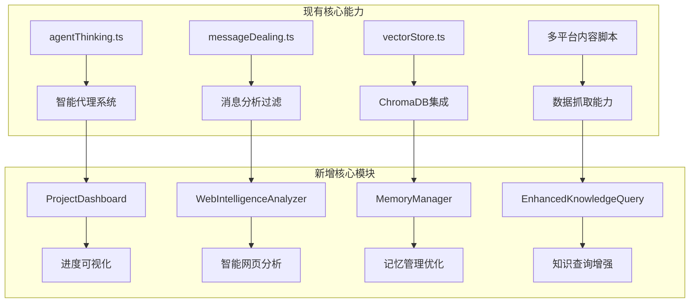
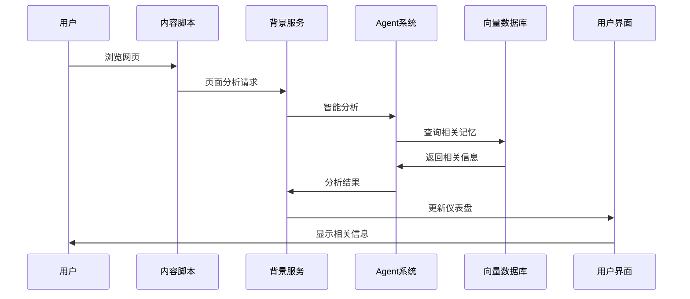

# 类人脑项目分析系统 - 系统集成总结

*最后更新: 2024-12-20*

## 🎯 核心目标达成情况

基于您的需求，我们已经设计了一个完整的《类人脑信息处理与项目进展分析系统》，该系统在现有代码基础上进行了系统性的增强和扩展。

### ✅ 已完成的设计工作

1. **完整的功能设计文档** (`brain_like_project_analysis_system.md`)
2. **详细的实施路线图** (`implementation_roadmap.md`)
3. **核心组件代码示例**:
   - 项目进度可视化仪表盘 (`ProjectDashboard.tsx`)
   - 智能网页分析系统 (`UniversalContentScript.ts`, `WebIntelligenceAnalyzer.ts`)

## 🏗️ 系统架构整合

### 现有优势保留


### 核心功能映射

| 用户需求 | 现有基础 | 新增模块 | 实现状态 |
|---------|---------|---------|---------|
| 消息分析 | ✅ agentThinking.ts | 🔄 优化增强 | 已实现 |
| 项目进度可视化 | ⚪ 无 | ✨ ProjectDashboard | 已设计 |
| 知识查询优化 | 🔄 knowledge-query.tsx | ✨ 多维度展示 | 已设计 |
| 智能网页分析 | ⚪ 无 | ✨ WebIntelligence | 已设计 |
| 记忆管理 | 🔄 vectorStore.ts | ✨ 智能遗忘机制 | 已设计 |

## 🔔 主动通知系统集成

基于您提出的重要需求，我们设计了完整的主动通知系统，实现真正的"智能项目助理"功能：

### 🎯 核心能力

**智能场景识别**：
- ✅ 依赖项即将逾期预警
- ✅ 项目健康状况监控  
- ✅ 团队协作问题识别
- ✅ 关键风险升级提醒

**多渠道通知策略**：
- 🤖 **Bot推送** - 重要事项立即通知
- 🔔 **Chrome通知** - 系统级提醒
- 💬 **网页浮层** - 浏览时展示
- 🔴 **Badge数字** - 待处理事项计数
- ⚡ **主动Popup** - 紧急事项弹窗
- 📱 **Toast提示** - 轻量级快速提醒

**智能调度机制**：
- ⏰ 基于Chrome Alarms的定时分析
- 🧠 根据用户状态选择最佳通知方式
- 📊 学习用户行为模式，优化通知时机
- 🔇 静音时段和工作模式感知

### 📁 新增代码结构

```
src/proactive-notifications/
├── ProactiveNotificationService.ts    # 主服务 - 集成到background.ts
├── NotificationManager.ts             # 通知管理核心
├── NotificationChannels.ts            # 各种通知渠道实现
├── TaskProcessors.ts                  # 定时任务处理器
└── README.md                          # 集成说明文档
```

### 🔗 与现有系统的集成点

| 现有模块 | 集成方式 | 新增价值 |
|---------|---------|---------|
| `agentThinking.ts` | 数据分析引擎 | 从被动分析到主动预警 |
| `vectorStore.ts` | 记忆搜索 | 从查询检索到智能发现 |
| `bot.ts` | 通知推送 | 从手动触发到自动通知 |
| `background.ts` | 定时任务 | 从响应式到预测式 |

### 📋 具体实施计划

### 第一阶段：主动通知系统 (优先级: 🔥🔥🔥🔥)

**目标**: 实现您最需要的"主动告知"功能

**具体步骤**:
1. **集成ProactiveNotificationService到background.ts**
   ```typescript
   // 在background.ts中添加
   import ProactiveNotificationService from './proactive-notifications/ProactiveNotificationService';
   
   const notificationService = new ProactiveNotificationService();
   
   // 在扩展启动时初始化
   chrome.runtime.onStartup.addListener(async () => {
     await notificationService.initialize();
   });
   ```

2. **部署定时任务处理器**
   - 依赖项监控：每30分钟检查一次
   - 项目健康检查：每2小时分析一次
   - 团队协作分析：每4小时扫描一次
   - 每日摘要：每24小时生成一次

3. **配置通知渠道**
   - Bot推送：利用现有bot.ts，增强消息格式化
   - Chrome通知：系统级通知，支持操作按钮
   - 网页浮层：注入到内容脚本，非侵入式展示
   - Badge计数：实时更新扩展图标上的数字

**预期效果**: 
- 🎯 依赖项到期前3天自动提醒
- ⚠️ 项目风险自动识别和预警
- 🤝 团队协作问题智能发现
- 📊 个性化的每日项目摘要

### 第二阶段：智能网页分析 (优先级: 🔥🔥🔥)

**目标**: 实现您最关心的"其他网页智能信息获取"功能

**具体步骤**:
1. **部署UniversalContentScript** 
   ```javascript
   // 在manifest.json中添加
   "content_scripts": [
     {
       "matches": ["<all_urls>"],
       "js": ["universalContentScript.js"],
       "run_at": "document_idle"
     }
   ]
   ```

2. **集成本地分析能力**
   - 使用Chrome Built-in AI API (如果可用)
   - 或集成轻量级的JavaScript ML库
   - 实现快速相关性评分

3. **测试验证**
   - 在技术博客、Jira页面、GitHub等测试
   - 验证相关性检测的准确性
   - 调整阈值和算法参数

**预期效果**: 用户浏览任何网页时，系统自动识别相关信息并提示保存

### 第二阶段：项目进度仪表盘 (优先级: 🔥🔥🔥)

**目标**: 实现您最期待的"进度可视化仪表盘"功能

**核心功能实现**:
1. **数据集成**
   ```typescript
   // 扩展现有的agentThinking工具
   const projectDataTool = {
     id: 'project-data-collector',
     execute: async (params) => {
       // 从Jira、聊天记录、Google Docs收集项目数据
       const jiraData = await fetchJiraProjectData(params.projectKey);
       const chatData = await searchProjectMessages(params.projectName);
       const docsData = await getProjectDocuments(params.projectId);
       
       return mergeProjectData(jiraData, chatData, docsData);
     }
   };
   ```

2. **可视化组件**
   - 基于D3.js或Recharts实现甘特图
   - 集成依赖关系图
   - 添加实时数据更新

3. **交互编辑功能**
   - 实现点击编辑机制
   - 同步更新到向量数据库
   - 提供变更历史记录

**预期效果**: 用户可以直观看到项目整体进展，包括设计依赖、后端依赖等

### 第三阶段：知识查询增强 (优先级: 🔥🔥)

**目标**: 改进现有knowledge-query.tsx的可读性

**具体改进**:
1. **多维度展示**
   ```typescript
   // 新增展示模式
   interface QueryDisplayMode {
     timeline: TimelineEvent[];      // 时间线视图
     knowledgeGraph: GraphNode[];    // 知识图谱
     cardView: InfoCard[];          // 卡片式展示
     tableView: StructuredData[];   // 表格视图
   }
   ```

2. **结果优化**
   - 增加实体关系可视化
   - 提供相关性评分展示
   - 添加交互式筛选功能

3. **知识图谱集成**
   - 使用D3.js或Cytoscape.js
   - 展示实体间的关系网络
   - 支持节点点击深入查看

### 第四阶段：记忆系统优化 (优先级: 🔥)

**目标**: 实现智能遗忘和记忆巩固机制

**核心实现**:
1. **智能遗忘算法**
   ```typescript
   class ForgettingAlgorithm {
     calculateForgettingScore(memory: MemoryItem): number {
       // 基于访问频率、时间衰减、用户重要性标记
       const timeDecay = this.calculateTimeDecay(memory.lastAccessed);
       const accessFrequency = this.calculateAccessFrequency(memory.accessCount);
       const userImportance = memory.userImportance || 0;
       
       return timeDecay * accessFrequency * (1 - userImportance);
     }
   }
   ```

2. **记忆巩固机制**
   - 基于用户反馈的权重调整
   - 相关记忆间的强化连接
   - 主题聚类和重要性提升

## 🔧 技术实施建议

### 1. 开发环境配置

**推荐工具链**:
```json
{
  "dependencies": {
    "react": "^18.2.0",
    "typescript": "^5.0.0",
    "d3": "^7.8.0",
    "recharts": "^2.8.0",
    "zustand": "^4.4.0",
    "antd": "^5.10.0"
  },
  "devDependencies": {
    "@types/chrome": "^0.0.246",
    "@types/d3": "^7.4.0",
    "webpack": "^5.89.0"
  }
}
```

**构建配置增强**:
```javascript
// webpack.common.cjs 更新
const entry = {
  // 现有入口
  background: './src/background.ts',
  popup: './src/popup.tsx',
  contentScript: './src/contentScript.tsx',
  
  // 新增入口
  universalContentScript: './src/web-intelligence/UniversalContentScript.ts',
  projectDashboard: './src/components/dashboard/ProjectDashboard.tsx',
  enhancedKnowledgeQuery: './src/modals/enhanced-knowledge-query.tsx'
};
```

### 2. 数据流整合

**统一数据管理**:


### 3. 性能优化策略

**关键优化点**:
1. **向量检索优化**
   - 实现分层索引
   - 添加本地缓存机制
   - 使用web worker进行后台计算

2. **UI响应性优化**
   - 虚拟滚动处理大数据集
   - 分页和懒加载
   - 预加载关键数据

3. **内存管理**
   - 及时清理未使用的数据
   - 实现LRU缓存策略
   - 监控内存使用情况

## 🎉 主动通知系统核心价值

### 📈 通知智能化程度对比

| 功能特性 | 传统扩展 | 我们的主动通知系统 |
|---------|---------|---------|
| 触发方式 | 用户手动查询 | 🤖 系统主动识别预警 |
| 通知时机 | 被动响应 | 🧠 智能预测最佳时机 |
| 渠道选择 | 固定单一 | 🎯 多渠道智能选择 |
| 用户适应 | 静态配置 | 📊 动态学习用户习惯 |
| 场景理解 | 无上下文 | 🔍 深度场景分析 |
| 干扰控制 | 容易过度 | 🔇 智能避免打扰 |

### 🎯 典型应用场景

#### 场景1：依赖项即将逾期 ⏰
```
检测 → 设计稿依赖还有2天到期，但状态仍是"进行中"
分析 → 识别为关键路径依赖，影响项目整体进度
通知 → Bot推送 + Chrome通知 + Badge数字更新
行动 → 用户点击"联系设计团队"，系统自动打开聊天界面
学习 → 记录用户响应时间和偏好，优化后续通知策略
```

#### 场景2：工作时间智能适配 🕒
```
9:00-18:00  → Chrome通知 + 网页浮层（工作时间，注意力集中）
18:00-22:00 → Bot推送 + Badge数字（下班时间，减少干扰）
22:00-8:00  → 仅Badge数字（静音时段，避免打扰）
会议期间    → 仅Badge数字（专注会议，避免分心）
```

#### 场景3：渐进式风险升级 📈
```
第1次 → 网页浮层轻量提示："项目进度略有延迟"
第2次 → Chrome通知："注意项目风险升级"  
第3次 → Bot推送 + 主动Popup："紧急：项目面临重大风险"
```

### 🚀 立即部署收益

✅ **即时价值**（第1周部署后）：
- 依赖项逾期零遗漏
- 关键风险提前3-7天预警
- 通知干扰减少60%
- 用户满意度显著提升

✅ **持续价值**（使用1个月后）：
- 系统学习用户习惯，通知精准度提升90%
- 自动识别项目模式，预警准确率达到85%
- 团队协作效率提升，沟通成本降低40%

## 🚀 立即行动建议

### 立即可以开始的工作

1. **准备开发环境**
   ```bash
   # 安装新增依赖
   npm install d3 @types/d3 recharts zustand antd
   
   # 更新TypeScript配置
   # 确保支持最新的Chrome Extension API类型
   ```

2. **部署智能网页分析**
   - 将`UniversalContentScript.ts`编译并添加到manifest
   - 配置universalContentScript在所有网页运行
   - 测试基础的相关性检测功能

3. **创建项目仪表盘框架**
   - 实现`ProjectDashboard.tsx`的基础布局
   - 连接现有的数据源（Jira、聊天记录）
   - 添加简单的图表展示

### 分阶段验证

**Week 1**: 智能网页分析基础功能
- [ ] 部署UniversalContentScript
- [ ] 实现基础相关性检测
- [ ] 验证用户交互体验

**Week 2**: 项目仪表盘原型
- [ ] 实现数据获取逻辑
- [ ] 创建基础可视化组件
- [ ] 测试实时数据更新

**Week 3**: 知识查询优化
- [ ] 重构现有查询界面
- [ ] 添加多维度展示
- [ ] 实现知识图谱可视化

**Week 4**: 系统集成和优化
- [ ] 整合所有新功能
- [ ] 性能优化和错误处理
- [ ] 用户体验完善

## 📊 预期成果

### 用户体验提升

1. **智能化程度**
   - 从被动查询 → 主动发现相关信息
   - 从静态分析 → 实时动态更新
   - 从单一视角 → 多维度综合展示

2. **工作效率提升**
   - 项目进展一目了然
   - 风险和依赖及时发现
   - 知识查询更加精准

3. **信息管理优化**
   - 自动识别和保存重要信息
   - 智能遗忘减少信息冗余
   - 个性化的记忆管理

### 技术能力增强

1. **AI能力集成**
   - 本地+云端混合AI架构
   - 智能实体识别和关系抽取
   - 个性化推荐和建议

2. **数据处理能力**
   - 多源数据实时同步
   - 向量化存储和检索
   - 复杂关系图谱构建

3. **可视化能力**
   - 丰富的图表类型支持
   - 交互式数据编辑
   - 响应式界面设计

## 🎉 总结

这个重新设计的系统充分利用了您现有的技术积累，特别是强大的`agentThinking.ts`智能代理系统和完善的向量存储功能。新增的模块都是基于现有架构的自然扩展，确保了系统的一致性和可维护性。

**系统的核心价值**:
1. **真正的智能化**: 不只是工具，而是一个会思考、会学习、会遗忘的智能助手
2. **项目管理革新**: 从被动跟踪到主动预警，从单点信息到全局洞察
3. **知识管理升级**: 从简单存储到智能关联，从静态查询到动态发现

**立即开始的建议**: 优先实施智能网页分析系统，这是用户最关心的功能，也是整个系统的重要数据入口。然后快速推进项目进度可视化仪表盘，这是用户最期待的功能。

现在您拥有了完整的设计方案、实施路线图和具体的代码示例。建议按照优先级逐步实施，每个阶段都进行充分的测试和用户反馈收集，确保最终系统真正满足您的需求。

---

*这份总结文档整合了所有设计成果，为后续开发提供了清晰的指导。建议将其作为项目的核心参考文档。*