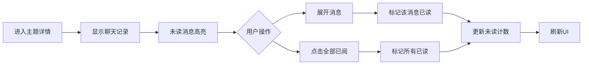
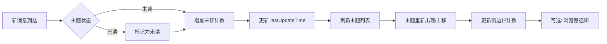

# 主题式消息阅读系统 (Topic-Based Message Reading)

## 概述

主题式消息阅读系统是一种以**主题(Topic)为中心的信息聚合和阅读模式**,让用户能够根据主题分类来阅读所有 AI 整理过的信息,而不再需要查看信息原文。这种设计参考了 RSS 阅读器 (Feedly)、Slack 频道、Notion 收件箱等产品的最佳实践。

### 设计理念

- **信息聚合**: 将分散的消息、网页、资源按主题聚合
- **已读管理**: 类似邮件客户端的未读/已读状态追踪
- **智能排序**: 基于重要性、时间、活跃度的多维度排序
- **渐进式阅读**: 支持单条消息标记已读和批量标记已读

## 核心功能

### 1. 已读/未读状态管理

#### 数据结构

每个主题实体包含 `readStatus` 对象:

```typescript
interface ReadStatus {
  unreadCount: number;           // 未读消息数量（核心字段）
  lastReadTime: number | null;   // 最后阅读时间戳
  lastUpdateTime: number;        // 最后更新时间
  // 注: isRead 可通过 unreadCount === 0 动态计算
}
```

每条消息包含已读标记:

```typescript
interface ConversationMessage {
  id: string;
  isRead?: boolean;        // 消息已读状态
  readTimestamp?: number;  // 消息阅读时间戳
  // ... 其他字段
}
```

#### 业务规则

| 操作 | 触发条件 | 状态变化 |
|------|---------|---------|
| **标记主题已读** | 用户点击主题卡片 | `unreadCount = 0`, 所有消息 `isRead = true` |
| **标记消息已读** | 用户展开消息上下文 | 该消息 `isRead = true`, `unreadCount -= 1` |
| **全部已阅** | 用户点击"全部已阅"按钮 | 所有消息 `isRead = true`, `unreadCount = 0` |
| **新消息到达** | 系统接收到新消息 | `unreadCount += N`, 新消息 `isRead = false` |
| **已读变未读** | 已读主题收到新消息 | `unreadCount > 0` (主题重新变为未读状态) |

### 2. 视图模式切换

#### 仅未读模式 (默认)

- 只显示 `unreadCount > 0` 的主题
- 帮助用户专注于新信息
- 类似邮件客户端的"未读"过滤

#### 全部模式

- 显示所有主题(已读+未读)
- 用于回顾历史内容
- 已读主题视觉上弱化

### 3. 智能排序

#### 最新消息排序 (默认)

按 `readStatus.lastUpdateTime` 降序排列,最近更新的主题排在前面。

#### 热度排序

综合计算多个因子:
```javascript
热度分数 = importance + (discussions / 20)
```

- **importance**: 主题基础重要性 (1-5分)
- **discussions**: 讨论数量 (每20条讨论 = 1分)

#### 未读数量排序

按 `readStatus.unreadCount` 降序排列,未读最多的主题优先显示。

### 4. 未读讨论预览

在主题卡片上直接显示未读讨论列表:

- **首页瀑布流**: 显示最新 2 条未读讨论
- **主题列表页**: 显示最新 3 条未读讨论
- **显示信息**: 发送者、消息摘要、时间、群组

## 界面设计

### 主题列表页 (`💡 主题` Tab)

#### 默认状态

- **视图模式**: 仅未读
- **排序方式**: 最新消息
- **未读标识**: 红色左边框 + 未读徽章

#### 控制栏

```
[🔴 仅未读] [📋 全部主题]    [最新消息▼] [热度] [未读数量]
```

#### 主题卡片

```
┌─────────────────────────────────────┐
│ 🔴 [7]  AI 工作流自动化    ⭐⭐⭐⭐⭐  │  ← 未读徽章 + 星标
│ #技术 #AI #自动化                    │
│                                     │
│ 📊 未读讨论:                         │
│   • 张三: 如何优化工作流... (10:30)  │
│   • 李四: 有没有好的工具... (09:15)  │
│   • 王五: 我试过这个方案... (昨天)   │
│                                     │
│ 💬 12 讨论  |  🔗 8 资源  |  更新 2h前│
│                             [阅]     │  ← hover 显示
└─────────────────────────────────────┘
```

#### 空状态

```
┌─────────────────────────────────────┐
│              ✅                      │
│          太棒了！                    │
│      所有主题都已阅读完毕             │
│                                     │
│      [查看所有主题]                  │
└─────────────────────────────────────┘
```

### 首页概览

#### 今日重点卡片

```
┌─────────────────────────────────────┐
│  📌 今日重点                    [❌] │  ← 关闭按钮
│                                     │
│  重要更新: DevOps 最佳实践          │
│  ...内容...                         │
│                             [阅]     │  ← hover 显示
└─────────────────────────────────────┘
```

**交互**:
- hover 时显示右上角关闭按钮和右下角"阅"按钮
- 点击 `❌` → 今日内不再显示该卡片
- 点击 `阅` → 标记相关主题已读

#### 未读主题瀑布流

```
┌──────────────────┐  ┌──────────────────┐
│ 🔴 [7] AI工作流  │  │ 🔴 [5] DevOps    │
│ ⭐⭐⭐⭐⭐        │  │ ⭐⭐⭐⭐⭐        │
│ 未读讨论:        │  │ 未读讨论:        │
│ • 张三: ...      │  │ • 李四: ...      │
│         [阅]     │  │         [阅]     │
└──────────────────┘  └──────────────────┘

┌──────────────────┐  ┌──────────────────┐
│ 🔴 [4] 前端优化  │  │ 🔴 [3] 微服务    │
│ ...              │  │ ...              │
└──────────────────┘  └──────────────────┘

            [加载更多]
```

**布局特性**:
- 双列瀑布流 (响应式,小屏幕自动变单列)
- 按热度排序
- 懒加载 (初始显示 6 个)

### 主题详情页

#### 聊天记录标签页

```
┌─────────────────────────────────────────────────────┐
│ 💬 聊天记录                                          │
│                                                     │
│ [🔍 搜索...]  [群组过滤▼]         [✓ 全部已阅]     │
│                                                     │
│ ─────────────────────────────────────────────────  │
│ 🔴 张三 · AI工作流群 · 10:30                         │  ← 未读消息
│    如何优化工作流的自动化程度?                        │
│    [查看上下文]                                      │
│ ─────────────────────────────────────────────────  │
│ 李四 · AI工作流群 · 09:15                            │  ← 已读消息
│    有没有好的工具推荐?                               │
│    [查看上下文]                                      │
└─────────────────────────────────────────────────────┘
```

**交互**:
- 未读消息显示: 红色左边框 + 红点指示器 + 半透明红色背景
- 点击"查看上下文" → 自动标记该消息已读
- 点击"✓ 全部已阅" → 标记所有消息已读

## 视觉设计规范

### "阅"字按钮样式

```css
.mark-read-btn {
  width: 2.5rem;
  height: 2.5rem;
  border-radius: 50%;
  background: linear-gradient(135deg, rgba(34, 197, 94, 0.2), rgba(16, 185, 129, 0.2));
  border: 2px solid rgba(34, 197, 94, 0.4);
  color: #22c55e;
  font-weight: 700;
  opacity: 0; /* hover时显示 */
  transition: all 0.3s ease;
}

.mark-read-btn:hover {
  transform: scale(1.1);
  box-shadow: 0 0 0 4px rgba(34, 197, 94, 0.2);
}
```

### 未读徽章样式

```css
.unread-badge {
  background: linear-gradient(135deg, #ef4444, #dc2626);
  color: #ffffff;
  padding: 0.25rem 0.5rem;
  border-radius: 0.75rem;
  font-size: 0.75rem;
  font-weight: 700;
  box-shadow: 0 0 10px rgba(239, 68, 68, 0.3);
  animation: pulse 2s infinite;
}

@keyframes pulse {
  0%, 100% { box-shadow: 0 0 10px rgba(239, 68, 68, 0.3); }
  50% { box-shadow: 0 0 20px rgba(239, 68, 68, 0.6); }
}
```

### 未读主题卡片样式

```css
.content-card.unread {
  border-left: 3px solid #ef4444;
  background: rgba(239, 68, 68, 0.05);
}

.content-card.unread .message-item {
  border-left: 2px solid #ef4444;
  background: rgba(239, 68, 68, 0.03);
}
```

## 技术实现

### 核心 API 方法

| 方法 | 功能 | 参数 |
|------|------|------|
| `markTopicAsRead(topicId)` | 标记主题已读 | 主题 ID |
| `markConversationAsRead(topicId, convId)` | 标记单条消息已读 | 主题 ID, 消息 ID |
| `markAllConversationsAsRead(topicId)` | 全部已阅 | 主题 ID |
| `closeTodayCard(cardId)` | 关闭今日卡片 | 卡片 ID |
| `getUnreadTopics()` | 获取未读主题 | 无 |
| `getUnreadTopicsByImportance()` | 按热度排序 | 无 |
| `getUnreadTopicsByLatestMessage()` | 按时间排序 | 无 |
| `updateTopicUnreadCount()` | 更新侧边栏计数 | 无 |

### 后端 API 集成

#### 1. 获取主题列表

```
GET /api/topics
Response: {
  topics: [
    {
      id: "topic-1",
      name: "AI 工作流自动化",
      readStatus: {
        unreadCount: 7,
        lastReadTime: null,
        lastUpdateTime: 1698765432000
      },
      conversations: [...],
      // ... 其他字段
    }
  ]
}
```

#### 2. 标记主题已读

```
POST /api/topics/:topicId/mark-read
Body: { timestamp: Date.now() }
Response: { success: true }
```

#### 3. 标记消息已读

```
POST /api/topics/:topicId/conversations/:convId/mark-read
Response: { success: true }
```

#### 4. 标记所有消息已读

```
POST /api/topics/:topicId/conversations/mark-all-read
Response: { success: true }
```

#### 5. 新消息通知

**WebSocket 方式** (推荐):
```javascript
ws.on('new_message', (data) => {
  // data: { topicId, count, messages: [...] }
  store.onNewContentReceived(data.topicId, data.count);
});
```

**轮询方式**:
```
GET /api/topics/updates?since=1698765432000
Response: {
  updates: [
    { topicId: "topic-1", count: 2, latestMessage: {...} }
  ]
}
```

### 数据持久化

#### LocalStorage (客户端缓存)

```javascript
// 保存关闭的今日卡片
localStorage.setItem('closedCards', JSON.stringify([...closedCardsSet]));

// 恢复
const saved = localStorage.getItem('closedCards');
closedCardsSet = new Set(JSON.parse(saved));
```

#### ChromaDB (服务端存储)

`readStatus` 存储在实体的 metadata 中:
```json
{
  "id": "topic-1",
  "metadata": {
    "readStatus": "{\"unreadCount\":7,\"lastReadTime\":null,\"lastUpdateTime\":1698765432000}"
  }
}
```

消息的 `isRead` 存储在 `relatedData.conversations` 中:
```json
{
  "relatedData": {
    "conversations": [
      {
        "id": "msg-1",
        "isRead": false,
        "readTimestamp": undefined
      }
    ]
  }
}
```

### 状态管理 (Pinia Store)

```typescript
// memory-store.ts
export const useMemoryStore = defineStore('memory', {
  state: () => ({
    entities: [] as MemoryEntity[],
    closedTodayCards: new Set<string>()
  }),
  
  actions: {
    markTopicAsRead(topicId: string) {
      const topic = this.entities.find(e => e.id === topicId);
      if (!topic) return;
      
      // 标记所有消息为已读
      topic.relatedData.conversations.forEach(conv => {
        conv.isRead = true;
        conv.readTimestamp = Date.now();
      });
      
      // 更新 readStatus
      topic.readStatus = {
        unreadCount: 0,
        lastReadTime: Date.now(),
        lastUpdateTime: Date.now()
      };
      
      // 同步到后端
      this.syncReadStatusToBackend(topicId);
    },
    
    markConversationAsRead(topicId: string, convId: string) {
      const topic = this.entities.find(e => e.id === topicId);
      if (!topic) return;
      
      const conv = topic.relatedData.conversations.find(c => c.id === convId);
      if (!conv || conv.isRead) return;
      
      // 标记消息已读
      conv.isRead = true;
      conv.readTimestamp = Date.now();
      
      // 减少未读计数
      if (topic.readStatus) {
        topic.readStatus.unreadCount = Math.max(0, topic.readStatus.unreadCount - 1);
        topic.readStatus.lastUpdateTime = Date.now();
      }
      
      // 同步到后端
      this.syncReadStatusToBackend(topicId);
    }
  },
  
  getters: {
    unreadTopics: (state) => {
      return state.entities.filter(e => 
        e.type === 'Topic' && 
        e.readStatus && 
        e.readStatus.unreadCount > 0
      );
    }
  }
});
```

## 交互流程

### 场景 1: 用户浏览首页

```mermaid
graph LR
    A[进入首页] --> B[显示今日卡片]
    B --> C[显示未读主题瀑布流]
    C --> D{用户操作}
    D --> E[hover卡片]
    D --> F[点击卡片]
    E --> G[显示"阅"按钮]
    G --> H[点击"阅"]
    H --> I[标记主题已读]
    I --> J[卡片消失]
    F --> I
```

### 场景 2: 用户查看主题列表

```mermaid
graph LR
    A[点击"主题"Tab] --> B[默认显示仅未读]
    B --> C[按最新消息排序]
    C --> D{用户操作}
    D --> E[切换视图]
    D --> F[切换排序]
    D --> G[点击主题]
    D --> H[点击"阅"]
    G --> I[标记主题已读]
    H --> I
    I --> J[刷新列表]
    J --> K[卡片消失/变灰]
```

### 场景 3: 用户查看主题详情



### 场景 4: 新消息到达



## 性能优化

### 1. 虚拟滚动

当主题数量 > 100 时,使用虚拟滚动技术:

```javascript
// 使用 vue-virtual-scroller
<RecycleScroller
  :items="filteredTopics"
  :item-size="120"
  key-field="id"
>
  <template #default="{ item }">
    <TopicCard :topic="item" />
  </template>
</RecycleScroller>
```

### 2. 防抖和节流

```javascript
// 搜索输入防抖
const debouncedSearch = debounce((keyword) => {
  searchTopics(keyword);
}, 300);

// 滚动加载节流
const throttledLoadMore = throttle(() => {
  loadMoreTopics();
}, 1000);
```

### 3. 计算缓存

```javascript
// 使用 computed 缓存计算结果
const sortedTopics = computed(() => {
  const topics = store.unreadTopics;
  if (sortMode.value === 'time') {
    return [...topics].sort((a, b) => 
      b.readStatus.lastUpdateTime - a.readStatus.lastUpdateTime
    );
  }
  // ... 其他排序
});
```

### 4. CSS 动画优化

```css
/* 使用 transform 代替 position */
.content-card {
  transition: transform 0.3s ease;
}

.content-card:hover {
  transform: translateY(-4px);
}

/* 使用 will-change 提示浏览器优化 */
.unread-badge {
  will-change: box-shadow;
}
```

## 数据流图

```
┌─────────────┐
│  用户操作   │
└──────┬──────┘
       │
       v
┌─────────────┐      ┌──────────────┐
│ Vue组件     │─────>│ Pinia Store  │
│ (UI层)      │<─────│ (状态管理)   │
└─────────────┘      └──────┬───────┘
                            │
                            v
                     ┌──────────────┐
                     │ Memory System│
                     │ (业务逻辑)   │
                     └──────┬───────┘
                            │
                ┌───────────┴───────────┐
                │                       │
                v                       v
         ┌──────────────┐       ┌──────────────┐
         │ LocalStorage │       │ ChromaDB     │
         │ (客户端缓存) │       │ (持久化存储) │
         └──────────────┘       └──────────────┘
```

## 与其他系统的集成

### 1. 通知系统

新消息到达时触发浏览器通知:

```javascript
if (Notification.permission === 'granted') {
  new Notification('新消息', {
    body: `${topicName} 有 ${count} 条新消息`,
    icon: '/icons/message.png',
    badge: count
  });
}
```

### 2. 任务调度器

定期检查未读消息:

```javascript
// 每30秒检查一次更新
scheduleTask({
  name: 'check-unread-messages',
  interval: 30000,
  action: async () => {
    const updates = await fetchTopicUpdates();
    updates.forEach(update => {
      store.onNewContentReceived(update.topicId, update.count);
    });
  }
});
```

### 3. 搜索系统

支持全文搜索未读消息:

```javascript
// 搜索未读主题
const searchResults = await memorySystem.searchEntities({
  type: 'Topic',
  filter: (entity) => entity.readStatus?.unreadCount > 0,
  keyword: searchKeyword
});
```

## 最佳实践

### 1. 已读状态同步

- **客户端优先**: 立即更新 UI,异步同步到后端
- **乐观更新**: 假设请求成功,失败时回滚
- **离线支持**: 使用 Service Worker 缓存请求

### 2. 未读计数管理

- **增量更新**: 只更新变化的部分,避免全量刷新
- **批量操作**: 合并多个标记已读请求
- **定期同步**: 每分钟从后端同步一次,确保一致性

### 3. 用户体验

- **即时反馈**: 所有操作都有视觉反馈 (动画、提示)
- **容错设计**: 网络失败时显示友好提示,支持重试
- **快捷键**: 支持键盘快捷键 (如 `r` 标记已读)

### 4. 数据清理

- **自动清理**: 定期清理 1 个月前的已读消息 (参见 `memory_system.md`)
- **手动清理**: 提供"清空已读"功能
- **备份机制**: 清理前备份重要数据

## 参考产品

| 产品 | 借鉴特性 |
|------|---------|
| **Feedly** | RSS 阅读器的未读管理和文章聚合 |
| **Slack** | 频道未读徽章和消息通知 |
| **Notion** | 收件箱的优先级排序 |
| **Gmail** | 未读邮件过滤和标签管理 |
| **微信** | 消息列表的未读红点提示 |

## 未来改进方向

1. **智能推荐**: 基于阅读历史推荐相关主题
2. **分组管理**: 支持主题分组 (工作/学习/个人)
3. **阅读统计**: 显示阅读时长、阅读频率等统计
4. **社交功能**: 支持分享已读主题给他人
5. **AI 摘要**: 自动生成未读消息的 AI 摘要

---

**相关文档**:
- [记忆系统架构](./memory_system.md)
- [实体关系管理](./entity_relationships.md)
- [通知系统](./proactive_notification_system.md)

