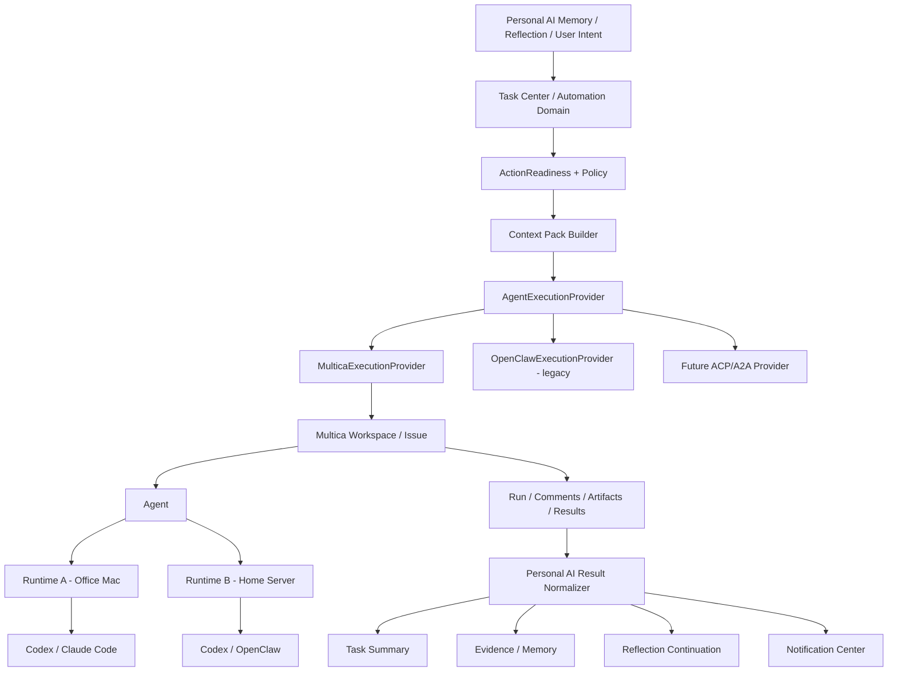

# Personal AI × Multica Agent Task 集成 Plan

> 日期：2026-09-07（Asia/Singapore）  
> 状态：Proposal / `docs/progressing` 级别方案，尚未实施  
> 推荐落点：`docs/progressing/personal-ai-multica-agent-task-integration-plan.md`  
> 核心决策：**Personal AI owns Task; Multica owns Run.**  
> 目标：保留 Personal AI 的任务/自动化控制平面，将 Agent Runtime、机器连接、CLI 执行与长任务协作下沉给 Multica。

---

## 0. 结论

采用 **Personal AI Task Center + Multica Execution Provider** 的混合架构。

- Personal AI 继续拥有：任务意图、触发条件、记忆上下文、证据要求、风险/审批、通知、结果解释、记忆/Reflection 回写。
- Multica 负责：Issue/Run、Agent、Runtime、机器在线状态、Codex / Claude Code / OpenClaw 等 CLI 调用、队列、并发、session resume、执行日志、评论协作与 artifact/run 事实。
- Personal AI 的 Agent Task 卡片只展示**摘要与控制面信息**；需要深入查看执行细节、评论、补充信息、与 Agent 多轮协作时，进入 Multica Issue。
- 第一版不在 Personal AI 内复刻 Multica 的完整评论流、run log、Kanban、runtime 管理页。
- 两台或多台执行机器连接到**同一套 Multica Server / Workspace**；每台机器运行 daemon 并注册本机 runtime。不要为了多机器部署多套 Multica。
- 第一版不把“远程 Codex / Claude Code”抽象为远程 ACP。Multica 当前稳定、官方的模型是：远端机器运行 Multica daemon，daemon 调用该机器上已安装并登录的 CLI。

---

## 1. 已核实的 Multica 能力与本 Plan 的假设

### 1.1 Multica 可以作为独立、完整的 Agent Task 看板

Multica 的 Issue 是长期工作单元，包含：

- title / description；
- status / priority；
- assignee（人、Agent、Squad）；
- project / parent-child；
- comments / discussion；
- run / execution log；
- agent 返回的结果。

Issues 页面原生提供多种视图：

- List；
- Board；
- Table；
- Gantt；
- Swimlane。

因此 Personal AI 不需要复制一个“Agent Task 专用完整 Kanban”。Personal AI Task Center 更适合作为跨 Reminder / Message / Outreach / Evidence Watch / Agent Task 的统一控制面；Multica Board 则作为 Agent 工作的专业执行视图。

### 1.2 同一 Multica Issue 支持多轮输入和多次 Agent Run

Multica 的数据模型明确区分：

- **Issue**：长期存在的工作与讨论上下文；
- **Run**：某次 Agent 执行。

一个 Issue 可以对应多次 Run。用户可以：

- 继续追加 comment；
- reply 某个 Agent comment；
- 上传 attachment；
- @mention Agent；
- 重新交给同一 Agent 或其他 Agent；
- 在同一 Issue 上多轮讨论、修正需求、补信息。

因此 Personal AI → Multica 的映射必须是：

```text
1 PersonalAI AgentTask
        ↕
1 Multica Issue
        ↕
0..N Multica Runs
```

不能做成：

```text
1 PersonalAI AgentTask
        ↕
1 Multica Run
```

否则一旦用户在 Multica 中继续补充信息并触发第二次执行，Personal AI 就会失去连续性。

### 1.3 Multica 支持多台执行机器，但仍保持一个统一看板

推荐部署：

```text
                    Multica Server / Workspace
                             │
              ┌──────────────┴──────────────┐
              │                             │
       Multica daemon A              Multica daemon B
         Office Mac                    Home / Server
              │                             │
       ┌──────┴──────┐               ┌──────┴──────┐
       │             │               │             │
     Codex      Claude Code         Codex       OpenClaw
     runtime       runtime          runtime       runtime
```

Multica daemon 运行在每一台真正执行任务的电脑上：

1. daemon 连接同一个 Multica Server；
2. daemon 检测本机已安装的 AI coding CLI；
3. 每个“电脑 + 工具”形成一个 runtime；
4. Agent 绑定 runtime；
5. Issue/Board/Comments/Run records 仍全部集中在同一个 Workspace。

因此：

> 两台电脑 ≠ 两套 Multica。

只有在网络/合规隔离要求明确需要两个独立控制平面时，才考虑两个 Multica Server；这种情况下才需要 Personal AI 做 federation，而本 Plan 不建议第一版走该路线。

### 1.4 关于 ACP 的边界

第一版不要把 Multica 集成设计成“Personal AI → Multica → 远程 ACP → Codex/Claude Code”。

当前官方稳定模型是：

```text
Multica Server
      ↓
Multica daemon（目标机器）
      ↓
本机 Codex / Claude Code / OpenClaw / ... CLI
```

Multica 支持 custom runtime profile，但 custom profile 只是复用 Multica 已支持的 protocol family，并不能通过配置凭空增加任意通信协议。

因此对于“远程 Codex / Claude Code”：

- **推荐**：目标机器安装 Codex / Claude Code + Multica CLI，启动 `multica daemon`；
- **不推荐作为第一版前提**：Multica Server 直接连接第三方远程 ACP endpoint；
- **未来扩展**：如果已有一个可执行 wrapper 能在 daemon 所在机器上把 Multica 支持的 protocol family 转成远程 ACP，可以作为 custom runtime / adapter 实验，但属于独立兼容层。

---

## 2. Personal AI 当前源码基线

本 Plan 基于 2026-09-07 提供的 `Personal-AI-develop.zip`。

### 2.1 AgentTask 当前被硬编码到 OpenClaw

`memory-service/src/routes/agentTasks.ts` 当前：

- `executor` 默认 `openclaw`；
- 非 `openclaw` 返回 `unsupported_executor`；
- 创建的 Action 类型固定为 `delegate_openclaw`；
- 立即进入 `ActionExecutor.executeAction()`；
- 最终通过 Notification Center 发 Glip 通知。

关键位置：

- `memory-service/src/routes/agentTasks.ts:244`：executor 默认值；
- `:247`：unsupported executor；
- `:277`：`delegate_openclaw`；
- `:346`：`ActionExecutor`；
- `:395`：结果通知。

### 2.2 Scheduled Messages 把 AgentTask 当成 Push Method

`src/scheduled-messages/types.ts`：

```ts
PushMethod = 'AsMe' | 'Bot' | 'AI' | 'JiraAutomation' | 'Outreach' | 'AgentTask'
```

同时存在：

```text
Agent_Task_ID
Agent_Executor
Agent_Task_Prompt
Agent_Last_Run_At
Agent_Last_Status
Agent_Last_Result
Agent_Last_Error
```

`src/scheduled-messages/executionRoute.ts` 当前 AgentTask 路由为：

```text
Jira Automation
    ↓
memory-service AgentTask
    ↓
OpenClaw
```

这说明 AgentTask 现在仍被挂在 Scheduled Messages 的历史数据模型中，而不是一个独立的长期 Automation / AgentTask domain。

### 2.3 BackgroundJobs 是 Personal AI 内部后台任务，不应被 Multica 替代

`src/services/backgroundJobDefinitions.ts` 当前包含：

- message_analysis；
- memory_sync；
- system_monitoring；
- user_profile_decay；
- vectorized_data_maintenance；
- user_summary_generation；
- vector_quality_check；
- digest_queue_process。

这些属于浏览器扩展 / Personal AI 平台 housekeeping，不属于 Agent Task orchestration。

结论：**继续保留 BackgroundJobs。**

### 2.4 ActionReadiness 当前也绑定 OpenClaw 语义

`memory-service/src/core/ActionReadinessService.ts` 当前只对：

```text
actionType === delegate_openclaw
```

建立 readiness scope，并以：

```text
openclaw:global
openclaw:<targetSystem>:<mode>
```

作为 scope key。

Multica 集成时不能绕过这层安全控制；应把它泛化成 executor/provider 级 readiness。

---

## 3. 目标产品体验

### 3.1 Personal AI Task Center 的定位

Task Center 不是 Agent IDE，也不是 Agent Jira。

它回答的是：

> “我有哪些未来动作/自动化/委派正在发生，为什么发生，当前是否需要我处理，结果对我的记忆和工作意味着什么？”

包含的任务类型未来应统一为：

```text
Automation Center / Task Center
│
├── Reminder
├── Scheduled Message
├── Outreach
├── Evidence Watch
├── Agent Task
└── Internal Automation（仅管理/诊断面，不与用户任务混排）
```

Multica 只负责其中 `Agent Task` 的 execution plane。

### 3.2 Agent Task 卡片在 Personal AI 中显示什么

建议卡片默认只显示：

```text
[Agent Task] 检查 Personal AI 最近提交的 memory regression

状态        等待你审核 / 执行中 / 已完成 / 阻塞
执行者      Coding Reviewer · Codex
执行机器    Office Mac                （可选显示）
最近进展    已完成测试扫描，发现 2 个风险点
更新时间    16:12

[查看结果] [在 Multica 中继续] [...] 
```

展开后显示：

- Personal AI Task intent；
- 为什么触发；
- Context Pack 摘要；
- 当前 Multica Issue key；
- 当前/最近一次 Run 状态；
- 简短 progress；
- normalized result summary；
- artifacts / proof 数量；
- 是否已进入 memory/reflection；
- 最后同步时间。

不在第一版完整展示：

- 所有 comment thread；
- 完整 token-by-token / tool execution log；
- Multica runtime 调试面板；
- 完整 agent configuration；
- Board / Gantt / Swimlane。

这些通过「在 Multica 中继续」进入专业视图。

### 3.3 Multica 中承担“深度协作 View”

当用户点击：

> **在 Multica 中继续**

进入对应 Issue，用户可以：

- 看完整描述与 execution timeline；
- 看 Agent 每次 Run；
- 评论补充需求；
- 回复 Agent；
- 上传新文件；
- @Agent；
- 修改任务字段；
- 重新触发 Agent；
- 切换到完整 Board 看所有 Agent Task。

这是推荐的主交互边界。

### 3.4 Personal AI 是否也提供“补充要求”输入框

建议分阶段。

#### Phase 1：不提供

只提供：

```text
[在 Multica 中继续]
```

避免第一版出现双向评论同步、thread identity、重复触发 run、并发编辑等复杂问题。

#### Phase 2：提供轻量 Quick Follow-up

Personal AI Task Card 可增加：

```text
补充要求...
[发送到 Multica]
```

但它不是“Personal AI 自己的一条消息”，而是通过 Multica adapter 写入同一 Issue 的 comment。

必须显示发送前边界：

> “这会把内容追加到 Multica Issue；当该 Issue 由 Agent 接手时，评论可能触发新一次 Agent Run。”

Personal AI 仍不复制完整 thread UI，只回显：

- 最近 1~3 条外部更新；
- “已发送到 Multica”；
- 新 Run 是否创建。

---

## 4. 核心架构



### 4.1 最关键的 Source of Truth 边界

| 数据 | Source of Truth |
|---|---|
| 为什么创建任务 | Personal AI |
| schedule / condition / evidence watch | Personal AI |
| context / memory scope | Personal AI |
| approval / risk policy | Personal AI |
| Personal AI task lifecycle | Personal AI |
| Multica Issue 内容/讨论 | Multica |
| 某次 Agent Run | Multica |
| runtime / machine online | Multica |
| CLI session / session resume | Multica / 本机工具 |
| raw execution log | Multica |
| normalized outcome | Personal AI |
| 是否写入长期记忆 | Personal AI |
| 是否继续 Reflection | Personal AI |

---

## 5. 数据模型

### 5.1 新增 `agent_tasks` / `automation_tasks` 独立实体

不建议长期继续只把 AgentTask 放在 Scheduled Messages Sheet 行里。

建议服务端新增独立任务记录；名称二选一：

- `automation_tasks`：长期推荐，可统一 Reminder / Outreach / AgentTask；
- `agent_tasks`：较小改造，后续再统一。

若本次控制 scope，先落 `agent_tasks`，但接口按照未来可泛化设计。

建议字段：

```ts
interface AgentTaskRecord {
  id: string;
  userId: string;
  title: string;
  instruction: string;

  sourceKind?: string;
  sourceRefId?: string;
  triggerSource?: string;

  state:
    | 'scheduled'
    | 'ready'
    | 'blocked'
    | 'dispatching'
    | 'queued'
    | 'executing'
    | 'awaiting_review'
    | 'completed'
    | 'failed'
    | 'cancelled';

  provider: 'multica' | 'openclaw' | string;
  executorProfile?: string;

  contextPolicy?: Record<string, unknown>;
  executionPolicy?: Record<string, unknown>;
  outcomePolicy?: Record<string, unknown>;

  externalIssueId?: string;
  externalIssueKey?: string;
  externalIssueUrl?: string;
  externalCurrentRunId?: string;
  externalRuntimeId?: string;
  externalAgentId?: string;

  externalIssueStatus?: string;
  externalRunStatus?: string;

  progressSummary?: string;
  resultSummary?: string;
  resultEnvelope?: Record<string, unknown>;
  lastError?: string;

  createdAt: number;
  updatedAt: number;
  lastSyncedAt?: number;
  completedAt?: number;
}
```

### 5.2 为什么必须同时保存 Issue ID 与 Run ID

- Issue ID：长期协作主键；
- Run ID：当前/最近一次执行实例。

用户在 Multica 继续补充信息后，可能变成：

```text
Issue MUL-123
  ├── Run A completed
  ├── user comment
  ├── Run B completed
  ├── reviewer comment
  └── Run C running
```

Personal AI 必须保持 `externalIssueId` 不变，只更新 `externalCurrentRunId`。

### 5.3 不把 Multica Run 状态直接当 Personal AI Task 状态

建议映射：

| Multica | Personal AI |
|---|---|
| deferred / queued | queued |
| dispatched / waiting_local_directory / running | executing |
| Run completed + Issue in_review | awaiting_review |
| Run completed + Issue still in_progress | executing / awaiting_review（按 issue + policy） |
| Issue blocked | blocked |
| Issue done | completed |
| Run failed，但 Issue 可重试 | failed 或 awaiting_review，按重试策略 |
| Issue cancelled | cancelled |

尤其注意：

> **Run completed 不等于 Task completed。**

Multica 官方模型允许一个 Issue 在某次 Run 完成后继续讨论和产生后续 Run。

---

## 6. Provider 抽象

新增：

```ts
interface AgentExecutionProvider {
  id: string;

  probe(input: ExecutionProbeInput): Promise<ExecutionCapability>;

  createTask(input: CreateExternalAgentTaskInput):
    Promise<ExternalAgentTaskRef>;

  getTask(ref: ExternalAgentTaskRef):
    Promise<ExternalAgentTaskSnapshot>;

  listRuns(ref: ExternalAgentTaskRef):
    Promise<ExternalRunSnapshot[]>;

  addComment(
    ref: ExternalAgentTaskRef,
    input: ExternalCommentInput,
  ): Promise<ExternalCommentResult>;

  cancelRun(
    ref: ExternalAgentTaskRef,
    runId: string,
  ): Promise<void>;

  getArtifacts(
    ref: ExternalAgentTaskRef,
    runId?: string,
  ): Promise<ExternalArtifact[]>;

  getDeepLink(ref: ExternalAgentTaskRef): string | undefined;
}
```

目录建议：

```text
memory-service/src/integrations/agent-execution/
  AgentExecutionProvider.ts
  AgentExecutionProviderRegistry.ts
  MulticaExecutionProvider.ts
  OpenClawExecutionProvider.ts
  types.ts
```

### 6.1 不把 action type 叫 `delegate_multica`

长期更好的方向：

```text
delegate_agent
```

params：

```json
{
  "provider": "multica",
  "task": "...",
  "executionPolicy": {},
  "contextPack": {}
}
```

过渡期可以同时支持：

```text
delegate_openclaw  // legacy
delegate_agent     // new
```

避免直接把所有现有 Reflection / Evidence Watch 逻辑一次迁完。

---

## 7. MulticaExecutionProvider

### 7.1 第一版集成面

第一版需要的能力很小：

1. 创建 Multica Issue；
2. 赋值 project / priority / labels / metadata；
3. assign 到指定 Agent，从而发起 Run；
4. 查询 Issue；
5. 查询 Runs / 当前状态；
6. 查询最近评论/结果；
7. 生成 deep link；
8. 可选：写一条 comment；
9. 可选：取消当前 Run。

Multica CLI 已支持这些典型操作，包括：

```text
multica issue create
multica issue get
multica issue assign
multica issue comment list
multica issue comment add
multica issue runs
multica issue run-messages
multica issue cancel-task
```

### 7.2 优先 API，CLI 作为 bootstrap/fallback

实现优先级：

```text
Multica API / stable HTTP contract
        ↓
CLI fallback / local self-host bootstrap
```

不要通过：

- 浏览器 DOM；
- scraping Multica UI；
- 直接读 Multica DB；
- fork Multica frontend。

### 7.3 Issue 创建格式

Personal AI 创建 Multica Issue 时建议描述包含：

```markdown
## Goal
...

## Personal AI Context Pack
...

## Constraints
...

## Verification Requirements
...

## Expected Deliverables
...

## Personal AI Reference
- Task ID: ...
- Source: ...
```

并在 Multica metadata 中保存：

```text
personal_ai_task_id
personal_ai_user_scope_hash
personal_ai_source_kind
personal_ai_context_version
```

不要在 metadata 中存原始敏感长期记忆。

---

## 8. Context Pack

### 8.1 Codex / Claude Code 不需要拥有 Personal AI 的长期记忆

正确模式：

```text
AgentTask fires
    ↓
Memory recall
    ↓
Evidence cohesion / claim attribution
    ↓
Context Pack
    ↓
Multica Issue / Run
```

Context Pack 建议包含：

```ts
interface AgentTaskContextPack {
  goal: string;
  background: string[];
  relevantMemories: CompactEvidence[];
  currentClaims: CompactClaim[];
  openQuestions: string[];
  evidenceGaps: string[];
  projectContext?: Record<string, unknown>;
  constraints: string[];
  verificationRequirements: string[];
  expectedArtifacts: string[];
  safetyBoundary: string[];
}
```

### 8.2 Context Pack 必须最小化

不要：

```text
把整个 memory DB / profile / message history 交给 Multica
```

而应：

```text
按本次 Task 动态召回 → 压缩 → 证据门控 → 注入
```

这样 Multica/Agent 不成为第二套长期记忆系统。

---

## 9. 结果回流与 Task Summary

### 9.1 Personal AI 只保存“归一化结果”，Multica 保存“执行事实”

Multica：

```text
comments
run logs
agent messages
runtime facts
raw artifacts
```

Personal AI：

```text
progressSummary
resultSummary
verification
artifacts refs
openQuestions
nextActions
memory/reflection receipts
```

建议归一化 envelope：

```ts
interface AgentTaskOutcome {
  status: 'success' | 'partial' | 'blocked' | 'failed';
  summary: string;
  claims?: Array<Record<string, unknown>>;
  evidence?: Array<Record<string, unknown>>;
  artifacts?: Array<Record<string, unknown>>;
  verification?: Array<Record<string, unknown>>;
  openQuestions?: string[];
  suggestedNextActions?: string[];
}
```

### 9.2 Personal AI Task Center 卡片结果

完成后只显示类似：

```text
已完成
发现 2 个高优先级 regression 风险，1 个已通过测试确认；
Agent 提交了 1 份报告和 1 个 patch 分支。

验证：3/4
待确认：是否合并 patch

[查看结果] [在 Multica 中继续]
```

而不是复制 Multica 全部 execution log。

### 9.3 Memory / Reflection 写回门

Agent 自己说“完成”不应自动等价于事实。

继续复用 Personal AI 已有理念：

```text
Agent result
   ↓
artifact / proof check
   ↓
Evidence / Claim gate
   ↓
Memory / Reflection
```

例如代码任务优先找：

- commit hash；
- diff；
- test result；
- PR URL；
- build/deploy result。

---

## 10. ActionReadiness 泛化

当前 ActionReadiness scope 硬编码：

```text
openclaw:global
openclaw:<targetSystem>:<mode>
```

改成：

```text
agent:<provider>:global
agent:<provider>:<executorProfile>:<mode>
agent:<provider>:<targetSystem>:<mode>
```

Multica readiness 至少检查：

```text
server_reachable
workspace_access
agent_exists
runtime_bound
runtime_online / recoverable
required_cli_available
context_pack_valid
required_inputs_present
approval_present
side_effect_policy
proof_contract_present
```

注意 runtime offline 不一定等于 permanently blocked。Multica 可以对部分 queued work 等待 runtime 恢复，因此 readiness 需区分：

```text
ready
ready_but_runtime_offline
blocked_auth
blocked_capability
blocked_input
blocked_policy
```

---

## 11. 多机器 / Runtime 选择策略

### 11.1 第一版：显式 Agent Profile

Personal AI 不直接选机器。

配置：

```text
Personal AI executor profile
  coding-reviewer
        ↓
Multica Agent: Coding Reviewer
        ↓
Runtime: Office-Mac / Codex
```

另一个：

```text
research-coder
        ↓
Multica Agent: Research Coder
        ↓
Runtime: Home-Server / Claude Code
```

Personal AI 只保存 `executorProfile` 或 Multica Agent ID。

这样 machine routing 仍属于 Multica。

### 11.2 第二版：能力路由

以后可让 Personal AI 声明：

```json
{
  "capabilities": ["repo_write", "browser", "long_running"],
  "preferredTool": "codex"
}
```

再由 provider / Multica 选择匹配 Agent。

第一版不要自己做 runtime scheduler。

---

## 12. Personal AI ↔ Multica 同步策略

### 12.1 不需要实时复制全部事件

Personal AI 只同步：

- Issue status；
- latest Run status；
- latest significant progress；
- result summary；
- artifacts；
- last error；
- last update。

### 12.2 同步方式

按优先级：

1. Multica webhook / event（若稳定公开接口可用）；
2. 低频 server-side polling；
3. 打开 Task Center 时 refresh；
4. 用户点“刷新状态”。

不要让浏览器 extension 自己高频 poll 每个 Multica Issue。

### 12.3 建议 polling cadence

没有 webhook 时：

```text
queued / executing     30~60s
awaiting_review        2~5min
completed / cancelled  不自动轮询
```

这是 Personal AI 的状态镜像频率，不改变 Multica daemon 自己的执行/heartbeat 机制。

---

## 13. Scheduled Messages / AgentTask 迁移

### 13.1 第一阶段保持兼容

原有：

```text
Google Sheet
   ↓
Jira Rule / AppScript
   ↓
POST /agent-tasks/execute
```

暂时不拆。

只把 payload 从：

```json
{ "executor": "openclaw" }
```

扩展为：

```json
{
  "executor": "multica",
  "executorProfile": "coding-reviewer"
}
```

`/agent-tasks/execute` 进入新的 AgentTaskService，再委托 provider。

### 13.2 第二阶段把 AgentTask 从 PushMethod 中抽离

长期目标：

```text
Scheduled Messages = 消息计划
Agent Tasks         = Agent 工作计划
Automation Center   = 统一入口
```

不要继续把“让 Codex 修改仓库”解释成一种 `Push_Method`。

### 13.3 Google Sheet 最终只保留 legacy / message scheduling

未来 Agent Task schedule 应落到 Personal AI 自己的 automation store；Sheet 只做：

- Scheduled Messages legacy；
- 现有用户兼容；
- 必要的 Jira/AppScript 消息调度。

AgentTask 不再依赖 Sheet 作为长期任务事实源。

---

## 14. UI Plan

### P0：AgentTask 卡片增加 External Execution Receipt

文件候选：

```text
src/scheduled-messages/ScheduledMessagesManager.tsx
src/scheduled-messages/types.ts
memory-service AgentTask 查询 API
```

AgentTask 行展示：

```text
执行引擎：Multica · Coding Reviewer
任务状态：执行中
外部任务：MUL-123
最近进展：...
同步：16:12

[在 Multica 中继续]
```

外链按钮边界：

> “打开 Multica 中的完整 Issue；评论、附件、Agent Run 与执行日志以 Multica 为准。”

### P1：Task Center Agent Task Detail

独立 detail view 展示：

```text
Personal AI Intent
Trigger
Context receipt
Readiness
External issue
Latest run
Result summary
Artifacts/proof
Memory/reflection outcome
```

### P2：Quick Follow-up

新增：

```text
[补充要求...]
[发送到 Multica]
```

提交后：

1. 调用 `provider.addComment()`；
2. 记录 external comment id；
3. 刷新 Issue + Run；
4. 若触发新 Run，更新 `externalCurrentRunId`；
5. toast 显示“已追加到 MUL-123 / 已触发新执行”。

不实现完整 thread editor。

---

## 15. API 设计草案

### 15.1 创建/触发 Agent Task

```http
POST /api/v1/agent-tasks
```

```json
{
  "title": "检查 memory regression",
  "instruction": "...",
  "provider": "multica",
  "executorProfile": "coding-reviewer",
  "triggerSource": "manual",
  "contextPolicy": {},
  "executionPolicy": {},
  "outcomePolicy": {}
}
```

### 15.2 获取任务

```http
GET /api/v1/agent-tasks/:id
```

返回 Personal AI normalized state + external receipt。

### 15.3 刷新外部状态

```http
POST /api/v1/agent-tasks/:id/refresh
```

只读同步，不触发 Run。

### 15.4 追加 Multica comment（Phase 2）

```http
POST /api/v1/agent-tasks/:id/comments
```

```json
{
  "content": "请额外检查 migration backward compatibility"
}
```

响应必须明确：

```json
{
  "posted": true,
  "externalCommentId": "...",
  "triggeredRun": true,
  "externalRunId": "..."
}
```

### 15.5 取消当前 Run

```http
POST /api/v1/agent-tasks/:id/cancel-run
```

只取消最新 active run，不默认取消整个 Personal AI Task；需要另一个显式“取消任务”动作。

---

## 16. 配置

建议新增用户运行配置：

```ts
interface MulticaConfig {
  enabled: boolean;
  serverUrl: string;
  workspaceId: string;
  tokenRef?: string;
  defaultAgentId?: string;
  defaultProjectId?: string;
}
```

Executor profiles：

```ts
interface AgentExecutorProfile {
  id: string;
  provider: 'multica' | 'openclaw';
  externalAgentId?: string;
  label: string;
  capabilities: string[];
  defaultForTaskKinds?: string[];
}
```

安全要求：

- 不把 Multica token 放到前端 UI 可读日志；
- 不写入 Sheet；
- 不作为 context prompt 内容；
- server-side 使用；
- deep link 可前端读取，但 token 不拼 URL。

---

## 17. 安全与权限

Multica daemon 启动的 Agent 默认受 daemon OS user 权限边界约束，不能把 Multica 当成安全 sandbox。

对于 Personal AI 自动发起的 unattended task，建议：

```text
Machine
  ├── personal user
  │     └── personal files / credentials
  │
  └── multica-agent user / container / VM
        ├── allowed repos
        ├── scoped git credential
        ├── scoped API token
        └── required tools only
```

Personal AI `executionPolicy` 明确：

```text
allowFileRead
allowRepoWrite
allowExternalWrite
allowNetwork
requiresApproval
expectedArtifacts
proofRequirements
```

高责任写操作继续通过 ActionReadiness / Confirmation，不因 Multica 有自己的 Agent 权限设置就取消 Personal AI policy gate。

---

## 18. 实施阶段

### Phase 0 — Integration Spike（先做，必须可回滚）

目标：验证 Multica 是否足够稳定承担 Execution Provider。

工作：

1. 部署一套 Multica（Cloud 或单一 self-host server）；
2. 机器 A 跑 daemon + Codex；
3. 机器 B 跑 daemon + Claude Code；
4. 同一 Workspace 中确认两个 runtime；
5. 创建两个 Multica Agent，分别绑定两台机器；
6. 手动创建 Issue → assign → run；
7. comment 补充信息 → 触发第二次 run；
8. 验证 session resume；
9. 验证 runtime offline → queued/recovery；
10. 确认 API/CLI 能稳定：create issue / assign / list runs / comments / cancel。

退出标准：

- 一个统一 Board 能看到两台机器执行的任务；
- 同一 Issue 经过至少 3 次补充信息仍保持上下文；
- 两台机器至少各成功执行一次；
- Personal AI 可通过程序接口拿到 Issue/Run/status/result。

### Phase 1 — Provider Abstraction + Multica MVP

新增：

```text
AgentExecutionProvider
ProviderRegistry
MulticaExecutionProvider
OpenClawExecutionProvider（legacy wrapper）
```

改造：

- `/agent-tasks/execute` 不再拒绝非 openclaw；
- 增加 `multica`；
- 先保留原 endpoint 兼容 Sheet/Jira；
- 创建本地 AgentTask record；
- 保存 external Issue / Run refs；
- 结果返回改为“accepted + external receipt”，不要求长任务同步完成。

关键行为变更：

> `/agent-tasks/execute` 从“同步等待 OpenClaw 执行结束”转成“创建/派发 durable Agent Task 并返回”。

这是必要改造，否则无法正确承载长任务和多轮协作。

### Phase 2 — Status Sync + Summary + Deep Link

实现：

- AgentTask GET API；
- provider refresh；
- status mapping；
- Task Center 卡片；
- `在 Multica 中继续`；
- latest progress / result summary；
- Notification Center 使用 normalized summary。

### Phase 3 — Context Pack + Outcome Normalizer

实现：

- Memory recall context pack；
- Evidence / claim boundary；
- expected artifact/proof contract；
- run outcome normalization；
- memory/reflection receipts。

这是 Personal AI 真正形成差异化价值的阶段。

### Phase 4 — Quick Follow-up

实现 Personal AI 内轻量 comment composer，但不复制完整 Multica discussion UI。

### Phase 5 — AgentTask 从 Scheduled Messages 抽离

新增真正的 Automation / AgentTask task model 与入口。

Sheet/Jira AgentTask 只作为 legacy import / trigger source。

---

## 19. 预计源码改动点

### memory-service

#### 新增

```text
memory-service/src/integrations/agent-execution/AgentExecutionProvider.ts
memory-service/src/integrations/agent-execution/AgentExecutionProviderRegistry.ts
memory-service/src/integrations/agent-execution/MulticaExecutionProvider.ts
memory-service/src/integrations/agent-execution/OpenClawExecutionProvider.ts
memory-service/src/integrations/agent-execution/types.ts
memory-service/src/core/AgentTaskService.ts
memory-service/src/repositories/AgentTaskRepository.ts
memory-service/src/storage/migrations/0xx_agent_tasks.sql
```

#### 改造

```text
memory-service/src/routes/agentTasks.ts
memory-service/src/core/actions/ActionExecutor.ts
memory-service/src/core/ActionReadinessService.ts
memory-service/src/routes/actions.ts
memory-service/src/runtimeConfig.ts
```

#### 新测试

```text
memory-service/src/__tests__/multicaExecutionProvider.test.ts
memory-service/src/__tests__/agentTaskService.test.ts
memory-service/src/__tests__/api-agent-tasks-multica.test.ts
memory-service/src/__tests__/agentTaskStatusMapping.test.ts
memory-service/src/__tests__/agentTaskFollowup.test.ts
```

### extension / UI

改造：

```text
src/scheduled-messages/types.ts
src/scheduled-messages/executionRoute.ts
src/scheduled-messages/ScheduledMessagesManager.tsx
src/services/MemoryServiceClient.ts
```

后续若新增真正 Task Center：

```text
src/modals/components/TaskCenter.vue / equivalent
src/modals/components/AgentTaskDetail.vue / equivalent
```

不应把 Multica runtime configuration 全部塞进 Scheduled Messages Manager。

---

## 20. 迁移兼容

### 20.1 保留 OpenClaw

不要一次删除：

```text
delegate_openclaw
OpenClawDelegationService
```

第一阶段：

```text
provider=openclaw  → existing path
provider=multica   → new path
```

### 20.2 已有 Sheet AgentTask

原字段：

```text
Agent_Executor=openclaw
```

保持有效。

新值支持：

```text
Agent_Executor=multica
```

并新增可选：

```text
Agent_Executor_Profile=coding-reviewer
```

若 Sheet schema 暂时不想加列，可先把 profile 放到 `executionHints` / endpoint configuration；但正式版推荐有明确字段。

### 20.3 Legacy 状态

`Agent_Last_*` 继续作为 Sheet 的只读镜像，而不成为 Agent execution Source of Truth。

---

## 21. 验证与 E2E

### 21.1 单机

- Multica Issue 创建成功；
- Agent assignment 创建 Run；
- running → in_review / done 映射正确；
- Personal AI 展示 external deep link；
- result summary 正确。

### 21.2 两台机器

- 同一 Multica Workspace 注册 Machine A/B；
- A 的 Codex Agent 任务、B 的 Claude Code Agent 任务同时出现在同一 Board；
- Personal AI 中能区分两个 executor profile；
- 不出现两套 Multica 配置。

### 21.3 多轮

```text
Personal AI 创建 Task
  ↓
Multica Run 1
  ↓
用户在 Multica 评论补充
  ↓
Run 2
  ↓
Personal AI refresh
```

断言：

- `externalIssueId` 不变；
- `externalCurrentRunId` 改变；
- progress/result 更新；
- 不创建第二个 Personal AI Task。

### 21.4 Quick Follow-up（Phase 4）

Personal AI comment → Multica Issue → Agent new run → Personal AI refresh。

发送前必须显示“可能触发新 Run”的边界。

### 21.5 Runtime offline

- runtime offline 时状态不能误报为 task failed；
- 显示“等待执行器上线 / queued”；
- runtime 恢复后继续；
- 超过 Multica 的失败条件后再转失败。

### 21.6 安全

- 注入风险记忆不能触发 unattended write；
- requiresApproval 不被 provider 绕过；
- token 不落前端/Sheet/log；
- external deep link 不带 token；
- Multica daemon 运行账号隔离验证。

---

## 22. 不做事项

本次明确不做：

1. fork / embed Multica frontend；
2. 在 Personal AI 复制 Multica Kanban；
3. 在 Personal AI 复制完整 comments/thread UI；
4. 自研 Codex/Claude Code process manager；
5. 自研 distributed runtime heartbeat / worktree lock / generic execution queue；
6. 把 Personal AI 全量长期记忆同步到 Multica；
7. 第一版直接实现 generic remote ACP provider；
8. 为每台执行机器部署独立 Multica Server。

---

## 23. 风险与应对

| 风险 | 应对 |
|---|---|
| Multica API/CLI 快速变化 | Provider adapter 隔离；契约测试；不把 schema 泄漏到 domain |
| Issue 与 Run 生命周期混淆 | Personal AI 绑定 Issue；Run 只作为 execution instance |
| 双向评论导致重复触发 | 第一版只外链；Phase 4 才加 Quick Follow-up，提交前明确 side effect |
| 两台机器状态分裂 | 一套 Multica Server / Workspace，多 daemon |
| Agent 结果被误当事实 | Outcome Normalizer + proof/evidence gate |
| 自动任务权限过大 | ActionReadiness + OS/container isolation |
| Multica 不可用 | 保留 OpenClaw provider；Task 记录保持 provider-independent |
| 用户在 Multica 修改 Issue 后 Personal AI 过期 | refresh/webhook + lastSyncedAt + external state receipt |

---

## 24. 产品文案建议

Personal AI 中不要叫：

> “Multica Task”

而继续叫：

> “Agent Task / 帮我做”

Multica 只是执行器。

卡片：

```text
执行方式：Multica · Coding Reviewer
```

按钮：

```text
在 Multica 中继续
```

Tooltip：

> “打开该 Agent Task 的完整执行视图。评论、附件、多轮 Agent Run 与执行日志以 Multica 为准；Personal AI 保留任务意图、记忆上下文和结果摘要。”

---

## 25. 最终目标形态

```text
                        Personal AI
                 Personal Control Plane

        Memory ─ Evidence ─ Intent ─ Policy
                         │
                         ▼
                    Task Center
                         │
       ┌─────────────────┼─────────────────┐
       │                 │                 │
    Reminder          Message          Agent Task
       │                 │                 │
       │              Outreach             ▼
       │                         AgentExecutionProvider
       │                                  │
       │                         ┌────────┴────────┐
       │                         │                 │
       │                      Multica          OpenClaw
       │                         │               legacy
       │              ┌──────────┼──────────┐
       │              │          │          │
       │          Runtime A  Runtime B  Runtime C
       │             Codex      CC       OpenClaw
       │
       └──────────────────┬────────────────────────
                          ▼
                 Outcome / Evidence
                          │
              ┌───────────┼───────────┐
              ▼           ▼           ▼
           Summary      Memory     Reflection
```

最终架构原则保持一句话：

> **Personal AI owns Task; Multica owns Issue/Run execution.**

更精确地说：

> **Personal AI 决定为什么做、何时做、带什么记忆、允许做什么，以及结果意味着什么；Multica 负责让 Agent 在正确的机器上把工作真正执行出来，并提供完整协作与执行视图。**

---

## 26. 实施优先级建议

如果只安排一条工程主线，顺序应为：

```text
P0  Multica 两机器 Spike
 ↓
P1  AgentExecutionProvider
 ↓
P2  MulticaExecutionProvider
 ↓
P3  Durable AgentTask + Issue/Run mapping
 ↓
P4  Personal AI summary + deep link
 ↓
P5  Context Pack + result normalization
 ↓
P6  Quick Follow-up
 ↓
P7  AgentTask 从 Scheduled Messages 抽离
```

**在 P4 之前不要投入 Multica UI 嵌入；在 P5 之前不要投入复杂自动路由；在 P6 之前不要做双向完整评论同步。**

---

## 27. 外部依据（核实日期 2026-09-07）

Multica 官方资料：

- Issues / Views：<https://multica.ai/docs/issues>
- Comments：<https://multica.ai/docs/comments>
- @-mention agents：<https://multica.ai/docs/mentioning-agents>
- Runs：<https://multica.ai/docs/tasks>
- Daemon and runtimes：<https://multica.ai/docs/daemon-runtimes>
- Quickstart / adding another computer：<https://multica.ai/docs/cloud-quickstart>
- AI coding tools comparison：<https://multica.ai/docs/providers>
- CLI：<https://multica.ai/docs/cli>
- How Multica works：<https://multica.ai/docs/how-multica-works>
- Security model：<https://github.com/multica-ai/multica/blob/main/apps/docs/content/docs/security-model.mdx>
- Custom runtimes：<https://github.com/multica-ai/multica/blob/main/docs/custom-runtimes.md>

Personal AI 当前源码依据：

- `memory-service/src/routes/agentTasks.ts`
- `memory-service/src/core/actions/ActionExecutor.ts`
- `memory-service/src/core/ActionReadinessService.ts`
- `src/scheduled-messages/types.ts`
- `src/scheduled-messages/executionRoute.ts`
- `src/services/BackgroundJobs.ts`
- `src/services/backgroundJobDefinitions.ts`
- `docs/features/scheduled_messages_manager.md`
- `docs/features/background_jobs.md`
- `docs/features/action_readiness_contracts.md`
- `docs/features/index.md`

