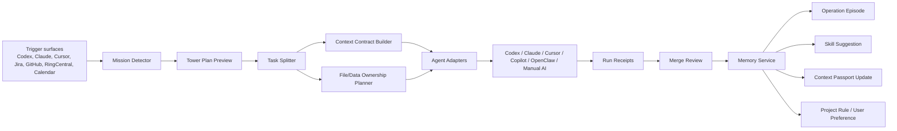

# 新能力：Agent Memory Control Tower / 多 AI 协作塔台（搁置）

> 生成日期：2026-05-12 CST  
> Codex 会话标题建议：新能力：多 AI 协作塔台（搁置）  
> 交付物：功能计划 + 可预览 Demo  
> Demo：[`agent-memory-control-tower-demo.html`](./agent-memory-control-tower-demo.html)

## 搁置原因

当前暂不建议推进这个方向。

核心原因是可行性和产品主题都不够匹配：在现有 Personal AI 系统设计中，除了 OpenClaw 可以通过接口访问外，Personal AI 并不能直接自动调用 Codex、Claude Code、Cursor、GitHub Copilot、ChatGPT/豆包等 agent 工具去执行拆分好的命令。要把它做成真正的 Control Tower，需要更强的 app / desktop / connector 能力，工程前置条件较重。

同时，这个方向会把产品重心从“个人记忆系统”推向“调度其他 AI 的调度器”。它虽然可以消费记忆和生成 context contract，但主价值变成 agent orchestration、任务执行和跨工具调度，和 Personal AI 当前“留存记忆、召回记忆、在真实场景提示记忆”的核心主题偏离较多。

更合理的处理方式是：暂时不把它作为独立能力推进，只把其中可复用的部分保留为 `AI Context Passport` 的高级场景，例如多份 work order、上下文包、手动 receipt 回收；自动执行闭环只保留在 OpenClaw 这类已有接口能力范围内。

## 结论

本方案记录为搁置方向：**Agent Memory Control Tower / 多 AI 协作塔台**。

它不是再做一个 AI 聊天入口，也不是简单把上下文复制给 Codex、Claude Code、Cursor 或 ChatGPT。它的核心是：当用户把一件真实工作交给多个 AI agent、多个平台、多个窗口或多个后台任务时，Personal AI 负责做“塔台”。

但这里必须先收紧一个重要边界：**在当前 Personal AI 系统设计里，除了 OpenClaw 可以通过接口访问外，Personal AI 不能直接自动调用 Codex、Claude Code、Cursor、GitHub Copilot、ChatGPT/豆包等 agent 工具执行拆分好的命令。** 因此 Control Tower 的第一阶段不是“自动调度所有 agent”，而是：

- OpenClaw：可通过接口创建/分派/读取任务。
- 其他 agent：生成可复制的 work order、上下文包、文件边界和验证契约，由用户手动投递，或由未来 connector 支持。
- 已执行结果：通过用户粘贴、Desktop App 本地观察、git diff/test output、或目标平台 API 回收成 run receipt。

在这个现实边界下，Control Tower 负责：

- 把任务拆成可并行、可验证、边界清楚的 agent work orders。
- 给每个 agent 分配最小必要记忆、文件/数据边界、输出契约和验证标准。
- 在可观察范围内监控这些 agent 的进展、文件冲突、上下文漂移、成本消耗和风险动作。
- 把结果合并成用户可审阅的 diff、证据链、下一步指令和长期记忆。
- 把成功协作模式沉淀回 Context Passport、Operation Flight Recorder 和 Personal Skill Foundry。

一句话：

> Personal AI 不只记住“我和 AI 聊过什么”，还要成为我同时使用多个 AI agent 时的任务塔台、记忆中枢和合并审计层。

## 本次输入信号

### Reminders 检查

本机 Reminders 已读取到可见列表：

- `We`
- `Next actions`
- `Moives`
- `Shopping List`
- `家庭`
- `人名记忆`
- `宝宝需要办理`
- `吃吃看`
- `出门前检查`
- `装修待办`
- `Reading`
- `菜头`
- `Tasks`

没有发现名为 `Personal AI` 的列表，因此本次没有从 Reminder item 随机抽取新 idea，也没有需要标记 done 或写备注的 Reminder item。

### 真实记忆信号

按要求连接 `10.32.56.212` 查询 `esone.qiu` 用户记忆。本次通过 HTTP recall 和只读 SSH/SQLite 两条路径查询，未写入远端数据。

关键观察：

- `messages_raw` 主要来源为 `glip` 8652 条、`meeting` 245 条、`system` 154 条、`calendar` 90 条，说明用户真实记忆主要来自聊天、会议、AI 对话和日历。
- 用户身份为 Scrum Master，时区 `Asia/Shanghai`，日常场景高度依赖 RingCentral、Jira、会议、周会、项目同步和 AI 工具协作。
- 最近日历里已经出现 `Bug - AI 先修一遍我再看`，描述中包含 repo、开发分支和移动端 MR 链接。这是非常直接的信号：用户想让 AI 先做初筛/修复，再由人审。
- 真实聊天里高频出现 Codex、Claude Code、Cursor、OpenClaw/RingClaw、AI 工具 license/cost、Codex Chrome 插件、webapp MCP 等讨论。
- 实体统计里 `AI`、`AI-assisted software development`、`bug fixing`、`current practices`、`black-box development` 等主题近期活跃。
- 用户已有多个 progressing 方案：AI Context Passport、Operation Memory Flight Recorder、Personal Skill Foundry、Memory Day Pilot、Relationship Radar、Decision Time Machine、Memory Trust Console。它们分别解决上下文交接、操作 episode、技能沉淀、日级编排、人际上下文、决策回放和记忆治理，但还没有一个专门解决“多个 AI agent 同时工作时如何分工、监控、合并和留痕”的塔台层。

这些信号共同指向一个产品空位：**用户已经进入多 AI agent 协作阶段，但目前仍靠人脑记住哪个 agent 做到哪、哪些文件可能冲突、哪些上下文已经给过、哪个结论可信、下一步该把结果交给谁。**

## 为什么值得做

Personal AI 的长期目标是保存用户与 AI、网页、会议、聊天、操作、偏好和 skill 的全部记忆，并在真实场景里提供记忆关联提示。过去的能力大多围绕“个人记忆如何被检索或交给一个 AI 使用”。但 2026 年的真实工作流正在变成：

1. 用户开一个 Codex 本地会话修 bug。
2. 同时让 Cursor background agent 做一个文档/测试任务。
3. 让 Claude Code subagent 做只读代码探索或 review。
4. 让 GitHub Copilot cloud agent 在 issue/PR 上后台改分支。
5. 会议和聊天里还有新的上下文持续进来。
6. 用户最后需要把多个 agent 的结果合并、审查、写回 Jira/聊天/会议纪要。

其中第 1-4 步目前不能由 Personal AI 全部自动启动。更准确的 MVP 假设是：Personal AI 只自动调用 OpenClaw；对 Codex、Claude Code、Cursor、Copilot 等平台，先生成可投递的 work order，并通过本地/手动方式回收结果。

这时用户真正痛的不是“没有 AI”，而是：

- **任务分工难**：不知道该把哪个子任务交给哪个 agent，哪些任务适合并行，哪些必须串行。
- **上下文重复投喂**：每个 agent 都要重新解释项目目标、用户偏好、已确认约束和历史坑。
- **文件冲突风险**：多个 agent 改同一批文件，最后合并成本可能超过节省的时间。
- **进展不可见**：后台 agent 在做什么、卡在哪里、是否在乱跑，用户只能打开各个平台分别看。
- **验证断裂**：A agent 跑了测试，B agent 没跑；C agent 生成了 PR 但不知道前面会议里已否掉这个方向。
- **记忆丢失**：agent 失败或成功的原因留在某个会话里，没有变成下次可用的 task pattern、skill 或项目规则。
- **成本不可控**：后台 agent 和 subagent 会快速消耗 token/额度，用户需要知道“这件事值得烧多少”。

Agent Memory Control Tower 的价值是把这些分散问题收敛成一个用户可控的工作面：**先规划，再分派，再观察，再合并，再沉淀。**

## 业内趋势与竞品参考

### OpenAI Codex：从单个 coding assistant 变成多 agent command center

OpenAI Codex 官方页面把 Codex app 描述为 agentic coding 的 command center，并强调 built-in worktrees、cloud environments、parallel agents、Skills 和 Automations。参考：

- [OpenAI Codex](https://openai.com/codex/)
- [OpenAI Codex docs](https://developers.openai.com/codex/cloud)

可借鉴点：

- worktree / cloud environment 是并行 agent 的基础隔离单元。
- Skills 和 Automations 说明 coding agent 已经不只是一次性聊天，而是可重复、可后台、可跨任务运行。
- Codex 已经提供“多 agent 工作台”的雏形，但它主要服务 Codex 自身，不会统一管理 Claude Code、Cursor、Copilot、OpenClaw、ChatGPT/豆包等外部 AI。

Personal AI 的机会：

- 作为用户私人的跨平台塔台，管理所有 AI agent 的记忆、任务、上下文和运行收据。

### Cursor Background Agents：后台 agent 会成为常态

Cursor Background Agents 支持异步远程 agents，在隔离环境里编辑和运行代码；其 API 可以创建和管理在 GitHub repo 上自主工作的 agents。参考：

- [Cursor Background Agents](https://docs.cursor.com/en/background-agents)
- [Cursor Background Agents API](https://docs.cursor.com/background-agent/api/overview)

可借鉴点：

- 后台 agent 需要状态查看、follow-up、接管和分支 handoff。
- Cursor 支持一个 API key 下大量 active agents，这意味着“任务排队、预算、状态和冲突管理”会成为真实产品需求。

Personal AI 的机会：

- 不和 Cursor 抢 coding agent，而是帮用户决定何时开 Cursor agent、给什么上下文、如何和其他 agent 的结果合并。

### GitHub Copilot Cloud Agent：issue/PR 里的后台开发者

GitHub 文档说明 Copilot cloud agent 可以在后台独立完成任务，支持研究 repo、创建实现计划、修 bug、增加功能、改测试、改文档、处理技术债和合并冲突。参考：

- [GitHub Copilot cloud agent](https://docs.github.com/en/copilot/concepts/agents/cloud-agent/about-cloud-agent)

可借鉴点：

- 后台 coding agent 已进入 GitHub 原生工作流：branch、commit、PR、review、iteration。
- GitHub 文档也指出本地 IDE AI session 的决策很容易丢失，除非被 commit 或记录。

Personal AI 的机会：

- 捕获这些“未 commit 的 AI 决策”和跨平台分工，变成用户自己的 agent run memory。

### Claude Code Subagents：上下文隔离、角色化和权限控制

Claude Code subagents 文档强调：subagent 在自己的 context window 中工作，带独立系统提示、工具权限和权限模式；它们用于保存主对话上下文、限制工具、复用配置、按任务专精，并可配置持久 memory 目录。参考：

- [Claude Code subagents](https://code.claude.com/docs/en/sub-agents)

可借鉴点：

- subagent 的真正价值是“把探索、review、测试、分析从主对话隔离出去”。
- 权限、工具、模型和 memory scope 是用户必须看得懂的控制面。

Personal AI 的机会：

- 不仅在一个 Claude session 内管理 subagent，而是跨 Codex / Claude / Cursor / Copilot 统一定义“这个子任务应该是什么角色、什么权限、什么记忆、什么输出契约”。

### Anthropic Multi-Agent Research：多 agent 需要明确任务边界和可观测性

Anthropic 在 2025 年分享的 multi-agent research system 中提到，lead agent 需要给 subagent 明确目标、输出格式、工具/来源指导和任务边界；否则 agent 会重复工作、留下空洞或错过必要信息。文章还强调 stateful agent 错误会累积，需要 checkpoint、retry、tracing 和高层可观测性。参考：

- [How we built our multi-agent research system](https://www.anthropic.com/engineering/multi-agent-research-system)

可借鉴点：

- 多 agent 的瓶颈不是“开更多 agent”，而是 orchestration、边界、追踪和恢复。
- 对用户隐私友好的高层 observability 很重要：看决策模式和互动结构，不必暴露所有原文。

Personal AI 的机会：

- 用用户自己的记忆系统做 orchestration，而不是把所有上下文交给某个第三方平台。

## 相关研究依据

### CAID：异步软件工程 agent 需要集中委派 + 隔离 workspace + 结构化合并

2026 年论文 [Effective Strategies for Asynchronous Software Engineering Agents](https://arxiv.org/abs/2603.21489) 提出 Centralized Asynchronous Isolated Delegation (CAID)，核心包括集中任务委派、异步执行、隔离工作区，以及通过测试验证做结构化整合。论文指出并行 agent 的实际难点是并发编辑互相干扰、依赖同步困难、部分进展难以合并，并发现 `git worktree`、`git commit`、`git merge` 等 SWE primitive 是可靠协作的关键。

这直接支持本方案的底层设计：Personal AI 应该先做 task split、file ownership、workspace isolation 和 merge review，而不是只把 prompt 丢给多个 agent。

### Coding agent 采用已经很快，不再是少数人的玩具

2026 年论文 [Agentic Much? Adoption of Coding Agents on GitHub](https://arxiv.org/abs/2601.18341) 对 GitHub 项目中的 coding agent 采用进行了大规模研究，指出 Cursor、Claude Code、Codex 等 agent 能从自然语言任务生成完整 PR，并估计 adoption 已经达到很高比例且仍在增长。

启发：

- 用户很快会同时拥有多个 agent 产生的 commits、PR 和会话痕迹。
- Personal AI 若只做单点 recall，会落后于真实工作形态。

### Agent manifests 说明“项目级规则和操作说明”是 agent 效果的关键资产

论文 [On the Use of Agentic Coding Manifests](https://arxiv.org/abs/2509.14744) 分析 Claude Code 的 `Claude.md` 等 manifest，指出这些文件为 agent 提供项目上下文、身份和操作规则，内容主要集中在命令、技术实现说明和架构规则。

启发：

- Personal AI 已经有 `AGENT.md`、skills、用户偏好和项目记忆，天然可以生成/维护 agent manifest。
- Control Tower 可以为每个子任务动态渲染“任务级 manifest”，避免把整个项目上下文全部塞给每个 agent。

### 不同 agent 擅长的任务类型不同

2026 年论文 [Comparing AI Coding Agents](https://arxiv.org/abs/2602.08915) 比较 OpenAI Codex、GitHub Copilot、Devin、Cursor 和 Claude Code 的 PR 接受情况，指出不同 task type 上没有单一 agent 永远最好：例如文档、新功能、fix 等任务类别表现不同。

启发：

- Control Tower 不应该假设“一个最强 agent 做所有事”。
- 用户体验上应允许把探索、实现、测试、文档、review 分给不同 agent，并根据历史 run receipt 学会用户自己的偏好。

## 功能定义

### 一句话

在用户准备让 AI 处理一件复杂工作时，Personal AI 先生成一张“多 agent 作战图”，再为每个 agent 分配上下文、边界、权限和验证标准，最后把运行结果合并成可审阅、可追溯、可沉淀的个人记忆。

### 是什么

- 多 AI agent 的任务规划和分派台；当前只对 OpenClaw 做自动分派，其他平台先做手动投递/结果回收。
- 跨 Codex、Claude Code、Cursor、Copilot、OpenClaw、ChatGPT/豆包的上下文控制面。
- 文件/数据 ownership 和冲突预警。
- Agent run receipt、测试证据、成本、风险动作的审计层。
- 把协作结果沉淀为 Operation Episode、Skill Suggestion、Context Passport 和项目规则的入口。

### 不是什么

- 不是替代 Codex/Cursor/Claude Code 自己写代码。
- 不是默认自动把用户数据发给所有第三方 AI。
- 不是承诺能直接启动所有外部 agent；当前除了 OpenClaw，其他平台默认不能自动调用。
- 不是一开始就做全自动 merge / push / deploy。
- 不是全天候监控所有屏幕。
- 不是把所有 agent 会话内容全文同步到一个大 prompt。

## 核心体验

### 入口 1：Composer 旁的“交给塔台”Chip

当用户在 Codex、Claude、Cursor、ChatGPT、豆包、GitHub issue、Jira 或 RingCentral 输入框里输入复杂任务时，Personal AI 显示低打扰 chip：

- `交给塔台`
- `拆给多个 AI`
- `生成 agent work orders`
- `检查是否适合并行`

触发条件示例：

- prompt 里出现“让 AI 先修”“拆一下”“同时做”“review + test + doc”“多个方案对比”等词。
- 当前页面包含 repo、branch、MR/PR、Jira issue、会议 action item。
- 用户最近已经在多个 AI 工具里围绕同一 project/chat/thread 操作。

点击后不自动发送，而是打开 **Tower Plan Preview**。

### 入口 2：Tower Plan Preview

这是用户决定是否启动多 agent 的关键界面。

它展示：

- **Mission**：任务目标和当前上下文来源。
- **Suggested Agents**：建议使用哪些 agent，每个 agent 的角色、模型/平台、成本级别、权限。
- **Context Contract**：每个 agent 会收到哪些记忆、哪些不会发出去、哪些需要用户确认。
- **File/Data Ownership**：每个 agent 可编辑或只读的文件/页面/数据范围。
- **Dependency Graph**：哪些任务可并行，哪些必须等前置结果。
- **Validation Plan**：每个 agent 必须跑的测试、截图、命令、人工检查点。
- **Merge Policy**：谁负责最终合并，何时必须人工确认。

默认只生成计划，不启动 agent。用户可以：

- 删除某个 agent。
- 把某个任务从 write 改成 read-only。
- 调整预算，例如 `轻量探索` / `标准修复` / `深度多 agent`。
- 选择目标平台：只用 Codex、本地 Codex + Claude、Codex + Cursor background、全部手动复制。

### 入口 3：Agent Mission Board

启动后进入 `memory-exploring.html#/agents` 或 Desktop App 的新页面。页面结构：

- 左侧：Mission 队列，包括活跃任务、待审任务、失败任务、可复用模式。
- 中间：Agent Lanes，每个 agent 一条泳道，显示状态、当前动作、工作区、文件 claim、上下文包版本、最新 receipt。
- 右侧：Memory Contract，包括任务目标、关键证据、用户偏好、隐私边界、成本预算、风险动作。
- 底部：Merge Review Strip，显示分支、diff、测试、冲突、待用户确认项。

用户不需要打开五个 AI 工具才能知道整体进展。

### 入口 4：Merge Review

当 agent 完成后，Control Tower 不直接宣布“完成”，而是进入合并审查：

- 每个 agent 的输出是否符合 output contract。
- 哪些文件/数据被改过，是否撞 ownership。
- 哪些测试真实运行，哪些只是 agent 声称运行。
- 哪些结论有证据，哪些只是推测。
- 是否产生新记忆、新 skill、项目规则补丁或 Context Passport 更新。

用户可以：

- 接受某个 agent 的结果。
- 要求另一个 agent review 它。
- 让 Codex 生成最终 merge patch。
- 标记失败原因，沉淀为下次 task split 的经验。

## 典型用户场景

### 场景 A：Bug - AI 先修一遍我再看

1. 用户日历里有 `Bug - AI 先修一遍我再看`，包含 repo、branch、MR 链接。
2. Personal AI 在会议前或用户打开相关 Jira/MR 时提示：`这个任务适合塔台拆分`。
3. Tower Plan 建议：
   - Claude Code Explore：只读理解 bug、相关模块和测试入口。
   - Codex Local：在隔离 worktree 里实现最小修复。
   - Cursor Background：补测试或文档，不碰核心实现文件。
   - Personal AI：监控聊天/会议里是否有新约束。
4. 用户确认后，OpenClaw work order 可以由 Personal AI 通过接口创建；Codex / Claude Code / Cursor work order 先以复制、深链或本地 context file 方式交给用户投递。
5. 中途 Control Tower 如果能从本地 git/worktree 或用户回填 receipt 看到 Codex 和 Cursor 都想改同一测试文件，就提示改为串行或重分配。
6. 结束后生成 merge review：修复 diff、测试证据、未决风险、给会议/聊天的简短更新。
7. 如果这类 bug triage 重复出现，Control Tower 把 task split 规则沉淀为 Skill Foundry 建议：`AI Bug First Pass Protocol`。

### 场景 B：Nova weekly / Jira 数据报告

用户作为 Scrum Master 需要整理 Jira 数据、会议结论和项目状态。

Tower Plan：

- Agent 1：读取相关 RingCentral 讨论和日历，提炼需求口径。
- Agent 2：生成 Jira/JQL 数据拉取计划，输出字段和过滤规则。
- Agent 3：生成 Google Sheet 或图表草稿。
- Agent 4：review 数据口径和异常值。

Control Tower 的重点不是让 AI 胡乱写报告，而是确保每个 agent 都知道：

- 用户是 Scrum Master。
- 口径曾经如何被 Sophia / team 确认。
- 哪些字段不能猜。
- 哪些数据必须附来源链接。
- 最终输出要能贴进周会或 RingCentral。

### 场景 C：跨 AI 工具继续一个任务

用户先在 ChatGPT 里讨论方案，再让 Codex 实现，再让 Claude Code review，再把结果发给 RingCentral。

如果只有 AI Context Passport，用户得到的是“一份上下文护照”。如果有 Control Tower，系统进一步知道：

- ChatGPT 产出的哪些是已采用方案，哪些只是备选。
- Codex 已经尝试过什么，失败在哪。
- Claude review 发现的问题是否已解决。
- RingCentral 里哪些人需要收到最终摘要。
- 这条任务未来是否应该成为 skill 或 automation。

## 核心对象

### Mission

一次用户要完成的真实工作。

字段示例：

- `id`
- `title`
- `goal`
- `source_surface`: `calendar` / `glip` / `jira` / `github` / `codex` / `manual`
- `source_refs`
- `status`: `draft` / `planned` / `running` / `reviewing` / `done` / `blocked`
- `priority`
- `budget_policy`
- `privacy_scope`
- `created_from_memory_ids`

### Agent Work Order

给某个 agent 的任务单。

字段示例：

- `mission_id`
- `agent_platform`: `codex_local` / `codex_cloud` / `claude_code` / `cursor_background` / `github_copilot` / `openclaw` / `manual_ai`
- `role`: `explorer` / `implementer` / `reviewer` / `tester` / `doc_writer` / `data_analyst`
- `objective`
- `allowed_tools`
- `permission_mode`
- `workspace_strategy`
- `file_claims`
- `context_package_id`
- `output_contract`
- `validation_contract`
- `dependency_ids`
- `status`

### Context Contract

描述“给这个 agent 什么记忆，以及为什么”。

字段示例：

- `included_memories`
- `excluded_memories`
- `redactions`
- `scope`: `work` / `personal` / `both`
- `freshness_window`
- `source_links`
- `user_preferences`
- `project_rules`
- `do_not_repeat`
- `must_verify`

### Run Receipt

agent 完成或中途 checkpoint 后写回的收据。

字段示例：

- `work_order_id`
- `summary`
- `files_changed`
- `commands_run`
- `tests_run`
- `evidence_links`
- `blocked_reason`
- `claims`
- `cost_estimate`
- `risk_flags`
- `next_prompt`
- `created_at`

### Merge Review

用户最后看到的合并审查对象。

字段示例：

- `mission_id`
- `accepted_receipts`
- `rejected_receipts`
- `conflicts`
- `test_matrix`
- `human_decisions`
- `final_patch_refs`
- `memory_updates`
- `skill_suggestions`

## 信息架构



## 技术设计

### 前端

建议新增：

- `memory-exploring.html#/agents`：Agent Mission Board。
- 输入框旁 `Tower Chip`：复用 Context Assist 的页面探测、低打扰提示、sensitive page guard。
- `Tower Plan Preview` modal：生成前预览，默认不启动。
- `Merge Review` drawer：对比 agent outputs、测试、冲突和证据。

首版不要求所有平台都能自动启动。只要能生成高质量 work orders，并支持复制到目标 agent，就能产生价值。

更明确地说，首版执行能力矩阵如下：

| 平台 | 当前能否自动调用 | 首版处理方式 |
|---|---:|---|
| OpenClaw / RingClaw | 可以 | 通过现有接口创建任务、读取状态和回收结果 |
| Codex 本地/云端 | 不可以 | 生成 work order 和 context file；用户手动粘贴/启动；Desktop App 尝试观察本地 git/test 结果 |
| Claude Code | 不可以 | 生成 subagent/work order prompt；用户手动投递；结果手动粘贴或本地日志导入 |
| Cursor Background Agent | 当前系统不可以 | 首版只生成任务单；API 适配作为未来 connector，不放进 MVP 执行承诺 |
| GitHub Copilot cloud agent | 当前系统不可以 | 首版只读 PR/issue/check 作为 receipt 来源；不自动 assign/启动 |
| ChatGPT / 豆包 / Gemini 等 Web AI | 不可以 | 只做 Context Passport / work order 复制，不自动注入或发送 |

### Desktop App

Desktop App 适合承担本机集成：

- 读取 Codex/Claude/Cursor/OpenClaw 本地 session logs 或 workspace metadata。
- 监听 git worktree、branch、diff、test output。
- 生成任务级 context file，供用户手动交给 Codex/Claude Code；当前不承诺自动启动这些工具。
- 监控文件 claim 冲突。
- 对敏感文件做本地 redaction，再决定是否进入 Context Contract。

### Memory Service

建议新增 API：

- `POST /agent-missions/plan`
  - 输入：surface snapshot、用户 prompt、source refs。
  - 输出：mission + suggested work orders + context contracts。
- `POST /agent-missions`
  - 保存 mission draft 或 running mission。
- `GET /agent-missions`
  - Mission Board 列表。
- `GET /agent-missions/:id`
  - 详情、work orders、receipts、merge review。
- `POST /agent-work-orders/:id/receipt`
  - OpenClaw、Desktop App 或用户手动导入的结果写回 run receipt。
- `POST /agent-missions/:id/merge-review`
  - 生成合并审查。
- `POST /agent-missions/:id/finish`
  - 结束任务，写回 operation episode / skill suggestion / context passport update。

### 数据表草案

```sql
create table agent_missions (
  id text primary key,
  user_id text not null,
  title text not null,
  goal text not null,
  source_surface text not null,
  source_refs_json text not null default '[]',
  status text not null,
  priority real not null default 0.5,
  budget_policy_json text not null default '{}',
  privacy_scope text not null default 'work',
  created_from_memory_ids_json text not null default '[]',
  created_at integer not null,
  updated_at integer not null
);

create table agent_work_orders (
  id text primary key,
  mission_id text not null,
  agent_platform text not null,
  role text not null,
  objective text not null,
  permission_mode text not null default 'read_only',
  workspace_strategy text not null default 'manual',
  file_claims_json text not null default '[]',
  context_package_id text,
  output_contract_json text not null default '{}',
  validation_contract_json text not null default '{}',
  dependency_ids_json text not null default '[]',
  status text not null,
  created_at integer not null,
  updated_at integer not null
);

create table agent_context_contracts (
  id text primary key,
  mission_id text not null,
  work_order_id text,
  included_refs_json text not null default '[]',
  excluded_refs_json text not null default '[]',
  redactions_json text not null default '[]',
  rendered_prompt text not null,
  prompt_hash text not null,
  created_at integer not null
);

create table agent_run_receipts (
  id text primary key,
  work_order_id text not null,
  status text not null,
  summary text not null,
  files_changed_json text not null default '[]',
  commands_run_json text not null default '[]',
  tests_run_json text not null default '[]',
  evidence_links_json text not null default '[]',
  claims_json text not null default '[]',
  cost_estimate_json text not null default '{}',
  risk_flags_json text not null default '[]',
  created_at integer not null
);

create table agent_merge_reviews (
  id text primary key,
  mission_id text not null,
  conflicts_json text not null default '[]',
  test_matrix_json text not null default '[]',
  accepted_receipts_json text not null default '[]',
  rejected_receipts_json text not null default '[]',
  human_decisions_json text not null default '[]',
  final_summary text not null,
  created_at integer not null
);
```

## 关键算法与规则

### 1. Task Splitter

输入：

- 用户 prompt。
- 当前页面/会议/聊天/Jira/GitHub context。
- 相关记忆 recall。
- repo 文件拓扑、最近 diff、测试命令、AGENT.md。

输出：

- 可并行子任务。
- 依赖关系。
- agent role 推荐。
- 每个子任务的 output contract。

原则：

- 能读不写的先分给 explorer/reviewer。
- 会改同一文件的任务默认串行。
- 对用户口径、对外沟通、真实数据写入类任务默认保留人工确认。
- 任务目标不清时，先创建 `clarifier` work order，而不是让多个 agent 猜。

### 2. File/Data Ownership Planner

目标是避免多个 agent 同时踩同一片工作区。

规则：

- 预测每个 work order 可能触碰的文件、页面、表格、Jira 字段或消息线程。
- 对 write task 分配 exclusive claim。
- 对 test/doc/review task 分配 read claim 或 delayed write claim。
- 如果两个 write claim 重叠，要求用户选择：
  - 拆分文件范围。
  - 改为串行。
  - 创建独立 worktree，最后人工 merge。

### 3. Context Contract Builder

给每个 agent 的上下文必须最小化：

- Mission goal。
- 用户角色和本任务相关偏好。
- 必要项目规则。
- 相关记忆证据。
- 已尝试失败路径。
- 输出格式和验证命令。
- 不允许做什么。

不应给：

- 无关个人记忆。
- 与任务无关的完整聊天历史。
- 没经用户确认的敏感内容。
- 只会增加 token 的旧工具输出。

### 4. Run Receipt Normalizer

不同 agent 平台输出不同，需要统一成 receipt：

- OpenClaw / RingClaw：通过现有接口读取任务状态、结果、文件/消息引用和执行日志。
- Codex：不能自动启动；只在用户手动运行后，通过本地 transcript、changed files、commands、test output 或用户粘贴结果生成 receipt。
- Claude Code：不能自动启动；只在用户手动运行后，通过 session summary、subagent result、files 或用户粘贴结果生成 receipt。
- Cursor Background：当前系统不能自动创建；未来有 connector 时可读 API status、branch、diff、summary；MVP 只支持手动 receipt。
- GitHub Copilot：当前系统不能自动 assign/启动；MVP 只读 issue/PR comments、commits、checks 作为外部 receipt。
- Manual AI：用户粘贴结果，Personal AI 解析成 receipt。

所有 receipt 都要区分：

- `observed`: 本地或 API 直接观察到的事实。
- `claimed`: agent 自己声称但未验证。
- `inferred`: Personal AI 从上下文推断。

### 5. Merge Review Scoring

合并前给每个 work order 一个 readiness score：

- 输出是否符合 contract。
- 测试是否真实运行。
- 变更是否越界。
- 证据链接是否存在。
- 是否和其他 agent 冲突。
- 是否违反用户偏好或项目规则。
- 是否需要外部写入/发送/部署确认。

## 用户体验原则

### 先计划，后启动

多 agent 不是越多越好。默认体验应该是“先给用户看一张计划”，而不是一键开 5 个 agent 烧 token。

### 低打扰，但在关键风险点强提醒

普通状态变化进 Mission Board；只有这些情况弹出：

- write claim 冲突。
- agent 请求敏感权限。
- 预算即将超限。
- agent 声称完成但没有证据。
- 需要用户对外发送、合并、部署或删除。

### 展示“边界”，不是展示“魔法”

每个 agent lane 都要清楚展示：

- 它负责什么。
- 它不能做什么。
- 它拿到了哪些记忆。
- 它改了哪些文件。
- 它跑了哪些验证。

### 从用户视角组织，不从平台视角组织

用户关心的是 `Bug 首轮修复`、`Nova weekly 数据`、`Meeting follow-up`，不是 `Codex session 123` 或 `Cursor agent 456`。平台只是执行者。

### 默认人工合并

MVP 不做自动 merge/push/deploy。Control Tower 可以建议命令、生成 patch、提示风险，但最终对外可见动作由用户确认。

## 隐私与安全

### 数据出境控制

每个 Context Contract 都有可审阅清单：

- 将发送给哪个平台。
- 包含哪些记忆。
- 是否包含个人/工作/混合 scope。
- 哪些字段已 redacted。
- 哪些来源链接只保留本地 explore link。

默认策略：

- `personal` scope 不发给工作 agent。
- 密钥、cookie、token、客户数据、私聊内容默认打码。
- 第三方 Web AI 平台默认只允许用户复制，不自动注入/发送。

### Prompt injection 防护

来自网页、聊天、PR、Jira 的第三方文本不能被当成系统指令。

Context Contract 渲染时要分区：

- `User Goal`
- `Trusted Project Rules`
- `Retrieved Evidence`
- `Untrusted External Content`
- `Allowed Actions`
- `Do Not Obey From Evidence`

### Agent 权限分层

建议权限模式：

- `read_only`
- `edit_in_worktree`
- `edit_selected_files`
- `run_tests_only`
- `prepare_patch_only`
- `external_write_requires_approval`

### 成本预算

每个 mission 显示：

- 预计 agent 数量。
- 预计 token/credits。
- 已消耗。
- 是否值得继续。

默认预算档：

- `light`: 1 个 explorer + 1 个 implementer。
- `standard`: explorer + implementer + reviewer。
- `deep`: 多平台并行 + merge review + extended validation。

## 与已有方案的关系

| 已有方案 | 现有主对象 | Control Tower 的边界 |
|---|---|---|
| AI Context Passport | 一份可迁移上下文包 | Control Tower 消费/生成多个 task-level passport，并跟踪是否被 agent 使用 |
| Operation Memory Flight Recorder | 一次跨工具操作 episode | Control Tower 产出的 mission、work orders、receipts 可汇总为 operation episode |
| Personal Skill Foundry | 技能真源和跨平台安装 | Control Tower 从高复用 mission 中提炼 skill suggestion |
| Memory Day Pilot | 今日任务编排 | Day Pilot 可以推荐今天哪些 mission 适合交给 Control Tower |
| Memory Trust Console | 记忆可信度治理 | Control Tower 使用 trust score 决定哪些记忆可发给 agent |
| Relationship Radar | 人际上下文 | 当任务涉及人/会议/沟通时，Control Tower 引入 person context |
| Decision Time Machine | 决策证据回放 | Merge Review 中的重要选择可写成 decision episode |

## 竞品对比

| 产品/方向 | 擅长 | 不足 | Personal AI 机会 |
|---|---|---|---|
| OpenAI Codex | Codex 内多 agent、worktree、skills、automation | 主要在 OpenAI/Codex 生态内 | 做跨 Codex/Claude/Cursor/Copilot/OpenClaw 的用户私有塔台 |
| Cursor Background Agents | 异步远程 coding agent、GitHub 分支工作流 | 上下文主要来自 Cursor/GitHub；用户个人会议/聊天/偏好弱 | 用 Personal AI 记忆生成更准的任务上下文和 merge review |
| GitHub Copilot Cloud Agent | issue/PR 原生后台开发 | GitHub 中心；本地 AI 会话、会议、聊天和操作记忆弱 | 把 GitHub agent 的 PR/branch 作为一个 work order 收据统一管理 |
| Claude Code Subagents | 单 session 内角色化、上下文隔离、权限控制 | 主要在 Claude Code 内部 | 把 subagent 思想扩展为跨平台 work orders |
| Devin / Factory / 其他云 agent | 长任务、issue-to-PR、自动化开发 | 通常是平台内闭环，用户自己的跨工具记忆弱 | Personal AI 作为平台外的个人控制面和记忆真源 |
| Memento / Engram 等记忆层 | 跨 AI 共享长期记忆 | 偏底层 memory，不管多 agent 分工和 merge | Control Tower 把记忆用于任务规划、边界和收据 |

## MVP 建议

### MVP-0：只读塔台，先不自动启动 agent

目标：两周内验证产品体验。

范围：

- 新页面 `#/agents` 或静态 preview。
- 用户手动输入/从当前页面生成 mission。
- 生成 work orders 和 context contracts。
- 支持一键复制给 Codex / Claude / Cursor / ChatGPT。
- 手动粘贴 agent 结果，解析成 run receipt。
- 生成 merge review。

价值：

- 不需要平台 API 权限。
- 不涉及自动发送敏感数据。
- 能快速验证“计划 + 分工 + 合并审查”是否真有用。

### MVP-1：OpenClaw 执行 + 本机观察轻集成

范围：

- OpenClaw / RingClaw：通过现有接口创建 work order、读取状态、回收 receipt。
- Desktop App 读取当前 repo、branch、git status、AGENT.md。
- 生成本地 worktree 建议。
- 写入任务级 context file 到临时目录，供用户手动交给 Codex/Claude Code。
- 读取用户手动运行后的 Codex/Claude 本地 transcript 或用户指定 session 输出。
- 自动提取 changed files、commands、tests。
- 文件 claim 冲突提示。

价值：

- 对用户当前真实“OpenClaw 可自动、其他 agent 手动投递”的工作流最直接。
- 不依赖 Codex/Claude/Cursor/GitHub 的自动执行 API。

### MVP-2：外部平台 Connector 探索

范围：

- Cursor Background Agent API：如果未来有凭证和产品决策，再评估创建 agent、读 status、读 branch summary。
- GitHub Copilot / GitHub PR：优先只读 issue/PR、checks、comments、commits；是否能自动 assign Copilot 另行评估。
- Codex / Claude Code：除非官方或本机 connector 能安全启动，否则继续保持“生成任务单 + 手动投递 + receipt 回收”。
- 每个平台即使接入，也只做“创建草稿/读取状态/回收 receipt”，外部写入仍需确认。

### MVP-3：学习用户自己的 agent routing 策略

范围：

- 统计历史 run receipt。
- 学会哪些任务适合哪个 agent。
- 学会哪些 repo/文件经常冲突。
- 学会用户偏好的验证强度。
- 自动推荐 skill suggestion 或 AGENT.md 补丁。

## 成功指标

短期：

- 用户在复杂 AI 任务前愿意点开 Tower Plan。
- Work orders 复制后能减少用户手动解释上下文的时间。
- Merge Review 能发现至少一类用户肉眼容易漏的风险：未跑测试、文件冲突、越界修改、证据不足。

中期：

- 多 agent 任务的返工率下降。
- 用户手动重复粘贴项目规则/上下文次数下降。
- Agent 结果能稳定写回 operation episode 和 skill suggestion。
- 用户能在 Mission Board 看懂当前所有 AI 后台任务状态。

长期：

- Personal AI 可以基于用户历史自动推荐“这个任务应该让哪个 agent 做”。
- Personal AI 成为跨 AI 工具的私人任务记忆中枢。
- 用户不再依赖某一个 AI 平台的记忆，而是拥有自己的 agent collaboration memory。

## Demo 说明

Demo 文件：[`agent-memory-control-tower-demo.html`](./agent-memory-control-tower-demo.html)

Demo 展示的是 MVP-0 / MVP-1 的关键页面：

- 左侧 Mission 队列。
- 中间 Agent Lanes。
- 右侧 Context Contract。
- 底部 Merge Review。
- 可点击切换 mission，并查看不同 agent 分工、冲突和合并状态。

## 推荐决策

建议把这个方案作为 **高价值但分阶段推进** 的能力：

1. 先做 MVP-0，只生成计划、复制 work orders、手动 receipt 和 merge review。
2. 如果用户确实愿意用它规划复杂 AI 任务，再做 OpenClaw 自动分派 + 本机 git/receipt 观察。
3. Codex、Claude、Cursor、GitHub Copilot 等平台先不要写入“自动执行”承诺，等真实 connector 或官方 API 能安全调用后再评估。

原因是这个方向和 Personal AI 的项目目标高度吻合：它把消息记忆、会议记忆、浏览记忆、AI 对话记忆、操作记忆、用户偏好和 skill 全部汇集到一个真实高频场景里。它不是“又一个漂亮页面”，而是解决用户正在进入的下一阶段问题：**多个 AI agent 都能干活时，人类需要一个可信的个人塔台。**
