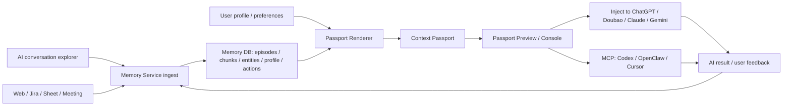

# 新能力：AI Context Passport / 跨 AI 上下文护照

_生成时间：2026-05-10_

## 结论

这次没有从 Reminders 的 `Personal AI` 清单里选题：当前清单只有 3 条已完成事项，且都是问题排查或反馈，不是全新的功能 idea。因此本方案来自项目目标、真实记忆查询、当前产品能力空位，以及 2025-2026 年 AI 记忆/上下文工程方向的产品和研究趋势。

我建议设计并评估一个新能力：**AI Context Passport**。它把用户在不同 AI 工具、浏览器页面、会议、Jira、Google Sheet、聊天线程中的“当前任务上下文”压缩成一份可审计、可复制、可继续执行的上下文护照，让用户可以把一件事从 ChatGPT/豆包/Codex/OpenClaw/Cursor/Gemini 之间无缝交接，而不用每次重新解释背景、偏好、已尝试方案、约束、证据和下一步。

一句话：**让 Personal AI 成为用户跨 AI 工具的上下文中台，而不是又一个单独聊天机器人。**

Demo HTML：[`ai-context-passport-demo.html`](./ai-context-passport-demo.html)

## 为什么值得做

Personal AI 的长期目标是保存用户与 AI、网页、会议、聊天、操作和 skill 的全部记忆，并在真实场景里做记忆关联提示。现在项目已经有：

- `Context Assist`：会前准备和输入框写作护航。
- `Desktop App`：豆包/ChatGPT explorer 输入、豆包输出同步、本机登录态管理。
- `Memory Service`：recall、profile、reflection、skills、meeting、notification、provider context packages。
- `Personal Skill Foundry`、`Relationship Radar`、`Decision Center` 等记忆资产页面。

但用户实际工作流里还有一个很强的断点：**同一件事经常在多个 AI 和多个工具之间迁移**。真实记忆里出现了这些信号：

- 用户角色是 Scrum Master，需要反复处理 Jira、会议、Google Sheet、群消息、项目进展等文书和协同工作。
- 用户正在尝试让 Codex 直连 Jira 来处理 SM 文书工作。
- 用户同时接触 Codex、Cursor、OpenClaw、豆包、Gemini、Factory.ai workshop、AI Notes、Everyone AI Campaign 等多个 AI 工具/生态。
- 用户有“凡事先让 AI 跑一遍”的工作习惯，但也会关注成本和工具差异，比如提到 Codex 消耗很快。
- 已经做了豆包桥接，但那更多是“同步/抓取/注入”，还不是“把一个任务的执行状态打包成可迁移工作单”。

这说明真正高频的痛点不是“我搜不到记忆”，而是：

1. 我刚在一个 AI 里说过一堆背景，换工具后又要重说。
2. AI 不知道我已经试过什么，容易重复劳动。
3. AI 不知道哪些历史结论可靠、哪些只是临时猜测。
4. AI 生成内容时不知道我的项目口径、对人语气、Jira/JQL/Sheet 约束。
5. 我很难看清“这个 AI 回答到底用了哪些记忆”。
6. 多个 AI 各自有记忆，但记忆不共享，长期会形成碎片化人格。

AI Context Passport 正好补这个空位。

## 行业趋势与竞品参考

### ChatGPT Memory：从“记住偏好”走向“Memory Sources”

OpenAI 的 ChatGPT Memory 已经支持 saved memories、reference chat history，并提供 Memory Sources，让用户看到个性化回答使用了哪些来源；文档还说明 Pulse 可使用聊天历史和 saved memories 做夜间异步研究和次日视觉摘要。

参考：

- [OpenAI Help Center - Memory FAQ](https://help.openai.com/en/articles/8590148-memory-in-chatgpt)

可借鉴点：

- 记忆必须可见、可删、可纠正。
- 个性化要展示来源，而不是黑箱。
- 记忆不只是聊天时使用，还能异步生成摘要和建议。

Personal AI 可以进一步做的是：ChatGPT 的记忆主要在 ChatGPT 内部，Personal AI 则可以把记忆变成跨工具护照。

### Claude / Anthropic：上下文工程和 Memory Tool

Anthropic 在 2025-09-29 发布的上下文工程文章强调，现代 agent 的关键问题从 prompt engineering 转为 context engineering：每次模型调用都要选择“最小但最高信号”的上下文。Claude Developer Platform 的 memory tool 可以让 Claude 在上下文窗口之外读写持久文件，并把经验跨会话带回来。其 context management 发布文章提到，memory tool + context editing 在内部 agentic search 评测上相对 baseline 提升 39%，context editing 在 100-turn web search 评测中减少 84% token 消耗。

参考：

- [Anthropic - Effective context engineering for AI agents](https://www.anthropic.com/engineering/effective-context-engineering-for-ai-agents)
- [Claude - Managing context on the Claude Developer Platform](https://claude.com/blog/context-management)
- [Claude API Docs - Memory tool](https://platform.claude.com/docs/en/agents-and-tools/tool-use/memory-tool)
- [Claude Code Docs - How Claude remembers your project](https://code.claude.com/docs/en/memory)

可借鉴点：

- 不是把所有历史塞进 prompt，而是做上下文策展。
- 长任务需要外部记忆、压缩、清理旧工具结果。
- 记忆要分层：项目规则、人类偏好、自动沉淀经验。

Personal AI 可以进一步做的是：把“上下文策展”产品化为用户能审阅的一张护照，而不是隐藏在某个 agent runtime 里。

### Gemini Personalization：从搜索历史和 Google Apps 获得个性化

Google 2025 年推出 Gemini personalization，先从 Search history 开始，后续扩展到 Photos、YouTube 等 Google apps，让 Gemini 根据用户过去活动提供更贴合的回答。

参考：

- [Google Blog - Introducing Gemini with personalization](https://blog.google/products-and-platforms/products/gemini/gemini-personalization/)

可借鉴点：

- 个性化来自真实活动流，不只是手写 profile。
- 用户必须能选择连接/断开数据源。

Personal AI 可以进一步做的是：不局限于 Google 生态，而是聚合浏览、会议、聊天、Jira、AI 对话和本机操作。

### Memento / Engram / Letta：多 AI 共享记忆层成为独立产品方向

Memento 的定位是本地优先、LLM-agnostic 的 AI memory layer，通过 MCP server 和一个 SQLite 文件让 Claude Desktop、Claude Code、Cursor、GitHub Copilot、Cline、Aider 等共享结构化记忆。它明确指出每个 AI 工具都有自己的 silo，但人类用户才是唯一常量。

参考：

- [Memento - local-first memory layer](https://runmemento.com/)
- [Engram - Persistent Memory for AI Agents](https://engram.so/)
- [Letta Docs - Agent memory and architecture](https://docs.letta.com/)

可借鉴点：

- MCP 是跨工具集成的现实路径。
- 记忆需要 scope、审计、decay、conflict detection。
- Stateful agents 的体验核心是“不要每次从零开始”。

Personal AI 可以进一步做的是：Memento/Engram 更偏底层记忆共享，Personal AI 可以加入浏览器/会议/消息现场的 UX，并把“记忆共享”变成用户能点选、修正、投递的工作流。

### MCP：一次接入，多处可用

MCP 官方介绍强调它是开放协议，可让 AI 应用/agent 接入数据源、工具和 app；生态已覆盖 Claude、ChatGPT、VS Code、Cursor 等客户端。

参考：

- [Model Context Protocol - Introduction](https://modelcontextprotocol.io/docs/getting-started/intro)

可借鉴点：

- AI Context Passport 不应只做 Chrome extension 内部功能。
- 中长期应该暴露为 MCP server：`list_passports`、`render_passport`、`ingest_result`、`mark_used`。

## 相关论文和技术依据

### Mem0：production-ready long-term memory

Mem0 在 LoCoMo benchmark 上比较了 memory-augmented systems、RAG、full-context、open-source memory、proprietary systems 等多类方案，报告相对 OpenAI 在 LLM-as-a-Judge 指标上有 26% 提升，graph memory 还略高于 base config；同时显著减少 full-context 方法的计算开销。

参考：[Mem0: Building Production-Ready AI Agents with Scalable Long-Term Memory](https://arxiv.org/abs/2504.19413)

### Memori：vendor-neutral persistent memory layer

Memori 将记忆视为数据结构问题，把非结构化对话转成 semantic triples 和 conversation summaries；在 LoCoMo 上用约 full context 5% 的 tokens 达到 81.95% accuracy，并减少 token 成本。

参考：[Memori: A Persistent Memory Layer for Efficient, Context-Aware LLM Agents](https://arxiv.org/abs/2603.19935)

### MemMachine：ground-truth-preserving episodic memory

MemMachine 强调保存完整对话 episode，减少只靠 LLM 抽取造成的信息损耗，并通过 contextualized retrieval 扩展命中的上下文范围；它指出 retrieval depth、context formatting、search prompt design、query bias correction 等检索阶段优化比单纯 ingestion 切分更重要。

参考：[MemMachine: A Ground-Truth-Preserving Memory System for Personalized AI Agents](https://arxiv.org/abs/2604.04853)

### A-MEM：动态组织和演化的 agentic memory

A-MEM 借鉴 Zettelkasten，让记忆条目带 contextual descriptions、keywords、tags，并在新记忆加入时自动建立链接、更新既有记忆表征。

参考：[A-MEM: Agentic Memory for LLM Agents](https://arxiv.org/abs/2502.12110)

### 2026 memory surveys：记忆已成为 agent 一等能力

2026 年两篇 survey 都把 memory 描述为让 stateless text generator 变成 adaptive agent 的关键能力，并讨论 write-manage-read loop、反思、自我改进、trustworthy reflection、learned forgetting、privacy governance 等工程挑战。

参考：

- [Memory for Autonomous LLM Agents: Mechanisms, Evaluation, and Emerging Frontiers](https://arxiv.org/abs/2603.07670)
- [Memory in the Age of AI Agents](https://arxiv.org/abs/2512.13564)

## 核心产品概念

### 什么是 Context Passport

Context Passport 是一份面向“继续执行”的结构化上下文包，不是普通搜索结果。

一个 passport 包含：

- **Mission**：这次任务到底要完成什么。
- **Current State**：已经做到哪一步，卡在哪里。
- **User Role & Preference**：本任务相关的用户角色、语气、格式、风险偏好。
- **Evidence Pack**：可追溯证据，包含 memory explore link、原始来源链接、时间、可信度。
- **Decisions**：已确认决策和仍待确认的问题。
- **Attempts & Dead Ends**：已尝试过的方案、失败原因、不要重复踩的坑。
- **Tool Context**：Jira/Google Sheet/meeting/thread/page 的关键参数，例如 JQL、sheet id、meeting id、provider binding。
- **Output Contract**：目标 AI 应该输出什么格式，比如 Jira comment、meeting agenda、Google Sheet update plan、Codex task brief。
- **Safety & Scope**：哪些记忆可带出到目标 AI，哪些只在本地可见，哪些需要用户勾选确认。
- **Freshness**：本护照生成时间、数据窗口、过期规则。

### 产品形态

#### 1. Composer 旁的 Passport Chip

用户聚焦 ChatGPT/豆包/Claude/Gemini/Codex Web/OpenClaw 输入框时，Personal AI 显示一个小 chip：

- `Build Passport`
- `Continue from last AI`
- `Attach Jira context`
- `Attach meeting decisions`

点击后不是直接塞 prompt，而是弹出一张可审阅的 Passport Preview。

#### 2. Passport Preview Popover

预览里用户可以：

- 看 Personal AI 准备带入哪些记忆。
- 删除不想给目标 AI 的证据。
- 切换输出目标：`Codex` / `ChatGPT` / `豆包` / `OpenClaw` / `Claude` / `Cursor`。
- 选择模式：`Brief` / `Detailed` / `Evidence-heavy` / `Low-token`。
- 复制或注入到当前输入框。

默认不自动发送，保持 Context Assist 的低打扰原则。

#### 3. Passport Console 新页面

一个新的 Memory Exploring 页面或 Desktop App 页面，用来管理所有活跃护照：

- 左侧：活跃任务线索，比如 `Jira Epic trend dry run`、`AI Notes meeting prep`、`Doubao memory sync bug`。
- 中间：当前 passport 的结构化内容。
- 右侧：目标 AI 适配器和证据清单。
- 底部：handoff history，显示“从 ChatGPT 导入 -> Codex 执行 -> Google Sheet 写回 -> 记忆确认”。

#### 4. MCP / Local API

中长期把 passport 暴露给任何 MCP client：

- `list_context_passports`
- `render_context_passport`
- `search_context_passports`
- `ingest_ai_result`
- `record_handoff`
- `mark_context_used`

这样 Codex/OpenClaw/Cursor 不需要通过浏览器 DOM 注入，也能直接拉取上下文。

## 典型用户场景

### 场景 A：Scrum Master 让 Codex 处理 Jira 文书

1. 用户在 RingCentral 里看到一个任务：“整理 2025 Q3 到 2026 Q1 的 Epic 趋势”。
2. 用户打开 Codex，准备让它直连 Jira。
3. Personal AI 在输入框旁提示：`Found related Jira/Sheet task context`。
4. 用户点击 `Build Passport`。
5. Passport 自动带入：
   - 用户是 Scrum Master。
   - 已确认只需要按月，不需要季度。
   - JQL 模板。
   - Story Points 字段 `customfield_10422`。
   - Google Sheet 写回约束。
   - 上一次 AI 已经 dry run 到哪一步。
6. Codex 得到一个压缩后的执行 brief，不再重新问用户时间范围、口径和字段。

### 场景 B：从豆包/ChatGPT 讨论转到 OpenClaw 做长任务

1. Desktop App explorer 抓到用户在豆包/ChatGPT 里与 AI 讨论了一个能力想法。
2. Personal AI 把对话整理成 `idea episode`。
3. 用户在 OpenClaw 打开项目目录。
4. OpenClaw MCP 调用 `render_context_passport`，拿到：
   - idea 背景。
   - 用户偏好。
   - 相关项目文档。
   - 竞品链接。
   - 计划输出格式。
5. OpenClaw 直接生成 plan，并把结果回写 Memory Service。

### 场景 C：会议前把项目记忆交给 Meeting Pilot

Context Assist 已有会前准备。Passport 可以增强“跨工具继续”：

1. 会前 Context Assist 生成 brief。
2. 用户点 `Create Meeting Passport`。
3. Passport 不只包含 brief，还包含：
   - 本次会议目标。
   - 历史决策。
   - 待确认问题。
   - 上次会议 action items 完成状态。
   - 建议问法。
4. Meeting Pilot 会中只显示最相关的 3-5 条 cue，剩余证据收在侧栏，避免打扰。

### 场景 D：研究网页 -> ChatGPT 深挖 -> Codex 写代码

1. 用户浏览论文或产品文档。
2. Web Intelligence 写入网页记忆。
3. 用户在 ChatGPT 里问“这个能不能做成 Personal AI 功能？”
4. Passport 将网页摘要、历史 Personal AI docs、用户目标一起交给 ChatGPT。
5. 用户接受方案后转给 Codex，Passport 增加：
   - 技术约束。
   - 目标文件路径。
   - 验证 harness。
   - 不要改动的区域。

## UX 设计原则

1. **先预览，后注入**：不自动发 prompt，不自动泄露记忆。
2. **证据比摘要重要**：每个关键断言能展开看到来源。
3. **少即是多**：默认输出低 token 版本，用户可切换 evidence-heavy。
4. **按目标 AI 改写**：Codex 要 implementation brief，豆包要自然语言摘要，ChatGPT 要探索式上下文，OpenClaw 要 tool-ready context。
5. **区分 stable / rolling / sensitive**：长期画像、近期任务、敏感来源默认不同权限。
6. **明确过期**：护照不是永久事实，过期后必须刷新。
7. **承认不确定**：冲突或低置信记忆进入 `Needs review`，不装作已确认。
8. **不做“第二个聊天窗口”**：Passport Console 是上下文操作台，不是 AI 对话页。

## 信息架构



## 数据模型草案

### `context_passports`

| 字段 | 类型 | 说明 |
| --- | --- | --- |
| `id` | string | passport id |
| `user_id` | string | 用户 |
| `title` | string | 护照标题 |
| `mission` | text | 当前任务目标 |
| `status` | enum | `draft` / `ready` / `used` / `stale` / `archived` |
| `source_surface` | string | `composer` / `meeting` / `webpage` / `desktop_app` / `mcp` |
| `source_refs` | json | 源页面、thread、meeting、Jira、sheet |
| `target_provider` | string | `codex` / `openclaw` / `chatgpt` / `doubao` 等 |
| `mode` | string | `brief` / `detailed` / `low_token` / `evidence_heavy` |
| `token_budget` | number | 目标 token budget |
| `fresh_until` | number | 过期时间 |
| `created_at` | number | 创建时间 |
| `updated_at` | number | 更新时间 |

### `context_passport_items`

| 字段 | 类型 | 说明 |
| --- | --- | --- |
| `id` | string | item id |
| `passport_id` | string | passport |
| `kind` | enum | `mission` / `preference` / `fact` / `decision` / `attempt` / `todo` / `risk` / `tool_context` / `output_contract` |
| `content` | text | 内容 |
| `source_item_id` | string | 原始 memory item |
| `source_url` | string | 原始来源 |
| `confidence` | number | 置信度 |
| `sensitivity` | enum | `normal` / `private` / `work_sensitive` |
| `selected` | boolean | 是否带入本次输出 |
| `order_index` | number | 展示顺序 |

### `context_handoffs`

| 字段 | 类型 | 说明 |
| --- | --- | --- |
| `id` | string | handoff id |
| `passport_id` | string | passport |
| `target_provider` | string | 目标 AI |
| `delivery_method` | enum | `copy` / `dom_inject` / `mcp` / `provider_api` |
| `rendered_prompt_hash` | string | 输出 hash |
| `user_confirmed` | boolean | 用户确认 |
| `result_status` | enum | `sent` / `used` / `failed` / `cancelled` |
| `result_ref` | string | 目标线程或结果引用 |
| `created_at` | number | 时间 |

## API 草案

### Memory Service

```http
POST /api/v1/context-passports/preview
```

请求：

```json
{
  "surface": "composer",
  "currentUrl": "https://chatgpt.com/...",
  "draftText": "帮我继续处理这个 Jira 统计任务",
  "targetProvider": "codex",
  "mode": "brief",
  "tokenBudget": 1800,
  "sourceRefs": {
    "threadId": "optional",
    "jiraKey": "optional",
    "sheetId": "optional"
  }
}
```

返回：

```json
{
  "passportId": "ctxp_...",
  "title": "Jira Epic monthly trend handoff",
  "items": [],
  "renderedPrompt": "...",
  "riskLevel": "medium",
  "needsReview": []
}
```

其他接口：

- `GET /api/v1/context-passports`
- `GET /api/v1/context-passports/:id`
- `PUT /api/v1/context-passports/:id/items/:itemId`
- `POST /api/v1/context-passports/:id/render`
- `POST /api/v1/context-passports/:id/handoffs`
- `POST /api/v1/context-passports/:id/ingest-result`

### Desktop App / Extension

- `POST /context-passports/inject-current-composer`
- `GET /context-passports/active-surface`
- `POST /context-passports/capture-ai-thread`

### MCP tools

- `personal_ai_list_passports`
- `personal_ai_render_passport`
- `personal_ai_record_handoff`
- `personal_ai_ingest_ai_result`

## MVP 范围

### MVP-0：文档和 demo

本 plan + HTML demo。

### MVP-1：只做 Composer Passport Preview

目标：在 ChatGPT/豆包/Claude/Gemini/Codex Web 输入框旁，从当前页面和 draft 生成一份 passport preview。

复用：

- `ComposerGuardController`
- `SiteContextAdapter`
- `/context-recall`
- `/recall`
- `providers/context-packages/render` 的 renderer 思路

暂不做：

- 自动发送。
- MCP server。
- Passport Console 完整列表。
- 复杂权限模型。

成功标准：

- 用户在任意 AI 输入框输入“继续处理 Jira 月度 Epic trend”，点击 chip 后，能看到结构化 passport，并能一键插入当前输入框。
- 插入 prompt 有来源摘要、已确认决策、下一步、输出格式。
- 证据都能打开或进入 memory explore。

### MVP-2：Passport Console

增加 `#/context-passports` 页面，显示活跃 passport、历史 handoff 和证据选择。

成功标准：

- 能看到最近 7 天活跃任务。
- 能从任务生成不同 provider 的 prompt。
- 能标记某条记忆“不要带到外部 AI”。

### MVP-3：MCP / Codex / OpenClaw 接入

目标：让 Codex/OpenClaw 不通过 DOM，直接调用 Personal AI passport。

成功标准：

- Codex 在本项目里能调用 `personal_ai_render_passport` 获取当前任务上下文。
- OpenClaw 也能通过同一协议拿到内容。
- 执行结果可以回写 Memory Service。

### MVP-4：自动 episode stitching

目标：把 ChatGPT/豆包/Codex/OpenClaw 对同一任务的片段自动合并成一个 `work episode`。

成功标准：

- 用户跨 3 个 AI 工具推进同一件事时，Personal AI 能把它们归并到同一条 timeline。
- Timeline 展示“谁接手了什么、输出了什么、哪些结论被接受”。

## 实现注意事项

### 召回策略

不要用“一个 query + topK”粗暴实现。建议组合：

- 当前 draft 关键词。
- 当前页面 adapter 提供的 entity hints。
- 最近 7-14 天 active focus。
- 用户 profile core。
- 同来源 AI thread 的最近 episode。
- 相关 project / person / Jira / sheet 实体。
- 已确认 decisions 和 action results 优先于普通 chunks。

### 渲染策略

不同 target provider 应该有不同模板：

- `codex`：工程 brief、文件路径、验证 harness、不可修改约束。
- `openclaw`：tool-ready plan、memory refs、write-back instruction。
- `chatgpt`：探索式问题、背景、已知证据。
- `doubao`：短自然语言摘要和提醒。
- `claude`：结构化 context + artifact expectation。
- `gemini`：Google app/source oriented brief。

### 安全策略

- 默认所有 `work_sensitive` item 不自动选中。
- 私聊、人名、公司内部链接、token、auth、meeting join URL 默认隐藏或脱敏。
- 每次跨 provider 输出都记录 handoff。
- 输出 prompt 里明确：“只使用附带证据，不要声称访问了未提供系统”。
- 可对 passport item 加 `export_policy`：`local_only` / `ask_each_time` / `allow_work_ai` / `allow_any_ai`。

### 质量策略

- 每个 passport 输出必须有 `freshness` 和 `evidence_count`。
- 关键事实低于置信度阈值时进入 `Needs review`。
- 用户删除某条 item 后，记录 preference，后续相似场景降权。
- 用 `rendered_prompt_hash` 去重，避免重复注入。

## 竞品对比

| 产品/能力 | 做了什么 | 缺口 | Personal AI 机会 |
| --- | --- | --- | --- |
| ChatGPT Memory | ChatGPT 内部保存偏好和聊天历史，提供 Memory Sources | 主要在 ChatGPT 内部，不解决跨 AI 执行 handoff | 跨 ChatGPT/豆包/Codex/OpenClaw/Cursor 的可迁移上下文 |
| Claude Memory Tool | API 侧持久文件记忆，支持长任务 | 开发者原语，用户层 UX 需要自己做 | 做成浏览器/桌面可见的 passport preview |
| Claude Code Auto Memory | 项目规则和自动记忆 | 面向 coding 项目，跨工作/会议/聊天不足 | 把 Jira/会议/消息/AI 对话一起纳入 |
| Gemini Personalization | 用 Google Search/app history 个性化 | 绑定 Google 生态 | 聚合多平台和本机操作 |
| Memento | MCP + 本地 SQLite 的多 AI 共享记忆 | 偏底层，缺少场景化 UX 和证据投递 | 上层产品化：护照、证据选择、handoff 历史 |
| Engram | Claude/ChatGPT 间共享 memory | 更像通用记忆同步 | 加入任务状态、已尝试方案、输出契约 |
| Letta/MemGPT | Stateful agent memory architecture | 偏 agent 框架 | 把技术模式变成个人 AI 工作流 |

## 亮点

1. **跨 AI 连续性**：用户的任务不会被某个 AI 平台锁死。
2. **减少重复解释**：尤其适合 SM/Jira/Sheet/会议这种高频文书场景。
3. **低 token 成本**：符合 context engineering 思路，只带最小高信号上下文。
4. **可审计信任**：每个事实都有来源，用户能删、改、取消携带。
5. **符合项目长期愿景**：把消息记忆、网页记忆、AI 对话记忆、用户偏好、skill、操作记忆连接成“场景可用”的上下文。
6. **可从现有架构增量实现**：先复用 Context Assist 和 provider context package，不必重做 memory engine。
7. **可延伸成 MCP 产品能力**：未来让 Codex/OpenClaw/Cursor 原生消费 Personal AI 记忆。

## 风险与反制

| 风险 | 影响 | 反制 |
| --- | --- | --- |
| 召回噪音高 | 用户不信任 passport | 先用任务实体和 recent active focus 收窄；默认 brief 模式 |
| 泄露敏感工作信息到外部 AI | 合规风险 | item-level export policy、默认本地预览、用户确认、handoff audit |
| 多 AI thread 归并错误 | 记忆污染 | episode stitching 先只做建议归并，用户确认后合并 |
| UI 太复杂 | 用户不用 | MVP 先从输入框 chip + preview 做起 |
| 变成另一个 prompt 模板工具 | 产品价值下降 | 核心必须是“证据化记忆 + 当前任务状态”，不是静态模板 |
| provider 页面 DOM 不稳定 | 注入失败 | 支持 copy fallback；MCP 长期替代 DOM 注入 |

## 验证指标

定量：

- Passport preview 后的插入率。
- 插入后用户是否继续编辑、删除多少内容。
- 相同任务跨 AI handoff 次数。
- 因 passport 命中而减少的澄清轮数。
- Passport item 被用户删除/纠正的比例。
- 目标 AI 输出被用户采纳或回写的比例。

定性：

- 用户是否觉得“这个 AI 知道我现在做到哪了”。
- 用户是否信任证据来源。
- 用户是否愿意把它用于真实 Jira/会议/Sheet 工作。

## 建议的第一版页面

Demo 采用“Passport Console”形态，便于评估完整体验。真实 MVP 可以先做输入框 popover，不必一次实现完整页面。

页面重点：

- 左侧：活跃任务列表。
- 中间：结构化 passport preview。
- 右侧：目标 AI、token budget、敏感 item、证据。
- 底部：handoff timeline。
- 主按钮：`Inject to current AI`、`Copy prompt`、`Mark as stale`。

HTML demo 路径：

- [`docs/progressing/ai-context-passport-demo.html`](./ai-context-passport-demo.html)

## 是否来自 Reminder

不是。Reminders 的 `Personal AI` 清单中没有未完成的全新功能 idea；现有条目均已完成，且属于反馈/问题排查，不适合作为这次新能力选题。因此没有标记新的 Reminder item done，也没有改写某条 item 备注。

