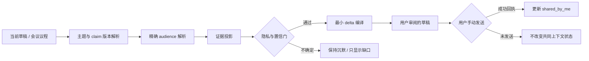

# 新能力：Common Ground Memory / 共同上下文记忆

> 建议复制标题：**新能力：共同上下文记忆**
> 产物日期：2026-08-12
> 状态：仅完成产品计划与交互 Demo，等待用户决定是否实现
> Idea 来源：本机 Reminder 的 `Personal AI` 列表没有未完成条目，因此来自仓库去重、线上只读记忆证据、竞品与论文研究
> 交互预览：[common-ground-memory-demo.html](./common-ground-memory-demo.html)
> 视觉依据：[common-ground-memory-brand-spec.md](./common-ground-memory-brand-spec.md)

## 1. 用户先看到的真实场景

### 场景一：同一个项目被聊过五个群，但每个群拿到的版本不一样

过去 90 天的线上只读记忆里，`INIT-30072` 出现在 5 个不同 Glip 群组。某天你要在其中一个三人群里更新：`8/25 是 Feature Freeze / CF，owner 仍待确认`。

1. 你打开原本的 RingCentral 群聊，开始输入“大家都知道 8/25……”；Personal AI 不打断输入，只在 Compose 上方出现一条窄提示：**“当前群收到过旧版；2 条变化尚无发送证据。”**
2. 你展开提示，看到三个严格区分的区域：
   - **已向当前群发过**：上周发过“8/25 是目标日期”；证据链接指向原消息。
   - **只需补变化**：日期含义已从普通里程碑修正为 Feature Freeze / CF；owner 仍待确认。
   - **仅你可见，不会带出**：1:1 中讨论过候选 owner，但当前群没有这段上下文，且来源敏感。
3. 你点“只补变化”，系统只把两句增量写入草稿；页面明确回执：**“只改草稿，未发送，也未写回 Jira。”**
4. 你自己检查、修改并手动发送。发送成功回执被捕获后，Personal AI 才把这两条标记为 `shared_by_me`；它不会把“发过”写成“大家知道了”。

**体验结果：** 不再复制整段来龙去脉，也不会因为“我在另一个群说过”而误以为当前群拥有同样背景。

### 场景二：周会开始前，不再用“这个大家应该都知道”冒险

你的下一个周会有 6 位参与者。Meeting Pilot 会前卡片发现：路线图链接曾发送给其中 4 人，但只有 2 人留下明确回复/引用证据；另外 2 人没有发送证据。

1. 会前 5 分钟，Meeting Pilot 显示：**“4/6 有发送证据；2/6 有确认性证据；不要表述为‘大家都知道’。”**
2. 你点“生成 30 秒开场”。系统生成：先用一句话补齐目标与日期，再说本周变化，而不是把整份路线图重新讲一遍。
3. 你点“查看依据”，能看见人群集合、原消息、版本时间和不确定项；仅“参加过会议”不会被当成理解或同意。
4. 如果参与者身份合并不可靠，卡片降级成“证据不足”，不给高置信建议。

**体验结果：** 会前准备从“找资料给我看”进一步变成“判断这个房间还缺哪一段共同背景”，同时保留不确定性和人的最终表达权。

## 2. 为什么值得做

Personal AI 已经能记住“发生过什么”，但真实协作还有一个更棘手的问题：**我记得这件事，不代表当前这群人收到过同一个版本。**

共同上下文记忆把记忆从个人检索扩展为一个保守的沟通投影：

`当前事实版本 × 精确受众 × 可核对的沟通证据 → 最小安全上下文增量`

它解决三类高频成本：

- **重复解释：** 为保险起见，每次都从头讲，消息和会议越来越长。
- **错误假设：** 把“我说过”“他们在群里”“他们参加过会”误写成“大家都知道/同意”。
- **隐私串线：** 在 1:1 得到的背景，被无意识地带进多人群。

亮点不在于再做一次总结，而在于生成前先问：**对这个精确受众，哪些内容确实发过、哪些版本变了、哪些只能保持未知？**

## 3. 真实证据与机会规模

以下数据来自 2026-08-12 对 `10.32.56.212` 上 `esone.qiu` 独立记忆库的只读查询；没有调用 `/ask`、没有写数据库、没有修改任何外部系统。为避免泄露，URL 已在聚合前移除 query string，计划与 Demo 不保留原始内部链接或 token。

| 观察窗口 | 只读结果 | 产品含义 |
|---|---:|---|
| 近 90 天用户本人 Glip 消息 | 1,490 条 | 有足够的本人发言作为“我向谁发过什么”的一方证据 |
| Glip 中出现的 Jira key | 179 个 | 项目事实经常跨聊天传播 |
| 出现在至少两个群的 Jira key | 20 个 | 同一主题存在明显的跨受众版本差异机会 |
| `INIT-30072` 覆盖群组 | 5 个 | 可作为首批匿名化 eval 场景之一 |
| 规范化 URL | 418 个 | 文档/路线图是共同背景的重要载体 |
| 跨多个群出现的规范化 URL | 39 个 | “发过链接”不等于不同群拿到相同解释与版本 |
| 当前 `memory_claims` | 3,477 条 | 已有 claim 基础，但还没有 audience-level disclosure 状态 |

数据限制也必须进入设计：`/health` 当时为 degraded，默认数据库显示未连接；不过 per-user stats 和远端用户独立 SQLite 可读。因此上述数字是当前只读快照，不代表完整传输链路健康证明。

## 4. Before / After

| 时刻 | Before | After |
|---|---|---|
| 在群里解释一个更新 | 搜索旧消息，凭印象判断别人是否看过；要么整段重复，要么遗漏背景 | 只提示当前受众缺的版本增量，并提供原消息证据 |
| 写“大家都知道” | 系统只会帮助润色，可能强化错误前提 | 发现无确认性证据，建议改成中性表达或先补背景 |
| 会前准备 | 汇总“我能访问的”会议、文档、任务 | 额外给出参与者集合的发送/确认证据覆盖与未知项 |
| 1:1 信息进入群聊 | 依赖用户自己记住信息边界 | 敏感来源只用于判断缺口，默认不进入草稿 |
| AI 代拟消息 | 生成即像“替我说了” | 草稿、插入、发送、外部写回各自有可见回执 |

## 5. 产品定义

### 5.1 一句话定义

在聊天或会议表达前，Personal AI 用可核对证据判断**当前受众收到过哪个 claim 版本**，并生成最小、隐私安全、需要用户确认的背景增量。

### 5.2 P0 目标

1. 建立 `audience × proposition version × communication evidence` 的保守投影。
2. 在 RingCentral Compose 中提示“只补变化 / 先补背景 / 证据不足保持沉默”。
3. 在 Meeting Pilot 会前准备中显示参与者级的发送与确认性证据覆盖。
4. 每条建议能回到原消息、版本来源与隐私决策。
5. 永远把建议停在草稿，外部发送和写回仍由用户完成。

### 5.3 明确不做

- 不做“谁读了我的消息”的监控产品，也不推断他人心理状态。
- 不把 `sent`、群成员身份、会议出席自动等同于 `read / understood / agreed`。
- 不做独立 dashboard、待处理队列或又一个 inbox。
- 不自动发送、通知、@ 人、建任务、写 Jira 或改 Calendar。
- 不把私聊内容自动复制到多人群。
- P0 不依赖观察第三方 AI 会话内部状态；那是已搁置方向的高不确定边界。

## 6. 核心语义合同：禁止把“发过”说成“知道”

### 6.1 对用户展示的状态

| 内部状态 | 用户文案 | 需要的最低证据 | 不能声称 |
|---|---|---|---|
| `not_shared_here` | 当前受众尚无发送证据 | 没有匹配到本人 outbound send receipt | 不知道、没看过 |
| `shared_by_me` | 你曾向当前受众发过 | 真实发送回执 + 精确 audience id + claim version | 对方读了/理解了 |
| `acknowledged` | 有确认性证据 | 对该 claim 的引用/回复、明确“收到/OK”、或可归因的后续动作 | 全体同意、永久记得 |
| `superseded_shared` | 当前受众收到过旧版 | 旧版本有发送证据，新版本有可靠变更证据 | 对方知道新版 |
| `unknown` | 证据不足 | 身份、群组、版本或事件链不完整 | 任何高置信 mental-state 结论 |

### 6.2 强制语言规则

- UI 和生成文案使用“已向该群发过”“有回复证据”“尚无发送证据”。
- 禁用“TA 知道”“大家了解”“已达成共识”等无证据状态词。
- 同一房间里只有部分成员有证据时，展示分母，例如 `4/6 有发送证据`。
- `acknowledged` 必须记录证据类型与时间；超过 TTL 或 claim 更新后降级。
- draft 被插入编辑框不算 `shared_by_me`；只在宿主返回成功发送回执后更新。

## 7. 交互设计

### 7.1 入口一：RingCentral Compose 内嵌提示

保持现有红色 Personal AI 入口。在编辑框上方只新增一条不抢焦点的窄提示：

> 共同上下文 · 当前群收到过旧版，2 条变化尚未分享

触发条件只允许三类：

1. 当前草稿包含“如大家所知/之前说过/还是按原计划”等共享知识前提，但证据不足；
2. 草稿主题关联到高置信 claim version 变化，而当前受众只有旧版发送证据；
3. 高影响会议/消息需要的最小背景，在当前受众没有发送证据。

展开层按沟通决策排列，而不是按记忆时间线堆积：

- **已向本群发过：** 显示 statement、版本、发送时间、原消息。
- **只需补变化：** 显示 old → new 的最小差异与依据。
- **先补背景：** 当前受众完全没有发送证据时，给一段 1–3 句前言。
- **仅你可见：** 告知有私密来源影响判断，但不显示可直接复制的敏感正文。
- **不确定：** 明确缺哪类证据，并默认不生成高置信建议。

主要动作：

- `只补变化`：把最短 delta 插入草稿。
- `先补背景`：生成带一段背景的草稿。
- `查看依据`：打开 evidence drawer，不改变草稿。
- `暂不提示此主题`：只调整本地 UI 干扰阈值，不改变事实状态。

所有草稿动作后显示固定回执：**“只改草稿，未发送；未写回 Jira/Calendar。”**

### 7.2 入口二：Meeting Pilot 会前准备

在现有会前 brief 中增加一段“共同上下文”，不创建新页面：

- 参与者集合：精确 attendee set 与未能合并的身份。
- 发送覆盖：`4/6 有发送证据`。
- 确认性覆盖：`2/6 有引用/回复证据`。
- 版本缺口：哪些参与者只收到旧版，哪些完全未知。
- 动作：`生成 30 秒开场`、`查看依据`。

Meeting attendance 只能作为场景证据，不能单独提升到 `acknowledged`。

### 7.3 三种建议策略（Demo 可切换）

| 策略 | 适用时刻 | 输出 |
|---|---|---|
| 只补变化 | 大部分受众收到过旧版 | 1–2 句版本 delta，默认推荐 |
| 先补背景 | 关键成员没有发送证据 | 一句背景 + 一句变化 + 明确未决项 |
| 证据不足 | audience/身份/版本链不可靠 | 不生成带结论的草稿，只列缺失证据 |

### 7.4 响应式与可访问性

- 桌面端展开层不覆盖当前输入；移动端改成 bottom sheet。
- 中文正文桌面不小于 14px，移动端不小于 16px；可点区域至少 44×44px。
- 状态不能只靠颜色；同时提供文字和形状标记。
- 尊重 `prefers-reduced-motion`，键盘可访问 evidence drawer，Esc 可关闭。

## 8. 数据模型与证据链

```ts
type GroundedProposition = {
  id: string;
  subjectKey: string;          // Jira key、文档实体、会议议题等稳定主题
  claimVersion: string;
  statement: string;
  sourceRefs: EvidenceRef[];
  truthState: "verified" | "reported" | "disputed" | "unknown";
  sensitivity: "public" | "workspace" | "group" | "private";
  validFrom: string;
  validUntil?: string;
};

type AudienceContextState = {
  audienceId: string;          // 精确 thread/group/attendee-set，不使用模糊群名
  propositionId: string;
  claimVersion: string;
  state:
    | "not_shared_here"
    | "shared_by_me"
    | "acknowledged"
    | "superseded_shared"
    | "unknown";
  evidenceRefs: EvidenceRef[];
  observedAt: string;
  expiresAt?: string;
  confidence: number;
};

type ContextDelta = {
  sceneId: string;
  audienceId: string;
  alreadyShared: PropositionRef[];
  missingBackground: PropositionRef[];
  changedSinceShared: VersionDelta[];
  uncertain: UncertaintyReason[];
  blockedPrivate: RedactedEvidenceRef[];
  recommendedMode: "delta_only" | "background_first" | "stay_silent";
};
```

### 8.1 Audience 身份

- Glip 以不可变 conversation/thread id + 当时成员快照为准；同名群不合并。
- Meeting 以 event id + attendee identity snapshot 为准；参与者变化产生新 audience revision。
- 人物 alias 合并沿用现有 identity resolution，但遇到一个标识对应多个人时 fail closed，状态设为 `unknown`。
- P0 不把“公司全员”“项目组”这类自然语言群体自动扩展到具体成员。

### 8.2 Proposition 与版本

1. 先使用确定性实体（Jira key、文档 id、会议 agenda item）锚定主题。
2. 再从本人发言/可信 artifact 提取可独立判断的 proposition。
3. 对 statement 做语义归一，但保留原文与 source ref。
4. 新证据只有在内容确实冲突或关键字段变化时创建新 version；补充措辞不算版本更新。
5. truth state 与 audience state 分开：一条信息可以“已向本群发过”，但事实本身仍是 `reported/unknown`。

### 8.3 发送与确认性证据

- **发送证据：** 只接受宿主系统成功回执后的 outbound message event。
- **确认性证据：** 精确 quote/reply、明确确认短语、或可归因到该 claim 的 artifact action；每类证据权重可解释。
- **弱证据：** reaction、在线状态、会议出席只能作为辅助，不单独升级。
- **负面证据：** “我不知道这件事”“你没说过”应使状态回退并标记冲突，等待用户判断。

## 9. 建议生成流水线



流水线顺序不能颠倒：LLM 只能在确定性 audience、证据与隐私过滤之后做压缩和表达；不能让模型先自由生成，再用规则追认安全性。

### 9.1 建议服务接口草案

```http
POST /api/v1/common-ground/preview
GET  /api/v1/common-ground/evidence?sceneId=...&propositionId=...
POST /api/v1/common-ground/feedback
```

`preview` 请求至少包含 `userId`、`sceneId`、`audienceRevision`、`draftText`、`surface`；返回 `ContextDelta`、可解释 evidence refs、privacy receipt 和 `suggestedDraft`。接口本身没有 send 能力。

反馈只记录：采纳、编辑后采纳、忽略、错误 audience、错误版本、提示过多、隐私担忧；不把“点击采纳”误写成对方已收到。

## 10. 隐私、安全与责任边界

### 10.1 私密信息的单向使用

私聊/私人文档可以帮助判断“当前群可能缺背景”，但默认不能成为群聊草稿的内容来源。只有当用户主动展开、选择具体句子且原有权限允许时，才进入二次确认流程。

### 10.2 输出前强制策略

- 对每条 source 做 audience entitlement 检查。
- 敏感内容在进入 LLM 上下文前脱敏或移除，而不是只在输出后扫一遍。
- 不在日志记录原始 token、私密 URL query、完整 1:1 内容或未脱敏 attendee list。
- 一旦 audience revision 改变，旧 preview 失效，必须重新计算。
- 高风险 promise、owner、日期、金额、客户信息必须显示来源和版本时间。

### 10.3 权限回执

UI 固定显示三类状态：

- `只改草稿，未发送`
- `没有写回 Jira / Calendar`
- `私密来源未带入正文`

## 11. 竞品对比

| 产品 | 已有能力 | 可借鉴 | 仍未解决的核心缺口（基于公开文档的推断） |
|---|---|---|---|
| [Slack AI](https://slack.com/help/articles/25076892548883-Guide-to-AI-features-in-Slack) | Channel/DM/thread summary、引用来源、recap | 在原工作流里完成 catch-up；证据可回链 | 面向“我漏看了什么”，未公开 proposition × audience version 投影 |
| [Slack AI Huddle Notes](https://slack.com/help/articles/31377193680019-Use-AI-to-take-huddle-notes-in-Slack) | 自动记录 takeaways/action items 并分享到 thread | 共享 artifact 与 meeting flow 结合 | 分享到 thread 仍不能证明每位参与者读过或认可 |
| [Copilot Meeting Prep](https://support.microsoft.com/en-US/Outlook/prepare-for-your-meeting-with-copilot) | 汇总相关会议、任务、文档 | 会前几分钟给到情境化准备 | 官方明确每位查看者因权限不同看到不同 summary，恰好说明“我能看到”不等于“大家共有” |
| [Teams Recap](https://support.microsoft.com/en-US/teams/meetings/recap-in-microsoft-teams) / [Google Meet notes](https://support.google.com/meet/answer/14754931) | transcript、notes、decisions、next steps | 结构化会议结果 | 关注一次会议产物，不维护跨群、跨版本的受众覆盖 |
| [Granola](https://docs.granola.ai/help-center/getting-more-from-your-notes/chatting-with-your-meetings) | 跨会议问答、生成 follow-up、共享空间 | 从个人笔记中生成行动型表达 | 强 recall/sharing，不等于记录每条 claim 被哪个精确受众收到 |
| [Copilot in Outlook](https://support.microsoft.com/en-US/Outlook/copilot-pages/draft-an-email-message-with-copilot-in-outlook) | 基于 thread/prompt 起草，发送前由人审阅 | review-before-send 的责任边界 | 公开控制聚焦 tone/length/editing，不是共同背景缺口 |

这不是断言竞品内部没有类似模型；结论仅限于 2026-08-12 可核对的公开产品界面与官方文档。

## 12. 论文与专家观点如何落到设计

| 研究 | 关键启发 | 本计划落点 |
|---|---|---|
| [Common Ground Tracking in Multimodal Dialogue](https://aclanthology.org/2024.lrec-main.318/)（LREC-COLING 2024） | 共同基础应按 proposition 与对话证据更新 | 不存一段“他们知道什么”的自由文本，改存 typed proposition/evidence transition |
| [TRACE](https://aclanthology.org/2025.naacl-demo.5/)（NAACL 2025） | 多人场景可实时追踪 speech/action/attention 证据 | P0 先用 outbound、quote/reply、meeting transcript 等低风险证据，之后再扩展多模态 |
| [Building Common Ground in Dialogue](https://aclanthology.org/2025.luhme-1.2/)（2025 survey） | common ground 会随场景、时间、参与者动态变化 | audience revision + TTL，拒绝永久人物标签 |
| [Reflect, Not Reflex](https://aclanthology.org/2022.emnlp-main.714/)（EMNLP 2022） | 先显式推断 common ground 可提高回复具体性 | 在 Compose 生成前加 evidence-grounded compiler |
| [SURE Framework](https://www.microsoft.com/en-us/research/publication/the-sure-framework-social-intelligence-for-human-agent-collaboration/)（Microsoft Research, 2026） | 协作瓶颈是 Sense/Understand/Remember/Engage 的社会智能 | 让记忆状态以透明、可控的方式介入表达，而不是藏进 prompt |
| [Collaboration Readiness](https://www.microsoft.com/en-us/research/project/from-task-solvers-to-teammates-a-theory-grounded-architecture-for-advancing-collaboration-readiness-in-llm-agents/) | 将 common ground/workspace awareness 外置成可检查层 | 独立的 typed contract、证据抽屉和权限回执 |
| [ProMediate](https://www.microsoft.com/en-us/research/articles/evaluating-proactive-ai-mediators-in-multi-party-conversation-with-promediate/) | 主动介入的时机与策略和模型能力同样重要 | 只有共享前提、重要版本变化、会前缺口触发；其他时刻静默 |
| [CONCORD](https://www.microsoft.com/en-us/research/publication/listening-alone-understanding-together-collaborative-context-recovery-for-privacy-aware-ai/) | 隐私感知的上下文恢复应定位最小 gap，而非猜测 | 最小安全 delta + `unknown` + 私密来源不带出 |
| [Dittos](https://www.microsoft.com/en-us/research/publication/dittos-mimetic-reciprocal-agents-in-ai-mediated-communication/) | AI 代表人表达时，信任、责任与让本人知情是关键 | 不自动发送；显示来源、草稿状态与用户代表性风险 |

## 13. 与已有/搁置能力的边界核对

| 已有计划/文档 | 它解决什么 | 为什么不是重复 |
|---|---|---|
| Relationship Memory Radar | 人物维度的关系事件、偏好、open loop、承诺 | 本能力针对精确 room/thread/attendee set 的 claim-version 发送覆盖，不生成关系画像或待办 |
| Memory Claim Attribution | 谁说了什么、speech mode、commitment state | attribution 是 claim 来源；本能力是该 claim 哪个版本被哪个 audience 收到 |
| Memory Change Ledger / Evidence Watch | 哪个事实版本是当前版本 | 本能力消费版本结果，再判断各 audience 缺哪段 delta |
| Routine Delta Memory | 比较周期性会议/页面/流程的相邻 occurrence | 本能力面对 ad-hoc 的人群、聊天和会议，不做周期性 recap |
| AI Context Passport | 把任务上下文交给另一个 AI | 本能力为人类受众编译最小背景，不是 AI session handoff 包 |
| AI Session Context Drift Radar（搁置） | 观察第三方 AI 会话知道/不知道什么 | P0 只使用 Personal AI 已捕获的人类消息与会议证据，不宣称观察第三方 AI 内部状态 |
| Memory Outcome Loop | 根据建议之后的真实结果学习 | 本能力可把采纳/忽略作为 UI feedback，但不负责结果学习闭环 |

## 14. 实施阶段

### Phase 0：离线投影与 shadow report

- 从本人 outbound Glip messages、existing claims、Jira/document entities 建立只读投影。
- 不显示 UI、不生成草稿，只统计 audience/version coverage、unknown 和 privacy blocks。
- 用 90 天真实数据建立匿名化基线，先证明身份精度与零泄露。

### Phase 1：RingCentral Compose P0

- 只支持精确 group conversation id；DM 和动态成员群先分开评估。
- 上线窄提示条、expanded evidence layer、`只补变化` / `先补背景`。
- 所有发送保持用户手动；捕获真实 send receipt 后才更新状态。
- 默认在高影响主题和共享前提表达时触发，控制打扰率。

### Phase 2：Meeting Pilot 会前准备

- 以 event + attendee revision 计算 coverage。
- 增加 30 秒开场草稿和证据抽屉。
- 不把出席、录音存在或日历邀请等同于确认。

### Phase 3：跨表面复用

- 评估在 Compose Assist、AI Context Passport 导出前使用同一 privacy-safe delta compiler。
- 仍不把第三方 AI session state 合并进 P0 audience ledger。

## 15. Evals：需要，而且是上线门槛

该能力需要同时判断 identity、claim version、隐私边界、证据语义与文案最小性，不能只靠单元测试。因此完成功能代码后必须创建 `eval-common-ground-memory`，跑出可审阅 report；未达到门槛就继续修改并重跑，直到所有测试通过。

### 15.1 真实场景数据集

- 从线上 memory service 的 `esone.qiu` 独立库做**只读抽取**，使用离线副本/脱敏 fixture；不在 eval 中写回线上。
- 以 20 个跨群 Jira key、39 个跨群规范化 URL 为候选池，优先选 claim version 可人工核实的场景。
- 至少覆盖：DM → group、旧版 → 新版、同名不同群、成员增删、quote/reply、弱 reaction、会议出席、私密来源、否认性回复、证据缺失。
- 按主题而非消息随机拆分 train/dev/holdout，避免同一 Jira key 泄漏到不同集合。

### 15.2 确定性测试

| Gate | P0 目标 |
|---|---:|
| audience identity precision | ≥ 98%；有歧义必须 fail closed |
| draft 不得计为 sent | 100% |
| 未收到真实 send receipt 不更新状态 | 100% |
| 私密 source 泄漏到多人草稿 | 0 |
| audience revision 后旧 preview 失效 | 100% |
| 仅 attendance/reaction 不得独立升级 acknowledged | 100% |
| evidence ref 可回链率 | 100% |

### 15.3 语义与 UX judge

- `acknowledged` precision ≥ 95%，或 false-acknowledged rate ≤ 2%。
- 人工 + LLM judge 评价 top-1 delta“必要、正确、简洁、对当前受众安全”的通过率 ≥ 80%。
- 相比完整背景重述，冗余 token/句子降低 ≥ 40%，同时关键缺失背景遗漏率 ≤ 5%。
- 禁用 mental-state 断言、未决项被错误定论、来源版本混淆三类红线，任何一例即阻断发布。
- 干扰率：不需要提示的真实 Compose 场景中，默认静默率 ≥ 90%。

### 15.4 Report 必须包含

- 数据快照时间、抽取范围、脱敏规则、health caveat。
- 每个 gate 的总分、按场景分层结果、失败样本与 evidence refs。
- privacy red-team、identity ambiguity、版本冲突和“发过 ≠ 知道”专项结果。
- 与 baseline（无共同上下文、直接检索后生成）的对照。
- 未通过项、修复 commit、重跑记录；全部通过后才能进入灰度。

## 16. 观测与上线安全

只记录聚合指标，不记录原始敏感正文：

- 提示触发率、展开率、只补变化/先补背景采纳率、编辑距离。
- 用户标记“错误 audience / 错误版本 / 提示太多 / 隐私担忧”的比率。
- preview 过期、identity fail-closed、privacy block 数量。
- 发送回执缺失时的状态不更新率必须为 100%。
- 可以一键关闭表面提示并保留底层记忆；可以按主题静音。

灰度先只对本人、只读投影、一个稳定群类型开放。出现私密泄露、错误 audience 或无证据的 mental-state 声称时立即 kill switch。

## 17. 验收标准

### 产品验收

- 用户在真实聊天里 3 秒内看懂：哪些是已发、哪些是变化、哪些只是未知。
- `只补变化` 生成的正文不重复旧背景，也不遗漏高影响变更。
- 私聊内容不会因“有助于解释”就进入群聊草稿。
- 所有外部 mutation 都保留给用户，回执准确反映真实完成状态。

### 技术验收

- typed contract、evidence refs、audience revision、TTL、privacy receipt 全部落地。
- deterministic gate 在 LLM 之前执行，LLM 不可绕过。
- 完成第 15 节 evals 并提交 report，全部门槛通过。
- 对降级、离线、身份歧义、宿主发送失败均有确定行为。

### 文档验收

实现完成最后，要把关键点和关键逻辑精简维护进正式文档：

- 新建 `desktop-app/docs/features/common_ground_memory.md`，记录跨表面语义合同、状态机与安全边界；
- 在 `desktop-app/docs/features/memory_claim_attribution.md` 补充 attribution 与 audience projection 的边界；
- 在 `desktop-app/docs/features/assist.md` 记录 Compose 入口、触发条件与“只改草稿”回执；
- 在 `desktop-app/docs/features/meeting_pilot.md` 记录会前 coverage 与 attendance 非确认规则；
- 如改变 memory service 总体结构，再更新 `desktop-app/docs/memory_system.md` 与索引。

正式文档只保留已实现、已验证事实。实现完成后将本计划与 Demo 从 `docs/progressing/` 迁移到对应 `docs/demo/` 或删除，不让进行中计划冒充已交付能力。

## 18. 需要用户最终决策的范围

1. 是否进入 Phase 0 shadow projection。
2. P0 先做 RingCentral Compose，还是先做 Meeting Pilot 会前卡片；建议前者，因为发送回执和精确 conversation id 更容易建立可靠语义。
3. `acknowledged` 是否在首版展示；建议底层计算、UI 只写“有回复/引用证据”，避免用户把它理解成“对方同意”。
4. 私密来源首版是否允许用户手动带出；建议 P0 完全禁止，只显示“有私密来源被拦截”。
