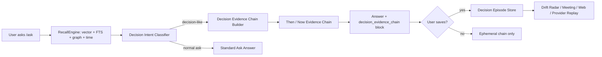

# Decision Time Machine：个人决策记忆回放台

*创建: 2026-05-02 CST*

## 结论

建议设计一个新能力：**Decision Time Machine（个人决策记忆回放台）**。

重要修正：这个能力不应该优先做成“自动生成很多决策卡”的独立页面。自动预生成会带来卡片爆炸、重复候选、低置信度卡片占满界面的问题。

更合理的产品形态是：把 Decision Time Machine 设计成 **`/ask` 的决策证据链增强层**。当用户在 Personal AI 里提问时，系统自动判断这个问题是否涉及历史决策、方案演进、前提变化、责任归因或“为什么当时这么定”。如果命中，就在正常召回结果之上动态组织一条**决策证据链**：

- 当时结论是什么。
- 支撑结论的原始证据有哪些。
- 关键前提是什么。
- 后来出现了哪些新证据。
- 哪些前提可能已经变化。
- 当前回答应该如何引用这些证据。

只有当用户觉得这条证据链有长期价值，点击 `保存为决策记忆` / `标记为项目决策` 时，才沉淀成可浏览的 Decision Episode。

一句话价值：

> 用户不再问“这事当时为什么这么定来着”；Personal AI 直接把当时的证据、推理、变更和下一步带回眼前。

配套 demo：[`decision-time-machine-demo.html`](./decision-time-machine-demo.html)。注意：demo 展示的是“可视化后的决策 episode”，但 MVP 应先从 `/ask` 返回中的动态证据链开始，而不是先做完整 episode 管理页面。

## 关键风险修正：决策卡爆炸

### 这个现象是否可能

可能，而且如果按原方案“从最近 30 天 messages/meetings/reflections 中生成 `decision_episodes` 候选”，几乎一定会发生。

原因：

1. **真实工作里的“决策”边界很模糊**
   - “先这样吧”“我倾向于”“后续 Fred 对一下”“这个月先薅 Codex”都可能像决策。
   - LLM/规则很难稳定区分：临时态度、讨论中间态、最终决定、个人建议、团队共识。

2. **同一决策会在多个渠道重复出现**
   - 群聊里讨论一次，会议里复述一次，Jira 里落一条，AI 对话里又总结一次。
   - 如果预生成卡片，很容易产生 3-5 张语义相近但证据不完整的卡。

3. **长尾卡片会远多于用户真正要找的卡片**
   - 用户可能搜索 3 个决策，只有 1 个是已整理好的高质量卡。
   - 另外 2 个要么没卡，要么只有低质量候选卡。
   - 结果会让用户感觉“系统很努力，但不可靠”。

4. **低置信度卡片会造成 UI 负担**
   - 决策页面如果列出几十张候选卡，用户需要先整理系统的整理结果，本身就违背减负目标。

5. **过早结构化会锁死错误解释**
   - 一旦系统把一个中间讨论写成“决策”，后续召回可能反复强化这个错误。

### 设计原则调整

所以 Decision Time Machine 的默认产物不应该是大量静态决策卡，而应该是：

> **按需生成的 Ask-time Decision Evidence Chain。**

也就是用户问到时才临时组织证据链；保存成卡是用户确认后的副产物。

这个设计更符合 Personal AI 的真实使用：

- 用户不需要先进入一个“决策卡管理器”找东西。
- 用户照常在 `/ask` 问：“为什么当时决定推 Codex？”、“Nova 这块为什么要先给 Sophia？”、“Meeting Pilot 当时为什么选这个方案？”
- 系统在回答里自动补一段“决策证据链”，让答案不只是摘要，而是带来源、时间、前提和变更。

## 本次输入信号

### Reminder 检查

本机 Reminders 里没有名为 `Personal AI` 的列表，因此没有可随机抽取的全新 reminder idea，本次按“主动构思新能力”分支推进。

### 真实记忆信号

按要求连接 `10.32.56.212` 查询 `esone.qiu` 的记忆。HTTP API 端口可连通，但 `/api/v1/health`、`/recall`、`/ask` 本次都在 8-12 秒内超时，所以改用 SSH 只读查询远端 `memory.db` 和 Markdown 摘要，没有修改远端服务状态。

读到的可用信号：

- 用户身份：Esone Qiu，Scrum Master，时区 Asia/Shanghai。
- 近期高频场景：AI coding 工具选型与成本讨论、Codex/Claude Code/Cursor/Factory.ai 试用和组织推广、RingClaw / Meeting Pilot / Nova / Rooms 等项目推进、会议记录沉淀、Jira 数据查询与趋势分析。
- 真实痛点不是“没有信息”，而是信息散在消息、会议、AI 工具、Jira 和网页里，回到某个事项时很难快速恢复“当时为什么这么定”的上下文。
- 现有系统已经有 `messages_raw`、`chunks`、`entities`、`reflection_threads`、`TruthMaintainer`、`ContextRecallService`、`ProviderContextService`、会议持久化和跨 provider context package 的基础，适合在上面加“决策 episode 层”。

## 为什么要做

Personal AI 的目标是留存用户和 AI 的所有记忆，并在聊天、会议、其他 AI 对话等场景提供记忆关联提示。现有方向已经覆盖了“记住信息”和“跨 AI 带上下文”，但真实工作里更高价值的是：

1. **恢复判断依据**：用户经常需要知道某个项目、工具、组织安排、技术路线当时为什么这么决定。
2. **避免上下文重建成本**：切到会议、Jira、Codex、Claude、ChatGPT 时，用户不应该从聊天记录里重新翻证据。
3. **对抗记忆漂移**：AI 只给摘要容易丢失原始证据；过期前提继续被引用会导致错误建议。
4. **把会议记忆变成可用资产**：会议纪要本身价值有限，真正有用的是决策、前提、承诺、风险和后续变化。
5. **让 AI 协作更像“接着上次干”**：用户打开任何 AI 工具时，Personal AI 能告诉它“这个事情之前怎么想过，现在哪些东西变了”。

## 行业观察

### 平台记忆正在成熟，但还停留在“记住我”

- ChatGPT Memory 支持 saved memories 和 reference chat history，并提供查看、删除、关闭、临时聊天、memory version history 等控制；OpenAI 也说明 memory 更适合高层偏好和细节，不适合长模板或大量原文。参考：[OpenAI Memory FAQ](https://help.openai.com/en/articles/8590148-memory-in-chatgpt)。
- Claude Memory 强调工作场景、项目隔离、可查看/编辑 memory summary、Incognito chat，并在 2025-10-23 扩展到 Pro/Max。参考：[Claude Memory](https://claude.com/blog/memory)。
- Gemini 在 2026-03-26 推出从其他 AI 应用导入 memories、preferences 和 chat history 的能力。参考：[Gemini memory import](https://blog.google/innovation-and-ai/products/gemini-app/switch-to-gemini-app/)。

这些说明主流产品已经把“AI 认识用户”当成核心竞争点。但它们多数还是平台内部的长期偏好或历史摘要，缺少一个面向真实工作流的“决策回放层”：为什么当时这么决定、证据是什么、现在是否仍然成立。

### 通用 memory layer 正在抢跨工具入口

- Anuma 主打 one memory + every model + local-first / encrypted / user-owned data。参考：[Anuma](https://www.anuma.ai/)。
- Supermemory 主打 one memory every tool，支持 Claude Code、Cursor、OpenAI Codex、API、Chrome Extension 等入口。参考：[Supermemory](https://supermemory.ai/)。
- Moss 主打跨对话持久记忆、导入 ChatGPT/Claude/Gemini 历史，并强调主动带出相关过去。参考：[Moss](https://mossmemory.com/)。

这些产品证明“跨工具统一记忆”是方向。但 Personal AI 可以走得更贴近个人工作：不是只问“记不记得”，而是问“这条判断是否仍然成立，下一步该怎么接着做”。

### 会议产品在把会议变成可查询上下文

- Granola 从 AI notepad 切入，强调会后快速生成笔记、可分享、可继续询问 transcript。参考：[Granola](https://www.granola.ai/)。
- Limitless/Rewind 这类产品曾强调可穿戴/桌面记录个人经历。Limitless 官网最新状态显示已被 Meta 收购，现有 Pendant 用户继续支持到 2026，且提供数据导出/删除。参考：[Limitless](https://www.limitless.ai/)。

这说明“捕获”本身不是护城河。Personal AI 更应该把捕获后的会议、消息、网页、操作，转成可解释、可追溯、可行动的决策资产。

### 论文方向支持“证据保真 + 动态组织 + 写管读循环”

- MemMachine（2026-04-06）强调 ground-truth-preserving：保存完整对话 episode，减少有损抽取，并用上下文扩展召回处理跨多轮证据。参考：[MemMachine](https://arxiv.org/abs/2604.04853)。
- A-MEM（NeurIPS 2025）借鉴 Zettelkasten，让新记忆动态建立索引、链接和更新旧记忆的上下文表达。参考：[A-MEM](https://arxiv.org/abs/2502.12110)。
- MemOS 把 memory 当作可管理的系统资源，基础单元包含 provenance 和 versioning。参考：[MemOS](https://arxiv.org/abs/2507.03724)。
- 2026 agent memory survey 把 agent memory 抽象成 write-manage-read loop，并把 contradiction handling、latency budget、privacy governance 作为工程现实。参考：[Memory for Autonomous LLM Agents](https://arxiv.org/abs/2603.07670)。
- OpenAI Agents SDK 的 memory 能力强调把历史运行沉淀为文件、下一次渐进读取，用来降低 agent cost、user cost 和 context cost。参考：[OpenAI Agents SDK Memory](https://openai.github.io/openai-agents-python/sandbox/memory/)。

对本功能的启发：决策记忆不能只是“摘要卡片”，必须保留 episode 证据、版本、有效期、冲突和回放路径。

## 产品定位

### 功能名

**Decision Time Machine / 决策时间机**

### 目标用户

第一目标用户就是 Personal AI 当前真实使用者：

- 同时在消息、会议、Jira、Codex/Claude/ChatGPT、网页之间切换。
- 经常推动项目、协调团队、判断工具选型和组织策略。
- 不缺 AI 工具，缺“我自己的长期上下文权威”。

### 不做什么

- 不做另一个会议纪要列表。
- 不做纯时间线搜索。
- 不替用户直接做高风险决策。
- 不把所有记忆一次性灌给 AI。
- 不复刻 Context Assist 的 AI Prompt Injection。它可以调用 AI context pack 注入能力，但 MVP 核心对象是“`/ask` 中的决策证据链”，已保存 episode 只是后续可视化和复查层。

## 核心概念

### Ask-time Decision Evidence Chain

MVP 的核心对象不是预生成的卡片，而是 `/ask` 响应里动态生成的 `decisionEvidenceChain`。

```ts
interface DecisionEvidenceChain {
  question: string;
  decisionDetected: boolean;
  chainType:
    | 'why_decided'
    | 'what_changed'
    | 'decision_status'
    | 'who_committed'
    | 'tradeoff_history'
    | 'not_a_decision';
  answerSummary: string;
  decisionStatement?: string;
  then?: {
    knownAt: number;
    conclusion: string;
    rationale: string[];
    assumptions: string[];
    evidenceRefs: DecisionEvidenceRef[];
  };
  now?: {
    checkedAt: number;
    stillValid: string[];
    changed: string[];
    contradictedBy: DecisionEvidenceRef[];
    missingEvidence: string[];
  };
  confidence: number;
  saveCandidate?: {
    suggestedTitle: string;
    reasonToSave: string;
    defaultStatus: 'candidate' | 'active' | 'revisit_needed';
  };
}
```

返回策略：

- 如果用户问的是普通事实，保持现有 `/ask` 行为，不生成决策链。
- 如果问题包含“为什么当时”“怎么定的”“谁决定”“后来有没有变”“上次结论”等意图，触发决策链。
- 如果证据不足，明确返回 `missingEvidence`，不要硬生成 Decision Episode。
- 如果证据链质量高，再在 UI 上显示 `保存为决策记忆`。

### Decision Episode

一个 Decision Episode 是用户确认后长期保存的结构化记忆单元。它不应该由后台批量无确认地产生；更合适的来源是高质量的 `decisionEvidenceChain` 被用户保存、或被系统在高置信度场景下推荐保存。

字段建议：

```ts
interface DecisionEpisode {
  id: string;
  title: string;
  decisionStatement: string;
  status: 'candidate' | 'active' | 'superseded' | 'revisit_needed' | 'closed';
  scope: 'work' | 'personal' | 'both';
  decidedAt?: number;
  validFrom?: number;
  validTo?: number;
  projects: string[];
  people: string[];
  tools: string[];
  rationale: string[];
  assumptions: DecisionAssumption[];
  risks: string[];
  followUps: string[];
  confidence: number;
  privacyLevel: 'normal' | 'sensitive' | 'restricted';
  evidenceRefs: DecisionEvidenceRef[];
  supersededBy?: string;
  createdAt: number;
  updatedAt: number;
}
```

### Decision Evidence

每条证据都保留来源，而不是只保留摘要。

```ts
interface DecisionEvidenceRef {
  sourceType: 'message' | 'meeting' | 'web' | 'jira' | 'ai_chat' | 'operation' | 'manual';
  sourceId: string;
  timestamp: number;
  speakerOrActor?: string;
  stance: 'supports' | 'contradicts' | 'background' | 'open_question';
  snippet: string;
  quoteHash: string;
  sourceUrl?: string;
  exploreLink?: string;
}
```

### As-of Lens

同一个决策有两个视角：

- **Then**：当时已知的信息、当时的推理、当时未解决的问题。
- **Now**：现在新增了什么证据、哪些前提过期、哪些结论被推翻或需要复查。

这可以复用 `TruthMaintainer` 的双时态思想：事实本身的有效期和系统发现该事实的时间都要可追踪。

### Decision Replay Pack

当用户要把上下文交给其他 AI 或会议场景时，系统可以从 `decisionEvidenceChain` 或已保存的 `DecisionEpisode` 生成一个最小可用包：

- 决策陈述
- 当时 rationale
- 当前变更
- 证据引用
- 过期/冲突提醒
- 不应泄露的内容
- 下一步需要目标 AI 做什么

它可以作为 `ProviderContextService` 的新 `ProviderMemoryProductKind`，例如 `decision_replay_card`。

## 关键体验

### 体验 0：用户照常进入 `/ask`，自动得到决策证据链

这是修正后的 MVP 主路径。

用户不需要先进入“决策时间机”页面，也不需要猜系统有没有整理好某张卡。用户只是在 Personal AI 里正常提问：

- “当时为什么决定推 Codex 而不是继续 Cursor？”
- “Nova 这部分为什么说先让 Sophia 接？”
- “Meeting Pilot 当时为什么选这种 memory recall 方案？”
- “Factory.ai 这个事情现在还能按上次结论推进吗？”

`/ask` 检索时做三件事：

1. 正常多通道召回相关消息、会议、网页、AI 对话和实体。
2. 在召回结果中识别是否存在决策链：结论、依据、前提、后续变化、冲突证据。
3. 在回答中返回一个结构化块：

```json
{
  "type": "decision_evidence_chain",
  "title": "AI tool migration decision chain",
  "payload": {
    "decisionStatement": "Keep active Cursor users unblocked while pushing Codex experimentation.",
    "then": {
      "conclusion": "Do not force active Cursor users off immediately.",
      "rationale": ["Cursor cost pressure", "Codex trial momentum", "Factory.ai still under trial"],
      "evidenceRefs": ["message:...", "reflection:..."]
    },
    "now": {
      "changed": ["Factory.ai production approval changed", "OpenAI deal preference vote started"],
      "missingEvidence": ["Final vote result not found"]
    },
    "confidence": 0.78
  }
}
```

UI 呈现方式：

- 回答正文先给结论。
- 下方自动显示“决策证据链”折叠块。
- 每条证据可展开原始来源。
- 如果链条质量高，显示 `保存为决策记忆`。
- 如果证据不足，显示 `缺少最终结论证据`，而不是生成假卡。

### 体验 1：打开会议前，自动给“上次为什么这么定”

用户进入 RingCentral meeting 或会议侧边栏，Personal AI 发现参会人、会议标题、项目关键词命中某个 Decision Episode。

浮层显示：

- `上次相关决策：Codex 试用优先推动`
- `当时依据：Cursor 成本、OpenAI deal、Factory.ai trial、安全审批`
- `现在变化：Factory.ai 已可用于 production；Codex 正在投票选型`
- 操作：`展开证据`、`生成发言建议`、`注入会议助手`

这比普通会议摘要强，因为它直接回答“这个会要接着哪条历史判断推进”。

### 体验 2：在 Jira/网页/消息里看到决策漂移提醒

用户打开一个 Jira、工程讨论页或 AI 工具公告页时，右侧轻提示：

> 这个页面可能影响 2 条旧决策：AI tool migration、Meeting Pilot provider strategy。

点开后能看到：

- 哪条旧前提被新信息影响。
- 影响等级。
- 是否需要复查。
- 可以把复查请求发给 Codex/Claude。

### 体验 3：主界面是“决策时间机”

页面布局：

- 左侧：项目 / 人 / 工具 / 风险过滤。
- 中间：决策时间线，每条是一个 episode。
- 右侧：Then vs Now、证据、冲突、AI 注入预览。

用户可以拖动时间或切换 `Then / Now`：

- `Then` 显示当时系统知道什么。
- `Now` 显示后来出现了什么新证据。
- 差异用 “New / Changed / Invalidated / Still valid” 标记。

### 体验 4：一键问 AI，但带证据和边界

用户点 `Replay to Codex`：

系统生成：

```md
Task: Help me continue the "AI tool migration" decision.

Decision so far:
- We were leaning toward Codex for broad experimentation because ...

As-of update:
- Factory.ai production approval changed on 2026-04-30.
- OpenAI deal preference voting started on 2026-05-01.

Evidence:
- [message:...] ...
- [reflection:...] ...

Do not assume:
- Do not treat old Cursor cost assumptions as final.
- Do not expose private one-on-one messages unless I confirm.

Please output:
1. What changed
2. Recommended next action
3. Questions I should ask the team
```

这可以直接复用上次 AI Prompt Injection / Context Handoff 的交付层，但内容来源是 Decision Episode。

### 体验 5：AI 输出后的回写收据

当 Codex/Claude/ChatGPT 给出建议后，Personal AI 把输出变成“回写候选”：

- 新前提：OpenAI deal 投票结果
- 新行动：收集 daily Codex use cases
- 新风险：Factory.ai production use 需要监控
- 是否更新旧决策？用户确认后写入 episode。

## 信息架构



## 与现有架构的关系

### 可复用

- `messages_raw`：保留原始消息、会议、网页、manual/system 记忆。
- `chunks` + `chunks_fts` + vector：证据召回。
- `entities` + `entity_properties`：项目、人、工具、事实属性。
- `TruthMaintainer`：双时态事实、冲突、确认请求。
- `reflection_threads`：长期主题跟进，可作为 episode 的候选来源。
- `ContextRecallService`：网页/会议/弹窗里的被动关联提示。
- `ProviderContextService`：把 replay pack 注入其他 AI。
- `meetingRoutes` / Meeting Pilot：会议侧入口。

### 新增后端组件

1. `DecisionEvidenceChainService`
   - 输入 `/ask` 的 query、召回 items、外部证据和用户上下文。
   - 判断是否需要构建决策证据链。
   - 从 evidence 中抽取 then/now、rationale、assumptions、changed signals、missing evidence。
   - 返回结构化 `decision_evidence_chain` block。

2. `DecisionIntentClassifier`
   - 轻量判断 query 是否是决策类问题。
   - 触发词包括：为什么当时、怎么定、谁决定、上次结论、现在是否还成立、有没有变化、方案取舍。
   - 也可用 `EvidenceResolutionPlanner` 的 intent 结果辅助。

3. `DecisionEpisodeService`
   - 只处理用户保存后的长期 episode。
   - 创建、合并、更新、归档 episode。
   - 不负责后台批量生成大量候选卡。

4. `DecisionDriftWorker`
   - 定时检测 assumption 是否过期。
   - 用新增消息/网页/Jira/会议证据判断是否触发 revisit。
   - 只扫描已保存或高价值 episode，不扫描所有历史消息生成卡。

5. `DecisionReplayRenderer`
   - 生成 `decision_replay_card`。
   - 支持 token budget、privacy redaction、source refs。

### 新增 API

```http
POST /api/v1/ask                      # response 可附带 decision_evidence_chain block
POST /api/v1/ask/stream               # recall_done / final 可附带 decision_evidence_chain
GET  /api/v1/decisions
GET  /api/v1/decisions/:id
GET  /api/v1/decisions/:id/as-of?time=...
POST /api/v1/decisions/:id/replay-pack
POST /api/v1/decisions/from-chain     # 用户确认后从 ask-time chain 保存 episode
POST /api/v1/decisions/:id/feedback
```

### 新增数据表

```sql
CREATE TABLE decision_episodes (
  id TEXT PRIMARY KEY,
  title TEXT NOT NULL,
  decision_statement TEXT NOT NULL,
  status TEXT NOT NULL,
  scope TEXT NOT NULL DEFAULT 'work',
  decided_at INTEGER,
  valid_from INTEGER,
  valid_to INTEGER,
  projects_json TEXT,
  people_json TEXT,
  tools_json TEXT,
  rationale_json TEXT,
  assumptions_json TEXT,
  risks_json TEXT,
  followups_json TEXT,
  confidence REAL NOT NULL DEFAULT 0.5,
  privacy_level TEXT NOT NULL DEFAULT 'normal',
  superseded_by TEXT,
  created_at INTEGER NOT NULL,
  updated_at INTEGER NOT NULL
);

CREATE TABLE decision_evidence_refs (
  id TEXT PRIMARY KEY,
  episode_id TEXT NOT NULL,
  source_type TEXT NOT NULL,
  source_id TEXT NOT NULL,
  timestamp INTEGER NOT NULL,
  speaker_or_actor TEXT,
  stance TEXT NOT NULL,
  snippet TEXT NOT NULL,
  quote_hash TEXT NOT NULL,
  source_url TEXT,
  explore_link TEXT,
  created_at INTEGER NOT NULL,
  FOREIGN KEY (episode_id) REFERENCES decision_episodes(id)
);

CREATE TABLE decision_replay_runs (
  id TEXT PRIMARY KEY,
  episode_id TEXT NOT NULL,
  target_provider TEXT,
  scenario TEXT,
  rendered_md TEXT NOT NULL,
  source_refs_json TEXT,
  redactions_json TEXT,
  generated_at INTEGER NOT NULL,
  accepted_writeback_at INTEGER
);
```

## 算法设计

### 1. Ask-time 决策意图识别

第一步不扫描全库生成卡，而是在 `/ask` 请求内判断用户的问题是否需要决策证据链。

触发意图：

- `why_decided`：为什么当时这么定。
- `what_changed`：现在和上次相比变了什么。
- `decision_status`：这个结论现在还成立吗。
- `who_committed`：当时谁承诺/谁决定。
- `tradeoff_history`：几个方案当时怎么取舍。

非触发场景：

- 普通事实问答。
- 纯搜索原文。
- 没有历史决策含义的闲聊。
- 证据太少，只能回答“不确定”的问题。

### 2. 决策证据链构建

输入：

- `/ask` 原始 query。
- `RecallEngine` 返回的 `recalledItems`。
- `EvidenceResolutionPlanner` 找到的 external evidence。
- 可选 userContext。

处理：

1. 对召回 items 做时间排序和来源分组。
2. 找出可能的结论句、承诺句、方案取舍句。
3. 将证据按 stance 标成 supports / contradicts / background / open_question。
4. 识别 then：首次形成结论时的证据和前提。
5. 识别 now：后续新增证据、冲突和缺口。
6. 计算 confidence：
   - 是否有明确结论。
   - 是否有多条独立证据。
   - 是否有权威来源。
   - 是否存在冲突。
   - 是否缺少最终确认。

输出：

```json
{
  "decisionDetected": true,
  "chainType": "why_decided",
  "decisionStatement": "Keep active Cursor users unblocked while pushing Codex experimentation.",
  "then": {
    "conclusion": "Do not force active users to migrate immediately.",
    "rationale": ["cost pressure", "trial window", "user comfort"],
    "assumptions": ["Codex is a plausible alternative", "Factory.ai production status still needs monitoring"],
    "evidenceRefs": ["message:...", "reflection:..."]
  },
  "now": {
    "stillValid": ["active users should not be disrupted"],
    "changed": ["Factory.ai production approval changed", "OpenAI deal vote started"],
    "missingEvidence": ["final preference vote result"]
  },
  "confidence": 0.78
}
```

### 3. 保存为 Episode 的门槛

只有满足以下条件，UI 才建议用户保存为 Decision Episode：

- confidence >= 0.7。
- 至少 2 条不同来源 evidence refs。
- 有明确 decisionStatement。
- 有 then rationale 或 now changed signals。
- 用户点击确认。

保存后才进入 `decision_episodes` 表，后续才参与 drift radar 和 meeting/web passive recall。

### 4. 后台决策信号检测降级为“辅助建议”

输入来源：

- 明确决策语句：`决定...`、`先这样...`、`后续我会...`、`route I am thinking...`
- 选型/投票/审批：工具选择、成本、试用、合规。
- 会议摘要：决定、行动项、风险、open question。
- AI 对话输出：被用户接受的方案、架构选择、prompt/skill 沉淀。
- 操作记忆：用户在 Jira、网页、Codex 里的连续操作。

输出结构：

```json
{
  "isDecisionSignal": true,
  "decisionType": "tool_selection",
  "statement": "Push Codex experimentation while evaluating alternatives",
  "rationale": ["cost pressure", "team trial window", "coding use cases"],
  "assumptions": ["Codex plan is cost-effective", "Factory.ai trial has production constraints"],
  "risks": ["vendor lock-in", "policy uncertainty"],
  "confidence": 0.78
}
```

注意：这一步不作为 MVP 主路径，不批量生成所有候选卡。它只用于：

- 给 `/ask` 的 evidence chain 提供候选 signal。
- 对已保存 episode 做增量补证。
- 在非常高置信度时给用户发“建议保存为决策记忆”，而不是直接保存。

### 5. Episode 合并

不要每条消息都生成一个 episode。用以下信号聚合：

- 相同项目/工具/人。
- 相同时间窗口。
- 相似 decision statement embedding。
- 引用同一 Jira/会议/AI thread。
- 已存在 reflection thread 的 topic_key。

### 6. Then/Now 差异

Then：

- `timestamp <= decidedAt`
- 当时 active 的 entity properties
- 当时可见 evidence refs

Now：

- 当前 active facts
- 新增 contradicter/supporter evidence
- 过期 assumptions
- superseded relationships

输出：

```ts
interface DecisionDiff {
  stillValid: string[];
  changed: string[];
  invalidated: string[];
  newEvidence: DecisionEvidenceRef[];
  revisitReason?: string;
}
```

### 7. 隐私与作用域

默认规则：

- 群聊/公开会议证据可以进入 replay pack。
- 1:1 私聊、敏感 HR/财务/健康内容默认 redacted。
- 跨 AI 注入时只暴露必要 snippet，不暴露完整原文。
- 每次注入生成 receipt，记录发给谁、发了什么、何时过期。

## UX 原则

1. **先回答“为什么”，再给按钮**
   - 用户在 `/ask` 里先看到回答结论，再看到 decision + rationale + changed signals。

2. **证据可见但不淹没用户**
   - 默认显示 3 条关键证据，其余折叠。

3. **Then/Now 是主交互**
   - 时间机的价值就是让用户看到“当时如此，现在不同”。

4. **所有 AI 注入都可预览**
   - 不做黑盒自动注入；默认 preview + copy/inject。

5. **低置信度不打扰**
   - 低置信度只在 `/ask` 里说明缺少哪些证据，不生成候选卡，不主动推送。

6. **把“需要复查”设计成轻量动作**
   - `Mark reviewed`、`Ask AI`、`Snooze`、`Merge`、`Archive`。

## Demo 说明

Demo 文件：[`decision-time-machine-demo.html`](./decision-time-machine-demo.html)

交互点：

- 左侧切换不同 decision episode。
- 中间查看时间线、changed assumptions 和证据图。
- 右侧切换 `Then / Now`。
- 勾选隐私来源，实时改变 Replay Pack。
- 点击 `Generate Replay Pack` 模拟生成给 Codex/Claude/会议助手的上下文。

## MVP 范围

### Phase 1：`/ask` 决策证据链增强

目标：不改变现有 ingest 语义，不预生成大量卡片。先让用户在 `/ask` 正常提问时，自动得到带证据链的回答。

- 新增 `DecisionIntentClassifier`：判断 `/ask` query 是否是决策类问题。
- 新增 `DecisionEvidenceChainService`：基于 recalledItems 生成 `decision_evidence_chain` block。
- 扩展 `/ask` 和 `/ask/stream` 响应：在 blocks 或 response payload 中返回 decision chain。
- UI 在 ask 结果下方显示“决策证据链”折叠块。
- 支持 `保存为决策记忆`，保存后才创建 `decision_episodes`。

验收：

- 用户问 10 个历史决策类问题，至少 6 个能返回有用证据链或明确说明证据不足。
- 不生成未被用户确认的长期决策卡。
- 每条返回的证据链至少显示 source refs、then/now、confidence、missingEvidence。
- 用户可从高质量证据链保存 episode。

### Phase 2：已保存 episode 的上下文入口

- 会议页面 passive recall 只命中已保存或用户确认过的 episode。
- Jira/网页 context-recall 返回 related saved decisions。
- ProviderContextService 增加 `decision_replay_card`。
- 支持 replay to Codex/Claude/ChatGPT copy prompt。
- 增加 `GET /decisions`、`GET /decisions/:id` 管理页，但只展示已保存 episode，不展示所有候选。

验收：

- 打开相关会议/网页时，p95 500ms 内返回 1-3 条相关决策提示。
- 生成 replay pack 的 source refs 100% 可追溯。
- 决策页面默认不超过用户确认过的高价值 episode，避免候选卡泛滥。

### Phase 3：漂移检测和回写

- 只对已保存 episode 定时检测过期 assumptions。
- 新证据触发 `revisit_needed`。
- AI 输出后生成 writeback candidate。
- 与 confirm request 合并，防止自动污染长期记忆。

验收：

- 能识别“旧前提被新消息影响”的场景。
- 用户确认后更新 episode。
- 错误触发率可通过 feedback 降低。

## 技术风险

| 风险 | 表现 | 缓解 |
|---|---|---|
| 过度抽取 | 普通聊天被识别成决策 | 只在 `/ask` 决策意图命中时生成临时证据链；低置信度只说明缺证据，不保存 |
| 摘要幻觉 | LLM 把证据改写错 | 证据保真，quote hash，source ref 必填 |
| 打扰过多 | 当前页面频繁弹出决策 | Phase 1 不做主动提示；Phase 2 只提示用户保存过的 episode |
| 隐私泄露 | 私聊内容进入跨 AI prompt | 默认 redaction，1:1 来源需显式开启 |
| 决策合并错误 | 两个相似事项被合并 | 合并只发生在用户保存 episode 之后；支持拆分/merge undo |
| 延迟过高 | `/ask` 等待证据链构建过慢 | 先返回普通 answer；decision chain 可作为 blocks 后置渲染或 stream event |

## 成功指标

第一阶段不看大而泛的“活跃度”，看具体效率：

- 历史决策类 `/ask` 问题中，系统能返回“有证据链或明确缺证据”的比例 > 70%。
- 用户展开 decision evidence chain 的比例 > 40%。
- 用户将高质量证据链保存为 episode 的比例 > 20%。
- Replay pack 被复制/注入后，用户不需要重新解释背景的比例提升。
- 被用户标记为“证据不相关/误判决策”的 chain < 20%。
- 每个 saved episode 平均 evidence refs >= 3。

## 竞品对比

| 产品 | 强项 | 缺口 | Personal AI 差异 |
|---|---|---|---|
| ChatGPT Memory | 自动个性化、控制完整 | 偏用户偏好，不强调证据回放 | 保留 source refs 和 as-of 决策链 |
| Claude Memory | 项目级隔离、可编辑 summary | 仍是 Claude 内部记忆 | 面向任意会议/网页/AI 工具 |
| Gemini Memory Import | 换平台不从零开始 | 更像迁移入口 | 不迁移全部，只交付当前决策上下文 |
| Anuma | one memory every model、隐私 | 更偏统一聊天产品 | Personal AI 是用户本机/团队真实数据层 |
| Supermemory | API/插件丰富、跨工具 | 更偏通用 memory infra | 增加 decision episode、then/now、drift |
| Moss | 大规模跨对话记忆 | 产品定位偏聊天记忆 | 强调工作决策和证据可追溯 |
| Granola | 会议记录和 transcript 质量 | 聚焦会议 | 把会议与消息/Jira/AI/网页合并成决策链 |
| Limitless/Rewind | 捕获用户经历 | 捕获强，推理/协作弱 | 捕获后变成可复查、可注入的工作资产 |

## 亮点

1. **记忆从“知道事实”升级为“知道为什么”**
   - 这正好命中真实工作里最贵的上下文重建成本。

2. **Then/Now 对比有独特 UX 价值**
   - 不是普通搜索结果，而是用户能直观看到当时判断和现在变化。

3. **证据保真，减少记忆幻觉**
   - 符合 MemMachine / MemOS 的趋势：episode、provenance、versioning。

4. **和 AI Prompt Injection / Context Handoff 互补**
   - AI Prompt Injection 负责交付上下文；Decision Time Machine 负责生产高质量决策上下文。

5. **非常适合用户当前日常**
   - AI 工具选型、会议推进、团队调整、Jira 数据分析，本质上都是连续决策问题。

## 建议是否实现

建议做，但不要一开始做自动化很重的独立页面，也不要批量生成候选决策卡。先做 **Phase 1：`/ask` 决策证据链增强**，用真实提问验证：

- 用户问历史决策类问题时，证据链是否比普通答案更有用。
- 系统是否能清楚表达 then/now、证据来源和缺失证据。
- 用户是否愿意把某些高质量证据链保存为长期决策记忆。

如果 Phase 1 命中率高，再推进已保存 episode 的网页/会议浮层和自动漂移检测。
