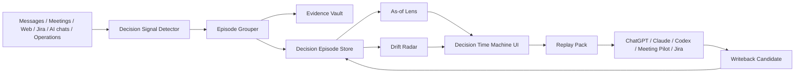

# Decision Time Machine：个人决策记忆回放台

*创建: 2026-05-02 CST*

## 结论

建议设计一个新能力：**Decision Time Machine（个人决策记忆回放台）**。

它不是再做一个“把记忆交给其他 AI 的胶囊工具”，而是把 Personal AI 里的消息、会议、网页、AI 对话和操作记录自动整理成一个个**可回放的决策 episode**：用户可以看到当时做了什么决定、为什么这么判断、证据来自哪里、现在哪些前提已经变了，并一键把“刚好够用的决策上下文”注入会议、聊天、Jira、Codex/Claude/ChatGPT 等下一次协作场景。

一句话价值：

> 用户不再问“这事当时为什么这么定来着”；Personal AI 直接把当时的证据、推理、变更和下一步带回眼前。

配套 demo：[`decision-time-machine-demo.html`](./decision-time-machine-demo.html)

## 本次输入信号

### Reminder 检查

本机 Reminders 里没有名为 `Personal AI` 的列表，因此没有可随机抽取的全新 reminder idea，本次按“主动构思新能力”分支推进。

### 真实记忆信号

按要求连接 `10.32.56.212` 查询 `esone.qiu` 的记忆。HTTP API 端口可连通，但 `/api/v1/health`、`/recall`、`/ask` 本次都在 8-12 秒内超时，所以改用 SSH 只读查询远端 `memory.db` 和 Markdown 摘要，没有修改远端服务状态。

读到的可用信号：

- 用户身份：Esone Qiu，Scrum Master，时区 Asia/Shanghai。
- 近期高频场景：AI coding 工具选型与成本讨论、Codex/Claude Code/Cursor/Factory.ai 试用和组织推广、RingClaw / Meeting Pilot / Nova / Rooms 等项目推进、会议记录沉淀、Jira 数据查询与趋势分析。
- 真实痛点不是“没有信息”，而是信息散在消息、会议、AI 工具、Jira 和网页里，回到某个事项时很难快速恢复“当时为什么这么定”的上下文。
- 现有系统已经有 `messages_raw`、`chunks`、`entities`、`reflection_threads`、`TruthMaintainer`、`ContextRecallService`、`ProviderContextService`、会议持久化和跨 provider context package 的基础，适合在上面加“决策 episode 层”。

## 为什么要做

Personal AI 的目标是留存用户和 AI 的所有记忆，并在聊天、会议、其他 AI 对话等场景提供记忆关联提示。现有方向已经覆盖了“记住信息”和“跨 AI 带上下文”，但真实工作里更高价值的是：

1. **恢复判断依据**：用户经常需要知道某个项目、工具、组织安排、技术路线当时为什么这么决定。
2. **避免上下文重建成本**：切到会议、Jira、Codex、Claude、ChatGPT 时，用户不应该从聊天记录里重新翻证据。
3. **对抗记忆漂移**：AI 只给摘要容易丢失原始证据；过期前提继续被引用会导致错误建议。
4. **把会议记忆变成可用资产**：会议纪要本身价值有限，真正有用的是决策、前提、承诺、风险和后续变化。
5. **让 AI 协作更像“接着上次干”**：用户打开任何 AI 工具时，Personal AI 能告诉它“这个事情之前怎么想过，现在哪些东西变了”。

## 行业观察

### 平台记忆正在成熟，但还停留在“记住我”

- ChatGPT Memory 支持 saved memories 和 reference chat history，并提供查看、删除、关闭、临时聊天、memory version history 等控制；OpenAI 也说明 memory 更适合高层偏好和细节，不适合长模板或大量原文。参考：[OpenAI Memory FAQ](https://help.openai.com/en/articles/8590148-memory-in-chatgpt)。
- Claude Memory 强调工作场景、项目隔离、可查看/编辑 memory summary、Incognito chat，并在 2025-10-23 扩展到 Pro/Max。参考：[Claude Memory](https://claude.com/blog/memory)。
- Gemini 在 2026-03-26 推出从其他 AI 应用导入 memories、preferences 和 chat history 的能力。参考：[Gemini memory import](https://blog.google/innovation-and-ai/products/gemini-app/switch-to-gemini-app/)。

这些说明主流产品已经把“AI 认识用户”当成核心竞争点。但它们多数还是平台内部的长期偏好或历史摘要，缺少一个面向真实工作流的“决策回放层”：为什么当时这么决定、证据是什么、现在是否仍然成立。

### 通用 memory layer 正在抢跨工具入口

- Anuma 主打 one memory + every model + local-first / encrypted / user-owned data。参考：[Anuma](https://www.anuma.ai/)。
- Supermemory 主打 one memory every tool，支持 Claude Code、Cursor、OpenAI Codex、API、Chrome Extension 等入口。参考：[Supermemory](https://supermemory.ai/)。
- Moss 主打跨对话持久记忆、导入 ChatGPT/Claude/Gemini 历史，并强调主动带出相关过去。参考：[Moss](https://mossmemory.com/)。

这些产品证明“跨工具统一记忆”是方向。但 Personal AI 可以走得更贴近个人工作：不是只问“记不记得”，而是问“这条判断是否仍然成立，下一步该怎么接着做”。

### 会议产品在把会议变成可查询上下文

- Granola 从 AI notepad 切入，强调会后快速生成笔记、可分享、可继续询问 transcript。参考：[Granola](https://www.granola.ai/)。
- Limitless/Rewind 这类产品曾强调可穿戴/桌面记录个人经历。Limitless 官网最新状态显示已被 Meta 收购，现有 Pendant 用户继续支持到 2026，且提供数据导出/删除。参考：[Limitless](https://www.limitless.ai/)。

这说明“捕获”本身不是护城河。Personal AI 更应该把捕获后的会议、消息、网页、操作，转成可解释、可追溯、可行动的决策资产。

### 论文方向支持“证据保真 + 动态组织 + 写管读循环”

- MemMachine（2026-04-06）强调 ground-truth-preserving：保存完整对话 episode，减少有损抽取，并用上下文扩展召回处理跨多轮证据。参考：[MemMachine](https://arxiv.org/abs/2604.04853)。
- A-MEM（NeurIPS 2025）借鉴 Zettelkasten，让新记忆动态建立索引、链接和更新旧记忆的上下文表达。参考：[A-MEM](https://arxiv.org/abs/2502.12110)。
- MemOS 把 memory 当作可管理的系统资源，基础单元包含 provenance 和 versioning。参考：[MemOS](https://arxiv.org/abs/2507.03724)。
- 2026 agent memory survey 把 agent memory 抽象成 write-manage-read loop，并把 contradiction handling、latency budget、privacy governance 作为工程现实。参考：[Memory for Autonomous LLM Agents](https://arxiv.org/abs/2603.07670)。
- OpenAI Agents SDK 的 memory 能力强调把历史运行沉淀为文件、下一次渐进读取，用来降低 agent cost、user cost 和 context cost。参考：[OpenAI Agents SDK Memory](https://openai.github.io/openai-agents-python/sandbox/memory/)。

对本功能的启发：决策记忆不能只是“摘要卡片”，必须保留 episode 证据、版本、有效期、冲突和回放路径。

## 产品定位

### 功能名

**Decision Time Machine / 决策时间机**

### 目标用户

第一目标用户就是 Personal AI 当前真实使用者：

- 同时在消息、会议、Jira、Codex/Claude/ChatGPT、网页之间切换。
- 经常推动项目、协调团队、判断工具选型和组织策略。
- 不缺 AI 工具，缺“我自己的长期上下文权威”。

### 不做什么

- 不做另一个会议纪要列表。
- 不做纯时间线搜索。
- 不替用户直接做高风险决策。
- 不把所有记忆一次性灌给 AI。
- 不复刻上次的 Cross-AI Memory Capsule Studio。它可以调用 capsule 注入能力，但核心对象是“决策 episode + as-of 回放”。

## 核心概念

### Decision Episode

一个 Decision Episode 是围绕某个决策形成的结构化记忆单元。

字段建议：

```ts
interface DecisionEpisode {
  id: string;
  title: string;
  decisionStatement: string;
  status: 'candidate' | 'active' | 'superseded' | 'revisit_needed' | 'closed';
  scope: 'work' | 'personal' | 'both';
  decidedAt?: number;
  validFrom?: number;
  validTo?: number;
  projects: string[];
  people: string[];
  tools: string[];
  rationale: string[];
  assumptions: DecisionAssumption[];
  risks: string[];
  followUps: string[];
  confidence: number;
  privacyLevel: 'normal' | 'sensitive' | 'restricted';
  evidenceRefs: DecisionEvidenceRef[];
  supersededBy?: string;
  createdAt: number;
  updatedAt: number;
}
```

### Decision Evidence

每条证据都保留来源，而不是只保留摘要。

```ts
interface DecisionEvidenceRef {
  sourceType: 'message' | 'meeting' | 'web' | 'jira' | 'ai_chat' | 'operation' | 'manual';
  sourceId: string;
  timestamp: number;
  speakerOrActor?: string;
  stance: 'supports' | 'contradicts' | 'background' | 'open_question';
  snippet: string;
  quoteHash: string;
  sourceUrl?: string;
  exploreLink?: string;
}
```

### As-of Lens

同一个决策有两个视角：

- **Then**：当时已知的信息、当时的推理、当时未解决的问题。
- **Now**：现在新增了什么证据、哪些前提过期、哪些结论被推翻或需要复查。

这可以复用 `TruthMaintainer` 的双时态思想：事实本身的有效期和系统发现该事实的时间都要可追踪。

### Decision Replay Pack

当用户要把上下文交给其他 AI 或会议场景时，系统生成一个最小可用包：

- 决策陈述
- 当时 rationale
- 当前变更
- 证据引用
- 过期/冲突提醒
- 不应泄露的内容
- 下一步需要目标 AI 做什么

它可以作为 `ProviderContextService` 的新 `ProviderMemoryProductKind`，例如 `decision_replay_card`。

## 关键体验

### 体验 1：打开会议前，自动给“上次为什么这么定”

用户进入 RingCentral meeting 或会议侧边栏，Personal AI 发现参会人、会议标题、项目关键词命中某个 Decision Episode。

浮层显示：

- `上次相关决策：Codex 试用优先推动`
- `当时依据：Cursor 成本、OpenAI deal、Factory.ai trial、安全审批`
- `现在变化：Factory.ai 已可用于 production；Codex 正在投票选型`
- 操作：`展开证据`、`生成发言建议`、`注入会议助手`

这比普通会议摘要强，因为它直接回答“这个会要接着哪条历史判断推进”。

### 体验 2：在 Jira/网页/消息里看到决策漂移提醒

用户打开一个 Jira、工程讨论页或 AI 工具公告页时，右侧轻提示：

> 这个页面可能影响 2 条旧决策：AI tool migration、Meeting Pilot provider strategy。

点开后能看到：

- 哪条旧前提被新信息影响。
- 影响等级。
- 是否需要复查。
- 可以把复查请求发给 Codex/Claude。

### 体验 3：主界面是“决策时间机”

页面布局：

- 左侧：项目 / 人 / 工具 / 风险过滤。
- 中间：决策时间线，每条是一个 episode。
- 右侧：Then vs Now、证据、冲突、AI 注入预览。

用户可以拖动时间或切换 `Then / Now`：

- `Then` 显示当时系统知道什么。
- `Now` 显示后来出现了什么新证据。
- 差异用 “New / Changed / Invalidated / Still valid” 标记。

### 体验 4：一键问 AI，但带证据和边界

用户点 `Replay to Codex`：

系统生成：

```md
Task: Help me continue the "AI tool migration" decision.

Decision so far:
- We were leaning toward Codex for broad experimentation because ...

As-of update:
- Factory.ai production approval changed on 2026-04-30.
- OpenAI deal preference voting started on 2026-05-01.

Evidence:
- [message:...] ...
- [reflection:...] ...

Do not assume:
- Do not treat old Cursor cost assumptions as final.
- Do not expose private one-on-one messages unless I confirm.

Please output:
1. What changed
2. Recommended next action
3. Questions I should ask the team
```

这可以直接复用上次 Cross-AI Memory Capsule 的交付层，但内容来源是 Decision Episode。

### 体验 5：AI 输出后的回写收据

当 Codex/Claude/ChatGPT 给出建议后，Personal AI 把输出变成“回写候选”：

- 新前提：OpenAI deal 投票结果
- 新行动：收集 daily Codex use cases
- 新风险：Factory.ai production use 需要监控
- 是否更新旧决策？用户确认后写入 episode。

## 信息架构



## 与现有架构的关系

### 可复用

- `messages_raw`：保留原始消息、会议、网页、manual/system 记忆。
- `chunks` + `chunks_fts` + vector：证据召回。
- `entities` + `entity_properties`：项目、人、工具、事实属性。
- `TruthMaintainer`：双时态事实、冲突、确认请求。
- `reflection_threads`：长期主题跟进，可作为 episode 的候选来源。
- `ContextRecallService`：网页/会议/弹窗里的被动关联提示。
- `ProviderContextService`：把 replay pack 注入其他 AI。
- `meetingRoutes` / Meeting Pilot：会议侧入口。

### 新增后端组件

1. `DecisionEpisodeService`
   - 创建、合并、更新 episode。
   - 计算 episode 状态。
   - 生成 then/now diff。

2. `DecisionSignalDetector`
   - 从新 ingest 内容中识别决策、推理、前提、风险、承诺。
   - 第一版可 LLM + 规则混合；低置信度只进入候选队列。

3. `DecisionDriftWorker`
   - 定时检测 assumption 是否过期。
   - 用新增消息/网页/Jira/会议证据判断是否触发 revisit。

4. `DecisionReplayRenderer`
   - 生成 `decision_replay_card`。
   - 支持 token budget、privacy redaction、source refs。

### 新增 API

```http
GET  /api/v1/decisions
GET  /api/v1/decisions/:id
GET  /api/v1/decisions/:id/as-of?time=...
POST /api/v1/decisions/:id/replay-pack
POST /api/v1/decisions/detect
POST /api/v1/decisions/:id/feedback
```

### 新增数据表

```sql
CREATE TABLE decision_episodes (
  id TEXT PRIMARY KEY,
  title TEXT NOT NULL,
  decision_statement TEXT NOT NULL,
  status TEXT NOT NULL,
  scope TEXT NOT NULL DEFAULT 'work',
  decided_at INTEGER,
  valid_from INTEGER,
  valid_to INTEGER,
  projects_json TEXT,
  people_json TEXT,
  tools_json TEXT,
  rationale_json TEXT,
  assumptions_json TEXT,
  risks_json TEXT,
  followups_json TEXT,
  confidence REAL NOT NULL DEFAULT 0.5,
  privacy_level TEXT NOT NULL DEFAULT 'normal',
  superseded_by TEXT,
  created_at INTEGER NOT NULL,
  updated_at INTEGER NOT NULL
);

CREATE TABLE decision_evidence_refs (
  id TEXT PRIMARY KEY,
  episode_id TEXT NOT NULL,
  source_type TEXT NOT NULL,
  source_id TEXT NOT NULL,
  timestamp INTEGER NOT NULL,
  speaker_or_actor TEXT,
  stance TEXT NOT NULL,
  snippet TEXT NOT NULL,
  quote_hash TEXT NOT NULL,
  source_url TEXT,
  explore_link TEXT,
  created_at INTEGER NOT NULL,
  FOREIGN KEY (episode_id) REFERENCES decision_episodes(id)
);

CREATE TABLE decision_replay_runs (
  id TEXT PRIMARY KEY,
  episode_id TEXT NOT NULL,
  target_provider TEXT,
  scenario TEXT,
  rendered_md TEXT NOT NULL,
  source_refs_json TEXT,
  redactions_json TEXT,
  generated_at INTEGER NOT NULL,
  accepted_writeback_at INTEGER
);
```

## 算法设计

### 1. 决策信号检测

输入来源：

- 明确决策语句：`决定...`、`先这样...`、`后续我会...`、`route I am thinking...`
- 选型/投票/审批：工具选择、成本、试用、合规。
- 会议摘要：决定、行动项、风险、open question。
- AI 对话输出：被用户接受的方案、架构选择、prompt/skill 沉淀。
- 操作记忆：用户在 Jira、网页、Codex 里的连续操作。

输出结构：

```json
{
  "isDecisionSignal": true,
  "decisionType": "tool_selection",
  "statement": "Push Codex experimentation while evaluating alternatives",
  "rationale": ["cost pressure", "team trial window", "coding use cases"],
  "assumptions": ["Codex plan is cost-effective", "Factory.ai trial has production constraints"],
  "risks": ["vendor lock-in", "policy uncertainty"],
  "confidence": 0.78
}
```

### 2. Episode 合并

不要每条消息都生成一个 episode。用以下信号聚合：

- 相同项目/工具/人。
- 相同时间窗口。
- 相似 decision statement embedding。
- 引用同一 Jira/会议/AI thread。
- 已存在 reflection thread 的 topic_key。

### 3. Then/Now 差异

Then：

- `timestamp <= decidedAt`
- 当时 active 的 entity properties
- 当时可见 evidence refs

Now：

- 当前 active facts
- 新增 contradicter/supporter evidence
- 过期 assumptions
- superseded relationships

输出：

```ts
interface DecisionDiff {
  stillValid: string[];
  changed: string[];
  invalidated: string[];
  newEvidence: DecisionEvidenceRef[];
  revisitReason?: string;
}
```

### 4. 隐私与作用域

默认规则：

- 群聊/公开会议证据可以进入 replay pack。
- 1:1 私聊、敏感 HR/财务/健康内容默认 redacted。
- 跨 AI 注入时只暴露必要 snippet，不暴露完整原文。
- 每次注入生成 receipt，记录发给谁、发了什么、何时过期。

## UX 原则

1. **先回答“为什么”，再给按钮**
   - 用户进入一个 episode 时，第一眼看到的是 decision + rationale + changed signals。

2. **证据可见但不淹没用户**
   - 默认显示 3 条关键证据，其余折叠。

3. **Then/Now 是主交互**
   - 时间机的价值就是让用户看到“当时如此，现在不同”。

4. **所有 AI 注入都可预览**
   - 不做黑盒自动注入；默认 preview + copy/inject。

5. **低置信度不打扰**
   - 候选 episode 只在主页面出现，不主动推送，除非与当前上下文强相关。

6. **把“需要复查”设计成轻量动作**
   - `Mark reviewed`、`Ask AI`、`Snooze`、`Merge`、`Archive`。

## Demo 说明

Demo 文件：[`decision-time-machine-demo.html`](./decision-time-machine-demo.html)

交互点：

- 左侧切换不同 decision episode。
- 中间查看时间线、changed assumptions 和证据图。
- 右侧切换 `Then / Now`。
- 勾选隐私来源，实时改变 Replay Pack。
- 点击 `Generate Replay Pack` 模拟生成给 Codex/Claude/会议助手的上下文。

## MVP 范围

### Phase 1：只做只读发现和 UI

目标：不改变现有 ingest 语义，只从现有数据生成候选决策。

- 新增只读脚本/服务：从最近 30 天 messages/meetings/reflections 中生成 `decision_episodes` 候选。
- 新增 API：`GET /decisions`、`GET /decisions/:id`。
- 新增 Vue/React 页面或 extension 页面：Decision Time Machine。
- 新增 `decision_replay_card` renderer，但先只 copy markdown，不自动注入。

验收：

- 能从真实记忆里生成 10-30 个候选 episode。
- 每个 episode 至少有 2 条 evidence refs。
- 用户可以手动 archive/merge/confirm。

### Phase 2：上下文入口

- 会议页面 passive recall 命中 episode。
- Jira/网页 context-recall 返回 related decisions。
- ProviderContextService 增加 `decision_replay_card`。
- 支持 replay to Codex/Claude/ChatGPT copy prompt。

验收：

- 打开相关会议/网页时，p95 500ms 内返回 1-3 条相关决策提示。
- 生成 replay pack 的 source refs 100% 可追溯。

### Phase 3：漂移检测和回写

- 定时检测过期 assumptions。
- 新证据触发 `revisit_needed`。
- AI 输出后生成 writeback candidate。
- 与 confirm request 合并，防止自动污染长期记忆。

验收：

- 能识别“旧前提被新消息影响”的场景。
- 用户确认后更新 episode。
- 错误触发率可通过 feedback 降低。

## 技术风险

| 风险 | 表现 | 缓解 |
|---|---|---|
| 过度抽取 | 普通聊天被识别成决策 | 候选状态 + 置信度阈值 + 用户确认 |
| 摘要幻觉 | LLM 把证据改写错 | 证据保真，quote hash，source ref 必填 |
| 打扰过多 | 当前页面频繁弹出决策 | 只在强相关 + changed/revisit 时主动提示 |
| 隐私泄露 | 私聊内容进入跨 AI prompt | 默认 redaction，1:1 来源需显式开启 |
| 决策合并错误 | 两个相似事项被合并 | 支持拆分/merge undo，episode confidence |
| 延迟过高 | 页面提示卡顿 | ContextRecall fast path 只读 episode index，不走 LLM |

## 成功指标

第一阶段不看大而泛的“活跃度”，看具体效率：

- 用户手动确认的候选 episode 比例 > 60%。
- 用户打开某项目/会议时，至少 30% 的提示被展开。
- Replay pack 被复制/注入后，用户不需要重新解释背景的比例提升。
- 被用户标记为“过期/无关”的提示 < 20%。
- 每个 accepted episode 平均 evidence refs >= 3。

## 竞品对比

| 产品 | 强项 | 缺口 | Personal AI 差异 |
|---|---|---|---|
| ChatGPT Memory | 自动个性化、控制完整 | 偏用户偏好，不强调证据回放 | 保留 source refs 和 as-of 决策链 |
| Claude Memory | 项目级隔离、可编辑 summary | 仍是 Claude 内部记忆 | 面向任意会议/网页/AI 工具 |
| Gemini Memory Import | 换平台不从零开始 | 更像迁移入口 | 不迁移全部，只交付当前决策上下文 |
| Anuma | one memory every model、隐私 | 更偏统一聊天产品 | Personal AI 是用户本机/团队真实数据层 |
| Supermemory | API/插件丰富、跨工具 | 更偏通用 memory infra | 增加 decision episode、then/now、drift |
| Moss | 大规模跨对话记忆 | 产品定位偏聊天记忆 | 强调工作决策和证据可追溯 |
| Granola | 会议记录和 transcript 质量 | 聚焦会议 | 把会议与消息/Jira/AI/网页合并成决策链 |
| Limitless/Rewind | 捕获用户经历 | 捕获强，推理/协作弱 | 捕获后变成可复查、可注入的工作资产 |

## 亮点

1. **记忆从“知道事实”升级为“知道为什么”**
   - 这正好命中真实工作里最贵的上下文重建成本。

2. **Then/Now 对比有独特 UX 价值**
   - 不是普通搜索结果，而是用户能直观看到当时判断和现在变化。

3. **证据保真，减少记忆幻觉**
   - 符合 MemMachine / MemOS 的趋势：episode、provenance、versioning。

4. **和 Cross-AI Memory Capsule 互补**
   - Capsule 负责交付上下文；Decision Time Machine 负责生产高质量决策上下文。

5. **非常适合用户当前日常**
   - AI 工具选型、会议推进、团队调整、Jira 数据分析，本质上都是连续决策问题。

## 建议是否实现

建议做，但不要一开始做自动化很重的版本。先做 **Phase 1 只读候选 + UI + replay markdown**，用真实记忆验证：

- 是否能从近期消息/会议里抽出高质量 episode。
- 用户是否愿意确认/合并。
- 回放卡是否真的减少重解释成本。

如果 Phase 1 命中率高，再推进网页/会议浮层和自动漂移检测。
