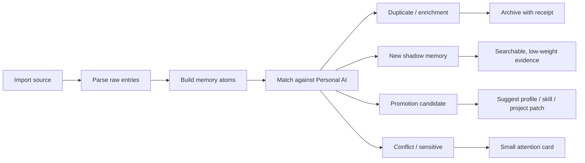

# 新能力：Memory Coverage Map / 记忆覆盖地图

> 生成日期：2026-05-20 CST
> Codex 会话标题建议：新能力：记忆覆盖地图
> 交付物：功能计划 + 可预览 Demo
> Demo：[`memory-coverage-map-demo.html`](./memory-coverage-map-demo.html)
> Idea 来源：未使用 Reminder。本机 Reminders 当前未发现名为 `Personal AI` 的清单；因此本方案来自项目目标、真实记忆查询、已有 progressing 边界、行业产品和近期 AI memory 研究。

## 结论

建议设计一个新的 Personal AI 能力：**Memory Coverage Map / 记忆覆盖地图**。

它不是新的搜索页、不是 Memory Trust Console、也不是任务执行前的 Context Gap Radar。它解决的是更基础、更影响信任的问题：

> Personal AI 号称保存用户和 AI 的所有记忆，但用户需要知道：哪些来源真的接进来了，最近什么时候成功过，哪些来源只是配置过但没有数据，哪些记忆类型还完全缺席，以及该怎么一键修复。

一句话价值：

> 让用户在问 Personal AI 之前先知道“它现在到底看得见什么”，把记忆系统从黑箱变成一张可检查、可修复、可扩展的个人记忆覆盖地图。

## 需求合理性评审（2026-05-20 更新）

> 这一节是回过头对 2026-05-20 初稿做的批判性评审。它先回答“这个需求是否合理”，再列出必须改进的点；下面 `产品定义` / `功能范围` / `后端设计` 等小节里和评审冲突的描述，已经按照这里的结论修订。

### 一句话评审

方向合理，但初稿存在以下三类风险，必须在 P0 落地前修正：

1. **以本地 SQLite 切片作为唯一证据源**：初稿引用 `messages_raw: glip = 8693`、`meeting = 316` 等数字是从本机 SQLite 只读查询得到的；真实远端 `10.32.56.212:3210` 上 `/api/v1/health` 的口径是 `messageCount = 9375 / entityCount = 13648 / chunkCount = 4625`，`/api/v1/meetings` 总数是 `24`。两边对不上意味着 Demo 要么用本机数字、要么用远端数字，但不能混用，否则用户会立刻发现“覆盖地图自己都不准”。
2. **依赖了根本不存在的 API**：`/api/v1/providers/*`、`/api/v1/messages?sourceType=glip` 等用于按来源切片的端点目前都 404；`/api/v1/stats` 在远端返回 `SQLITE_CORRUPT`。如果不增量补齐这些聚合接口，P0 写出来的 Coverage Map 只能跑空。
3. **状态枚举过宽，部分指标无法计算**：`noisy` 需要 ASR 噪音占比、`utilityScore` 需要 recall/profile 反向引用，这两类信号目前都没存。继续保留它们会让分类规则没法验证。

### 评审结论

- 保留：核心叙事“先告诉用户系统当前看见了什么”、按来源拆 `连接 → 证据 → 质量 → 可用场景 → 修复动作` 的产品骨架、入口位置（`memory-exploring` 新增 tab）。
- 修订：来源家族划分、状态枚举、scoring 信号、数据来源、修复动作分类——见下方“关键改进点”。
- 推迟：可视化的 `utilityScore` / `noisy` 判定、Reminders 自动写回、外部 AI 历史导入——见下方“暂不做 / 推迟”。

### 关键改进点

#### 1. 真实数据校准（来自远端 `10.32.56.212`）

| 来源 / 指标 | 初稿引用 | 远端实际可读到的值 | 改进 |
|---|---|---|---|
| Messages total | 8693（glip 单源） | `health.messageCount = 9375`（含所有 source_type） | P0 必须用远端口径；按 `source_type` 切片需新接口（见下） |
| Meetings | 316 | `/api/v1/meetings.total = 24` | Demo 改写为 24；`316` 是本机 db 的 chunk 视角，不能和 messages 同级 |
| Calendar | “未来到 2026-06-01” | `day-pilot.today.sourceStats.calendar.upcoming = 91`，到 2026-06-01 仍成立 | 数字改为 91，仍说明覆盖健康 |
| Skills | 3 active / 2 suggestion / 5 dismissed | `/api/v1/skills?limit=50` 返回 `active=3, suggestion=2, dismissed=5`，全部来源是 `openclaw` | 保留；Demo 应额外注明“仅 openclaw 一个来源平台”|
| Skill sync platforms | 未给出 | `/api/v1/skills/sync-settings`: `personal_ai/openclaw enabled`，`codex/claude_code disabled` | 新增“同步通道”视图 |
| User profile | “基础身份 + 大量 active confirmed” | `/api/v1/profile/items?limit=200`: 179 active + 21 pending，且 `fact` 占 183（其他类型很少） | Demo 强调画像类型严重偏 fact，preference/habit/constraint 几乎缺席 |
| USER_CORE | 三条 | `/api/v1/profile/core` 只有 role/name/timezone | 标记“core 文档极简，长期偏好仍在 items 表” |
| 通知 / 决策积压 | 未提 | `/api/v1/notifications/stats.pending = 1284`，`/api/v1/confirm-requests?status=pending = 37`，`/api/v1/actions?queueStatus=queued = 47`，`/api/v1/reflection-threads?status=active = 593` | **新增“积压压力”家族**，否则覆盖地图会忽略一个明显的健康问题 |
| Doubao 长期记忆 | “最近成功 / 一次失败” | 端点未开放，Demo 无法直接验证 | P0 内不许“硬编码”虚假 Doubao 事件；需先补 `/api/v1/providers/sync-jobs/recent` |

> 结论：Demo 数据必须从远端 `health + day-pilot + skills + profile + notifications/stats + confirm-requests + actions + reflection-threads` 这几个**已存在**的端点拼出来；任何还没有端点的信号，在 Demo 上要明确标出来“该来源 Coverage Map 自身也缺数据”。

#### 2. 信息架构改为「按平台」呈现（2026-05-20 二轮修订）

初稿把 `messages` / `meetings` / `calendar` / `jira` / `web` / `ai_chat` / `operations` / `skills` / `profile` / `files` / `reminders` 拆成 11 个「家族」，再次评审发现这是工程视角，不是用户视角。用户进入「记忆覆盖」想知道的是：

> 我的记忆来自哪些**平台**？Codex 上不仅同步了会话，还同步了技能；豆包上推过去的是不是长期记忆？

因此正式版以**平台**为一级 grouping，每个平台卡片再列出它贡献的数据类型与方向：

- 一级单位：`platform`（用户能在外部世界看见的具名工具/系统）。
- 二级单位：`data_contribution`（这个平台贡献了哪几类数据，例如 RingCentral 同时贡献聊天/会议/日历；OpenClaw 同时贡献技能与动作委派）。
- 方向标签：`📥 ingest`（平台 → Personal AI）/ `📤 push`（Personal AI → 平台）/ `🔄 sync`（双向）/ `🪞 derive`（Personal AI Core 内部派生）。
- 网页浏览归类：作为 `Web 浏览（Chrome 扩展）` 平台单独一张卡，承载所有「不属于已识别平台的网页捕获」+ 现场 DOM 上下文；已识别的 Jira / RingCentral 页面归到各自平台。

平台清单（基于 `/api/v1/skills/sync-settings` + 现有 ingest 通道）：

| 分组 | 平台 | 方向 | 数据贡献 | 信号来源 |
|---|---|---|---|---|
| 已激活 | RingCentral（Glip · Calendar · Video） | 📥 ingest | 聊天 / 会议 / 日历 | Chrome 扩展 + `meetings` 表 + `day-pilot.calendar` |
| 已激活 | Jira | 📥 ingest + 📤 writeback | issue/comment / 反射线程 / Esone's AI 回写 | 浏览器抓取 + `reflection_threads` + OpenClaw delegate |
| 已激活 | OpenClaw | 📥 skills + 📤 delegate | 技能导入 / 动作委派 | `personal_skills` + `actions(delegate_openclaw)` + `skills/sync-settings` |
| 已激活 | 豆包 Doubao | 📤 push | stable_memory / todo_sync / notice_sync | `provider_sync_jobs`（接口缺，详见改进点 4）|
| 已激活 | Web 浏览（Chrome 扩展） | 📥 ingest | 自动捕获页面 / 手动收藏 / 现场 DOM | Memory Lens / Web Intelligence + `concerned_items` |
| 派生 | **Personal AI Core** | 🪞 derive | 画像 / 反思 / 决策 / 通知 / 动作 | `user_profile_items` + `reflection_threads` + `confirm_requests` + `notifications` + `proposed_actions` |
| 未启用 | Codex / Claude Code / Cursor | 📤 skills | （未启用） | `skills/sync-settings` 三个 `fs_via_desktop_app` 通道 disabled |
| 未启用 | ChatGPT GPTs / Claude Skills Web | 📤 skills | 仅手工安装 | `skills/sync-settings` 两个 `manual_only` 通道 |
| 未启用 | Apple Reminders / Apple Notes | 📥 ideas/notes | 桥接 P1+ | apple-reminders / apple-notes 技能仍 suggestion |
| 未启用 | 外部 AI 历史（ChatGPT / Gemini / Claude） | 📥 chat | 用户主动导入 | 不在 P0 自动化 |
| 系统入口 | 智能导入 / 记忆备份 | 📥 ingest + 🔄 restore | md/txt/pdf/zip/粘贴文本 / Personal AI backup zip | Coverage Map 页面内用户主动触发；备份 zip 复用 `/export` / `/import` |

> 原 P0 描述里的「Ingest 家族 / 会议家族 / 时间家族 / 画像家族 / 技能家族 / 外部 AI 同步家族 / 积压压力家族」改为 `MemoryCoverageService` 的**内部分类标签**（用于 SQL 聚合），不直接出现在 UI；UI 只显示平台 + 数据贡献清单。

> 「积压压力」不再单列家族，而是作为 **Personal AI Core** 这一派生平台的 4 条数据贡献（通知 1 284 / 反思 593 / 动作 47 / 决策 37）。

#### 3. 状态枚举收窄

P0 只保留可计算的状态：

| 状态 | P0 判定方式 |
|---|---|
| `healthy` | 有数据、最近 N 天有新增、对应能力近一周内被调用过 |
| `stale` | 有数据但最近 N 天没新增 |
| `sparse` | 总量低于阈值，且不足以撑起对应 family 的关键召回 |
| `failing` | `provider_sync_jobs.status='failed'` 或最近一次任务 error 非空 |
| `blocked` | 配置开关关闭 / 缺少绑定 / 缺权限 |
| `pressure` | **新增**：积压压力家族专用，量化“今天可能因为太多未处理项而拖累 Personal AI” |
| `not_configured` | 既无数据也无配置 |
| `unknown` | 接口缺失 / Coverage Map 自己也读不到 |

`noisy` 暂不在 P0 出现，理由：缺少 ASR 噪音占比、低行动性消息占比这类信号；改为在 P2 计算 `qualityScore` 时再恢复。

#### 4. 必须补齐的后端接口（P0 阻塞项）

下面这些接口决定 Coverage Map 能不能在远端真跑起来；如果先做前端 Demo，就用 mock 数据，但生产 P0 必须落它们：

1. `GET /api/v1/coverage/map` — 主聚合入口，下面所有数据合一返回。
2. `GET /api/v1/coverage/messages-by-source` — `messages_raw` 按 `source_type` 聚合 `count + max(timestamp) + last_7d_count`。
3. `GET /api/v1/coverage/provider-jobs/recent` — `provider_sync_jobs` 按 `provider+scenario` 聚合最近 24h 的 `succeeded/failed/skipped` 计数与最后一次状态。
4. `GET /api/v1/coverage/pressure` — 一次返回 `notifications.pending`、`proposed_actions.queued`、`confirm_requests.pending`、`reflection_threads.active` 与各自 7 天滑动平均。
5. `GET /api/v1/coverage/skills-sync` — 复用 `/skills/sync-settings`，但加 `last_probe_age_days` 与 `bindings_by_state` 聚合。

修复 `/api/v1/stats`（远端目前 `SQLITE_CORRUPT`）也应作为 P0 修复项，否则 Coverage Map summary 没有兜底数字。

#### 5. 数据结构需要的微调

| 表 | 调整 | 原因 |
|---|---|---|
| `provider_sync_jobs` | 增列或显式索引 `(provider, scenario, status, created_at DESC)` | 当前索引覆盖不到 scenario 维度的快速聚合 |
| `personal_skills` | 增列 `last_used_at`（或者派生视图） | 当前只能看到 `updated_at`，不能区分“仍在用 vs. 仅未删除” |
| `notifications` | 暴露 `dailyCounts` 接口已存在；增 `by_type_24h` 聚合 | 现在只能拿到 daily count，没有按 type 拆 |
| `webpage_memory`（如有） | 暴露按 `domain` 的覆盖（pending） | 没有 web 家族就没法回答“浏览记忆覆盖哪些站点” |
| `coverage_targets`（新表，P3） | `user_id, family, source_id, expected_freshness_hours, mute_until, created_at` | 用户自定义“想 Personal AI 记住什么”的目标 |

#### 6. 暂不做 / 推迟

- ASR 噪音占比与 `noisy` 状态：P0 不算，P2 再做。
- Reminders 自动写回 / 任何对系统级 Reminder DB 的写操作：P1 仅做“是否存在 Personal AI 列表”这一只读信号，必须通过 Desktop App。
- 把外部 AI 历史（ChatGPT/Gemini 等）或任意文件自动导入：始终是用户主动动作，不在 Coverage Map 自动化里。
- LLM 解释卡：P0 全部用模板文案，不调 LLM；避免覆盖地图自己拖慢首页。
- “coverage_score” 总分单一数字：不做。所有状态都按 family 独立呈现，避免误导。

#### 7. 智能记忆导入与备份入口（2026-05-22 补充）

Coverage Map 不只是告诉用户“哪些来源没接上”，也应该承接最自然的修复动作：**把用户手里的资料主动导入 Personal AI**。这不是新增自动抓取器，而是把 `options.tsx` 里已有的记忆备份导入/导出能力迁到更合理的“记忆覆盖”界面，并在同一入口增加智能分析导入。

##### 入口位置

在 `memory-exploring.html#/coverage` 顶部 summary 之后、平台卡片之前新增 `智能导入 / 备份` 区块。原因：

- 用户看到某个来源 `not configured / unknown / sparse` 后，下一步常常就是“我手里有一份文档/导出包，先导进去”。
- 备份导入/导出是记忆系统级操作，不应该继续藏在 extension `options.tsx` 的设置页里。
- Coverage Map 本来就解释“Personal AI 看得见什么”，导入入口刚好负责“让它看见这批资料”。

##### 支持的输入

| 输入 | 处理方式 | 默认结果 |
|---|---|---|
| 直接粘贴文本 | 走智能分析导入 dry-run | 拆成消息记忆 / 画像候选 / skill 候选 / 项目事实 |
| 外部 AI memory dump / “what do you remember about me”回答 | 识别 provider、来源时间、记忆条目边界 | 生成外部 AI source receipt、shadow memory、promotion candidate |
| `.txt` / `.md` | 读取文本，按标题、段落、列表、front matter 拆块 | 可直接入库的写入 `messages_raw/chunks`，可沉淀的写候选 |
| `.pdf` | 先抽文本和页码；失败时给出“需要 OCR/无法解析” | 按页码保留 source ref，分析后入库 |
| 普通 `.zip` | 解压并枚举文件；递归识别 md/txt/pdf/json 等可分析文件 | 按目录结构生成 batch/source receipt，再逐文件分析 |
| ChatGPT / Claude / Gemini chat-history zip | 不命中 Personal AI backup schema 时按外部 AI 历史包处理 | 先保留原始 receipt 和低权重摘要，再逐步解析会话 |
| Codex / Claude Code / Cursor session summary / memory file | 作为 coding-agent 记忆资产导入 | 项目事实、prompt 习惯、skill 线索进入候选 |
| Personal AI 备份 `.zip` | 识别为备份包，走现有 `/import` 恢复逻辑 | merge / replace 恢复，不走智能分析 |
| `options.tsx` 导出的备份 zip | 识别 `manifest.json.format = personal-ai-memory-backup`、`transport = zip`、`user/memory.db`、`user/config.json` | 复用现有 `MemoryBackupService.importMemoryBackupZip()` |

##### Zip 自动判别

上传 zip 后必须先进入 `ImportInspector`，只读解压并做三类判定：

1. **Personal AI 备份包**：根目录有 `manifest.json`，且 `format = personal-ai-memory-backup`、`transport = zip`，并包含 `user/memory.db` 与 `user/config.json`。这类走现有备份恢复逻辑，不做智能分析，避免把完整数据库备份误拆成普通文档。
2. **混合资料包**：没有备份 manifest，或 manifest 不匹配，但里面有 `.md/.txt/.pdf/.json` 等可分析文件。走智能分析导入。
3. **不可处理包**：没有可识别文件，或 zip 加密/损坏/过大。显示 blocked reason，不写入任何数据。

如果一个 zip 同时包含 Personal AI backup manifest 和额外文档，默认按备份包处理，并提示“检测到备份包结构；如需分析其中额外文档，请先解压后单独上传”，避免恢复和分析两种语义混在一次操作里。

##### 与现有备份导入/导出的关系

`src/options.tsx` 现有能力：

- `POST /export`，请求 `{ format: 'backup_zip' }`，下载 `personal-ai-memory-<user>-<timestamp>.zip`。
- `POST /import`，multipart 上传 zip，支持 `mode = merge | replace`。
- `replace` 前有确认；`merge` 默认保留本地未冲突内容。

Coverage Map 的新入口应复用这些后端能力：

- `记忆备份` 按钮：调用现有 `MemoryServiceClient.exportMemory()`，只把按钮从 options 移到 Coverage Map。
- `恢复备份`：上传 zip 后先做 `ImportInspector`；如果命中 backup schema，再显示 `merge / replace` 选择并调用现有 `MemoryServiceClient.importMemory(file, mode)`。
- options 页可以保留一个轻量跳转：“记忆备份已移至 记忆探索 → 记忆覆盖 → 智能导入 / 备份”，避免两个入口长期并存。

##### 智能分析导入的数据落点

智能分析导入要结合现有 Memory Service 存储结构，能直接入库的直接入库，需要分析关联的先生成候选：

| 分析结果 | 落点 | 规则 |
|---|---|---|
| 原文 source receipt | 新表 `memory_import_batches` 或 `messages_raw.metadata_json.importBatchId` | 每次导入都有 batch id、hash、文件清单、解析器版本 |
| 普通文档片段 | `messages_raw` + `chunks` | `source_type = manual` 或新增 `document_import`；保留文件名、页码、段落路径 |
| 用户画像候选 | `user_profile_items` pending_confirm | 不能直接 confirmed；遵守“确认前不使用” |
| 项目/实体/人物 | 现有 entity extraction / matched_projects | 只在置信度足够时关联，低置信保留在 metadata |
| prompt / skill 线索 | `personal_skills` suggestion | 不直接 active；可跳到 Skill Foundry |
| 决策 / 结论线索 | reflection thread 或 future decision evidence chain | 高风险事实进入 confirm request |
| 外部 AI shadow memory | `messages_raw/chunks` + `memory_import_batches` provenance | 可搜索、低权重参与召回、带 provider/source label，不自动外发 |
| 外部 AI promotion candidate | `user_profile_items` pending_confirm / `personal_skills` suggestion / project-memory candidate | 只有高置信低风险内容进入候选，不直接 confirmed 或 active |
| 冲突 / 敏感差异 | `confirm_requests` 或 import batch attention card | 只显示少量高风险条目，不生成大 review queue |
| 无法可靠分类内容 | 仅作为 searchable source chunk | 不进入画像和主动提示 |

##### 外部 AI 记忆回流子规则

原“外部 AI 记忆回流”内容并入这里，作为智能导入的一类特化路径，不再独立成新页面或新抓取器。

它覆盖的来源包括：

- ChatGPT / Claude / Gemini 的 memory export、chat-history zip、或“what do you remember about me”回答。
- 豆包 / ChatGPT explorer 已缓存的对话摘要，用于升级成 provider-specific import batch，而不是再次抓取。
- Codex / Claude Code / Cursor / OpenClaw 的本地 session summary、memory file、prompt 习惯和 skill 线索。
- 用户手动粘贴的一段外部 AI 对话总结。

导入后的结果分四类展示：

| 结果类型 | 默认使用方式 |
|---|---|
| Source Receipt | 永久记录 provider、导入时间、hash、文件清单、时间范围、解析器版本 |
| AI Memory Shadow | 可搜索、低权重参与 Ask / Memory Lens / Compose Assist，必须带 provenance，不自动外发 |
| Promotion Candidate | 可能提升到 profile / project / skill / decision 的候选，必须经对应系统确认 |
| Conflict / Sensitive Flag | 只在明显冲突、敏感、会影响强个性化或自动行动时提醒用户 |

默认状态机：



导入完成页不展示几十条逐项 review，而只给差异摘要，例如：

- `已识别 42 条外部 AI 记忆`
- `28 条 Personal AI 已知道`
- `9 条作为 AI memory shadow 入库`
- `3 条建议提升为偏好/技能`
- `2 条冲突或敏感，等你有空再看`

可用主动作应是 `完成，本次先归档`、`查看高价值建议`、`导入到 Skill Foundry`、`本批次只保留可搜索，不参与主动提示`。

进入下游召回时必须带明确标签，例如 `来自 ChatGPT memory import · 2026-05-22`、`来自豆包 explorer · 2026-05-12`、`仅作为外部 AI 记忆，不是用户确认事实`。如果用户在 Compose Assist 中采纳、忽略或改写了由 shadow memory 参与的建议，后续交给 Ambient Recall Calibration 记录为自然使用信号。

##### 新服务草案

```ts
interface SmartMemoryImportRequest {
  inputKind: 'paste' | 'file' | 'zip';
  fileName?: string;
  mimeType?: string;
  text?: string;
  mode?: 'dry_run' | 'commit';
  scope?: 'work' | 'personal' | 'both';
}

interface SmartMemoryImportDryRun {
  batchPreview: {
    importKind: 'backup_restore' | 'smart_document_import' | 'unsupported';
    sourceHash: string;
    fileCount: number;
    totalBytes: number;
    detectedStructure: string[];
  };
  route:
    | { type: 'backup_restore'; supportedModes: ['merge', 'replace']; manifest: unknown }
    | { type: 'smart_analysis'; files: SmartImportFilePreview[] }
    | { type: 'blocked'; reason: string };
  proposedWrites: {
    memoryRows: number;
    chunks: number;
    profileCandidates: number;
    skillCandidates: number;
    confirmRequests: number;
  };
  warnings: Array<{ code: string; message: string; severity: 'info' | 'warning' | 'error' }>;
}
```

推荐接口：

- `POST /api/v1/import/inspect`：只读检查上传内容，判断 backup restore vs smart analysis。
- `POST /api/v1/import/analyze`：对非备份资料做智能拆解 dry-run。
- `POST /api/v1/import/commit`：把 dry-run 的可写结果入库。
- `POST /api/v1/export` / `POST /api/v1/import`：继续保留现有备份导出/恢复接口，避免破坏 options 旧逻辑。

##### 实现依赖

这个功能**不必等 Coverage Map 的所有聚合 API 完整实现后才能做**，但需要先有 Coverage Map 的页面 shell / 路由承载入口。

建议顺序：

1. 先落 `memory-exploring.html#/coverage` 页面 shell，把 options 里的备份导入/导出迁过来，复用 `/export` 和 `/import`。
2. 同步补 `ImportInspector`，让 zip 能自动判断“备份恢复”还是“智能分析导入”。
3. 再实现 md/txt/pdf/paste 的智能分析 dry-run 和 commit。
4. 最后把导入结果反映回 Coverage Map 平台卡：`手动导入资料`、`外部 AI 历史`、`文件记忆` 的覆盖状态随 batch 更新。

这样可以避免把智能导入阻塞在 `/coverage/map` 所有平台聚合上，同时又不会在 options 里继续扩一个脱离记忆覆盖语境的入口。

### 验收口径

| 维度 | 通过标准 |
|---|---|
| 真实性 | 页面任何数字必须能在 `/api/v1/coverage/map` 的 JSON 里找到字段一一对应；不允许 hard-code 的样例值进入生产代码 |
| 安全 | Coverage Map 主视图只读；智能导入 / 备份是用户显式触发的写入动作，必须先 dry-run / inspect，再确认 commit 或 restore |
| 性能 | `/coverage/map` P95 < 500ms；首屏 7 张卡片以内 |
| 健壮 | 任意 1 个家族接口失败时，对应卡片显示 `unknown + 解释 + 重试`，其它家族正常渲染 |
| 文案 | 不允许出现“同步异常 / 数据源不可用 / 暂无结果”这类不可操作描述 |

## 为什么值得做

Personal AI 的长期目标是保存用户和 AI 的所有记忆：消息、网页、操作、偏好、skill、其他 AI 对话、会议、浏览信息等。这个目标越大，用户越容易遇到一个真实问题：

> 不是系统不会回答，而是用户不知道系统有没有看见那一块生活和工作的证据。

真实使用中，这会导致几类体验断裂：

1. 用户以为 RingCentral / Jira / 会议 / 豆包 / ChatGPT 都已经被记住，但某个 connector 其实静默失败或只接了部分来源。
2. Today Pilot、Memory Lens、Compose Assist 召回不准时，用户不知道是排序问题、证据质量问题，还是源头根本没进库。
3. 用户新增一个 AI 工具或 skill 后，不知道 Personal AI 是否已经能读取、沉淀、召回、导出或同步到其他 agent。
4. 系统有很多健康状态和同步流水，但分散在 Desktop App、Memory Service、Profile Page、Skill Library、Provider jobs、extension 状态页里，用户需要自己拼。

Memory Coverage Map 的产品承诺不是“多抓数据”，而是：

- 把“记忆覆盖范围”做成用户可见的一张地图。
- 把每个来源拆成 `连接状态 -> 最近证据 -> 质量风险 -> 可用场景 -> 修复动作`。
- 在所有召回入口共享这张 coverage 状态，让空结果和低置信结果能解释“为什么 Personal AI 可能不知道”。

## 本次输入信号

### Reminders 检查

本机 Reminders 可枚举列表包括：

- `We`
- `Next actions`
- `Moives`
- `Shopping List`
- `家庭`
- `人名记忆`
- `宝宝需要办理`
- `吃吃看`
- `出门前检查`
- `装修待办`
- `Reading`
- `菜头`
- `Tasks`

没有发现名为 `Personal AI` 的列表。因此本次没有从 Reminder item 随机抽取全新 idea，也没有需要标记 done 或写备注的 Reminder item。

### 真实记忆信号

按要求连接 `10.32.56.212` 查询 `esone.qiu` 用户记忆。本次 HTTP `http://10.32.56.212:3210/health` 可达但返回 `degraded`，其中数据库状态为 `connected:false`；随后通过 SSH 对远端 `memory-service/data/users/esone.qiu/memory.db` 做只读查询，没有写入远端数据。

读到的关键轮廓：

- `messages_raw` 当前主要来源为：
  - `glip`: 8693 条，最新原始消息时间为 2026-05-13 02:26:42。
  - `meeting`: 316 条，最新为 2026-05-14 01:31:03。
  - `calendar`: 176 条，包含到 2026-06-01 的未来日历事件。
  - `system`: 161 条。
  - `jira`: 13 条，最新为 2026-05-19 09:18:23。
  - `outreach_question`: 8 条，`outreach_reply`: 2 条。
- `chunks` 已覆盖 `glip`、`reflection_thread`、`daily_log`、`meeting`、`calendar`、`jira`、`user_core` 等来源，说明长期记忆并不是单一消息库。
- `provider_sync_jobs` 里豆包 `stable_memory` 有成功记录，也有一次失败记录：`Doubao did not show the message after send...`；`todo_sync` 和 `notice_sync` 多次跳过，原因是没有 pending todos/notices。
- `personal_skills` 有 3 条 active、2 条 suggestion、5 条 dismissed；其中 `apple-reminders` 和 `apple-notes` 仍是 suggestion，说明“用户在其他平台沉淀的 skill”已经开始进入系统，但还缺少覆盖度视图。
- `USER_CORE.md` 只有基础身份：Esone Qiu、Scrum Master、Asia/Shanghai；长期偏好和关键人物仍稀疏。
- `user_profile_items` 里存在大量 active confirmed fact observation，同时仍有少量 pending 的 AI assistance / sprint management 相关偏好和事实。这说明 profile 数据量很大，但“哪些画像真的可用于个性化”需要和覆盖状态一起解释。
- 近期真实记忆高频涉及 Codex、Claude Code、Cursor、OpenClaw、RingClaw、AI Notes、Jira、MCP、Factory.ai、OpenAI API quota、Nova/RCVSDK/Pluto daily 等跨工具场景。

这些信号共同指向一个产品空位：

> Personal AI 已经开始接很多来源，但用户没有一张“我现在的私人记忆版图”。如果某个来源落后、跳过、失败、没有绑定或只有噪音，系统应该直接告诉用户，而不是只在召回失败时表现得像“不聪明”。

## 已有 progressing 方案避让

| 已有方案 | 主对象 | 本方案的边界 |
|---|---|---|
| Memory Lens | 当前页面旁的即时相关记忆提示 | Coverage Map 不做页面召回 UI；它告诉 Lens 当前能依赖哪些来源、哪些来源欠新鲜或缺失 |
| Context Gap Radar | 单个任务执行前缺哪个上下文槽位 | Coverage Map 不判断某个任务该问什么；它判断整个记忆系统的来源覆盖和健康 |
| Memory Freshness Radar | 已保存来源后来是否变更 | Coverage Map 关注“来源是否接入/最近是否成功/覆盖是否完整”，Freshness 关注“已接入来源是否发生更新” |
| Memory Trust Console（搁置） | 记忆可信、隐私、冲突治理 | Coverage Map 不做全局事实治理；它只给来源层的健康、覆盖和修复动作 |
| Memory Day Pilot / Today Pilot | 今日 mission 编排 | Coverage Map 可为 Today Pilot 标注“今天摘要缺少近 7 天 Glip”这类覆盖风险，但不生成 mission |
| AI Context Passport | 把任务上下文交给其他 AI | Coverage Map 不打包上下文；它标明 Passport 可以/不应使用哪些来源 |
| Operation Flight Recorder | 主动记录一段操作过程 | Coverage Map 只显示操作记忆来源是否存在、是否最近成功，不录制过程 |
| Personal Skill Foundry | 管理和发布个人 skill | Coverage Map 只显示 skill 来源覆盖、活跃/建议/失效状态；不编辑 skill 本体 |
| User Profile System | 管理画像条目 | Coverage Map 只显示 profile 的来源覆盖和可用性状态；不替代条目校准页面 |

核心差异：

- 其他方案在问“某个场景该用什么记忆”。
- Coverage Map 先问“这些记忆来源是否真的在工作”。

## 行业产品参考

### ChatGPT Memory：有 memory sources，但仍是单产品内透明度

OpenAI 的 ChatGPT Memory FAQ 说明，ChatGPT 有 `saved memories` 和 `reference chat history` 两类记忆，并在个性化设置里展示相关开关；Pulse 也会使用 saved memories 和 chat history 做异步研究。参考：[OpenAI Memory FAQ](https://help.openai.com/en/articles/10303002-how-does-memory-use-past-conversations)。

可借鉴点：

- 用户必须能看到个性化来源和开关。
- 记忆不是一个开关，而是多类来源共同影响回答。

Personal AI 的机会：

- ChatGPT 主要解释 ChatGPT 自己的记忆；Personal AI 要解释的是跨 RingCentral、Jira、日历、网页、AI 工具、skill、Desktop App 的个人记忆覆盖。

### Claude Memory / MCP：工具连接正在变成默认 AI 能力

Anthropic 的 Claude memory 强调 work context、项目偏好、可查看和可编辑；MCP 官方说明把外部数据源和工具接入 LLM 应用，Claude 的 connectors 也已经把工具连接做成产品体验。参考：[Claude memory](https://www.anthropic.com/news/memory?from_blog=true)、[MCP specification](https://modelcontextprotocol.io/specification/2025-03-26/index)、[Claude connectors help](https://support.anthropic.com/en/articles/11817150-connect-your-tools-to-unlock-a-smarter-more-capable-ai-companion)。

可借鉴点：

- 连接数据源已经是 AI 产品的基础能力。
- 连接成功不能只停留在“已授权”，还要能被用户实际验证。

Personal AI 的机会：

- 不只列出 connector，而是展示每个 connector 到底贡献了多少记忆、最近是否成功、哪些场景会用到它。

### Gemini Saved Info / Import Memory：记忆迁移变成用户预期

Gemini 支持 Saved info、引用过去聊天，并在来源里标记使用了 saved info 或 previous chats。参考：[Gemini Saved info help](https://support.google.com/gemini/answer/15637730?hl=en-IN&ref_topic=13194540)。

可借鉴点：

- 用户会期待“我过去的信息能被新 AI 继续使用”。
- 来源标记要出现在回答使用的地方。

Personal AI 的机会：

- Coverage Map 可以告诉用户：哪些外部 AI 的对话已经被导入，哪些只支持手动导入，哪些还完全不可见。

### Microsoft Recall：全局捕获需要强控制和过滤

Microsoft Recall 强调用户可以控制哪些 app / website 被保存、过滤敏感信息、暂停/恢复快照，并能删除某个 app 或网站对应的历史快照。参考：[Microsoft Recall filtering](https://support.microsoft.com/en-us/windows/filtering-apps-websites-and-sensitive-information-in-recall-a4c28bee-e200-4a4a-b60d-c0522b404a5b)。

可借鉴点：

- 全局记忆系统必须让用户知道“哪些地方被记，哪些地方不会被记”。
- 过滤状态应该可验证，而不是藏在设置页深处。

Personal AI 的机会：

- 不走全屏快照优先，而是做 source-by-source 的覆盖、质量、隐私边界和修复动作。

### Notion AI Connectors：统一搜索外部工具，但健康解释还不够个人化

Notion AI Connectors 支持 Slack、Google Drive、Jira、Gmail 等来源，并在回答里引用 connected apps 的信息。参考：[Notion AI Connectors](https://www.notion.com/help/notion-ai-connectors)。

可借鉴点：

- 用户愿意把多个工作来源接到一个 AI 查询面。
- 引用来源是回答可信度的关键。

Personal AI 的机会：

- Notion 解决工作空间知识查询；Personal AI 解决个人跨工具记忆覆盖，范围更偏“我自己的工作和 AI 使用轨迹”。

### Granola / Limitless：捕获型产品正在把 setup health 做成体验的一部分

Granola 会要求连接 Google/Outlook Calendar，显示 upcoming meetings，并说明哪些会议不会自动记录；它也支持把会议笔记通过 MCP、Slack、Notion、Zapier 等方式连接出去。参考：[Granola calendar sync](https://docs.granola.ai/help-center/getting-started/syncing-your-calendars)、[Granola integrations](https://docs.granola.ai/article/integrations-with-granola)。

Limitless 强调用户可以管理、下载或删除数据，并围绕 App、Pendant、第三方 AI 工具集成构建记忆产品。参考：[Limitless privacy](https://www.limitless.ai/privacy)。

可借鉴点：

- 个人记忆产品的 setup / sync / export / privacy 状态本身就是用户体验。
- 只在背后捕获不够，必须显示捕获什么时候发生、失败时怎么恢复。

Personal AI 的机会：

- 把“覆盖地图”放进 Personal AI 的核心首页或设置页，让用户知道系统是否值得信任。

## 相关论文和技术依据

### Memory for Autonomous LLM Agents：记忆不是仓库，而是 write-manage-read 循环

2026 年 survey 将 agent memory 形式化为持续的 write / manage / read loop，并强调未来挑战包括 trustworthy reflection、learned forgetting、privacy governance 和 causally grounded retrieval。参考：[Memory for Autonomous LLM Agents](https://memorypapers.org/papers/memory-for-autonomous-llm-agents-mechanisms-evaluation-and-emerging-frontiers)。

对本方案的启发：

- Coverage Map 应覆盖写入、管理、读取三个环节，而不是只显示“有几条数据”。
- 每个来源至少要显示：能否写入、是否被整理、是否能被召回、是否能导出。

### Mem0：长期记忆需要结构化提炼，而不是塞完整上下文

Mem0 论文提出动态抽取、巩固和检索显著信息，并报告相对 full-context 方法能显著降低延迟和 token 成本。参考：[Mem0](https://arxiv.org/abs/2504.19413)。

对本方案的启发：

- Coverage 不能只看 raw messages 数量，还要看是否被 chunk、profile、skill、reflection 等派生层消费。
- 一个来源 raw 很多但从未进入 recall / profile / skill，也应该标记为“覆盖不完整”。

### MIRIX：真实记忆系统需要多类型记忆和可视化

MIRIX 把记忆拆成 Core、Episodic、Semantic、Procedural、Resource Memory、Knowledge Vault 六类，并强调多模态、可视化和本地安全存储。参考：[MIRIX](https://arxiv.org/abs/2507.07957)。

对本方案的启发：

- Coverage Map 不应只按数据源分类，还要按记忆类型分类：消息、会议、网页、操作、技能、画像、资源、AI 对话。
- 用户需要看到“我缺的是哪个记忆类型”，例如 operation memory 完全缺席，而不是只知道 Glip 有很多条。

### A-MEM：记忆组织需要动态链接

A-MEM 将 Zettelkasten 的结构化链接思想和 agent-driven memory organization 结合，说明长期记忆系统要动态建立关联，而不是静态堆积条目。参考：[A-MEM](https://arxiv.org/abs/2502.12110)。

对本方案的启发：

- Coverage Map 可以用“关联覆盖”衡量一个来源是否被链接到了项目、人、skill、decision、mission，而不是只看数量。

## 产品定义

### 核心对象：Memory Platform

一级对象是 `MemoryPlatform`（用户能在外部世界看见的具名工具/系统），而不是再细到 connector：

```ts
type MemoryPlatform = {
  id: string;                                   // 'ringcentral' | 'jira' | 'openclaw' | 'doubao' | 'web' | 'core' | 'codex' | ...
  label: string;                                // 显示名，例如 "RingCentral"
  labelEn?: string;                             // 副标，例如 "Glip · Calendar · Video"
  group: 'active' | 'derive' | 'inactive';
  connector: {
    kind: 'chrome_extension' | 'desktop_app' | 'api_direct' | 'fs_via_desktop_app' | 'manual_only' | 'internal';
    mode?: string;                              // sync-settings.mode 原文
    enabled: boolean;
    lastProbeAt?: number;
  };
  directions: Array<'ingest' | 'push' | 'sync' | 'derive'>;
  state: 'healthy' | 'partial' | 'stale' | 'sparse' | 'failing' | 'blocked' | 'pressure' | 'unknown' | 'not_configured';
  dataContributions: DataContribution[];        // 这个平台贡献的若干数据类型
  claims: CoverageClaim[];                      // 可验证声明
  surfaceImpacts: SurfaceImpact[];              // 影响哪些 AI surface（Today Pilot / Lens / Compose / Passport / Outreach …）
  repairActions: CoverageRepairAction[];
};

type DataContribution = {
  key: string;                                  // 'glip_chat' | 'meetings' | 'calendar' | 'skill_import' | 'delegate' | 'stable_memory' | …
  icon?: string;
  label: string;                                // "Glip 聊天" / "技能导入" / …
  dataKind: 'chat' | 'meeting' | 'calendar' | 'issue' | 'skill' | 'action' | 'profile' | 'reflection' | 'decision' | 'notification' | 'webpage' | 'memory_snapshot' | 'todo' | 'notice';
  direction: 'ingest' | 'push' | 'sync' | 'derive';
  state: 'healthy' | 'stale' | 'sparse' | 'failing' | 'pressure' | 'unknown' | 'info';
  summary: string;                              // 一句话：例如 "24 sessions · 最新 2026-05-13 02:31"
  evidenceRefs?: Array<{ kind: string; value: string; observedAt?: number }>;
  coverageGapApi?: string;                      // 如果该贡献的数据当前覆盖不上，标出待补 API
};
```

> 注：原 `MemorySource` 概念保留为 `MemoryCoverageService` 内部 SQL 聚合的中间结构，但不再直接返回给前端。前端只见 `MemoryPlatform[]`。

### 核心对象：Coverage Claim

界面不只显示指标，还要显示可验证的覆盖声明：

```ts
type CoverageClaim = {
  sourceId: string;
  claim:
    | 'Personal AI can recall recent RingCentral messages'
    | 'Personal AI can see upcoming meetings'
    | 'Personal AI can sync stable memory to Doubao'
    | 'Personal AI can infer user profile preferences'
    | 'Personal AI can reuse installed skills';
  status: 'true' | 'partial' | 'false' | 'unknown';
  evidence: Array<{
    kind: 'db_count' | 'last_job' | 'sample_memory' | 'config' | 'health_check';
    label: string;
    value: string;
    observedAt: number;
  }>;
  caveat?: string;
};
```

用户看到的不是“有 8693 条 glip”，而是：

- `RingCentral 消息：覆盖充足，但最近原始消息停在 2026-05-13，可能缺少最近 7 天。`
- `Jira：有最新 2026-05-19 记录，但总量只有 13 条，只能说明部分 issue/comment 被捕获。`
- `豆包同步：长期记忆最近成功，但曾出现发送后不可见；下一次失败应提示用户处理登录/页面状态。`
- `Reminders：本机未发现 Personal AI 清单，因此 Reminder idea 分支不可用。`

## 信息架构

### 一级入口

建议入口位置：

1. `memory-exploring.html` / Vue 内新增 `Coverage` tab。
2. Desktop App 首页增加一张 `记忆覆盖` 状态卡，只展示关键阻塞和一键修复。
3. Today Pilot / Memory Lens / Compose Assist 在低置信或空结果时展示轻量提示：`可能缺少 RingCentral 最近 7 天记忆，查看覆盖地图`。

### 页面结构

首屏不做营销式 hero，直接是工作台：

- 顶部：`当前覆盖状态`，显示总览指标：
  - 已连接来源数。
  - 健康来源数。
  - 近 7 天成功同步来源数。
  - 阻塞来源数。
  - 今日可能影响回答的覆盖风险。
- 左侧：来源分组导航：
  - 消息与会议。
  - 日历与项目。
  - 外部 AI 对话。
  - 浏览与操作。
  - Skill 与画像。
  - 文件与 Reminders。
- 中间：Coverage Map 主表：
  - 来源。
  - 状态。
  - 最近证据。
  - 覆盖声明。
  - 影响哪些功能。
  - 下一步动作。
- 右侧：Repair Queue：
  - 一键重试。
  - 打开 Desktop App。
  - 绑定线程。
  - 检查权限。
  - 安装 skill。
  - 标记为暂不接入。
- 底部：Coverage Timeline：
  - 最近成功/失败/跳过的同步和 ingest 事件。

### 空结果解释入口

当用户问：

> 为什么你不知道我今天 RingCentral 里 Fred 说了什么？

系统应该返回：

- `我没有足够证据确认今天 Fred 的消息。Coverage Map 显示 RingCentral raw message 最新停在 2026-05-13，今天没有新 Glip ingest。`
- 操作：`重跑 RingCentral explorer`、`打开 Desktop App`、`只查历史消息`、`查看覆盖地图`。

这比“没有找到相关记忆”更像真实产品。

## Demo 说明

Demo HTML：[`memory-coverage-map-demo.html`](./memory-coverage-map-demo.html)。

Demo 模拟的是 `src/modals/memory-exploring.vue` 内新增的 `记忆覆盖` tab：左侧沿用现有深色玻璃质感的实体侧栏，右侧主区域承载覆盖地图。Demo 不再用 hero 视觉；所有数据来自 2026-05-20 对远端 `10.32.56.212:3210` 的真实只读查询（详见上面"真实数据校准"），目的是让设计能直接拿到生产环境的数字感。

页面结构（从上到下，与"按平台"信息架构对齐）：

1. **页面标题与诊断条**：`health.status` / `messageCount` / `chunkCount` / `entityCount` / 生成时间。
2. **Summary Strip（6 格）**：已接入平台数、健康同步、部分/陈旧、积压压力、未启用通道、Coverage 自身缺口。
3. **已激活平台 grid（6 张大卡）**：RingCentral / Jira / OpenClaw / 豆包 / Web 浏览 / Personal AI Core。每张卡：
   - 平台图标 + 名称 + 副标
   - connector 模式（Chrome 扩展 / API direct / fs watcher …）+ 最近一次 probe
   - 状态 pill + 方向标签（📥 ingest / 📤 push / 🔄 sync / 🪞 derive）
   - 数据贡献清单（每行：图标 + 名称 + 一句话现状 + mini-pill）
   - 底部一句话 meta + 主要 action
4. **未启用平台 grid（compact）**：Codex / Claude Code / Cursor / ChatGPT GPTs / Claude Skills Web / Apple Reminders / Apple Notes / 外部 AI 历史 8 张窄卡，每张说明禁用原因与启用条件。
5. **Workspace（详情 + 修复队列）**：点击平台卡片后，左侧显示该平台的同步通道 / 可验证声明 / 回答影响；右侧修复队列 6 条，明确每条会修哪个平台。
6. **底部 Tabs**：召回影响（这些平台状态如何决定 Today Pilot / Lens / Compose Assist / Context Passport / Outreach / Skill Library / 外部 AI 写回）/ 同步时间线（每条事件挂"哪个平台"标签）/ 覆盖目标预览（P3）。

Demo 内任何数字旁如果是因为后端接口缺失而没法读取，则显式标注 `🟪 待补 API`，对应到"关键改进点 4"里的具体新接口名，便于评审时直接确认范围。

## 平台启用引导细节（2026-05-20 新增）

> 本节是 Demo HTML 内"3 步引导"卡片的工程化补充：每个平台对应的代码路径、配置 schema、失败回退、可写入 / 不可写入边界都在这里逐条列清，避免设计语言压缩之后引导文案与真实启用流程脱节。
>
> 命名约定：
>
> - **真源**：Personal AI 这一侧持有的权威拷贝（DB / `~/skills/` / OpenClaw memory）。
> - **代理 / 镜像**：平台一侧持有的副本（例如 Codex 本地 `~/.codex/skills`）。
> - **桥接（bridge）**：通过 Desktop App 跨进程把本机资源（Apple Reminders / Notes）暴露给 memory-service。

### 0. 总体前提：Desktop App

很多通道都需要 Personal AI Desktop App 在用户机器上常驻。引导卡里"先装 Desktop App"统一指向：

- 下载入口：`https://github.com/ee01/personal-ai/releases/latest`
- 代码里同一常量：`src/options.tsx::DESKTOP_APP_RELEASE_URL`、`src/modals/components/PersonalSkillsPage.vue::DESKTOP_APP_RELEASE_URL`。
- 启动后 Desktop App 会建立 `BridgeMemoryServiceClient` 连接到本地 / 远端 memory-service。`desktopAppInstalled` 由 `DesktopAppClient.detect()` 心跳决定。
- 平台级开关在记忆探索 → 个人技能 → `⚙ 平台级自动同步` 弹窗（`PersonalSkillsPage.vue::openSyncDialog`）。开关 PUT `/api/v1/skills/sync-settings/:platform`。

Demo HTML 里"一次解锁多个通道"横幅就是基于这个事实：4 个 fs 通道（Codex / Claude Code / Cursor / 豆包写回）共享 Desktop App 装一次即可。

### 1. RingCentral / Glip（已激活，引导是"配什么进记忆"）

> Glip 不是开关式启用，而是一个"规则配置"流程：默认会有静默分析的浅层覆盖，但要把你真正关心的群 / 发送者 / 关键词提到"必入库"层级，得通过"记忆入口规则"弹窗显式声明。Coverage Map 用这条引导回答用户的疑问"为什么这条 Glip 没被记住"。

- 入口：扩展 `topic-modal.html`（manifest 注册见 `src/manifest.json:110`）。代码 `src/modals/topic-modal.tsx::TopicModal`，组件标题就叫"记忆入口规则"（line 1892）。
- 触发方式（按用户实际路径排序）：
  - 扩展 popup → 入口按钮（`src/popup.tsx:971`）。
  - 决策中心 / 记忆探索的 Decision Center 卡（`src/modals/components/DecisionCenter.vue:424`）。
  - 后台消息上下文流程：右键 Glip 消息时由 `src/background.ts:2407/2422/2452/2923` 把上下文塞进 storage 并打开 modal。
- 关键前置开关：**后台静默消息分析（silent analysis）**。
  - 顶部 status-strip 会显示 `后台记忆采集运行中` / `后台记忆采集未开启`（`topic-modal.tsx:1909-1929`）。
  - 未启用时整页顶部出现警告横幅 + 一键 `立即启用` 按钮，背后调用 `enableSilentAnalysis()`（line 1344-1345）。
  - 没开启静默分析的情况下，自动答复 / 关注后续这些规则保存后会再弹一次二次确认（line 899-904, 994-997）。
- 规则模型（节选自 `TopicItem`）：
  - `text`：要观察的消息模式 / 自然语言描述。
  - `expiredAt`：规则失效时间。
  - `filterSender` / `filterGroup`：发送者与群组过滤。
  - `notifyMethod`（`bot,chrome` 逗号分隔）+ `notifyFrequency`（immediate / merged）。
  - 可叠加的二级能力：`AutoReplyConfig`（reviewMode: immediate / delayed / manual）、`FollowThreadConfigType`（关注后续 + 相关消息追踪）、`DigestConfigType`（daily / weekly 摘要）、`PendingLinkedActionConfig`（命中后挂 OpenClaw 关联操作）。
- 与其它平台的耦合：
  - 如果规则配了"关联操作"但 OpenClaw 未连接，会再弹 `automation-banner` 提醒前往选项页（line 1941-1954）。Coverage Map 提示用户去 §2 OpenClaw 引导。
  - 规则只规范"哪些消息进入 memory"。后续按平台切片要靠 `/coverage/messages-by-source`（见"关键改进点 4"），所以 demo 里 `Glip 聊天` 那行显式标 `切片缺` 而不是承诺一个具体数字。
- HTML 引导文案（已写入 demo 卡内）："让 Glip 进入记忆 3 步 = ① 打开记忆入口规则弹窗 / ② 检查并启用静默消息分析 / ③ 添加规则并按需叠加自动答复 / 摘要 / 关注后续 / 关联操作"。
- 设计原则：
  - 永远写明"没有规则也会有静默覆盖"，避免用户误以为"删空规则 = Glip 完全不进记忆"。
  - 永远不在 Coverage Map 里替用户自动开静默分析；引导走 topic-modal 弹窗里的 `立即启用` 按钮，让"记忆入库的 master switch"维持在用户已知的位置。
  - 不展示规则的具体 markdown / DSL —— Coverage Map 只回答覆盖问题，规则编辑仍归 topic-modal。

### 2. OpenClaw（已激活范例，引导写在 plan 是为了"重连"场景）

- 入口：扩展选项页 `src/options.tsx`，OpenClaw 配置区（锚点 `openclaw-config`）。
- 关键 config keys（默认值见 `src/options.tsx` 顶部 `MIN_OPENCLAW_TIMEOUT_SECONDS` 常量与 `DEFAULT_CONFIG`）：
  - `OPENCLAW_ENABLED`（bool）
  - `OPENCLAW_BASE_URL`（必须填，验证逻辑见 `src/options.tsx:2405`）
  - `OPENCLAW_TIMEOUT_MS`（最小 5 分钟，否则保存被拒）
  - `OPENCLAW_API_KEY` / `OPENCLAW_CLEAR_API_KEY`（API Key 永远不回显，要清除得显式勾 clear）
- 保存后扩展会把上述字段同步到 memory-service runtime（`/api/v1/config`，`payload.openClawEnabled / openClawBaseUrl / openClawTimeoutMs / openClawApiKey`）。
- 同步通道：`OpenClawSyncRunner` 通过 `/v1/responses + skills.*` RPC 把 active skill 推到 OpenClaw memory，对应数据贡献 `provider_sync_jobs.delegate_openclaw`。
- 失败回退：连续探测失败时，记忆探索 → 个人技能页会把对应平台 binding 标 `partial` 并要求用户在 Coverage Map / 选项页修配置。
- HTML 引导：未启用时建议放在卡片内"启用 4 步"（① 打开扩展选项页 ② 填 Base URL ③ 启用开关 ④ 在个人技能弹窗确认推送开）。
  当前 demo 里 OpenClaw 已 enabled，所以激活卡 foot 只写了"配置在扩展选项页：OPENCLAW_ENABLED / BASE_URL / API_KEY（超时 ≥ 5 min）"作为再配置入口。

### 3. Codex / Claude Code / Cursor（`fs_via_desktop_app`）

- 源代码：`desktop-app/src/skillSync/localSkillSyncManager.ts::LocalSkillSyncManager.run()` + `defaultLocalSkillDirectories()`。
- 触发条件（伪代码）：

  ```
  settings = memoryClient.getSkillSyncSettings();
  enabled = settings.items.filter(s =>
    s.enabled && s.capability === 'fs_via_desktop_app' && LOCAL_SKILL_PLATFORMS.has(s.platform));
  ```

  即：必须 (1) Desktop App 在跑、(2) 该平台 setting.enabled = true、(3) `LOCAL_SKILL_PLATFORMS = {'codex','claude_code','cursor'}`。
- 目录约定 & 覆盖变量：

  | platform | 默认目录 | 覆盖变量 |
  |---|---|---|
  | codex | `~/.codex/skills` | `CODEX_HOME` 改父目录；或 `CODEX_SKILLS_DIR` 直接改技能目录 |
  | claude_code | `~/.claude/skills` | `CLAUDE_CODE_SKILLS_DIR` |
  | cursor | `~/Library/Application Support/Cursor/User/skills` | `CURSOR_SKILLS_DIR` |

- 同步行为：active skill 会被 `writeLocalSkillPackage` 写成 markdown 包；远端 mtime 晚于真源时进入"萃取建议审稿"，不会自动覆盖（保护用户的本地手改）。sha256 相同视为已对齐。
- 验证：`desktop-app/src/__tests__/localSkillSyncManager.test.ts` 覆盖了三种平台的 toggle / 跳过 / partial 失败路径。
- HTML 引导（已写入 demo 三张卡）：3 步 = ① 装 Desktop App / ② 平台级自动同步开关 / ③ 落盘目录提示。

### 4. 豆包 Doubao

- Desktop App 中由 `ExplorerManager` 调度的"记忆探索 / 记忆广播"双轨：
  - **入：DoubaoChatSource / FallbackDoubaoSource**（`desktop-app/src/explorer/sources/FallbackDoubaoSource.ts`），把豆包侧的对话片段写回 Personal AI。preferred transport 为 `webpage_mcp`，连续失败 10 min 内 fallback 到 Playwright（`FALLBACK_COOLDOWN_MS = 10 * 60 * 1000`）。
  - **出：scenario 推送**（stable_memory / todo_sync / notice_sync）通过 `provider_sync_jobs` 排队，最终在豆包侧创建一条"AI 备忘"。
- 启用先决：
  1. 装并启动 Desktop App。
  2. 打开 Desktop App 主窗口 `app/index.html`（"记忆广播 / 记忆探索"区），在 next-step-card 提示下完成豆包登录。Auth 状态由 `probeAuthStatus()` 决定，登录 URL 由 `openLogin()` 弹出。
  3. 如果 webpage-mcp（Daily Chrome）不可用，会自动切换到 Playwright 托管 Chromium，但仍标示 `fellBackFromWebpageMcp = true`，Coverage Map 里这种情况要显示为 `partial` 而不是 `healthy`。
- 当前 demo 状态：provider_sync_jobs 有数据但缺 `/coverage/provider-jobs/recent` 接口，所以卡片状态显示 `unknown`，并在 onboarding 里写明"如果还没启用 → 按 3 步"+"已启用 → 看 Desktop App 下一步建议"。
- 风险提示（plan 内部备忘）：豆包 SDK / 网页结构变动频繁，Coverage Map 不应替豆包 health 背书，超过 24h 没成功就降级到 stale。

### 5. ChatGPT GPTs（`manual_only`）

- 平台一侧没有官方写入 API（OpenAI GPT Builder 只接受人工粘贴）。代码层标记：
  - `src/modals/components/PersonalSkillsPage.vue::platformMeta.chatgpt_gpts.note = '纯 Web，不可写文件'`
  - `SkillSyncSetting.capability = 'manual_only'`
- 引导能做到的：
  1. 在个人技能页选某条 active skill；
  2. 用现有的"导出 markdown"动作（PersonalSkillsPage 里的复制 / 导出按钮）；
  3. 指向 `https://chatgpt.com/gpts/editor`（demo 里已链）。
- Coverage Map 永远不把 `chatgpt_gpts` 标 `healthy`，最多 `manual`，并附"上次手工同步时间"由用户自填或永久 unknown。
- 设计要求：明确告诉用户技能更新后必须再手工粘一次，避免误以为有自动 push。

### 6. Claude Skills Web（`manual_only`）

- 与 ChatGPT GPTs 镜像：`platformMeta.claude_skills_web.note = 'Web 版本，不可写文件'`。
- 引导文案：① 复制 markdown / ② 打开 `claude.ai` skills 控制台 / ③ 粘贴。
- 注：如果用户用的是 Claude **Code**（桌面 CLI），应改走 `claude_code` fs 通道而不是 Web 同步，文案需在卡里互相提示。Demo 已加这句对照。

### 7. Apple Reminders（桥接 · P1+）

- 当前实装位置：`apple-reminders` 仍是 skill 库里的 `suggestion`（远端 `/api/v1/skills?filter=suggestion` 可见），代理由 Desktop App 携带的 `remindctl` CLI 完成读取。
- 期望 P1 流程：
  1. 个人技能页接受 `apple-reminders` skill，升 active。
  2. 用户在系统提醒事项里新建 `Personal AI` 列表（约定名）；命名也会写进 skill 真源。
  3. Desktop App `remindctl list --reminder-list "Personal AI"` 把每条 reminder 当作 idea 提供给自动化（不写回 Reminders，避免污染用户清单）。
- 失败 / 拒绝场景：用户拒绝 macOS 提醒访问权限 → Coverage Map 卡 `blocked`，引导改成"打开系统设置 → 隐私 → 提醒事项 → Personal AI"。
- 风险（plan 备忘）：iCloud 同步延迟可能让远端 memory-service 看不到刚写的 reminder；本能力的写回属性永远是"建议"，不自动触发短信 / 推送 / 任务。

### 8. Apple Notes（桥接 · P1+）

- 当前完全未实装。`apple-notes` 是 skill suggestion，desktop-app 没有 AppleScript 读取通道。
- P1 设计要点：
  1. 用户必须显式选定可读 Note 文件夹（避免读到银行 / 健康笔记）。
  2. Desktop App 通过 AppleScript / `notes.osascript` 拉 markdown，写入 `memories.body_md` + `entity_property`。
  3. 不写回 Notes（同 Reminders 立场）。
- HTML 引导：3 步均写为"P1+"状态，让用户知道 P0 不可用，避免点了开关却没动静。

### 9. 外部 AI 历史导入（手工 · 永不自动）

- 隐私敏感等级最高，**始终用户主动**：
  - ChatGPT：账号设置 → Data controls → Export data → 邮件附件下载 zip。
  - Gemini：myactivity.google.com → Gemini 活动 → 下载。
  - Claude：账号设置 → Privacy → Export conversation history。
- UI 上传通道放在 Coverage Map 顶部 `智能导入 / 备份` 区块，不再另做外部 AI 记忆回流独立页面。第一阶段支持用户粘贴文本或上传 zip；zip 先由 `ImportInspector` 判断是 Personal AI 备份恢复、外部 AI 历史包，还是普通资料包。
- 设计红线：
  - 不在浏览器扩展里抓取用户的对话历史；
  - 不在 memory-service 主动 fetch 任一第三方账号；
  - import 之前必须给用户"剔除哪些对话不入库"的预览。
- HTML 引导：写明"用户上传 / 粘贴后才分析"，避免误以为开关一开就读取第三方账号。

### 10. Web 浏览（Chrome 扩展自带，默认开启）

> 这条不出现在"未启用平台"里，但放在这里说明文案立场。

- 来源：Chrome 扩展 content scripts + Memory Lens（`docs/features/memory_lens.md`）。
- 启用前提：装 Personal AI Chrome 扩展并允许在站点上运行。
- 控制位置：`src/options.tsx` 中"网页记忆提示控制"（约 line 1271），可切白名单 / 黑名单、按域名屏蔽。
- 边界（doc 已有）：Memory Lens 只做召回，不自动保存网页浏览内容；想保存得用户在 Jira / 会议 / 文档专属抓取里显式触发。

### 引导文案落到 HTML 的取舍

为了让覆盖地图 tab 不变成新一份说明书，HTML 仅承载下面三类内容：

1. **3 步极简引导**：每个未启用平台 1 段；每步 ≤ 1 行；带 1 个外链 / 跳转按钮。
2. **必要的工程约束**：例如目录路径（用 `<code>` 标）和最小依赖（"需 Desktop App 4.0+ · macOS"）。
3. **首次解锁横幅**：让用户知道"装一个 Desktop App 能省多次启用"。

其它（配置 schema / 失败回退 / 隐私边界 / 测试入口）一律写在本节，前端引导卡通过 `aria-label` 或 `title` 简短提示，避免页面过长。

## 关键体验

### 体验 1：用户每天打开 Personal AI 先看到“今天哪块记忆不可信”

用户早上打开 Today Pilot。顶部不是直接说“今天有 5 个 mission”，而是在右上角显示：

- `覆盖风险 2`
- `RingCentral 最近消息陈旧`
- `Jira 数据稀疏`

用户点击后进入 Coverage Map：

- RingCentral：原始消息最新 2026-05-13，最近 7 天可能缺失。
- Calendar：未来事件到 2026-06-01，会议准备可用。
- Jira：最新 2026-05-19，但只有 13 条，适合做线索，不适合做完整项目事实源。

用户动作：

- 点 `重跑 RingCentral explorer`。
- 点 `把 Jira 标为稀疏证据`，让后续 answer 自动加 caveat。

### 体验 2：用户安装了新 skill，但不知道是否会被其他 AI 用到

Skill Library 里有 `apple-reminders` suggestion。Coverage Map 显示：

- Reminders 来源：本机可枚举 Reminders，但没有 `Personal AI` list。
- Skill 状态：`apple-reminders` 可安装，当前只是 suggestion。
- 影响：自动化无法从 Reminder item 随机抽取全新 idea。

用户动作：

- `安装 apple-reminders skill`
- `创建 Personal AI 清单`
- `以后不使用 Reminders 作为 idea 来源`

这让“为什么这次没有从 Reminder 选题”变成用户可操作的状态，而不是每次自动化末尾一句报告。

### 体验 3：用户问 AI 工具相关问题时，系统知道哪些来源能支撑回答

用户在 Ask 或外部 AI prompt 里问：

> 最近团队关于 Codex、Claude Code、Cursor 成本和 OpenAI API quota 讨论到什么程度？

Coverage Map 让系统先知道：

- Glip 历史里有 AI Tools for Engineering Workgroup 的相关消息。
- OpenAI API quota 相关消息最新在 2026-05-13。
- Cursor / Claude Code / Codex 成本讨论集中在 2026-04-30。
- Jira 不是这个问题的强来源。

回答时就能明确：

- `基于 RingCentral/Glip 记忆，不基于 Jira。`
- `消息最新到 2026-05-13，之后是否有新讨论我当前没有证据。`

这比单纯召回几条消息更可靠。

## 功能范围

### P0：只读覆盖地图（按 2026-05-20 二轮评审收敛）

目标：不改 ingest 行为，只把已有状态汇总出来；并补齐让"覆盖地图自己能跑"的几个必须聚合接口。

范围：

- 新增后端聚合服务 `MemoryCoverageService`，**对外按平台返回**（一级单位是 `platform`，每个平台带 `data_contributions[]`），内部仍按家族做 SQL 聚合。
- 读取（按平台映射）：
  - **RingCentral**：`messages_raw.source_type IN ('glip','meeting','calendar')` 聚合 + `meetings.total` + `day-pilot.calendar.upcoming`。
  - **Jira**：`messages_raw.source_type='jira'` 聚合 + `reflection_threads.sourceType='entity_property'` 按 ticket 关键字过滤 + `actions.actionType='delegate_openclaw'` 中跟 Jira 相关的 +（如有）回写日志。
  - **OpenClaw**：`personal_skills` 按 `status / suggested_from='openclaw'` + `skill_platform_sync_settings.platform='openclaw'` + `actions.actionType='delegate_openclaw'`。
  - **豆包 Doubao**：`provider_sync_jobs WHERE provider='doubao'`，按 `scenario+status+max(created_at)` 聚合最近 24h。
  - **Web 浏览**：`messages_raw.source_type='web'` 聚合 + webpage_memory 表（如启用） + `concerned_items`。
  - **Personal AI Core**（派生）：`user_profile_items` 按 `status/item_type/source_kind` 聚合 + `reflection_threads.active` + `notifications.pending` + `proposed_actions.queued` + `confirm_requests.pending` + `USER_CORE.md` 字段数。
  - **未启用平台**：`skill_platform_sync_settings` 中 `enabled=false` 的所有行 + 桥接（Apple Reminders / Apple Notes）+ 外部 AI 历史 import 状态。
- 新接口（按"关键改进点 4"补齐）：
  - `GET /api/v1/coverage/map`：主入口，返回 `{ platforms: [...], summary, repair_queue, surfaces }`。
  - `GET /api/v1/coverage/messages-by-source`：`messages_raw` 按 `source_type` 聚合 `count + max(timestamp) + last_7d_count`。同时支撑 RingCentral / Jira / Web 三个平台的数据贡献行。
  - `GET /api/v1/coverage/provider-jobs/recent`：`provider_sync_jobs` 按 `provider+scenario` 聚合最近 24h（首批支撑豆包）。
  - `GET /api/v1/coverage/pressure`：Personal AI Core 的 4 条派生压力数据（notif / reflect / action / decision）。
  - `GET /api/v1/coverage/skills-sync`：`skill_platform_sync_settings` 全表 + 每个平台的最后 probe / installed 计数。
  - `GET /api/v1/coverage/webpages-by-domain`（新增，Web 平台专用）：webpage_memory 按 domain 聚合；若 webpage_memory 表暂未抽象，先返回空数组并标注。
  - 运维：修复 `GET /api/v1/stats` 远端 `SQLITE_CORRUPT`（先 try/catch 兜底，让 Coverage Map 总能拿到 summary）。
- 数据结构微调（按"关键改进点 5"）：
  - `provider_sync_jobs` 增索引 `(provider, scenario, status, created_at DESC)`。
  - `personal_skills` 增列 `last_used_at`（或派生视图），便于"在用 vs 仅未删除"判定。
  - `skill_platform_sync_settings` 增列 `installed_count`（或视图）以快速求每个平台目前装了多少 skill；当前需要 join `skill_platform_bindings`。
- 前端：`src/modals/memory-exploring.vue` 新增 `记忆覆盖` 路由 / tab；遵循深色玻璃质感；首屏 = 顶部 summary + 已激活平台 grid + 未启用平台 compact grid + 右侧 detail/repair + 底部 tabs（召回影响 / 同步时间线 / 覆盖目标预览）。
- 前端：同一页面新增 `智能导入 / 备份` 区块，承载从 options 迁出的备份导出/恢复，以及 md/txt/pdf/zip/粘贴文本的智能导入入口；地图主视图仍只读，导入区的写入必须由用户显式触发。
- 空结果解释：`/ask` 和 `/recall` 暂不改生成，只在返回 metadata 里带 `coverageWarnings`。

不做（P0 红线，避免范围爆炸）：

- 不算 `noisy` 状态（缺 ASR 噪音占比信号）。
- 不计算单一 `coverage_score`。
- 不自动抓新数据 / 不自动修复 connector / 不上传截图或新权限；智能导入只处理用户主动上传或粘贴的内容。
- 不改变现有 recall 排序。
- 不对 Reminders / 外部 AI 历史做任何写操作。

### P0.5：智能导入 / 备份入口迁移

目标：先把 `options.tsx` 里的记忆备份导入/导出迁到 Coverage Map，并建立统一 import inspector。

范围：

- `memory-exploring.html#/coverage` 顶部新增 `智能导入 / 备份` 区块。
- 备份导出按钮调用现有 `MemoryServiceClient.exportMemory()` / `POST /export`。
- zip 上传先 inspect：识别 `manifest.json.format = personal-ai-memory-backup` + `user/memory.db` + `user/config.json` 后，进入现有 backup restore 流程。
- backup restore 继续支持 `merge / replace`，replace 必须二次确认。
- 非备份 zip、md、txt、pdf、粘贴文本只进入智能分析 dry-run，不直接写库。
- options 页保留跳转和兼容入口，后续再移除旧 UI。

不做：

- 不在 P0.5 做 LLM 深分析和 profile/skill commit。
- 不自动扫描用户文件夹。
- 不把非备份 zip 当作数据库恢复包。

### P1：修复队列和低风险动作

目标：让用户能从地图直接处理明显问题。

范围：

- `POST /api/v1/coverage/actions/retry-source`
- `POST /api/v1/coverage/actions/mark-muted`
- `POST /api/v1/coverage/actions/ack-risk`
- `POST /api/v1/import/inspect`
- `POST /api/v1/import/analyze`
- `POST /api/v1/import/commit`
- Desktop App 支持打开对应来源设置：
  - 豆包登录/绑定。
  - Explorer 来源抓取。
  - Memory Service 连接测试。
  - Reminders / skill install 提示。
- 智能导入支持 md/txt/pdf/paste 的 dry-run：展示将写入多少 message/chunk、会生成哪些 profile/skill candidates、哪些内容只作为 searchable source。
- 外部 AI 导入支持 ChatGPT / Claude / Gemini zip 或 memory dump、豆包 / ChatGPT explorer 摘要升级、Codex / Claude Code / Cursor session summary；默认产出 source receipt、低权重 shadow、promotion candidate、少量 conflict/sensitive attention card。
- Today Pilot、Memory Lens、Compose Assist 的 degraded state 接入 coverage warning。

仍不做：

- 不自动创建高风险权限。
- 不自动读取敏感来源。
- 不自动把外部 AI 历史导入，必须用户确认。

### P2：覆盖契约和 recall 影响评分

目标：把 coverage 状态变成所有记忆能力的 shared contract。

范围：

- 每个能力声明自己的最低 coverage contract：
  - Today Pilot 需要 `calendar + recent messages + notifications/actions`。
  - Meeting Pilot 需要 `calendar + meeting transcript + related messages`。
  - Compose Assist 需要 `current surface context + recent relevant messages`。
  - Context Passport 需要 `task anchors + evidence freshness + export safety`。
- `CoverageImpactEngine` 计算：
  - 哪些功能受某个来源失败影响。
  - 哪些 answer 必须显示 caveat。
  - 哪些 mission 应降权或不生成。
- 增加 `why_missing` 解释卡。

### P3：连接器市场和记忆覆盖目标

目标：把“我要 Personal AI 记住什么”做成可配置目标，而不是只能看现状。

范围：

- 用户可以设置覆盖目标：
  - `工作消息：RingCentral 必须每日同步`
  - `AI 对话：ChatGPT/豆包 每 6 小时抓取`
  - `技能：Codex/OpenClaw 每日对账`
  - `浏览：只记住手动标记页面`
- 针对缺口推荐 connector、MCP server、skill 或手动导入方式。
- 与 Personal Skill Foundry 打通：来源缺口可以推荐安装 skill。

## 后端设计

### API 草案

```http
GET /api/v1/coverage/map
```

响应：

```ts
type CoverageMapResponse = {
  generatedAt: number;
  overall: {
    sourceCount: number;
    healthyCount: number;
    warningCount: number;
    blockedCount: number;
    freshnessHorizonHours: number;
  };
  sources: MemorySource[];
  claims: CoverageClaim[];
  impacts: Array<{
    surface: 'today_pilot' | 'memory_lens' | 'compose_assist' | 'context_passport' | 'ask' | 'skill_library';
    severity: 'info' | 'warning' | 'blocking';
    title: string;
    sourceIds: string[];
    suggestedActionId?: string;
  }>;
  timeline: Array<{
    id: string;
    sourceId: string;
    eventType: 'success' | 'failure' | 'skipped' | 'stale' | 'coverage_change';
    title: string;
    detail?: string;
    createdAt: number;
  }>;
  actions: CoverageRepairAction[];
};
```

### Source adapter

每种来源提供 adapter：

```ts
interface CoverageSourceAdapter {
  sourceId: string;
  collect(db: Database, userDataManager: UserDataManager): CoverageSourceSnapshot;
  assess(snapshot: CoverageSourceSnapshot): MemorySource;
}
```

首批 adapter：

- `MessagesRawCoverageAdapter`
- `ChunksCoverageAdapter`
- `ProviderSyncCoverageAdapter`
- `SkillCoverageAdapter`
- `ProfileCoverageAdapter`
- `CalendarCoverageAdapter`
- `ReminderCoverageAdapter`（本机侧或 Desktop App 提供）

### Coverage scoring

每个来源计算四个分数：

| 分数 | 含义 |
|---|---|
| `connectionScore` | 是否有配置/绑定/数据表/权限 |
| `freshnessScore` | 最近成功或证据时间是否满足预期 |
| `qualityScore` | 是否噪音过多、重复、稀疏、只有未来日历或只有系统消息 |
| `utilityScore` | 是否被下游能力使用，例如 recall、profile、skill、Today Pilot |

状态映射：

- `healthy`: 连接、证据、新鲜度、下游使用都正常。
- `stale`: 有数据，但最近证据晚于期望窗口。
- `sparse`: 有少量数据，但不足以支撑完整回答。
- `noisy`: 有大量数据，但低行动性/重复/ASR 噪音风险高。
- `failing`: 最近同步或投递失败。
- `not_configured`: 没有连接或没有目标清单。

## 前端设计

### 视觉原则

- 像系统诊断台，不像营销 dashboard。
- 信息密度高，但每行都能回答“这来源现在能不能信”。
- 不用大 hero，不用装饰渐变。
- 状态颜色克制：
  - healthy: 绿色。
  - stale/sparse: amber。
  - failing/blocked: red。
  - unknown: gray。
- 每个状态都要有一句人话解释，不能只给红点。

### 关键组件

- `CoverageSummaryStrip`
- `SourceCoverageTable`
- `SourceDetailDrawer`
- `RepairQueuePanel`
- `CoverageImpactPanel`
- `CoverageTimeline`
- `CoverageClaimCard`

### 文案范式

不说：

- `同步异常`
- `数据源不可用`
- `无结果`

要说：

- `RingCentral 原始消息最新停在 2026-05-13，最近 7 天的消息可能没有进入 Personal AI。`
- `Jira 最新有 2026-05-19 记录，但总量只有 13 条，只适合作为线索，不适合完整项目事实判断。`
- `豆包长期记忆最近成功投递；上一次失败原因是发送后页面未显示消息。`
- `本机 Reminders 没有 Personal AI 清单，因此自动化无法从 Reminder idea 中选题。`

## 数据和隐私边界

- P0/P1 只读聚合本用户自己的 metadata，不把原始内容复制到新表。
- 页面默认只展示来源摘要和短 preview，不展开敏感正文。
- 修复动作必须区分：
  - 本地动作：打开 Desktop App、重试 explorer、重试 provider sync。
  - 远端写动作：需要确认。
  - 外部登录/授权：跳转用户控制的设置界面。
- Coverage Map 不应鼓励“接入所有东西”。每个来源都支持：
  - `启用`
  - `只手动标记`
  - `暂停`
  - `不接入`
  - `仅用于本地，不导出`

## 成功指标

### 用户体验指标

- 用户能在 10 秒内回答：Personal AI 当前缺哪块记忆。
- 用户能从空结果解释直接进入修复动作。
- 用户对低置信回答的信任度提高，因为系统明确说明证据边界。

### 产品指标

- `coverage_view_open_rate`: 低置信/空结果后打开 Coverage Map 的比例。
- `repair_action_completion_rate`: 从 Coverage Map 完成修复动作的比例。
- `stale_source_duration`: 来源进入 stale 后平均多久被恢复。
- `coverage_warning_ack_rate`: 用户确认/忽略某个覆盖风险的比例。
- `answer_caveat_usefulness`: 带 coverage caveat 的回答被标记 useful 的比例。

### 技术指标

- `/coverage/map` P95 < 500ms，只做 SQL 聚合和轻量规则。
- 不触发 LLM。
- 不读取超过必要的原始正文。
- 不影响 recall、ingest、Today Pilot 的主路径。

## 风险与反制

| 风险 | 影响 | 反制 |
|---|---|---|
| 变成另一个复杂设置页 | 用户不看 | 首屏只展示会影响今日体验的 3-5 个风险，完整表格放二级 |
| 指标太技术化 | 用户不懂 | 所有状态配一句“这会影响什么” |
| 过度焦虑 | 用户觉得系统全是红灯 | 区分 `可以继续用`、`回答会带 caveat`、`必须修复` |
| 静默修复引入隐私风险 | 用户失控 | 修复动作默认只读或打开设置，高风险外部授权必须用户确认 |
| 和 Trust Console 重叠 | 范围膨胀 | Coverage 只管来源覆盖，不判断事实真假和隐私等级 |
| 性能拖慢首页 | 体验变差 | 预聚合或缓存 snapshot；首页只拉 summary |

## 推荐落地顺序

1. P0 后端只读 `/coverage/map`，先覆盖 `messages_raw/chunks/provider_sync_jobs/personal_skills/user_profile_items`。
2. Vue 页面新增 Coverage tab，使用真实 metadata，不用 mock。
3. Ask/Recall 空结果增加 `coverageWarnings` metadata，但暂不改 LLM 生成。
4. Desktop App 增加一张小型 `记忆覆盖` 状态卡。
5. P1 接入修复动作：重试 provider sync、打开 Desktop App、安装 skill、创建/选择 Reminder list。
6. P2 再让 Today Pilot / Lens / Compose Assist 读取 coverage contract。

## 为什么现在做

现在适合做这个能力，因为：

- 项目已经有多来源数据，而不是只有一个消息表。
- 用户目标明确包含“保存所有记忆”，这要求系统先能解释自己保存了哪些、没保存哪些。
- 真实数据里已经出现同步成功、同步失败、跳过、来源陈旧、Jira 稀疏、skill suggestion、profile pending 等覆盖信号。
- 近期 AI 产品都在强化 memory、connectors、MCP、import/export，但大多数产品仍把“覆盖健康”藏在设置深处。Personal AI 可以把它做成更适合个人使用的日常入口。

## 是否来自 Reminder

不是。本机 Reminders 当前没有可见的 `Personal AI` 清单，因此没有从 Reminder 选题，也没有可以标记 done 或写备注的 Reminder item。
