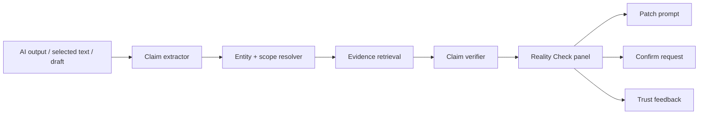

# 新能力：Memory Reality Check / 记忆事实核验器（搁置）

> 生成日期：2026-05-14  
> Codex 会话标题建议：新能力：记忆事实核验器（搁置）  
> Demo：[`memory-reality-check-demo.html`](./memory-reality-check-demo.html)

## 搁置原因

当前暂不建议把 Memory Reality Check 作为独立新能力推进。

核心原因是阶段优先级不匹配：现阶段 `docs/features/compose_assist.md` 已经覆盖“用户正在输入时”的低打扰记忆辅助，包括 RingCentral 回复、Jira comment、Web AI 输入框、可预览插入、证据过滤、置信度阈值、thumb-down 反馈和 sendable 校验。当前真正影响体验的是 Compose Assist 本身还不够准确，尤其是召回相关性、场景理解、可发送文本质量和错误提示收敛。因此，比起在用户输入错误或 AI 输出错误之后再做核验纠错，优先级更高的是把 `/composer/assist` 的输入阶段做准，让系统少给错建议、少插入无关上下文、少打扰用户。

换句话说，Reality Check 的“输出后审稿”方向只有在 Compose Assist 的输入质量稳定后才有价值。否则它会变成给不稳定建议再补一个纠错层，产品链路更长，用户负担更重，也会分散当前最该解决的准确率问题。

同时，本方案和多个已搁置或低优先级方向存在相同风险：

- `Memory Trust Console` 已标记为搁置，它解决的是记忆库自身的可信度、隐私、证据和修复控制台；Reality Check 中的冲突、过期、敏感判断如果扩大，很容易重复这个治理台。
- `Memory Rehearsal Studio` 已标记为搁置，其推荐优先级明确要求 Relationship Radar 和 Context Assist 先做稳；Reality Check 也依赖高质量场景入口和高质量召回，同样不应早于 Compose Assist 准确率提升。
- `Agent Memory Control Tower` 已标记为搁置，原因是偏离 Personal AI 作为记忆系统的主线、会变成调度其他 AI 的工作台；Reality Check 如果扩展到所有外部 AI 输出审稿，也会把产品重心拉向“AI 审稿/评测平台”，而不是当前的“记忆提示与输入辅助”。
- 现有 `Decision Center / confirm_requests` 已经承接“需要用户判断哪个事实正确”的场景。若 Reality Check 发现真正的记忆冲突，不应另建一个确认 inbox，而应该创建 confirm request 并回到决策中心处理。

因此本方案保留为未来参考，不作为近期实施项。可复用部分是：claim-level evidence diff、输出 patch prompt、Meeting Pilot 摘要 action item 核验等思路；这些应在 Compose Assist 准确率稳定、Memory Trust/Decision Center 边界更清楚后，再作为局部能力嵌入现有入口，而不是独立一级功能。

## 结论

本次没有从 Reminders 选题。本机 Reminders 的 `Personal AI` 清单当前没有未完成事项；清单里可见的 4 条历史项都已经 completed，且都是豆包同步问题或测试类反馈，不是全新的功能 idea，因此不需要标记 done。

本方案记录为搁置方向：**Memory Reality Check / 记忆事实核验器**。

它不是新的搜索页，也不是又一个跨 AI 上下文包。它做的是在 ChatGPT、Claude、豆包、Codex、RingClaw、Meeting Pilot、Jira comment、Google Sheet 总结等内容已经生成之后，Personal AI 把这段输出拆成可核验 claim，然后用用户自己的私有记忆逐条判断：

- 哪些有证据支持。
- 哪些和个人记忆冲突。
- 哪些遗漏了关键上下文。
- 哪些可能过期。
- 哪些包含敏感信息，不应直接交给外部 AI。
- 哪些是新信息，应该进入确认队列。

一句话：

> Personal AI 不只负责把记忆递给 AI，还负责在 AI 说完之后检查“这和我的真实记忆一致吗？”

这个能力的亮点是把 Personal AI 从“上下文提供者”升级成“私人事实校验层”。用户可以继续使用任意 AI 工具，但每个工具生成的结论都会经过自己的记忆证据网校验。

## 为什么要做

Personal AI 的目标是保存用户和 AI 的所有记忆，并在聊天、会议、浏览、操作、其他 AI 对话中提供记忆关联提示。现有 progressing 方向已经覆盖很多前置能力：

- `AI Context Passport`：把任务上下文打包交给其他 AI。
- `AI Session Context Drift Radar`：监控已交付给 AI session 的上下文漂移。
- `Memory Trust Console`：治理记忆质量、隐私和可信度。
- `Operation Memory Flight Recorder`：保存“怎么做成一件事”的操作 episode。
- `Personal Skill Foundry`：把重复有效做法沉淀成 skill。
- `Relationship Memory Radar`：按人维护关系和沟通上下文。

但真实使用里仍然有一个空位：**外部 AI 输出已经产生之后，用户怎么知道它是否真的符合自己的私有记忆？**

现在用户的工作流是多 AI、多工具、多来源的：

- 在 RingCentral / Glip / 会议里接收任务和决策。
- 在 Codex / Claude / ChatGPT / 豆包 / RingClaw / OpenClaw 里让 AI 起草、分析、写代码、写汇报。
- 在 Jira / Google Sheets / 浏览器里执行和验证。
- 再把结果回到聊天或会议里。

这类工作流最容易发生的问题不是“AI 完全没有上下文”，而是：

1. AI 拿到了一部分上下文，但遗漏了关键证据。
2. AI 复述了过期结论，用户当场没发现。
3. AI 引用了看似相关但其实错误的记忆片段。
4. AI 生成了自信但不符合用户真实口径的 Jira 字段、项目方向、owner、日期或承诺。
5. 用户让多个 AI 都跑了一遍，但没有一个统一的 private verifier 做二次审稿。
6. 如果直接把 AI 输出发到 RingCentral/Jira/邮件，错误会进入组织沟通链路。

真实记忆里已经出现强信号：

- 用户高频使用“凡事先让 AI 跑一遍”的工作方式。
- 用户关注 AI 工具、Codex、Claude Code、Cursor、Factory.ai、OpenClaw/RingClaw、成本和自动化。
- 远端记忆服务里有大量 RingCentral 消息、会议、实体和关系：`9302` messages、`4523` chunks、`13637` entities、`48882` relationships、`41` pending confirm requests。
- 用户曾提到“外部插件可以导出记忆到别的系统”很实用，说明记忆会流向外部工具。
- 已完成的 Reminders 里有豆包同步“空壳计数”“concerned items 错当近期重点”等问题，说明跨 AI 记忆流动一旦缺少校验，会给用户造成误导。

所以这个能力值得做：它不是增加一个新入口，而是在所有入口上加一层“私人证据审稿”。

## 核心产品承诺

> 在任何 AI 输出、会议摘要、消息草稿或 Jira 结论旁边，Personal AI 都能给出一张可追溯的 Reality Check：支持、冲突、遗漏、过期、敏感和可修复建议。

## 行业观察与可借鉴点

### 1. ChatGPT Memory Sources：记忆来源正在变成用户可见能力

[OpenAI Memory FAQ](https://help.openai.com/en/articles/8590148-memory-faq) 说明 ChatGPT Memory 支持 saved memories 和 reference chat history，并提供 Memory Sources，让用户看到哪些信息参与了个性化回答。FAQ 也强调 memory 更适合高层偏好和细节，不适合保存 exact templates 或大量原文；Memory Sources 可能不会显示所有影响因素。

借鉴点：

- Personal AI 也应该让用户看到“这条 AI 输出被哪些记忆支持/反驳”。
- 但 Personal AI 可以做得更进一步：不仅展示来源，还要检查外部 AI 输出和私人记忆之间的冲突。

### 2. OpenAI Graders / CriticGPT：AI 辅助审稿已经是可行产品模式

[OpenAI Graders](https://platform.openai.com/docs/guides/graders/) 把模型输出与 reference answer 比较，并返回 0 到 1 的分数，支持 string check、text similarity、score model grader 和 Python code execution。

[CriticGPT](https://openai.com/index/finding-gpt4s-mistakes-with-gpt-4/) 的实验显示，在自然出现的 ChatGPT 代码错误上，trainer 更偏好 CriticGPT 的 critique，说明“一个 AI 帮人类审另一个 AI 的输出”是成立的交互模式，但仍需要人类最终判断。

借鉴点：

- Memory Reality Check 不应自动替用户判死刑，而是给出可审阅 evidence、confidence 和 patch。
- 它可以像 grader 一样结构化输出 claim-level 分数。

### 3. Granola / remio / Glean：用户越来越要求答案可溯源

[Granola AI-enhanced notes](https://docs.granola.ai/help-center/taking-notes/ai-enhanced-notes) 提供放大镜入口，让用户看到增强笔记来自 transcript 或 raw notes 的位置。

[remio](https://www.remio.ai/ask-remio) 也强调用 personal context 生成答案，并提供 source citations 和 evidence cards。

借鉴点：

- 会议摘要、个人知识库和 AI answer 都在走向“带证据的输出”。
- Personal AI 的差异点是证据不是公开网页或某个笔记库，而是用户自己的跨平台记忆：消息、会议、网页、AI 对话、操作、skill、偏好。

### 4. Supermemory / Mem0：跨 AI 共享记忆正在成为基础设施

[Supermemory MCP](https://supermemory.ai/mcp/) 的定位是“One memory. Every AI tool.”，通过 MCP 连接 ChatGPT、Codex、Claude Code、Cursor、VS Code、Gemini CLI、Windsurf 等工具。

[Mem0 MCP](https://docs.mem0.ai/platform/mem0-mcp) 也把 add/search/update/delete memory 暴露给 MCP-compatible clients，包括 Claude、Claude Code、Codex、Cursor、Windsurf、VS Code、OpenCode。

借鉴点：

- 跨工具记忆层正在变成常态。
- 当记忆能被更多 AI 读取时，校验外部 AI 输出是否符合记忆就更重要。

### 5. Anthropic / Chroma：上下文不是越多越好，必须策展和校验

[Anthropic 的 context engineering 文章](https://www.anthropic.com/engineering/effective-context-engineering-for-ai-agents) 把 context engineering 定义为从不断变化的信息宇宙里策展进入有限上下文窗口的内容，并强调 context 是有限资源。

[Chroma Context Rot](https://www.trychroma.com/research/context-rot) 的实验显示，即使相关信息在上下文中，干扰项和长上下文也会让模型表现退化。

借鉴点：

- Reality Check 不应该把所有记忆塞给 AI。
- 它应该把外部 AI 的输出拆成 claim，再用最小证据窗口逐条核验，减少 distractor。

### 6. 论文：claim-level factuality 是可靠路径

- [FActScore](https://arxiv.org/abs/2305.14251)：把长文本拆成 atomic facts，再计算有可靠知识源支持的比例。
- [SAFE / Long-form factuality](https://arxiv.org/abs/2403.18802)：用 LLM 把长回答拆成 facts，再通过搜索和推理判断是否被支持。
- [RAGChecker](https://arxiv.org/abs/2408.08067)：对 RAG 的 retrieval 和 generation 模块做 fine-grained 诊断。
- [A-MEM](https://arxiv.org/abs/2502.12110)：让记忆具有 contextual descriptions、keywords、tags 和动态链接，适合为 claim 找相关证据。

借鉴点：

- 核验单位应是 claim，而不是整段回答。
- 需要同时诊断检索问题和生成问题：是没找到证据，还是找到了但 AI 写错了？
- 私人记忆系统适合把 evidence graph 做成 claim-level proof graph。

## 产品定位

### 功能名

推荐：**Memory Reality Check / 记忆事实核验器**

备选：

- Personal AI Verifier / 私人 AI 审稿器
- Memory Proofreader / 记忆校对器
- Private Evidence Checker / 私人证据核验
- AI Output Inspector / AI 输出巡检

推荐“记忆事实核验器”，因为它强调三件事：

- 依据是 Personal AI 的记忆，不是公共搜索。
- 对象是 AI 输出中的事实、承诺、口径和上下文。
- 结果是核验和修复建议，不是重新生成一篇回答。

### 不做什么

- 不替代 ChatGPT / Claude / 豆包 / Codex。
- 不自动发送纠错消息给外部 AI。
- 不把用户全部记忆发送给外部模型。
- 不把 “unsupported” 等同于 “false”；没有证据不代表一定错误。
- 不一开始就覆盖所有网页内容；先做 AI 输出、会议摘要、消息草稿、Jira comment 这四类高价值文本。

### 做什么

- 识别当前页面或选中文本里的 AI 输出。
- 抽取 atomic claims。
- 为每条 claim 召回 Personal AI 证据。
- 判断 supported / contradicted / stale / missing context / unsupported / sensitive。
- 展示可点开的证据和原始来源。
- 生成给当前 AI 的纠错 patch prompt。
- 把新事实送入 confirm requests，而不是直接长期记住。

## 核心体验

### 入口 1：AI 输出旁的 Reality Check Chip

当用户在 ChatGPT、Claude、豆包、RingClaw、Codex Web 或其他 AI 页面看到一段回答时，Personal AI 在回答旁显示一个低打扰 chip：

- `Reality check`
- `3 risks`
- `8 supported`
- `2 missing context`

点击后打开右侧 panel。默认不自动修改当前页面。

### 入口 2：选中文本后右键核验

用户在任意网页、Jira、Google Docs、邮件、RingCentral message 中选中一段文本，右键：

`Check against Personal AI memory`

适合核验别人发来的总结、AI 生成的 draft、会议纪要或产品方向陈述。

### 入口 3：发送前草稿核验

Composer Guard / Context Assist 已经可以服务输入框。Reality Check 可以在发送前补一层：

- 这条消息是否和已确认记忆冲突？
- 是否遗漏了上次会议承诺？
- 是否把未确认推测说成事实？
- 是否包含不该发给这个群/外部 AI 的敏感上下文？

按钮：

- `Send as is`
- `Apply safer wording`
- `Remove unsupported claims`
- `Add evidence link`

### 入口 4：Meeting Pilot 摘要核验

会议结束后，Meeting Pilot 生成摘要和 action items。Reality Check 逐条检查：

- action owner 是否有证据。
- 日期是否来自 transcript 还是模型推断。
- 是否把“需要确认”写成“已决定”。
- 是否漏掉关键 blocker。

这比单纯“重新总结会议”更有价值，因为它能避免错误 action item 流入后续任务系统。

## UI 信息架构

### Panel 顶部：整体结论

显示：

- `Reality score`：0-100，不是事实真理，只是本次输出和 Personal AI 证据的一致性评分。
- `Supported` / `Contradicted` / `Missing context` / `Stale` / `Sensitive` 数量。
- 数据窗口：例如 `Last 90 days + confirmed profile + active skills`。
- 模式：`Local only` / `External verifier allowed`。

### Claim Ledger

每条 claim 是一行：

- 原文 claim。
- 状态 badge。
- 置信度。
- 最强证据。
- 证据时间。
- 操作：`View evidence`、`Generate patch`、`Mark as okay`、`Create confirm request`。

状态建议：

```ts
type RealityCheckStatus =
  | 'supported'
  | 'contradicted'
  | 'stale'
  | 'missing_context'
  | 'unsupported'
  | 'sensitive'
  | 'needs_user_confirmation';
```

### Evidence Diff

对高风险 claim 展示三列：

| AI said | Personal AI remembers | Suggested patch |
|---|---|---|
| Nova should build a WhatsApp-only backend | Recent memory says Gary pushed reuse/evolve SMS backend into multi-channel infra | Say “align with SMS backend first; avoid WhatsApp-only design unless SMS constraints block it” |

这类 diff 是用户最容易立刻采取行动的形态。

### Patch Prompt

用户点击 `Generate patch` 后，系统生成一段可复制给当前 AI 的纠错 prompt：

```text
Please revise the answer using these private memory corrections:

1. Do not say Nova should build a WhatsApp-only backend.
   Personal AI evidence says Gary's direction was to evolve SMS backend into multi-channel infra.

2. Use Jira Story Points field customfield_10422, not customfield_10016.

Keep the original structure, but mark uncertain items as "needs confirmation".
```

默认只复制，不自动发送。

### Memory Learning Queue

当外部 AI 输出中出现 Personal AI 没有的新事实，但来源看起来可信时，不直接写入长期记忆，而是创建 confirm request：

- `AI output claims NOVA-10893 Story Points = 34`
- 来源：当前 AI / Jira page / user selected text。
- 建议动作：`Confirm` / `Need source` / `Reject` / `Remember as temporary`。

这能把外部 AI 输出变成记忆候选，同时避免污染记忆库。

## 关键场景

### 场景 A：AI 帮用户总结 Gary 的 Nova/WhatsApp 方向

1. 用户把 RingCentral 消息丢给 ChatGPT，让它总结行动项。
2. ChatGPT 写出：“Nova should design an independent WhatsApp-only backend.”
3. Reality Check 抽取 claim，召回用户记忆中 Gary 对方向的说明。
4. Panel 标红：`Contradicted by recent memory`。
5. Suggested patch：改为“优先复用和演进 SMS backend 为 multi-channel infra”。
6. 用户复制 patch 给 ChatGPT 重新生成英文回复。

用户收益：避免把战略方向写反。

### 场景 B：Codex 生成 Jira 统计脚本时字段用错

1. Codex 生成一个 Jira extraction plan。
2. 输出里写 Story Points 字段为 `customfield_10016`。
3. Reality Check 召回近期记忆：用户实际回读确认过 `customfield_10422 = 34.0`。
4. Panel 显示 `Contradicted`，并给 Codex patch。

用户收益：避免脚本跑错字段，减少返工。

### 场景 C：豆包/ChatGPT 总结 Personal AI 状态时引用了空壳 digest

1. 豆包说：“Weekly Dream Digest 有 5 个梦境，但没有细节。”
2. Reality Check 发现历史里已有 completed fix：空壳计数不应作为有意义记忆推送。
3. Panel 显示 `Stale output pattern`。
4. Suggested patch：要求 AI 只在有摘要详情时引用 dream digest。

用户收益：防止旧问题再次以“看似正常摘要”的形式出现。

### 场景 D：会议摘要把未确认事项写成决议

1. Meeting Pilot 生成 action item：“正式环境 connection test 已完成。”
2. Reality Check 发现 transcript 只说“需要在正式环境中运行并记录结果”。
3. 状态：`Missing context / overstated certainty`。
4. Patch：改成 “Action: run connection test and record result”。

用户收益：减少会议纪要里的幻觉决议。

## 和已有能力的关系

| 能力 | 主对象 | Reality Check 的关系 |
|---|---|---|
| Context Assist | AI 生成前的上下文注入 | Reality Check 是 AI 生成后的输出核验 |
| AI Context Passport | 跨 AI 任务上下文包 | Passport 可附带 Reality Check 结果；Reality Check 可检查 passport 被 AI 使用后的输出 |
| AI Session Context Drift Radar | active AI session 的上下文漂移 | Drift Radar 发现“AI session 已过期”；Reality Check 发现“这段输出和记忆不一致” |
| Memory Trust Console | 记忆库自身的质量、隐私、证据治理 | Reality Check 消费 trust score，并把反复冲突的 claim 反馈给 Trust Console |
| Operation Flight Recorder | 操作 episode 捕获 | Reality Check 可核验 episode 生成的总结或再执行计划 |
| Personal Skill Foundry | 技能沉淀 | Reality Check 可沉淀为“AI 输出审稿 skill” |

## 技术设计

### 高层流程



### Claim extraction

输入是一段 AI 输出，输出 claim list。

需要分四类：

```ts
type ClaimKind =
  | 'fact'
  | 'decision'
  | 'action_item'
  | 'preference'
  | 'commitment'
  | 'date_or_number'
  | 'field_or_identifier'
  | 'relationship_or_owner'
  | 'sensitive_disclosure';
```

MVP 可以先用 LLM claimizer + deterministic post-processing：

- 数字、日期、Jira key、customfield、person、project、URL 用规则抽取。
- “should / must / decided / action / owner / by date / is / was” 句式进入 claimizer。
- 低价值修辞句不核验。

### Evidence retrieval

每条 claim 构造 query：

- claim text。
- resolved entities。
- current page context。
- source app。
- time window。
- previous AI session id，如果有。

调用现有能力：

- `POST /api/v1/recall`
- `POST /api/v1/context-recall`
- relationships / entities
- confirm requests
- personal skills
- future Trust Console score，如果已实现

检索策略：

1. 先查 exact identifiers：Jira key、customfield、person、project、URL。
2. 再查 recent high-salience chunks。
3. 再查 graph neighbors：person/project/task/document。
4. 最后查 time channel，找最新版本。

### Verification

每条 claim 输出：

```ts
interface RealityClaimVerdict {
  claimId: string;
  status: RealityCheckStatus;
  confidence: number;
  reason: string;
  evidenceRefs: RealityEvidenceRef[];
  missingEvidenceHint?: string;
  suggestedPatch?: string;
  privacyRisk?: {
    level: 'low' | 'medium' | 'high';
    reason: string;
    saferRewrite?: string;
  };
}
```

判定原则：

- `supported`：有至少一条强 evidence，时间和实体匹配。
- `contradicted`：有更新或更高可信 evidence 明确反向。
- `stale`：claim 曾经成立，但有更新证据显示应降权。
- `missing_context`：claim 部分成立，但遗漏关键条件、owner、source、uncertainty。
- `unsupported`：Personal AI 没找到证据，但不判 false。
- `sensitive`：内容可能不应发给当前目标。
- `needs_user_confirmation`：可能是新事实，应该进入确认队列。

### Suggested patch generation

Patch 不是重新回答，而是面向当前 AI 的最小纠错包：

- 保留用户原任务。
- 列出需要修改的 claim。
- 每条只给必要证据摘要，不塞全部原文。
- 标记哪些是 confirmed，哪些是 inferred。
- 默认不含敏感原文。

### 数据模型草案

```sql
CREATE TABLE memory_reality_checks (
  id TEXT PRIMARY KEY,
  user_id TEXT NOT NULL,
  source_surface TEXT NOT NULL,
  source_url TEXT,
  source_title TEXT,
  source_app TEXT,
  input_hash TEXT NOT NULL,
  input_preview TEXT NOT NULL,
  overall_score REAL NOT NULL,
  status_summary_json TEXT NOT NULL,
  mode TEXT NOT NULL,
  created_at INTEGER NOT NULL
);

CREATE TABLE memory_reality_claims (
  id TEXT PRIMARY KEY,
  check_id TEXT NOT NULL,
  user_id TEXT NOT NULL,
  claim_text TEXT NOT NULL,
  normalized_claim TEXT NOT NULL,
  claim_kind TEXT NOT NULL,
  status TEXT NOT NULL,
  confidence REAL NOT NULL,
  reason TEXT NOT NULL,
  suggested_patch TEXT,
  privacy_risk_json TEXT,
  created_at INTEGER NOT NULL,
  FOREIGN KEY (check_id) REFERENCES memory_reality_checks(id)
);

CREATE TABLE memory_reality_evidence_links (
  id TEXT PRIMARY KEY,
  claim_id TEXT NOT NULL,
  target_type TEXT NOT NULL,
  target_id TEXT NOT NULL,
  source TEXT,
  source_title TEXT,
  source_url TEXT,
  explore_link TEXT,
  timestamp INTEGER,
  support_relation TEXT NOT NULL,
  score REAL NOT NULL,
  snippet TEXT NOT NULL,
  created_at INTEGER NOT NULL,
  FOREIGN KEY (claim_id) REFERENCES memory_reality_claims(id)
);

CREATE TABLE memory_reality_feedback (
  id TEXT PRIMARY KEY,
  claim_id TEXT NOT NULL,
  user_id TEXT NOT NULL,
  action TEXT NOT NULL,
  detail TEXT,
  created_at INTEGER NOT NULL,
  FOREIGN KEY (claim_id) REFERENCES memory_reality_claims(id)
);
```

### API 草案

```http
POST /api/v1/reality-check/check
GET  /api/v1/reality-check/:checkId
POST /api/v1/reality-check/:checkId/patch
POST /api/v1/reality-check/claims/:claimId/feedback
POST /api/v1/reality-check/claims/:claimId/confirm-request
POST /api/v1/reality-check/:checkId/export
```

`POST /check` 示例：

```json
{
  "surface": "ai_chat",
  "sourceApp": "chatgpt",
  "sourceUrl": "https://chatgpt.com/c/...",
  "text": "Nova should build an independent WhatsApp-only backend...",
  "contextHints": [
    { "kind": "project", "value": "Nova" },
    { "kind": "topic", "value": "WhatsApp integration" }
  ],
  "mode": "local_first",
  "maxClaims": 12
}
```

返回：

```json
{
  "checkId": "rc_01HX...",
  "overallScore": 72,
  "summary": {
    "supported": 7,
    "contradicted": 1,
    "missingContext": 2,
    "sensitive": 0
  },
  "claims": [
    {
      "claimId": "cl_01HX...",
      "text": "Nova should build an independent WhatsApp-only backend.",
      "status": "contradicted",
      "confidence": 0.86,
      "reason": "Recent memory says Gary's direction was to evolve SMS backend into multi-channel infra.",
      "evidence": [
        {
          "title": "Gary direction summary",
          "exploreLink": "#/timeline?type=chunk&focus=65352",
          "supportRelation": "contradicts"
        }
      ],
      "suggestedPatch": "Change to: Nova should align with SMS backend and evolve it into a multi-channel infrastructure."
    }
  ]
}
```

## 隐私与安全

1. **默认 local-first**
   - Claim extraction 可优先本地小模型或本地 deterministic parser。
   - 证据召回在 Personal AI memory-service 内完成。

2. **外部 verifier 需要显式模式**
   - 如果使用外部 LLM 做复杂 claim reasoning，只发送 claim + redacted evidence snippets。
   - UI 标记 `External verifier allowed`。

3. **不自动发 patch**
   - 用户点击复制或注入前可预览。
   - 注入也只是填入输入框，不自动发送。

4. **敏感信息脱敏**
   - 人名、邮箱、内部 Jira、会议链接、客户信息默认进入 privacy scan。
   - 生成 patch 时可替换为 `[internal Jira key]` 或 `[person]`。

5. **unsupported 不等于 false**
   - UI 文案必须明确：Personal AI 未找到证据，不代表内容一定错误。

6. **可反馈**
   - 用户可以把误报标记为 okay，把漏报标记为 missed。
   - 反馈进入 verifier calibration。

## MVP 范围

### P0：手动选中文本核验

- Chrome extension 选中文本右键 `Check against Personal AI memory`。
- 支持 3 类 claim：date/number、Jira key/customfield、decision/action item。
- 使用 `/recall` + entity hints。
- 右侧 panel 展示 claim ledger。
- 支持复制 patch prompt。
- 不做自动 DOM 监听。

### P1：AI 输出旁自动 chip

- 支持 ChatGPT、Claude、豆包、RingClaw/Codex Web 的最后一条 assistant output。
- 对高置信风险显示 chip。
- 支持 `Check this answer`。
- 支持 claim feedback。

### P2：发送前草稿核验

- 集成 RingCentral message composer、Jira comment、Google Docs/Sheets note。
- 支持敏感 disclosure 检测。
- 支持 safer wording。

### P3：Meeting Pilot 摘要核验

- 对 summary、decision、action item 做核验。
- 标记“transcript supported / inferred / contradicted”。
- 用户可一键创建 corrected meeting summary。

### P4：Reality Check MCP

暴露 MCP tools：

- `check_text_against_memory`
- `check_ai_answer`
- `get_reality_check`
- `generate_memory_patch`
- `create_confirm_request_from_claim`

让 Codex / Claude Code / OpenClaw 在任务完成前主动请求 Personal AI 审稿。

## 评估指标

### 用户价值指标

- 用户点击 Reality Check 后复制 patch 的比例。
- patch 后 AI 输出被用户接受的比例。
- 发送前发现并修正的高风险 claim 数。
- 会议 action item 被纠正数量。
- 用户对 claim verdict 的正反馈率。

### 质量指标

- Claim extraction precision。
- Contradiction detection precision。
- Unsupported false alarm rate。
- Evidence click-through rate。
- patch token length。
- check latency。

### 验收样例

1. 输入含错误 Jira field：必须召回正确 `customfield_10422` 相关记忆并标记 contradicted。
2. 输入含“已决定”但记忆只有“需要确认”：必须标记 missing_context。
3. 输入公开常识但个人记忆无关：不应强行 unsupported 干扰用户。
4. 输入敏感内部会议结论并目标是外部 AI：必须标记 sensitive。
5. 输入全是语气建议：claim extractor 应少抽取，避免噪音。

## 风险与应对

| 风险 | 表现 | 应对 |
|---|---|---|
| 误报太多 | 用户觉得 panel 打扰 | 只对高置信风险主动显示；低置信进入手动模式 |
| 检索噪音 | 找到类似但不相关记忆 | claim-level retrieval + entity/time/source filters |
| 延迟高 | AI 输出后等太久 | 先抽高价值 claim；后台增量核验 |
| 隐私风险 | patch 包含内部原文 | 默认 redacted patch；复制前预览 |
| 用户过度信任 score | 把 score 当绝对真理 | 文案强调 evidence consistency，不是事实裁判 |
| 和 Trust Console 重叠 | 都谈 trust | Trust Console 治理记忆库；Reality Check 核验外部输出 |

## 设计原则

1. **先指出最危险的 1-3 个问题**
   - 不要把每句话都审成红黄绿。

2. **证据比结论重要**
   - 用户应能点开 memory explore link。

3. **patch 比批评有用**
   - 每个 high-risk verdict 都要给可行动修复。

4. **人类最终确认**
   - AI verifier 只是审稿助手。

5. **不要扩大上下文污染**
   - 检查 AI 输出时不要把更多未经核验的内容直接写入长期记忆。

## 为什么这个功能有惊艳感

用户体验上，它把 Personal AI 放在一个很独特的位置：

- 不是又打开一个聊天机器人。
- 不是让用户迁移到 Personal AI 的 UI。
- 而是用户继续用自己喜欢的 AI 工具，Personal AI 像私人审稿员一样站在旁边。

每次 AI 说“根据你的情况应该...”时，Personal AI 能立刻回答：

> 这句话有 2 条私人记忆支持；但第 3 条和你昨天的会议结论冲突。要不要把纠正 patch 发回去？

这比“搜索记忆”更贴近日常使用，因为用户真正需要的不是又看一遍历史，而是避免把错误历史带到下一步行动里。

## 开放问题

1. P0 是否只做手动选中文本，还是直接做 ChatGPT/豆包 output chip？
2. Claim extraction 是否允许调用外部 LLM，还是必须本地/内网模型？
3. 敏感信息分类沿用 Trust Console，还是在 Reality Check 内先做轻量规则？
4. Reality score 是否应该对用户展示数字，还是只展示风险数量？
5. Meeting Pilot 摘要核验是否应作为独立子项目推进？

## 建议决策

建议先做 P0 + P1 的设计验证：

- P0 手动选中文本核验，最快证明“私人记忆审稿”是否有用。
- P1 支持 ChatGPT/豆包/Codex output chip，最贴近用户日常多 AI 工作流。
- 先不做自动发送、不做外部 verifier、不做完整 Trust Console 依赖。

如果 demo 体验成立，再把它接入 Context Assist、Meeting Pilot 和 MCP。
