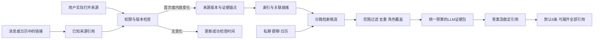

# 记忆来源刷新与分层证据召回计划

> 状态：方案，尚未实现 · 2026-09-23 · Personal AI / E-30
> 代码核查基线：`d3d6592`；现场证据沿用 2026-09-21 核查，09-23 仅做窄范围只读复核。
> 交互草图：`docs/progressing/memory-source-refresh-recall-demo.html`。数字和更新状态均为示意，不代表功能已上线。
> 本轮范围：回答用户追问并形成可实施计划；不改生产代码、不部署、不重跑真实 Ask 或写入真实记忆。

## 1. 对三个追问的明确回答

### 私聊已经入库，为什么答案没找到

**是“已有数据，却没有被那次答案有效利用”。** 09-20 21:59:56 的私聊“明天要demo Edit notes么，后天 weekly”于22:21:31写入；原 Ask 答案快照为09-21 13:58:54。09-23再次只读核对，原始消息 `c760d159-d730-44f3-ae85-ef3ba0a4b99d`、chunk `331815` 和对应 provisional open_question 都仍在。

前次按原句对09-21存量复算，这条私聊在 raw 词法候选中排第641，超出该路径初选最多120条；限定“当时已入库”后的近似名次仍为635。它只写了 Edit notes/demo，没有 RCV Mobile 群名，容易输给群名同时命中 rcv/mobile 的无关消息。**这是前置候选竞争的证据，不是完整历史 Ask 回放；不能断言它从未进入任何其他通道。** 当次完整候选、过滤和 prompt trace 未保存，因此具体丢在哪一步不能完全还原。

前文“三类场景”将RC私聊与群聊合在一类，没有把这条私聊的召回验收单列清楚。本计划明确拆列**私聊、群聊、日历、文稿**；其中本人发言与他人消息的摄入路径也分别验证，避免用“群消息有覆盖”代替私聊语义召回的验收。

### 记住链接后，每次打开会自动更新正文吗

**目前没有这条通用保证，需要增加。** 链接出现在消息或日历里，不代表已经保存对应文档正文；已有 capsule 也没有统一的“按来源身份检查最新版本并更新索引”链路。再次打开可能重新触发普通网页捕捉，但仍受停留、滚动、字数、视觉类型和去重门槛影响。

采用用户要求：**已知、已授权来源每次实际打开/重访都触发新鲜度检查；只有内容变化才生成新版本、更新索引和必要蒸馏。** 如果此前只有链接，首次实际打开时自动补正文。无需每次重新满足“值得首次保存”的长时间阅读门槛，也不新增逐条审批队列。

“检查”与“重新处理”分开：有可靠版本号时先查版本；没有时必须读取当前可见正文或做一次授权请求才能比较 hash，不能承诺不读内容就知道是否变化。页面只是短时间反复发出同一导航事件可合并，但不能沿用旧分析缓存冒充刚检查过源版本。

### 5条究竟限制什么，是否用LLM整理

**5条主要是 Desktop 本地续聊快照保留的 evidence refs，不是主召回或LLM输入只允许5条。Ask确实使用LLM生成答案。** 当前普通主召回 public topK是10，带过滤/profile时15；Desktop默认展示8条，其余可展开。本地resume只保留前5条轻量引用、短答案和24小时TTL。

真正需要改的是：候选较早被裁成10/15条，送入LLM时又按较小预算压缩；候选数、输入信息量、答案引用和UI折叠没有形成独立、可验证的契约。接受用户方向：**扩大有效候选和LLM可见证据，默认只展示最能支撑答案的5条；所有实际引用仍可展开追溯。** 不把“5”简单改大，也不把更多无关全文直接塞给模型。

## 2. 两个验收场景

### 场景A：没有写“RCV Mobile”的私聊和日历，也能串出demo

1. 用户在Sandy私聊中询问Edit notes demo；第二天日历有`pre demo of eidt notes`，15:30–16:00；旧15:00安排已取消。
2. 用户只问“rcv mobile有什么 demo 么？”，无需知道存储术语、群ID或正确拼写。
3. 系统同时找项目相关材料和demo事件线索，保留私聊的讨论证据、有效日历、来源文稿。通过议题、会话上下文、负责人和文稿页建立关联，而不是只凭同一天或同一个人猜测。
4. LLM得到角色、时间、状态和来源清楚的证据包，回答：“近期线索是Edit notes in AI notes，Sandy负责；9月21日15:30安排了pre-demo。是否完成以及这次是否有录屏，当前证据未确认。”
5. 默认显示5条以内的主要来源；正文引用第6条时，点击直接展开并定位。9月1日Mobile AVA delegate的历史录屏可另列，不能与本次Edit notes混为一条。

这是修复后的目标行为。回放13:58时点时，不能喂入15:30才发送的“pre demo啦”，也不能把当天16:48读取到的Slides版本伪装成13:58已知内容。

### 场景B：再次打开已知Slides，自动更新记忆

1. 消息或会议描述里已经出现某个Slides链接，系统记录其来源引用；这时状态是“仅有链接”，不会声称已读正文。
2. 用户在正常已授权浏览环境打开该文稿。系统识别同一个presentation，读取最新版本及原生文字/表格；不是等滚动90%或停留数分钟才决定是否首次保存。
3. 首次补齐正文；以后每次实际重访检查版本。内容相同只记录成功检查时间，尾部新增demo条目则生成新版本并更新索引。
4. 资料卡分别显示“最近检查”和“当前记忆内容时间”。正在更新时仍可查看旧版，明确旧版日期；失败时保留旧版并显示未完成刷新。
5. 新版本就绪后Ask默认使用新版；问“上周文稿怎么写的”时可追溯旧版。撤销保存、站点屏蔽或权限撤回优先，重访不能自动复活被撤销的资料。

## 3. 当前实现：数量和预算分层

以下为09-23代码默认值，不表示已恢复09-21请求当时的所有运行配置。

| 层 | 当前行为 | 本计划如何调整 |
|---|---|---|
| 初始检索 | 普通Ask topK10 → deep内部15 →各子检索limit45；过滤/profile为15→23→69。vector有message/chunk两路，FTS另补raw；45/69不是总候选数 | 将检索候选预算独立出来，并按意图、来源角色扩取 |
| raw兜底 | 先按词命中数与时间取最多120；群名参与计词，再裁剪 | 主题匹配与事件匹配分路；群名作为主题线索，不替代demo语义 |
| public证据 | ActiveRecall裁回10/15；Ask合并anchor后再次裁回，再做attribution/cohesion | Ask专用证据池与其他Recall消费者的public topK解耦，先保留关键角色再压缩 |
| 主召回prompt区 | 默认`fullCount=4`，前4条正文≤500字符，其余≤160字符；预算不足降为标题或省略 | 提取命中段落而非一律截前缀；按统一token预算分配详略 |
| 当前输入预算 | 主区名义1200tokens，以4字符/token估算；untrusted另分600。meeting outcomes、外部证据、历史摘要等另加 | 统一统计所有证据来源的输入预算，并保留信任边界；1200从来不是整个prompt上限 |
| LLM整理 | 非流式调用generate；流式正文generateStream，之后另一次结构化整理。/ask已关闭ActiveRecall重复分析 | 延续已有生成链，默认不再增加一个独立LLM整理步骤；保留实际引用ID |
| API响应 | includeEvidence时返回过滤后的recalledItems；Desktop请求true | 区分LLM实际证据包、实际引用、主要展示来源，不能把所有返回项称为已被模型使用 |
| Desktop展示 | 前8条，其余展开 | 默认最多5条主要来源；可展开全部实际引用与相关补充资料 |
| resume | 前5条轻量refs、答案≤720字符，24小时TTL | 可保持轻量；增加requestId/traceId与稳定引用，不承担完整诊断职责 |
| 诊断/学习 | 另有一些first5采样或fallback；onlineReflection当前也取recalledItems前5 | 改为经校验的实际引用/使用记录，不能拿first5充当模型使用证据 |

主要依据：`memory-service/src/routes/ask.ts:1574`、`:1645`、`:776`、`:862`、`:3605`、`:3932`、`:4005`；`memory-service/src/config.ts:536`；`desktop-app/app/quick-ask.js:1740`、`:1857`；`desktop-app/app/quick-ask-resume.js:8`、`:101`。

## 4. 本案各来源的修复目标

| 来源 | 已知事实 | 缺口和对应工作 |
|---|---|---|
| Sandy私聊 | 原文及chunk已入库；前轮raw名次641，09-23仍可按ID读到 | 主题表达缺失、问句语义和候选竞争；P0保留话题线索并扩展同串上下文 |
| RCV Mobile VT3群 | 09-21 15:30:49消息16:22:37入库，延迟51分48秒 | P2改同步水位和离线补偿；该晚到消息不作为13:58历史正例 |
| Calendar | 当日08:56已入库，标题错拼；当时检查无向量、项目标签不完整 | P0独立事件候选，P2统一索引、时间与取消语义 |
| Slides | 09-21当前正文有Mobile Edit notes demo；只有URL引用，09-23对应capsule仍0 | P1重访补正文、原生读取、同来源版本更新 |

因此第一阶段不能只做“增加LLM证据数”：不存在的文稿正文需要采集，没进入候选的私聊需要召回，旧会议信息需要状态校验。三者分别验收。

## 5. 推荐架构和接口契约

保持现有SQLite、Source Memory、RecallEngine和Ask，新增或复用下面的逻辑契约；物理表设计在实施时以现有migrations为准，不把概念字段机械变成多套重复表。

| 逻辑对象 | 关键字段/约束 |
|---|---|
| KnownSource | `sourceId / owner / accountScope / scope / provider / canonicalKey / discoveredFromRefs / captureScope / state`；链接引用与正文版本分开 |
| SourceVersion | `versionId / providerVersion / contentHash / extractionVersion / sourceModifiedAt / observedAt / completeness / supersedesVersionId`；版本不可覆写原证据 |
| RefreshReceipt | `attemptId / sourceId / navigationId / lastAttemptAt / lastCheckedAt / result / retryAfter / errorClass`；成功检查不等于正文发生变化 |
| IndexReceipt | `versionId / indexedAt / ftsReady / vectorReady / linksReady / currentEligible`；禁止新正文配旧索引却报告完成 |
| EvidenceItem | `evidenceId / sourceId / versionId / locator / excerpt / eventTime / ingestedAt / role / trustClass / scope / relationBasis` |
| AskEvidencePlan | `candidateBudget / evidenceTokenBudget / maxPromptItems / displayLimit / reservedRoles / excludedReasons`；各预算独立 |
| AskEvidenceReceipt | `requestId / actualQuery / candidateIds / retainedIds / promptIncludedIds / tiers / omittedReasons / citedIds / primaryDisplayIds / coverage`；不含凭证 |

`role`至少区分discussion/question、scheduled、completed、artifact和cancelled/conflicting。问句可作为检索线索，或作为“用户曾讨论X”的对话事实，不能绕过现有claim规则变成“X已发生”。

## 6. P0：更宽检索、足量证据、紧凑展示

### 6.1 先让真正的证据进入候选

- 修中英文粘连分词，如`mobile有什么`；原句保留，另解析subject与demo/预演/录屏意图。项目别名、产品关系必须有来源依据，不能把AI Delegate一律等同于或排除于Mobile。
- 采用有预算的多路本地查询：主题匹配、demo讨论/日历事件、资料/录屏、已命中线索的一跳关联。近30天作为“近期”软优先窗口，保留较早明确演示材料；用户显式时间和scope仍为硬约束。
- 事件路可只用demo/预演和时间检索，允许结果暂未标项目；后续再用议题、线程、关联文件、ticket验证。仅参会人或日期重合不足以确认关联。
- 对Sandy原句保留`question`身份，读取其后同串确认时间的消息与日历；不能因为它不是已完成事实，就丢掉用于发现议题的线索。
- 各路有独立配额，合并后按来源版本去重、校验状态、scope和信任。防止大量同群闲聊占满候选，防止多个转述被计成独立证据。

### 6.2 LLM输入预算独立于UI

建议实验起点，均需eval定案，不声称是最佳生产值：

| 参数 | 实验起点 | 目的 |
|---|---|---|
| 合并候选上限 | 200条；主题/事件/材料/关联可分配60/40/40/60，空路份额可回收 | 扩大搜索面，但必须有独立事件路；单纯把raw120改200仍找不到本案641名的私聊 |
| prompt条目上限 | 24个相关短摘录；对照12/20/30 | 比当前public10/15更宽，不强行凑数 |
| 证据token预算 | 默认实验3000，深查硬上限6000；对照现有分配策略并记录真实总tokens | 保留更多原句、时间、关系与反证；总prompt仍受模型剩余上下文限制 |
| 主要来源展示 | 最多5条 | 保持答案易读，与prompt数量解耦 |

预算计算涵盖**全部**主召回、日历/meeting outcomes、外部来源、相关历史摘要，不再每路各加一段无限累积。优先用当前模型tokenizer；拿不到时保守估算并记录估算方式，不能把中文固定视为4字符/token。必须预留system/context/history、输出及安全余量。

证据压缩优先保留命中段落、前后必要上下文、作者、事件时间、取消/否定状态、来源版本。避免只截正文开头500字符而把后面的demo句剪掉。先合并重复摘录；支持与反证、讨论与确定安排各保留必要份额。

现有claim attribution、cohesion、scope和不可信来源隔离继续有效；扩容不是绕过这些规则。语义重排是否需要新增模型调用由对照实验决定，默认先用可解释筛选与现有LLM链。

### 6.3 LLM整理后选择主要来源

- 生成前为所有证据分配统一稳定ID及展示编号，覆盖内部和外部来源。当前外部证据有另起`[1]`的路径，需一并消除编号歧义。
- LLM按证据回答，并建议`citedIds`与`primaryDisplayIds`；服务端以实际发布的`finalAnswer`正文引用为收据依据，校验与正文集合一致、属于实际prompt包、版本正确且能解析。模型不能自行编造新ID，也不能用整理阶段新增的引用冒充正文已使用来源。
- 默认显示最多5条“支持答案主要主张”的来源，优先实际引用、时间/版本有效和不同证据角色；不足5条无需补齐。取消或冲突证据即使不是前5，也不能在答案中被隐藏掉其影响。
- 正文引用第6条仍必须可点击，自动展开该来源；展示排序不重编号。API保留全部可追溯引用与必要补充信息，UI折叠不成为事实删除。
- “被放进prompt”“模型引用”“用户看到”分别记录，不能互相冒充。OnlineReflection等学习事件使用校验后的实际引用，停止first5代替使用记录。
- 流式和非流式共用证据契约；优先复用流式现有结构化整理步骤，避免为筛5条再增加一次付费LLM调用。当前流式正文来自`generateStream`，后续整理不替换已发布正文；整理超时、结果无效或引用不一致时，确定性解析实际正文引用并选择主要来源，不能丢失已发布答案的出处。若发现正文引用本身无效，明确标记并修正该引用，不伪造映射。

### 6.4 诊断与缺失表述

保留短期最小trace，能追到`未采集 / 未索引 / 未进候选 / 被过滤 / 未入prompt / 被引用但误解`。默认以ID、版本、排名、理由和预算为主；prompt摘录只在限定调试模式保存，脱敏、限定访问和保留期。

resume继续轻量，可保留5个引用，但存稳定短ID和requestId，不裁断长calendar ID破坏定位。无trace时不得从resume前5条反推完整证据集。

回答“没有”前，先判断来源覆盖和同步状态；无法穷尽时说“本轮已检索资料中未找到”。不以queued/running外部查证动作宣称已查到最新材料，也不把历史答案作为新事实。

## 7. P1：打开已知链接，自动补正文与刷新版本

### 7.1 触发和范围

1. 从已摄入消息/日历/用户保存资料解析安全URL，创建轻量引用关系；**仅出现链接不在后台全量抓取它及所有出链**。已有历史消息/日历中的URL和既有capsule也必须接入：可按当前授权范围分批回填轻量关系，或打开时惰性匹配历史引用；不能只识别上线后新增链接。本案已有Slides链接是必测迁移样本。
2. 扩展在真实导航完成、SPA切到目标文档、用户重新打开已知来源时报告访问。识别已知来源后，独立进入refresh路径，不再走首次兴趣评分。
3. 用户已有页级采集授权的普通工作资料，在打开时自动补正文；没有所需provider读取授权时明确状态，授权完成后恢复。现有选区/视觉区域的有限captureScope不能悄悄扩大为全文。
4. provider权限、当前owner/account、work/personal范围、隐身/敏感页、站点屏蔽、撤销状态均先检查。普通可逆记忆刷新不要求每次批准；新增OAuth范围或跨隐私范围才需要明确授权。

### 7.2 来源身份与版本检查

Google Slides使用`provider + presentationId + owner/accountScope`作来源身份；`slideId`为证据锚点，不把每个`#slide=`当另一份文稿。普通网页统一URL规范化，去追踪参数但保留影响内容的参数；账号和captureScope不同的内容不能混合。同一来源的不同版本关联保留，不能去重成同一快照，也不能拆成互不关联的来源。

每次真实重访进行新鲜度检查。并发标签共用一次进行中的检查，重复导航事件去重；若服务限流/退避，本次显示“检查尚未完成”，不能标为最新。分析结果缓存只缓存同版解析，不替代源版本验证。

Slides优先复用现有授权读取能力，通过原生API获取文字、表格和slide锚点。Drive版本/modifiedTime可用于判断是否需要再次解析，但最终内容版本以**完整规范化正文hash + extractionVersion**验证；元数据变化未必代表正文改变。没有可靠版本信号时读取后比较。

完整性必须覆盖实际持久化内容。现有`memory-service/src/core/SourceMemoryCaptureService.ts:275`、`:447`截正文至16000字符，`:477`只用前4000字符作指纹；新路径需按页/slide完整分块保存所授权的正文，再记录完整hash。不能hash了全稿，却仍只存前16000字符并标为complete；超限、部分读取或提取失败应明确partial及未覆盖范围。

图像内文字不冒充已提取；DOM只有工具栏或canvas壳时记为partial/unavailable，不能保存“菜单文字”作为完整文稿。截图/OCR作为后续可选补充，不是第一期全面新增视觉管线。

### 7.3 更新状态机与恢复

| 情况 | 动作 |
|---|---|
| 只有链接，无正文 | 首次抽取并建版，索引成功后进入captured；保留原消息/日历来源关系 |
| 版本和内容相同 | 更新成功检查时间；不新增重复capsule、不重复蒸馏 |
| 内容变化 | 新建关联版本，优先增量索引；第一版可受限整篇重索引，先保证幂等与版本一致；保留旧版和变更关系 |
| 新版索引中 | current仍指向一致的旧版，标明更新中；新版不得混用旧向量 |
| FTS就绪但向量失败 | 可以显式降级为新版词法可检索，vectorReady=false并重试；排除旧版向量假装新版 |
| 新提取为空/不完整 | 保留旧完整版本，本次记partial；空页面不能推断内容被删除 |
| 断网/429/5xx | 有界退避和幂等重试；不刷新lastCheckedAt，不丢旧内容 |
| 401/403/撤权 | 停止自动重试风暴并明确访问状态；已确认撤权按现有访问策略抑制正常召回，保留审计不等于继续可用 |
| 用户dismiss/屏蔽 | 禁止自动复活；要恢复遵从用户明确恢复动作 |

核心幂等键为`sourceId + providerVersion/contentHash + extractionVersion + captureScope`。内容快照、索引任务和版本切换需事务/outbox保证；重启或重复访问不能出现同一新版多条互不关联的capsule。

## 8. P2：消息时效与日历一致性

- RC仍优先修现有链路：已授权来源证据保留与LLM通知筛选分离；本人/他人、私聊/群聊分别验收，不把“没有通知价值”默认等于“没有记忆价值”。范围与保留期可控，不扩大到所有私密会话永久留存。
- 使用最后成功处理的水位、重叠窗口、postId+修改版本幂等和休眠补偿；watermark仅在持久化成功后推进，删除/编辑能反映状态。浏览器缓存缺失或范围不完整记gap，不宣称全历史已同步。
- Calendar接入统一索引/关联，修复`related_project`混装标题；保留title、topic/project各自字段。补充异步向量，显式区分事件startAt与ingestedAt/indexedAt。
- 取消、删除、改时间需同步到raw/chunks/vector当前可召回状态；旧安排可追溯，但不与新安排竞争“当前有效”答案。
- 覆盖统计记录lastAttemptAt、lastSuccessAt、sourceWatermark、indexedAt与gap；“本轮无内容变化”也应更新扫描成功收据，不能只看最大事件更新时间判断是否同步成功。

如需原生RC API补缓存缺口，另做受限试验验证线程、分页、历史保留和OAuth权限，避免将分页token误当永久增量游标。本期不以新连接器作为P0修复前提。

## 9. 与现有能力和候选方案的关系

| 现有能力/方案 | 复用与新增边界 |
|---|---|
| Memory Capture / Source Memory Distiller | 保留首次捕捉和蒸馏；新增已知来源重访、版本身份及索引就绪收据 |
| Ask / Claim Attribution / Evidence Cohesion | 保留现有范围、归属和主题门控；拆分候选/LLM/UI预算与citation contract |
| Memory Coverage Map / Evidence Watch | 复用状态与证据缺口展示；`on_revisit`枚举不等于已接通浏览器重访刷新 |
| `memory-freshness-radar-plan.md` | 本计划落实其“访问驱动刷新”最小切片，不新增全局雷达页、全网监控或daily crawler |
| `artifact-memory-lineage-plan.md`（搁置） | 普通阅读文稿仍作为来源资料，不重启成果管理台 |
| `memory-intake-quality-gate-plan.md`（搁置） | 不新增人工审核队列，内部可逆刷新自动完成 |
| Memory Foundation v3 / PPR | 保持已有方向，不因本案立即切换读路径或替换数据库；provisional unit存在不代表旧Ask会自动消费 |

只调大topK/prompt投入低，但不能补缺失正文和更前面的候选遗漏；新建完整同步平台或直接切v3成本高，缺少本案证据支持。推荐按P0/P1/P2逐段落地并比较增量收益。

## 10. 行业依据、风险与取舍

以下为一手资料，不作为本项目效果已经成立的证明；访问日期均为2026-09-23：

- **Google，Slides presentations.get**，页面更新2026-08-31：[官方接口](https://developers.google.com/workspace/slides/api/reference/rest/v1/presentations/get)。支持获取指定presentation最新版本及只读scope，为原生正文刷新提供能力依据，不自动授予当前产品账号权限。
- **Google，Drive files资源**，页面更新2026-07-14：[version/modifiedTime](https://developers.google.com/workspace/drive/api/reference/rest/v3/files)。可辅助发现源变化；版本/修改时间不是语义差异，最终仍比较规范化内容。
- **Nelson F. Liu等，Lost in the Middle: How Language Models Use Long Contexts，TACL 2024**：[论文原文](https://aclanthology.org/2024.tacl-1.9/)。论文展示证据位置对长上下文利用的影响，支持“更多输入也要选择和组织”。这是较早模型的研究，不能外推为当前部署模型的具体分数，需本项目评测。

主要风险与控制：扩大候选可能增加错关联，故保留关系依据及负例；扩大prompt提高成本和延迟，故统一预算并做多档对照；来源刷新可能把过时/局部正文当最新，故保留版本、完整性和原子索引收据；OAuth与文稿敏感范围需实现前复核，不用“浏览器能打开”代替服务端永久访问授权。无需为普通内部可逆刷新设置额外逐条确认。

## 11. 实施顺序和交付边界

| 阶段 | 交付 | 进入下一步的条件 |
|---|---|---|
| 0：冻结基线 | 脱敏本案样本、历史时间截面规则、候选/prompt/citation最小trace | 能区分数据不存在、检索漏、prompt漏和生成误解 |
| P0-A：检索与证据包 | 中英文分词、事件/材料独立候选、问句线索关联、统一预算 | 私聊与有效日历进入相关候选及prompt，误关联负例通过 |
| P0-B：答案与展示 | 稳定引用、实际使用收据、默认5条可展开、resume独立 | 第6条引用可定位；所有主张有支持；scope/信任门控不回退 |
| P1：来源重访 | known link→正文、Slides适配、版本/幂等/索引切换 | 尾部变化、新旧版、失败、撤权和多标签场景通过 |
| P2：同步一致性 | RC水位和补偿、Calendar索引与取消状态、覆盖收据 | 漏采与延迟可测，取消旧事件不再当有效安排 |

代码接入点：`src/contentScriptWebIntelligence.ts`、`src/background.ts`、`src/web-intelligence/`、现有Slides读取service；`memory-service/src/core/SourceMemoryCaptureService.ts`、`IngestionPipeline.ts`、`RecallEngine.ts`、`ActiveRecallService.ts`、`routes/ask.ts`、`routes/calendarEvents.ts`；`src/services/BackgroundJobs.ts`、`src/messageDealing.ts`；`desktop-app/app/quick-ask.js`、`quick-ask-resume.js`。

逐段加运行开关和指标，先隔离样本，再单用户灰度。回滚关闭新访问触发或新证据策略，保留旧版本和已成功写入的来源；不通过删除历史记忆回滚。P0内部Ask扩容不顺带改变所有Context Recall消费者。

## 12. 验证计划、成功标准和停止条件

实施时新增或扩展`evals/` suite，建议ID `source-refresh-recall`，配置weekly；注册`readerProof.claims`和`readerProof.boundaries`。下列均为待实现验收要求，本次方案交付没有运行产品eval。

| Case组 | 必须验证 |
|---|---|
| 已入库私聊 | 原句、Mobile demo、Edit notes、错拼eidt；只有私聊时只报告讨论线索，不虚构安排 |
| 三源拼接 | 日历+私聊+文稿能关联议题；同人同日但不同项目的反例不得合并 |
| 候选竞争 | 大量同群闲聊存在时仍找出关键事件；不能靠人工把原文塞进prompt冒充召回成功 |
| 历史回放 | 13:58基线排除15:30新消息和后来文稿版本；后续视图允许新证据 |
| 状态语义 | 取消15:00、有效15:30；时间已过不等于完成；有历史录屏不等于新demo有录屏 |
| 链接首次读取 | 上线前已保存在消息/日历里的link及既有capsule在实际打开后接入刷新；未打开出链不递归抓取；不再要求首次阅读门槛 |
| 文档更新 | 同版不重复，4000字符之后变化能更新；超过16000字符、demo在尾部的文稿仍能完整持久化并检索；不同slide锚点同来源；同URL旧版保留；partial不得覆盖完整 |
| 刷新恢复 | 多标签single-flight、SPA、断网/429/401/403、索引失败与重启、撤销不复活、选区不扩范围；先成功再失败不得推进最近成功检查时间 |
| LLM与展示 | >5条进入prompt验证输入/UI解耦；另将决定性证据置于旧public截断之后（如第16–24条），验证新流程纳入有效关键摘录且答案引用，不能仅传标题；内部/外部引用不冲突；默认5条且第6条可展开；整理超时或引用不一致仍保留实际正文的有效出处 |
| 同步与权限 | RC休眠超过125分钟后的补偿/gap，编辑删除、Calendar取消传播、跨用户/账号/scope隔离 |

质量门槛：核心本案正例的关键证据候选召回和prompt覆盖均为100%；核心负例零虚构完成/录屏、零跨scope、零失效引用。扩大样本集后用Recall@K、prompt覆盖率、主张支持率和错关联率与基线比较；关键字段/ID/取消状态用确定性规则，关联正确性和回答忠实度必要时才用LLM judge并做人工抽检。

预算对照至少包括现状、扩大候选但维持现有prompt分配策略、统一证据预算3000、统一证据预算6000四组，拆出新增收益来自哪里。现状组保留主区1200、untrusted另600及附加材料的旧策略，记录真实总tokens，不能以名义1200与新3000直接宣称成本倍数。各组使用同一数据截面和查询；预算比较组固定同一候选集合，候选扩容的收益单列。记录每次实际输入/输出tokens、成本、首字与完整回答延迟，不能把09-21单次241.5秒当P95基线。无质量收益的更大预算不进入生产；延迟/成本超预设试验上限则退回较小档，继续修检索与证据选择。

时效建议目标（须先测基线）：在线已知文档正常读取时，页面稳定后10秒内完成版本检查；变更正文60秒内词法可检索；在线消息入库P95≤5分钟，休眠恢复≤10分钟或明确gap。LLM蒸馏与向量可异步，分别显示状态，不承诺大文稿或限流时无条件满足这些时间。

按仓库要求运行`npm run eval:validate`、`npm run eval:run -- --suite source-refresh-recall --no-repair`，生成报告并迭代至通过；召回/写路径和Ask修改必须运行`npm run eval:memory-abilities`，任一能力回退超过0.05不得交付。指向当前分支的本地服务/已部署对应版本，不能用远端旧代码冒充验证。扩展和Desktop分别做目标测试、构建、E2E及必要的真实账号只读验证，禁止测试发送或修改外部文稿。

若P0/P1后仍因缓存覆盖不足失败，再评估官方连接器；若仍因跨主题关系失败，再比较图关联/v3读取。只因一次漏答或更大模型context可用，不触发架构迁移。

## 13. 文档交接与本轮交付

实施后将最终行为和决策逻辑写回`docs/features/ask.md`、`memory_capture.md`、`memory_coverage_map.md`，日历行为并入现有Today/meeting功能文档；Desktop续聊与证据展示更新其canonical文档。同步`docs/index.md`相关能力行。已落地后清理本plan并将草图移至`docs/demo/`，与freshness邻近计划交叉引用说明已完成切片。

本轮只生成plan和静态交互草图；对Markdown引用、空白、草图脚本及交互进行验证。未执行生产功能变更、部署、真实记忆刷新或原Ask重放。私聊和Slides覆盖的09-23窄范围只读检查与09-21历史排名证据分别标注，避免将历史结论伪装成今日全库重跑。
