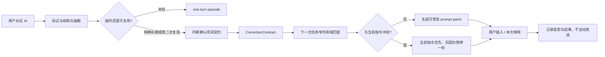

# Teach Once Memory / 教一次就记住 — 完整能力计划

> 状态：待用户决策；本文件只定义产品、交互、数据、实现与评估计划，不包含运行时代码。
>
> Demo：[`teach-once-memory-demo.html`](./teach-once-memory-demo.html)
>
> Demo 视觉约束：[`teach-once-memory-brand-spec.md`](./teach-once-memory-brand-spec.md)

## 先看用户会怎样用

### 场景一：同一条边界，不必对每个 AI 再讲一遍

Esone 在一个外部 AI 页面输入：“帮我批量评估这些 tickets，并更新评估表。”过去几次类似任务里，他已经分别强调过：先给出差异，再请求确认；没有明确授权时不要回写 Jira。

这次的体验是：

1. 用户正常输入任务，不先填写模板，也不进入规则后台。
2. 输入框上方出现一条很薄的 Personal AI 提示：“已补 2 条上次纠错 · 仅 Personal AI 项目 / Jira 评估任务”。
3. 展开后，用户看到两条被匹配的边界、各自的作用域、最近证据时间，以及“为什么匹配”。原始私密对话不外露，只显示脱敏摘要。
4. 用户选择“插入并保留”。两条边界进入当前草稿，页面明确回执：“只改草稿，未发送，也未回写外部系统。”
5. 如果某条不适用于本次，用户点“仅本次移除”；长期契约不被删除。
6. AI 随后先给 diff，等用户确认后才允许后续写入。Personal AI 不替 AI 承诺绝对遵守，而是留下本次实际投影与执行结果证据。

用户获得的不是更长的全局提示词，而是“在这个任务里，AI 终于记得我上次纠正过的做法”。

### 场景二：当前指令改变了，旧记忆不会压过用户

另一轮任务里，用户明确说：“这次直接回写 Jira，完成后给读回结果。”这与过去“不要回写 Jira”的项目契约冲突。

这次的体验是：

1. Personal AI 先识别当前输入里的显式授权，而不是机械注入旧规则。
2. 输入框上方显示：“本次指令覆盖 1 条旧契约；旧契约只暂停本轮。”
3. 用户可查看冲突双方：当前任务授权、旧契约的作用域与来源。
4. 用户继续后，旧契约没有被永久改写；现有高风险操作确认机制仍然生效。
5. 下一次没有显式授权的同类任务，旧契约继续有效。

这里最重要的体验是：记忆帮助用户，不替用户争夺控制权。

### 场景三：一次抱怨不会立刻变成永久规则

AI 直接修改了代码，用户纠正：“不是直接改；先给 plan，我确认后再实现。”Personal AI 将本轮视为一次临时纠错，不弹出阻塞式审核。

当同一项目里第二次出现独立、语义相同的纠错时，消息下方才出现一个内联问题：“你已第 2 次强调先 plan 再实现，要保存为 Personal AI 项目规则吗？”用户可选“保存项目规则”或“继续仅本次”。没有选择时不升级为长期规则。

## 为什么现在值得做

Personal AI 已经能记住事实、偏好、浏览内容、对话与操作，也能通过 Prompt Context Compiler 把相关记忆整理成草稿补丁。但真实使用里还有一类高价值信息缺少合适的表达：**用户对 AI 行为的纠正**。

这类记忆不是普通事实，也不是“我喜欢中文”这样的泛偏好。它通常有动作、顺序、禁止项、授权边界和适用范围，例如：

- 先给计划，再进入实现；
- 只读检查，不要操作页面；
- 先计算精确 diff，未确认不要写入；
- 完成写入后必须读回验证；
- 只修改明确列出的范围。

本轮对线上 `esone.qiu` 记忆做了只读聚合。在最近 180 天、2,642 条用户 authored Glip 消息中，保守关键词扫描发现至少 149 条包含“不要 / 不是 / 只需要 / 先…再或然后”等纠正或边界信号；其中至少 5 条包含“不要回写”，2 条包含“不要操作”。这些数字只是机会信号，不代表 149 条都应该成为记忆，但它说明用户确实在反复支付“重新教一遍”的成本。

与之对比，当前 User Profile 有大量事实，却几乎没有可执行的长期约束；写作风格记忆当前也是空的。缺口不是“再多存一点聊天”，而是把合适的纠错转成**带作用域、可解释、可撤销、可覆盖的行为契约**。

## 一句话定义

**教一次就记住**把用户对 AI 的自然语言纠错，转为狭窄、可审计的 `CorrectionContract`，在下一次真正相似的任务里通过现有 Prompt Context Compiler 注入草稿；当前指令永远优先，Personal AI 永不替用户发送或写入。

## 用户价值与亮点

1. **少重复解释**：把高频行为边界从聊天碎片变成可复用的任务契约。
2. **比全局 Custom Instructions 更精准**：规则默认只在同项目、同任务族、同目标或同工具范围内生效。
3. **当前输入永远优先**：本轮明确授权可临时覆盖旧契约，不污染长期状态。
4. **知道为什么出现**：每次投影都能解释来源、作用域、新鲜度和冲突。
5. **不制造新的审核工作台**：一次性纠错保持临时；需要长期化时在原对话中就地确认。
6. **能跨 AI，但不能越权**：未来可经 AI Context Passport 带到 Codex、网页 AI 或豆包，但不会扩大原契约的权限和隐私范围。
7. **可测量是否真的学会**：用 correction lag、post-feedback success、false application、override correctness 衡量，而不是只展示“已记住”。

## 能力边界

### P0/P1 要做

- 识别用户话语中的纠错、任务约束、顺序要求、禁止动作和临时例外。
- 把证据正规化为结构化候选，而不是直接保存一整段对话。
- 在相似任务中进行窄作用域匹配，并生成可预览的 prompt patch。
- 显示来源、作用域、匹配原因、当前覆盖和恢复入口。
- 记录契约是否投影、被移除、被覆盖，以及任务结果是否符合契约。

### 明确不做

- 不选择模型、工具、reasoning effort 或运行环境；这不是 Agent Run Profile。
- 不把所有“不要 / 不是”都当成偏好，也不从一次抱怨自动推断全局人格。
- 不替用户点击发送、执行代码、回写 Jira、修改文档或触发外部动作。
- 不建立第二个独立 Prompt Context Compiler；它是既有投影消费者。
- 不把规则写回原始记忆，不修改不可变的来源消息。
- 不做新的 review queue，也不要求用户定期清理规则。
- 不承诺下游模型一定遵守；必须用投影回执和结果验证呈现真实效果。

## 竞品与业内设计对比

| 产品 / 研究 | 已有能力 | 仍然留下的体验缺口 | 本方案借鉴 / 区分 |
| --- | --- | --- | --- |
| [ChatGPT Memory](https://help.openai.com/en/articles/8590148-memory-faq) | 自动记忆、可解释来源、可纠正记忆 | 显式长期行为仍主要依赖 Custom Instructions；任务级作用域有限 | 借鉴来源解释；把纠错表达为任务契约，而不是普通 memory summary |
| [ChatGPT Projects](https://help.openai.com/en/articles/10169521-projects-in-chatgpt) | 项目范围内保持聊天与文件上下文 | 仍需要用户主动维护项目指令 | 默认 project-first，避免跨场景误用 |
| [Cursor Rules](https://docs.cursor.com/context/rules) | 用户 / 项目规则，可从 Chat 生成规则 | 规则文件偏手工；更适合 coding，不天然覆盖跨 AI 记忆 | 借鉴 focused/actionable/scoped；自动发现但保守升级 |
| [GitHub Copilot custom instructions](https://docs.github.com/en/copilot/concepts/prompting/response-customization) | personal/repository/org/path 作用域与优先级 | 指令遵循非确定；用户难知道某次到底用了什么 | 每次显示投影回执，并评估实际遵循结果 |
| [Reflect with Claude](https://www.anthropic.com/news/reflect-with-claude) | 总结用户如何协作 | 偏反思报告，不是可执行、可覆盖的任务契约 | 从“认识我”前进一步到“在这类任务里照这样做” |
| [MemPrompt](https://aclanthology.org/2022.emnlp-main.183/) | 保存误解反馈，匹配相似请求并改写 prompt | 错误检索会带来新错误 | 延续 feedback patch 思路，增加作用域、权限、冲突和撤销 |
| [Feedback Adaptation for RAG](https://arxiv.org/abs/2604.06647) | inference-time feedback patch；衡量 correction lag | 研究任务与真实多工具授权边界有差距 | 把 correction lag 与 post-feedback success 作为产品 SLO |

### 关键研究结论

- MemPrompt 证明“保存误解反馈 → 在相似请求中检索 → 修改未来 prompt”无需重新训练也能有效，但误匹配会反向伤害结果。
- [User Feedback in Human-LLM Dialogues](https://aclanthology.org/2025.emnlp-main.133/) 表明隐式反馈很常见、也很噪；不能把所有纠正机械升级成长期偏好。
- [Resolving Ambiguity through Personalization](https://iclr.cc/virtual/2025/32766) 指出反馈可能部分、冲突、随时间变化，因此必须有 supersede、expiry 与 current-turn precedence。
- [PersonaMem-v2](https://arxiv.org/abs/2512.06688) 显示隐式偏好推理仍然困难，支持本方案的“窄作用域自动应用、扩大范围必须确认”。
- [MyScholarQA](https://aclanthology.org/2026.acl-long.723/) 发现真实用户能指出模型 judge 漏掉的细微个性化错误，因此验收必须包含 Esone 的真实、脱敏任务与人工判断。

## 与现有能力的去重核对

| 现有能力 | 它解决什么 | 本方案为何不是重复 |
| --- | --- | --- |
| Prompt Context Compiler | 把记忆生成 previewable prompt patch | 它是投影器；本方案提供纠错契约的发现、治理、匹配与生命周期 |
| User Profile | 事实、偏好、习惯、兴趣、普通约束 | 纠错契约有 trigger、required/forbidden action、顺序、权限、覆盖、过期和证据 |
| Memory Relevance Trainer | 用户纠正“找错了哪条记忆” | 本方案纠正“AI 应该怎样执行这类任务” |
| Memory Outcome Loop | 观察一次记忆提示后的采纳/忽略结果 | 本方案先定义可执行边界，Outcome Loop 可作为后续效果信号 |
| Agent Run Profile（已搁置） | 选择模型、工具、上下文和验证配置 | 本方案绝不选择运行配置，只保存用户自己明确表达的行为边界 |
| AI Context Passport | 跨 AI 携带任务上下文 | Passport 是运输层；本方案可输出一份最小 correction slice |
| Routine Delta / Common Ground | 重复例会变化、受众共同上下文 | 本方案不总结会议，也不推断谁知道什么 |
| Custom Instructions / rules 文件 | 手工维护全局或项目指令 | 本方案从真实纠错中发现，只在证据充分且作用域明确时复用，并保留当前轮覆盖 |

## 产品模型：CorrectionContract，而不是偏好句子

### 信号类型

抽取器必须输出下列之一：

- `correction`：纠正 AI 刚才的行为或理解；
- `task_constraint`：当前任务的禁止项、必做项或范围；
- `clarification`：修正事实/歧义，不一定可复用；
- `preference`：稳定但非执行型偏好，转给 User Profile；
- `temporary_exception`：只对本轮有效；
- `not_a_contract`：引用、讨论、否定句或普通表达，不创建候选。

### 数据契约

```ts
type CorrectionContract = {
  id: string;
  status: "candidate" | "confirmed" | "superseded" | "revoked" | "expired";
  normalizedPolicy: {
    requiredActions: string[];
    forbiddenActions: string[];
    order: string[];
    outputRequirements: string[];
    verificationRequirements: string[];
  };
  trigger: {
    taskFamily: string;
    intent: string[];
    projectId?: string;
    surface?: string;
    tool?: string;
    targetSystem?: string;
  };
  authority: "advisory" | "prompt_patch" | "execution_block";
  scope: "same_turn" | "same_surface" | "same_project" | "cross_ai";
  evidenceRefs: Array<{
    sourceIdHash: string;
    occurredAt: string;
    redactedSummary: string;
  }>;
  confidence: number;
  validFrom: string;
  expiresAt?: string;
  supersedes?: string[];
  conflictGroup?: string;
  privacyClass: "local_only" | "project_exportable" | "cross_ai_allowed";
  createdAt: string;
  lastAppliedAt?: string;
};
```

### 为什么不用一段自然语言直接存

自然语言摘要仍保留给 UI 和 prompt patch，但底层必须拆出“何时触发、必须做什么、禁止什么、顺序怎样、权限多大”。否则“不要回写 Jira”容易在“这次明确允许回写”的场景继续生效，也无法区分“不要操作页面”和“不要修改页面，但允许读取”。

## 纠错成为记忆的门槛

### 默认策略

| 证据 | 处理 | 是否长期化 |
| --- | --- | --- |
| “本次 / 这次 / 先别” | 建立 one-turn episode，用完即止 | 否 |
| 明确“以后 / 每次 / 总是” | 创建 durable candidate，原地请求确认 | 用户确认后 |
| 两次独立、语义一致的纠错 | 创建 same-project candidate，并在第二次纠错处内联询问 | 用户确认后 |
| 一次普通否定或引用内容 | 保持静默 | 否 |
| 涉及账号、凭据、隐私数据 | 先脱敏；无法安全脱敏则不创建 | 否 |

“独立”要求不同 interaction id，且不能是一轮对话里的重复转述。相似性只是候选生成条件，不是自动授权。

### P0/P1 权限上限

- 未确认候选只能 `advisory` 或 `prompt_patch`。
- `execution_block` 不在首期开放。即使未来开放，也必须由用户明确创建或确认。
- durable contract 默认 `same_project`，扩大到 `cross_ai` 需要单独明确确认。
- 从私密来源抽取的契约默认 `local_only`；跨提供商只输出经过脱敏且允许导出的规范化 policy。

## 匹配、冲突与优先级

### 匹配必须同时考虑

1. task family / intent 是否相似；
2. project、surface、tool、target system 是否在契约作用域内；
3. required/forbidden action 是否与当前任务相关；
4. 是否过期、被撤销或被 supersede；
5. 当前 prompt 是否显式覆盖；
6. 隐私等级是否允许进入当前 AI surface。

### 优先级

```text
当前轮显式指令
  > 当前轮临时例外
  > 已确认且精确作用域的 CorrectionContract
  > 项目级显式说明
  > 仅供预览的 inferred candidate
  > 一般 User Profile 偏好
```

当前轮覆盖只生成 `override_event`，不自动 supersede 旧契约。只有用户说“以后改成……”或明确编辑契约，才创建替代关系。

### 不确定时的行为

- 高相似 + 精确同项目/任务：显示 compact patch，可一键移除。
- 中等相似或作用域缺一项：只在“为什么”里列为候选，不自动插入。
- 低相似、冲突未解、来源不可导出：保持静默。
- 任何时候都不为了“显得智能”而补一条泛化规则。

## 端到端体验流程



### Composer 状态

#### A. 自动补齐

- 文案：`已补 2 条上次纠错 · Personal AI 项目 / Jira 评估`
- 默认展示摘要，不展示原始私信。
- 主操作：`插入并保留`。
- 次操作：`仅本次移除`、`为什么`。
- 回执：`已补入草稿 · 未发送 · 未写入外部系统`。

#### B. 本次覆盖

- 文案：`本次指令覆盖 1 条旧契约，旧契约只暂停本轮`
- 展开后并排显示“当前指令”与“记忆契约”，当前指令在上。
- 操作：`按本次指令继续`、`恢复旧规则`。
- 现有外部写操作确认仍保留；本能力不降低授权门槛。

#### C. 证据不足

- 不插入 badge，不制造告警。
- 用户主动打开 Personal AI 时，才显示：`没有足够相似的纠错，本次不猜。`
- 提供“添加本次边界”入口，但不诱导创建永久规则。

#### D. 再次纠错

- 第二次独立复现后在原消息下显示一行：`你已第 2 次强调先 plan 再实现，要保存为 Personal AI 项目规则吗？`
- `保存项目规则`会显示作用域并需要一次明确点击。
- `继续仅本次`立即关闭，不加入待审核队列。

## 信任契约

| 维度 | 必须让用户知道什么 | 产品实现 |
| --- | --- | --- |
| 来源 | 为什么认为这是一条纠错 | 脱敏摘要、时间、来源类型、证据数量；原文仅在权限允许时本地查看 |
| 作用域 | 在哪些项目、任务、工具生效 | 状态带与详情同时显示；默认 same-project |
| 新鲜度 | 这条规则是否仍可能有效 | last confirmed / last applied / expiry；长期未使用自动降为仅建议 |
| 隐私 | 哪些内容能跨 AI | privacyClass + secret scrub + 最小 policy export |
| 权限 | 它能影响什么 | P0/P1 只改草稿；不能发送、写入或执行 |
| 审核 | 何时需要用户决定 | 只在扩大持续时间、作用域或权限时内联确认 |
| 恢复 | 误用后怎样撤销 | 本次移除、永久撤销、恢复 superseded 版本；原始证据不改 |
| 写回 | 系统是否改变外部数据 | UI 永远明确“未发送 / 未写入”，外部写由原有机制控制 |

## 技术实现形态

### 数据表

1. `instruction_feedback_episodes`
   - 保存结构化抽取结果与分类；来源只存 hash/引用，不复制敏感正文。
2. `correction_contracts`
   - 保存上面的 `CorrectionContract`、版本、作用域、状态与 supersession。
3. `correction_contract_events`
   - append-only 记录 `matched / previewed / inserted / removed_for_turn / overridden / revoked / outcome_observed`。

所有 migration 必须可回滚；删除契约只改变契约状态，不删除原始 memory record。

### 服务边界

- `CorrectionSignalExtractor`：marker gate + 结构化 LLM extractor；没有纠错信号时跳过 LLM。
- `CorrectionContractNormalizer`：把自然语言拆成 required/forbidden/order/verification。
- `CorrectionContractService`：确认、撤销、过期、supersede、privacyClass。
- `CorrectionContractMatcher`：结合 scene identity、task family、target system 与当前 prompt。
- `CorrectionContractProjection`：只向 Prompt Context Compiler 产出最小、可解释 patch。
- `CorrectionOutcomeObserver`：读取现有任务结果/反馈事件，评估是否遵守；不自动扩大权限。

### API 草案

```http
GET  /api/v1/correction-contracts/match?scene_id=...
POST /api/v1/correction-contracts/{id}/confirm
POST /api/v1/correction-contracts/{id}/override-for-turn
POST /api/v1/correction-contracts/{id}/revoke
GET  /api/v1/correction-contracts/{id}/evidence
```

`match` 返回：

```json
{
  "decision": "apply_preview | conflict | quiet",
  "contracts": [],
  "promptPatch": "",
  "scopeReceipt": {},
  "privacyReceipt": {},
  "reasonCodes": [],
  "mustNotSend": true
}
```

写 API 必须带 expected revision / idempotency key；发生 revision conflict 时停止，不静默覆盖。

### 与现有模块集成

- **Prompt Context Compiler**：增加 `behaviorContractProjection` 输入；保持 preview → insert → undo → send 的现有边界。
- **Browser Extension / Web AI Draft Refine**：在输入框上方渲染 compact correction band；不依赖第三方页面内部数据写入。
- **User Profile**：普通偏好继续进入 profile；CorrectionContract 只引用必要的 profile scope，不混表。
- **Memory Outcome Loop**：可消费 `inserted / removed / overridden` 和结果信号，不能自行升级 contract authority。
- **AI Context Passport**：P2 才输出经过隐私过滤的 correction slice；目标 AI 不获得原始证据。
- **Doubao / Codex surfaces**：复用同一 match/projection contract，不各自维护一份规则。

## 隐私、安全与失败模式

### 敏感信息

- 抽取前运行 secret / token / email / internal URL / query-string scrubber。
- 无法安全概括时直接 `not_a_contract`，不进入 LLM extractor。
- evidence endpoint 默认只返回摘要；查看原文复用现有来源权限。
- 跨 AI 投影只包含 normalized policy 与 scope，不带人物、消息或链接。

### Prompt injection

- 网页、Jira 描述、转发消息、引用块里的“以后都要……”不能成为用户契约。
- 只把可信 user-authored turn 或明确本地操作作为候选来源。
- 来源文本当数据解析；任何要求改变系统行为、读取秘密或扩大权限的内容均拒绝。

### 典型失败与处理

| 失败 | 后果 | 处理 |
| --- | --- | --- |
| 普通否定被误判为长期规则 | 错误 patch | 双阶段分类；没有独立证据不升级；false-application eval |
| 跨项目误用 | 任务受旧规则干扰 | exact project/task/target gate；默认 quiet |
| 旧规则压过当前授权 | 用户失去控制 | current-turn precedence；只暂停一轮 |
| 规则互相冲突 | prompt 自相矛盾 | conflict group + latest confirmed/specific scope；无法解则不注入 |
| 规则越积越多 | prompt 膨胀 | coreset selection；每轮最多 3 条、按影响排序；过期降级 |
| 下游模型没有遵守 | 用户误以为有保证 | 投影与结果分开记录；UI 不说“已执行”，只说“已补入草稿” |
| 纠错中含秘密 | 二次泄露 | pre-extraction scrub + zero-leakage gate |

## 分阶段实施

### Phase 0：离线分类器与契约模型

- 建立 tables、types、secret scrub 与来源可信边界。
- 用真实、脱敏的 `esone.qiu` correction/no-correction 对建立 extraction eval。
- 实现 one-turn episode；不做任何跨轮自动应用。
- 产出回放工具，能解释每个样本为何 create / skip。
- Gate：precision、privacy、scope、override 测试全部达标后才进入 P1。

### Phase 1：Compose Assist 同项目闭环

- 只支持同项目 + 同 task family + 同 target system。
- durable contract 仅来自明确长期表达或第二次独立纠错后的用户确认。
- UI 实现 `自动补齐 / 本次覆盖 / 证据不足 / 再次纠错` 四个状态。
- 只生成 previewable prompt patch；复用现有 insert/undo/no-send 保障。
- 建立 projection/outcome events 与可撤销契约版本。

### Phase 2：跨 AI 最小携带

- 通过 AI Context Passport 输出经过脱敏的 correction slice。
- 对每个目标 surface 单独确认 `cross_ai_allowed`，不从同项目默认外推。
- 先覆盖 Web AI Draft Refine 和 Codex 场景，再评估 Doubao。
- 任何缺少 surface identity 或 authority receipt 的请求安全停止。

### Phase 3：结果学习与压缩

- 与 Memory Outcome Loop 联动，识别 contract 是否真正减少重复纠错。
- 对相似 contract 做 coreset 合并建议，但不自动合并冲突条目。
- 长期未命中的 contract 降为 advisory 或过期；恢复仍可追溯。

## 必须建立的 evals

这个能力涉及 LLM 分类、检索/匹配、个性化生成、漂移、隐私与权限，**实现时必须创建新的 `evals/` suite，运行 report，并持续修正直到所有必过项通过**。不能只靠 unit test 或 Demo 视觉判断。

### Suite

- suite id：`teach-once-memory`
- registry：纳入现有 eval registry 与 CI 验证。
- 数据：优先从线上 `esone.qiu` memory service 只读抽取真实场景，再去标识化、删除秘密与链接；数据不足时才补合成边界 case。
- 每个 case 保存：source turn、previous AI behavior、scene identity、expected classification、expected scope、current prompt、expected projection、expected outcome。

### 真实场景覆盖

1. 读取浏览器页面但不要操作；
2. 生成评估结果但不要回写 Jira；
3. 先给 plan，确认后再实现；
4. 当前轮明确允许写回，旧 no-writeback 契约只暂停一轮；
5. “这次先别”只做 one-turn，不升级；
6. 同一规则第二次独立复现后才出现确认；
7. 两条相反纠错的 supersede 与 conflict；
8. 跨项目相似任务不误用；
9. 过期契约不自动注入；
10. 引用文本与网页 prompt injection 不成为契约；
11. 带 token/email/internal URL 的纠错零泄露；
12. 没有足够证据时 quiet，不生成“贴心”规则。

### 指标与门槛

| 指标 | P1 必过目标 |
| --- | --- |
| correction/constraint extraction precision | ≥ 0.95；宁可漏，不可错存 |
| scope exact match accuracy | ≥ 0.95 |
| current-turn override correctness | 100% |
| unauthorized send/write action | 0 |
| sensitive literal leakage | 0 |
| false application rate | ≤ 2% |
| correction lag | 下一次真正相似 interaction 即可生效 |
| post-feedback task success | 相比无 contract baseline 显著提升；真实用户确认 |
| quiet-state correctness | ≥ 0.95 |
| explanation/source receipt completeness | 100% |

### 报告与迭代

实现完成后必须：

1. 运行 `npm run eval:validate`；
2. 运行 `npm run eval:run -- --suite teach-once-memory --no-repair`；
3. 生成含 baseline / candidate、逐 case 失败原因、隐私 gate、人工复核结果的 report；
4. 若改动触及 memory write/recall 通路，再运行 `npm run eval:run:memory-abilities:benchmark`；
5. 任一 hard gate 未通过都不得宣布完成；调整 extractor、matcher 或 scope policy 后重跑，直到所有测试通过；
6. 至少由 Esone 对 10 个真实、去标识任务做人工判定，避免只依赖 LLM judge。

## 成功指标

### 北极星

在相似任务中，用户为同一行为边界再次输入纠错的比例下降，同时没有增加错误规则注入。

### 领先指标

- matched contract 被保留/插入的比例；
- `仅本次移除` 与 `本次覆盖` 比例；
- 相同 correction cluster 的再次纠错间隔；
- prompt patch 后任务一次通过率；
- quiet state 占比与误触发率；
- durable candidate 的确认 / dismiss 比例。

### Guardrails

- 任何自动外部写入、发送或执行：0；
- credential / private-source literal leakage：0；
- cross-project/cross-AI scope violation：0；
- 当前指令被旧 contract 压制：0；
- UI 文案把“已投影”说成“已执行”：0。

## 发布、观测与回滚

1. 先以 developer-only offline replay 发布 P0，不写任何 contract。
2. P1 feature flag 仅对 Personal AI 项目开启；默认只显示 preview。
3. 记录 reason code、contract revision、scene hash、用户动作和结果，不记录未脱敏正文。
4. 发现 false application 时可按 contract、project、surface 或 feature flag 四级关闭。
5. 回滚 UI 或 matcher 不删除 contract；契约仍可导出、撤销和审计。
6. schema migration 必须有 down path；append-only event 不做 destructive cleanup。

## 实现完成后的文档维护

功能最终实现、eval 全部通过后，必须把关键点与关键逻辑精简维护进正式文档：

- 在 `desktop-app/docs/features/assist.md` 记录 correction projection、preview/insert/undo/no-send 边界；
- 在 `desktop-app/docs/features/user_profile_system.md` 记录为什么行为契约与普通 profile item 分表、如何处理确认与隐私；
- 如果数据模型与 lifecycle 已足够独立，新建 `desktop-app/docs/features/teach_once_memory.md`，否则并入上面两份，避免重复文档；
- 更新 `docs/index.md` 的能力索引与状态；
- 将稳定后的交互示例迁入 `docs/demo/`，并按 progressing 规则清理本计划与概念 Demo。

正式文档必须包含：能力边界、优先级、作用域、数据契约、隐私/权限、失败恢复、eval suite 与可复现验证命令。

## 本轮交付边界与决策点

本轮只交付计划、品牌约束与可点击 Demo：不修改 runtime、数据库、eval registry、浏览器扩展，也不写入 Reminder。Reminder 的 `Personal AI` 列表当前没有未完成的新功能 idea，因此本 idea 来自线上记忆的聚合信号与业内研究，不需要标记任何 Reminder 为 done。

建议的决策标准：如果你认可“纠错应该成为任务级行为契约，而不是全局偏好”，就进入 Phase 0；如果你更希望它自动成为跨 AI 全局规则，应先停下来重新讨论权限与误用成本，不建议直接扩大首期范围。
