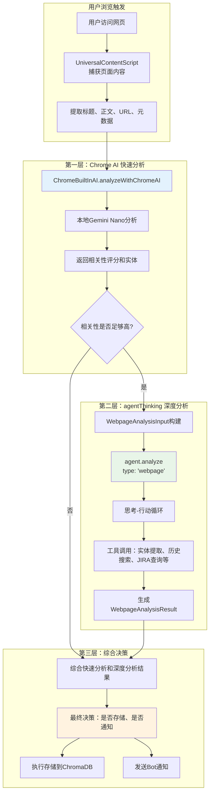

# 网页分析集成使用指南

> 说明：本文描述的是早期网页分析集成方案，不等同于当前真正注入和生效的网页记忆提示实现。当前代码说明请优先参考 `docs/features/webpage_memory_detection.md`。

*最后更新: 2024-12-20*

## 🎯 概述

智能网页分析集成功能将Chrome内置AI的快速分析能力与agentThinking的深度分析能力完美结合，实现了**本地快速筛选 + 云端深度分析**的分层架构，为用户提供智能、高效、精准的网页内容分析服务。

## 🏗️ 系统架构



## 🚀 快速开始

### 1. 基本使用

```typescript
import { WebIntelligenceIntegrator } from '../web-intelligence/WebIntelligenceIntegrator';

// 创建集成器实例
const integrator = new WebIntelligenceIntegrator();

// 配置分析参数
const config = {
  enableChromeAI: true,
  chromeAIRelevanceThreshold: 0.6, // 相关性超过60%才触发深度分析
  agentConfig: {
    analysisDepth: 'normal',
    maxActions: 3,
    preferredTools: ['entityExtraction', 'historySearch', 'storeMessage']
  },
  userContext: {
    currentProjects: ['前端重构', '移动端开发'],
    concernedTopics: ['性能优化', '用户体验', 'React'],
    teamMembers: ['张三', '李四', '王五']
  }
};

// 分析网页内容
const pageContent = {
  title: "React 18 性能优化最佳实践",
  url: "https://blog.example.com/react-18-performance",
  mainContent: `
    React 18 引入了许多性能优化特性，包括：
    1. Concurrent Features - 并发特性
    2. Automatic Batching - 自动批处理
    3. New Suspense Features - 新的Suspense特性
    
    这些特性可以显著提升应用性能，建议团队在下个版本中采用。
    预计实施时间：2024年Q1
    负责人：前端团队
  `,
  domain: "blog.example.com",
  metadata: {
    publishDate: "2024-12-15",
    author: "React 专家",
    tags: ["React", "性能", "最佳实践"]
  }
};

// 执行集成分析
const result = await integrator.analyzeWebpage(pageContent, config);

console.log('分析结果:', result);
```

### 2. 分析结果解读

```typescript
// 检查分析流程
console.log('Chrome AI使用:', result.analysisFlow.chromeAIUsed);
console.log('深度分析触发:', result.analysisFlow.deepAnalysisTriggered);
console.log('总处理时间:', result.analysisFlow.totalProcessingTime);

// 快速分析结果
console.log('快速分析相关性:', result.quickAnalysis.confidence);
console.log('建议存储:', result.quickAnalysis.suggestedStorage);

// 深度分析结果（如果有）
if (result.deepAnalysis) {
  console.log('深度分析总结:', result.deepAnalysis.summary);
  console.log('提取的实体:', result.deepAnalysis.extractedEntities);
  console.log('关联项目:', result.deepAnalysis.relatedProjects);
  console.log('行动建议:', result.deepAnalysis.actionSuggestions);
}

// 最终决策
console.log('最终决策:', result.finalDecision);
```

## 🔧 高级配置

### 1. 自定义分析阈值

```typescript
const advancedConfig = {
  enableChromeAI: true,
  chromeAIRelevanceThreshold: 0.5, // 降低阈值，更多内容触发深度分析
  
  agentConfig: {
    analysisDepth: 'deep', // 使用深度分析模式
    maxActions: 5, // 允许更多工具调用
    preferredTools: [
      'entityExtraction',   // 实体提取
      'historySearch',      // 历史搜索
      'jiraQuery',          // JIRA查询
      'orgChart',           // 组织架构查询
      'storeMessage',       // 存储到知识库
      'messageNotification' // 发送通知
    ]
  },
  
  userContext: {
    currentProjects: ['项目A', '项目B'],
    concernedTopics: ['紧急', '重要', '截止日期'],
    teamMembers: ['团队成员列表']
  }
};
```

### 2. 批量网页分析

```typescript
const pages = [
  { title: "项目更新1", url: "...", mainContent: "..." },
  { title: "项目更新2", url: "...", mainContent: "..." },
  { title: "技术文档", url: "...", mainContent: "..." }
];

const results = await integrator.analyzeBatch(pages, config, (result, index) => {
  console.log(`页面 ${index + 1} 分析完成:`, result.finalDecision);
});

console.log(`批量分析完成，共处理 ${results.length} 个页面`);
```

### 3. 手动触发深度分析

```typescript
// 跳过Chrome AI筛选，直接进行深度分析
const deepResult = await integrator.forceDeepAnalysis(pageContent, config);

console.log('强制深度分析结果:', deepResult);
```

## 📊 性能优化建议

### 1. Chrome AI状态检查

```typescript
// 检查Chrome AI可用性
const chromeAIStatus = integrator.getChromeAIStatus();

console.log('Chrome AI状态:', chromeAIStatus);

if (!chromeAIStatus.isAvailable) {
  console.warn('Chrome AI不可用，将使用规则引擎作为后备');
}
```

### 2. 分析结果缓存

```typescript
class WebpageAnalysisCache {
  private cache = new Map<string, IntegratedAnalysisResult>();
  private cacheTimeout = 30 * 60 * 1000; // 30分钟

  async analyzeWithCache(
    pageContent: PageContent,
    config: WebIntelligenceIntegrationConfig
  ): Promise<IntegratedAnalysisResult> {
    const cacheKey = this.generateCacheKey(pageContent);
    
    // 检查缓存
    const cached = this.cache.get(cacheKey);
    if (cached && this.isCacheValid(cached)) {
      console.log('📦 使用缓存结果');
      return cached;
    }
    
    // 执行分析
    const result = await integrator.analyzeWebpage(pageContent, config);
    
    // 缓存结果
    this.cache.set(cacheKey, result);
    
    return result;
  }
  
  private generateCacheKey(pageContent: PageContent): string {
    return `${pageContent.url}:${pageContent.title}:${pageContent.mainContent.length}`;
  }
  
  private isCacheValid(result: IntegratedAnalysisResult): boolean {
    const age = Date.now() - (result.quickAnalysis.reasoning.includes('时间戳') ? 0 : Date.now());
    return age < this.cacheTimeout;
  }
}
```

## 🛠️ 实际应用场景

### 场景1：技术文档分析

```typescript
const techDocAnalysis = async (docUrl: string) => {
  const pageContent = await extractPageContent(docUrl);
  
  const config = {
    enableChromeAI: true,
    chromeAIRelevanceThreshold: 0.7, // 技术文档要求较高相关性
    agentConfig: {
      analysisDepth: 'deep',
      preferredTools: ['entityExtraction', 'historySearch', 'storeMessage']
    },
    userContext: {
      concernedTopics: ['API文档', '技术栈', '最佳实践', '架构设计']
    }
  };
  
  const result = await integrator.analyzeWebpage(pageContent, config);
  
  if (result.finalDecision.shouldStore) {
    console.log('📚 技术文档已存储到知识库');
  }
  
  return result;
};
```

### 场景2：项目进度监控

```typescript
const projectUpdateAnalysis = async (updateUrl: string) => {
  const pageContent = await extractPageContent(updateUrl);
  
  const config = {
    enableChromeAI: true,
    chromeAIRelevanceThreshold: 0.5, // 项目更新敏感度较高
    agentConfig: {
      analysisDepth: 'normal',
      preferredTools: ['entityExtraction', 'jiraQuery', 'messageNotification']
    },
    userContext: {
      currentProjects: ['当前活跃项目列表'],
      concernedTopics: ['延期风险', '资源短缺', '里程碑', '交付日期']
    }
  };
  
  const result = await integrator.analyzeWebpage(pageContent, config);
  
  // 检查是否有风险需要通知
  if (result.deepAnalysis?.actionSuggestions?.some(s => s.priority === 'urgent')) {
    console.log('⚠️ 检测到紧急项目风险，已发送通知');
  }
  
  return result;
};
```

### 场景3：竞品分析

```typescript
const competitorAnalysis = async (competitorUrl: string) => {
  const pageContent = await extractPageContent(competitorUrl);
  
  const config = {
    enableChromeAI: true,
    chromeAIRelevanceThreshold: 0.4, // 竞品信息收集门槛较低
    agentConfig: {
      analysisDepth: 'deep',
      preferredTools: ['entityExtraction', 'historySearch', 'storeMessage']
    },
    userContext: {
      concernedTopics: ['产品功能', '价格策略', '技术架构', '用户反馈', '市场动态']
    }
  };
  
  const result = await integrator.analyzeWebpage(pageContent, config);
  
  if (result.finalDecision.shouldStore) {
    console.log('🔍 竞品信息已收集并存储');
  }
  
  return result;
};
```

## 🔧 故障排除

### 常见问题

**Q: Chrome AI不可用怎么办？**
A: 系统会自动降级到规则引擎分析，确保功能正常运行。

**Q: 深度分析消耗太多资源？**
A: 调高`chromeAIRelevanceThreshold`阈值，减少深度分析触发频率。

**Q: 分析结果不够准确？**
A: 完善`userContext`信息，提供更多上下文帮助AI理解。

### 调试模式

```typescript
// 启用详细日志
const debugConfig = {
  ...config,
  agentConfig: {
    ...config.agentConfig,
    analysisDepth: 'deep',
    maxActions: 1 // 限制行动次数便于调试
  }
};

const result = await integrator.analyzeWebpage(pageContent, debugConfig);

// 查看思考过程
if (result.deepAnalysis?.thoughtProcess) {
  result.deepAnalysis.thoughtProcess.forEach((step, index) => {
    console.log(`步骤 ${index + 1}:`, step);
  });
}
```

## 🎯 最佳实践

1. **合理设置阈值**：根据业务需求调整`chromeAIRelevanceThreshold`
2. **优化用户上下文**：提供准确的项目和关注话题信息
3. **定期清理缓存**：避免内存占用过多
4. **监控性能指标**：关注分析耗时和准确率
5. **错误处理**：妥善处理网络异常和分析失败情况

这个集成方案完美融合了本地AI的速度优势和云端AI的智能优势，为您的项目管理系统提供了强大的网页内容分析能力！🚀
